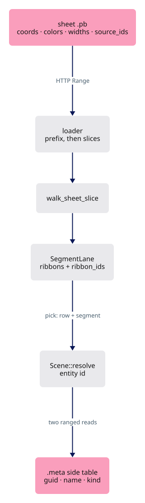
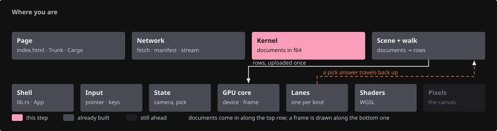
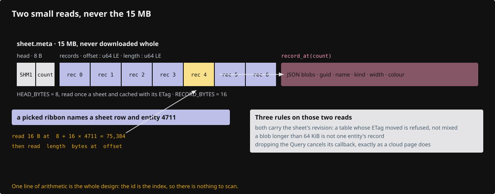
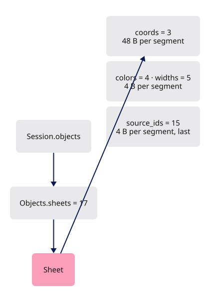
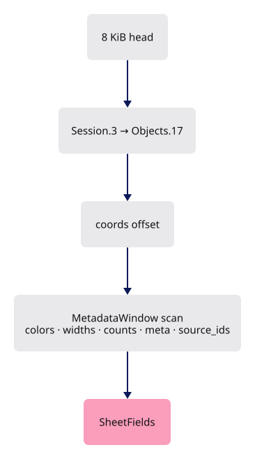
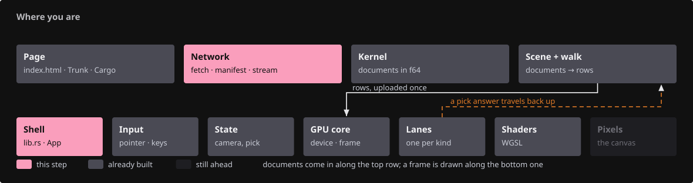
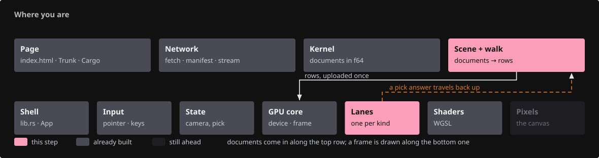
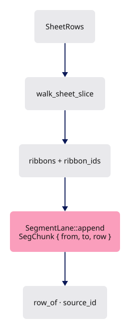
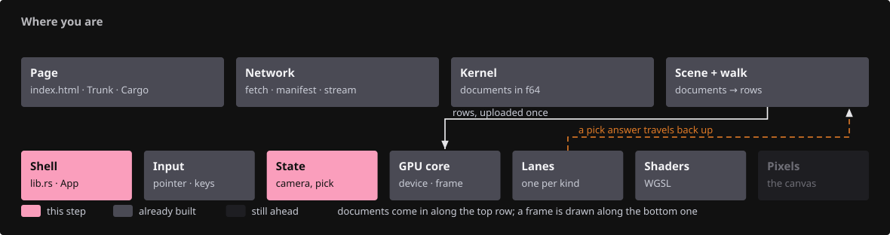
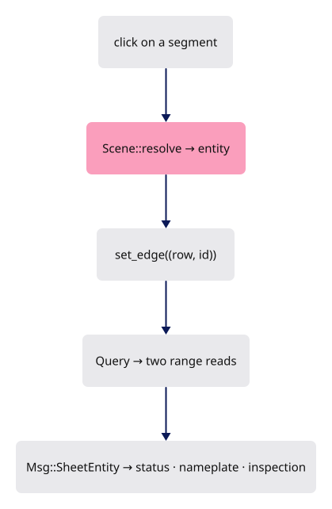

# 19 · Sheets: batched drawings with lazy metadata

## You are building

A drawing sheet is tens of thousands of lines sharing one pen. As objects, each line costs a GUID string, a name, a colour and four copies of itself between the bytes and the GPU: a 51 MB sheet lifts the wasm heap by 300 MiB and an old machine dies without a word. This lesson publishes a sheet as one segment batch, every segment carrying a small source id, streams it by byte range like a point cloud, and fetches an entity's GUID, name and kind from a side table only on selection.

## Starting point

Checkpoint 18. A whole-file sheet decodes into the kernel, one object per line; streamed point clouds already locate their arrays by scanning protobuf tags and read any slice by range.

<!-- step-status: start -->

**Does it compile yet?** `cargo check` passes after steps 1–3 and 9; steps 4–8 fail and build again at step 9.

<!-- step-status: end -->

## Part A · The format

### Step 1 · A message that can be sliced

{ .locator data-strip="illustrations/strip-a1fbe46b03.svg" }

- `Sheet` mirrors `PointCloud`: the big arrays are packed fixed-width fields, so a slice of segments `[from, to)` is one HTTP Range per array.
- Per segment: `coords` holds six doubles, `colors` one RGBA8, `widths` one float in mm, `source_ids` one entity id.
- `source_ids` is field 15, the last, so a reader knows the message ends with it.
- `Objects.sheets` is field 17, the highest in `Objects`; a sheet file is a `Session` whose `Objects` holds exactly one `Sheet` and nothing else.
- The side table is not protobuf: `SHM1`, a record count, one `(offset, length)` pair per entity, then the JSON blobs.
- Entity id is the record index, so reading an entity costs one 16-byte read and one blob read.

<!-- file: 19 session_proto/sheet.proto copy -->

<!-- file: 19 session_proto/objects.proto copy -->

### Step 2 · The kernel tolerates the field

{ .locator data-strip="illustrations/strip-a1fbe46b03.svg" }

- The generated Rust module gains the message; the kernel's own `Objects` serializer names the new field and never reads it.
- A kernel that loads a sheet file sees an empty session, which is why the viewer never hands a sheet to the kernel.

<!-- file: 19 session_rust/src/proto/session_proto.rs copy -->

<!-- file: 19 session_rust/src/objects.rs copy -->

### Step 3 · The publisher

- `mk_sheet` is supplied: it loads a kernel session, walks every line, polyline and NURBS curve in world placement, samples curves with the viewer's own chord rule, and writes the sheet with its side table.
- A 51 MB sheet of 90 000 lines becomes a 5.5 MB batch and a 15 MB table nobody downloads whole.

<!-- supplied: 19 -->

## Part B · Reading by range

### Step 4 · Locate every array

{ .locator data-strip="illustrations/strip-2c1e2b3b5e.svg" }

- `descend_message` now accepts either container: `Objects.pointclouds` at 8 or `Objects.sheets` at 17, and still requires the wanted field to close the message.
- `sheet_fields` reads the first 8 KiB, walks to `coords`, then scans the later fields through the `MetadataWindow`, recording every array's absolute offset and length plus `segment_count`, `entity_count` and the side table's name.
- A count that disagrees with the array lengths refuses the file.
- `fetch_sheet_slice` is four revision-checked range reads for one slice, returned as `SheetRows`.

<!-- file: 19 session_viewer/src/app/stream.rs type -->

### Step 5 · Prefix, then slices

{ .locator data-strip="illustrations/strip-1f4315efb0.svg" }

- `sheet_prefix` sits beside `stream_prefix` and is tried right after it: a sheet is always streamed, never decoded whole.
- The prefix is up to 500 000 segments; `spawn_sheet_rest` continues in 500 000-segment slices, under the same generation discipline as clouds and its own page-wide budget of 3 000 000 segments (`?segments=`).
- `Msg::Sheet` carries the first slice with the fields; `Msg::SheetChunk` each later one.

<!-- file: 19 session_viewer/src/app/loader.rs type -->

<!-- file: 19 session_viewer/src/lib.rs type -->

- The sheet messages join the event loop: a prefix, its later slices, and the resolved entity, each an arm beside the cloud's.

## Part C · One batch on the GPU

### Step 6 · Segments with source ids

{ .locator data-strip="illustrations/strip-378c48058c.svg" }

- `walk_sheet_slice` turns a slice into ribbon segments: one `CylinderSegment` each, the sheet's single object row as instance, the pen from the width with 0 as the hairline, no chains, and the segment's source id beside it.
- `SegRows.ribbon_ids` travels with the ribbons; `SegmentLane::append` uploads real ids where it used to upload `u32::MAX`.
- Each upload records a `SegChunk`, so `row_of` and `source_id` map a picked global ribbon row back to its sheet and entity.

<!-- file: 19 session_viewer/src/app/walk/sheet.rs type lines=1-65 -->

<!-- file: 19 session_viewer/src/app/walk/sheet.rs copy lines=66-109 -->

<!-- file: 19 session_viewer/src/app/walk/mod.rs type -->

- The producer list gains the sheet slice — a producer fed by the network rather than by a document.

<!-- file: 19 session_viewer/src/engine/gpu/segments.rs type -->

- That map is what lets a picked line in a 90 000-line drawing name itself.

### Step 7 · One row per sheet

{ .locator data-strip="illustrations/strip-6f8f40e8fe.svg" }

- `add_sheet` pushes one object row with `FLAG_SHEET` and an empty display-only document, the shape a streamed cloud uses; `extend_sheet` appends later slices.
- `Scene::resolve` gains a sibling of the cloud branch: a pick whose sub-id has the ribbon bit and whose row is a sheet resolves to `Picked { entity }`.

<!-- file: 19 session_viewer/src/app/scene.rs type -->

## Part D · Metadata when asked

### Step 8 · Two ranged reads

{ .locator data-strip="illustrations/strip-1f4315efb0.svg" }

- `sheet_query` transcribes the cloud's source query: the table head is read once per sheet and cached with its ETag.
- An entity then costs the 16-byte record at `8 + 16 · id` and its blob, both refused if the table's revision moved.
- `EntityMeta` parses the JSON's guid, name, kind, width and colour; blobs over 64 KiB are refused. Dropping a `Query` cancels its callback.

<!-- file: 19 session_viewer/src/app/sheet_query.rs type lines=1-58 -->

- `record_at(count)` is where the blobs begin: two small reads for one entity instead of a scan.

<!-- file: 19 session_viewer/src/app/sheet_query.rs type lines=59-101 -->

<!-- file: 19 session_viewer/src/app/sheet_query.rs type lines=102-129 -->

- One entity read, scheduled as a task and retired by generation — the same discipline as a cloud page, and the same failure mode.

<!-- file: 19 session_viewer/src/app/sheet_query.rs copy lines=130-244 -->

<!-- file: 19 session_viewer/src/app/mod.rs type -->

- The app module list, complete: what a scene is, how it arrives, how it is driven — and still not one wgpu type named in it.

### Step 9 · Selection and the status line

{ .locator data-strip="illustrations/strip-0f961b16dc.svg" }

- An entity pick reuses the edge selection: `set_edge((row, id))` highlights the entity's segments and the status line says "Selected entity {id}, fetching…".
- `Msg::SheetEntity` replaces it with the name and kind once the reads land; the resolved entity is cached on the `SheetBatch`, so the nameplate shows its name instead of the file's.
- A new selection or `Clear` drops a pending query.

<!-- file: 19 session_viewer/src/state.rs type -->

<!-- file: 19 session_viewer/src/state/sheet_query.rs type -->

- State's third companion, owning the in-flight entity lookup and nothing else — which is why it is a file rather than more of `state.rs`.

<!-- file: 19 session_viewer/src/app/inspection.rs type -->

- The snapshot gains `sheet_entity`: select a line and the resolved guid, name and kind appear there, so the checkpoint is verified from an attribute rather than the screen.

<!-- check: 19 -->

## Check

<!-- checkpoint: 19 -->

Open <http://localhost:8780/?scene=view_sheets&inspect=1>. Two sheets stream in; the console reports each as "N of N segments on screen, M entities". Click a line: the status reads "Selected entity … fetching…", names the entity within a second, and `data-viewer-inspection` carries `sheet_entity` with its guid, name and kind. The wasm heap stays near 20 MiB; the same sheets as objects took 340 MiB.

## What changed

<!-- tree: 19 session_viewer/src -->

- A sheet is one object row and one draw, with a source id per segment instead of an object per line.
- Segments arrive in ranged slices under a segment budget; metadata arrives per entity, on selection, in two small reads.
- The kernel format gains `Sheet` and `Objects.sheets`; the kernel itself ignores them.

## Try

- Publish a sheet of your own: `cargo run --example mk_sheet --target x86_64-unknown-linux-gnu -- in.pb out.pb` prints `out.pb: N segments, M entities, … B pb, … B meta, skipped [...]` beside the two files it wrote; upload the `.pb` and `.meta` side by side, name the `.pb` in a manifest, and the whole sheet draws as one object row.
- Add `&segments=200000` and watch the second sheet stop at the budget; the status line names the sheet that stayed out.
- Select an entity, then open the network panel: exactly two range requests against the `.meta` file, 16 bytes and the blob.

## Questions and answers

**The same drawing costs 340 MiB as objects and 20 MiB as a sheet. Where did the memory actually go?**

*How to work it out.* Count per line, not per drawing. As an object each line carries a GUID string, a name, a colour, a kernel object, an entry in the lookup, a tree node, a graph node — and then a copy of itself at each stage between the decoded protobuf and the GPU. Multiply by 90 000 and compare with the geometry: six doubles per line.

*The answer.* Into per-item overhead, not geometry. When a format is 90 000 of something, the per-item cost *is* the cost — which is why a sheet is one object row with a small source id per segment, and why the same file drops from 51 MB to 5.5 MB plus a side table nobody downloads whole.

**Metadata is fetched per entity, on selection, in two small reads. Why is the side table not protobuf?**

*How to work it out.* Ask how you find record number 4 000 in each format. Protobuf is a stream of tag-length-value: you must walk from the start. Now design the minimum format that supports random access: a count, then fixed-size offset/length pairs, then the blobs.

*The answer.* `SHM1` makes the entity id an index — one 16-byte read at `8 + 16 · id`, then the blob. Choose the format from the access pattern: protobuf is the right choice for the geometry arrays in the same system.

**A selected entity highlights all its segments with no shader change. How?**

*How to work it out.* Ask what the ribbon shader already does with selection: it compares each segment's `source_edges` value against the edge selection. Then ask what a sheet puts in that slot.

*The answer.* The entity id. The feature was free because an earlier lesson put "which source thing is this segment part of" in a general slot rather than an edge-specific one.

**`descend_message` requires the wanted field to close the message. Why insist on that?**

*How to work it out.* You are locating arrays by scanning tags without decoding the payload. Ask how you know an array's length is the real one: only if the message it sits in is accounted for to its end. A prefix of a protobuf message is itself a parseable protobuf message.

*The answer.* Requiring the field to close the message proves the reader found the real end rather than a prefix that happened to parse — so a slice boundary can be trusted. A range read that guesses the end returns truncated data, and truncated geometry looks like geometry.

**What you should be able to do now**

List what genuinely had to be new for sheets, then judge whether sharing code with clouds would help. New: the `Sheet` message and its field numbers, the `SHM1` side table, `walk_sheet_slice`, the `FLAG_SHEET` row and the resolve branch. Reused unchanged: generations, budgets, ranged reads, the metadata window, query cancellation, the segment lane. Either judgement is defensible: a shared "streamed batch" abstraction would remove real duplication in the paging loop, but clouds and sheets differ in what a slice *becomes* (splat records against ribbon segments) and in what a pick means, so it would branch at every interesting point. Make your call and say why.

## Next

[20 · The document](20-history.md): undo, redo and save in the kernel.
