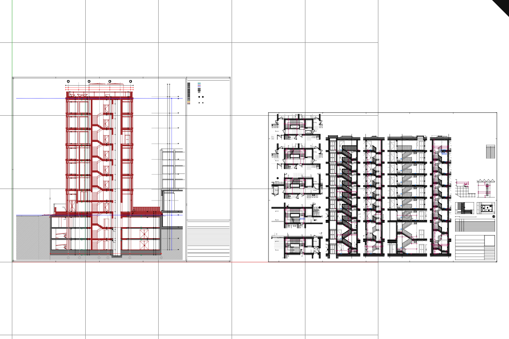

# 19 · Sheets: batched drawings with lazy metadata

Two vector sheets stream into top view and clicking a segment resolves its source entity.


## Step 1 · session_proto/sheet.proto

Read this source file from its link; the checkpoint already contains it.

??? example "`session_proto/sheet.proto` · read only"

    [Open the full listing](kernel/sheet_proto.md)
    

Copy each file from the lesson folder to the path shown.

Copy from `lessons/19/` (tooling this checkpoint needs but the course does not teach):

- `lessons/19/examples/mk_sheet.rs`

## Step 2 · src/app/stream.rs

Streaming reads bounded chunks and keeps stable source addresses.

`lessons/19/src/app/stream.rs` · edit · type this

Added after the `pub revision: Option<String>,` line in `struct CloudFields` of `lessons/18/src/app/stream.rs`

```rust
--8<-- "lessons/19/src/app/stream.rs:step-2a"
```

Replaces the `` line of `lessons/18/src/app/stream.rs`

```rust
--8<-- "lessons/19/src/app/stream.rs:step-2b"
```

Replaces the `if field == 4 || length > NAME_BYTES {` line in `fn cloud_layout` of `lessons/18/src/app/stream.rs`

```rust
--8<-- "lessons/19/src/app/stream.rs:step-2c"
```

Replaces the doc line of `fn descend_message` in `lessons/18/src/app/stream.rs`

```rust
--8<-- "lessons/19/src/app/stream.rs:step-2d"
```

Replaces the `if want == 8 && parent_end != Some(next) {` line in `fn descend_message` of `lessons/18/src/app/stream.rs`

```rust
--8<-- "lessons/19/src/app/stream.rs:step-2e"
```

Replaces the `if raw.len() as u64 != u64::from(count).check…` line in `fn checked_positions` of `lessons/18/src/app/stream.rs`

```rust
--8<-- "lessons/19/src/app/stream.rs:step-2f"
```

Delete the 2 lines from `#[cfg(any(target_arch = "wasm32", test))]` of `lessons/18/src/app/stream.rs`.

```rust
--8<-- "lessons/19/src/app/stream.rs:step-2h"
```

Added after the `}` line of `lessons/18/src/app/stream.rs`

```rust
--8<-- "lessons/19/src/app/stream.rs:step-2i"
```

Added after the `use crate::app::fetch::{GetOpts, fetch_range,…` line in `mod web` of `lessons/18/src/app/stream.rs`

```rust
--8<-- "lessons/19/src/app/stream.rs:step-2j"
```

Replaces the 7 lines from `fields: &CloudFields,` in `fn read` of `lessons/18/src/app/stream.rs`

```rust
--8<-- "lessons/19/src/app/stream.rs:step-2k"
```

Replaces the `.read(url, at, 64.min(fields.end - at), fields)` line in `fn cloud_lod` of `lessons/18/src/app/stream.rs`

```rust
--8<-- "lessons/19/src/app/stream.rs:step-2l"
```

Replaces the `let raw = window.read(url, body, length, fiel…` line in `fn cloud_lod` of `lessons/18/src/app/stream.rs`

```rust
--8<-- "lessons/19/src/app/stream.rs:step-2m"
```

Added after the `Some((colors, body_end(at, used as u64, end)?))` line in `fn fetch_colors` of `lessons/18/src/app/stream.rs`

```rust
--8<-- "lessons/19/src/app/stream.rs:step-2n"
```

Added after the `}` line in `mod tests` of `lessons/18/src/app/stream.rs`

```rust
--8<-- "lessons/19/src/app/stream.rs:step-2o"
```

## Step 3 · src/app/loader.rs

The loader stages manifest and geometry work before publishing it.

`lessons/19/src/app/loader.rs` · edit · type this

Replaces the 5 lines from `use super::scene::{FileDoc, Scene, StreamedIn…` of `lessons/18/src/app/loader.rs`

```rust
--8<-- "lessons/19/src/app/loader.rs:step-3a"
```

Added after the `const STREAM_MIN_PREFIX: u32 = 250_000;` line of `lessons/18/src/app/loader.rs`

```rust
--8<-- "lessons/19/src/app/loader.rs:step-3b"
```

Added after the `static RESIDENT: Cell<u32> = const { Cell::ne…` line in `const STREAM_MIN_PREFIX` of `lessons/18/src/app/loader.rs`

```rust
--8<-- "lessons/19/src/app/loader.rs:step-3c"
```

Added after the `RESIDENT.set(0);` line in `fn clear_scene` of `lessons/18/src/app/loader.rs`

```rust
--8<-- "lessons/19/src/app/loader.rs:step-3d"
```

Added after the `RESIDENT.set(RESIDENT.get().saturating_add(n));` line in `fn budget_spend` of `lessons/18/src/app/loader.rs`

```rust
--8<-- "lessons/19/src/app/loader.rs:step-3e"
```

Added after the `let mut staged_points = 0u32;` line in `fn load_route` of `lessons/18/src/app/loader.rs`

```rust
--8<-- "lessons/19/src/app/loader.rs:step-3f"
```

Added after the `post(Msg::StreamedCloud(Box::new(init)));` line in `fn load_route` of `lessons/18/src/app/loader.rs`

```rust
--8<-- "lessons/19/src/app/loader.rs:step-3g"
```

Added after the `budget_spend(staged_points);` line in `fn load_route` of `lessons/18/src/app/loader.rs`

```rust
--8<-- "lessons/19/src/app/loader.rs:step-3h"
```

Added after the `post(Msg::StreamedCloud(stream));` line in `fn load_route` of `lessons/18/src/app/loader.rs`

```rust
--8<-- "lessons/19/src/app/loader.rs:step-3i"
```

Added after the `Streamed(Box<StreamedInit>),` line in `enum PendingDocument` of `lessons/18/src/app/loader.rs`

```rust
--8<-- "lessons/19/src/app/loader.rs:step-3j"
```

Added after the `})` line in `fn stream_prefix` of `lessons/18/src/app/loader.rs`

```rust
--8<-- "lessons/19/src/app/loader.rs:step-3k"
```

## Step 4 · src/lib.rs

The crate entry point connects the camera, scene and GPU owners.

`lessons/19/src/lib.rs` · edit · type this

Replaces the 2 lines from `use crate::app::scene::{FileDoc, StreamedInit};` of `lessons/18/src/lib.rs`

```rust
--8<-- "lessons/19/src/lib.rs:step-4a"
```

Added after the `pub to: u32,` line in `struct CloudChunk` of `lessons/18/src/lib.rs`

```rust
--8<-- "lessons/19/src/lib.rs:step-4b"
```

Added after the `CloudQueryResolved(app::cloud_query::Resolved),` line in `enum Msg` of `lessons/18/src/lib.rs`

```rust
--8<-- "lessons/19/src/lib.rs:step-4c"
```

Added after the `Msg::CloudQueryResolved(resolved) => state.cl…` line in `fn user_event` of `lessons/18/src/lib.rs`

```rust
--8<-- "lessons/19/src/lib.rs:step-4d"
```

## Step 5 · src/app/walk/sheet.rs

Sheet slices append compact segments without creating one object per line.

`lessons/19/src/app/walk/sheet.rs` · type this, new file, start with these lines

```rust
--8<-- "lessons/19/src/app/walk/sheet.rs:step-5a"
```

Copy this part from the lesson folder to the path shown.

`lessons/19/src/app/walk/sheet.rs` · copy the file, append at the end of the file

```rust
--8<-- "lessons/19/src/app/walk/sheet.rs:step-5b"
```

## Step 6 · src/app/walk/mod.rs

The geometry walk dispatches source types into their render buffers.

`lessons/19/src/app/walk/mod.rs` · edit · type this

Added after the `pub mod points;` line of `lessons/18/src/app/walk/mod.rs`

```rust
--8<-- "lessons/19/src/app/walk/mod.rs:step-6"
```

## Step 7 · src/engine/gpu/segments.rs

The segment buffers store strokes and the object rows they belong to.

`lessons/19/src/engine/gpu/segments.rs` · edit · type this

Added after the `const _: () = assert!(std::mem::size_of::<Cyl…` line of `lessons/18/src/engine/gpu/segments.rs`

```rust
--8<-- "lessons/19/src/engine/gpu/segments.rs:step-7a"
```

Added after the `pub ribbons: Vec<CylinderSegment>,` line in `struct SegRows` of `lessons/18/src/engine/gpu/segments.rs`

```rust
--8<-- "lessons/19/src/engine/gpu/segments.rs:step-7b"
```

Replaces the `}` line in `impl SegRows` of `lessons/18/src/engine/gpu/segments.rs`

```rust
--8<-- "lessons/19/src/engine/gpu/segments.rs:step-7c"
```

```rust
--8<-- "lessons/19/src/engine/gpu/segments.rs:step-7d"
```

Added after the `selected_edge: bool,` line in `struct SegmentLane` of `lessons/18/src/engine/gpu/segments.rs`

```rust
--8<-- "lessons/19/src/engine/gpu/segments.rs:step-7e"
```

Added after the `selected_edge: false,` line in `fn new` of `lessons/18/src/engine/gpu/segments.rs`

```rust
--8<-- "lessons/19/src/engine/gpu/segments.rs:step-7f"
```

Replaces the 11 lines from `let ribbons = joined_rows(&up.ribbons, &up.ri…` in `fn append` of `lessons/18/src/engine/gpu/segments.rs`

```rust
--8<-- "lessons/19/src/engine/gpu/segments.rs:step-7g"
```

Added after the `self.selected_edge = false;` line in `fn reset` of `lessons/18/src/engine/gpu/segments.rs`

```rust
--8<-- "lessons/19/src/engine/gpu/segments.rs:step-7h"
```

Added after the `self.selected_edge = false;` line in `fn release` of `lessons/18/src/engine/gpu/segments.rs`

```rust
--8<-- "lessons/19/src/engine/gpu/segments.rs:step-7i"
```

Added after the `}` line in `mod tests` of `lessons/18/src/engine/gpu/segments.rs`

```rust
--8<-- "lessons/19/src/engine/gpu/segments.rs:step-7j"
```

## Step 8 · src/app/scene.rs

The scene owns source documents and maps their identities to GPU rows.

`lessons/19/src/app/scene.rs` · edit · type this

Replaces the 4 lines from `use crate::app::stream::{CloudFields, CloudLod};` of `lessons/18/src/app/scene.rs`

```rust
--8<-- "lessons/19/src/app/scene.rs:step-8a"
```

Replaces the 7 lines from `#[derive(Clone, Debug)]` of `lessons/18/src/app/scene.rs`

```rust
--8<-- "lessons/19/src/app/scene.rs:step-8b"
```

Added after the `pub streamed: Vec<StreamedCloud>,` line in `struct Scene` of `lessons/18/src/app/scene.rs`

```rust
--8<-- "lessons/19/src/app/scene.rs:step-8c"
```

Added after the `streamed: Vec::new(),` line in `fn new` of `lessons/18/src/app/scene.rs`

```rust
--8<-- "lessons/19/src/app/scene.rs:step-8d"
```

Replaces the 26 lines from `self.tables = Upload::default();` in `fn clear` of `lessons/18/src/app/scene.rs`

```rust
--8<-- "lessons/19/src/app/scene.rs:step-8e"
```

Added after the `}` line in `impl Scene` of `lessons/18/src/app/scene.rs`

```rust
--8<-- "lessons/19/src/app/scene.rs:step-8f"
```

Added after the `}` line in `fn resolve` of `lessons/18/src/app/scene.rs`

```rust
--8<-- "lessons/19/src/app/scene.rs:step-8g"
```

Added after the `point,` line in `fn resolve` of `lessons/18/src/app/scene.rs`

```rust
--8<-- "lessons/19/src/app/scene.rs:step-8h"
```

Added after the `return &text.label.text;` line in `fn object_name` of `lessons/18/src/app/scene.rs`

```rust
--8<-- "lessons/19/src/app/scene.rs:step-8i"
```

## Step 9 · src/app/sheet_query.rs

Sheet queries resolve a picked segment to its source entity.

`lessons/19/src/app/sheet_query.rs` · type this, new file, start with these lines

```rust
--8<-- "lessons/19/src/app/sheet_query.rs:step-9a"
```

`lessons/19/src/app/sheet_query.rs` · type this, append at the end of the file

```rust
--8<-- "lessons/19/src/app/sheet_query.rs:step-9b"
```

`lessons/19/src/app/sheet_query.rs` · type this, append at the end of the file

```rust
--8<-- "lessons/19/src/app/sheet_query.rs:step-9c"
```

Copy this part from the lesson folder to the path shown.

`lessons/19/src/app/sheet_query.rs` · copy the file, append at the end of the file

```rust
--8<-- "lessons/19/src/app/sheet_query.rs:step-9d"
```

## Step 10 · src/app/mod.rs

The application module connects source loading and interaction helpers.

`lessons/19/src/app/mod.rs` · edit · type this

Added after the `pub mod selection;` line of `lessons/18/src/app/mod.rs`

```rust
--8<-- "lessons/19/src/app/mod.rs:step-10"
```

## Step 11 · src/state.rs

State coordinates input, selection and frame requests.

`lessons/19/src/state.rs` · edit · type this

Replaces the 4 lines from `use crate::app::scene::{FileDoc, Scene, Strea…` of `lessons/18/src/state.rs`

```rust
--8<-- "lessons/19/src/state.rs:step-11a"
```

Added after the `mod cloud_query;` line of `lessons/18/src/state.rs`

```rust
--8<-- "lessons/19/src/state.rs:step-11b"
```

Added after the `query_generation: u64,` line in `struct State` of `lessons/18/src/state.rs`

```rust
--8<-- "lessons/19/src/state.rs:step-11c"
```

Added after the `query_generation: 0,` line in `fn new` of `lessons/18/src/state.rs`

```rust
--8<-- "lessons/19/src/state.rs:step-11d"
```

Replaces `fn clear` in `lessons/18/src/state.rs`

```rust
--8<-- "lessons/19/src/state.rs:step-11e"
```

Replaces this block of `lessons/18/src/state.rs`:

```rust
        self.selection = SelectionMode::Object;
        self.gpu.arena.source_faces.select(&self.gpu.ctx, None);
```

```rust
--8<-- "lessons/19/src/state.rs:step-11f"
```

Added after the `None => log::info!("pick: '{}' {} row {}", hi…` line in `fn apply_pick` of `lessons/18/src/state.rs`

```rust
--8<-- "lessons/19/src/state.rs:step-11g"
```

## Step 12 · src/state/sheet_query.rs

State associates sheet replies with the current selection.

`lessons/19/src/state/sheet_query.rs` · 83 lines · type this, new file

```rust
--8<-- "lessons/19/src/state/sheet_query.rs"
```

## Step 13 · src/app/inspection.rs

Inspection reports retained resources and source information.

`lessons/19/src/app/inspection.rs` · edit · type this

Added after the `"controls": state.inspected_controls(),` line in `fn publish` of `lessons/18/src/app/inspection.rs`

```rust
--8<-- "lessons/19/src/app/inspection.rs:step-13a"
```

Added after the `Some((document, guid.to_string()))` line in `fn selected_identity` of `lessons/18/src/app/inspection.rs`

```rust
--8<-- "lessons/19/src/app/inspection.rs:step-13b"
```

Run `cargo check` in `lessons/19/`.

## Check

Run `trunk serve` in `lessons/19/` and open <http://127.0.0.1:8770/>.

Expected: Two vector sheets stream into top view and clicking a segment resolves its source entity; status: **Selected entity … fetching…**.

[](screenshots/19-sheets-overview.png)

If it fails:

- No sheets arrive: the manifest or data server does not provide the sheet stream.
- A picked entity has the wrong name: a display segment index replaces its source entity ID.

## What changed

```text
lessons/19/src/
├── app/
│   ├── inspection/
│   │   └── source_memory.rs
│   ├── walk/
│   │   ├── bounds.rs
│   │   ├── brep.rs
│   │   ├── brep_edges.rs
│   │   ├── brep_orient.rs
│   │   ├── cloud.rs
│   │   ├── curves.rs
│   │   ├── encode.rs
│   │   ├── frames.rs
│   │   ├── mesh.rs
│   │   ├── mesh_ink.rs
│   │   ├── mesh_topology.rs
│   │   ├── mod.rs  ~
│   │   ├── points.rs
│   │   └── sheet.rs  +
│   ├── cloud_query.rs
│   ├── decode.rs
│   ├── feedback.rs
│   ├── fetch.rs
│   ├── input.rs
│   ├── inspection.rs  ~
│   ├── knobs.rs
│   ├── live.rs
│   ├── loader.rs  ~
│   ├── manifest.rs
│   ├── mod.rs  ~
│   ├── route.rs
│   ├── scene.rs  ~
│   ├── scene_text.rs
│   ├── selection.rs
│   ├── sheet_query.rs  +
│   ├── stream.rs  ~
│   ├── touch.rs
│   └── validate.rs
├── engine/
│   ├── gpu/
│   │   ├── arena.rs
│   │   ├── backdrop.rs
│   │   ├── buffers.rs
│   │   ├── cloud.rs
│   │   ├── device.rs
│   │   ├── faces.rs
│   │   ├── frame.rs
│   │   ├── glyphs.rs
│   │   ├── instance.rs
│   │   ├── lod.rs
│   │   ├── mod.rs
│   │   ├── objects.rs
│   │   ├── pick.rs
│   │   ├── present.rs
│   │   ├── render.rs
│   │   ├── segments.rs  ~
│   │   ├── splat.rs
│   │   ├── surface_outline.rs
│   │   ├── targets.rs
│   │   ├── text.rs
│   │   ├── text_outline.rs
│   │   ├── text_plane.rs
│   │   ├── text_plate.rs
│   │   ├── triangle_tiles.rs
│   │   ├── upload.rs
│   │   └── view.rs
│   ├── pipelines/
│   │   ├── layouts.rs
│   │   └── mod.rs
│   ├── mod.rs
│   ├── performance.rs
│   └── text.rs
├── shaders/
│   ├── background.wgsl
│   ├── glyph.wgsl
│   ├── grid.wgsl
│   ├── ink_visibility.wgsl
│   ├── normals.wgsl
│   ├── physical.wgsl
│   ├── project_triangles.wgsl
│   ├── projected_triangle.wgsl
│   ├── ribbon.wgsl
│   ├── scan_triangle_tiles.wgsl
│   ├── scene.wgsl
│   ├── sphere.wgsl
│   ├── splat.wgsl
│   ├── splat_resolve.wgsl
│   ├── surface_outline.wgsl
│   ├── text_outline.wgsl
│   ├── text_plane.wgsl
│   ├── text_plate.wgsl
│   ├── triangle.wgsl
│   └── triangle_tiles.wgsl
├── state/
│   ├── cloud_query.rs
│   ├── sheet_query.rs  +
│   └── text.rs
├── camera.rs
├── lib.rs  ~
└── state.rs  ~
```

`+` new in this lesson · `~` changed in this lesson

Every file at this point: `lessons/19/`.

## Next

[20 · The document: undo, redo and save](20-history.md)

## Expected viewer result

Open `?scene=view_sheets&inspect=1`, press **5** then **F**: both drawings fit the view.

[](screenshots/19-sheets-overview.png)
