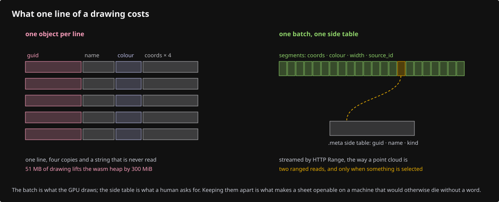

# 19 · Sheets: batched drawings with lazy metadata

**Estimated study time: about 15–30 hours.** Includes reading, typing, tracing, testing and experiments. [How to use this estimate](map.md#time-estimates).

**This section:** Draw batched sheets while looking up detailed entity information on demand.

**In the whole viewer:** Sheets combine streaming, compact display storage and picking without making every drawn segment a full viewer object.

**Follow the data:** Sheet arrays → ribbon batch → picked source ID → metadata lookup.

**Start with these files:** [`src/app/walk/sheet.rs`](19-sheets.md#code-19-021), [`src/app/sheet_query.rs`](19-sheets.md#code-19-018).

**Aim to explain:** How can one sheet object still let you identify a particular drawn entity?

[Whole-viewer map and course milestones](map.md)

A technical drawing may have a million line segments. Giving each segment a full editable object would be expensive. A sheet instead stores positions, colours, widths and source identifiers in parallel arrays. Detailed source information can be fetched when a segment is selected.



Start from the working result of [step 18b](18b-clipping.md).

**One buildable step:** type the additions below in `workspace/handwritten`, then build and test. This step adds 1,186 lines across 13 files and may take several sittings. Individual listings are parts of this step, not separate build checkpoints.

<span id="code-19-001"></span>

## `src/lib.rs`

Insert **after line 52** of your current file.

Keep these preceding lines:

```rust
    StreamedCloud(Box<StreamedInit>), // a point cloud starts streaming; register:stream
    CloudChunk(CloudChunk),        // more points arrived; register:stream
    CloudQueryBatch(app::cloud_query::Batch), // points asked for on click; register:cloud_query
    CloudQueryResolved(app::cloud_query::Resolved), // those points answered; register:cloud_query
```

Keep these following lines:

```rust
    CancelPointer,                 // the browser lost the pointer
    Fonts(Vec<Vec<u8>>),           // the whole label fonts, main font first; register:loading
}
```

Type these new lines:

```rust
--8<-- "typing/code/19-001.rs"
```

<span id="code-19-002"></span>

## `src/lib.rs`

Insert **after line 175** of your current file.

Keep these preceding lines:

```rust
            Msg::StreamedCloud(init) => start_stream(state, init), // register:stream
            Msg::CloudChunk(c) => state.extend_streamed(c.idx, c.rows, c.to), // register:stream
            Msg::CloudQueryBatch(batch) => state.cloud_query_batch(batch), // register:cloud_query
            Msg::CloudQueryResolved(resolved) => state.cloud_query_resolved(resolved), // register:cloud_query
```

Keep these following lines:

```rust
            Msg::CancelPointer => {
                self.input.cancel();
                state.touch();
            }
```

Type these new lines:

```rust
--8<-- "typing/code/19-002.rs"
```

<span id="code-19-003"></span>

## `src/lib.rs`

Append **after line 352** of your current file.

Blank lines before: **1**; after: **0**. End with a newline.

```rust
--8<-- "typing/code/19-003.rs"
```

<span id="code-19-004"></span>

## `examples/mk_sheet.rs`

Create this file. Type the complete listing, including comments and blank lines.

```rust
--8<-- "typing/code/19-004.rs"
```

<span id="code-19-005"></span>

## `src/app/inspection.rs`

Insert **after line 39** of your current file.

Keep these preceding lines:

```rust
        "hidden_count": state.scene.hidden.len(),
        "identity": identity,
        "selection": state.selection,
        "controls": state.inspected_controls(),
```

Keep these following lines:

```rust
        "markers": state.gpu.controls.dot_count(),
        "control_segments": state.gpu.control_net.ribbon_count(),
        "pick_busy": state.gpu.pick.busy(),
        "objects": state.scene.object_count(),
```

Type these new lines:

```rust
--8<-- "typing/code/19-005.rs"
```

<span id="code-19-006"></span>

## `src/app/inspection.rs`

Append **after line 193** of your current file.

Blank lines before: **1**; after: **0**. End with a newline.

```rust
--8<-- "typing/code/19-006.rs"
```

<span id="code-19-007"></span>

## `src/app/loader.rs`

Insert **after line 467** of your current file.

Keep these preceding lines:

```rust
        for document in pending {
            match document {
                PendingDocument::Whole(doc, source) => _ = post(Msg::File(doc, source)),
                PendingDocument::Streamed(stream) => _ = post(Msg::StreamedCloud(stream)), // register:stream
```

Keep these following lines:

```rust
            }
        }
    }
```

Type these new lines:

```rust
--8<-- "typing/code/19-007.rs"
```

<span id="code-19-008"></span>

## `src/app/loader.rs`

Insert **after line 561** of your current file.

Keep these preceding lines:

```rust
/// One staged item of a reload.
enum PendingDocument {
    Whole(FileDoc, Option<String>), // a decoded file and, when display-only, its file
    Streamed(Box<StreamedInit>),    // a cloud's first slice; register:stream
```

Keep these following lines:

```rust
}

/// True when a body starts with the gzip magic.
fn packed(body: &Body) -> bool {
```

Type these new lines:

```rust
--8<-- "typing/code/19-008.rs"
```

<span id="code-19-009"></span>

## `src/app/loader.rs`

Insert **after line 605** of your current file.

Keep these preceding lines:

```rust
/// A probed file that streams: its first slice is posted, or staged for a reload; `Err` tells the
/// manifest loop what comes next, `Ok` loads the file whole.
async fn stream_item(cx: &mut ItemCx<'_>, head: &Reply, slot: &Placement) -> Result<(), Step> {
    start_cloud(cx, head, slot).await?; // register:stream
```

Keep these following lines:

```rust
    Ok(())
}

/// Name and placement of a streamed document.
```

Type these new lines:

```rust
--8<-- "typing/code/19-009.rs"
```

<span id="code-19-010"></span>

## `src/app/loader.rs`

Append **after line 825** of your current file.

Blank lines before: **1**; after: **0**. End with a newline.

```rust
--8<-- "typing/code/19-010.rs"
```

<span id="code-19-011"></span>

## `src/app/mod.rs`

Insert **after line 27** of your current file.

Keep these preceding lines:

```rust
#[cfg(target_arch = "wasm32")] // register:route
pub mod route; // register:route
pub mod scene; // register:scene
pub mod selection; // register:selection
```

Keep these following lines:

```rust
pub mod stream; // register:stream
pub mod touch; // register:touch
pub mod validate; // register:validate
pub mod walk; // register:walk
```

Type these new lines:

```rust
--8<-- "typing/code/19-011.rs"
```

<span id="code-19-012"></span>

## `src/app/scene.rs`

Insert **after line 54** of your current file.

Keep these preceding lines:

```rust
/// Names a row has before its geometry's own: a text's, a sheet entity's, an instance's, a released row's.
// `for<'a>`: each function takes any borrow of the scene and returns a name that lives as long as that borrow.
const NAMERS: &[for<'a> fn(&'a Scene, u32) -> Option<&'a str>] = &[
    Scene::text_name,            // register:scene_text
```

Keep these following lines:

```rust
    Scene::released_object_name, // register:release
];

/// The open documents and their object rows; a row id stays with its object for the object's life.
```

Type these new lines:

```rust
--8<-- "typing/code/19-012.rs"
```

<span id="code-19-013"></span>

## `src/app/scene.rs`

Insert **after line 64** of your current file.

Keep these preceding lines:

```rust
    pub docs: Vec<FileDoc>,                              // loaded files
    pub texts: Vec<SceneText>,                           // text objects; register:scene_text
    pub tables: Upload,                                  // rows walked but not yet uploaded
    pub streamed: Vec<StreamedCloud>,                    // streamed clouds; register:stream
```

Keep these following lines:

```rust
    pub hidden: HashSet<(usize, Rc<str>)>,               // (document, guid) hidden
    pub locked: HashSet<(usize, Rc<str>)>,               // (document, guid) not selectable
    pub colors: HashMap<(usize, Rc<str>), [u8; 3]>,      // face colour overrides
    pub edge_colors: HashMap<(usize, Rc<str>), [u8; 3]>, // edge colour overrides
```

Type these new lines:

```rust
--8<-- "typing/code/19-013.rs"
```

<span id="code-19-014"></span>

## `src/app/scene.rs`

Insert **after line 132** of your current file.

Keep these preceding lines:

```rust
            docs: Vec::new(),
            texts: Vec::new(), // register:scene_text
            tables: Upload::default(),
            streamed: Vec::new(), // register:stream
```

Keep these following lines:

```rust
            hidden: HashSet::new(),
            locked: HashSet::new(),
            colors: HashMap::new(),
            edge_colors: HashMap::new(),
```

Type these new lines:

```rust
--8<-- "typing/code/19-014.rs"
```

<span id="code-19-015"></span>

## `src/app/scene.rs`

Insert **after line 206** of your current file.

Keep these preceding lines:

```rust
    fn reset_rows(&mut self) {
        self.row_revision = self.row_revision.wrapping_add(1);
        self.tables = Upload::default();
        self.streamed.clear(); // register:stream
```

Keep these following lines:

```rust
        self.order.clear();
        self.owners.clear();
        self.feet.clear();
        self.nodes.clear();
```

Type these new lines:

```rust
--8<-- "typing/code/19-015.rs"
```

<span id="code-19-016"></span>

## `src/app/scene.rs`

Insert **after line 540** of your current file.

Keep these preceding lines:

```rust
            point = self.point_at(pick.row, local);
        }

        let mut entity = None;
```

Keep these following lines:

```rust

        let doc = match self.document(pick.row) {
            Some(document) => document.name.clone(),
            None => String::new(),
```

Type these new lines:

```rust
--8<-- "typing/code/19-016.rs"
```

<span id="code-19-017"></span>

## `src/app/scene.rs`

Append **after line 1127** of your current file.

Blank lines before: **1**; after: **0**. End with a newline.

```rust
--8<-- "typing/code/19-017.rs"
```

<span id="code-19-018"></span>

## `src/app/sheet_query.rs`

A sheet can display batched geometry while loading detailed metadata only for the part being inspected. This keeps interaction light, but the reply must still be attached to the same sheet and object that requested it.

Create this file. Type the complete listing, including comments and blank lines.

```rust
--8<-- "typing/code/19-018.rs"
```

<span id="code-19-019"></span>

## `src/app/stream.rs`

Append **after line 1163** of your current file.

Blank lines before: **1**; after: **0**. End with a newline.

```rust
--8<-- "typing/code/19-019.rs"
```

<span id="code-19-020"></span>

## `src/app/walk/mod.rs`

Insert **after line 33** of your current file.

Keep these preceding lines:

```rust
pub mod mesh_ink;
pub mod mesh_topology;
pub mod plane;
pub mod points;
```

Keep these following lines:

```rust

/// The row tables one object writes into.
pub struct Walk<'a> {
    pub arena: &'a mut ArenaRows, // triangles of faces
```

Type these new lines:

```rust
--8<-- "typing/code/19-020.rs"
```

<span id="code-19-021"></span>

## `src/app/walk/sheet.rs`

Create this file. Type the complete listing, including comments and blank lines.

```rust
--8<-- "typing/code/19-021.rs"
```

<span id="code-19-022"></span>

## `src/state.rs`

Insert **after line 14** of your current file.

Keep these preceding lines:

```rust
// Each `mod` line below carries a `register` tag naming its feature; the course adds the line in that feature's lesson.
mod clipping; // register:clipping
mod cloud_query; // register:cloud_query
mod features; // register:features
```

Keep these following lines:

```rust
mod text; // register:text
use features::Features;
use std::sync::Arc;
use winit::window::Window;
```

Type these new lines:

```rust
--8<-- "typing/code/19-022.rs"
```

<span id="code-19-023"></span>

## `src/state.rs`

Insert **after line 130** of your current file.

Keep these preceding lines:

```rust
    /// Remove every document; camera and GPU stay.
    pub fn clear(&mut self) {
        self.load_camera = self.camera.pose(); // remember the view
        self.selection = SelectionMode::Object;
```

Keep these following lines:

```rust
        self.gpu.arena.source_faces.select(&self.gpu.ctx, None);
        self.controls = Controls::default();
        self.scene.clear(&mut self.gpu);
        self.touch();
```

Type these new lines:

```rust
--8<-- "typing/code/19-023.rs"
```

<span id="code-19-024"></span>

## `src/state.rs`

Insert **after line 259** of your current file.

Keep these preceding lines:

```rust
        }

        // back to plain object mode, no edge, face or controls
        self.selection = SelectionMode::Object;
```

Keep these following lines:

```rust
        self.gpu.arena.source_faces.select(&self.gpu.ctx, None);
        self.controls = Controls::default();
        self.gpu.controls.reset();
        self.gpu.control_net.reset();
```

Type these new lines:

```rust
--8<-- "typing/code/19-024.rs"
```

<span id="code-19-025"></span>

## `src/state.rs`

Insert **after line 451** of your current file.

Keep these preceding lines:

```rust
                }

                // a sheet entity, not an object
                if let Some(entity) = hit.entity {
```

Keep these following lines:

```rust
                    return;
                }

                self.select_picked(hit.row, self.additive_selection);
```

Type these new lines:

```rust
--8<-- "typing/code/19-025.rs"
```

<span id="code-19-026"></span>

## `src/state.rs`

Append **after line 955** of your current file.

Blank lines before: **1**; after: **0**. End with a newline.

```rust
--8<-- "typing/code/19-026.rs"
```

<span id="code-19-027"></span>

## `src/state/features.rs`

Insert **after line 9** of your current file.

Keep these preceding lines:

```rust
pub(crate) struct Features {
    pub(super) cloud_query: Option<crate::app::cloud_query::Query>, // a point-cloud pick in flight; register:cloud_query
    #[cfg(target_arch = "wasm32")] // register:cloud_query
    pub(super) query_generation: u64, // counts cloud queries, old answers dropped; register:cloud_query
```

Keep these following lines:

```rust
    pub(super) clip_hidden: usize,    // register:clipping
}

// Each list starts empty; a later lesson adds one line per hook.
```

Type these new lines:

```rust
--8<-- "typing/code/19-027.rs"
```

<span id="code-19-028"></span>

## `src/state/sheet_query.rs`

Create this file. Type the complete listing, including comments and blank lines.

```rust
--8<-- "typing/code/19-028.rs"
```

## Check the completed chapter

From `session_viewer`, compare everything you have typed:

```sh
npm --prefix ../session_tests run course -- reference-check 19
```

From `workspace/handwritten`:

```sh
cargo build --lib --locked -j4
cargo xtest --lib --locked -j4
```

Run the native sheet tests. Follow one segment ID into the metadata lookup and explain why the full metadata need not be resident while drawing.

If colours shift by one segment, check parallel-array lengths and the starting segment offset before investigating the shader.

**Before moving on:** explain what changed, check the expected result above, and fix any build or test failure.

<details>
<summary>Check your explanation of the opening question</summary>

Segments carry their original entity IDs. Picking returns that ID alongside the sheet row, and the metadata lookup resolves the entity details.

</details>

[Next step: 20](20-history.md)
