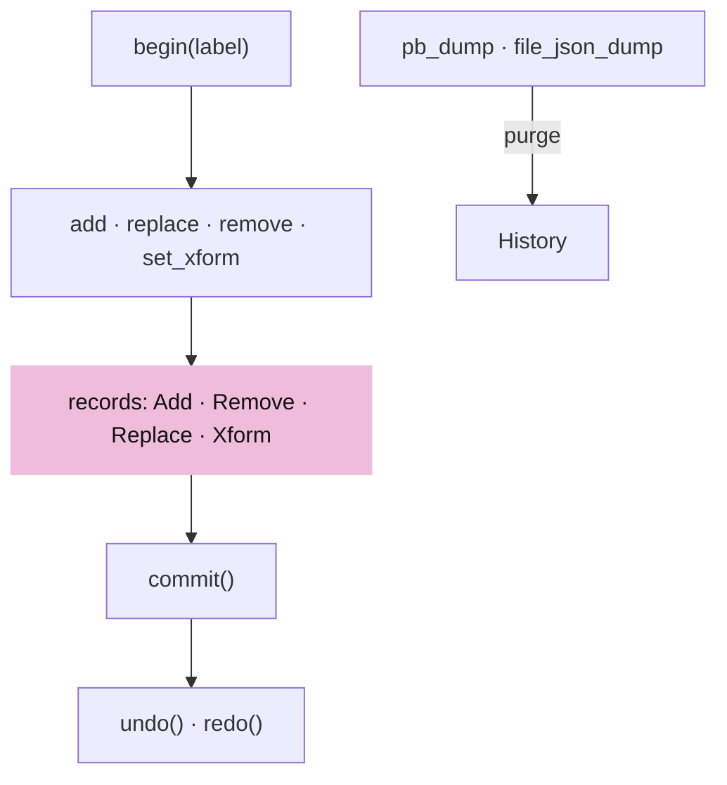
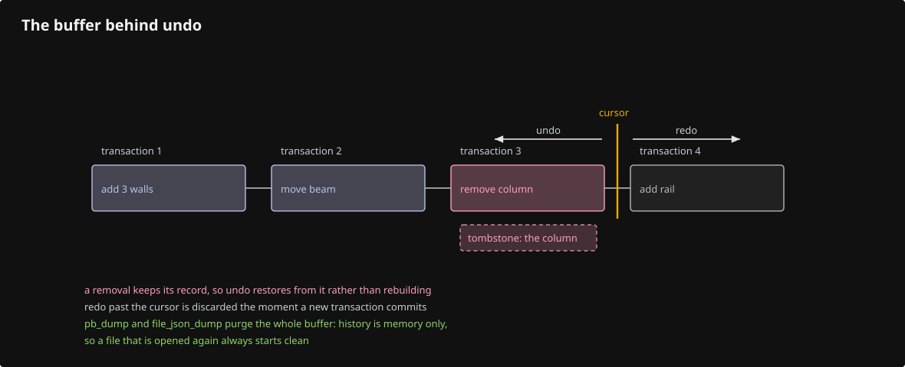
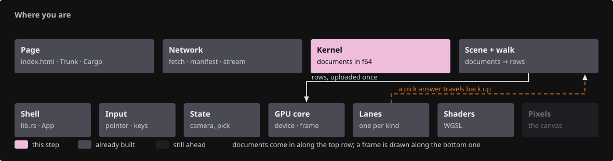
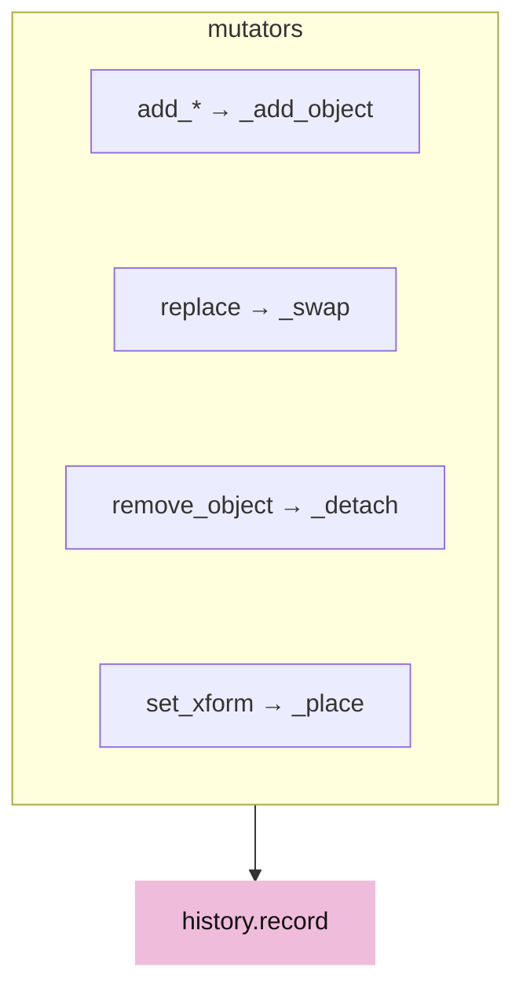

# 20 · The document: undo, redo and save

## You are building

A `Session` is a CAD document: objects are added, edited, deleted, saved to a file and opened again. Until now a removal was final the instant it happened. This lesson gives the kernel a history: edits are grouped into transactions, a removal's record is the tombstone that undo restores from, and every save purges the buffer, as Rhino does. History lives in memory only and never crosses pb or JSON, so an opened file always starts clean. The viewer does not edit yet; this is the ground the editing lesson will stand on.





## Starting point

Checkpoint 19. `remove_object` erases an object from its typed list, `lookup`, its transform, its tree node and its graph node at once and returns a bool; nothing remembers it.

<!-- step-status: start -->

**Does it compile yet?** `cargo check` passes after steps 1 and C, and fails after 2–5: a file is written across several steps, and a check can only pass once its last piece is in. Concretely, steps 2–5 build again at step C. This is measured at the end of every step rather than guessed. And where a check passes while your new files are not yet named by a `mod` line, it is telling you only that you have not broken the previous checkpoint — the checkpoint build at the end of the lesson is the real test.

<!-- step-status: end -->

## Part A · Records

### Step 1 · The tombstone

{ .locator data-strip="illustrations/strip-1edcbc97bb.svg" }

- `clone` is a deep copy that keeps the guid: a snapshot must still name the object it stands for, which is why `duplicate`, which mints a fresh guid, is never used here.
- A `Tombstone` is everything needed to put one object back into every live table: the object, its typed list and position in it, its local transform, its parent and position among the siblings, the detached subtree, the graph attribute and every incident edge. `Add` and `Remove` share it; `Replace` and `Xform` carry absolute before and after values, never deltas.
- A `Transaction` groups the records of one gesture; `History` keeps the last 64 and drops the redo stack when a new one commits.


<span class="zone-mark" data-strip="illustrations/strip-1edcbc97bb.svg" data-zone="Kernel"></span>

<!-- file: 20 session_rust/src/history.rs type lines=1-59 -->

- The tombstone is built while the tables are emptied, because that is the only moment when every position it must remember is still known.

<span class="zone-mark" data-strip="illustrations/strip-1edcbc97bb.svg" data-zone="Kernel"></span>

<!-- file: 20 session_rust/src/history.rs type lines=60-114 -->

- A transform record is the same shape: the value before and the value after, absolute, so replaying it never depends on the state it is replayed into.

<span class="zone-mark" data-strip="illustrations/strip-1edcbc97bb.svg" data-zone="Kernel"></span>

<!-- file: 20 session_rust/src/history.rs type lines=115-127 -->

- Those are the three record bodies: the tombstone a removal leaves behind, and the before/after pairs of a replace and a transform. Next is what groups them.

<span class="zone-mark" data-strip="illustrations/strip-1edcbc97bb.svg" data-zone="Kernel"></span>

<!-- file: 20 session_rust/src/history.rs type lines=128-182 -->

- `Op` can print itself, which is what makes a transaction readable in a test failure: the history is a data structure someone has to debug.

<span class="zone-mark" data-strip="illustrations/strip-1edcbc97bb.svg" data-zone="Kernel"></span>

<!-- file: 20 session_rust/src/history.rs type lines=183-202 -->

### Step 2 · Undo replays in reverse

{ .locator data-strip="illustrations/strip-1edcbc97bb.svg" }

- `undo` pops a transaction, reverts its records last to first and pushes it onto the redo stack; `redo` applies them first to last. An add reverts by detaching, a remove by attaching, a replace by swapping the before clone in, a transform by placing the before value.
- Both commit an open transaction first, so a half-typed gesture is never lost.

<span class="zone-mark" data-strip="illustrations/strip-1edcbc97bb.svg" data-zone="Kernel"></span>

<!-- file: 20 session_rust/src/history.rs type lines=203-268 -->

- Redo is undo's mirror: the same records applied in their original order. Keeping both directions in one place is what makes it obvious that every record type handles both.

<span class="zone-mark" data-strip="illustrations/strip-1edcbc97bb.svg" data-zone="Kernel"></span>

<!-- file: 20 session_rust/src/history.rs type lines=269-320 -->

<span class="zone-mark" data-strip="illustrations/strip-1edcbc97bb.svg" data-zone="Kernel"></span>

<!-- file: 20 session_rust/src/lib.rs type -->

- The kernel's module list gains `history`. Everything in this lesson lives in the shared kernel, which is why the tests are run there.

## Part B · The session records

### Step 3 · One place to add

{ .locator data-strip="illustrations/strip-1edcbc97bb.svg" }

- Every `add_*` routes through `_add_object`, which pushes to the typed list, `lookup`, the graph and the tree exactly as before and, while a transaction is open, records an `Add`.
- `replace(guid, obj)` is the edit history sees: it gives `obj` the guid, swaps it into the typed list and `lookup`, refreshes the graph attribute and records before and after. Mutating an object in place through `lookup` still works and is not recorded.
- `remove_object` becomes `_detach` plus a record. `_detach` builds the tombstone while it empties every table; `_attach` puts everything back at the same positions, including the subtree and the edges whose other end still exists.
- `set_xform` and `remove_xform` record absolute before and after transforms. `pb_dump`, `pb_dumps`, `file_json_dump` and `file_json_dumps` call `history.clear()` first.



<span class="zone-mark" data-strip="illustrations/strip-1edcbc97bb.svg" data-zone="Kernel"></span>

<!-- file: 20 session_rust/src/session.rs type -->

### Step 4 · The tree gives the node back, the graph its edges

{ .locator data-strip="illustrations/strip-1edcbc97bb.svg" }

- `Tree::remove` returns the detached node with its subtree, and `TreeNode::insert` puts a child back at an index, so a restored object lands where it was.
- `Graph::edges_of` lists the incident edges with their attribute and direction, the part of a removal that had no way back before.

<span class="zone-mark" data-strip="illustrations/strip-1edcbc97bb.svg" data-zone="Kernel"></span>

<!-- file: 20 session_rust/src/tree.rs type -->

<span class="zone-mark" data-strip="illustrations/strip-1edcbc97bb.svg" data-zone="Kernel"></span>

<!-- file: 20 session_rust/src/graph.rs type -->

- `edges_of` is added: a removal has to remember the edges whose other end still exists, and there was no way to ask for them before.

### Step 5 · Identity survives a swap

{ .locator data-strip="illustrations/strip-1edcbc97bb.svg" }

- `replace` sets the guid on the replacement, and a guid minted once cannot be reset, so the four types that lacked `refresh_guid` gain it.

<span class="zone-mark" data-strip="illustrations/strip-1edcbc97bb.svg" data-zone="Kernel"></span>

<!-- file: 20 session_rust/src/element.rs type -->

<span class="zone-mark" data-strip="illustrations/strip-1edcbc97bb.svg" data-zone="Kernel"></span>

<!-- file: 20 session_rust/src/obb.rs type -->

- One of the four types that lacked `refresh_guid`. `replace` gives the replacement the original's guid, and a guid minted once cannot otherwise be reset.

<span class="zone-mark" data-strip="illustrations/strip-1edcbc97bb.svg" data-zone="Kernel"></span>

<!-- file: 20 session_rust/src/plane.rs type -->

- `Plane` gains it too. Watch how small each of these four edits is - the work was finding which types lacked it, not making the change.

<span class="zone-mark" data-strip="illustrations/strip-1edcbc97bb.svg" data-zone="Kernel"></span>

<!-- file: 20 session_rust/src/pointcloud.rs type -->

- And the same again - four types, one missing capability, found by the one operation that needed it.

## Part C · Three kernels, one behaviour

- The Python and C++ kernels carry the same `History`, the same `replace`, `begin`, `commit`, `undo` and `redo`, the same records and the same test names, so a document behaves the same whichever language edits it. They are supplied here with their tests; the Rust tests below are the ones you type.

<!-- supplied: 20 -->

<!-- check: 20 -->

## Check

<!-- checkpoint: 20 -->

Native tests:

```sh
cd "$COURSE_WORK/session_viewer/../session_rust" && cargo test --lib minitest_suite -- --nocapture
```

The cases you typed are `MINI_TEST!` blocks, not `#[test]` functions: they register themselves and the whole suite runs as one libtest case, so filtering by name would run nothing. Expected: the run ends `[rust-minitest] N/N passed` and `test mini_test::harness::minitest_suite ... ok`. A failure is the informative case — it prints `FAIL <group>::<name>  <file>:<line>` followed by the failing check, so `Undo Remove` or `History Purged On Save` names itself when it breaks. The viewer builds and runs unchanged: it loads documents and never edits them yet.

## Verify you reached production

Record the checkpoint and compare every runtime file against the frozen production inventory:

```sh
python3 "$COURSE_REPO/docs/reconstruction/replay.py" --output "$COURSE_WORK" --through 20 --adopt
python3 "$COURSE_REPO/docs/reconstruction/converge.py" --workspace "$COURSE_WORK"
```

Expected:

- `converge.py` reports every runtime file identical to production; the only listed differences are the documented packaging ones (the local input manifest and imported-document font artifacts).

## What changed

<!-- tree: 20 session_rust/src -->

- Removal keeps its resurrection kit in the history instead of leaving nothing; the live tables are unchanged.
- Edits are transactions; undo and redo replay absolute snapshots; the buffer holds 64 and is purged by every save.
- The wire format is untouched: a file never carries history.

## Try

- Add three points, `begin`, `replace` one, `remove` one, `set_xform` one, `commit`, `undo`, `redo`; then `pb_dump` and check `history.depth()` is 0.
- Remove a group with children and undo: the children return under the same parent at the same index.
- Open the saved file in the Python or C++ kernel and run the same sequence: the same names do the same things.

## Questions and answers

**History lives in memory and never crosses pb or JSON. What does that buy, and what does it give up?**

*How to work it out.* Ask what a persisted history would require: a version in the file format, a decision about what an undo means after someone else edited the file, and a guarantee that a tombstone's object still makes sense in a later schema. Then ask what users expect — open a file, and it is what it is.

*The answer.* An opened file always starts clean: no format to version, no cross-session semantics to define, no history leaking to whoever you send the file to. It gives up cross-session undo, which is what Rhino also gives up. Worth stating because the temptation to persist it is constant and the cost only appears later, in the format.

**A tombstone stores the object, its list position, its transform, its parent and sibling index, its subtree, its graph attribute and its incident edges. Why so much for one deletion?**

*How to work it out.* List the live tables a removal touches: the typed list, `lookup`, the transform map, the tree, the graph. For each, ask what undo needs to restore it *exactly* — not just presence but position, because index order is visible to the user.

*The answer.* Anything less is a restore that quietly loses a parent, a child order or an edge. The reason the list was incomplete before is that each table's loss is invisible on its own. When you write an undo, enumerate the tables, not the operations.

**`Replace` and `Xform` carry absolute before and after values, never deltas. Argue for absolutes here.**

*How to work it out.* Ask what a delta assumes: that it will be applied to exactly the state it was computed from. Then ask what could break that — a redo stack, a transaction reordered, floating-point rounding that makes inverse composition not quite the identity. Finally price the alternative: the buffer is 64 transactions, so size is not the constraint.

*The answer.* Absolutes are bigger and completely unambiguous; deltas compose and drift. Reach for deltas when size is the binding constraint, and here it is not.

**A removal's clone keeps the guid rather than minting a new one. What would break with `duplicate`?**

*How to work it out.* Ask who refers to an object by guid: links, the graph, selections, anything the user saved. Now restore it under a new guid — the content is back, the references are not.

*The answer.* An undo has to restore *identity*, not equivalent content. That is also why the four types lacking `refresh_guid` had to gain it: `replace` gives the replacement the original's guid, and a guid minted once cannot otherwise be reset.

**What you should be able to do now**

Narrate a click from browser event to highlighted object, without looking. Correct: winit delivers a pointer event → `input.rs` scales it by the device ratio and, on a release under `CLICK_SLOP`, asks `State` for a selection → `State::request_selection` records the request with a generation and the window size → the next frame runs `pick_frame`, drawing the ID pass into a window-sized integer target → `copy_texture_to_buffer` and `map_async` → a later frame polls the mapping, checks the generation, sorts the window (ink before faces, nearest to the cursor) → `Scene::resolve` turns the row and sub-id into a document identity → `set_selected` flips `FLAG_SELECTED` in the row → the next frame draws the yellow strokes and the silhouette. That path crosses almost every module you built. When you can narrate it, take the [capstone](capstone.md).

## Next

[Architecture reference](../ARCHITECTURE.md): the finished module graph, frame lifecycle and Rust ↔ WGSL interfaces.
