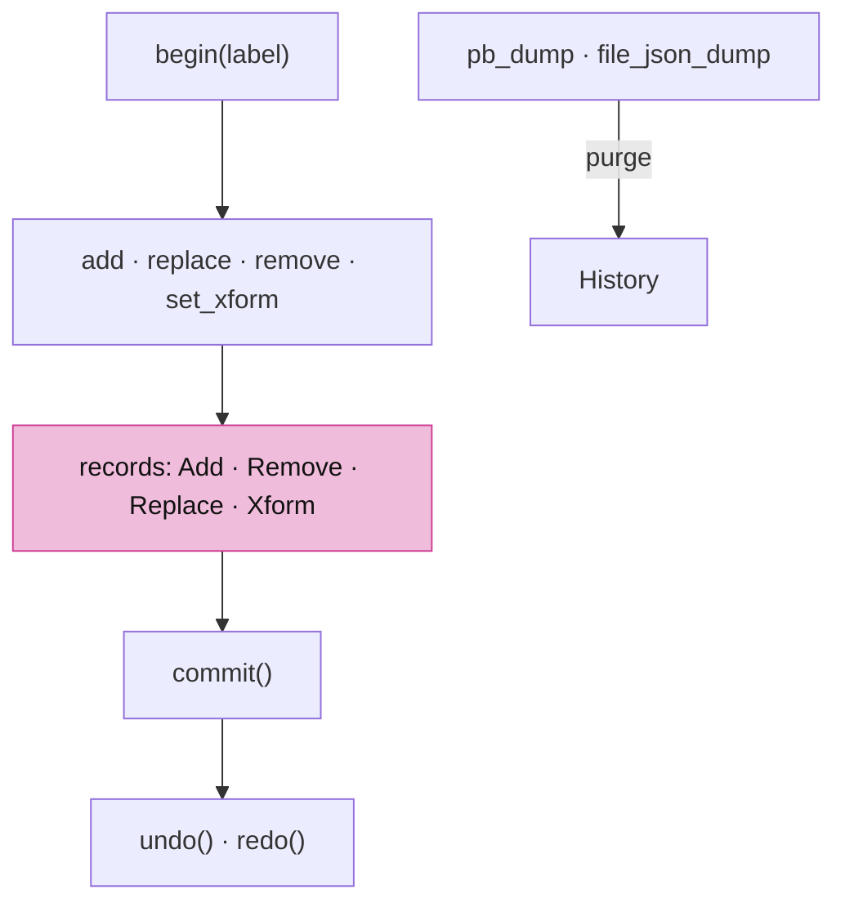
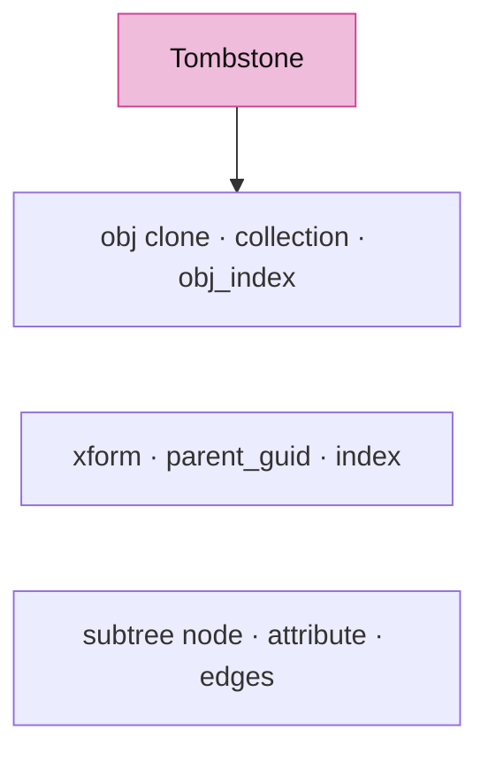
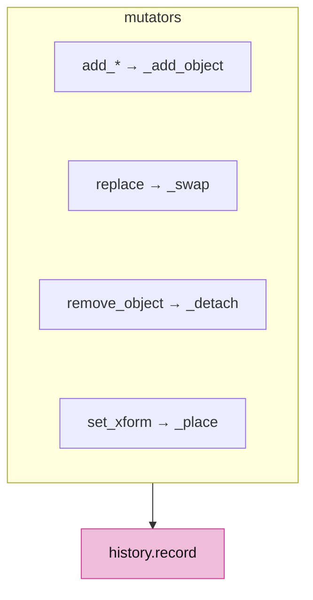

# 20 · The document: undo, redo and save

## You are building

A `Session` is a CAD document: objects are added, edited, deleted, saved to a file and opened again. Until now a removal was final the instant it happened. This lesson gives the kernel a history: edits are grouped into transactions, a removal's record is the tombstone that undo restores from, and every save purges the buffer, as Rhino does. History lives in memory only and never crosses pb or JSON, so an opened file always starts clean. The viewer does not edit yet; this is the ground the editing lesson will stand on.



## Starting point

Checkpoint 19. `remove_object` erases an object from its typed list, `lookup`, its transform, its tree node and its graph node at once and returns a bool; nothing remembers it.

## Part A · Records

### Step 1 · The tombstone

- `clone` is a deep copy that keeps the guid: a snapshot must still name the object it stands for, which is why `duplicate`, which mints a fresh guid, is never used here.
- A `Tombstone` is everything needed to put one object back into every live table: the object, its typed list and position in it, its local transform, its parent and position among the siblings, the detached subtree, the graph attribute and every incident edge. `Add` and `Remove` share it; `Replace` and `Xform` carry absolute before and after values, never deltas.
- A `Transaction` groups the records of one gesture; `History` keeps the last 64 and drops the redo stack when a new one commits.



<!-- file: 20 session_rust/src/history.rs type lines=1-202 -->

### Step 2 · Undo replays in reverse

- `undo` pops a transaction, reverts its records last to first and pushes it onto the redo stack; `redo` applies them first to last. An add reverts by detaching, a remove by attaching, a replace by swapping the before clone in, a transform by placing the before value.
- Both commit an open transaction first, so a half-typed gesture is never lost.

<!-- file: 20 session_rust/src/history.rs type lines=203-320 -->

<!-- file: 20 session_rust/src/lib.rs type -->

## Part B · The session records

### Step 3 · One place to add

- Every `add_*` routes through `_add_object`, which pushes to the typed list, `lookup`, the graph and the tree exactly as before and, while a transaction is open, records an `Add`.
- `replace(guid, obj)` is the edit history sees: it gives `obj` the guid, swaps it into the typed list and `lookup`, refreshes the graph attribute and records before and after. Mutating an object in place through `lookup` still works and is not recorded.
- `remove_object` becomes `_detach` plus a record. `_detach` builds the tombstone while it empties every table; `_attach` puts everything back at the same positions, including the subtree and the edges whose other end still exists.
- `set_xform` and `remove_xform` record absolute before and after transforms. `pb_dump`, `pb_dumps`, `file_json_dump` and `file_json_dumps` call `history.clear()` first.



<!-- file: 20 session_rust/src/session.rs type -->

### Step 4 · The tree gives the node back, the graph its edges

- `Tree::remove` returns the detached node with its subtree, and `TreeNode::insert` puts a child back at an index, so a restored object lands where it was.
- `Graph::edges_of` lists the incident edges with their attribute and direction, the part of a removal that had no way back before.

<!-- file: 20 session_rust/src/tree.rs type -->

<!-- file: 20 session_rust/src/graph.rs type -->

### Step 5 · Identity survives a swap

- `replace` sets the guid on the replacement, and a guid minted once cannot be reset, so the four types that lacked `refresh_guid` gain it.

<!-- file: 20 session_rust/src/element.rs type -->

<!-- file: 20 session_rust/src/obb.rs type -->

<!-- file: 20 session_rust/src/plane.rs type -->

<!-- file: 20 session_rust/src/pointcloud.rs type -->

## Part C · Three kernels, one behaviour

- The Python and C++ kernels carry the same `History`, the same `replace`, `begin`, `commit`, `undo` and `redo`, the same records and the same test names, so a document behaves the same whichever language edits it. They are supplied here with their tests; the Rust tests below are the ones you type.

<!-- supplied: 20 -->

<!-- check: 20 -->

## Check

<!-- checkpoint: 20 -->

Native tests:

```sh
cd "$COURSE_WORK/session_viewer/../session_rust" && cargo test --lib -- history session
```

Expected: `Document Workflow`, `Undo Remove`, `Undo Add`, `Undo Replace`, `Undo Xform`, `History Purged On Save` and `History Capacity` pass, and the four `history` tests with them. The viewer builds and runs unchanged: it loads documents and never edits them yet.

## Verify you reached production

Record the checkpoint and compare every runtime file against the frozen production inventory:

```sh
python3 "$COURSE_REPO/docs/reconstruction/replay.py" --output "$COURSE_WORK" --through 20 --adopt
python3 "$COURSE_REPO/docs/reconstruction/converge.py" --workspace "$COURSE_WORK"
```

Expected:

- `converge.py` reports every runtime file identical to production; the only listed differences are the documented packaging ones (the local input manifest and imported-document font artifacts).

## What changed

<!-- tree: 20 session_rust/src -->

- Removal keeps its resurrection kit in the history instead of leaving nothing; the live tables are unchanged.
- Edits are transactions; undo and redo replay absolute snapshots; the buffer holds 64 and is purged by every save.
- The wire format is untouched: a file never carries history.

## Try

- Add three points, `begin`, `replace` one, `remove` one, `set_xform` one, `commit`, `undo`, `redo`; then `pb_dump` and check `history.depth()` is 0.
- Remove a group with children and undo: the children return under the same parent at the same index.
- Open the saved file in the Python or C++ kernel and run the same sequence: the same names do the same things.


## Recall

??? question "History lives in memory and never crosses pb or JSON. What does that buy, and what does it give up?"
    An opened file always starts clean: no undo across sessions, no history in a file someone else reads, no format to version. It gives up cross-session undo — which, as Rhino also decided, is not what users expect from a CAD document. The rule is worth stating because the temptation to persist it is constant and the cost only appears later, in the file format.

??? question "A tombstone stores the object, its list position, its transform, its parent and sibling index, its subtree, its graph attribute and its incident edges. Why so much for one deletion?"
    Because undo has to put the object back into *every* live table at the same place — anything less is a restore that quietly loses a parent, a child order, or an edge. The reason the list was incomplete before is that each table's loss was invisible on its own. When you write an undo, enumerate the tables, not the operations.

??? question "`Replace` and `Xform` carry absolute before and after values, never deltas. Argue for absolutes here."
    Deltas compose and drift: two floating-point transforms that undo each other do not return the original bits, and a delta applied to a state it was not computed from is silently wrong. Absolutes are bigger and completely unambiguous, and the buffer is bounded at 64 anyway. Reach for deltas when size is the constraint, and here it is not.

??? question "A removal's clone keeps the guid rather than minting a new one. What would break with `duplicate`?"
    The restored object would be a different object as far as every reference is concerned: links, selections and anything holding the guid would point at nothing. An undo has to restore *identity*, not merely equivalent content — which is why the four types that lacked `refresh_guid` had to gain it for `replace` to work at all.

**Rebuild from memory:** you have finished the course. Without looking, describe the path a click takes from the browser event to a highlighted object — through input, state, the id pass, the readback, the generation check, `Scene::resolve`, the row flag and the next frame. That single path crosses almost every module you built. When you can narrate it, take the [capstone](capstone.md).

## Next

[Architecture reference](../ARCHITECTURE.md): the finished module graph, frame lifecycle and Rust ↔ WGSL interfaces.
