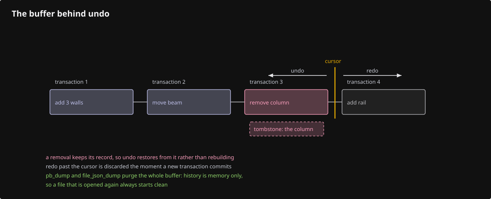

# 20 · The document and its rows

**Estimated study time: about 25–50 hours.** Includes reading, typing, tracing, testing and experiments. [How to use this estimate](map.md#time-estimates).

**This section:** Connect document transactions, undo/redo and display synchronization.

**In the whole viewer:** The editable document is authoritative. Synchronization translates changes in that document into updates to its displayed rows.

**Follow the data:** Transaction → changed identities → synchronization notes → display/GPU updates.

**Start with these files:** [`src/app/scene_sync.rs`](20-history.md#code-20-012), [`src/app/scene_sync/notes.rs`](20-history.md#code-20-016).

**Aim to explain:** When undo restores a removed object, why must more than the visible pixels be restored?

[Whole-viewer map and course milestones](map.md)

Undo moves the most recent transaction from the undo stack to the redo stack. Redo moves it back. The viewer reads the transaction from its new stack and creates notes describing which display rows need attention. This keeps editing and GPU synchronization separate.



Start from the working result of [step 19](19-sheets.md).

**One buildable step:** type the additions below in `workspace/handwritten`, then build and test. This step adds 2,056 lines across 12 files and may take several sittings. Individual listings are parts of this step, not separate build checkpoints.

<span id="code-20-001"></span>

## `src/app/inspection.rs`

Insert **after line 78** of your current file.

Keep these preceding lines:

```rust
            .map(|r| state.gpu.objects.anchored_model(*r))
            .collect::<Vec<_>>()
    );
    snapshot["clipping"] = state.clipping_status(); // register:clipping
```

Keep these following lines:

```rust
    snapshot["ssao"] = serde_json::json!(state.gpu.view.ssao);
    snapshot["locked_count"] = serde_json::json!(state.scene.locked.len());
    snapshot["color_count"] = serde_json::json!(state.scene.colors.len());
    snapshot["edge_color_count"] = serde_json::json!(state.scene.edge_colors.len());
```

Type these new lines:

```rust
--8<-- "typing/code/20-001.rs"
```

<span id="code-20-002"></span>

## `src/app/inspection.rs`

Insert **after line 102** of your current file.

Keep these preceding lines:

```rust
            [b.cx + b.hx, b.cy + b.hy, b.cz + b.hz],
        ])
    }));
    snapshot["scene_revision"] = serde_json::json!(state.scene.row_revision);
```

Keep these following lines:

```rust
    let docs = &state.scene.docs;
    let slots = &state.gpu.arena.source_faces.slots;
    snapshot["instancing"] = serde_json::json!({
        "definitions": docs.iter().map(|d| d.session.definition_lookup.len()).sum::<usize>(),
```

Type these new lines:

```rust
--8<-- "typing/code/20-002.rs"
```

<span id="code-20-003"></span>

## `src/app/inspection.rs`

Append **after line 215** of your current file.

Blank lines before: **1**; after: **0**. End with a newline.

```rust
--8<-- "typing/code/20-003.rs"
```

<span id="code-20-004"></span>

## `src/app/scene.rs`

Insert **after line 4** of your current file.

Keep these preceding lines:

```rust
#[path = "scene_release.rs"] // register:release
mod release; // register:release
#[path = "scene_rows.rs"]
pub(crate) mod rows;
```

Keep these following lines:

```rust
#[path = "scene_text.rs"] // register:scene_text
mod text; // register:scene_text
pub use text::SceneText; // register:scene_text
```

Type these new lines:

```rust
--8<-- "typing/code/20-004.rs"
```

<span id="code-20-005"></span>

## `src/app/scene.rs`

Insert **after line 107** of your current file.

Keep these preceding lines:

```rust
    pub(crate) text_rows: Vec<u32>, // text rows an undo, redo or delete showed or hid, for the GPU
    pub(crate) released: HashMap<usize, Released>, // documents drawn without their kernel objects; register:release
    asked: RefCell<Vec<usize>>, // released documents a read-only path needs; register:release
    stream_ceiling: u32,        // most streamed points on the page; register:stream
```

Keep these following lines:

```rust
    #[cfg(test)]
    pub(crate) ledger: HashMap<u32, ObjectRow>, // object rows as the GPU would hold them
    #[cfg(test)]
    pub(crate) searches: usize,   // tree walks the syncs needed
```

Type these new lines:

```rust
--8<-- "typing/code/20-005.rs"
```

<span id="code-20-006"></span>

## `src/app/scene.rs`

Insert **after line 153** of your current file.

Keep these preceding lines:

```rust
            nodes: Vec::new(),
            spans: Spans::default(),
            caps: HashMap::new(),
            graves: HashMap::new(),
```

Keep these following lines:

```rust
            ids: Ids::default(),
            sink: None,
            empty: Rc::from(""),
            doc_state: Vec::new(),
```

Type these new lines:

```rust
--8<-- "typing/code/20-006.rs"
```

<span id="code-20-007"></span>

## `src/app/scene.rs`

Insert **after line 226** of your current file.

Keep these preceding lines:

```rust
        self.nodes.clear();
        self.spans.clear();
        self.caps.clear();
        self.graves.clear();
```

Keep these following lines:

```rust
        self.ids.clear();
        self.sink = None;
        self.pending.clear();
        self.hints.clear();
```

Type these new lines:

```rust
--8<-- "typing/code/20-007.rs"
```

<span id="code-20-008"></span>

## `src/app/scene.rs`

Insert **after line 315** of your current file.

Keep these preceding lines:

```rust
            // clouds coming back would not fit beside the dead points: pack the live ones first
            let incoming = self.tables.cloud.point_count();

            if incoming > 0 && self.dead_points > 0 && !gpu.cloud.fits(&gpu.ctx, incoming) {
```

Keep these following lines:

```rust
            }

            (self.tables.cloud.expect, self.tables.cloud.expect_normals) = self.stream_expect(); // register:stream
            gpu.set_scene(&self.tables);
```

Type these new lines:

```rust
--8<-- "typing/code/20-008.rs"
```

<span id="code-20-009"></span>

## `src/app/scene.rs`

Insert **after line 361** of your current file.

Keep these preceding lines:

```rust
            self.bounds_stale = true;
        }

        let mut dead = self.dead;
```

Keep these following lines:

```rust
        gpu.set_dead(dead, self.dead_points);
        gpu.refresh_samples();
    }
```

Type these new lines:

```rust
--8<-- "typing/code/20-009.rs"
```

<span id="code-20-010"></span>

## `src/app/scene.rs`

Insert **after line 705** of your current file.

Keep these preceding lines:

```rust
    /// Rows holding an object, a text or a streamed shell.
    pub fn object_count(&self) -> usize {
        self.order.len()
            - self.ids.len()
```

Keep these following lines:

```rust
            - usize::from(self.sink.is_some())
    }
}
```

Type these new lines:

```rust
--8<-- "typing/code/20-010.rs"
```

<span id="code-20-011"></span>

## `src/app/scene.rs`

Append **after line 1303** of your current file.

Blank lines before: **1**; after: **0**. End with a newline.

```rust
--8<-- "typing/code/20-011.rs"
```

<span id="code-20-012"></span>

## `src/app/scene_sync.rs`

This module connects smaller synchronization responsibilities. Read it as a sequence of ownership decisions: which source changed, which display records are affected, and which update is required. Detailed allocation and preview work belongs in its submodules.

Create this file. Type the complete listing, including comments and blank lines.

```rust
--8<-- "typing/code/20-012.rs"
```

<span id="code-20-013"></span>

## `src/app/scene_sync/allocation.rs`

An edit can add geometry without rebuilding the entire scene. Allocation gives the new data a range and records its ownership. A failed or cancelled operation must not leave ranges claimed by objects that were never committed.

Create this file. Type the complete listing, including comments and blank lines.

```rust
--8<-- "typing/code/20-013.rs"
```

<span id="code-20-014"></span>

## `src/app/scene_sync/compaction.rs`

After deletions, live records may be scattered. Compaction moves them into a tighter arrangement. Every dependent offset or mapping must follow those moves; logical object identity should remain unchanged.

Create this file. Type the complete listing, including comments and blank lines.

```rust
--8<-- "typing/code/20-014.rs"
```

<span id="code-20-015"></span>

## `src/app/scene_sync/nodes.rs`

The document is authoritative; GPU rows are a display representation. Synchronization finds additions, removals and changes, then updates allocations and mappings. A stale row can draw or pick an object that no longer exists.

Create this file. Type the complete listing, including comments and blank lines.

```rust
--8<-- "typing/code/20-015.rs"
```

<span id="code-20-016"></span>

## `src/app/scene_sync/notes.rs`

Create this file. Type the complete listing, including comments and blank lines.

```rust
--8<-- "typing/code/20-016.rs"
```

<span id="code-20-017"></span>

## `src/app/scene_sync/testing.rs`

Create this file. Type the complete listing, including comments and blank lines.

```rust
--8<-- "typing/code/20-017.rs"
```

<span id="code-20-018"></span>

## `src/app/scene_sync/tests.rs`

Create this file. Type the complete listing, including comments and blank lines.

```rust
--8<-- "typing/code/20-018.rs"
```

<span id="code-20-019"></span>

## `src/app/scene_sync/tombs.rs`

A tombstone marks something that has been removed while related bookkeeping catches up. It prevents dead records from behaving like live objects during incremental updates. Distinguish deletion from temporary invisibility.

Create this file. Type the complete listing, including comments and blank lines.

```rust
--8<-- "typing/code/20-019.rs"
```

<span id="code-20-020"></span>

## `src/engine/gpu/upload.rs`

Insert **before the first line** of your current file.

Keep these following lines:

```rust
use super::lane::LaneRows;
use super::objects::ObjectRows;
use session_rust::AABB;
```

Type these new lines:

```rust
--8<-- "typing/code/20-020.rs"
```

<span id="code-20-021"></span>

## `src/engine/gpu/upload_padding.rs`

GPU copies and shader reads impose size and alignment rules. A logical array length can differ from the allocated byte count. Padding fills the unused bytes while preserving the number of meaningful elements.

Create this file. Type the complete listing, including comments and blank lines.

```rust
--8<-- "typing/code/20-021.rs"
```

## Check the completed chapter

From `session_viewer`, compare everything you have typed:

```sh
npm --prefix ../session_tests run course -- reference-check 20
```

From `workspace/handwritten`:

```sh
cargo build --lib --locked -j4
cargo xtest --lib --locked -j4
```

Run the native history and synchronization tests. In the viewer, select an object, delete it, press Ctrl+Z, then Ctrl+Y; its identity should remain consistent after undo. The command text interface arrives in lesson 23.

If undo changes the document but not the display, inspect the generated notes and synchronization queue. Rebuilding the whole scene can conceal a missing invalidation.

**Before moving on:** explain what changed, check the expected result above, and fix any build or test failure.

<details>
<summary>Check your explanation of the opening question</summary>

Undo restores the source identity and data. Source mappings, display rows and dependent state must then agree with that restored document.

</details>

[Next step: 21](21-editing.md)
