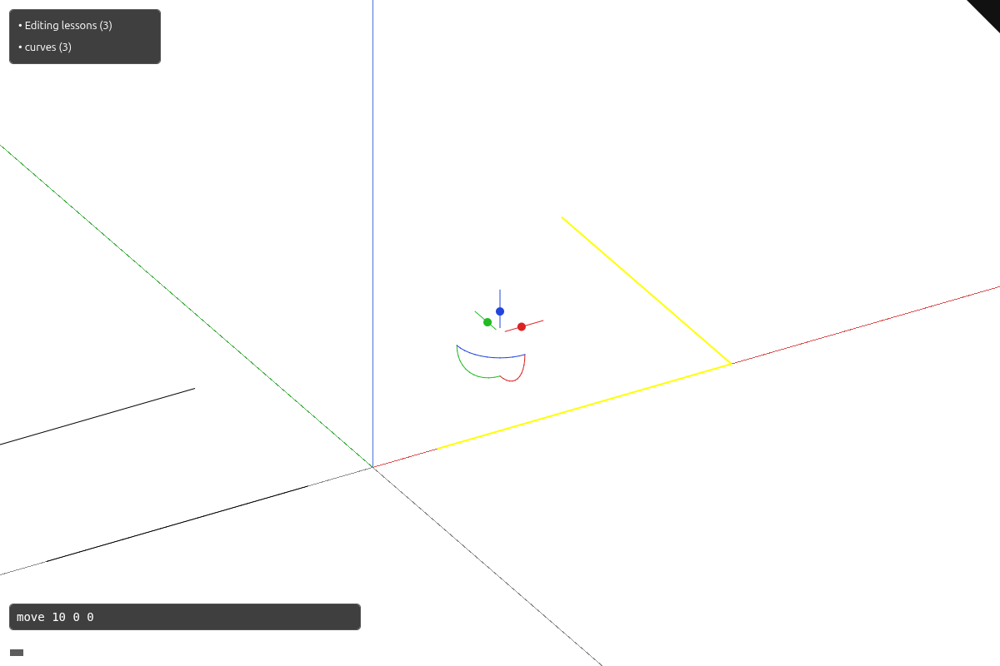

# 21 · Editing: the gumball, the command line and the layers panel

Selecting an object shows a gumball, and a drag or typed command records an undoable edit.


## Step 1 · src/app/mod.rs

The application module connects source loading and interaction helpers.

`lessons/21/src/app/mod.rs` · edit · type this

Replaces `mod feedback` in `lessons/20/src/app/mod.rs`

```rust
--8<-- "lessons/21/src/app/mod.rs:step-1"
```

## Step 2 · src/state.rs

State coordinates input, selection and frame requests.

`lessons/21/src/state.rs` · edit · type this

Added after the `mod cloud_query;` line of `lessons/20/src/state.rs`

```rust
--8<-- "lessons/21/src/state.rs:step-2"
```

## Step 3 · src/app/cplane.rs

The construction plane maps cursor rays into modeling coordinates.

`lessons/21/src/app/cplane.rs` · type this, new file, start with these lines

```rust
--8<-- "lessons/21/src/app/cplane.rs:step-3a"
```

`lessons/21/src/app/cplane.rs` · type this, append at the end of the file

```rust
--8<-- "lessons/21/src/app/cplane.rs:step-3b"
```

`lessons/21/src/app/cplane.rs` · type this, append at the end of the file

```rust
--8<-- "lessons/21/src/app/cplane.rs:step-3c"
```

## Step 4 · src/app/coords.rs

Coordinate input accepts absolute, relative and polar values.

`lessons/21/src/app/coords.rs` · type this, new file, start with these lines

```rust
--8<-- "lessons/21/src/app/coords.rs:step-4a"
```

`lessons/21/src/app/coords.rs` · type this, append at the end of the file

```rust
--8<-- "lessons/21/src/app/coords.rs:step-4b"
```

`lessons/21/src/app/coords.rs` · type this, append at the end of the file

```rust
--8<-- "lessons/21/src/app/coords.rs:step-4c"
```

`lessons/21/src/app/coords.rs` · type this, append at the end of the file

```rust
--8<-- "lessons/21/src/app/coords.rs:step-4d"
```

## Step 5 · src/camera.rs

The camera owns orbit, pan, zoom and projection in the same file used by the finished viewer.

`lessons/21/src/camera.rs` · edit · type this

Added after the `self.update_position();` line in `fn zoom` of `lessons/20/src/camera.rs`

```rust
--8<-- "lessons/21/src/camera.rs:step-5a"
```

`lessons/21/src/camera.rs` · edit · type this

Added after the `mod wheel_tests {` line of `lessons/20/src/camera.rs`

```rust
--8<-- "lessons/21/src/camera.rs:step-5b"
```

## Step 6 · src/app/gizmo.rs

The gumball computes translation, rotation and scale about the selected object.

`lessons/21/src/app/gizmo.rs` · type this, new file, start with these lines

```rust
--8<-- "lessons/21/src/app/gizmo.rs:step-6a"
```

`lessons/21/src/app/gizmo.rs` · type this, append at the end of the file

```rust
--8<-- "lessons/21/src/app/gizmo.rs:step-6b"
```

`lessons/21/src/app/gizmo.rs` · type this, append at the end of the file

```rust
--8<-- "lessons/21/src/app/gizmo.rs:step-6c"
```

`lessons/21/src/app/gizmo.rs` · type this, append at the end of the file

```rust
--8<-- "lessons/21/src/app/gizmo.rs:step-6d"
```

`lessons/21/src/app/gizmo.rs` · type this, append at the end of the file

```rust
--8<-- "lessons/21/src/app/gizmo.rs:step-6e"
```

`lessons/21/src/app/gizmo.rs` · type this, append at the end of the file

```rust
--8<-- "lessons/21/src/app/gizmo.rs:step-6f"
```

`lessons/21/src/app/gizmo.rs` · type this, append at the end of the file

```rust
--8<-- "lessons/21/src/app/gizmo.rs:step-6g"
```

`lessons/21/src/app/gizmo.rs` · type this, append at the end of the file

```rust
--8<-- "lessons/21/src/app/gizmo.rs:step-6h"
```

## Step 7 · src/app/snap.rs

Snapping chooses nearby source positions in screen space.

`lessons/21/src/app/snap.rs` · type this, new file, start with these lines

```rust
--8<-- "lessons/21/src/app/snap.rs:step-7a"
```

`lessons/21/src/app/snap.rs` · type this, append at the end of the file

```rust
--8<-- "lessons/21/src/app/snap.rs:step-7b"
```

`lessons/21/src/app/snap.rs` · type this, append at the end of the file

```rust
--8<-- "lessons/21/src/app/snap.rs:step-7c"
```

`lessons/21/src/app/snap.rs` · type this, append at the end of the file

```rust
--8<-- "lessons/21/src/app/snap.rs:step-7d"
```

## Step 8 · src/app/edit.rs

Source edits record document transactions and preserve object identity.

`lessons/21/src/app/edit.rs` · type this, new file, start with these lines

```rust
--8<-- "lessons/21/src/app/edit.rs:step-8a"
```

`lessons/21/src/app/edit.rs` · type this, append at the end of the file

```rust
--8<-- "lessons/21/src/app/edit.rs:step-8b"
```

`lessons/21/src/app/edit.rs` · type this, append at the end of the file

```rust
--8<-- "lessons/21/src/app/edit.rs:step-8c"
```

`lessons/21/src/app/edit.rs` · type this, append at the end of the file

```rust
--8<-- "lessons/21/src/app/edit.rs:step-8d"
```

## Step 9 · src/app/scene.rs

The scene owns source documents and maps their identities to GPU rows.

`lessons/21/src/app/scene.rs` · edit · type this

Added after the `bases: Bases,` line in `struct Scene` of `lessons/20/src/app/scene.rs`

```rust
--8<-- "lessons/21/src/app/scene.rs:step-9a"
```

Added after the `bases: Bases::default(),` line in `fn new` of `lessons/20/src/app/scene.rs`

```rust
--8<-- "lessons/21/src/app/scene.rs:step-9b"
```

## Step 10 · src/engine/gpu/objects.rs

The object table stores GPU rows separately from source identity.

`lessons/21/src/engine/gpu/objects.rs` · edit · type this

Added after the `}` line of `lessons/20/src/engine/gpu/objects.rs`

```rust
--8<-- "lessons/21/src/engine/gpu/objects.rs:step-10a"
```

Added after the `translation: Vec<[f64; 3]>,` line in `struct InstanceTable` of `lessons/20/src/engine/gpu/objects.rs`

```rust
--8<-- "lessons/21/src/engine/gpu/objects.rs:step-10b"
```

Added after the `translation: Vec::new(),` line in `fn new` of `lessons/20/src/engine/gpu/objects.rs`

```rust
--8<-- "lessons/21/src/engine/gpu/objects.rs:step-10c"
```

Replaces the 4 lines from `if self.translation.is_empty() {` in `fn append` of `lessons/20/src/engine/gpu/objects.rs`

```rust
--8<-- "lessons/21/src/engine/gpu/objects.rs:step-10d"
```

Replaces the 20 lines from `` of `lessons/20/src/engine/gpu/objects.rs`

```rust
--8<-- "lessons/21/src/engine/gpu/objects.rs:step-10e"
```

Added after the `});` line in `fn append` of `lessons/20/src/engine/gpu/objects.rs`

```rust
--8<-- "lessons/21/src/engine/gpu/objects.rs:step-10f"
```

`lessons/21/src/engine/gpu/objects.rs` · edit · type this

Added after the `}` line in `impl InstanceTable` of `lessons/20/src/engine/gpu/objects.rs`

```rust
--8<-- "lessons/21/src/engine/gpu/objects.rs:step-10g"
```

Replaces the 2 lines from `self.rows.clear();` in `fn reset` of `lessons/20/src/engine/gpu/objects.rs`

```rust
--8<-- "lessons/21/src/engine/gpu/objects.rs:step-10h"
```

Added after the `self.translation.shrink_to_fit();` line in `fn release` of `lessons/20/src/engine/gpu/objects.rs`

```rust
--8<-- "lessons/21/src/engine/gpu/objects.rs:step-10i"
```

Added after the `}` line in `mod tests` of `lessons/20/src/engine/gpu/objects.rs`

```rust
--8<-- "lessons/21/src/engine/gpu/objects.rs:step-10j"
```

## Step 11 · src/engine/gpu/mod.rs

The GPU owner connects buffers, pipelines and frame resources.

`lessons/21/src/engine/gpu/mod.rs` · edit · type this

Added after the `pub control_net: SegmentLane,` line in `struct Gpu` of `lessons/20/src/engine/gpu/mod.rs`

```rust
--8<-- "lessons/21/src/engine/gpu/mod.rs:step-11a"
```

Added after the `+ self.control_net.allocated_bytes()` line in `fn allocated_bytes` of `lessons/20/src/engine/gpu/mod.rs`

```rust
--8<-- "lessons/21/src/engine/gpu/mod.rs:step-11b"
```

Added after the `let control_net = SegmentLane::new(&ctx, &lay…` line in `fn build` of `lessons/20/src/engine/gpu/mod.rs`

```rust
--8<-- "lessons/21/src/engine/gpu/mod.rs:step-11c"
```

Added after the `control_net,` line in `fn build` of `lessons/20/src/engine/gpu/mod.rs`

```rust
--8<-- "lessons/21/src/engine/gpu/mod.rs:step-11d"
```

Added after the `}` line in `impl Gpu` of `lessons/20/src/engine/gpu/mod.rs`

```rust
--8<-- "lessons/21/src/engine/gpu/mod.rs:step-11e"
```

Added after the `if flip || resized {` line in `fn retarget` of `lessons/20/src/engine/gpu/mod.rs`

```rust
--8<-- "lessons/21/src/engine/gpu/mod.rs:step-11f"
```

Added after the `self.control_net.retarget(&self.ctx, &self.la…` line in `fn retarget` of `lessons/20/src/engine/gpu/mod.rs`

```rust
--8<-- "lessons/21/src/engine/gpu/mod.rs:step-11g"
```

Added after the `self.control_net.reset();` line in `fn reset` of `lessons/20/src/engine/gpu/mod.rs`

```rust
--8<-- "lessons/21/src/engine/gpu/mod.rs:step-11h"
```

## Step 12 · src/engine/gpu/render.rs

The frame encoder orders face, ink, picking and overlay passes.

`lessons/21/src/engine/gpu/render.rs` · edit · type this

Added after the `draws += self.controls.draw_dots(pass, &b);` line in `fn scene_list` of `lessons/20/src/engine/gpu/render.rs`

```rust
--8<-- "lessons/21/src/engine/gpu/render.rs:step-12"
```

## Step 13 · src/state/edit.rs

Editing connects commands and gumball previews to document history.

`lessons/21/src/state/edit.rs` · type this, new file, start with these lines

```rust
--8<-- "lessons/21/src/state/edit.rs:step-13a"
```

`lessons/21/src/state/edit.rs` · type this, append at the end of the file

```rust
--8<-- "lessons/21/src/state/edit.rs:step-13b"
```

`lessons/21/src/state/edit.rs` · type this, append at the end of the file

```rust
--8<-- "lessons/21/src/state/edit.rs:step-13c"
```

`lessons/21/src/state/edit.rs` · type this, append at the end of the file

```rust
--8<-- "lessons/21/src/state/edit.rs:step-13d"
```

## Step 14 · src/app/command.rs

The command parser turns typed input into editing actions.

`lessons/21/src/app/command.rs` · type this, new file, start with these lines

```rust
--8<-- "lessons/21/src/app/command.rs:step-14a"
```

`lessons/21/src/app/command.rs` · type this, append at the end of the file

```rust
--8<-- "lessons/21/src/app/command.rs:step-14b"
```

`lessons/21/src/app/command.rs` · type this, append at the end of the file

```rust
--8<-- "lessons/21/src/app/command.rs:step-14c"
```

## Step 15 · src/state/edit.rs

Editing connects commands and gumball previews to document history.

`lessons/21/src/state/edit.rs` · type this, append at the end of the file

```rust
--8<-- "lessons/21/src/state/edit.rs:step-15"
```

## Step 16 · src/app/layers.rs

Layer rows collect objects by document or geometry kind.

`lessons/21/src/app/layers.rs` · type this, new file, start with these lines

```rust
--8<-- "lessons/21/src/app/layers.rs:step-16a"
```

`lessons/21/src/app/layers.rs` · type this, append at the end of the file

```rust
--8<-- "lessons/21/src/app/layers.rs:step-16b"
```

`lessons/21/src/app/layers.rs` · type this, append at the end of the file

```rust
--8<-- "lessons/21/src/app/layers.rs:step-16c"
```

`lessons/21/src/app/layers.rs` · type this, append at the end of the file

```rust
--8<-- "lessons/21/src/app/layers.rs:step-16d"
```

## Step 17 · src/state/edit.rs

Editing connects commands and gumball previews to document history.

`lessons/21/src/state/edit.rs` · type this, append at the end of the file

```rust
--8<-- "lessons/21/src/state/edit.rs:step-17a"
```

`lessons/21/src/state/edit.rs` · type this, append at the end of the file

```rust
--8<-- "lessons/21/src/state/edit.rs:step-17b"
```

## Step 18 · src/app/feedback.rs

Feedback publishes status and panel information from the same application state.

`lessons/21/src/app/feedback.rs` · edit · type this

Added after the `}` line of `lessons/20/src/app/feedback.rs`

```rust
--8<-- "lessons/21/src/app/feedback.rs:step-18"
```

## Step 19 · index.html

Labels go in with `textContent`, so a document named after a tag cannot become markup.

`lessons/21/index.html` · edit · type this

Replaces the 3 lines from `<canvas id="canvas" tabindex="0"></canvas>` of `lessons/20/index.html`

```html
--8<-- "lessons/21/index.html:step-19"
```

## Step 20 · Cargo.toml

The manifest adds the dependencies and browser features used by these edits.

`lessons/21/Cargo.toml` · edit · type this

Replaces the 3 lines from `"EventTarget",` of `lessons/20/Cargo.toml`

```toml
--8<-- "lessons/21/Cargo.toml:step-20"
```

## Step 21 · src/app/input.rs

Input routes gestures and keyboard actions to State.

`lessons/21/src/app/input.rs` · edit · type this

Added after the `shift: bool,` line in `struct Input` of `lessons/20/src/app/input.rs`

```rust
--8<-- "lessons/21/src/app/input.rs:step-21a"
```

Added after the `shift: false,` line in `fn new` of `lessons/20/src/app/input.rs`

```rust
--8<-- "lessons/21/src/app/input.rs:step-21b"
```

Added after the `Key::Named(NamedKey::F10) => state.enable_con…` line in `fn key` of `lessons/20/src/app/input.rs`

```rust
--8<-- "lessons/21/src/app/input.rs:step-21c"
```

Added after the `winit::dpi::PhysicalPosition::new(position.x…` line in `fn mouse` of `lessons/20/src/app/input.rs`

```rust
--8<-- "lessons/21/src/app/input.rs:step-21d"
```

Replaces the 12 lines from `self.left_down = None;` in `fn cancel` of `lessons/20/src/app/input.rs`

```rust
--8<-- "lessons/21/src/app/input.rs:step-21e"
```

Added after the `}` line of `lessons/20/src/app/input.rs`

```rust
--8<-- "lessons/21/src/app/input.rs:step-21f"
```

## Step 22 · src/lib.rs

The crate entry point connects the camera, scene and GPU owners.

`lessons/21/src/lib.rs` · edit · type this

Added after the `CancelPointer,` line in `enum Msg` of `lessons/20/src/lib.rs`

```rust
--8<-- "lessons/21/src/lib.rs:step-22a"
```

Added after the `pointer_cancellation: Option<app::input::Poin…` line in `struct App` of `lessons/20/src/lib.rs`

```rust
--8<-- "lessons/21/src/lib.rs:step-22b"
```

Added after the `pointer_cancellation: None,` line in `fn run` of `lessons/20/src/lib.rs`

```rust
--8<-- "lessons/21/src/lib.rs:step-22c"
```

Added after the `if let Some((w, h)) = desired_canvas_size() {` line in `fn adopt` of `lessons/20/src/lib.rs`

```rust
--8<-- "lessons/21/src/lib.rs:step-22d"
```

Added after the `}` line in `fn resumed` of `lessons/20/src/lib.rs`

```rust
--8<-- "lessons/21/src/lib.rs:step-22e"
```

Added after the `}` line in `fn user_event` of `lessons/20/src/lib.rs`

```rust
--8<-- "lessons/21/src/lib.rs:step-22f"
```

## Step 23 · src/state.rs

State coordinates input, selection and frame requests.

`lessons/21/src/state.rs` · edit · type this

Added after the `last_frame_ms: f64,` line in `struct State` of `lessons/20/src/state.rs`

```rust
--8<-- "lessons/21/src/state.rs:step-23a"
```

Added after the `sheet_generation: u64,` line in `struct State` of `lessons/20/src/state.rs`

```rust
--8<-- "lessons/21/src/state.rs:step-23b"
```

Added after the `last_frame_ms: 0.0,` line in `fn new` of `lessons/20/src/state.rs`

```rust
--8<-- "lessons/21/src/state.rs:step-23c"
```

Added after the `sheet_generation: 0,` line in `fn new` of `lessons/20/src/state.rs`

```rust
--8<-- "lessons/21/src/state.rs:step-23d"
```

Added after the `self.annotate_document(first_row);` line in `fn append` of `lessons/20/src/state.rs`

```rust
--8<-- "lessons/21/src/state.rs:step-23e"
```

Added after the `self.scene.clear(&mut self.gpu);` line in `fn clear` of `lessons/20/src/state.rs`

```rust
--8<-- "lessons/21/src/state.rs:step-23f"
```

Added after the `}` line in `impl State` of `lessons/20/src/state.rs`

```rust
--8<-- "lessons/21/src/state.rs:step-23g"
```

Added after the `self.scene.selected = row;` line in `fn select` of `lessons/20/src/state.rs`

```rust
--8<-- "lessons/21/src/state.rs:step-23h"
```

Added after the `self.gpu.set_hidden(row, true);` line in `fn hide_selected` of `lessons/20/src/state.rs`

```rust
--8<-- "lessons/21/src/state.rs:step-23i"
```

Added after the `self.scene.hidden.clear();` line in `fn show_all` of `lessons/20/src/state.rs`

```rust
--8<-- "lessons/21/src/state.rs:step-23j"
```

Replaces the 3 lines from `&& crate::engine::gpu::view::device_pixel_rat…` in `fn render` of `lessons/20/src/state.rs`

```rust
--8<-- "lessons/21/src/state.rs:step-23k"
```

## Step 24 · src/engine/gpu/targets.rs

Targets own the depth and color attachments for a frame.

`lessons/21/src/engine/gpu/targets.rs` · edit · type this

Replaces the 8 lines from `pub depth: wgpu::TextureView,` in `struct Targets` of `lessons/20/src/engine/gpu/targets.rs`

```rust
--8<-- "lessons/21/src/engine/gpu/targets.rs:step-24a"
```

Replaces the `texture_view(` line in `fn new` of `lessons/20/src/engine/gpu/targets.rs`

```rust
--8<-- "lessons/21/src/engine/gpu/targets.rs:step-24b"
```

Replaces the 3 lines from `(depth.clone(), empty_depth)` in `fn new` of `lessons/20/src/engine/gpu/targets.rs`

```rust
--8<-- "lessons/21/src/engine/gpu/targets.rs:step-24c"
```

Replaces the 3 lines from `(gradient.clone(), empty_gradient)` in `fn new` of `lessons/20/src/engine/gpu/targets.rs`

```rust
--8<-- "lessons/21/src/engine/gpu/targets.rs:step-24d"
```

Added after the `samples,` line in `fn new` of `lessons/20/src/engine/gpu/targets.rs`

```rust
--8<-- "lessons/21/src/engine/gpu/targets.rs:step-24e"
```

```rust
--8<-- "lessons/21/src/engine/gpu/targets.rs:step-24f"
```

Replaces the 5 lines from `if let Some(s) = forced {` in `fn samples_for` of `lessons/20/src/engine/gpu/targets.rs`

```rust
--8<-- "lessons/21/src/engine/gpu/targets.rs:step-24g"
```

Replaces the `let target = self.msaa.as_ref().unwrap_or(view);` line in `fn begin_faces` of `lessons/20/src/engine/gpu/targets.rs`

```rust
--8<-- "lessons/21/src/engine/gpu/targets.rs:step-24h"
```

Replaces the `let (target, resolve) = match &self.msaa {` line in `fn begin_ink` of `lessons/20/src/engine/gpu/targets.rs`

```rust
--8<-- "lessons/21/src/engine/gpu/targets.rs:step-24i"
```

Replaces `fn texture_view` in `lessons/20/src/engine/gpu/targets.rs`

```rust
--8<-- "lessons/21/src/engine/gpu/targets.rs:step-24j"
```

## Step 25 · src/engine/gpu/mod.rs

The GPU owner connects buffers, pipelines and frame resources.

`lessons/21/src/engine/gpu/mod.rs` · edit · type this

Added after the `self.control_net.release(&self.ctx, &self.lay…` line in `fn release` of `lessons/20/src/engine/gpu/mod.rs`

```rust
--8<-- "lessons/21/src/engine/gpu/mod.rs:step-25"
```

## Step 26 · src/engine/gpu/pick.rs

Picking reads an object and subobject ID asynchronously.

`lessons/21/src/engine/gpu/pick.rs` · edit · type this

Replaces the `use super::targets::{TextureSpec, texture, te…` line of `lessons/20/src/engine/gpu/pick.rs`

```rust
--8<-- "lessons/21/src/engine/gpu/pick.rs:step-26a"
```

Replaces the 4 lines from `id: wgpu::Texture,` in `struct IdTargets` of `lessons/20/src/engine/gpu/pick.rs`

```rust
--8<-- "lessons/21/src/engine/gpu/pick.rs:step-26b"
```

Replaces the `view: &target.id_view,` line in `fn begin_source` of `lessons/20/src/engine/gpu/pick.rs`

```rust
--8<-- "lessons/21/src/engine/gpu/pick.rs:step-26c"
```

Replaces the `let id = texture(` line in `fn begin_pass` of `lessons/20/src/engine/gpu/pick.rs`

```rust
--8<-- "lessons/21/src/engine/gpu/pick.rs:step-26d"
```

Replaces the 2 lines from `let id_view = id.create_view(&wgpu::TextureVi…` in `fn begin_pass` of `lessons/20/src/engine/gpu/pick.rs`

```rust
--8<-- "lessons/21/src/engine/gpu/pick.rs:step-26e"
```

Replaces the `let gradient = texture_view(` line in `fn begin_pass` of `lessons/20/src/engine/gpu/pick.rs`

```rust
--8<-- "lessons/21/src/engine/gpu/pick.rs:step-26f"
```

Delete the `view: &t.id_view,` line in `fn begin_pass` of `lessons/20/src/engine/gpu/pick.rs`.

Replaces the `view: &t.id_view,` line in `fn begin_pass` of `lessons/20/src/engine/gpu/pick.rs`

```rust
--8<-- "lessons/21/src/engine/gpu/pick.rs:step-26h"
```

Replaces the `view: &targets.id_view,` line in `fn begin_ink` of `lessons/20/src/engine/gpu/pick.rs`

```rust
--8<-- "lessons/21/src/engine/gpu/pick.rs:step-26i"
```

Replaces the `texture: &t.id,` line in `fn copy_window` of `lessons/20/src/engine/gpu/pick.rs`

```rust
--8<-- "lessons/21/src/engine/gpu/pick.rs:step-26j"
```

Replaces the `texture: &target.id,` line in `fn copy_window` of `lessons/20/src/engine/gpu/pick.rs`

```rust
--8<-- "lessons/21/src/engine/gpu/pick.rs:step-26k"
```

## Step 27 · src/engine/gpu/splat.rs

The splat pass chooses visible points before compositing their color and depth.

`lessons/21/src/engine/gpu/splat.rs` · edit · type this

Replaces the `use super::targets::{TextureSpec, texture_view};` line of `lessons/20/src/engine/gpu/splat.rs`

```rust
--8<-- "lessons/21/src/engine/gpu/splat.rs:step-27a"
```

Replaces the 2 lines from `depth: wgpu::TextureView,` in `struct SplatTargets` of `lessons/20/src/engine/gpu/splat.rs`

```rust
--8<-- "lessons/21/src/engine/gpu/splat.rs:step-27b"
```

Replaces the `let depth = texture_view(` line in `fn new` of `lessons/20/src/engine/gpu/splat.rs`

```rust
--8<-- "lessons/21/src/engine/gpu/splat.rs:step-27c"
```

Replaces the `let color = texture_view(` line in `fn new` of `lessons/20/src/engine/gpu/splat.rs`

```rust
--8<-- "lessons/21/src/engine/gpu/splat.rs:step-27d"
```

## Step 28 · src/engine/gpu/surface_outline.rs

Surface masks add outlines around visible coverage.

`lessons/21/src/engine/gpu/surface_outline.rs` · edit · type this

Replaces the 9 lines from `use super::targets::{Targets, TextureSpec, te…` of `lessons/20/src/engine/gpu/surface_outline.rs`

```rust
--8<-- "lessons/21/src/engine/gpu/surface_outline.rs:step-28a"
```

Replaces the 3 lines from `let resolved = texture_view(ctx, "selection c…` in `fn prepare` of `lessons/20/src/engine/gpu/surface_outline.rs`

```rust
--8<-- "lessons/21/src/engine/gpu/surface_outline.rs:step-28b"
```

Replaces the `let coarse = texture_view(` line in `fn prepare` of `lessons/20/src/engine/gpu/surface_outline.rs`

```rust
--8<-- "lessons/21/src/engine/gpu/surface_outline.rs:step-28c"
```

## Step 29 · src/engine/gpu/triangle_tiles.rs

Triangle tiles limit visibility queries to finite projected geometry.

`lessons/21/src/engine/gpu/triangle_tiles.rs` · edit · type this

Replaces the 2 lines from `use super::buffers::{GpuCtx, ROWS, bind_group…` of `lessons/20/src/engine/gpu/triangle_tiles.rs`

```rust
--8<-- "lessons/21/src/engine/gpu/triangle_tiles.rs:step-29a"
```

Replaces the `target: Option<wgpu::TextureView>,` line in `struct TriangleTiles` of `lessons/20/src/engine/gpu/triangle_tiles.rs`

```rust
--8<-- "lessons/21/src/engine/gpu/triangle_tiles.rs:step-29b"
```

Replaces the 5 lines from `self.projected = zeroed_buffer(` in `fn prepare` of `lessons/20/src/engine/gpu/triangle_tiles.rs`

```rust
--8<-- "lessons/21/src/engine/gpu/triangle_tiles.rs:step-29c"
```

Replaces the 24 lines from `self.buffer = zeroed_buffer(` in `fn prepare` of `lessons/20/src/engine/gpu/triangle_tiles.rs`

```rust
--8<-- "lessons/21/src/engine/gpu/triangle_tiles.rs:step-29d"
```

Replaces the 2 lines from `self.buffer = zeroed_buffer(&ctx.device, "tri…` in `fn release_data` of `lessons/20/src/engine/gpu/triangle_tiles.rs`

```rust
--8<-- "lessons/21/src/engine/gpu/triangle_tiles.rs:step-29e"
```

## Step 30 · src/engine/gpu/text_plane.rs

Plane text projects labels through their scene placement.

`lessons/21/src/engine/gpu/text_plane.rs` · edit · type this

Replaces the 2 lines from `_texture: wgpu::Texture,` in `struct CachedPlane` of `lessons/20/src/engine/gpu/text_plane.rs`

```rust
--8<-- "lessons/21/src/engine/gpu/text_plane.rs:step-30a"
```

Replaces the `_texture: texture,` line in `impl Planes` of `lessons/20/src/engine/gpu/text_plane.rs`

```rust
--8<-- "lessons/21/src/engine/gpu/text_plane.rs:step-30b"
```

## Step 31 · src/engine/gpu/buffers.rs

Growable buffers keep existing rows while new geometry arrives.

`lessons/21/src/engine/gpu/buffers.rs` · edit · type this

Replaces the `self.buf = nb;` line in `fn grow` of `lessons/20/src/engine/gpu/buffers.rs`

```rust
--8<-- "lessons/21/src/engine/gpu/buffers.rs:step-31a"
```

Replaces the `self.buf = zeroed_buffer(&ctx.device, self.la…` line in `fn release` of `lessons/20/src/engine/gpu/buffers.rs`

```rust
--8<-- "lessons/21/src/engine/gpu/buffers.rs:step-31b"
```

Added after the `}` line of `lessons/20/src/engine/gpu/buffers.rs`

```rust
--8<-- "lessons/21/src/engine/gpu/buffers.rs:step-31c"
```

## Step 32 · src/engine/gpu/present.rs

Presentation acquires the frame and submits rendering work.

`lessons/21/src/engine/gpu/present.rs` · edit · type this

Added after the `pub fn render_ids_offscreen(&mut self, input:…` line in `impl Gpu` of `lessons/20/src/engine/gpu/present.rs`

```rust
--8<-- "lessons/21/src/engine/gpu/present.rs:step-32"
```

Copy each file from the lesson folder to the path shown.

Copy from `lessons/21/` (tooling this checkpoint needs but the course does not teach):

- `lessons/21/src/text_quality.rs`

## Step 33 · src/state.rs

State coordinates input, selection and frame requests.

`lessons/21/src/state.rs` · edit · type this

Added after the `}` line in `impl State` of `lessons/20/src/state.rs`

```rust
--8<-- "lessons/21/src/state.rs:step-33a"
```

Added after the `}` line in `fn enable_controls` of `lessons/20/src/state.rs`

```rust
--8<-- "lessons/21/src/state.rs:step-33b"
```

Replaces `fn upload_controls` in `lessons/20/src/state.rs`

```rust
--8<-- "lessons/21/src/state.rs:step-33c"
```

## Step 34 · src/lib.rs

The crate entry point connects the camera, scene and GPU owners.

`lessons/21/src/lib.rs` · edit · type this

Added after the `Msg::CancelPointer => {` line in `fn user_event` of `lessons/20/src/lib.rs`

```rust
--8<-- "lessons/21/src/lib.rs:step-34a"
```

Replaces the 4 lines from `if let Some((w, h)) = desired_canvas_size()` in `fn window_event` of `lessons/20/src/lib.rs`

```rust
--8<-- "lessons/21/src/lib.rs:step-34b"
```

## Step 35 · src/engine/gpu/view.rs

View settings control display features without changing source geometry.

`lessons/21/src/engine/gpu/view.rs` · edit · type this

Replaces `fn reduce_for_slow_frames` in `lessons/20/src/engine/gpu/view.rs`

```rust
--8<-- "lessons/21/src/engine/gpu/view.rs:step-35"
```

## Step 36 · src/state.rs

State coordinates input, selection and frame requests.

`lessons/21/src/state.rs` · edit · type this

Replaces `fn render_position` in `lessons/20/src/state.rs`

```rust
--8<-- "lessons/21/src/state.rs:step-36"
```

## Step 37 · src/app/route.rs

Route helpers read viewer options from the page URL.

`lessons/21/src/app/route.rs` · edit · type this

Replaces the `if !message.contains("device lost") || query(…` line in `fn recover_from_device_loss` of `lessons/20/src/app/route.rs`

```rust
--8<-- "lessons/21/src/app/route.rs:step-37a"
```

Replaces the 18 lines from `let kept: Vec<&str> = search` in `fn recover_from_device_loss` of `lessons/20/src/app/route.rs`

```rust
--8<-- "lessons/21/src/app/route.rs:step-37b"
```

Replaces the 6 lines from `#[cfg(target_arch = "wasm32")]` of `lessons/20/src/app/route.rs`

```rust
--8<-- "lessons/21/src/app/route.rs:step-37c"
```

## Step 38 · src/lib.rs

The crate entry point connects the camera, scene and GPU owners.

`lessons/21/src/lib.rs` · edit · type this

Added after the `}` line in `fn run_web` of `lessons/20/src/lib.rs`

```rust
--8<-- "lessons/21/src/lib.rs:step-38"
```

## Step 39 · src/engine/gpu/device.rs

Device setup chooses supported limits and reports GPU failures.

`lessons/21/src/engine/gpu/device.rs` · edit · type this

Replaces the 2 lines from `device.set_device_lost_callback(move |reason,…` in `fn open` of `lessons/20/src/engine/gpu/device.rs`

```rust
--8<-- "lessons/21/src/engine/gpu/device.rs:step-39"
```

Run `cargo check` in `lessons/21/`.

## Check

Run `trunk serve` in `lessons/21/` and open <http://127.0.0.1:8770/>.

Expected: Selecting an object shows a gumball, and a drag or typed command records an undoable edit; status: **the status names the selected object**.

[](screenshots/21-editing-overview.png)

If it fails:

- A drag jumps on release: the world delta is applied as a local transform.
- A cancelled drag leaves an object moved: the GPU preview is not restored.
- A control marker moves before the shape changes: the source is committed on release.

## What changed

Every file at this point: `lessons/21/`.

## Next

- The course's last checkpoint. `docs/capstone.md` walks the whole viewer once more.

## Expected viewer result

Select the placed polyline, press **7**, **L** and **:**; the gumball, layers and command field appear.

[](screenshots/21-editing-overview.png)
