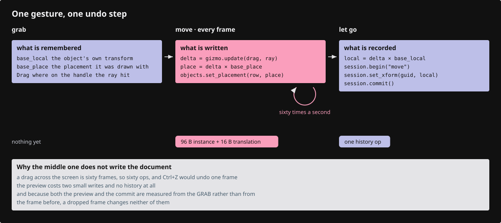

# 21 · Direct editing

A plain drag moves an object, a gumball handle moves, turns or scales it, and an F10 control point follows the pointer, snapping to nearby geometry. The screen shows a preview while the pointer moves; the document changes once, on release, as one undo step.



## Step 1 · registration lines

Three gestures join the left-button table, tried in this order: control point, gumball handle, object.

`lessons/21/src/app/gesture/mod.rs` · type the lines tagged `register:control-drag`, `register:gizmo-drag` and `register:object-drag`

```rust
--8<-- "lessons/21/src/app/gesture/mod.rs:gesture-table"
```

`lessons/21/src/state/features.rs` · type the lines tagged `register:control_drag`, `register:gizmo`, `register:gizmo_drag`, `register:object_drag`, `register:snap` and `register:hydrate`

```rust
--8<-- "lessons/21/src/state/features.rs:features-struct"
```

`lessons/21/src/state/features.rs` · type the lines tagged `register:editing` and `register:hydrate`

```rust
--8<-- "lessons/21/src/state/features.rs:features-hooks"
```

Copy the other lines tagged `register:` with a lesson 21 tag from these files of `lessons/21/`:

- `src/app/mod.rs`: the `cplane`, `deform`, `edit`, `gizmo`, `layers`, `mesh_preview`, `snap` and `surface_preview` modules.
- `src/state.rs`: the `drag`, `edit`, `hydrate` and `number_box` modules, and the `register:editing` calls that place the gizmo or cancel a gesture.
- `src/app/keys.rs`: Delete, Ctrl+Z, Ctrl+Shift+Z and Ctrl+Y.
- `src/lib.rs` and `src/app/input.rs`: the `Hydrated` message, and the calls that cancel a gesture or close the number box.
- `src/app/scene.rs`, `src/app/scene_sync.rs` and `src/app/scene_release.rs`: the preview, edge-step and `instancing` fields and calls.
- `src/app/scene_text.rs`: the two `text_edited` calls that make a text an undo step.
- `src/state/clipping.rs`: an instance's definition as the shape a plane cuts.
- `src/app/inspection.rs`: the drag, number box, snap, layer, instance and preview entries of the snapshot.

## Step 2 · src/app/cplane.rs

The three world planes a dragged point can slide on, the one the view faces, and where a ray hits it.

`lessons/21/src/app/cplane.rs` · type this, new file

```rust
--8<-- "lessons/21/src/app/cplane.rs:cplane"
```

## Step 3 · src/app/cplane.rs

Tests: the facing plane, a ray landing on it, rays that miss, and a millimetre kept a kilometre away.

`lessons/21/src/app/cplane.rs` · copy, append at the end of the file

```rust
--8<-- "lessons/21/src/app/cplane.rs:cplane-tests"
```

## Step 4 · src/app/snap.rs

The snap kinds, one bit per switch, the snap settings and a snap candidate.

`lessons/21/src/app/snap.rs` · type this, new file

```rust
--8<-- "lessons/21/src/app/snap.rs:snap-kinds"
```

## Step 5 · src/app/snap.rs

Candidates from a polyline, a closed loop's centre, and the Near and Perp points along wires under the pointer.

`lessons/21/src/app/snap.rs` · type this, append at the end of the file

```rust
--8<-- "lessons/21/src/app/snap.rs:snap-candidates"
```

## Step 6 · src/app/snap.rs

The snap points and wires of any placed geometry, and a count of its control points without collecting them.

`lessons/21/src/app/snap.rs` · type this, append at the end of the file

```rust
--8<-- "lessons/21/src/app/snap.rs:snap-geometry"
```

## Step 7 · src/app/snap.rs

Pick the winner inside the aperture: the better kind first, then the nearer point.

`lessons/21/src/app/snap.rs` · type this, append at the end of the file

```rust
--8<-- "lessons/21/src/app/snap.rs:snap-best"
```

## Step 8 · src/app/snap.rs

`Screen` maps world points, boxes and point chains to pixels, one matrix for many points.

`lessons/21/src/app/snap.rs` · type this, append at the end of the file

```rust
--8<-- "lessons/21/src/app/snap.rs:snap-screen"
```

## Step 9 · src/app/snap.rs

`Bins` sorts rows into screen cells a slice at a time, so a query reads only the cells near the pointer.

`lessons/21/src/app/snap.rs` · type this, append at the end of the file

```rust
--8<-- "lessons/21/src/app/snap.rs:snap-bins"
```

## Step 10 · src/app/snap.rs

Tests: candidates of lines and loops, ranking, rays, the screen mapping and the bins.

`lessons/21/src/app/snap.rs` · copy, append at the end of the file

```rust
--8<-- "lessons/21/src/app/snap.rs:snap-tests"
```

## Step 11 · src/app/gizmo.rs

The gizmo's pixel sizes, its handles and axes, their number box labels, and how a typed value is read.

`lessons/21/src/app/gizmo.rs` · type this, new file

```rust
--8<-- "lessons/21/src/app/gizmo.rs:gizmo-handles"
```

## Step 12 · src/app/gizmo.rs

What a drag remembers, the `Gizmo` itself, and the point on each handle where its number box is pinned.

`lessons/21/src/app/gizmo.rs` · type this, append at the end of the file

```rust
--8<-- "lessons/21/src/app/gizmo.rs:gizmo-struct"
```

## Step 13 · src/app/gizmo.rs

Which handle a ray hits: the hub, then the balls, the arms and the arcs.

`lessons/21/src/app/gizmo.rs` · type this, append at the end of the file

```rust
--8<-- "lessons/21/src/app/gizmo.rs:gizmo-hit"
```

## Step 14 · src/app/gizmo.rs

Start a drag, turn the pointer's travel into a move, turn or scale, or build one from a typed number; the impl closes.

`lessons/21/src/app/gizmo.rs` · type this, append at the end of the file

```rust
--8<-- "lessons/21/src/app/gizmo.rs:gizmo-drag"
```

## Step 15 · src/app/gizmo.rs

The small geometry helpers: softened scale, closest point on an axis, plane hits, angles and a transform about a pivot.

`lessons/21/src/app/gizmo.rs` · type this, append at the end of the file

```rust
--8<-- "lessons/21/src/app/gizmo.rs:gizmo-math"
```

## Step 16 · src/app/gizmo.rs

Tests: handles do not shadow each other, stay pixel sized, and every drag and typed value gives the right transform.

`lessons/21/src/app/gizmo.rs` · copy, append at the end of the file

```rust
--8<-- "lessons/21/src/app/gizmo.rs:gizmo-tests"
```

## Step 17 · src/app/deform.rs

A `Target` names the vertex, edge or face an edit moves, read from the current selection.

`lessons/21/src/app/deform.rs` · type this, new file

```rust
--8<-- "lessons/21/src/app/deform.rs:deform-target"
```

## Step 18 · src/app/deform.rs

The mesh vertex keys and surface control indices a target covers.

`lessons/21/src/app/deform.rs` · type this, append at the end of the file

```rust
--8<-- "lessons/21/src/app/deform.rs:deform-keys"
```

## Step 19 · src/app/deform.rs

The points a target covers in any geometry, where the gumball centres.

`lessons/21/src/app/deform.rs` · type this, append at the end of the file

```rust
--8<-- "lessons/21/src/app/deform.rs:deform-points"
```

## Step 20 · src/app/deform.rs

A copy of the geometry with the target moved, one arm per geometry type.

`lessons/21/src/app/deform.rs` · type this, append at the end of the file

```rust
--8<-- "lessons/21/src/app/deform.rs:deform-transform"
```

## Step 21 · src/app/deform.rs

Refuse a BRep edit whose edge curves no longer lie on their surfaces.

`lessons/21/src/app/deform.rs` · type this, append at the end of the file

```rust
--8<-- "lessons/21/src/app/deform.rs:deform-validate"
```

## Step 22 · src/app/deform.rs

Tests: a mesh face, edge numbering, a surface boundary and a box face.

`lessons/21/src/app/deform.rs` · copy, append at the end of the file

```rust
--8<-- "lessons/21/src/app/deform.rs:deform-tests"
```

## Step 23 · src/app/layers.rs

What one layers-panel row controls: a document or a kind of geometry.

`lessons/21/src/app/layers.rs` · type this, new file

```rust
--8<-- "lessons/21/src/app/layers.rs:layer-model"
```

## Step 24 · src/app/layers.rs

The panel rows: documents first, then the kinds present, with their counts.

`lessons/21/src/app/layers.rs` · type this, append at the end of the file

```rust
--8<-- "lessons/21/src/app/layers.rs:layer-rows"
```

## Step 25 · src/app/layers.rs

Open `impl Scene`: the current layer new objects go to, found by name in the tree.

`lessons/21/src/app/layers.rs` · type this, append at the end of the file

```rust
--8<-- "lessons/21/src/app/layers.rs:layer-current"
```

## Step 26 · src/app/layers.rs

Add, rename and remove layers, names kept unique in their document.

`lessons/21/src/app/layers.rs` · type this, append at the end of the file

```rust
--8<-- "lessons/21/src/app/layers.rs:layer-edit"
```

## Step 27 · src/app/layers.rs

Move objects onto another layer without moving them in the world.

`lessons/21/src/app/layers.rs` · type this, append at the end of the file

```rust
--8<-- "lessons/21/src/app/layers.rs:layer-move"
```

## Step 28 · src/app/layers.rs

Run each layer edit as one undo step, and take back a step that failed; the brace closes the impl.

`lessons/21/src/app/layers.rs` · type this, append at the end of the file

```rust
--8<-- "lessons/21/src/app/layers.rs:layer-steps"
```

## Step 29 · src/app/layers.rs

Layer step labels, renames seen by undo, and the graph edges an Add Edge step made.

`lessons/21/src/app/layers.rs` · type this, append at the end of the file

```rust
--8<-- "lessons/21/src/app/layers.rs:layer-history"
```

## Step 30 · src/app/layers.rs

Tree helpers: unique names, a layer's frame, placing an object under it, and a node's placement.

`lessons/21/src/app/layers.rs` · type this, append at the end of the file

```rust
--8<-- "lessons/21/src/app/layers.rs:layer-tree"
```

## Step 31 · src/app/layers.rs

Tests: panel rows, counts, and every layer edit with its undo and redo.

`lessons/21/src/app/layers.rs` · copy, append at the end of the file

```rust
--8<-- "lessons/21/src/app/layers.rs:layer-tests"
```

## Step 32 · src/app/edit.rs

A second `impl Scene`: move many rows by one world delta, one undo step per document.

`lessons/21/src/app/edit.rs` · type this, new file

```rust
--8<-- "lessons/21/src/app/edit.rs:edit-transform"
```

## Step 33 · src/app/edit.rs

Make a row's session private, read and set its local transform, and turn a world move into a local one.

`lessons/21/src/app/edit.rs` · type this, append at the end of the file

```rust
--8<-- "lessons/21/src/app/edit.rs:edit-rows"
```

## Step 34 · src/app/edit.rs

Delete one row, or many rows and texts as one undo step across documents.

`lessons/21/src/app/edit.rs` · type this, append at the end of the file

```rust
--8<-- "lessons/21/src/app/edit.rs:edit-delete"
```

## Step 35 · src/app/edit.rs

Undo and redo across documents, newest first, keeping a layer edit whole; the brace closes the impl.

`lessons/21/src/app/edit.rs` · type this, append at the end of the file

```rust
--8<-- "lessons/21/src/app/edit.rs:edit-history"
```

## Step 36 · src/app/edit.rs

Move one control point of a polyline or curve, the world point turned into the object's frame first.

`lessons/21/src/app/edit.rs` · type this, append at the end of the file

```rust
--8<-- "lessons/21/src/app/edit.rs:edit-control-point"
```

## Step 37 · src/app/edit.rs

Tests: group moves, shared files, scaled placements, undo across documents, control points and texts.

`lessons/21/src/app/edit.rs` · copy, append at the end of the file

```rust
--8<-- "lessons/21/src/app/edit.rs:edit-tests"
```

## Step 38 · src/app/edit.rs

After the tests, one more `impl Scene`: move a subobject, replace geometry, and replace many rows as one step.

`lessons/21/src/app/edit.rs` · type this, append at the end of the file

```rust
--8<-- "lessons/21/src/app/edit.rs:edit-subobject"
```

## Step 39 · src/app/edit.rs

Move a control point to a world point, and show a geometry on the GPU without touching the document.

`lessons/21/src/app/edit.rs` · type this, append at the end of the file

```rust
--8<-- "lessons/21/src/app/edit.rs:edit-preview"
```

## Step 40 · src/app/mesh_preview.rs

A mesh's GPU rows tagged with vertex keys, and the few rows one drag touches.

`lessons/21/src/app/mesh_preview.rs` · type this, new file

```rust
--8<-- "lessons/21/src/app/mesh_preview.rs:mesh-preview-rows"
```

## Step 41 · src/app/mesh_preview.rs

Match the uploaded vertices, pipes and markers back to the mesh's keys.

`lessons/21/src/app/mesh_preview.rs` · type this, append at the end of the file

```rust
--8<-- "lessons/21/src/app/mesh_preview.rs:mesh-preview-capture"
```

## Step 42 · src/app/mesh_preview.rs

Collect the rows a drag of one target moves or reshapes, and count the preview's bytes.

`lessons/21/src/app/mesh_preview.rs` · type this, append at the end of the file

```rust
--8<-- "lessons/21/src/app/mesh_preview.rs:mesh-preview-begin"
```

## Step 43 · src/app/mesh_preview.rs

Patch those rows in place with the drag applied, or put them back.

`lessons/21/src/app/mesh_preview.rs` · type this, append at the end of the file

```rust
--8<-- "lessons/21/src/app/mesh_preview.rs:mesh-preview-apply"
```

## Step 44 · src/app/mesh_preview.rs

Test: a drag on a 10,201-vertex mesh touches only the rows around the face.

`lessons/21/src/app/mesh_preview.rs` · copy, append at the end of the file

```rust
--8<-- "lessons/21/src/app/mesh_preview.rs:mesh-preview-tests"
```

## Step 45 · src/app/surface_preview.rs

What a surface preview keeps from the upload: each vertex's parameter, the pipes and their ends.

`lessons/21/src/app/surface_preview.rs` · type this, new file

```rust
--8<-- "lessons/21/src/app/surface_preview.rs:surface-preview-struct"
```

## Step 46 · src/app/surface_preview.rs

Capture one surface or BRep upload, matching each pipe end to a vertex.

`lessons/21/src/app/surface_preview.rs` · type this, append at the end of the file

```rust
--8<-- "lessons/21/src/app/surface_preview.rs:surface-preview-capture"
```

## Step 47 · src/app/surface_preview.rs

Evaluate the changed surfaces again at every kept parameter, and move the pipes with them.

`lessons/21/src/app/surface_preview.rs` · type this, append at the end of the file

```rust
--8<-- "lessons/21/src/app/surface_preview.rs:surface-preview-evaluate"
```

## Step 48 · src/app/surface_preview.rs

Tests: coincident samples, a lone surface's four edges, and a box face moved and cancelled.

`lessons/21/src/app/surface_preview.rs` · copy, append at the end of the file

```rust
--8<-- "lessons/21/src/app/surface_preview.rs:surface-preview-tests"
```

## Step 49 · src/app/surface_preview.rs

After the tests, the helper that finds the surfaces inside a geometry.

`lessons/21/src/app/surface_preview.rs` · type this, append at the end of the file

```rust
--8<-- "lessons/21/src/app/surface_preview.rs:surface-preview-surfaces"
```

## Step 50 · src/app/scene_instances.rs

The batches: a definition walked once under a hidden row, drawn by every instance row.

`lessons/21/src/app/scene_instances.rs` · type this, new file

```rust
--8<-- "lessons/21/src/app/scene_instances.rs:instancing-state"
```

## Step 51 · src/app/scene_instances.rs

Open `impl Scene`: one row per drawable instance, and the rows an instance owns alone.

`lessons/21/src/app/scene_instances.rs` · type this, append at the end of the file

```rust
--8<-- "lessons/21/src/app/scene_instances.rs:add-instances"
```

## Step 52 · src/app/scene_instances.rs

Find or walk the batch of a definition, or decide it is drawn per instance.

`lessons/21/src/app/scene_instances.rs` · type this, append at the end of the file

```rust
--8<-- "lessons/21/src/app/scene_instances.rs:batches"
```

## Step 53 · src/app/scene_instances.rs

Kill, create, redraw or move an instance row during a sync.

`lessons/21/src/app/scene_instances.rs` · type this, append at the end of the file

```rust
--8<-- "lessons/21/src/app/scene_instances.rs:reconcile-instance"
```

## Step 54 · src/app/scene_instances.rs

Walk a document's batches and instance rows again after a compaction.

`lessons/21/src/app/scene_instances.rs` · type this, append at the end of the file

```rust
--8<-- "lessons/21/src/app/scene_instances.rs:rewalk-instances"
```

## Step 55 · src/app/scene_instances.rs

Look up an instance's definition, faces, batch row and name; after the impl, a walk's box and flags go onto an object row.

`lessons/21/src/app/scene_instances.rs` · type this, append at the end of the file

```rust
--8<-- "lessons/21/src/app/scene_instances.rs:instance-lookup"
```

## Step 56 · src/app/scene_instances.rs

Tests: one walk serves every instance, and every instance edit leaves the rows of a scene loaded fresh.

`lessons/21/src/app/scene_instances.rs` · copy, append at the end of the file

```rust
--8<-- "lessons/21/src/app/scene_instances.rs:instance-tests"
```

## Step 57 · src/app/scene.rs

Tests: a created text keeps its GPU anchor, and element features move with their element.

`lessons/21/src/app/scene.rs` · copy, append at the end of the file

```rust
--8<-- "lessons/21/src/app/scene.rs:editing-tests"
```

## Step 58 · src/app/scene.rs

A released document fetched and decoded again, as the message that brings it back.

`lessons/21/src/app/scene.rs` · type this, append at the end of the file

```rust
--8<-- "lessons/21/src/app/scene.rs:hydrated"
```

## Step 59 · src/app/scene_sync.rs

A dragged row's mesh and surface previews, captured from a walk of that row alone.

`lessons/21/src/app/scene_sync.rs` · type this, append at the end of the file

```rust
--8<-- "lessons/21/src/app/scene_sync.rs:sync-previews"
```

## Step 60 · src/app/scene_sync.rs

Tests: deleted clouds, compaction, many-document deletes and objects outside the tree.

`lessons/21/src/app/scene_sync.rs` · copy, append at the end of the file

```rust
--8<-- "lessons/21/src/app/scene_sync.rs:sync-editing-tests"
```

## Step 61 · src/app/scene_release.rs

Ask for a released document's objects back, and put them back when they arrive.

`lessons/21/src/app/scene_release.rs` · type this, append at the end of the file

```rust
--8<-- "lessons/21/src/app/scene_release.rs:hydrate"
```

## Step 62 · src/app/scene_release.rs

Tests: released rows keep names and layers, the same file brings objects back, and a failed fetch waits for an edit.

`lessons/21/src/app/scene_release.rs` · copy, append at the end of the file

```rust
--8<-- "lessons/21/src/app/scene_release.rs:hydrate-tests"
```

## Step 63 · src/app/loader.rs

Fetch and decode a released document again; the answer comes back as `Msg::Hydrated`.

`lessons/21/src/app/loader.rs` · type this, append at the end of the file

```rust
--8<-- "lessons/21/src/app/loader.rs:spawn-hydrate"
```

## Step 64 · src/state/hydrate.rs

Edits that wait for released documents, why a row is locked, and the idle purge between edits.

`lessons/21/src/state/hydrate.rs` · type this, new file

```rust
--8<-- "lessons/21/src/state/hydrate.rs"
```

## Step 65 · src/state/edit.rs

What a gumball drag holds: the rows and their start placements, the handle, and a target with its source.

`lessons/21/src/state/edit.rs` · type this, new file

```rust
--8<-- "lessons/21/src/state/edit.rs:gizmo-drag-struct"
```

## Step 66 · src/state/edit.rs

Open `impl State`: centre the gizmo on the selection or its subobject, and grab a handle.

`lessons/21/src/state/edit.rs` · type this, append at the end of the file

```rust
--8<-- "lessons/21/src/state/edit.rs:place-gizmo"
```

## Step 67 · src/state/edit.rs

Follow the pointer: a subobject previews its geometry, whole objects move their GPU placements.

`lessons/21/src/state/edit.rs` · type this, append at the end of the file

```rust
--8<-- "lessons/21/src/state/edit.rs:drag-gizmo"
```

## Step 68 · src/state/edit.rs

Release records one undo step, a click opens the number box, and a cancel puts everything back.

`lessons/21/src/state/edit.rs` · type this, append at the end of the file

```rust
--8<-- "lessons/21/src/state/edit.rs:end-gizmo"
```

## Step 69 · src/state/edit.rs

Delete the selection, undo and redo, and reset the selection afterwards.

`lessons/21/src/state/edit.rs` · type this, append at the end of the file

```rust
--8<-- "lessons/21/src/state/edit.rs:delete-undo"
```

## Step 70 · src/state/edit.rs

Bring the rows in line with the documents after an edit, compacting when dead rows pile up.

`lessons/21/src/state/edit.rs` · type this, append at the end of the file

```rust
--8<-- "lessons/21/src/state/edit.rs:commit-rows"
```

## Step 71 · src/state/edit.rs

The scene length of one CSS pixel at the gizmo, and device pixels per CSS pixel; the brace closes the impl.

`lessons/21/src/state/edit.rs` · type this, append at the end of the file

```rust
--8<-- "lessons/21/src/state/edit.rs:world-per-px"
```

## Step 72 · src/state/edit.rs

Rotations and scales about a point, for the commands of lesson 23a.

`lessons/21/src/state/edit.rs` · type this, append at the end of the file

```rust
--8<-- "lessons/21/src/state/edit.rs:rotation-about"
```

## Step 73 · src/state/edit.rs

A control point drag: grab the selected point, preview the geometry with it moved, commit on release.

`lessons/21/src/state/edit.rs` · type this, append at the end of the file

```rust
--8<-- "lessons/21/src/state/edit.rs:control-drag"
```

## Step 74 · src/state/edit.rs

Where the point lands, snapped to another control or on its plane, and a scene point in pixels.

`lessons/21/src/state/edit.rs` · type this, append at the end of the file

```rust
--8<-- "lessons/21/src/state/edit.rs:control-target"
```

## Step 75 · src/state/edit.rs

Test: one CSS pixel covers the same scene length on a 1x and a 2x display.

`lessons/21/src/state/edit.rs` · copy, append at the end of the file

```rust
--8<-- "lessons/21/src/state/edit.rs:edit-state-tests"
```

## Step 76 · src/state/edit.rs

Four more small impl blocks: restore a subobject selection, redraw from the source, two frame hooks, and `apply`.

`lessons/21/src/state/edit.rs` · type this, append at the end of the file

```rust
--8<-- "lessons/21/src/state/edit.rs:edit-restore"
```

## Step 77 · src/state/drag.rs

The limits that keep an object drag fast: snap reach, bin cell, and per-move budgets.

`lessons/21/src/state/drag.rs` · type this, new file

```rust
--8<-- "lessons/21/src/state/drag.rs:drag-limits"
```

## Step 78 · src/state/drag.rs

An object drag, the objects it moves, and the snap targets it collects on the way.

`lessons/21/src/state/drag.rs` · type this, append at the end of the file

```rust
--8<-- "lessons/21/src/state/drag.rs:drag-state"
```

## Step 79 · src/state/drag.rs

Open `impl State`: past the click slop, ask the GPU pick what the press hit, and take hold when it answers.

`lessons/21/src/state/drag.rs` · type this, append at the end of the file

```rust
--8<-- "lessons/21/src/state/drag.rs:drag-start"
```

## Step 80 · src/state/drag.rs

Grab: select the object, lock-check the selection, and choose the grab point and its plane.

`lessons/21/src/state/drag.rs` · type this, append at the end of the file

```rust
--8<-- "lessons/21/src/state/drag.rs:drag-grab"
```

## Step 81 · src/state/drag.rs

Follow the pointer, snapped or on the plane, show the rows there, and commit or cancel.

`lessons/21/src/state/drag.rs` · type this, append at the end of the file

```rust
--8<-- "lessons/21/src/state/drag.rs:drag-follow"
```

## Step 82 · src/state/drag.rs

Find the best snap near the pointer, collecting nearby objects' points within a few milliseconds per move.

`lessons/21/src/state/drag.rs` · type this, append at the end of the file

```rust
--8<-- "lessons/21/src/state/drag.rs:drag-snaps"
```

## Step 83 · src/state/drag.rs

The view as a `Screen`, the snap marker, the drag as JSON; then the drag plane and offset.

`lessons/21/src/state/drag.rs` · type this, append at the end of the file

```rust
--8<-- "lessons/21/src/state/drag.rs:drag-status"
```

## Step 84 · src/state/drag.rs

Tests: the drag plane for each view, and the offset that takes the grab point to the target.

`lessons/21/src/state/drag.rs` · copy, append at the end of the file

```rust
--8<-- "lessons/21/src/state/drag.rs:drag-tests"
```

## Step 85 · src/state/number_box.rs

The number box a clicked handle opens, pinned to its handle on screen.

`lessons/21/src/state/number_box.rs` · type this, new file

```rust
--8<-- "lessons/21/src/state/number_box.rs:number-prompt"
```

## Step 86 · src/state/number_box.rs

Close the box, or apply the typed value as one undo step.

`lessons/21/src/state/number_box.rs` · type this, append at the end of the file

```rust
--8<-- "lessons/21/src/state/number_box.rs:number-typed"
```

## Step 87 · src/state/number_box.rs

A tap that opened a number box; lesson 23 adds the line that raises the phone keyboard.

`lessons/21/src/state/number_box.rs` · type this, append at the end of the file

```rust
--8<-- "lessons/21/src/state/number_box.rs:number-tap"
```

## Step 88 · src/app/gesture/control.rs

The control point gesture: a press on the selected point grabs it, a click puts it back.

`lessons/21/src/app/gesture/control.rs` · type this, new file

```rust
--8<-- "lessons/21/src/app/gesture/control.rs:control-gesture"
```

## Step 89 · src/app/gesture/gizmo.rs

The gumball gesture: a handle drags the selection, a click asks for a number.

`lessons/21/src/app/gesture/gizmo.rs` · type this, new file

```rust
--8<-- "lessons/21/src/app/gesture/gizmo.rs:gizmo-gesture"
```

## Step 90 · src/app/gesture/object.rs

The object gesture: only a mouse drag past the slop moves an object; a finger orbits.

`lessons/21/src/app/gesture/object.rs` · type this, new file

```rust
--8<-- "lessons/21/src/app/gesture/object.rs:object-gesture"
```

## Step 91 · src/app/keys.rs

A key binding with Ctrl held, for undo and redo.

`lessons/21/src/app/keys.rs` · type this, append at the end of the file

```rust
--8<-- "lessons/21/src/app/keys.rs:ctrl-key"
```

## Step 92 · src/app/inspection.rs

The number box and the selected geometry's shape, for the inspection snapshot.

`lessons/21/src/app/inspection.rs` · type this, append at the end of the file

```rust
--8<-- "lessons/21/src/app/inspection.rs:edit-snapshot"
```

## Step 93 · src/engine/gpu/clip.rs

GPU tests on rendered frames: sections hatched and watertight, nothing cut away shows or picks.

`lessons/21/src/engine/gpu/clip.rs` · copy, append at the end of the file

```rust
--8<-- "lessons/21/src/engine/gpu/clip.rs:clip-scene-tests"
```

## Step 94 · tests and example

Copy these files from `lessons/21/`:

- `tests/editing-extensions.cjs`, `tests/large-object-dragging.cjs`, `tests/live-shell-editing.cjs`, `tests/source-editing.cjs`, `tests/streamed-editing.cjs`: browser checks of drags, subobject edits, undo and streamed scenes.
- `examples/mk_extension_fixture.rs`: writes the two-beam fixture scene the editing checks load.

Run `cargo check` in `lessons/21/`.

## Check

`cargo check` compiles, and `cargo xtest --lib gizmo`, `cargo xtest --lib snap` and `cargo xtest --lib edit` pass. Drag an object: it follows the pointer, its grab point snaps to other objects' ends and middles, and Ctrl+Z puts it back; Delete removes the selection. The gumball handles already answer the pointer; lesson 25 draws them.
