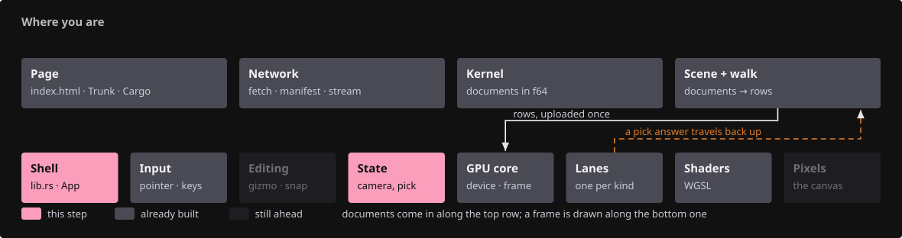
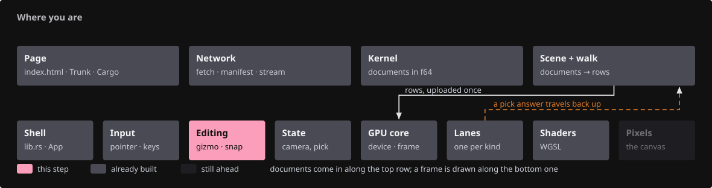
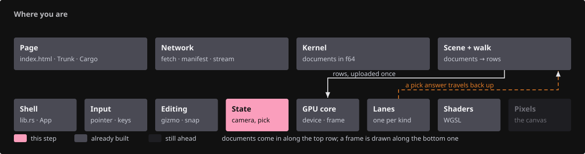
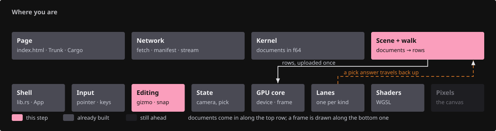
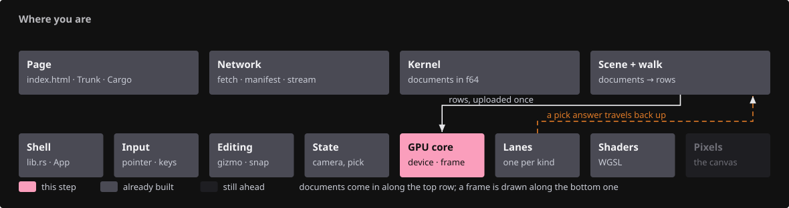
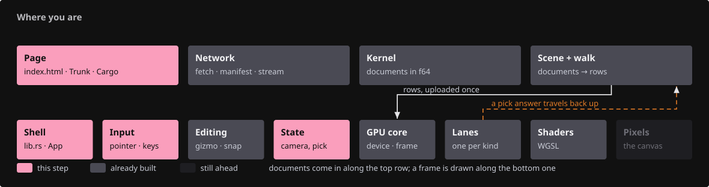

# 21 · Editing: the gumball, the command line and the layers panel

## You are building

Selecting an object puts a gumball on it. Dragging an arm moves it, and one drag is one undo
step. A colon opens a command line whose verbs are the actions the keys already have. `L` opens
a panel of layers, each row a filter over rows that already exist. A control point can be
dragged on the plane the view is facing, snapped to its neighbours.

## Starting point

- Checkpoint 20: documents, selection, hiding, and the kernel's undo history.
- Nothing edits anything yet: the viewer shows a document and never changes one.
- Every edit here goes through the kernel `Session`, so it is a change a save keeps.

<!-- step-status: start -->

**Does it compile yet?** `cargo check` passes after step 14; steps 1–13 fail and build again at step 14.

<!-- step-status: end -->

## Part A · The four pure pieces

### Step 1 · Name the modules first

{ .locator data-strip="illustrations/strip-ddafa5d3e8.svg" }

<!-- file: 21 session_viewer/src/app/mod.rs type -->

<!-- file: 21 session_viewer/src/state.rs type hunks=1 -->

- Eight modules named before any of them exists. The crate stops building here and starts
  again once the last of them is written, and that is the point: from here on, "does it
  compile" is a question about the code you just typed rather than about code Rust has not
  been told about.

### Step 2 · The construction plane

{ .locator data-strip="illustrations/strip-b283297fe6.svg" }

<!-- file: 21 session_viewer/src/app/cplane.rs type lines=1-16 -->

- Three world planes, named by the pair of axes they span. The third axis is the normal.

<!-- file: 21 session_viewer/src/app/cplane.rs type lines=17-69 -->

- `facing` picks the plane the camera is most nearly looking AT, not along: the world axis the
  view runs most along becomes the normal.
- A plane seen edge-on turns a pixel of cursor movement into metres of world movement, which is
  why the other choice is never made.
- `hit` is a ray-plane intersection that refuses a ray parallel to the plane rather than
  returning a point at infinity.

<!-- file: 21 session_viewer/src/app/cplane.rs type lines=70-132 -->

- The tests fix the tie-breaking: an exactly diagonal view has to choose, and it chooses Z then
  Y, so a level-ish view draws on the ground.

### Step 3 · Typed coordinates

{ .locator data-strip="illustrations/strip-b283297fe6.svg" }

<!-- file: 21 session_viewer/src/app/coords.rs type lines=1-32 -->

- Four forms, in f64: absolute, relative to the last point, polar, and a distance along a
  direction the caller already has.

<!-- file: 21 session_viewer/src/app/coords.rs type lines=33-72 -->

- `parse` returns `None` for anything that is not a coordinate, which is how a command line
  tells a verb from a point.
- `@5` alone is refused: an offset with no direction is not a point, and guessing one would put
  geometry somewhere nobody asked for.

<!-- file: 21 session_viewer/src/app/coords.rs type lines=73-115 -->

- `resolve` takes the plane and what the caller already knows. A form needing something the
  caller does not have resolves to `None` rather than to a guess.

<!-- file: 21 session_viewer/src/app/coords.rs type lines=116-190 -->

- NaN and infinity are rejected at the parser, so nothing downstream has to test for them.

### Step 4 · A ray from the cursor

{ .locator data-strip="illustrations/strip-5b09b0fedb.svg" }

<!-- file: 21 session_viewer/src/camera.rs type hunks=1 -->

- The same frustum half-extents `zoom_at` uses, at the target plane.
- Under perspective every ray starts at the eye; under orthographic they are parallel, so the
  origin moves across the target plane and the direction is the view axis.
- f64 throughout, deliberately: an f32 ray a kilometre out is already wrong by a millimetre
  before it reaches anything — the error the object table's anchor exists to keep out.

<!-- file: 21 session_viewer/src/camera.rs type hunks=2 -->

- The tests pin the centre ray, the corner rays, and that a zero viewport answers `None`.

### Step 5 · The widget

{ .locator data-strip="illustrations/strip-b283297fe6.svg" }

<!-- file: 21 session_viewer/src/app/gizmo.rs type lines=1-49 -->

- Sizes are in CSS pixels, so the widget is the same size on screen wherever the camera is.
- `GRAB` is wider than the 6 px pick radius: a handle is grabbed, not aimed at.
- `SCALE_SOFTENING` is a square root. The raw distance ratio doubles an object within a few
  pixels of the centre, where that ratio changes fastest; a square root flattens it without
  moving its fixed point, so 1 is still 1 and any factor is still reachable.

<!-- file: 21 session_viewer/src/app/gizmo.rs type lines=50-104 -->

- An axis knows its unit vector and the two axes spanning the plane it is normal to.
- `Drag` remembers where the grab was, not where the pointer was last frame.

<!-- file: 21 session_viewer/src/app/gizmo.rs type lines=105-121 -->

<!-- file: 21 session_viewer/src/app/gizmo.rs type lines=122-158 -->

- `hit` tests OUTWARD from the centre: the uniform-scale ball first, then the axis balls, then
  the arms, then the rotation arcs. A handle nearer the hub can never be shadowed by one
  further out.
- The arcs are restricted to the quadrant where both in-plane coordinates are negative, which
  is what keeps them clear of the arm tips at the same radius.

<!-- file: 21 session_viewer/src/app/gizmo.rs type lines=159-192 -->

- `begin` answers `None` when the ray cannot resolve against the handle — sighting straight
  down a translate axis has no answer, so there is no drag.

<!-- file: 21 session_viewer/src/app/gizmo.rs type lines=193-251 -->

- Every drag is measured from its grab, never accumulated: a drag that adds a delta per frame
  drifts, and a dropped frame changes the result.
- `typed` gives a number box the same meaning a drag has: millimetres, degrees, a factor.

<!-- file: 21 session_viewer/src/app/gizmo.rs type lines=252-403 -->

- The arithmetic is f64 and free of the camera, the GPU and wgpu.
- `closest_on_axis` is the point on the axis nearest the ray, which is what a translate drag
  follows; `plane_hit` is what a rotation follows.

<!-- file: 21 session_viewer/src/app/gizmo.rs type lines=404-533 -->

- The tests fix the two properties that matter: the handles do not shadow each other, and the
  widget's grab radius is constant in pixels rather than in world units.

### Step 6 · Snapping

{ .locator data-strip="illustrations/strip-b283297fe6.svg" }

<!-- file: 21 session_viewer/src/app/snap.rs type lines=1-35 -->

- The kinds are ordered, and the order is the tie-break: an endpoint beats a point-on-edge.
- A user reaching for an end and getting "somewhere along it" has to undo; the reverse is a
  small correction.

<!-- file: 21 session_viewer/src/app/snap.rs type lines=36-65 -->

- A two-point line has one midpoint and two ends and no interior vertex; a closed loop has no
  ends at all, which is why the caller says whether it is closed.

<!-- file: 21 session_viewer/src/app/snap.rs type lines=66-113 -->

- `best` ranks in SCREEN space through a projection the caller supplies. Two candidates a metre
  apart in the world can be one pixel apart on screen, and it is the pixel distance the user is
  aiming with.
- Taking the projection as an argument is what keeps this module free of the camera.

<!-- file: 21 session_viewer/src/app/snap.rs type lines=114-191 -->

## Part B · An edit reaches the document

### Step 7 · Copy-on-write, and one gesture as one step

{ .locator data-strip="illustrations/strip-095e57f333.svg" }

<!-- file: 21 session_viewer/src/app/edit.rs type lines=1-30 -->

- A manifest listing one file twice hands both placements the same `Rc<Session>`, and the live
  source keeps a third.

<!-- file: 21 session_viewer/src/app/edit.rs type lines=31-132 -->

- `writable` calls `Rc::make_mut` BEFORE anything is written, and only for the document being
  edited: the other placements keep the session they were sharing.
- `set_row_xform` is what a drag calls ONCE, at the end, with the transform measured from its
  grab. Writing every intermediate frame would fill the history with a hundred ops that undo
  one gesture.
- Undo is per document, because the history is the document's: a viewer-wide stack would have
  to invent an order between edits to two files that never interacted.

<!-- file: 21 session_viewer/src/app/edit.rs type lines=133-178 -->

- A control-point edit is a `Session::replace`, which records the whole object before and
  after: the kernel's own undo step for a change that is not a placement.
- A geometry whose control points the kernel cannot set is refused, not silently ignored.

<!-- file: 21 session_viewer/src/app/edit.rs type lines=179-300 -->

- The first test is the rule the module exists for: move one placement, and assert the other
  stayed.

<!-- file: 21 session_viewer/src/app/scene.rs type -->

- `last_edited` is the only thing that says which document a bare Ctrl+Z means.

### Step 8 · The write a drag frame costs

{ .locator data-strip="illustrations/strip-472924b1e5.svg" }

<!-- file: 21 session_viewer/src/engine/gpu/objects.rs type hunks=1,2,3,4,5,6 -->

- Each row keeps its own box now, so a move recomputes the world box without walking the
  geometry again.
- `placed_row` is the whole arithmetic of a move, split out because a device is not needed to
  check it: the model matrix keeps a zero translation column, because the GPU adds the anchored
  translation itself and a matrix carrying the position twice draws at twice the distance.

<!-- file: 21 session_viewer/src/engine/gpu/objects.rs type hunks=7,8,9,10 -->

- `set_placement` writes 96 B of instance and 16 B of translation for one row: a drag frame
  costs the same whether the scene holds one object or a million.
- The true f64 translation is what changes; the anchored f32 is derived from it, because a
  delta written straight into the f32 is erased by the next re-anchor.
- `widget_row` is an identity row for geometry that is already in world coordinates. Row 0
  cannot be borrowed for it: row 0 is a real object as soon as the scene has one.

### Step 9 · The widget's rows

{ .locator data-strip="illustrations/strip-472924b1e5.svg" }

<!-- file: 21 session_viewer/src/engine/gpu/mod.rs type -->

<!-- file: 21 session_viewer/src/engine/gpu/render.rs type -->

- Three arms as strokes and four balls as markers, in the two lane types the control net
  already uses: the widget costs no shader, no pipeline and no pass, only rows.
- They are drawn last in the ink list, over the object they move.

## Part C · The gestures

### Step 10 · Grab, preview, commit

{ .locator data-strip="illustrations/strip-b283297fe6.svg" }

<!-- file: 21 session_viewer/src/state/edit.rs type lines=1-37 -->

- A drag is three moments, and the struct is what the middle one is measured from.

<!-- file: 21 session_viewer/src/state/edit.rs type lines=38-113 -->

- The widget sits on the selected row's box centre. A row with no box — a single point, a text
  label — gets no widget rather than one at the world origin.
- A preview writes the row's placement and nothing else: the document is untouched until the
  drag ends.

<!-- file: 21 session_viewer/src/state/edit.rs type lines=114-193 -->

- Letting go writes the document once, so one gesture is one undo step.
- An undo can bring an object back or take one away, so the rows are rebuilt rather than
  patched, and the selection is dropped because the row it named may not exist any more.

<!-- file: 21 session_viewer/src/state/edit.rs type lines=194-276 -->

- The arms are sized in pixels and converted to world at the widget's own depth.

### Step 11 · The command line

{ .locator data-strip="illustrations/strip-b283297fe6.svg" }

<!-- file: 21 session_viewer/src/app/command.rs type lines=1-33 -->

- Parsing is here and doing is in `State`, so what a line MEANS is testable without a window, a
  device or a scene.

<!-- file: 21 session_viewer/src/app/command.rs type lines=34-113 -->

- A verb the viewer does not have is an error with the word quoted back, never a silent no-op.
- `move` reads the coordinate parser's own syntax; spaces between the numbers become commas
  first, because a command line is typed with spaces.

<!-- file: 21 session_viewer/src/app/command.rs type lines=114-158 -->

<!-- file: 21 session_viewer/src/state/edit.rs type lines=277-380 -->

- Every arm calls an action the viewer already has, so a command cannot drift from the key that
  does the same thing.
- `rotate` and `scale` are centred on the widget's origin, not the file's, which is rarely
  where the object is.

### Step 12 · The layers panel

{ .locator data-strip="illustrations/strip-b283297fe6.svg" }

<!-- file: 21 session_viewer/src/app/layers.rs type lines=1-59 -->

- A panel row is a filter over rows that already exist, never a second copy of the scene.
- A kernel type the panel has no name for is `Other` rather than missing: a row that cannot be
  switched off is worse than a vague label.

<!-- file: 21 session_viewer/src/app/layers.rs type lines=60-102 -->

- A row carries its layer as text, because the rows are rebuilt on every scene change and a
  closure per row would have to be dropped with it.

<!-- file: 21 session_viewer/src/app/layers.rs type lines=103-166 -->

- Documents in load order, then the kinds actually present — never a row for a kind nothing in
  the scene has.

<!-- file: 21 session_viewer/src/app/layers.rs type lines=167-245 -->

<!-- file: 21 session_viewer/src/state/edit.rs type lines=381-453 -->

- Hiding a layer puts the same guids in the same `Scene.hidden` set that `H` writes, so a
  rebuild re-applies it and the two cannot disagree.
- A layer with anything still visible hides; a layer wholly hidden comes back, which makes one
  click enough on a half-hidden one.

### Step 13 · Control points

{ .locator data-strip="illustrations/strip-b283297fe6.svg" }

<!-- file: 21 session_viewer/src/state/edit.rs type lines=454-593 -->

- The pointer resolves through the construction plane, and the object's other control points
  are offered as snaps.
- The preview moves the dot alone; the commit replaces the geometry and walks the rows again,
  because the shape changed rather than its placement.

### Step 14 · Wire the page and the keys

{ .locator data-strip="illustrations/strip-bdbfc0cf30.svg" }

<!-- file: 21 session_viewer/src/app/feedback.rs type -->

- Labels go in with `textContent`, so a document named after a tag cannot become markup.

<!-- file: 21 session_viewer/index.html type -->

<!-- file: 21 session_viewer/Cargo.toml type -->

<!-- file: 21 session_viewer/src/app/input.rs type -->

- The left button is offered to the control drag, then the gizmo, then the picker: a press that
  lands on a handle never also picks what is behind it.
- The colon opens the command box, which then holds the keyboard — which is what lets a `z`
  typed into it be a letter rather than an undo.

<!-- file: 21 session_viewer/src/lib.rs type -->

<!-- file: 21 session_viewer/src/state.rs type hunks=2,3,4,5 -->

<!-- check: 21 -->

## Check

<!-- checkpoint: 21 -->

- Click an object: three coloured arms and four balls appear on it.
- Drag an arm: the object follows, and only that object moves.
- Ctrl+Z: it goes back. Ctrl+Shift+Z: forward again.
- `:` then `move 100,0,0`: the selection moves 100 mm in +x.
- `L`: the panel lists the documents and the kinds. Click a row: everything in it goes.
- F10 on a polyline, click a control dot, drag it: the shape follows, and it snaps to the other
  control points when it comes within twelve pixels of one.

## Try

- Drag an arm with the camera sighted straight down it: nothing moves, because there is no
  answer to where along the axis the pointer is.
- `:` then `scale 0`: refused. A zero scale is a singular matrix, and it would be baked into
  the geometry for good.
- Hide half a layer with `H`, then click that layer's row: the rest goes too, rather than the
  hidden half coming back.

## Questions and answers

**Why does a drag write the document only when it ends?**

*How to work it out.* Ask what the undo stack would hold if every frame wrote. A drag across
the screen is sixty frames, so sixty ops, and Ctrl+Z would undo one frame of a gesture.

*The answer.* Because one gesture is one step. The GPU row carries the preview, which costs two
small writes a frame and no history at all; the document is written once, with the transform
measured from the grab. That is also why `update` is measured from the grab rather than
accumulated: the commit and the preview then agree by construction.

**Two placements of one file share a `Rc<Session>`. What goes wrong without `Rc::make_mut`?**

*How to work it out.* `Rc` is shared ownership, not a copy. A mutation through one handle is
visible through every handle.

*The answer.* Moving one placement moves the other, and the live source's cached copy with
them. `writable` splits the session before anything is written, and only for the document being
edited, so the other placements keep what they were drawn with. The test moves the first
placement and asserts the second stayed.

**Why is the snap ranked in screen space rather than in world space?**

*How to work it out.* Ask what the user is aiming with. The cursor is a screen position, and
the aperture is a promise about the distance on screen.

*The answer.* Two candidates a metre apart in the world can be one pixel apart on screen, and
picking the world-nearest of those two would ignore where the pointer actually is. Ranking in
screen space also makes the aperture mean the same thing at every camera distance. The module
takes the projection as an argument, so it stays free of the camera.

## Next

- The course's last checkpoint. `docs/capstone.md` walks the whole viewer once more.
