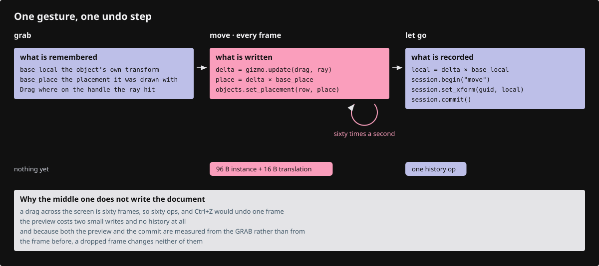

# 21 · Direct editing

**Estimated study time: about 115–230 hours.** Includes reading, typing, tracing, testing and experiments. [How to use this estimate](map.md#time-estimates).

**This section:** Implement direct editing, previews, cancellation and final commits.

**In the whole viewer:** This joins input, source controls, document history and GPU synchronization. It is a large integration step because all four must stay consistent.

**Follow the data:** Drag input → edit target → temporary preview → one source transaction → synchronized display.

**Start with these files:** [`src/app/edit.rs`](21-editing.md#code-21-007), [`src/app/gesture/mod.rs`](21-editing.md#code-21-010), [`src/app/scene_sync/preview.rs`](21-editing.md#code-21-069).

**Aim to explain:** What should differ between cancelling a drag and releasing it to accept the edit?

[Whole-viewer map and course milestones](map.md)

Moving a whole object and moving one of its controls are different operations. An edit target records which kind of source is selected before the gesture begins. The gesture previews a change, then commits one history transaction when the drag finishes.



Start from the working result of [step 20](20-history.md).

**One buildable step:** type the additions below in `workspace/handwritten`, then build and test. This step adds 11,218 lines across 43 files and may take several sittings. Individual listings are parts of this step, not separate build checkpoints.

<span id="code-21-001"></span>

## `src/lib.rs`

Insert **after line 56** of your current file.

Keep these preceding lines:

```rust
    Sheet(Box<SheetInit>),         // a drawing sheet starts streaming; register:sheets
    SheetChunk(SheetChunk),        // more segments arrived; register:sheets
    SheetEntity(app::sheet_query::Resolved), // a picked sheet entity answered; register:sheets
    CancelPointer,                 // the browser lost the pointer
```

Keep these following lines:

```rust
    Fonts(Vec<Vec<u8>>),           // the whole label fonts, main font first; register:loading
}

#[cfg(target_arch = "wasm32")]
```

Type these new lines:

```rust
--8<-- "typing/code/21-001.rs"
```

<span id="code-21-002"></span>

## `src/lib.rs`

Insert **after line 170** of your current file.

Keep these preceding lines:

```rust
            Msg::Ready(_) => {}
            Msg::Clear => state.clear(),
            Msg::Fit => state.fit_loaded(),
            Msg::File(doc, source) => state.append(doc, source),
```

Keep these following lines:

```rust
            Msg::Fonts(faces) => self.use_fonts(faces),   // register:loading
            Msg::Texts(texts) => state.set_texts(texts),  // register:scene_text
            Msg::StreamedCloud(init) => start_stream(state, init), // register:stream
            Msg::CloudChunk(c) => state.extend_streamed(c.idx, c.rows, c.to), // register:stream
```

Type these new lines:

```rust
--8<-- "typing/code/21-002.rs"
```

<span id="code-21-003"></span>

## `src/lib.rs`

Insert **after line 181** of your current file.

Keep these preceding lines:

```rust
            Msg::Sheet(init) => start_sheet(state, init), // register:sheets
            Msg::SheetChunk(c) => state.extend_sheet(c.idx, c.rows, c.to), // register:sheets
            Msg::SheetEntity(resolved) => state.sheet_entity(resolved), // register:sheets
            Msg::CancelPointer => {
```

Keep these following lines:

```rust
                self.input.cancel();
                state.touch();
            }
        }
```

Type these new lines:

```rust
--8<-- "typing/code/21-003.rs"
```

<span id="code-21-004"></span>

## `examples/mk_extension_fixture.rs`

Create this file. Type the complete listing, including comments and blank lines.

```rust
--8<-- "typing/code/21-004.rs"
```

<span id="code-21-005"></span>

## `src/app/cplane.rs`

A construction plane gives two local directions and an origin. It lets a screen ray become a point suitable for drawing or snapping. Parallel rays need special handling because they do not meet the plane at a unique finite point.

Create this file. Type the complete listing, including comments and blank lines.

```rust
--8<-- "typing/code/21-005.rs"
```

<span id="code-21-006"></span>

## `src/app/deform.rs`

Moving control data changes the geometry defined by it. The calculation must use a consistent coordinate space and update the intended components. A transform applied twice to already transformed data can produce unintended drift.

Create this file. Type the complete listing, including comments and blank lines.

```rust
--8<-- "typing/code/21-006.rs"
```

<span id="code-21-007"></span>

## `src/app/edit.rs`

An edit changes document data. A preview shows a possible result before it is committed. Cancellation should discard the preview; commit should create a coherent history operation that undo can reverse.

Create this file. Type the complete listing, including comments and blank lines.

```rust
--8<-- "typing/code/21-007.rs"
```

<span id="code-21-008"></span>

## `src/app/gesture/control.rs`

Create this file. Type the complete listing, including comments and blank lines.

```rust
--8<-- "typing/code/21-008.rs"
```

<span id="code-21-009"></span>

## `src/app/gesture/gizmo.rs`

Create this file. Type the complete listing, including comments and blank lines.

```rust
--8<-- "typing/code/21-009.rs"
```

<span id="code-21-010"></span>

## `src/app/gesture/mod.rs`

Insert **before the first line** of your current file.

Keep these following lines:

```rust

use crate::State;

// Gesture = one left-button tool, e.g. dragging an object; each lives in its own file beside this one.
```

Type these new lines:

```rust
--8<-- "typing/code/21-010.rs"
```

<span id="code-21-011"></span>

## `src/app/gesture/mod.rs`

Insert **after line 20** of your current file.

Keep these preceding lines:

```rust

/// Every left-button tool, tried in this order.
// Empty at lesson 12; lesson 21 adds the control, gizmo and object drags, one line each.
pub const GESTURES: &[&Gesture] = &[
```

Keep these following lines:

```rust
];

/// The first tool that takes a press at `at`.
pub fn press(state: &mut State, at: (f64, f64), reach: f64) -> Option<&'static Gesture> {
```

Type these new lines:

```rust
--8<-- "typing/code/21-011.rs"
```

<span id="code-21-012"></span>

## `src/app/gesture/mod.rs`

Append **after line 40** of your current file.

Blank lines before: **1**; after: **0**. End with a newline.

```rust
--8<-- "typing/code/21-012.rs"
```

<span id="code-21-013"></span>

## `src/app/gesture/object.rs`

Create this file. Type the complete listing, including comments and blank lines.

```rust
--8<-- "typing/code/21-013.rs"
```

<span id="code-21-014"></span>

## `src/app/gizmo.rs`

The gumball converts a screen drag into movement along an axis, in a plane, or around a rotation axis. That requires geometric constraints, not just adding screen pixels to world coordinates.

Create this file. Type the complete listing, including comments and blank lines.

```rust
--8<-- "typing/code/21-014.rs"
```

<span id="code-21-015"></span>

## `src/app/input.rs`

Insert **after line 168** of your current file.

Keep these preceding lines:

```rust
                false
            }
            WindowEvent::Focused(false) => {
                self.cancel();
```

Keep these following lines:

```rust
                state.interacting = false;
                true
            }
            WindowEvent::Touch(t) => {
```

Type these new lines:

```rust
--8<-- "typing/code/21-015.rs"
```

<span id="code-21-016"></span>

## `src/app/input.rs`

Insert **after line 192** of your current file.

Keep these preceding lines:

```rust
                if self.touch_edit.is_some()
                    && t.phase == TouchPhase::Started
                    && self.fingers.len() > 1
                {
```

Keep these following lines:

```rust
                    self.touch_edit = None;
                    self.gesture = None;
                    self.tool_held = false;
                    self.touch_cancelled = true;
```

Type these new lines:

```rust
--8<-- "typing/code/21-016.rs"
```

<span id="code-21-017"></span>

## `src/app/input.rs`

Insert **after line 216** of your current file.

Keep these preceding lines:

```rust
                }

                // a first finger closes the number box and may grab a control or a handle
                if t.phase == TouchPhase::Started && self.fingers.len() == 1 {
```

Keep these following lines:

```rust
                    self.last_cursor = at;
                    self.touch_down = at;
                    self.dragged = false;
                    // while drawing, a tap is only a point, like a mouse press
```

Type these new lines:

```rust
--8<-- "typing/code/21-017.rs"
```

<span id="code-21-018"></span>

## `src/app/input.rs`

Insert **after line 251** of your current file.

Keep these preceding lines:

```rust
                            // a finger that stayed put is a tap
                            let tap = !self.dragged;
                            (active.release)(state, at, tap);
```

Keep these following lines:

```rust
                        }
                        _ => {}
                    }
```

Type these new lines:

```rust
--8<-- "typing/code/21-018.rs"
```

<span id="code-21-019"></span>

## `src/app/input.rs`

Insert **after line 253** of your current file.

Keep these preceding lines:

```rust
                            (active.release)(state, at, tap);

                            state.number_box_tapped(tap); // register:editing
                        }
```

Keep these following lines:

```rust
                        _ => {}
                    }

                    if matches!(t.phase, TouchPhase::Ended | TouchPhase::Cancelled) {
```

Type these new lines:

```rust
--8<-- "typing/code/21-019.rs"
```

<span id="code-21-020"></span>

## `src/app/input.rs`

Insert **after line 330** of your current file.

Keep these preceding lines:

```rust
    fn left(&mut self, state: &mut State, btn: ElementState) -> bool {
        match btn {
            ElementState::Pressed => {
                let mut closed = false;
```

Keep these following lines:

```rust
                self.left_down = Some(self.last_cursor);
                self.dragged = false;
                // a running command that draws with the button, e.g. a lasso
```

Type these new lines:

```rust
--8<-- "typing/code/21-020.rs"
```

<span id="code-21-021"></span>

## `src/app/inspection.rs`

Insert **after line 78** of your current file.

Keep these preceding lines:

```rust
            .map(|r| state.gpu.objects.anchored_model(*r))
            .collect::<Vec<_>>()
    );
    snapshot["clipping"] = state.clipping_status(); // register:clipping
```

Keep these following lines:

```rust
    snapshot["undo_depth"] = undo_depth(state); // register:document
    snapshot["ssao"] = serde_json::json!(state.gpu.view.ssao);
    snapshot["locked_count"] = serde_json::json!(state.scene.locked.len());
    snapshot["color_count"] = serde_json::json!(state.scene.colors.len());
```

Type these new lines:

```rust
--8<-- "typing/code/21-021.rs"
```

<span id="code-21-022"></span>

## `src/app/inspection.rs`

Insert **after line 81** of your current file.

Keep these preceding lines:

```rust
    snapshot["clipping"] = state.clipping_status(); // register:clipping
    snapshot["object_drag"] = state.object_drag_status(); // register:editing
    snapshot["number_box"] = number_box(state); // register:editing
    snapshot["undo_depth"] = undo_depth(state); // register:document
```

Keep these following lines:

```rust
    snapshot["ssao"] = serde_json::json!(state.gpu.view.ssao);
    snapshot["locked_count"] = serde_json::json!(state.scene.locked.len());
    snapshot["color_count"] = serde_json::json!(state.scene.colors.len());
    snapshot["edge_color_count"] = serde_json::json!(state.scene.edge_colors.len());
```

Type these new lines:

```rust
--8<-- "typing/code/21-022.rs"
```

<span id="code-21-023"></span>

## `src/app/inspection.rs`

Insert **after line 88** of your current file.

Keep these preceding lines:

```rust
    snapshot["ssao"] = serde_json::json!(state.gpu.view.ssao);
    snapshot["locked_count"] = serde_json::json!(state.scene.locked.len());
    snapshot["color_count"] = serde_json::json!(state.scene.colors.len());
    snapshot["edge_color_count"] = serde_json::json!(state.scene.edge_colors.len());
```

Keep these following lines:

```rust
    snapshot["source_faces"] =
        serde_json::json!(parent.and_then(|row| match state.scene.geometry(row)? {
            session_rust::Geometry::BRep(brep) => Some(brep.face_count()),
            session_rust::Geometry::Element(element) => match element.geometry() {
```

Type these new lines:

```rust
--8<-- "typing/code/21-023.rs"
```

<span id="code-21-024"></span>

## `src/app/inspection.rs`

Insert **after line 98** of your current file.

Keep these preceding lines:

```rust
                _ => None,
            },
            _ => None,
        }));
```

Keep these following lines:

```rust
    snapshot["selected_kind"] =
        serde_json::json!(parent.and_then(|row| state.scene.geometry(row).map(kind)));
    snapshot["selected_bounds"] = serde_json::json!(parent.and_then(|row| {
        let b = state.gpu.objects.row_bounds(row)?;
```

Type these new lines:

```rust
--8<-- "typing/code/21-024.rs"
```

<span id="code-21-025"></span>

## `src/app/inspection.rs`

Insert **after line 109** of your current file.

Keep these preceding lines:

```rust
            [b.cx - b.hx, b.cy - b.hy, b.cz - b.hz],
            [b.cx + b.hx, b.cy + b.hy, b.cz + b.hz],
        ])
    }));
```

Keep these following lines:

```rust
    snapshot["scene_revision"] = serde_json::json!(state.scene.row_revision);
    let (dead_rows, free_rows, dead_bytes, graves, compactions) = state.scene.row_counters(); // register:document
    snapshot["dead_rows"] = serde_json::json!(dead_rows); // register:document
    snapshot["free_rows"] = serde_json::json!(free_rows); // register:document
```

Type these new lines:

```rust
--8<-- "typing/code/21-025.rs"
```

<span id="code-21-026"></span>

## `src/app/inspection.rs`

Insert **after line 121** of your current file.

Keep these preceding lines:

```rust
    let (tombs, tomb_bytes) = state.scene.tomb_counters(); // register:document
    snapshot["tombs"] = serde_json::json!(tombs); // register:document
    snapshot["tomb_bytes"] = serde_json::json!(tomb_bytes); // register:document
    snapshot["row_table_bytes"] = serde_json::json!(state.scene.row_table_bytes()); // register:document
```

Keep these following lines:

```rust
    let docs = &state.scene.docs;
    let slots = &state.gpu.arena.source_faces.slots;
    snapshot["instancing"] = serde_json::json!({
        "definitions": docs.iter().map(|d| d.session.definition_lookup.len()).sum::<usize>(),
```

Type these new lines:

```rust
--8<-- "typing/code/21-026.rs"
```

<span id="code-21-027"></span>

## `src/app/inspection.rs`

Insert **after line 127** of your current file.

Keep these preceding lines:

```rust
    let slots = &state.gpu.arena.source_faces.slots;
    snapshot["instancing"] = serde_json::json!({
        "definitions": docs.iter().map(|d| d.session.definition_lookup.len()).sum::<usize>(),
        "instances": docs.iter().map(|d| d.session.instance_lookup.len()).sum::<usize>(),
```

Keep these following lines:

```rust
        "gpu_draws": slots.draws().len(),
        "gpu_instances": slots.instances(),
    });
    let _ = canvas.set_attribute("data-viewer-inspection", &snapshot.to_string()); // a test reads it with getAttribute
```

Type these new lines:

```rust
--8<-- "typing/code/21-027.rs"
```

<span id="code-21-028"></span>

## `src/app/inspection.rs`

Append **after line 240** of your current file.

Blank lines before: **1**; after: **0**. End with a newline.

```rust
--8<-- "typing/code/21-028.rs"
```

<span id="code-21-029"></span>

## `src/app/keys.rs`

Insert **after line 70** of your current file.

Keep these preceding lines:

```rust
    }),
    // the first Esc cancels the command and keeps the selection, the next one clears it
    named(NamedKey::Escape, |s| s.escape()),
    named(NamedKey::F10, |s| s.enable_controls()), // register:controls
```

Keep these following lines:

```rust
    // register:view-front
    plain(&["1"], |s| s.camera.set_view(View::Front)),
    // register:view-back
    plain(&["2"], |s| s.camera.set_view(View::Back)),
```

Type these new lines:

```rust
--8<-- "typing/code/21-029.rs"
```

<span id="code-21-030"></span>

## `src/app/keys.rs`

Append **after line 125** of your current file.

Blank lines before: **1**; after: **0**. End with a newline.

```rust
--8<-- "typing/code/21-030.rs"
```

<span id="code-21-031"></span>

## `src/app/layers.rs`

A layer tree groups objects and carries visibility and display choices. A child can be locally visible while an ancestor hides the whole branch. Distinguish stored settings from the effective result after inheritance.

Create this file. Type the complete listing, including comments and blank lines.

```rust
--8<-- "typing/code/21-031.rs"
```

<span id="code-21-032"></span>

## `src/app/loader.rs`

Append **after line 964** of your current file.

Blank lines before: **1**; after: **0**. End with a newline.

```rust
--8<-- "typing/code/21-032.rs"
```

<span id="code-21-033"></span>

## `src/app/mesh_preview.rs`

Create this file. Type the complete listing, including comments and blank lines.

```rust
--8<-- "typing/code/21-033.rs"
```

<span id="code-21-034"></span>

## `src/app/mod.rs`

Insert **after line 4** of your current file.

Keep these preceding lines:

```rust
// `pub mod x;` makes src/app/x.rs part of the crate; each lesson adds the one line of the module it teaches.
// `#[cfg(target_arch = "wasm32")]` above a line compiles that module for the browser only.
pub mod clipping; // register:clipping
pub mod cloud_query; // register:cloud_query
```

Keep these following lines:

```rust
#[cfg(any(target_arch = "wasm32", test))] // register:decode
pub mod decode; // register:decode
pub mod feedback; // register:feedback
#[cfg(target_arch = "wasm32")] // register:fetch
```

Type these new lines:

```rust
--8<-- "typing/code/21-034.rs"
```

<span id="code-21-035"></span>

## `src/app/mod.rs`

Insert **after line 7** of your current file.

Keep these preceding lines:

```rust
pub mod cloud_query; // register:cloud_query
pub mod cplane; // register:cplane
#[cfg(any(target_arch = "wasm32", test))] // register:decode
pub mod decode; // register:decode
```

Keep these following lines:

```rust
pub mod feedback; // register:feedback
#[cfg(target_arch = "wasm32")] // register:fetch
pub mod fetch; // register:fetch
pub mod fonts; // register:fonts
```

Type these new lines:

```rust
--8<-- "typing/code/21-035.rs"
```

<span id="code-21-036"></span>

## `src/app/mod.rs`

Insert **after line 14** of your current file.

Keep these preceding lines:

```rust
#[cfg(target_arch = "wasm32")] // register:fetch
pub mod fetch; // register:fetch
pub mod fonts; // register:fonts
pub mod gesture; // register:gesture
```

Keep these following lines:

```rust
pub mod input; // register:input
#[cfg(any(target_arch = "wasm32", test))] // register:inspection
pub mod inspection; // register:inspection
pub mod keys; // register:keys
```

Type these new lines:

```rust
--8<-- "typing/code/21-036.rs"
```

<span id="code-21-037"></span>

## `src/app/mod.rs`

Insert **after line 20** of your current file.

Keep these preceding lines:

```rust
#[cfg(any(target_arch = "wasm32", test))] // register:inspection
pub mod inspection; // register:inspection
pub mod keys; // register:keys
pub mod knobs; // register:knobs
```

Keep these following lines:

```rust
#[cfg(target_arch = "wasm32")] // register:live
pub mod live; // register:live
#[cfg(target_arch = "wasm32")] // register:loader
pub mod loader; // register:loader
```

Type these new lines:

```rust
--8<-- "typing/code/21-037.rs"
```

<span id="code-21-038"></span>

## `src/app/mod.rs`

Insert **after line 26** of your current file.

Keep these preceding lines:

```rust
pub mod live; // register:live
#[cfg(target_arch = "wasm32")] // register:loader
pub mod loader; // register:loader
pub mod manifest; // register:manifest
```

Keep these following lines:

```rust
#[cfg(any(target_arch = "wasm32", test))] // register:range_gate
pub mod range_gate; // register:range_gate
#[cfg(target_arch = "wasm32")] // register:route
pub mod route; // register:route
```

Type these new lines:

```rust
--8<-- "typing/code/21-038.rs"
```

<span id="code-21-039"></span>

## `src/app/mod.rs`

Insert **after line 34** of your current file.

Keep these preceding lines:

```rust
pub mod route; // register:route
pub mod scene; // register:scene
pub mod selection; // register:selection
pub mod sheet_query; // register:sheet_query
```

Keep these following lines:

```rust
pub mod stream; // register:stream
pub mod touch; // register:touch
pub mod validate; // register:validate
pub mod walk; // register:walk
```

Type these new lines:

```rust
--8<-- "typing/code/21-039.rs"
```

<span id="code-21-040"></span>

## `src/app/mod.rs`

Insert **after line 36** of your current file.

Keep these preceding lines:

```rust
pub mod selection; // register:selection
pub mod sheet_query; // register:sheet_query
pub mod snap; // register:snap
pub mod stream; // register:stream
```

Keep these following lines:

```rust
pub mod touch; // register:touch
pub mod validate; // register:validate
pub mod walk; // register:walk
```

Type these new lines:

```rust
--8<-- "typing/code/21-040.rs"
```

<span id="code-21-041"></span>

## `src/app/scene.rs`

Insert **before the first line** of your current file.

Keep these following lines:

```rust
#[path = "scene_release.rs"] // register:release
mod release; // register:release
#[path = "scene_rows.rs"]
pub(crate) mod rows;
```

Type these new lines:

```rust
--8<-- "typing/code/21-041.rs"
```

<span id="code-21-042"></span>

## `src/app/scene.rs`

Insert **after line 59** of your current file.

Keep these preceding lines:

```rust
// `for<'a>`: each function takes any borrow of the scene and returns a name that lives as long as that borrow.
const NAMERS: &[for<'a> fn(&'a Scene, u32) -> Option<&'a str>] = &[
    Scene::text_name,            // register:scene_text
    Scene::sheet_name,           // register:sheets
```

Keep these following lines:

```rust
    Scene::released_object_name, // register:release
];

/// The open documents and their object rows; a row id stays with its object for the object's life.
```

Type these new lines:

```rust
--8<-- "typing/code/21-042.rs"
```

<span id="code-21-043"></span>

## `src/app/scene.rs`

Insert **after line 94** of your current file.

Keep these preceding lines:

```rust
    dead: Counts,                                 // lane rows holding nothing live
    dead_points: u32,                             // cloud points of dropped clouds
    compactions: u32,                             // editable lanes walked again
    loaded: bool,                                 // rows of a new document wait in the tables
```

Keep these following lines:

```rust
    pub(crate) bounds_stale: bool,                // the scene box may be larger than what is left
    edge_sources: Vec<(u32, u32)>,                // (object row, edge index) of each pipe
    guid_to_row: HashMap<(usize, Rc<str>), u32>,  // (document, guid) to row
    object_rows: u32,                             // object rows already on the GPU
```

Type these new lines:

```rust
--8<-- "typing/code/21-043.rs"
```

<span id="code-21-044"></span>

## `src/app/scene.rs`

Insert **after line 106** of your current file.

Keep these preceding lines:

```rust
    pub(crate) created_doc: Option<usize>,            // the `Created` document
    pub(crate) row_revision: u64,                     // bumped when rows come or go
    pub(crate) current_layer: Option<(usize, String)>, // (document, tree node) new objects go to
    pub(crate) layer_steps: u64,                      // layer steps made, for unique labels
```

Keep these following lines:

```rust
    pub(crate) groups: HashSet<(usize, Rc<str>)>, // (document, tree node guid) of each group
    pub(crate) text_rows: Vec<u32>, // text rows an undo, redo or delete showed or hid, for the GPU
    pub(crate) released: HashMap<usize, Released>, // documents drawn without their kernel objects; register:release
    asked: RefCell<Vec<usize>>, // released documents a read-only path needs; register:release
```

Type these new lines:

```rust
--8<-- "typing/code/21-044.rs"
```

<span id="code-21-045"></span>

## `src/app/scene.rs`

Insert **after line 117** of your current file.

Keep these preceding lines:

```rust
    tombed: Counts,                         // lane rows the tombs hold; register:document
    tomb_points: u64,                       // cloud points the tombs hold; register:document
    burials: u64,                           // tombs made, for their order; register:document
    tomb_cap: u64,                          // lane bytes the tombs may hold; register:document
```

Keep these following lines:

```rust
    #[cfg(test)]
    pub(crate) ledger: HashMap<u32, ObjectRow>, // object rows as the GPU would hold them
    #[cfg(test)]
    pub(crate) searches: usize,   // tree walks the syncs needed
```

Type these new lines:

```rust
--8<-- "typing/code/21-045.rs"
```

<span id="code-21-046"></span>

## `src/app/scene.rs`

Insert **after line 175** of your current file.

Keep these preceding lines:

```rust
            dead: Counts::default(),
            dead_points: 0,
            compactions: 0,
            loaded: false,
```

Keep these following lines:

```rust
            bounds_stale: false,
            edge_sources: Vec::new(),
            guid_to_row: HashMap::new(),
            object_rows: 0,
```

Type these new lines:

```rust
--8<-- "typing/code/21-046.rs"
```

<span id="code-21-047"></span>

## `src/app/scene.rs`

Insert **after line 187** of your current file.

Keep these preceding lines:

```rust
            created_doc: None,
            row_revision: 0,
            current_layer: None,
            layer_steps: 0,
```

Keep these following lines:

```rust
            groups: HashSet::new(),
            text_rows: Vec::new(),
            released: HashMap::new(),        // register:release
            asked: RefCell::new(Vec::new()), // register:release
```

Type these new lines:

```rust
--8<-- "typing/code/21-047.rs"
```

<span id="code-21-048"></span>

## `src/app/scene.rs`

Insert **after line 193** of your current file.

Keep these preceding lines:

```rust
            text_rows: Vec::new(),
            released: HashMap::new(),        // register:release
            asked: RefCell::new(Vec::new()), // register:release
            stream_ceiling: 0,               // register:stream
```

Keep these following lines:

```rust
            #[cfg(test)]
            ledger: HashMap::new(),
            #[cfg(test)]
            searches: 0,
```

Type these new lines:

```rust
--8<-- "typing/code/21-048.rs"
```

<span id="code-21-049"></span>

## `src/app/scene.rs`

Insert **after line 207** of your current file.

Keep these preceding lines:

```rust
        self.created_doc = None;
        self.undo_steps.clear();
        self.redo_steps.clear();
        self.current_layer = None;
```

Keep these following lines:

```rust
        self.groups.clear();
        self.released.clear(); // register:release
        self.asked.borrow_mut().clear(); // register:release
        self.docs.clear();
```

Type these new lines:

```rust
--8<-- "typing/code/21-049.rs"
```

<span id="code-21-050"></span>

## `src/app/scene.rs`

Insert **after line 247** of your current file.

Keep these preceding lines:

```rust
        self.staged = Staged::default();
        self.dead = Counts::default();
        self.dead_points = 0;
        self.loaded = false;
```

Keep these following lines:

```rust
        self.bounds_stale = false;
        self.edge_sources.clear();
        self.guid_to_row.clear();
        self.selected = None;
```

Type these new lines:

```rust
--8<-- "typing/code/21-050.rs"
```

<span id="code-21-051"></span>

## `src/app/scene.rs`

Insert **after line 254** of your current file.

Keep these preceding lines:

```rust
        self.guid_to_row.clear();
        self.selected = None;
        self.object_rows = 0;
        self.uploaded = Counts::default();
```

Keep these following lines:

```rust
        #[cfg(test)]
        self.ledger.clear();
    }
```

Type these new lines:

```rust
--8<-- "typing/code/21-051.rs"
```

<span id="code-21-052"></span>

## `src/app/scene.rs`

Insert **after line 372** of your current file.

Keep these preceding lines:

```rust
            gpu.grew_bounds(*row);
            self.bounds_stale = true;
        }
```

Keep these following lines:

```rust
        let mut dead = self.dead;
        dead = dead.plus(self.tombed); // register:document
        gpu.set_dead(dead, self.dead_points);
        gpu.refresh_samples();
```

Type these new lines:

```rust
--8<-- "typing/code/21-052.rs"
```

<span id="code-21-053"></span>

## `src/app/scene.rs`

Insert **after line 519** of your current file.

Keep these preceding lines:

```rust
                o.flags |= Instance::FLAG_HAS_FACES;
            }
        }
```

Keep these following lines:

```rust
        lap.mark("objects");

        // each row remembers the tree node it was placed from
        for node in session.tree.nodes() {
```

Type these new lines:

```rust
--8<-- "typing/code/21-053.rs"
```

<span id="code-21-054"></span>

## `src/app/scene.rs`

Insert **after line 639** of your current file.

Keep these preceding lines:

```rust
        }

        let &(parent, edge) = self.edge_sources.get((pick.sub & 0x7fff_ffff) as usize)?;
        let mut own = parent == pick.row;
```

Keep these following lines:

```rust
        (own && edge != u32::MAX).then_some(edge)
    }

    /// The solid face indices a row draws, and whether an instance draws them from its definition.
```

Type these new lines:

```rust
--8<-- "typing/code/21-054.rs"
```

<span id="code-21-055"></span>

## `src/app/scene.rs`

Insert **after line 646** of your current file.

Keep these preceding lines:

```rust

    /// The solid face indices a row draws, and whether an instance draws them from its definition.
    pub fn solid_faces(&self, row: u32) -> Option<(std::ops::Range<u32>, bool)> {
        let mut faces = self.face_range(row).map(|range| (range, false));
```

Keep these following lines:

```rust
        faces
    }

    /// Point `local` of the cloud on `row`; None when streamed.
```

Type these new lines:

```rust
--8<-- "typing/code/21-055.rs"
```

<span id="code-21-056"></span>

## `src/app/scene.rs`

Insert **after line 723** of your current file.

Keep these preceding lines:

```rust
        self.order.len()
            - self.ids.len()
            - self.tombs.len() // register:document
            - usize::from(self.sink.is_some())
```

Keep these following lines:

```rust
    }
}

/// File placement times the object's own transform.
```

Type these new lines:

```rust
--8<-- "typing/code/21-056.rs"
```

<span id="code-21-057"></span>

## `src/app/scene.rs`

Append **after line 1349** of your current file.

Blank lines before: **1**; after: **0**. End with a newline.

```rust
--8<-- "typing/code/21-057.rs"
```

<span id="code-21-058"></span>

## `src/app/scene_instances.rs`

Create this file. Type the complete listing, including comments and blank lines.

```rust
--8<-- "typing/code/21-058.rs"
```

<span id="code-21-059"></span>

## `src/app/scene_release.rs`

Insert **after line 103** of your current file.

Keep these preceding lines:

```rust

    /// The geometry type of a row, from its object or, when released, from the walk.
    pub fn shape(&self, row: u32) -> Option<Shape> {
        let mut geometry = self.geometry(row);
```

Keep these following lines:

```rust

        if let Some(geometry) = geometry {
            return Some(Shape::of(geometry));
        }
```

Type these new lines:

```rust
--8<-- "typing/code/21-059.rs"
```

<span id="code-21-060"></span>

## `src/app/scene_release.rs`

Append **after line 176** of your current file.

Blank lines before: **1**; after: **0**. End with a newline.

```rust
--8<-- "typing/code/21-060.rs"
```

<span id="code-21-061"></span>

## `src/app/scene_sync.rs`

Insert **after line 15** of your current file.

Keep these preceding lines:

```rust

#[path = "scene_sync/notes.rs"]
mod notes;
pub(crate) use notes::{commit, stepped};
```

Keep these following lines:

```rust

use super::Scene;
use super::rows::{
    Cap, FREE, Footprint, GEOMETRY, Note, PLACE, PRESENCE, SINK, SUBTREE, TOMB, Tomb,
```

Type these new lines:

```rust
--8<-- "typing/code/21-061.rs"
```

<span id="code-21-062"></span>

## `src/app/scene_sync.rs`

Insert **after line 293** of your current file.

Keep these preceding lines:

```rust

    /// Kill, create, redraw or move the row of one identity; true when a row came or went.
    fn reconcile(&mut self, item: &Work) -> bool {
        let mut instance: Option<bool> = None;
```

Keep these following lines:

```rust

        if let Some(changed) = instance {
            return changed;
        }
```

Type these new lines:

```rust
--8<-- "typing/code/21-062.rs"
```

<span id="code-21-063"></span>

## `src/app/scene_sync.rs`

Insert **after line 537** of your current file.

Keep these preceding lines:

```rust
        self.nodes[i] = Weak::new();
        self.ids.give(row);
        self.bounds_stale = true;
```

Keep these following lines:

```rust
    }

    /// Draw `row` from `geometry` without touching its document; `preview` during a drag.
    pub(crate) fn redraw(&mut self, row: u32, geometry: &Geometry, preview: bool) {
```

Type these new lines:

```rust
--8<-- "typing/code/21-063.rs"
```

<span id="code-21-064"></span>

## `src/app/scene_sync.rs`

Append **after line 598** of your current file.

Blank lines before: **1**; after: **0**. End with a newline.

```rust
--8<-- "typing/code/21-064.rs"
```

<span id="code-21-065"></span>

## `src/app/scene_sync/compaction.rs`

Insert **after line 51** of your current file.

Keep these preceding lines:

```rust
    /// Walk every editable document again into fresh lanes, in load order; ids and everything else stay.
    /// False, having asked for them, while a released document would lose its rows.
    pub fn rewalk_editable(&mut self, gpu: &mut Gpu) -> bool {
        let mut waiting = false;
```

Keep these following lines:

```rust

        if waiting {
            return false;
        }
```

Type these new lines:

```rust
--8<-- "typing/code/21-065.rs"
```

<span id="code-21-066"></span>

## `src/app/scene_sync/compaction.rs`

Insert **after line 79** of your current file.

Keep these preceding lines:

```rust
        self.edge_sources.clear();
        self.spans.clear();
        self.caps.clear();
        self.graves.clear();
```

Keep these following lines:

```rust

        // the fresh lanes hold no tomb: an undo walks the object again
        for (_, tomb) in std::mem::take(&mut self.tombs) {
            if tomb.foot == Footprint::Cloud {
```

Type these new lines:

```rust
--8<-- "typing/code/21-066.rs"
```

<span id="code-21-067"></span>

## `src/app/scene_sync/compaction.rs`

Insert **after line 169** of your current file.

Keep these preceding lines:

```rust
            });
            self.staged.geometry.push((row, object));
        }
```

Keep these following lines:

```rust
    }
}
```

Type these new lines:

```rust
--8<-- "typing/code/21-067.rs"
```

<span id="code-21-068"></span>

## `src/app/scene_sync/editing_tests.rs`

Create this file. Type the complete listing, including comments and blank lines.

```rust
--8<-- "typing/code/21-068.rs"
```

<span id="code-21-069"></span>

## `src/app/scene_sync/preview.rs`

Create this file. Type the complete listing, including comments and blank lines.

```rust
--8<-- "typing/code/21-069.rs"
```

<span id="code-21-070"></span>

## `src/app/scene_sync/testing.rs`

Insert **after line 198** of your current file.

Keep these preceding lines:

```rust
        for &(owner, _) in &self.edge_sources {
            assert!(
                owner == u32::MAX
                    || self.identity_of(owner).is_some()
```

Keep these following lines:

```rust
                    || self.owners.get(owner as usize) == Some(&TOMB),
                "a pipe names dead row {owner}"
            );
        }
```

Type these new lines:

```rust
--8<-- "typing/code/21-070.rs"
```

<span id="code-21-071"></span>

## `src/app/scene_sync/tombs.rs`

Insert **after line 80** of your current file.

Keep these preceding lines:

```rust
                points,
            },
        );
```

Keep these following lines:

```rust
    }

    /// Show a buried identity again when its tomb holds this very object walked the same way; false when it walks anew.
    pub(super) fn revive(&mut self, item: &Work, geometry: &Geometry) -> bool {
```

Type these new lines:

```rust
--8<-- "typing/code/21-071.rs"
```

<span id="code-21-072"></span>

## `src/app/scene_text.rs`

Insert **after line 114** of your current file.

Keep these preceding lines:

```rust
        let key = format!("{CREATED_TEXT}{next}");
        let loaded = self.loaded; // an edit keeps the GPU anchor, only a load re-centres it
        self.register_text(key.clone(), label, true);
        self.loaded = loaded;
```

Keep these following lines:

```rust
        let row = self.texts[self.texts.len() - 1].row;
        self.text_rows.push(row);
        row
    }
```

Type these new lines:

```rust
--8<-- "typing/code/21-072.rs"
```

<span id="code-21-073"></span>

## `src/app/scene_text.rs`

Insert **after line 125** of your current file.

Keep these preceding lines:

```rust
    pub(crate) fn delete_text(&mut self, row: u32) -> bool {
        let Some(label) = self.retire_text(row) else {
            return false;
        };
```

Keep these following lines:

```rust
        true
    }

    /// Retire the active text on `row`; its undo label, None when no text is there.
```

Type these new lines:

```rust
--8<-- "typing/code/21-073.rs"
```

<span id="code-21-074"></span>

## `src/app/snap.rs`

Snapping compares candidates such as endpoints and other geometric features. Screen distance reflects how close they look to the pointer, while world coordinates define the chosen result. A tolerance prevents distant candidates from stealing the cursor.

Create this file. Type the complete listing, including comments and blank lines.

```rust
--8<-- "typing/code/21-074.rs"
```

<span id="code-21-075"></span>

## `src/app/surface_preview.rs`

Create this file. Type the complete listing, including comments and blank lines.

```rust
--8<-- "typing/code/21-075.rs"
```

<span id="code-21-076"></span>

## `src/engine/gpu/clip.rs`

Append **after line 939** of your current file.

Blank lines before: **1**; after: **0**. End with a newline.

```rust
--8<-- "typing/code/21-076.rs"
```

<span id="code-21-077"></span>

## `src/engine/gpu/clip/editing_tests.rs`

Create this file. Type the complete listing, including comments and blank lines.

```rust
--8<-- "typing/code/21-077.rs"
```

<span id="code-21-078"></span>

## `src/state.rs`

Insert **after line 13** of your current file.

Keep these preceding lines:

```rust
use crate::engine::performance::{heap_mb, now_ms};
// Each `mod` line below carries a `register` tag naming its feature; the course adds the line in that feature's lesson.
mod clipping; // register:clipping
mod cloud_query; // register:cloud_query
```

Keep these following lines:

```rust
mod features; // register:features
mod sheet_query; // register:sheet_query
mod text; // register:text
use features::Features;
```

Type these new lines:

```rust
--8<-- "typing/code/21-078.rs"
```

<span id="code-21-079"></span>

## `src/state.rs`

Insert **after line 16** of your current file.

Keep these preceding lines:

```rust
mod cloud_query; // register:cloud_query
mod drag; // register:drag
pub mod edit; // register:edit
mod features; // register:features
```

Keep these following lines:

```rust
mod sheet_query; // register:sheet_query
mod text; // register:text
use features::Features;
use std::sync::Arc;
```

Type these new lines:

```rust
--8<-- "typing/code/21-079.rs"
```

<span id="code-21-080"></span>

## `src/state.rs`

Insert **after line 133** of your current file.

Keep these preceding lines:

```rust

    /// Remove every document; camera and GPU stay.
    pub fn clear(&mut self) {
        self.load_camera = self.camera.pose(); // remember the view
```

Keep these following lines:

```rust
        self.selection = SelectionMode::Object;
        self.features.sheet_query = None; // register:sheets
        self.gpu.arena.source_faces.select(&self.gpu.ctx, None);
        self.controls = Controls::default();
```

Type these new lines:

```rust
--8<-- "typing/code/21-080.rs"
```

<span id="code-21-081"></span>

## `src/state.rs`

Insert **after line 138** of your current file.

Keep these preceding lines:

```rust
        self.selection = SelectionMode::Object;
        self.features.sheet_query = None; // register:sheets
        self.gpu.arena.source_faces.select(&self.gpu.ctx, None);
        self.controls = Controls::default();
```

Keep these following lines:

```rust
        self.scene.clear(&mut self.gpu);
        self.touch();
    }
```

Type these new lines:

```rust
--8<-- "typing/code/21-081.rs"
```

<span id="code-21-082"></span>

## `src/state.rs`

Insert **after line 140** of your current file.

Keep these preceding lines:

```rust
        self.gpu.arena.source_faces.select(&self.gpu.ctx, None);
        self.controls = Controls::default();
        self.features.resume.clear(); // a waiting Save or F10 belonged to the old scene; register:editing
        self.scene.clear(&mut self.gpu);
```

Keep these following lines:

```rust
        self.touch();
    }

    /// Fit the camera, unless the user already moved it.
```

Type these new lines:

```rust
--8<-- "typing/code/21-082.rs"
```

<span id="code-21-083"></span>

## `src/state.rs`

Insert **after line 248** of your current file.

Keep these preceding lines:

```rust
    }

    /// Something changed: drop pending picks, draw again.
    pub fn touch(&mut self) {
```

Keep these following lines:

```rust
        self.cancel_cloud_query(); // register:cloud_query
        self.gpu.pick.cancel();
        self.dirty = true;
        self.needs_frame = true;
```

Type these new lines:

```rust
--8<-- "typing/code/21-083.rs"
```

<span id="code-21-084"></span>

## `src/state.rs`

Insert **after line 258** of your current file.

Keep these preceding lines:

```rust

    /// Select one row, or nothing.
    pub fn select(&mut self, row: Option<u32>) {
        let row = row.filter(|row| self.scene.selectable(*row));
```

Keep these following lines:

```rust

        // unhighlight the old selection and the clicked layers

        for old in self.highlighted.drain(..) {
```

Type these new lines:

```rust
--8<-- "typing/code/21-084.rs"
```

<span id="code-21-085"></span>

## `src/state.rs`

Insert **after line 286** of your current file.

Keep these preceding lines:

```rust
        }

        self.scene.selected = row;
        self.selection_order = row.into_iter().collect();
```

Keep these following lines:

```rust
        self.update_label(); // register:scene_text
        self.touch();
    }
```

Type these new lines:

```rust
--8<-- "typing/code/21-085.rs"
```

<span id="code-21-086"></span>

## `src/state.rs`

Insert **after line 333** of your current file.

Keep these preceding lines:

```rust
        }
        if selected.len() > 1 {
            self.highlighted = selected;
        }
```

Keep these following lines:

```rust
        self.update_label(); // register:scene_text
        self.touch();
    }
```

Type these new lines:

```rust
--8<-- "typing/code/21-086.rs"
```

<span id="code-21-087"></span>

## `src/state.rs`

Insert **after line 415** of your current file.

Keep these preceding lines:

```rust
                    self.selection.select_edge(pick.row, edge);
                    self.gpu
                        .segments
                        .set_edge(&self.gpu.ctx, Some((pick.row, edge)));
```

Keep these following lines:

```rust
                    self.status(&format!("Edge {edge} selected"));
                    return;
                }
```

Type these new lines:

```rust
--8<-- "typing/code/21-087.rs"
```

<span id="code-21-088"></span>

## `src/state.rs`

Insert **after line 766** of your current file.

Keep these preceding lines:

```rust
            return;
        }
        // a released document comes back first
        let mut released = false;
```

Keep these following lines:

```rust

        if released {
            return;
        }
```

Type these new lines:

```rust
--8<-- "typing/code/21-088.rs"
```

<span id="code-21-089"></span>

## `src/state.rs`

Insert **after line 788** of your current file.

Keep these preceding lines:

```rust
            return;
        }

        // the gizmo would take the same clicks
```

Keep these following lines:

```rust
        self.selection.enable_controls(Some(parent), controls.cloud);
        self.gpu.arena.source_faces.select(&self.gpu.ctx, None);
        self.gpu.segments.set_edge(&self.gpu.ctx, None);
        self.gpu.set_selected(parent, false);
```

Type these new lines:

```rust
--8<-- "typing/code/21-089.rs"
```

<span id="code-21-090"></span>

## `src/state.rs`

Insert **after line 900** of your current file.

Keep these preceding lines:

```rust
            selected: Some(id),
            cloud,
        };
        self.upload_controls(); // register:controls
```

Keep these following lines:

```rust
        self.status(&format!("Selected {id:?}"));
        self.touch();
    }
}
```

Type these new lines:

```rust
--8<-- "typing/code/21-090.rs"
```

<span id="code-21-091"></span>

## `src/state.rs`

Insert **after line 966** of your current file.

Keep these preceding lines:

```rust
            self.gpu
                .arena
                .source_faces
                .select(&self.gpu.ctx, Some(address));
```

Keep these following lines:

```rust
            self.status(&format!("Face {} selected", source.face));
        }
    }
}
```

Type these new lines:

```rust
--8<-- "typing/code/21-091.rs"
```

<span id="code-21-092"></span>

## `src/state/clipping.rs`

Insert **after line 85** of your current file.

Keep these preceding lines:

```rust
                continue;
            }

            let mut shape = self.scene.geometry(row);
```

Keep these following lines:

```rust

            let Some(shape) = shape else {
                continue;
            };
```

Type these new lines:

```rust
--8<-- "typing/code/21-092.rs"
```

<span id="code-21-093"></span>

## `src/state/drag.rs`

Create this file. Type the complete listing, including comments and blank lines.

```rust
--8<-- "typing/code/21-093.rs"
```

<span id="code-21-094"></span>

## `src/state/edit.rs`

Create this file. Type the complete listing, including comments and blank lines.

```rust
--8<-- "typing/code/21-094.rs"
```

<span id="code-21-095"></span>

## `src/state/features.rs`

Insert **after line 1** of your current file.

Keep these preceding lines:

```rust
use super::State;
```

Keep these following lines:

```rust

/// What each feature keeps between frames; a feature adds its own file and one line here.
// Every field starts from its Default, so `State::new` never names one.
#[derive(Default)]
```

Type these new lines:

```rust
--8<-- "typing/code/21-095.rs"
```

<span id="code-21-096"></span>

## `src/state/features.rs`

Insert **after line 16** of your current file.

Keep these preceding lines:

```rust
    #[cfg(target_arch = "wasm32")] // register:cloud_query
    pub(super) query_generation: u64, // counts cloud queries, old answers dropped; register:cloud_query
    pub(super) sheet_query: Option<crate::app::sheet_query::Query>, // a sheet pick in flight; register:sheets
    pub(super) sheet_generation: u64, // counts sheet queries, old answers dropped; register:sheets
```

Keep these following lines:

```rust
    pub(super) clip_hidden: usize,    // register:clipping
}

// Each list starts empty; a later lesson adds one line per hook.
```

Type these new lines:

```rust
--8<-- "typing/code/21-096.rs"
```

<span id="code-21-097"></span>

## `src/state/features.rs`

Insert **after line 18** of your current file.

Keep these preceding lines:

```rust
    pub(super) sheet_query: Option<crate::app::sheet_query::Query>, // a sheet pick in flight; register:sheets
    pub(super) sheet_generation: u64, // counts sheet queries, old answers dropped; register:sheets
    pub(super) resume: Vec<hydrate::Resume>, // register:hydrate
    pub(super) clip_hidden: usize,    // register:clipping
```

Keep these following lines:

```rust
}

// Each list starts empty; a later lesson adds one line per hook.
// `fn(&mut State)` is a function pointer; a method such as `State::purge_idle` is one, with `self` as its first argument.
```

Type these new lines:

```rust
--8<-- "typing/code/21-097.rs"
```

<span id="code-21-098"></span>

## `src/state/features.rs`

Insert **after line 29** of your current file.

Keep these preceding lines:

```rust
// Each list starts empty; a later lesson adds one line per hook.
// `fn(&mut State)` is a function pointer; a method such as `State::purge_idle` is one, with `self` as its first argument.
/// Feature work on every frame, before the pick answers are applied.
pub(super) const BEFORE_PICKS: &[fn(&mut State)] = &[
```

Keep these following lines:

```rust
    State::update_clipping,  // register:clipping
];

/// Feature work on every frame, once the pick answers are applied.
```

Type these new lines:

```rust
--8<-- "typing/code/21-098.rs"
```

<span id="code-21-099"></span>

## `src/state/features.rs`

Insert **after line 36** of your current file.

Keep these preceding lines:

```rust
];

/// Feature work on every frame, once the pick answers are applied.
pub(super) const AFTER_PICKS: &[fn(&mut State)] = &[
```

Keep these following lines:

```rust
];

/// Features that take a pick answer before the selection does, in this order.
pub(super) const TAKE_PICK: &[fn(&mut State, Option<crate::engine::gpu::Pick>) -> bool] = &[
```

Type these new lines:

```rust
--8<-- "typing/code/21-099.rs"
```

<span id="code-21-100"></span>

## `src/state/features.rs`

Insert **after line 41** of your current file.

Keep these preceding lines:

```rust
];

/// Features that take a pick answer before the selection does, in this order.
pub(super) const TAKE_PICK: &[fn(&mut State, Option<crate::engine::gpu::Pick>) -> bool] = &[
```

Keep these following lines:

```rust
    #[cfg(target_arch = "wasm32")] // register:cloud_query
    State::take_cloud_pick, // register:cloud_query
];
```

Type these new lines:

```rust
--8<-- "typing/code/21-100.rs"
```

<span id="code-21-101"></span>

## `src/state/features.rs`

Insert **after line 48** of your current file.

Keep these preceding lines:

```rust
];

/// Features that widen what a viewport click on a row selects, e.g. to its whole group.
pub(super) const CLICK_ROWS: &[fn(&State, u32) -> Option<Vec<u32>>] = &[
```

Keep these following lines:

```rust
];
```

Type these new lines:

```rust
--8<-- "typing/code/21-101.rs"
```

<span id="code-21-102"></span>

## `src/state/hydrate.rs`

Create this file. Type the complete listing, including comments and blank lines.

```rust
--8<-- "typing/code/21-102.rs"
```

<span id="code-21-103"></span>

## `src/state/number_box.rs`

Create this file. Type the complete listing, including comments and blank lines.

```rust
--8<-- "typing/code/21-103.rs"
```

<span id="code-21-104"></span>

## `tests/editing-extensions.cjs`

Create this file. Type the complete listing, including comments and blank lines.

```javascript
--8<-- "typing/code/21-104.cjs"
```

<span id="code-21-105"></span>

## `tests/large-object-dragging.cjs`

Create this file. Type the complete listing, including comments and blank lines.

```javascript
--8<-- "typing/code/21-105.cjs"
```

<span id="code-21-106"></span>

## `tests/live-shell-editing.cjs`

Create this file. Type the complete listing, including comments and blank lines.

```javascript
--8<-- "typing/code/21-106.cjs"
```

<span id="code-21-107"></span>

## `tests/source-editing.cjs`

Create this file. Type the complete listing, including comments and blank lines.

```javascript
--8<-- "typing/code/21-107.cjs"
```

<span id="code-21-108"></span>

## `tests/streamed-editing.cjs`

Create this file. Type the complete listing, including comments and blank lines.

```javascript
--8<-- "typing/code/21-108.cjs"
```

## Check the completed chapter

From `session_viewer`, compare everything you have typed:

```sh
npm --prefix ../session_tests run course -- reference-check 21
```

From `workspace/handwritten`:

```sh
cargo build --lib --locked -j4
cargo xtest --lib --locked -j4
```

Run the native editing tests. Drag a control, cancel once, then repeat and finish. Verify that the finished drag undoes in one step.

If cancelling leaves modified geometry behind, compare the saved source state with the preview state. If undo takes many steps for one drag, inspect when the transaction commits.

**Before moving on:** explain what changed, check the expected result above, and fix any build or test failure.

<details>
<summary>Check your explanation of the opening question</summary>

Cancellation restores the saved state without committing the preview. Acceptance commits one transaction, so a single undo can reverse the whole gesture.

</details>

[Next step: 22](22-runtime-helpers.md)
