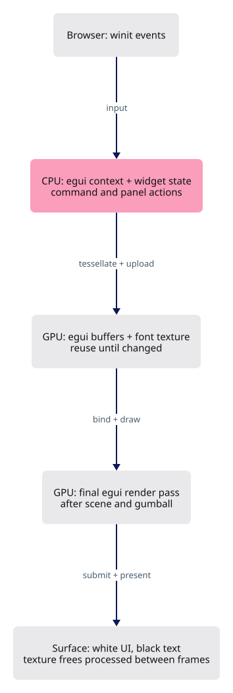

# 22 · The egui layer

**Estimated study time: about 7–15 hours.** Includes reading, typing, tracing, testing and experiments. [How to use this estimate](map.md#time-estimates).

**This section:** Draw the egui interface above the scene and manage its resources.

**In the whole viewer:** The interface participates in input handling and the final frame, while geometry editing still goes through application state.

**Follow the data:** UI event → widget state or application action → UI draw data → final overlay pass.

**Start with these files:** [`src/app/ui/mod.rs`](22-runtime-helpers.md#code-22-011), [`src/engine/gpu/ui.rs`](22-runtime-helpers.md#code-22-021).

**Aim to explain:** Why must the interface pass preserve the scene colour already in the target?

[Whole-viewer map and course milestones](map.md)

The controls sit above the 3D view, so their pass must preserve the colour already drawn. Egui prepares the interface geometry; this function records the draw into the same frame. Dropping the UI owner also releases the resources it owns.



Start from the working result of [step 21](21-editing.md).

**One buildable step:** type the additions below in `workspace/handwritten`, then build and test. This step adds 960 lines across 12 files and may take several sittings. Individual listings are parts of this step, not separate build checkpoints.

<span id="code-22-001"></span>

## `src/lib.rs`

Insert **after line 79** of your current file.

Keep these preceding lines:

```rust
    state: Option<State>,               // everything drawn, once the GPU is up
    proxy: Option<EventLoopProxy<Msg>>, // sends messages into the loop
    input: Input,                       // mouse and key gestures
    pointer_cancellation: Option<app::input::PointerCancellation>, // browser pointer-lost listener
```

Keep these following lines:

```rust
}

#[cfg(target_arch = "wasm32")]
impl App {
```

Type these new lines:

```rust
--8<-- "typing/code/22-001.rs"
```

<span id="code-22-002"></span>

## `src/lib.rs`

Insert **after line 95** of your current file.

Keep these preceding lines:

```rust
            proxy: Some(event_loop.create_proxy()),
            state: None,
            input: Input::new(),
            pointer_cancellation: None,
```

Keep these following lines:

```rust
        };
        // a browser loop cannot block: `spawn_app` hands the app over and returns at once
        event_loop.spawn_app(app);
        Ok(())
```

Type these new lines:

```rust
--8<-- "typing/code/22-002.rs"
```

<span id="code-22-003"></span>

## `src/lib.rs`

Insert **after line 109** of your current file.

Keep these preceding lines:

```rust
        if let Some((w, h)) = desired_canvas_size() {
            let _ = state.resize(w, h);
        }
```

Keep these following lines:

```rust
        state.window.request_redraw();
        self.state = Some(state);
    }
```

Type these new lines:

```rust
--8<-- "typing/code/22-003.rs"
```

<span id="code-22-004"></span>

## `src/lib.rs`

Insert **after line 195** of your current file.

Keep these preceding lines:

```rust
    }

    /// Handle one window event: redraw, resize, key or mouse.
    fn window_event(&mut self, event_loop: &ActiveEventLoop, _id: WindowId, event: WindowEvent) {
```

Keep these following lines:

```rust
        let Some(state) = &mut self.state else { return };

        // true when the scene must be drawn again
        let changed = match event {
```

Type these new lines:

```rust
--8<-- "typing/code/22-004.rs"
```

<span id="code-22-005"></span>

## `src/lib.rs`

Insert **after line 200** of your current file.

Keep these preceding lines:

```rust
        let Some(state) = &mut self.state else { return };

        // true when the scene must be drawn again
        let changed = match event {
```

Keep these following lines:

```rust
            WindowEvent::CloseRequested => {
                event_loop.exit();
                false
            }
```

Type these new lines:

```rust
--8<-- "typing/code/22-005.rs"
```

<span id="code-22-006"></span>

## `src/lib.rs`

Insert **after line 221** of your current file.

Keep these preceding lines:

```rust

                if held {
                    state.needs_frame = true;
                } else {
```

Keep these following lines:

```rust
                    state.render();
                }

                false
```

Type these new lines:

```rust
--8<-- "typing/code/22-006.rs"
```

<span id="code-22-007"></span>

## `src/lib.rs`

Insert **after line 224** of your current file.

Keep these preceding lines:

```rust
                } else {
                    // panels lay out, then the scene draws; register:egui
                    let repaint = self.ui.as_mut().is_some_and(|ui| ui.frame(state)); // register:egui
                    state.render();
```

Keep these following lines:

```rust
                }

                false
            }
```

Type these new lines:

```rust
--8<-- "typing/code/22-007.rs"
```

<span id="code-22-008"></span>

## `src/lib.rs`

Insert **after line 331** of your current file.

Keep these preceding lines:

```rust
            .collect();

        if let Ok(faces) = <[&'static [u8]; 3]>::try_from(faces) {
            state.use_fonts(faces); // register:scene_text
```

Keep these following lines:

```rust
        }
    }
}
```

Type these new lines:

```rust
--8<-- "typing/code/22-008.rs"
```

<span id="code-22-009"></span>

## `src/lib.rs`

Append **after line 387** of your current file.

Blank lines before: **1**; after: **0**. End with a newline.

```rust
--8<-- "typing/code/22-009.rs"
```

<span id="code-22-010"></span>

## `src/app/mod.rs`

Insert **after line 38** of your current file.

Keep these preceding lines:

```rust
pub mod snap; // register:snap
pub mod stream; // register:stream
pub mod surface_preview; // register:surface_preview
pub mod touch; // register:touch
```

Keep these following lines:

```rust
pub mod validate; // register:validate
pub mod walk; // register:walk
```

Type these new lines:

```rust
--8<-- "typing/code/22-010.rs"
```

<span id="code-22-011"></span>

## `src/app/ui/mod.rs`

A panel reads current application state and emits user intentions. Drawing a button is separate from applying its action. Keeping that boundary visible prevents UI layout code from silently taking ownership of geometry operations.

Create this file. Type the complete listing, including comments and blank lines.

```rust
--8<-- "typing/code/22-011.rs"
```

<span id="code-22-012"></span>

## `src/app/ui/number_box.rs`

Create this file. Type the complete listing, including comments and blank lines.

```rust
--8<-- "typing/code/22-012.rs"
```

<span id="code-22-013"></span>

## `src/app/ui/overlay.rs`

Create this file. Type the complete listing, including comments and blank lines.

```rust
--8<-- "typing/code/22-013.rs"
```

<span id="code-22-014"></span>

## `src/app/ui/pointer.rs`

Create this file. Type the complete listing, including comments and blank lines.

```rust
--8<-- "typing/code/22-014.rs"
```

<span id="code-22-015"></span>

## `src/app/ui/theme.rs`

Create this file. Type the complete listing, including comments and blank lines.

```rust
--8<-- "typing/code/22-015.rs"
```

<span id="code-22-016"></span>

## `src/engine/gpu/mod.rs`

Insert **after line 31** of your current file.

Keep these preceding lines:

```rust
pub mod targets; // register:targets
pub mod text; // register:text
pub mod text_outline; // register:text_outline
mod triangle_tiles; // register:triangle_tiles
```

Keep these following lines:

```rust
pub mod upload; // register:upload
pub mod vectors; // register:vectors
pub mod view; // register:view
```

Type these new lines:

```rust
--8<-- "typing/code/22-016.rs"
```

<span id="code-22-017"></span>

## `src/engine/gpu/mod.rs`

Insert **after line 82** of your current file.

Keep these preceding lines:

```rust
    pub segments: SegmentLane,                   // lines; register:strokes
    pub glyphs: GlyphLane,                       // markers and dots; register:markers
    pub controls: GlyphLane,                     // control point dots; register:shell
    pub control_net: SegmentLane,                // control polygon lines; register:shell
```

Keep these following lines:

```rust
    pub text: text::TextLane,                    // labels; register:text
    pub selection_revision: u64,                 // bumps on every selection change
    pub logical_size: [f64; 2],                  // canvas size in CSS pixels
    pub cloud: CloudLane,                        // point cloud buffers; register:clouds
```

Type these new lines:

```rust
--8<-- "typing/code/22-017.rs"
```

<span id="code-22-018"></span>

## `src/engine/gpu/mod.rs`

Insert **after line 234** of your current file.

Keep these preceding lines:

```rust
            segments,    // register:strokes
            glyphs,      // register:markers
            controls,    // register:shell
            control_net, // register:shell
```

Keep these following lines:

```rust
            text,        // register:text
            selection_revision: 0,
            logical_size: [size.0 as f64, size.1 as f64],
            cloud, // register:clouds
```

Type these new lines:

```rust
--8<-- "typing/code/22-018.rs"
```

<span id="code-22-019"></span>

## `src/engine/gpu/render.rs`

Insert **after line 35** of your current file.

Keep these preceding lines:

```rust
        // pass 2: ambient occlusion and the outline masks, each pass in turn
        self.each_pass(|pass, g| draws += pass.after_faces(g, encoder, &frame));
        draws += self.ink_pass(encoder, view); // pass 3: lines, markers, outlines and text; register:ink
        self.pending_pick(encoder); // a click waiting: draw the id pass now; register:shell
```

Keep these following lines:

```rust
        (draws, self.objects.len())
    }

    /// The first pass: each pass's own face passes, then the one the faces draw in.
```

Type these new lines:

```rust
--8<-- "typing/code/22-019.rs"
```

<span id="code-22-020"></span>

## `src/engine/gpu/render.rs`

Append **after line 458** of your current file.

Blank lines before: **1**; after: **0**. End with a newline.

```rust
--8<-- "typing/code/22-020.rs"
```

<span id="code-22-021"></span>

## `src/engine/gpu/ui.rs`

egui produces drawing data for panels and controls. The GPU integration uploads that data and draws it over the scene. Input ownership must agree with this visual layering so a panel click does not also edit geometry behind it.

Create this file. Type the complete listing, including comments and blank lines.

```rust
--8<-- "typing/code/22-021.rs"
```

<span id="code-22-022"></span>

## `src/state/edit.rs`

Append **after line 851** of your current file.

Blank lines before: **1**; after: **0**. End with a newline.

```rust
--8<-- "typing/code/22-022.rs"
```

<span id="code-22-023"></span>

## `tests/docked-workspace.cjs`

Create this file. Type the complete listing, including comments and blank lines.

```javascript
--8<-- "typing/code/22-023.cjs"
```

## Check the completed chapter

From `session_viewer`, compare everything you have typed:

```sh
npm --prefix ../session_tests run course -- reference-check 22
```

From `workspace/handwritten`:

```sh
cargo build --lib --locked -j4
cargo xtest --lib --locked -j4
```

Run the native tests, then open the viewer and interact with a panel. Check that it appears above the scene and receives its own pointer events.

If panels appear on a blank background, inspect the attachment load operation and pass order before changing panel colours.

**Before moving on:** explain what changed, check the expected result above, and fix any build or test failure.

<details>
<summary>Check your explanation of the opening question</summary>

It draws an overlay into the existing frame. Clearing that target would erase the 3D scene beneath the interface.

</details>

[Next step: 23](23-geometry-commands.md)
