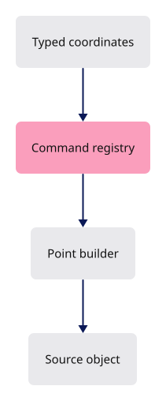
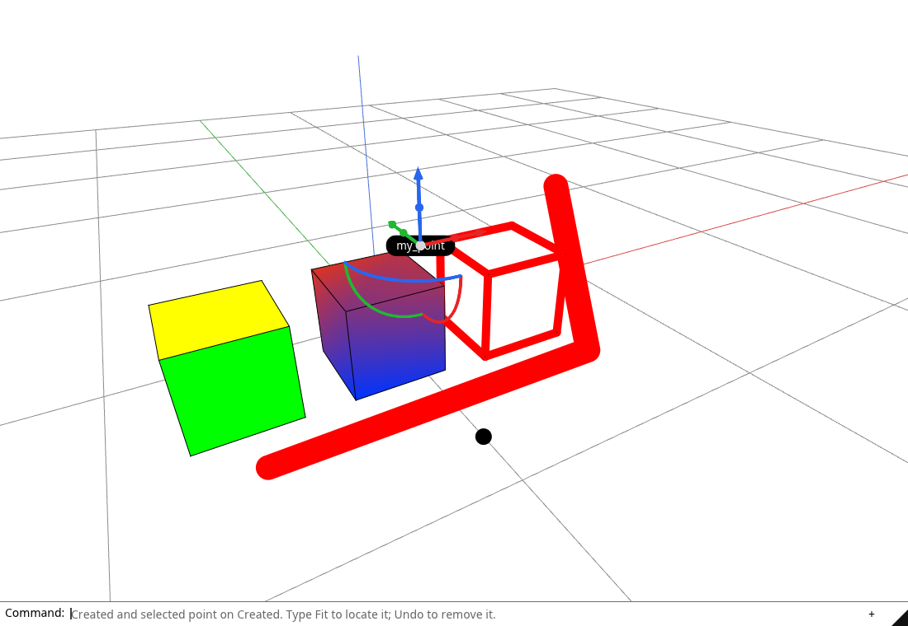

# 23 · The command line: one verb per file

**Estimated study time: about 45–85 hours.** Includes reading, typing, tracing, testing and experiments. [How to use this estimate](map.md#time-estimates).

**This section:** Connect command words and options to application actions.

**In the whole viewer:** The command layer is another entry point to the same state and document operations used by interactive controls.

**Follow the data:** Command text → matched verb and options → validated action → state/document change.

**Start with these files:** [`src/app/command/mod.rs`](23-geometry-commands.md#code-23-010), [`src/app/command/verbs/mod.rs`](23-geometry-commands.md#code-23-024).

**Aim to explain:** Where should a command such as a display toggle hand off its work?

[Whole-viewer map and course milestones](map.md)

A command definition tells the shared command system its name, input count and geometry builder. Point needs exactly one position. You also type the registry and parser in this chapter; sharing them keeps each verb small and the geometry creation has one clear home.



Start from the working result of [step 22](22-runtime-helpers.md).

**One buildable step:** type the additions below in `workspace/handwritten`, then build and test. This step adds 6,511 lines across 54 files and may take several sittings. Individual listings are parts of this step, not separate build checkpoints.

<span id="code-23-001"></span>

## `src/lib.rs`

Insert **after line 56** of your current file.

Keep these preceding lines:

```rust
    Sheet(Box<SheetInit>),         // a drawing sheet starts streaming; register:sheets
    SheetChunk(SheetChunk),        // more segments arrived; register:sheets
    SheetEntity(app::sheet_query::Resolved), // a picked sheet entity answered; register:sheets
    CancelPointer,                 // the browser lost the pointer
```

Keep these following lines:

```rust
    Hydrated(Box<app::scene::Hydrated>), // a released document's objects are back; register:editing
    Fonts(Vec<Vec<u8>>),           // the whole label fonts, main font first; register:loading
}
```

Type these new lines:

```rust
--8<-- "typing/code/23-001.rs"
```

<span id="code-23-002"></span>

## `src/lib.rs`

Insert **after line 82** of your current file.

Keep these preceding lines:

```rust
    state: Option<State>,               // everything drawn, once the GPU is up
    proxy: Option<EventLoopProxy<Msg>>, // sends messages into the loop
    input: Input,                       // mouse and key gestures
    pointer_cancellation: Option<app::input::PointerCancellation>, // browser pointer-lost listener
```

Keep these following lines:

```rust
    ui: Option<app::ui::Ui>,            // the egui panels; register:egui
}

#[cfg(target_arch = "wasm32")]
```

Type these new lines:

```rust
--8<-- "typing/code/23-002.rs"
```

<span id="code-23-003"></span>

## `src/lib.rs`

Insert **after line 99** of your current file.

Keep these preceding lines:

```rust
            proxy: Some(event_loop.create_proxy()),
            state: None,
            input: Input::new(),
            pointer_cancellation: None,
```

Keep these following lines:

```rust
            ui: None,    // register:egui
        };
        // a browser loop cannot block: `spawn_app` hands the app over and returns at once
        event_loop.spawn_app(app);
```

Type these new lines:

```rust
--8<-- "typing/code/23-003.rs"
```

<span id="code-23-004"></span>

## `src/lib.rs`

Insert **after line 159** of your current file.

Keep these preceding lines:

```rust
                Ok(listener) => self.pointer_cancellation = Some(listener),
                Err(error) => log::warn!("Cannot register pointer cancellation: {error:?}"),
            }
```

Keep these following lines:

```rust
            // async: GPU setup, then Msg::Ready
            wasm_bindgen_futures::spawn_local(app::loader::boot(window, proxy)); // register:loading
        }
    }
```

Type these new lines:

```rust
--8<-- "typing/code/23-004.rs"
```

<span id="code-23-005"></span>

## `src/lib.rs`

Insert **after line 189** of your current file.

Keep these preceding lines:

```rust
            Msg::CloudQueryResolved(resolved) => state.cloud_query_resolved(resolved), // register:cloud_query
            Msg::Sheet(init) => start_sheet(state, init), // register:sheets
            Msg::SheetChunk(c) => state.extend_sheet(c.idx, c.rows, c.to), // register:sheets
            Msg::SheetEntity(resolved) => state.sheet_entity(resolved), // register:sheets
```

Keep these following lines:

```rust
            Msg::CancelPointer => {
                state.cancel_gesture(); // register:editing
                self.input.cancel();
                state.touch();
```

Type these new lines:

```rust
--8<-- "typing/code/23-005.rs"
```

<span id="code-23-006"></span>

## `src/lib.rs`

Insert **after line 195** of your current file.

Keep these preceding lines:

```rust
                state.cancel_gesture(); // register:editing
                self.input.cancel();
                state.touch();
            }
```

Keep these following lines:

```rust
        }

        self.request_if_needed();
    }
```

Type these new lines:

```rust
--8<-- "typing/code/23-006.rs"
```

<span id="code-23-007"></span>

## `src/lib.rs`

Append **after line 474** of your current file.

Blank lines before: **1**; after: **0**. End with a newline.

```rust
--8<-- "typing/code/23-007.rs"
```

<span id="code-23-008"></span>

## `src/app/agent.rs`

A phone keyboard appears for a focused editable HTML element. The viewer bridges that text into its command interface. Focus, composition and cancellation need explicit handling so browser text entry and scene shortcuts do not conflict.

Create this file. Type the complete listing, including comments and blank lines.

```rust
--8<-- "typing/code/23-008.rs"
```

<span id="code-23-009"></span>

## `src/app/clipping.rs`

Append **after line 313** of your current file.

Blank lines before: **1**; after: **0**. End with a newline.

```rust
--8<-- "typing/code/23-009.rs"
```

<span id="code-23-010"></span>

## `src/app/command/mod.rs`

A registry is a table of command descriptions. It supports lookup, completion and help without spreading a second list of names through the UI. A small constructor supplies common defaults while each verb declares its exceptions.

Create this file. Type the complete listing, including comments and blank lines.

```rust
--8<-- "typing/code/23-010.rs"
```

<span id="code-23-011"></span>

## `src/app/command/tests.rs`

Create this file. Type the complete listing, including comments and blank lines.

```rust
--8<-- "typing/code/23-011.rs"
```

<span id="code-23-012"></span>

## `src/app/command/tool.rs`

A command can finish immediately or start an interaction that continues across frames. The tool representation keeps those stages explicit. Cancellation must clear transient state and leave the committed document coherent.

Create this file. Type the complete listing, including comments and blank lines.

```rust
--8<-- "typing/code/23-012.rs"
```

<span id="code-23-013"></span>

## `src/app/command/verbs/arrow.rs`

Each verb describes its accepted name, arguments and resulting action. Parsing recognizes the request; execution changes the document or starts a tool. Keeping these jobs separate makes invalid input easier to reject before anything changes.

Create this file. Type the complete listing, including comments and blank lines.

```rust
--8<-- "typing/code/23-013.rs"
```

<span id="code-23-014"></span>

## `src/app/command/verbs/clipping_plane.rs`

Create this file. Type the complete listing, including comments and blank lines.

```rust
--8<-- "typing/code/23-014.rs"
```

<span id="code-23-015"></span>

## `src/app/command/verbs/close.rs`

Create this file. Type the complete listing, including comments and blank lines.

```rust
--8<-- "typing/code/23-015.rs"
```

<span id="code-23-016"></span>

## `src/app/command/verbs/curve.rs`

Create this file. Type the complete listing, including comments and blank lines.

```rust
--8<-- "typing/code/23-016.rs"
```

<span id="code-23-017"></span>

## `src/app/command/verbs/delete.rs`

Create this file. Type the complete listing, including comments and blank lines.

```rust
--8<-- "typing/code/23-017.rs"
```

<span id="code-23-018"></span>

## `src/app/command/verbs/escape.rs`

Create this file. Type the complete listing, including comments and blank lines.

```rust
--8<-- "typing/code/23-018.rs"
```

<span id="code-23-019"></span>

## `src/app/command/verbs/explode.rs`

Create this file. Type the complete listing, including comments and blank lines.

```rust
--8<-- "typing/code/23-019.rs"
```

<span id="code-23-020"></span>

## `src/app/command/verbs/fit.rs`

Create this file. Type the complete listing, including comments and blank lines.

```rust
--8<-- "typing/code/23-020.rs"
```

<span id="code-23-021"></span>

## `src/app/command/verbs/geometry.rs`

Create this file. Type the complete listing, including comments and blank lines.

```rust
--8<-- "typing/code/23-021.rs"
```

<span id="code-23-022"></span>

## `src/app/command/verbs/hide.rs`

Create this file. Type the complete listing, including comments and blank lines.

```rust
--8<-- "typing/code/23-022.rs"
```

<span id="code-23-023"></span>

## `src/app/command/verbs/line.rs`

Create this file. Type the complete listing, including comments and blank lines.

```rust
--8<-- "typing/code/23-023.rs"
```

<span id="code-23-024"></span>

## `src/app/command/verbs/mod.rs`

Create this file. Type the complete listing, including comments and blank lines.

```rust
--8<-- "typing/code/23-024.rs"
```

<span id="code-23-025"></span>

## `src/app/command/verbs/open.rs`

Create this file. Type the complete listing, including comments and blank lines.

```rust
--8<-- "typing/code/23-025.rs"
```

<span id="code-23-026"></span>

## `src/app/command/verbs/point.rs`

Create this file. Type the complete listing, including comments and blank lines.

```rust
--8<-- "typing/code/23-026.rs"
```

<span id="code-23-027"></span>

## `src/app/command/verbs/polyline.rs`

Create this file. Type the complete listing, including comments and blank lines.

```rust
--8<-- "typing/code/23-027.rs"
```

<span id="code-23-028"></span>

## `src/app/command/verbs/redo.rs`

Create this file. Type the complete listing, including comments and blank lines.

```rust
--8<-- "typing/code/23-028.rs"
```

<span id="code-23-029"></span>

## `src/app/command/verbs/save.rs`

Create this file. Type the complete listing, including comments and blank lines.

```rust
--8<-- "typing/code/23-029.rs"
```

<span id="code-23-030"></span>

## `src/app/command/verbs/show.rs`

Create this file. Type the complete listing, including comments and blank lines.

```rust
--8<-- "typing/code/23-030.rs"
```

<span id="code-23-031"></span>

## `src/app/command/verbs/undo.rs`

Create this file. Type the complete listing, including comments and blank lines.

```rust
--8<-- "typing/code/23-031.rs"
```

<span id="code-23-032"></span>

## `src/app/coords.rs`

Text coordinates have syntax and units before they become geometric values. Parsing separates separators, numbers and optional forms. Reject ambiguous or incomplete input before a geometry operation receives it.

Create this file. Type the complete listing, including comments and blank lines.

```rust
--8<-- "typing/code/23-032.rs"
```

<span id="code-23-033"></span>

## `src/app/feedback.rs`

Insert **after line 20** of your current file.

Keep these preceding lines:

```rust
    {
        status.set_text_content(Some(message));
    }
```

Keep these following lines:

```rust
    log::info!("{message}");
}

/// Show a download's progress, unless another message is up; nothing is logged.
```

Type these new lines:

```rust
--8<-- "typing/code/23-033.rs"
```

<span id="code-23-034"></span>

## `src/app/feedback.rs`

Insert **after line 37** of your current file.

Keep these preceding lines:

```rust
        let shown = status.text_content().unwrap_or_default();

        if shown.is_empty() || shown == last {
            status.set_text_content(Some(message));
```

Keep these following lines:

```rust
        }
    }
}
```

Type these new lines:

```rust
--8<-- "typing/code/23-034.rs"
```

<span id="code-23-035"></span>

## `src/app/feedback.rs`

Append **after line 106** of your current file.

Blank lines before: **1**; after: **0**. End with a newline.

```rust
--8<-- "typing/code/23-035.rs"
```

<span id="code-23-036"></span>

## `src/app/input.rs`

Insert **after line 150** of your current file.

Keep these preceding lines:

```rust
                }

                self.last_cursor = at;
                let mut redraw = dragging;
```

Keep these following lines:

```rust
                redraw
            }
            WindowEvent::MouseWheel { delta, .. } => {
                // a mouse wheel reports lines, a touchpad pixels: 100 px count as one line
```

Type these new lines:

```rust
--8<-- "typing/code/23-036.rs"
```

<span id="code-23-037"></span>

## `src/app/input.rs`

Insert **after line 223** of your current file.

Keep these preceding lines:

```rust
                    self.touch_down = at;
                    self.dragged = false;
                    // while drawing, a tap is only a point, like a mouse press
                    let mut drawing = false;
```

Keep these following lines:

```rust

                    if !drawing {
                        self.gesture = gesture::press(state, at, TOUCH_REACH);
                    }
```

Type these new lines:

```rust
--8<-- "typing/code/23-037.rs"
```

<span id="code-23-038"></span>

## `src/app/input.rs`

Insert **after line 287** of your current file.

Keep these preceding lines:

```rust
                    Act::Moved => true,
                    Act::Tap(at) => {
                        // a command waiting for a point takes the tap, like a mouse click
                        let mut drawing = false;
```

Keep these following lines:

```rust

                        if drawing {
                        }
```

Type these new lines:

```rust
--8<-- "typing/code/23-038.rs"
```

<span id="code-23-039"></span>

## `src/app/input.rs`

Insert **after line 290** of your current file.

Keep these preceding lines:

```rust
                        let mut drawing = false;
                        drawing |= state.drafting(); // register:commands

                        if drawing {
```

Keep these following lines:

```rust
                        }

                        state.request_selection(at.0 as u32, at.1 as u32, false, false);
                        false
```

Type these new lines:

```rust
--8<-- "typing/code/23-039.rs"
```

<span id="code-23-040"></span>

## `src/app/input.rs`

Insert **after line 297** of your current file.

Keep these preceding lines:

```rust
                        state.request_selection(at.0 as u32, at.1 as u32, false, false);
                        false
                    }
                    // a command waiting for points takes both taps
```

Keep these following lines:

```rust
                    Act::Fit(_) => {
                        state.fit_all();
                        true
                    }
```

Type these new lines:

```rust
--8<-- "typing/code/23-040.rs"
```

<span id="code-23-041"></span>

## `src/app/input.rs`

Insert **after line 347** of your current file.

Keep these preceding lines:

```rust
                }

                // while drawing, a press is only a click
                let mut drawing = false;
```

Keep these following lines:

```rust
                self.plain = !self.ctrl && !self.shift && !drawing;

                if self.plain {
                    self.gesture = gesture::press(state, self.last_cursor, MOUSE_REACH);
```

Type these new lines:

```rust
--8<-- "typing/code/23-041.rs"
```

<span id="code-23-042"></span>

## `src/app/input.rs`

Insert **after line 381** of your current file.

Keep these preceding lines:

```rust
                    return false; // a drag, not a click
                }

                let mut drawing = false;
```

Keep these following lines:

```rust

                if drawing {
                }
                state.additive_selection = self.shift && !self.ctrl; // Shift adds to the selection
```

Type these new lines:

```rust
--8<-- "typing/code/23-042.rs"
```

<span id="code-23-043"></span>

## `src/app/input.rs`

Insert **after line 384** of your current file.

Keep these preceding lines:

```rust
                let mut drawing = false;
                drawing |= state.drafting(); // register:commands

                if drawing {
```

Keep these following lines:

```rust
                }
                state.additive_selection = self.shift && !self.ctrl; // Shift adds to the selection
                state.request_selection(
                    self.last_cursor.0 as u32,
```

Type these new lines:

```rust
--8<-- "typing/code/23-043.rs"
```

<span id="code-23-044"></span>

## `src/app/inspection.rs`

Insert **after line 77** of your current file.

Keep these preceding lines:

```rust
            .iter()
            .map(|r| state.gpu.objects.anchored_model(*r))
            .collect::<Vec<_>>()
    );
```

Keep these following lines:

```rust
    snapshot["clipping"] = state.clipping_status(); // register:clipping
    snapshot["object_drag"] = state.object_drag_status(); // register:editing
    snapshot["number_box"] = number_box(state); // register:editing
    snapshot["undo_depth"] = undo_depth(state); // register:document
```

Type these new lines:

```rust
--8<-- "typing/code/23-044.rs"
```

<span id="code-23-045"></span>

## `src/app/keys.rs`

Insert **after line 71** of your current file.

Keep these preceding lines:

```rust
    // the first Esc cancels the command and keeps the selection, the next one clears it
    named(NamedKey::Escape, |s| s.escape()),
    named(NamedKey::F10, |s| s.enable_controls()), // register:controls
    named(NamedKey::Delete, |s| s.delete_selected()), // register:delete
```

Keep these following lines:

```rust
    ctrl(&["z", "Z"], Some(true), |s| s.redo()), // register:redo-shift
    ctrl(&["z", "Z"], Some(false), |s| s.undo()), // register:undo
    ctrl(&["y", "Y"], None, |s| s.redo()), // register:redo
    // register:view-front
```

Type these new lines:

```rust
--8<-- "typing/code/23-045.rs"
```

<span id="code-23-046"></span>

## `src/app/keys.rs`

Insert **after line 91** of your current file.

Keep these preceding lines:

```rust
    // register:view-iso
    plain(&["7"], |s| s.camera.set_view(View::Iso)),
    // register:camera-reset
    plain(&["c", "C"], |s| s.camera.reset()),
```

Keep these following lines:

```rust
    plain(&["f", "F"], |s| s.fit_selected_or_all()),
    // register:show-points
    plain(&["q", "Q"], |s| {
        s.gpu.view.show_points = !s.gpu.view.show_points
```

Type these new lines:

```rust
--8<-- "typing/code/23-046.rs"
```

<span id="code-23-047"></span>

## `src/app/keys.rs`

Insert **after line 113** of your current file.

Keep these preceding lines:

```rust
    // register:ssao
    plain(&["g", "G"], |s| s.gpu.view.set_arctic(!s.gpu.view.ssao)),
    // register:lit
    plain(&["d", "D"], |s| s.gpu.view.lit = !s.gpu.view.lit),
```

Keep these following lines:

```rust
    plain(&["h", "H"], |s| s.hide_selected()),
    // register:show-all
    plain(&["s", "S"], |s| s.show_all()),
    // register:names
```

Type these new lines:

```rust
--8<-- "typing/code/23-047.rs"
```

<span id="code-23-048"></span>

## `src/app/layers.rs`

Append **after line 1669** of your current file.

Blank lines before: **1**; after: **0**. End with a newline.

```rust
--8<-- "typing/code/23-048.rs"
```

<span id="code-23-049"></span>

## `src/app/loader.rs`

Append **after line 983** of your current file.

Blank lines before: **1**; after: **0**. End with a newline.

```rust
--8<-- "typing/code/23-049.rs"
```

<span id="code-23-050"></span>

## `src/app/mod.rs`

Insert **after line 2** of your current file.

Keep these preceding lines:

```rust
// `pub mod x;` makes src/app/x.rs part of the crate; each lesson adds the one line of the module it teaches.
// `#[cfg(target_arch = "wasm32")]` above a line compiles that module for the browser only.
```

Keep these following lines:

```rust
pub mod clipping; // register:clipping
pub mod cloud_query; // register:cloud_query
pub mod cplane; // register:cplane
#[cfg(any(target_arch = "wasm32", test))] // register:decode
```

Type these new lines:

```rust
--8<-- "typing/code/23-050.rs"
```

<span id="code-23-051"></span>

## `src/app/mod.rs`

Insert **after line 6** of your current file.

Keep these preceding lines:

```rust
#[cfg(target_arch = "wasm32")] // register:agent
pub mod agent; // register:agent
pub mod clipping; // register:clipping
pub mod cloud_query; // register:cloud_query
```

Keep these following lines:

```rust
pub mod cplane; // register:cplane
#[cfg(any(target_arch = "wasm32", test))] // register:decode
pub mod decode; // register:decode
pub mod deform; // register:deform
```

Type these new lines:

```rust
--8<-- "typing/code/23-051.rs"
```

<span id="code-23-052"></span>

## `src/app/mod.rs`

Insert **after line 31** of your current file.

Keep these preceding lines:

```rust
#[cfg(target_arch = "wasm32")] // register:loader
pub mod loader; // register:loader
pub mod manifest; // register:manifest
pub mod mesh_preview; // register:mesh_preview
```

Keep these following lines:

```rust
#[cfg(any(target_arch = "wasm32", test))] // register:range_gate
pub mod range_gate; // register:range_gate
#[cfg(target_arch = "wasm32")] // register:route
pub mod route; // register:route
```

Type these new lines:

```rust
--8<-- "typing/code/23-052.rs"
```

<span id="code-23-053"></span>

## `src/app/mod.rs`

Insert **after line 38** of your current file.

Keep these preceding lines:

```rust
#[cfg(target_arch = "wasm32")] // register:route
pub mod route; // register:route
pub mod scene; // register:scene
pub mod selection; // register:selection
```

Keep these following lines:

```rust
pub mod sheet_query; // register:sheet_query
pub mod snap; // register:snap
pub mod stream; // register:stream
pub mod surface_preview; // register:surface_preview
```

Type these new lines:

```rust
--8<-- "typing/code/23-053.rs"
```

<span id="code-23-054"></span>

## `src/app/modeling.rs`

A modeling action selects source geometry, computes a result and records a document change. The display is updated from that change. Kernel algorithms do the geometric calculation; this layer owns viewer interaction and history.

Create this file. Type the complete listing, including comments and blank lines.

```rust
--8<-- "typing/code/23-054.rs"
```

<span id="code-23-055"></span>

## `src/app/scene_sync.rs`

Append **after line 602** of your current file.

Blank lines before: **1**; after: **0**. End with a newline.

```rust
--8<-- "typing/code/23-055.rs"
```

<span id="code-23-056"></span>

## `src/app/scene_sync/commands_tests.rs`

Create this file. Type the complete listing, including comments and blank lines.

```rust
--8<-- "typing/code/23-056.rs"
```

<span id="code-23-057"></span>

## `src/app/session_io.rs`

Saving serializes meaningful document state. GPU allocations, transient previews and pixels are derived data. Loading reconstructs the source document and then its display representation.

Create this file. Type the complete listing, including comments and blank lines.

```rust
--8<-- "typing/code/23-057.rs"
```

<span id="code-23-058"></span>

## `src/app/ui/command_line.rs`

Create this file. Type the complete listing, including comments and blank lines.

```rust
--8<-- "typing/code/23-058.rs"
```

<span id="code-23-059"></span>

## `src/app/ui/command_line/tests.rs`

Create this file. Type the complete listing, including comments and blank lines.

```rust
--8<-- "typing/code/23-059.rs"
```

<span id="code-23-060"></span>

## `src/app/ui/mod.rs`

Insert **after line 6** of your current file.

Keep these preceding lines:

```rust
use std::cell::Cell;
use theme::{BUNDLED, fonts, visuals};
use winit::window::Window;
mod overlay; // register:overlay
```

Keep these following lines:

```rust
mod pointer; // register:pointer
mod theme; // register:theme

/// Declare each panel's module and list it in PANELS, so a panel is one file plus one line.
```

Type these new lines:

```rust
--8<-- "typing/code/23-060.rs"
```

<span id="code-23-061"></span>

## `src/app/ui/mod.rs`

Insert **after line 25** of your current file.

Keep these preceding lines:

```rust
}

panels! {
    number_box,   // register:number_box
```

Keep these following lines:

```rust
}

// As with Lane in 04a, every hook but `show` has a default body, so a panel writes only the hooks it uses.
/// One panel. Its state lives in its own file; these hooks are all the frame needs from it.
```

Type these new lines:

```rust
--8<-- "typing/code/23-061.rs"
```

<span id="code-23-062"></span>

## `src/app/ui/mod.rs`

Insert **after line 127** of your current file.

Keep these preceding lines:

```rust
    pointer: egui::Pos2,                     // last pointer position
    ui_drag: bool,                           // a drag started on a panel
    over_panel: bool,                        // the pointer was last over a panel or popup
    touches: std::collections::HashSet<u64>, // fingers on panels
```

Keep these following lines:

```rust
}

impl Ui {
    /// Draw the panels with the whole fonts, main font first.
```

Type these new lines:

```rust
--8<-- "typing/code/23-062.rs"
```

<span id="code-23-063"></span>

## `src/app/ui/mod.rs`

Insert **after line 148** of your current file.

Keep these preceding lines:

```rust
        // egui may lay a frame out twice to settle sizes; a second pass would type every letter twice
        context.options_mut(|options| options.max_passes = 1.try_into().unwrap());
        context.set_theme(egui::Theme::Light);
        context.set_visuals(visuals());
```

Keep these following lines:

```rust
        let input = egui_winit::State::new(
            context.clone(),
            egui::ViewportId::ROOT,
            window,
```

Type these new lines:

```rust
--8<-- "typing/code/23-063.rs"
```

<span id="code-23-064"></span>

## `src/app/ui/mod.rs`

Insert **after line 171** of your current file.

Keep these preceding lines:

```rust
            pointer: egui::Pos2::ZERO,
            ui_drag: false,
            over_panel: false,
            touches: std::collections::HashSet::new(),
```

Keep these following lines:

```rust
        }
    }

    /// Lay out and draw the panels; true when the frame must be redrawn.
```

Type these new lines:

```rust
--8<-- "typing/code/23-064.rs"
```

<span id="code-23-065"></span>

## `src/app/ui/mod.rs`

Insert **after line 201** of your current file.

Keep these preceding lines:

```rust
        }

        // a dragged object's snap, else the shape being drawn
        let mut drawing = state.drag_overlay();
```

Keep these following lines:

```rust
        // in one egui run, keys reach the field focused before that run's clicks;
        // so every switch between clicks and keys starts a new run, and a tap then a typed 5 lands in the tapped field
        let mut batches = Vec::new();
        let mut events = Vec::new();
```

Type these new lines:

```rust
--8<-- "typing/code/23-065.rs"
```

<span id="code-23-066"></span>

## `src/app/ui/mod.rs`

Insert **after line 268** of your current file.

Keep these preceding lines:

```rust
        if let Some(key) = action {
        }

        if let Some(text) = command {
```

Keep these following lines:

```rust
        }

        self.publish();
        let repaint = changed || self.context.has_requested_repaint();
```

Type these new lines:

```rust
--8<-- "typing/code/23-066.rs"
```

<span id="code-23-067"></span>

## `src/app/ui/mod.rs`

Insert **after line 272** of your current file.

Keep these preceding lines:

```rust
            self.run_line(state, &text); // register:commands
        }

        self.publish();
```

Keep these following lines:

```rust
        let repaint = changed || self.context.has_requested_repaint();
        // a 1600-pixel canvas 800 CSS pixels wide gives 2.0
        output.pixels_per_point = state.gpu.config.width as f32 / logical[0].max(1.0) as f32;
```

Type these new lines:

```rust
--8<-- "typing/code/23-067.rs"
```

<span id="code-23-068"></span>

## `src/app/ui/mod.rs`

Append **after line 338** of your current file.

Blank lines before: **1**; after: **0**. End with a newline.

```rust
--8<-- "typing/code/23-068.rs"
```

<span id="code-23-069"></span>

## `src/app/ui/number_box.rs`

Insert **after line 56** of your current file.

Keep these preceding lines:

```rust
        if let Some(text) = &typed {
            match state.type_number(text) {
                Ok(Some(done)) => {
                    crate::app::feedback::status(&done);
```

Keep these following lines:

```rust
                }
                Ok(None) => {}
                Err(error) => STATE.with_borrow_mut(|model| model.number_error = error),
            }
```

Type these new lines:

```rust
--8<-- "typing/code/23-069.rs"
```

<span id="code-23-070"></span>

## `src/app/ui/phone.rs`

Create this file. Type the complete listing, including comments and blank lines.

```rust
--8<-- "typing/code/23-070.rs"
```

<span id="code-23-071"></span>

## `src/engine/text.rs`

Append **after line 568** of your current file.

Blank lines before: **1**; after: **0**. End with a newline.

```rust
--8<-- "typing/code/23-071.rs"
```

<span id="code-23-072"></span>

## `src/state.rs`

Insert **after line 14** of your current file.

Keep these preceding lines:

```rust
// Each `mod` line below carries a `register` tag naming its feature; the course adds the line in that feature's lesson.
mod clipping; // register:clipping
mod cloud_query; // register:cloud_query
mod drag; // register:drag
```

Keep these following lines:

```rust
pub mod edit; // register:edit
mod features; // register:features
mod hydrate; // register:hydrate
pub(crate) mod number_box; // register:number_box
```

Type these new lines:

```rust
--8<-- "typing/code/23-072.rs"
```

<span id="code-23-073"></span>

## `src/state.rs`

Insert **after line 21** of your current file.

Keep these preceding lines:

```rust
mod hydrate; // register:hydrate
pub(crate) mod number_box; // register:number_box
mod sheet_query; // register:sheet_query
mod text; // register:text
```

Keep these following lines:

```rust
use features::Features;
use std::sync::Arc;
use winit::window::Window;
```

Type these new lines:

```rust
--8<-- "typing/code/23-073.rs"
```

<span id="code-23-074"></span>

## `src/state.rs`

Insert **after line 136** of your current file.

Keep these preceding lines:

```rust
    /// Remove every document; camera and GPU stay.
    pub fn clear(&mut self) {
        self.load_camera = self.camera.pose(); // remember the view
        self.cancel_gesture(); // register:editing
```

Keep these following lines:

```rust
        self.selection = SelectionMode::Object;
        self.features.sheet_query = None; // register:sheets
        self.gpu.arena.source_faces.select(&self.gpu.ctx, None);
        self.controls = Controls::default();
```

Type these new lines:

```rust
--8<-- "typing/code/23-074.rs"
```

<span id="code-23-075"></span>

## `src/state/clipping.rs`

Append **after line 141** of your current file.

Blank lines before: **1**; after: **0**. End with a newline.

```rust
--8<-- "typing/code/23-075.rs"
```

<span id="code-23-076"></span>

## `src/state/drag.rs`

Insert **after line 88** of your current file.

Keep these preceding lines:

```rust
    /// A plain press dragged past the click slop: ask the GPU what the press landed on.
    pub(crate) fn start_object_drag(&mut self, down: (f64, f64), at: (f64, f64)) -> bool {
        // F10 control points keep the left button
        if matches!(self.selection, SelectionMode::Controls { .. })
```

Keep these following lines:

```rust
            || self.selection_tool != SelectionTool::Object
        {
            return false;
        }
```

Type these new lines:

```rust
--8<-- "typing/code/23-076.rs"
```

<span id="code-23-077"></span>

## `src/state/drawing.rs`

Create this file. Type the complete listing, including comments and blank lines.

```rust
--8<-- "typing/code/23-077.rs"
```

<span id="code-23-078"></span>

## `src/state/edit.rs`

Append **after line 854** of your current file.

Blank lines before: **1**; after: **0**. End with a newline.

```rust
--8<-- "typing/code/23-078.rs"
```

<span id="code-23-079"></span>

## `src/state/features.rs`

Insert **after line 2** of your current file.

Keep these preceding lines:

```rust
use super::State;
use super::drag; // register:object_drag
```

Keep these following lines:

```rust
use super::edit; // register:gizmo_drag
use super::hydrate; // register:hydrate
use crate::app::gizmo::Gizmo; // register:gizmo
use crate::app::snap::Snapping; // register:snap
```

Type these new lines:

```rust
--8<-- "typing/code/23-079.rs"
```

<span id="code-23-080"></span>

## `src/state/features.rs`

Insert **after line 23** of your current file.

Keep these preceding lines:

```rust
    pub(super) control_drag: Option<edit::ControlDrag>, // register:control_drag
    pub(crate) gizmo: Option<Gizmo>,  // register:gizmo
    pub(super) dragging: Option<edit::GizmoDrag>, // register:gizmo_drag
    pub(super) object_drag: Option<drag::ObjectDrag>, // register:object_drag
```

Keep these following lines:

```rust
    pub(crate) snap: Snapping,        // register:snap
}

// Each list starts empty; a later lesson adds one line per hook.
```

Type these new lines:

```rust
--8<-- "typing/code/23-080.rs"
```

<span id="code-23-081"></span>

## `src/state/hydrate.rs`

Insert **after line 6** of your current file.

Keep these preceding lines:

```rust

/// What waits for released documents to come back.
pub(crate) enum Resume {
    Controls(u32), // F10 on this row
```

Keep these following lines:

```rust
    Rewalk,        // walk the lanes again: a compaction or a features toggle
}

impl State {
```

Type these new lines:

```rust
--8<-- "typing/code/23-081.rs"
```

<span id="code-23-082"></span>

## `src/state/hydrate.rs`

Insert **after line 94** of your current file.

Keep these preceding lines:

```rust
                if self.scene.selected == Some(row) {
                    self.enable_controls();
                }
            }
```

Keep these following lines:

```rust
            Resume::Rewalk if !self.scene.has_released() => {
                self.scene.rewalk_editable(&mut self.gpu);
                self.reselect_face();
                self.place_gizmo(None);
```

Type these new lines:

```rust
--8<-- "typing/code/23-082.rs"
```

<span id="code-23-083"></span>

## `src/state/hydrate.rs`

Append **after line 128** of your current file.

Blank lines before: **1**; after: **0**. End with a newline.

```rust
--8<-- "typing/code/23-083.rs"
```

<span id="code-23-084"></span>

## `src/state/number_box.rs`

Insert **after line 89** of your current file.

Keep these preceding lines:

```rust
impl State {
    /// A tap that opened a number box raises the phone keyboard.
    pub(crate) fn number_box_tapped(&self, tap: bool) {
        if tap && self.number_box_open() {
```

Keep these following lines:

```rust
        }
    }
}
```

Type these new lines:

```rust
--8<-- "typing/code/23-084.rs"
```

<span id="code-23-085"></span>

## `src/state/tool.rs`

Create this file. Type the complete listing, including comments and blank lines.

```rust
--8<-- "typing/code/23-085.rs"
```

<span id="code-23-086"></span>

## `tests/command-workspace.cjs`

Create this file. Type the complete listing, including comments and blank lines.

```javascript
--8<-- "typing/code/23-086.cjs"
```

<span id="code-23-087"></span>

## `tests/drawing-large-scene.cjs`

Create this file. Type the complete listing, including comments and blank lines.

```javascript
--8<-- "typing/code/23-087.cjs"
```

## Check the completed chapter

From `session_viewer`, compare everything you have typed:

```sh
npm --prefix ../session_tests run course -- reference-check 23
```

From `workspace/handwritten`:

```sh
cargo build --lib --locked -j4
cargo xtest --lib --locked -j4
```

Run the native command tests. Enter `Point 300,200,200` in the browser and verify that one point appears and one undo removes it.

If Point is unknown, inspect its registration. If coordinates are rejected, inspect the shared coordinate parser before adding another parser inside this verb.



**Before moving on:** explain what changed, check the expected result above, and fix any build or test failure.

<details>
<summary>Check your explanation of the opening question</summary>

The command interprets the request and calls the relevant state operation. Buffer updates and rendering rules remain in the state and renderer layers.

</details>

[Next step: 23a](23a-tools.md)
