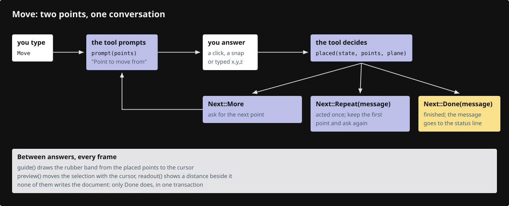

# 23a · Tools that ask for points

**Estimated study time: about 85–165 hours.** Includes reading, typing, tracing, testing and experiments. [How to use this estimate](map.md#time-estimates).

**This section:** Build interactive tools that ask for a sequence of points or choices.

**In the whole viewer:** Tools turn several input events into one intentional edit, reusing previews, snapping and document transactions.

**Follow the data:** Tool state → requested input → preview → next state or commit/cancel.

**Start with these files:** [`src/app/command/tool.rs`](23a-tools.md#code-23a-002), [`src/app/command/verbs/move.rs`](23a-tools.md#code-23a-016).

**Aim to explain:** Why should the first and second points of Move be different tool states?

[Whole-viewer map and course milestones](map.md)

An interactive tool remembers how far the conversation has progressed. Move first asks for a base point and then a target. Between those answers it previews a translation. Once the second point arrives, it commits the movement as one operation.



Start from the working result of [step 23](23-geometry-commands.md).

**One buildable step:** type the additions below in `workspace/handwritten`, then build and test. This step adds 7,927 lines across 33 files and may take several sittings. Individual listings are parts of this step, not separate build checkpoints.

<span id="code-23a-001"></span>

## `src/app/command/tests.rs`

Append **after line 61** of your current file.

Blank lines before: **1**; after: **0**. End with a newline.

```rust
--8<-- "typing/code/23a-001.rs"
```

<span id="code-23a-002"></span>

## `src/app/command/tool.rs`

Insert **after line 2** of your current file.

Keep these preceding lines:

```rust
use crate::State;
use session_rust::{Plane, Point, Xform};
```

Keep these following lines:

```rust

/// What a tool answers after each point or word: ask again, act and start over from the first point, or finish.
#[derive(Debug, PartialEq)]
pub enum Next {
```

Type these new lines:

```rust
--8<-- "typing/code/23a-002.rs"
```

<span id="code-23a-003"></span>

## `src/app/command/tool/cut.rs`

An interactive tool may ask for a point, then another point or an option. Its state records what is already known and what the next input means. Preview geometry illustrates the current proposal without committing it.

Create this file. Type the complete listing, including comments and blank lines.

```rust
--8<-- "typing/code/23a-003.rs"
```

<span id="code-23a-004"></span>

## `src/app/command/tool/gather.rs`

Create this file. Type the complete listing, including comments and blank lines.

```rust
--8<-- "typing/code/23a-004.rs"
```

<span id="code-23a-005"></span>

## `src/app/command/tool/options.rs`

Several tools offer named choices. Shared matching and normalization keep spelling and selection rules consistent. The caller still owns what the chosen option means for its particular geometry.

Create this file. Type the complete listing, including comments and blank lines.

```rust
--8<-- "typing/code/23a-005.rs"
```

<span id="code-23a-006"></span>

## `src/app/command/verbs/controls.rs`

Create this file. Type the complete listing, including comments and blank lines.

```rust
--8<-- "typing/code/23a-006.rs"
```

<span id="code-23a-007"></span>

## `src/app/command/verbs/copy.rs`

Create this file. Type the complete listing, including comments and blank lines.

```rust
--8<-- "typing/code/23a-007.rs"
```

<span id="code-23a-008"></span>

## `src/app/command/verbs/edge.rs`

Create this file. Type the complete listing, including comments and blank lines.

```rust
--8<-- "typing/code/23a-008.rs"
```

<span id="code-23a-009"></span>

## `src/app/command/verbs/extend.rs`

Create this file. Type the complete listing, including comments and blank lines.

```rust
--8<-- "typing/code/23a-009.rs"
```

<span id="code-23a-010"></span>

## `src/app/command/verbs/extend/reach.rs`

Create this file. Type the complete listing, including comments and blank lines.

```rust
--8<-- "typing/code/23a-010.rs"
```

<span id="code-23a-011"></span>

## `src/app/command/verbs/face.rs`

Create this file. Type the complete listing, including comments and blank lines.

```rust
--8<-- "typing/code/23a-011.rs"
```

<span id="code-23a-012"></span>

## `src/app/command/verbs/mod.rs`

Insert **after line 1** of your current file.

Keep these preceding lines:

```rust
pub mod geometry; // shared code of the drawing verbs, not a verb itself; register:geometry
```

Keep these following lines:

```rust

// One list of names becomes both the `pub mod` lines and the REGISTRY array.
/// Declare each verb's module and list its SPEC in REGISTRY, so a verb is one file plus one line.
macro_rules! verbs {
```

Type these new lines:

```rust
--8<-- "typing/code/23a-012.rs"
```

<span id="code-23a-013"></span>

## `src/app/command/verbs/mod.rs`

Insert **after line 26** of your current file.

Keep these preceding lines:

```rust
    arrow,                   // register:arrow
    polyline,                // register:polyline
    curve,                   // register:curve
    close,                   // register:close
```

Keep these following lines:

```rust
    explode,                 // register:explode
    save,                    // register:save
    open,                    // register:open
    delete,                  // register:delete
```

Type these new lines:

```rust
--8<-- "typing/code/23a-013.rs"
```

<span id="code-23a-014"></span>

## `src/app/command/verbs/mod.rs`

Insert **after line 29** of your current file.

Keep these preceding lines:

```rust
    close,                   // register:close
    trim,                    // register:trim
    extend,                  // register:extend
    explode,                 // register:explode
```

Keep these following lines:

```rust
    save,                    // register:save
    open,                    // register:open
    delete,                  // register:delete
    undo,                    // register:undo
```

Type these new lines:

```rust
--8<-- "typing/code/23a-014.rs"
```

<span id="code-23a-015"></span>

## `src/app/command/verbs/mod.rs`

Insert **after line 43** of your current file.

Keep these preceding lines:

```rust
    hide,                    // register:hide
    show,                    // register:show
    fit,                     // register:fit
    escape,                  // register:escape
```

Keep these following lines:

```rust
    clipping_plane,          // register:clipping_plane
}
```

Type these new lines:

```rust
--8<-- "typing/code/23a-015.rs"
```

<span id="code-23a-016"></span>

## `src/app/command/verbs/move.rs`

Create this file. Type the complete listing, including comments and blank lines.

```rust
--8<-- "typing/code/23a-016.rs"
```

<span id="code-23a-017"></span>

## `src/app/command/verbs/object.rs`

Create this file. Type the complete listing, including comments and blank lines.

```rust
--8<-- "typing/code/23a-017.rs"
```

<span id="code-23a-018"></span>

## `src/app/command/verbs/orient_3_points.rs`

Create this file. Type the complete listing, including comments and blank lines.

```rust
--8<-- "typing/code/23a-018.rs"
```

<span id="code-23a-019"></span>

## `src/app/command/verbs/rotate.rs`

Create this file. Type the complete listing, including comments and blank lines.

```rust
--8<-- "typing/code/23a-019.rs"
```

<span id="code-23a-020"></span>

## `src/app/command/verbs/scale.rs`

Create this file. Type the complete listing, including comments and blank lines.

```rust
--8<-- "typing/code/23a-020.rs"
```

<span id="code-23a-021"></span>

## `src/app/command/verbs/select_by_name.rs`

Create this file. Type the complete listing, including comments and blank lines.

```rust
--8<-- "typing/code/23a-021.rs"
```

<span id="code-23a-022"></span>

## `src/app/command/verbs/select_lasso.rs`

Create this file. Type the complete listing, including comments and blank lines.

```rust
--8<-- "typing/code/23a-022.rs"
```

<span id="code-23a-023"></span>

## `src/app/command/verbs/select_small.rs`

Create this file. Type the complete listing, including comments and blank lines.

```rust
--8<-- "typing/code/23a-023.rs"
```

<span id="code-23a-024"></span>

## `src/app/command/verbs/selecting.rs`

Create this file. Type the complete listing, including comments and blank lines.

```rust
--8<-- "typing/code/23a-024.rs"
```

<span id="code-23a-025"></span>

## `src/app/command/verbs/trim.rs`

Create this file. Type the complete listing, including comments and blank lines.

```rust
--8<-- "typing/code/23a-025.rs"
```

<span id="code-23a-026"></span>

## `src/app/command/verbs/trim/parts.rs`

Create this file. Type the complete listing, including comments and blank lines.

```rust
--8<-- "typing/code/23a-026.rs"
```

<span id="code-23a-027"></span>

## `src/app/input.rs`

Insert **after line 117** of your current file.

Keep these preceding lines:

```rust

                // a running command draws with the button held
                if self.tool_held {
                    self.last_cursor = at;
```

Keep these following lines:

```rust
                }

                // a plain press dragged past the slop may start a tool, once
                if self.gesture.is_none()
```

Type these new lines:

```rust
--8<-- "typing/code/23a-027.rs"
```

<span id="code-23a-028"></span>

## `src/app/input.rs`

Insert **after line 229** of your current file.

Keep these preceding lines:

```rust

                    if !drawing {
                        self.gesture = gesture::press(state, at, TOUCH_REACH);
                    }
```

Keep these following lines:

```rust

                    if self.gesture.is_some() || self.tool_held {
                        self.touch_edit = Some(t.id);
                    }
```

Type these new lines:

```rust
--8<-- "typing/code/23a-028.rs"
```

<span id="code-23a-029"></span>

## `src/app/input.rs`

Insert **after line 244** of your current file.

Keep these preceding lines:

```rust
                    self.dragged |= moved / device_pixel_ratio() > TAP_SLOP; // once away, a drag even if it comes back

                    match (t.phase, self.gesture) {
                        (TouchPhase::Moved, None) if self.tool_held => {
```

Keep these following lines:

```rust
                        }
                        (TouchPhase::Ended, None) if self.tool_held => {
                        }
                        (TouchPhase::Moved, Some(active)) => {
```

Type these new lines:

```rust
--8<-- "typing/code/23a-029.rs"
```

<span id="code-23a-030"></span>

## `src/app/input.rs`

Insert **after line 247** of your current file.

Keep these preceding lines:

```rust
                        (TouchPhase::Moved, None) if self.tool_held => {
                            state.tool_drag(at.0, at.1); // register:tools
                        }
                        (TouchPhase::Ended, None) if self.tool_held => {
```

Keep these following lines:

```rust
                        }
                        (TouchPhase::Moved, Some(active)) => {
                            (active.drag)(state, at);
                        }
```

Type these new lines:

```rust
--8<-- "typing/code/23a-030.rs"
```

<span id="code-23a-031"></span>

## `src/app/input.rs`

Insert **after line 343** of your current file.

Keep these preceding lines:

```rust
                closed |= state.close_number_box(); // a press in the scene closes the number box; register:editing
                self.left_down = Some(self.last_cursor);
                self.dragged = false;
                // a running command that draws with the button, e.g. a lasso
```

Keep these following lines:

```rust

                if self.tool_held {
                    self.plain = false;
                    return true;
```

Type these new lines:

```rust
--8<-- "typing/code/23a-031.rs"
```

<span id="code-23a-032"></span>

## `src/app/input.rs`

Insert **after line 367** of your current file.

Keep these preceding lines:

```rust
                self.plain = false;

                if self.tool_held {
                    self.tool_held = false;
```

Keep these following lines:

```rust
                }

                // the tool in charge takes the release; a press that never left the slop is a click
                if let Some(active) = self.gesture.take() {
```

Type these new lines:

```rust
--8<-- "typing/code/23a-032.rs"
```

<span id="code-23a-033"></span>

## `src/app/inspection.rs`

Insert **after line 78** of your current file.

Keep these preceding lines:

```rust
            .map(|r| state.gpu.objects.anchored_model(*r))
            .collect::<Vec<_>>()
    );
    snapshot["drawing"] = state.drawing_status(); // register:commands
```

Keep these following lines:

```rust
    snapshot["clipping"] = state.clipping_status(); // register:clipping
    snapshot["object_drag"] = state.object_drag_status(); // register:editing
    snapshot["number_box"] = number_box(state); // register:editing
    snapshot["undo_depth"] = undo_depth(state); // register:document
```

Type these new lines:

```rust
--8<-- "typing/code/23a-033.rs"
```

<span id="code-23a-034"></span>

## `src/app/keys.rs`

Insert **after line 69** of your current file.

Keep these preceding lines:

```rust
        s.camera.toggle_projection_framed(&s.gpu.bounds, s.aspect())
    }),
    // the first Esc cancels the command and keeps the selection, the next one clears it
    named(NamedKey::Escape, |s| s.escape()),
```

Keep these following lines:

```rust
    named(NamedKey::F10, |s| s.enable_controls()), // register:controls
    named(NamedKey::Delete, |s| s.delete_selected()), // register:delete
    plain(&[":"], |_| crate::app::feedback::command_line(true)), // register:command-line
    ctrl(&["z", "Z"], Some(true), |s| s.redo()), // register:redo-shift
```

Type these new lines:

```rust
--8<-- "typing/code/23a-034.rs"
```

<span id="code-23a-035"></span>

## `src/app/ui/mod.rs`

Insert **after line 244** of your current file.

Keep these preceding lines:

```rust
            if let Some(drawing) = &drawing {
                overlay::drawing(&painter, drawing, scale);
            }
```

Keep these following lines:

```rust
        };
        let mut batches = batches.into_iter();
        // `unwrap` cannot fail: the last push above leaves at least one batch
        let mut output = self.context.run_ui(batches.next().unwrap(), &mut draw);
```

Type these new lines:

```rust
--8<-- "typing/code/23a-035.rs"
```

<span id="code-23a-036"></span>

## `src/app/ui/overlay.rs`

Append **after line 34** of your current file.

Blank lines before: **1**; after: **0**. End with a newline.

```rust
--8<-- "typing/code/23a-036.rs"
```

<span id="code-23a-037"></span>

## `src/state.rs`

Insert **after line 625** of your current file.

Keep these preceding lines:

```rust
    /// Ask what is under a pixel: an object, an edge (Ctrl) or a face (Ctrl+Shift).
    pub fn request_selection(&mut self, x: u32, y: u32, edge: bool, face: bool) {
        // a split or a tool wants a plain object
        let mut splitting = false;
```

Keep these following lines:

```rust
        let face = !splitting
            && (face || self.selection_tool == crate::app::selection::SelectionTool::Face);
        let edge = !splitting
            && (edge || self.selection_tool == crate::app::selection::SelectionTool::Edge);
```

Type these new lines:

```rust
--8<-- "typing/code/23a-037.rs"
```

<span id="code-23a-038"></span>

## `src/state.rs`

Insert **after line 669** of your current file.

Keep these preceding lines:

```rust

    /// Esc: the first cancels a command and keeps the selection, the next one clears it.
    pub fn escape(&mut self) {
        let mut cancelled = false;
```

Keep these following lines:

```rust

        if !cancelled {
            self.escape_selection();
        }
```

Type these new lines:

```rust
--8<-- "typing/code/23a-038.rs"
```

<span id="code-23a-039"></span>

## `src/state/edit.rs`

Insert **after line 23** of your current file.

Keep these preceding lines:

```rust

impl State {
    /// Put the gizmo at the center of the selection, or remove it.
    pub fn place_gizmo(&mut self, row: Option<u32>) {
```

Keep these following lines:

```rust
        // no box, no gizmo
        let Some(box_) = row.and_then(|r| self.gpu.objects.row_bounds(r)) else { // `box` is a reserved word, hence `box_`
            self.features.gizmo = None;
            return;
```

Type these new lines:

```rust
--8<-- "typing/code/23a-039.rs"
```

<span id="code-23a-040"></span>

## `src/state/edit.rs`

Insert **after line 284** of your current file.

Keep these preceding lines:

```rust

    /// Drop a drag that will never be released; everything goes back.
    pub fn cancel_gesture(&mut self) {
        self.cancel_object_drag();
```

Keep these following lines:

```rust

        if let Some(active) = self.features.dragging.take() {
            if let Some(preview) = active.mesh_preview.as_ref() {
                preview.apply(&mut self.gpu, &Xform::identity(), true);
```

Type these new lines:

```rust
--8<-- "typing/code/23a-040.rs"
```

<span id="code-23a-041"></span>

## `src/state/edit.rs`

Insert **after line 390** of your current file.

Keep these preceding lines:

```rust
    }

    /// After an undo, redo or delete: sync the rows, drop the selection.
    pub(crate) fn after_history(&mut self) {
```

Keep these following lines:

```rust

        self.selection = SelectionMode::Object;
        self.select(None);
        self.scene.flag_texts(&mut self.gpu);
```

Type these new lines:

```rust
--8<-- "typing/code/23a-041.rs"
```

<span id="code-23a-042"></span>

## `src/state/features.rs`

Insert **after line 44** of your current file.

Keep these preceding lines:

```rust

/// Features that take a pick answer before the selection does, in this order.
pub(super) const TAKE_PICK: &[fn(&mut State, Option<crate::engine::gpu::Pick>) -> bool] = &[
    State::take_drag_pick,  // register:editing
```

Keep these following lines:

```rust
    #[cfg(target_arch = "wasm32")] // register:cloud_query
    State::take_cloud_pick, // register:cloud_query
];
```

Type these new lines:

```rust
--8<-- "typing/code/23a-042.rs"
```

<span id="code-23a-043"></span>

## `tests/transforms.cjs`

Create this file. Type the complete listing, including comments and blank lines.

```javascript
--8<-- "typing/code/23a-043.cjs"
```

<span id="code-23a-044"></span>

## `tests/trim-extend.cjs`

Create this file. Type the complete listing, including comments and blank lines.

```javascript
--8<-- "typing/code/23a-044.cjs"
```

## Check the completed chapter

From `session_viewer`, compare everything you have typed:

```sh
npm --prefix ../session_tests run course -- reference-check 23a
```

From `workspace/handwritten`:

```sh
cargo build --lib --locked -j4
cargo xtest --lib --locked -j4
```

Run the native Move tests. Select an object, start Move, choose the base and target, then undo once.

If a half-finished tool reports an error, check whether it should return More. If the preview becomes permanent after Escape, inspect the runner’s cancellation path.

**Before moving on:** explain what changed, check the expected result above, and fix any build or test failure.

<details>
<summary>Check your explanation of the opening question</summary>

The same click has a different meaning in each phase. Explicit state records what is known, what is still requested and when a complete transaction can be committed.

</details>

[Next step: 23b](23b-shapes.md)
