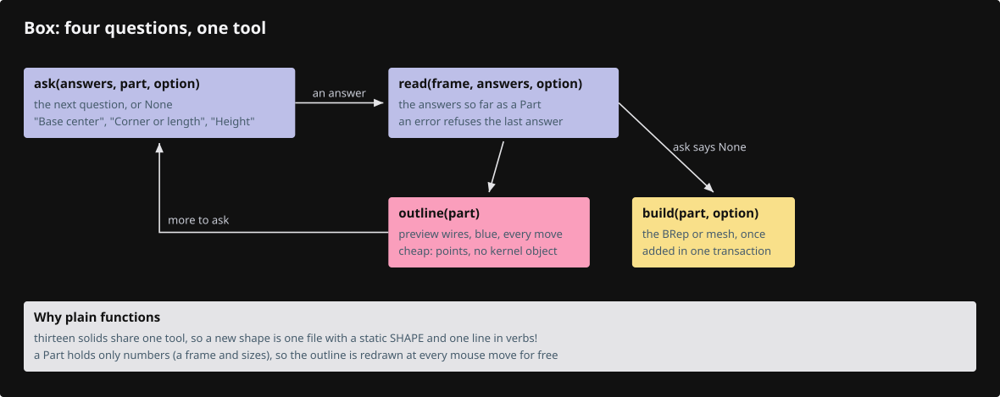

# 23b · Shapes

Box, Sphere and eleven more solids ask a few questions, draw blue wires while you answer, and add a BRep or a mesh to the document. One tool, `Shaping`, runs them all: each shape is one file with a `static SHAPE` of five functions.



## Step 1 · registration lines

One line in `tool.rs` adds the shape module, and one line per shape in `verbs!` adds its command.

`lessons/23b/src/app/command/tool.rs` · type the line tagged `register:shape`

```rust
--8<-- "lessons/23b/src/app/command/tool.rs:tool-modules"
```

`lessons/23b/src/app/command/verbs/mod.rs` · type the thirteen lines tagged `register:box` to `register:capsule`

```rust
--8<-- "lessons/23b/src/app/command/verbs/mod.rs:verbs-list"
```

## Step 2 · src/app/command/tool/shape.rs

An answer is a point or a number, and each question says what a bare number means.

`lessons/23b/src/app/command/tool/shape.rs` · type this, new file

```rust
--8<-- "lessons/23b/src/app/command/tool/shape.rs:shape-ask"
```

## Step 3 · src/app/command/tool/shape.rs

The frame: local axes on the drawing plane, plus the rings, rectangles and boxes the previews draw in it.

`lessons/23b/src/app/command/tool/shape.rs` · type this, append at the end of the file

```rust
--8<-- "lessons/23b/src/app/command/tool/shape.rs:shape-frame"
```

## Step 4 · src/app/command/tool/shape.rs

`Shape`: a name, option buttons and five functions that ask, read, preview and build one kind of solid.

`lessons/23b/src/app/command/tool/shape.rs` · type this, append at the end of the file

```rust
--8<-- "lessons/23b/src/app/command/tool/shape.rs:shape-static"
```

## Step 5 · src/app/command/tool/shape.rs

Size checks, the frame at the first point, and the center-and-radius questions the round shapes share.

`lessons/23b/src/app/command/tool/shape.rs` · type this, append at the end of the file

```rust
--8<-- "lessons/23b/src/app/command/tool/shape.rs:shape-helpers"
```

## Step 6 · src/app/command/tool/shape.rs

Turn a kernel BRep or mesh into the chosen option, welding separately meshed faces into one closed mesh.

`lessons/23b/src/app/command/tool/shape.rs` · type this, append at the end of the file

```rust
--8<-- "lessons/23b/src/app/command/tool/shape.rs:shape-kernel"
```

## Step 7 · src/app/command/tool/shape.rs

Parse `Box Mesh 0,0,0 100 50 30`: a leading option word, then answers fed in once the tool is open.

`lessons/23b/src/app/command/tool/shape.rs` · type this, append at the end of the file

```rust
--8<-- "lessons/23b/src/app/command/tool/shape.rs:shape-start"
```

## Step 8 · src/app/command/tool/shape.rs

`Shaping` keeps the answers, builds the object after the last one, and finds a height on the normal.

`lessons/23b/src/app/command/tool/shape.rs` · type this, append at the end of the file

```rust
--8<-- "lessons/23b/src/app/command/tool/shape.rs:shaping"
```

## Step 9 · src/app/command/tool/shape.rs

The `Tool` methods: prompt, option words, typed numbers, clicks on the normal and the blue preview wires.

`lessons/23b/src/app/command/tool/shape.rs` · type this, append at the end of the file

```rust
--8<-- "lessons/23b/src/app/command/tool/shape.rs:shaping-tool"
```

## Step 10 · src/app/command/tool/shape.rs

Tests: right-handed frames on every plane, Enter defaults, closed welded meshes and solid polyhedra.

`lessons/23b/src/app/command/tool/shape.rs` · copy, append at the end of the file

```rust
--8<-- "lessons/23b/src/app/command/tool/shape.rs:shape-tests"
```

## Step 11 · src/app/command/verbs/box.rs

The Box command: a `Spec` for the command line and a `static SHAPE` for the questions.

`lessons/23b/src/app/command/verbs/box.rs` · type this, new file

```rust
--8<-- "lessons/23b/src/app/command/verbs/box.rs:box-spec"
```

## Step 12 · src/app/command/verbs/box.rs

Base center, then a corner click or a typed length and width, then the height.

`lessons/23b/src/app/command/verbs/box.rs` · type this, append at the end of the file

```rust
--8<-- "lessons/23b/src/app/command/verbs/box.rs:box-questions"
```

## Step 13 · src/app/command/verbs/box.rs

The preview grows from a line to a rectangle to a box, and `build` stands a kernel box on the plane.

`lessons/23b/src/app/command/verbs/box.rs` · type this, append at the end of the file

```rust
--8<-- "lessons/23b/src/app/command/verbs/box.rs:box-build"
```

## Step 14 · src/app/command/verbs/box.rs

Tests: typed sizes and a corner click give the same box, the Front plane stands it along −Y, zero sizes are refused.

`lessons/23b/src/app/command/verbs/box.rs` · copy, append at the end of the file

```rust
--8<-- "lessons/23b/src/app/command/verbs/box.rs:box-tests"
```

## Step 15 · the other shapes

Each is a `Spec`, a `static SHAPE` and its tests, built like `box.rs`; copy these files from `lessons/23b/src/app/command/verbs/`:

- `sphere.rs`: center, radius.
- `cylinder.rs`: base center, radius, height.
- `cone.rs`: base center, radius, height to the apex.
- `pyramid.rs`: base center, corner or edge length, height.
- `torus.rs`: center, major radius, minor radius.
- `block_with_hole.rs`: a box with a round hole through it.
- `tetrahedron.rs`, `octahedron.rs`, `dodecahedron.rs`, `icosahedron.rs`: center, radius to the corners.
- `quad_sphere.rs`: a mesh sphere of six patches of 8 × 8 quads.
- `capsule.rs`: a mesh cylinder with round ends, base center, radius, total height.

Run `cargo check` in `lessons/23b/`.

## Check

`cargo check` compiles, and `cargo xtest --lib shape` passes. Type `Box`, click a center and a corner, then lift the height: blue wires follow the cursor and a solid box appears. `Box Mesh 0,0,0 100 50 30` makes the same box as a mesh in one line.
