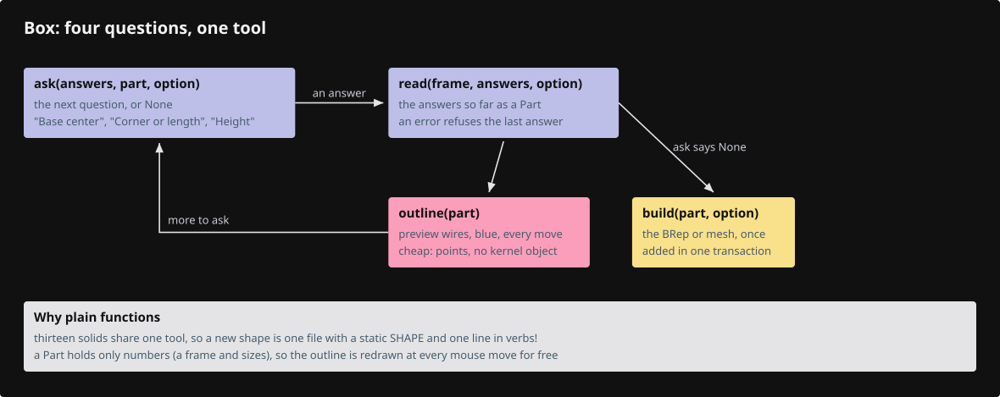

# 23b · Shapes

**Estimated study time: about 20–35 hours.** Includes reading, typing, tracing, testing and experiments. [How to use this estimate](map.md#time-estimates).

**This section:** Construct shapes from the dimensions and frame collected by a tool.

**In the whole viewer:** Shape builders sit between tool interaction and kernel geometry, keeping the preview consistent with the committed object.

**Follow the data:** Collected dimensions and frame → shape builder → preview/final geometry → transaction.

**Start with these files:** [`src/app/command/tool/shape.rs`](23b-shapes.md#code-23b-003), [`src/app/command/verbs/box.rs`](23b-shapes.md#code-23b-005).

**Aim to explain:** What would you inspect if the accepted box differs from its preview?

[Whole-viewer map and course milestones](map.md)

The shared shape tool has gathered length, width, height and a construction frame. Now the box builder turns those answers into geometry. Preview outlines and final geometry use the same dimensions, so the shape you accept should match the one you saw while pointing.



Start from the working result of [step 23a](23a-tools.md).

**One buildable step:** type the additions below in `workspace/handwritten`, then build and test. This step adds 2,422 lines across 17 files and may take several sittings. Individual listings are parts of this step, not separate build checkpoints.

<span id="code-23b-001"></span>

## `src/app/command/tests.rs`

Append **after line 122** of your current file.

Blank lines before: **1**; after: **0**. End with a newline.

```rust
--8<-- "typing/code/23b-001.rs"
```

<span id="code-23b-002"></span>

## `src/app/command/tool.rs`

Insert **after line 5** of your current file.

Keep these preceding lines:

```rust
use session_rust::{Plane, Point, Xform};
pub mod cut; // register:cut
pub mod gather; // register:gather
mod options; // register:gather
```

Keep these following lines:

```rust

/// What a tool answers after each point or word: ask again, act and start over from the first point, or finish.
#[derive(Debug, PartialEq)]
pub enum Next {
```

Type these new lines:

```rust
--8<-- "typing/code/23b-002.rs"
```

<span id="code-23b-003"></span>

## `src/app/command/tool/shape.rs`

Create this file. Type the complete listing, including comments and blank lines.

```rust
--8<-- "typing/code/23b-003.rs"
```

<span id="code-23b-004"></span>

## `src/app/command/verbs/block_with_hole.rs`

Create this file. Type the complete listing, including comments and blank lines.

```rust
--8<-- "typing/code/23b-004.rs"
```

<span id="code-23b-005"></span>

## `src/app/command/verbs/box.rs`

Create this file. Type the complete listing, including comments and blank lines.

```rust
--8<-- "typing/code/23b-005.rs"
```

<span id="code-23b-006"></span>

## `src/app/command/verbs/capsule.rs`

Create this file. Type the complete listing, including comments and blank lines.

```rust
--8<-- "typing/code/23b-006.rs"
```

<span id="code-23b-007"></span>

## `src/app/command/verbs/cone.rs`

Create this file. Type the complete listing, including comments and blank lines.

```rust
--8<-- "typing/code/23b-007.rs"
```

<span id="code-23b-008"></span>

## `src/app/command/verbs/cylinder.rs`

Create this file. Type the complete listing, including comments and blank lines.

```rust
--8<-- "typing/code/23b-008.rs"
```

<span id="code-23b-009"></span>

## `src/app/command/verbs/dodecahedron.rs`

Create this file. Type the complete listing, including comments and blank lines.

```rust
--8<-- "typing/code/23b-009.rs"
```

<span id="code-23b-010"></span>

## `src/app/command/verbs/icosahedron.rs`

Create this file. Type the complete listing, including comments and blank lines.

```rust
--8<-- "typing/code/23b-010.rs"
```

<span id="code-23b-011"></span>

## `src/app/command/verbs/mod.rs`

Insert **after line 51** of your current file.

Keep these preceding lines:

```rust
    select_lasso,            // register:select_lasso
    select_by_name,          // register:select_by_name
    select_small,            // register:select_small
    clipping_plane,          // register:clipping_plane
```

Keep these following lines:

```rust
}
```

Type these new lines:

```rust
--8<-- "typing/code/23b-011.rs"
```

<span id="code-23b-012"></span>

## `src/app/command/verbs/octahedron.rs`

Create this file. Type the complete listing, including comments and blank lines.

```rust
--8<-- "typing/code/23b-012.rs"
```

<span id="code-23b-013"></span>

## `src/app/command/verbs/pyramid.rs`

Create this file. Type the complete listing, including comments and blank lines.

```rust
--8<-- "typing/code/23b-013.rs"
```

<span id="code-23b-014"></span>

## `src/app/command/verbs/quad_sphere.rs`

Create this file. Type the complete listing, including comments and blank lines.

```rust
--8<-- "typing/code/23b-014.rs"
```

<span id="code-23b-015"></span>

## `src/app/command/verbs/sphere.rs`

Create this file. Type the complete listing, including comments and blank lines.

```rust
--8<-- "typing/code/23b-015.rs"
```

<span id="code-23b-016"></span>

## `src/app/command/verbs/tetrahedron.rs`

Create this file. Type the complete listing, including comments and blank lines.

```rust
--8<-- "typing/code/23b-016.rs"
```

<span id="code-23b-017"></span>

## `src/app/command/verbs/torus.rs`

Create this file. Type the complete listing, including comments and blank lines.

```rust
--8<-- "typing/code/23b-017.rs"
```

## Check the completed chapter

From `session_viewer`, compare everything you have typed:

```sh
npm --prefix ../session_tests run course -- reference-check 23b
```

From `workspace/handwritten`:

```sh
cargo build --lib --locked -j4
cargo xtest --lib --locked -j4
```

Run the native shape tests. Enter `Box` in the command field and follow its size and output options. Use the native shape tests you typed to compare Mesh and Brep output with the same frame and dimensions.

If a box appears half below the intended base, inspect placement before changing its height. If Mesh and Brep disagree, compare the same frame and dimensions.

**Before moving on:** explain what changed, check the expected result above, and fix any build or test failure.

<details>
<summary>Check your explanation of the opening question</summary>

Check that preview and final construction use the same dimensions, frame and option interpretation before blaming the renderer.

</details>

[Next step: 23c](23c-surfacing.md)
