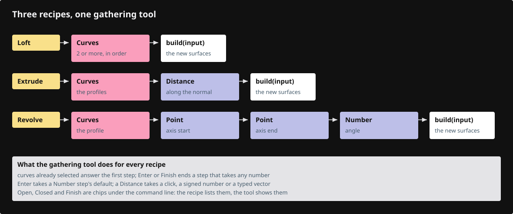

# 23c · Surfacing

NURBS curves are drawn with the shape tool of lesson 23b, and surfaces are made from picked curves with the gathering tool of lesson 23a. This lesson adds the shared surfacing helpers, types Circle and Loft in full and copies the other ten commands.



## Step 1 · registration lines

One line in `tool.rs` adds the surfacing module, and one line per command in `verbs!` adds the twelve commands.

`lessons/23c/src/app/command/tool.rs` · type the line tagged `register:surfacing`

```rust
--8<-- "lessons/23c/src/app/command/tool.rs:tool-modules"
```

`lessons/23c/src/app/command/verbs/mod.rs` · type the twelve lines tagged `register:nurbs_curve_circle` to `register:nurbs_surface_sweep2`

```rust
--8<-- "lessons/23c/src/app/command/verbs/mod.rs:verbs-list"
```

## Step 2 · src/app/command/tool/surfacing.rs

The normal of a closed loop, the size of a point cloud, and whether points lie in one plane.

`lessons/23c/src/app/command/tool/surfacing.rs` · type this, new file

```rust
--8<-- "lessons/23c/src/app/command/tool/surfacing.rs:surfacing-helpers"
```

## Step 3 · src/app/command/tool/surfacing.rs

Turn every section to run the same way as the one before it, with the seams of closed ones lined up.

`lessons/23c/src/app/command/tool/surfacing.rs` · type this, append at the end of the file

```rust
--8<-- "lessons/23c/src/app/command/tool/surfacing.rs:align-sections"
```

## Step 4 · src/app/command/tool/surfacing.rs

The loft through aligned sections, a check that refuses a broken surface, and the picked curves in world space.

`lessons/23c/src/app/command/tool/surfacing.rs` · type this, append at the end of the file

```rust
--8<-- "lessons/23c/src/app/command/tool/surfacing.rs:loft-checked"
```

## Step 5 · src/app/command/tool/surfacing.rs

Tests: picked curves keep their placement, periodic curves are clamped, sections align, loops find their normal.

`lessons/23c/src/app/command/tool/surfacing.rs` · copy, append at the end of the file

```rust
--8<-- "lessons/23c/src/app/command/tool/surfacing.rs:surfacing-tests"
```

## Step 6 · src/app/command/tool/shape.rs

Test: a leading word picks a shape's option, including the two-word `3 Points` of Nurbs Curve Arc.

`lessons/23c/src/app/command/tool/shape.rs` · copy, append at the end of the file

```rust
--8<-- "lessons/23c/src/app/command/tool/shape.rs:option-words"
```

## Step 7 · src/app/command/verbs/nurbs_curve_circle.rs

The Circle command is a shape with a curve's buttons: a `Spec` and a `static SHAPE`.

`lessons/23c/src/app/command/verbs/nurbs_curve_circle.rs` · type this, new file

```rust
--8<-- "lessons/23c/src/app/command/verbs/nurbs_curve_circle.rs:circle-spec"
```

## Step 8 · src/app/command/verbs/nurbs_curve_circle.rs

Center, then radius; the preview is one ring, and `build` places the kernel circle on the plane.

`lessons/23c/src/app/command/verbs/nurbs_curve_circle.rs` · type this, append at the end of the file

```rust
--8<-- "lessons/23c/src/app/command/verbs/nurbs_curve_circle.rs:circle-questions"
```

## Step 9 · src/app/command/verbs/nurbs_curve_circle.rs

Test: nine control points, closed, every sample at the radius in the Front plane.

`lessons/23c/src/app/command/verbs/nurbs_curve_circle.rs` · copy, append at the end of the file

```rust
--8<-- "lessons/23c/src/app/command/verbs/nurbs_curve_circle.rs:circle-tests"
```

## Step 10 · src/app/command/verbs/loft.rs

The Loft command is a `Recipe`: pick two or more curves in order, with Open or Closed.

`lessons/23c/src/app/command/verbs/loft.rs` · type this, new file

```rust
--8<-- "lessons/23c/src/app/command/verbs/loft.rs:loft-recipe"
```

## Step 11 · src/app/command/verbs/loft.rs

Loft the picked curves into one cubic NURBS surface and say how many went in.

`lessons/23c/src/app/command/verbs/loft.rs` · type this, append at the end of the file

```rust
--8<-- "lessons/23c/src/app/command/verbs/loft.rs:loft-build"
```

## Step 12 · src/app/command/verbs/loft.rs

Tests: three arcs loft through the middle one, and Closed loops back and needs three curves.

`lessons/23c/src/app/command/verbs/loft.rs` · copy, append at the end of the file

```rust
--8<-- "lessons/23c/src/app/command/verbs/loft.rs:loft-tests"
```

## Step 13 · the other commands

Each is a shape like Circle or a recipe like Loft; copy these files from `lessons/23c/src/app/command/verbs/`:

- `nurbs_curve_ellipse.rs`: center, end of the first axis or its radius, second radius.
- `nurbs_curve_arc.rs`: center, start or radius, end or angle; or 3 Points.
- `nurbs_curve_parabola.rs`: start, end or length, apex or height.
- `nurbs_surface_loft.rs`: a loft with Smooth or Straight sections.
- `nurbs_surface_network.rs`: a surface through curves running in two directions.
- `nurbs_surface_revolve.rs`: profile curves turned about an axis by an angle.
- `nurbs_surface_4_points.rs`: a surface from four corners.
- `nurbs_surface_sweep1.rs`: profile curves swept along one rail.
- `nurbs_surface_sweep2.rs`: shape curves swept between two rails.
- `extrude.rs`: curves pushed along a distance or a vector, with or without caps.

Run `cargo check` in `lessons/23c/`.

## Check

`cargo check` compiles, and `cargo xtest --lib surfacing` passes. Draw two circles at different heights with `Nurbs Curve Circle`, type `Loft`, click both and press Enter: a smooth tube joins them.
