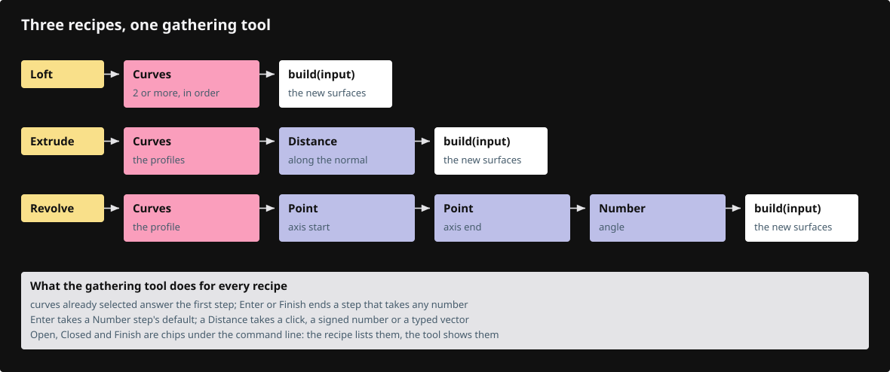

# 23c · Surfacing

**Estimated study time: about 30–60 hours.** Includes reading, typing, tracing, testing and experiments. [How to use this estimate](map.md#time-estimates).

**This section:** Turn selected curves and surfacing choices into new surface geometry.

**In the whole viewer:** The tool gathers intent; the kernel performs geometry work; the scene then displays the committed result.

**Follow the data:** Ordered curves → validation and alignment → surface construction → document/display.

**Start with these files:** [`src/app/command/tool/surfacing.rs`](23c-surfacing.md#code-23c-004), [`src/app/command/verbs/loft.rs`](23c-surfacing.md#code-23c-006).

**Aim to explain:** Why can reordering the same loft sections change the result?

[Whole-viewer map and course milestones](map.md)

A loft stretches a surface through a sequence of curves, like fabric over a row of hoops. The order matters. The shared surfacing code checks and aligns the curves; this small command builder chooses whether the sequence closes back onto its first section.



Start from the working result of [step 23b](23b-shapes.md).

**One buildable step:** type the additions below in `workspace/handwritten`, then build and test. This step adds 2,784 lines across 17 files and may take several sittings. Individual listings are parts of this step, not separate build checkpoints.

<span id="code-23c-001"></span>

## `src/app/command/tests.rs`

Append **after line 165** of your current file.

Blank lines before: **1**; after: **0**. End with a newline.

```rust
--8<-- "typing/code/23c-001.rs"
```

<span id="code-23c-002"></span>

## `src/app/command/tool.rs`

Insert **after line 6** of your current file.

Keep these preceding lines:

```rust
pub mod cut; // register:cut
pub mod gather; // register:gather
mod options; // register:gather
pub mod shape; // register:shape
```

Keep these following lines:

```rust

/// What a tool answers after each point or word: ask again, act and start over from the first point, or finish.
#[derive(Debug, PartialEq)]
pub enum Next {
```

Type these new lines:

```rust
--8<-- "typing/code/23c-002.rs"
```

<span id="code-23c-003"></span>

## `src/app/command/tool/shape.rs`

Append **after line 975** of your current file.

Blank lines before: **1**; after: **0**. End with a newline.

```rust
--8<-- "typing/code/23c-003.rs"
```

<span id="code-23c-004"></span>

## `src/app/command/tool/surfacing.rs`

Create this file. Type the complete listing, including comments and blank lines.

```rust
--8<-- "typing/code/23c-004.rs"
```

<span id="code-23c-005"></span>

## `src/app/command/verbs/extrude.rs`

Create this file. Type the complete listing, including comments and blank lines.

```rust
--8<-- "typing/code/23c-005.rs"
```

<span id="code-23c-006"></span>

## `src/app/command/verbs/loft.rs`

Create this file. Type the complete listing, including comments and blank lines.

```rust
--8<-- "typing/code/23c-006.rs"
```

<span id="code-23c-007"></span>

## `src/app/command/verbs/mod.rs`

Insert **after line 64** of your current file.

Keep these preceding lines:

```rust
    dodecahedron,            // register:dodecahedron
    icosahedron,             // register:icosahedron
    quad_sphere,             // register:quad_sphere
    capsule,                 // register:capsule
```

Keep these following lines:

```rust
}
```

Type these new lines:

```rust
--8<-- "typing/code/23c-007.rs"
```

<span id="code-23c-008"></span>

## `src/app/command/verbs/nurbs_curve_arc.rs`

Create this file. Type the complete listing, including comments and blank lines.

```rust
--8<-- "typing/code/23c-008.rs"
```

<span id="code-23c-009"></span>

## `src/app/command/verbs/nurbs_curve_circle.rs`

Create this file. Type the complete listing, including comments and blank lines.

```rust
--8<-- "typing/code/23c-009.rs"
```

<span id="code-23c-010"></span>

## `src/app/command/verbs/nurbs_curve_ellipse.rs`

Create this file. Type the complete listing, including comments and blank lines.

```rust
--8<-- "typing/code/23c-010.rs"
```

<span id="code-23c-011"></span>

## `src/app/command/verbs/nurbs_curve_parabola.rs`

Create this file. Type the complete listing, including comments and blank lines.

```rust
--8<-- "typing/code/23c-011.rs"
```

<span id="code-23c-012"></span>

## `src/app/command/verbs/nurbs_surface_4_points.rs`

Create this file. Type the complete listing, including comments and blank lines.

```rust
--8<-- "typing/code/23c-012.rs"
```

<span id="code-23c-013"></span>

## `src/app/command/verbs/nurbs_surface_loft.rs`

Create this file. Type the complete listing, including comments and blank lines.

```rust
--8<-- "typing/code/23c-013.rs"
```

<span id="code-23c-014"></span>

## `src/app/command/verbs/nurbs_surface_network.rs`

Create this file. Type the complete listing, including comments and blank lines.

```rust
--8<-- "typing/code/23c-014.rs"
```

<span id="code-23c-015"></span>

## `src/app/command/verbs/nurbs_surface_revolve.rs`

Create this file. Type the complete listing, including comments and blank lines.

```rust
--8<-- "typing/code/23c-015.rs"
```

<span id="code-23c-016"></span>

## `src/app/command/verbs/nurbs_surface_sweep1.rs`

Create this file. Type the complete listing, including comments and blank lines.

```rust
--8<-- "typing/code/23c-016.rs"
```

<span id="code-23c-017"></span>

## `src/app/command/verbs/nurbs_surface_sweep2.rs`

Create this file. Type the complete listing, including comments and blank lines.

```rust
--8<-- "typing/code/23c-017.rs"
```

## Check the completed chapter

From `session_viewer`, compare everything you have typed:

```sh
npm --prefix ../session_tests run course -- reference-check 23c
```

From `workspace/handwritten`:

```sh
cargo build --lib --locked -j4
cargo xtest --lib --locked -j4
```

Run the native surfacing tests. Select ordered section curves and create an open loft; compare its first and last sections with the inputs.

If a loft twists, first inspect section order and orientation. Increasing display tessellation cannot untwist the source surface.

**Before moving on:** explain what changed, check the expected result above, and fix any build or test failure.

<details>
<summary>Check your explanation of the opening question</summary>

A loft follows a sequence of sections. Their order and orientation determine how the surface connects them, so a set of curves alone is insufficient.

</details>

[Next step: 23d](23d-annotate-measure.md)
