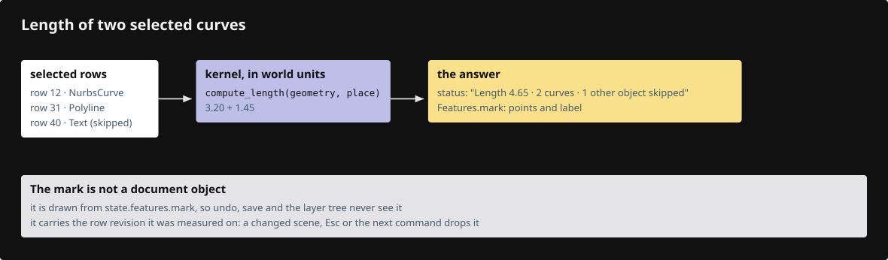

# 23d · Annotate and measure

**Estimated study time: about 15–30 hours.** Includes reading, typing, tracing, testing and experiments. [How to use this estimate](map.md#time-estimates).

**This section:** Measure geometry and display the resulting annotations.

**In the whole viewer:** Measurement reads scene positions and presents information through the existing command and text paths.

**Follow the data:** Chosen points → geometric calculation → numeric report and annotation.

**Start with these files:** [`src/app/command/verbs/measure_distance.rs`](23d-annotate-measure.md#code-23d-006).

**Aim to explain:** Why do distance and displacement answer different questions?

[Whole-viewer map and course milestones](map.md)

Two points give both a distance and a displacement. Distance is one non-negative length. Displacement records how far we travelled along each axis. The command reports both and places a temporary annotation between the measured points.



Start from the working result of [step 23c](23c-surfacing.md).

**One buildable step:** type the additions below in `workspace/handwritten`, then build and test. This step adds 2,105 lines across 15 files and may take several sittings. Individual listings are parts of this step, not separate build checkpoints.

<span id="code-23d-001"></span>

## `src/app/command/tests.rs`

Append **after line 251** of your current file.

Blank lines before: **1**; after: **0**. End with a newline.

```rust
--8<-- "typing/code/23d-001.rs"
```

<span id="code-23d-002"></span>

## `src/app/command/verbs/area.rs`

Create this file. Type the complete listing, including comments and blank lines.

```rust
--8<-- "typing/code/23d-002.rs"
```

<span id="code-23d-003"></span>

## `src/app/command/verbs/arrowhead.rs`

Create this file. Type the complete listing, including comments and blank lines.

```rust
--8<-- "typing/code/23d-003.rs"
```

<span id="code-23d-004"></span>

## `src/app/command/verbs/length.rs`

Create this file. Type the complete listing, including comments and blank lines.

```rust
--8<-- "typing/code/23d-004.rs"
```

<span id="code-23d-005"></span>

## `src/app/command/verbs/measure.rs`

Create this file. Type the complete listing, including comments and blank lines.

```rust
--8<-- "typing/code/23d-005.rs"
```

<span id="code-23d-006"></span>

## `src/app/command/verbs/measure_distance.rs`

Create this file. Type the complete listing, including comments and blank lines.

```rust
--8<-- "typing/code/23d-006.rs"
```

<span id="code-23d-007"></span>

## `src/app/command/verbs/mod.rs`

Insert **after line 1** of your current file.

Keep these preceding lines:

```rust
pub mod geometry; // shared code of the drawing verbs, not a verb itself; register:geometry
```

Keep these following lines:

```rust
pub mod selecting; // register:selecting

// One list of names becomes both the `pub mod` lines and the REGISTRY array.
/// Declare each verb's module and list its SPEC in REGISTRY, so a verb is one file plus one line.
```

Type these new lines:

```rust
--8<-- "typing/code/23d-007.rs"
```

<span id="code-23d-008"></span>

## `src/app/command/verbs/mod.rs`

Insert **after line 44** of your current file.

Keep these preceding lines:

```rust
    hide,                    // register:hide
    show,                    // register:show
    fit,                     // register:fit
    escape,                  // register:escape
```

Keep these following lines:

```rust
    object,                  // register:object
    edge,                    // register:edge
    face,                    // register:face
    controls,                // register:controls
```

Type these new lines:

```rust
--8<-- "typing/code/23d-008.rs"
```

<span id="code-23d-009"></span>

## `src/app/command/verbs/mod.rs`

Insert **after line 78** of your current file.

Keep these preceding lines:

```rust
    nurbs_surface_revolve,   // register:nurbs_surface_revolve
    nurbs_surface_4_points,  // register:nurbs_surface_4_points
    nurbs_surface_sweep1,    // register:nurbs_surface_sweep1
    nurbs_surface_sweep2,    // register:nurbs_surface_sweep2
```

Keep these following lines:

```rust
}
```

Type these new lines:

```rust
--8<-- "typing/code/23d-009.rs"
```

<span id="code-23d-010"></span>

## `src/app/command/verbs/project_to_plane.rs`

Create this file. Type the complete listing, including comments and blank lines.

```rust
--8<-- "typing/code/23d-010.rs"
```

<span id="code-23d-011"></span>

## `src/app/command/verbs/text.rs`

Create this file. Type the complete listing, including comments and blank lines.

```rust
--8<-- "typing/code/23d-011.rs"
```

<span id="code-23d-012"></span>

## `src/app/command/verbs/volume.rs`

Create this file. Type the complete listing, including comments and blank lines.

```rust
--8<-- "typing/code/23d-012.rs"
```

<span id="code-23d-013"></span>

## `src/app/inspection.rs`

Insert **after line 79** of your current file.

Keep these preceding lines:

```rust
            .collect::<Vec<_>>()
    );
    snapshot["drawing"] = state.drawing_status(); // register:commands
    snapshot["tool"] = state.tool_status(); // register:tools
```

Keep these following lines:

```rust
    snapshot["clipping"] = state.clipping_status(); // register:clipping
    snapshot["object_drag"] = state.object_drag_status(); // register:editing
    snapshot["number_box"] = number_box(state); // register:editing
    snapshot["undo_depth"] = undo_depth(state); // register:document
```

Type these new lines:

```rust
--8<-- "typing/code/23d-013.rs"
```

<span id="code-23d-014"></span>

## `src/app/ui/overlay.rs`

Insert **after line 38** of your current file.

Keep these preceding lines:

```rust

/// A tool's parts, else a measured answer.
pub(super) fn marks(painter: &egui::Painter, state: &crate::State, scale: f32) {
    let mut marks = state.tool_marks();
```

Keep these following lines:

```rust

    if let Some(marks) = &marks {
        tool_marks(painter, marks, scale);
    }
```

Type these new lines:

```rust
--8<-- "typing/code/23d-014.rs"
```

<span id="code-23d-015"></span>

## `src/state.rs`

Insert **after line 680** of your current file.

Keep these preceding lines:

```rust
    /// Esc: leave control points, keep the object selected.
    pub fn escape_selection(&mut self) {
        let parent = self.selection.escape();
        self.select(parent);
```

Keep these following lines:

```rust
        self.status("");
    }

    /// Show a message in the status line.
```

Type these new lines:

```rust
--8<-- "typing/code/23d-015.rs"
```

<span id="code-23d-016"></span>

## `src/state/edit.rs`

Insert **after line 863** of your current file.

Keep these preceding lines:

```rust
    /// Run one command line; the answer is what to show the person.
    pub fn run_command(&mut self, line: &str) -> Result<String, String> {
        let line = &crate::app::command::canonical(line); // `poly line` runs Polyline
        self.cancel_gesture();
```

Keep these following lines:

```rust
        // while drawing, points and Enter go to the draft
        if let Some(result) = self.drawing_command(line) {
            return result;
        }
```

Type these new lines:

```rust
--8<-- "typing/code/23d-016.rs"
```

<span id="code-23d-017"></span>

## `src/state/features.rs`

Insert **after line 5** of your current file.

Keep these preceding lines:

```rust
use super::drag; // register:object_drag
use super::drawing; // register:drawing
use super::edit; // register:gizmo_drag
use super::hydrate; // register:hydrate
```

Keep these following lines:

```rust
use crate::app::gizmo::Gizmo; // register:gizmo
use crate::app::snap::Snapping; // register:snap

/// What each feature keeps between frames; a feature adds its own file and one line here.
```

Type these new lines:

```rust
--8<-- "typing/code/23d-017.rs"
```

<span id="code-23d-018"></span>

## `src/state/features.rs`

Insert **after line 26** of your current file.

Keep these preceding lines:

```rust
    pub(super) dragging: Option<edit::GizmoDrag>, // register:gizmo_drag
    pub(super) object_drag: Option<drag::ObjectDrag>, // register:object_drag
    pub(crate) draft: Option<drawing::Draft>, // register:drawing
    pub(crate) snap: Snapping,        // register:snap
```

Keep these following lines:

```rust
}

// Each list starts empty; a later lesson adds one line per hook.
// `fn(&mut State)` is a function pointer; a method such as `State::purge_idle` is one, with `self` as its first argument.
```

Type these new lines:

```rust
--8<-- "typing/code/23d-018.rs"
```

## Check the completed chapter

From `session_viewer`, compare everything you have typed:

```sh
npm --prefix ../session_tests run course -- reference-check 23d
```

From `workspace/handwritten`:

```sh
cargo build --lib --locked -j4
cargo xtest --lib --locked -j4
```

Run the native measurement tests. Measure a simple pair of points and compare the numerical result with your prediction.

If the distance is correct but its unit is wrong, inspect the displayed unit conversion. If the displacement signs are wrong, check the order of subtraction.

**Before moving on:** explain what changed, check the expected result above, and fix any build or test failure.

<details>
<summary>Check your explanation of the opening question</summary>

Distance is a non-negative scalar length. Displacement retains the signed changes along the coordinate axes.

</details>

[Next step: 24](24-placed-controls.md)
