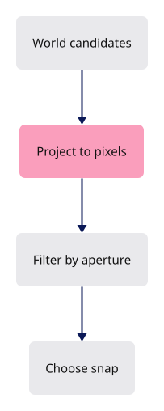

# 24 · Snapping

**Estimated study time: about 2–5 hours.** Includes reading, typing, tracing, testing and experiments. [How to use this estimate](map.md#time-estimates).

**This section:** Connect the Snap command to the snapping system introduced during direct editing.

**In the whole viewer:** This step exposes an existing tool helper. The helper chooses source candidates in screen space; the command controls its mode.

**Follow the data:** Candidates → projection → mode/priority and pixel distance → chosen point.

**Start with these files:** [`src/app/command/verbs/snap.rs`](24-placed-controls.md#code-24-003), [`src/app/snap.rs`](21-editing.md#code-21-074).

**Aim to explain:** Why should the snap aperture be measured in pixels rather than fixed world units?

[Whole-viewer map and course milestones](map.md)

A snap should feel equally reachable near and far from the camera. We therefore compare projected candidates with the cursor in pixels. The snap mode filters candidates first; then priority and distance choose a winner inside the aperture.



Start from the working result of [step 23d](23d-annotate-measure.md).

**One buildable step:** type the additions below in `workspace/handwritten`, then build and test. This step adds 136 lines across 4 files and may take several sittings. Individual listings are parts of this step, not separate build checkpoints.

<span id="code-24-001"></span>

## `src/app/command/tests.rs`

Append **after line 297** of your current file.

Blank lines before: **1**; after: **0**. End with a newline.

```rust
--8<-- "typing/code/24-001.rs"
```

<span id="code-24-002"></span>

## `src/app/command/verbs/mod.rs`

Insert **after line 45** of your current file.

Keep these preceding lines:

```rust
    show,                    // register:show
    fit,                     // register:fit
    escape,                  // register:escape
    arrowhead,               // register:arrowhead
```

Keep these following lines:

```rust
    object,                  // register:object
    edge,                    // register:edge
    face,                    // register:face
    controls,                // register:controls
```

Type these new lines:

```rust
--8<-- "typing/code/24-002.rs"
```

<span id="code-24-003"></span>

## `src/app/command/verbs/snap.rs`

Create this file. Type the complete listing, including comments and blank lines.

```rust
--8<-- "typing/code/24-003.rs"
```

<span id="code-24-004"></span>

## `src/app/ui/command_line/tests.rs`

Append **after line 60** of your current file.

Blank lines before: **1**; after: **0**. End with a newline.

```rust
--8<-- "typing/code/24-004.rs"
```

## Check the completed chapter

From `session_viewer`, compare everything you have typed:

```sh
npm --prefix ../session_tests run course -- reference-check 24
```

From `workspace/handwritten`:

```sh
cargo build --lib --locked -j4
cargo xtest --lib --locked -j4
```

Run the native snap tests. Start a point tool, approach an endpoint, move just outside the aperture and verify that the snap releases.

If snapping feels inconsistent on a high-density display, check whether cursor and aperture use the same pixel units.

**Before moving on:** explain what changed, check the expected result above, and fix any build or test failure.

<details>
<summary>Check your explanation of the opening question</summary>

A fixed world-space radius appears larger or smaller as the view changes. A pixel aperture gives the cursor a consistent reach on screen.

</details>

[Next step: 25](25-gumball.md)
