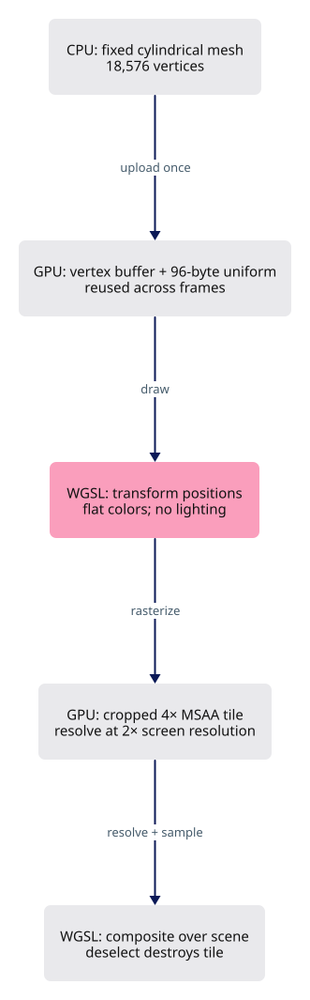

# 25 · Draw a solid, readable gumball

**Estimated study time: about 6–15 hours.** Includes reading, typing, tracing, testing and experiments. [How to use this estimate](map.md#time-estimates).

**This section:** Render identifiable gumball handles with a clear on-screen shape.

**In the whole viewer:** The gumball is a visual input device for the editing system, layered over the scene without changing scene geometry itself.

**Follow the data:** Handle geometry and IDs → overlay draw → handle hit → editing action.

**Start with these files:** [`src/engine/gpu/widget.rs`](25-gumball.md#code-25-011), [`src/shaders/widget.wgsl`](25-gumball.md#code-25-013).

**Aim to explain:** Why do the gumball and a scene mesh need separate depth behavior?

[Whole-viewer map and course milestones](map.md)

A gumball is small geometry drawn for interaction: arrows, handles and a centre. Its vertices carry both a position and the information needed to colour and identify each part. Rust and the shader must agree about this record’s byte layout.



Start from the working result of [step 24](24-placed-controls.md).

**One buildable step:** type the additions below in `workspace/handwritten`, then build and test. This step adds 760 lines across 11 files and may take several sittings. Individual listings are parts of this step, not separate build checkpoints.

<span id="code-25-001"></span>

## `src/app/input.rs`

Insert **after line 152** of your current file.

Keep these preceding lines:

```rust

                self.last_cursor = at;
                let mut redraw = dragging;
                redraw = redraw || state.hover_drawing(at.0, at.1); // register:commands
```

Keep these following lines:

```rust
                redraw
            }
            WindowEvent::MouseWheel { delta, .. } => {
                // a mouse wheel reports lines, a touchpad pixels: 100 px count as one line
```

Type these new lines:

```rust
--8<-- "typing/code/25-001.rs"
```

<span id="code-25-002"></span>

## `src/app/inspection.rs`

Insert **after line 34** of your current file.

Keep these preceding lines:

```rust
    let mut snapshot = serde_json::json!({
        "submitted_at_ms": crate::engine::performance::now_ms(),
        "frames": state.gpu.performance.frames,
        "draw_calls": state.gpu.performance.draws,
```

Keep these following lines:

```rust
        "selected": parent,
        "hidden_count": state.scene.hidden.len(),
        "identity": identity,
        "selection": state.selection,
```

Type these new lines:

```rust
--8<-- "typing/code/25-002.rs"
```

<span id="code-25-003"></span>

## `src/engine/gpu/mod.rs`

Insert **after line 35** of your current file.

Keep these preceding lines:

```rust
pub mod ui; // register:ui
pub mod upload; // register:upload
pub mod vectors; // register:vectors
pub mod view; // register:view
```

Keep these following lines:

```rust

use crate::engine::performance::Performance;
use crate::engine::pipelines::{Layouts, Target};
use session_rust::{AABB, Point};
```

Type these new lines:

```rust
--8<-- "typing/code/25-003.rs"
```

<span id="code-25-004"></span>

## `src/engine/gpu/mod.rs`

Insert **after line 84** of your current file.

Keep these preceding lines:

```rust
    pub segments: SegmentLane,                   // lines; register:strokes
    pub glyphs: GlyphLane,                       // markers and dots; register:markers
    pub controls: GlyphLane,                     // control point dots; register:shell
    pub control_net: SegmentLane,                // control polygon lines; register:shell
```

Keep these following lines:

```rust
    pub ui: Option<ui::Ui>,                      // egui overlay; register:egui
    pub text: text::TextLane,                    // labels; register:text
    pub selection_revision: u64,                 // bumps on every selection change
    pub logical_size: [f64; 2],                  // canvas size in CSS pixels
```

Type these new lines:

```rust
--8<-- "typing/code/25-004.rs"
```

<span id="code-25-005"></span>

## `src/engine/gpu/mod.rs`

Insert **after line 115** of your current file.

Keep these preceding lines:

```rust
            segments,          // register:strokes
            glyphs,            // register:markers
            controls,          // register:shell
            control_net,       // register:shell
```

Keep these following lines:

```rust
            text,              // register:text
            cloud,             // register:clouds
            splat,             // register:clouds
            pick,              // register:shell
```

Type these new lines:

```rust
--8<-- "typing/code/25-005.rs"
```

<span id="code-25-006"></span>

## `src/engine/gpu/mod.rs`

Insert **after line 206** of your current file.

Keep these preceding lines:

```rust
        let segments = SegmentLane::new(&ctx, &layouts, target); // register:strokes
        let glyphs = GlyphLane::new(&ctx, &layouts, target); // register:markers
        let controls = GlyphLane::new(&ctx, &layouts, target); // register:shell
        let control_net = SegmentLane::new(&ctx, &layouts, target); // register:shell
```

Keep these following lines:

```rust
        let text = text::TextLane::new(&ctx, target); // register:text
        let cloud = CloudLane::new(&ctx); // register:clouds
        let splat = Splat::new(&ctx, &layouts, target, cloud.buffers()); // register:clouds
        // each registered lane builds itself through its `make` function
```

Type these new lines:

```rust
--8<-- "typing/code/25-006.rs"
```

<span id="code-25-007"></span>

## `src/engine/gpu/mod.rs`

Insert **after line 239** of your current file.

Keep these preceding lines:

```rust
            segments,    // register:strokes
            glyphs,      // register:markers
            controls,    // register:shell
            control_net, // register:shell
```

Keep these following lines:

```rust
            ui: None,    // register:egui
            text,        // register:text
            selection_revision: 0,
            logical_size: [size.0 as f64, size.1 as f64],
```

Type these new lines:

```rust
--8<-- "typing/code/25-007.rs"
```

<span id="code-25-008"></span>

## `src/engine/gpu/present.rs`

Insert **after line 18** of your current file.

Keep these preceding lines:

```rust
            pixel_scale: size.0 as f32 / self.logical_size[0].max(1.0) as f32,
        };
        self.frame.write(&self.ctx, input, &cx);
        self.each_pass(|pass, g| pass.write_frame(g, input));
```

Keep these following lines:

```rust
        self.objects
            .update_inside(&self.ctx, self.frame.eye, &self.bounds);
        self.prepare_text(size); // register:text
    }
```

Type these new lines:

```rust
--8<-- "typing/code/25-008.rs"
```

<span id="code-25-009"></span>

## `src/engine/gpu/present.rs`

Append **after line 230** of your current file.

Blank lines before: **1**; after: **0**. End with a newline.

```rust
--8<-- "typing/code/25-009.rs"
```

<span id="code-25-010"></span>

## `src/engine/gpu/render.rs`

Insert **after line 35** of your current file.

Keep these preceding lines:

```rust
        // pass 2: ambient occlusion and the outline masks, each pass in turn
        self.each_pass(|pass, g| draws += pass.after_faces(g, encoder, &frame));
        draws += self.ink_pass(encoder, view); // pass 3: lines, markers, outlines and text; register:ink
        self.pending_pick(encoder); // a click waiting: draw the id pass now; register:shell
```

Keep these following lines:

```rust
        self.draw_panels(encoder, view); // register:egui
        (draws, self.objects.len())
    }
```

Type these new lines:

```rust
--8<-- "typing/code/25-010.rs"
```

<span id="code-25-011"></span>

## `src/engine/gpu/widget.rs`

The gumball is a small piece of geometry with interaction meaning. Its axes show allowed movement or rotation. Handle identity matters separately from scene-object identity so a click can begin the right gesture.

Create this file. Type the complete listing, including comments and blank lines.

```rust
--8<-- "typing/code/25-011.rs"
```

<span id="code-25-012"></span>

## `src/engine/gpu/widget_mesh.rs`

Create this file. Type the complete listing, including comments and blank lines.

```rust
--8<-- "typing/code/25-012.rs"
```

<span id="code-25-013"></span>

## `src/shaders/widget.wgsl`

Create this file. Type the complete listing, including comments and blank lines.

```wgsl
--8<-- "typing/code/25-013.wgsl"
```

<span id="code-25-014"></span>

## `src/state.rs`

Insert **after line 483** of your current file.

Keep these preceding lines:

```rust
        for hook in features::BEFORE_PICKS {
            hook(self);
        }
```

Keep these following lines:

```rust
        let logical = self.logical_size();

        // the CSS size changed: control dots keep their pixel size
        if logical != self.gpu.logical_size {
```

Type these new lines:

```rust
--8<-- "typing/code/25-014.rs"
```

<span id="code-25-015"></span>

## `src/state/edit.rs`

Insert **after line 27** of your current file.

Keep these preceding lines:

```rust
        let row = row.filter(|_| !self.tool_running()); // hidden while a tool asks for points; register:tools
        // no box, no gizmo
        let Some(box_) = row.and_then(|r| self.gpu.objects.row_bounds(r)) else { // `box` is a reserved word, hence `box_`
            self.features.gizmo = None;
```

Keep these following lines:

```rust
            return;
        };
        // the box around every selected row
        let mut bounds = box_;
```

Type these new lines:

```rust
--8<-- "typing/code/25-015.rs"
```

<span id="code-25-016"></span>

## `src/state/edit.rs`

Insert **after line 63** of your current file.

Keep these preceding lines:

```rust
            Some(gizmo) => gizmo.set_origin(origin),
            None => self.features.gizmo = Some(Gizmo::new(origin)),
        }
```

Keep these following lines:

```rust
    }

    /// Grab a gizmo handle within `radius` CSS pixels; false when the press missed it.
    pub(crate) fn begin_gizmo_with_radius(&mut self, x: f64, y: f64, radius: f64) -> bool {
```

Type these new lines:

```rust
--8<-- "typing/code/25-016.rs"
```

<span id="code-25-017"></span>

## `src/state/edit.rs`

Insert **after line 154** of your current file.

Keep these preceding lines:

```rust
                if let Some(gizmo) = self.features.gizmo.as_mut() {
                    gizmo.origin = origin;
                }
```

Keep these following lines:

```rust
                self.touch();
                return true;
            }
```

Type these new lines:

```rust
--8<-- "typing/code/25-017.rs"
```

<span id="code-25-018"></span>

## `src/state/edit.rs`

Insert **after line 179** of your current file.

Keep these preceding lines:

```rust
            if let Some(gizmo) = self.features.gizmo.as_mut() {
                gizmo.origin = origin;
            }
```

Keep these following lines:

```rust
            self.touch();
            return true;
        }
```

Type these new lines:

```rust
--8<-- "typing/code/25-018.rs"
```

<span id="code-25-019"></span>

## `src/state/edit.rs`

Insert **after line 276** of your current file.

Keep these preceding lines:

```rust
        let Some(gizmo) = self.features.gizmo.as_mut() else {
            return false;
        };
        gizmo.typing = Some(handle);
```

Keep these following lines:

```rust
        let (_, _, unit) = handle.labels();
        self.status(&format!(
            "{}: type a value in {unit}, Enter applies, Esc closes",
            handle.title()
```

Type these new lines:

```rust
--8<-- "typing/code/25-019.rs"
```

<span id="code-25-020"></span>

## `src/state/edit.rs`

Append **after line 890** of your current file.

Blank lines before: **1**; after: **0**. End with a newline.

```rust
--8<-- "typing/code/25-020.rs"
```

<span id="code-25-021"></span>

## `src/state/number_box.rs`

Insert **after line 50** of your current file.

Keep these preceding lines:

```rust
        else {
            return false;
        };
        gizmo.typing = None;
```

Keep these following lines:

```rust
        self.touch();
        true
    }
```

Type these new lines:

```rust
--8<-- "typing/code/25-021.rs"
```

## Check the completed chapter

From `session_viewer`, compare everything you have typed:

```sh
npm --prefix ../session_tests run course -- reference-check 25
```

From `workspace/handwritten`:

```sh
cargo build --lib --locked -j4
cargo xtest --lib --locked -j4
```

Run the native gumball tests. Select an object and verify that its handles are visible and can be picked independently.

If the gumball is distorted or its handles have mixed colours, compare offsets, formats and stride before changing geometry dimensions.

**Before moving on:** explain what changed, check the expected result above, and fix any build or test failure.

<details>
<summary>Check your explanation of the opening question</summary>

The gumball is an interaction overlay. Its rendering must not overwrite the physical scene depth used for surface visibility and picking.

</details>

[Next step: 26](26-nested-panel.md)
