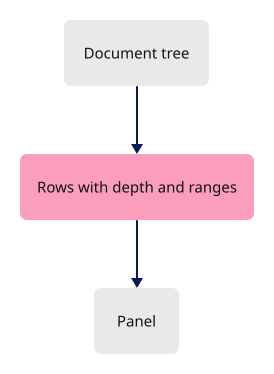

# 26 · The nested session panel

**Estimated study time: about 5–15 hours.** Includes reading, typing, tracing, testing and experiments. [How to use this estimate](map.md#time-estimates).

**This section:** Represent a nested scene as expandable panel rows.

**In the whole viewer:** The hierarchy panel presents the same source objects and selection state that drawing and editing use.

**Follow the data:** Source tree → flattened rows and descendant ranges → expanded/collapsed panel.

**Start with these files:** [`src/app/hierarchy.rs`](26-nested-panel.md#code-26-001).

**Aim to explain:** What does collapsing a group change, and what should it leave untouched?

[Whole-viewer map and course milestones](map.md)

The scene is a tree of documents, groups and objects. A panel displays a sequence of rows. Flattening the tree records each row’s depth and the end of its descendant range, so collapsing a group can skip that range without losing the original hierarchy.



Start from the working result of [step 25](25-gumball.md).

**One buildable step:** type the additions below in `workspace/handwritten`, then build and test. This step adds 620 lines across 5 files and may take several sittings. Individual listings are parts of this step, not separate build checkpoints.

<span id="code-26-001"></span>

## `src/app/hierarchy.rs`

A hierarchy gives each node a place in a larger structure. Traversal must preserve parent–child relationships without confusing them with the flat order of display rows. Selection and expansion may refer to different levels.

Create this file. Type the complete listing, including comments and blank lines.

```rust
--8<-- "typing/code/26-001.rs"
```

<span id="code-26-002"></span>

## `src/app/mod.rs`

Insert **after line 19** of your current file.

Keep these preceding lines:

```rust
pub mod fetch; // register:fetch
pub mod fonts; // register:fonts
pub mod gesture; // register:gesture
pub mod gizmo; // register:gizmo
```

Keep these following lines:

```rust
pub mod input; // register:input
#[cfg(any(target_arch = "wasm32", test))] // register:inspection
pub mod inspection; // register:inspection
pub mod keys; // register:keys
```

Type these new lines:

```rust
--8<-- "typing/code/26-002.rs"
```

<span id="code-26-003"></span>

## `src/app/scene_sync.rs`

Append **after line 606** of your current file.

Blank lines before: **1**; after: **0**. End with a newline.

```rust
--8<-- "typing/code/26-003.rs"
```

<span id="code-26-004"></span>

## `src/app/scene_sync/panel_tests.rs`

Create this file. Type the complete listing, including comments and blank lines.

```rust
--8<-- "typing/code/26-004.rs"
```

<span id="code-26-005"></span>

## `src/state/features.rs`

Insert **after line 7** of your current file.

Keep these preceding lines:

```rust
use super::edit; // register:gizmo_drag
use super::hydrate; // register:hydrate
use crate::app::command::verbs::measure::Mark; // register:measure
use crate::app::gizmo::Gizmo; // register:gizmo
```

Keep these following lines:

```rust
use crate::app::snap::Snapping; // register:snap

/// What each feature keeps between frames; a feature adds its own file and one line here.
// Every field starts from its Default, so `State::new` never names one.
```

Type these new lines:

```rust
--8<-- "typing/code/26-005.rs"
```

<span id="code-26-006"></span>

## `src/state/features.rs`

Insert **after line 28** of your current file.

Keep these preceding lines:

```rust
    pub(super) object_drag: Option<drag::ObjectDrag>, // register:object_drag
    pub(crate) draft: Option<drawing::Draft>, // register:drawing
    pub(crate) snap: Snapping,        // register:snap
    pub(crate) mark: Option<Mark>,    // register:measure
```

Keep these following lines:

```rust
}

// Each list starts empty; a later lesson adds one line per hook.
// `fn(&mut State)` is a function pointer; a method such as `State::purge_idle` is one, with `self` as its first argument.
```

Type these new lines:

```rust
--8<-- "typing/code/26-006.rs"
```

## Check the completed chapter

From `session_viewer`, compare everything you have typed:

```sh
npm --prefix ../session_tests run course -- reference-check 26
```

From `workspace/handwritten`:

```sh
cargo build --lib --locked -j4
cargo xtest --lib --locked -j4
```

Run the native hierarchy tests. Open a nested document and collapse then expand one group; neighbouring groups should keep their state.

If collapsing one group hides its next sibling, check the exclusive end index. If identical names select the wrong object, inspect the source identity.

**Before moving on:** explain what changed, check the expected result above, and fix any build or test failure.

<details>
<summary>Check your explanation of the opening question</summary>

It changes which panel rows are shown. It should not delete or restructure the source objects represented by the hidden descendant rows.

</details>

[Next step: 30](30-layer-tree.md)
