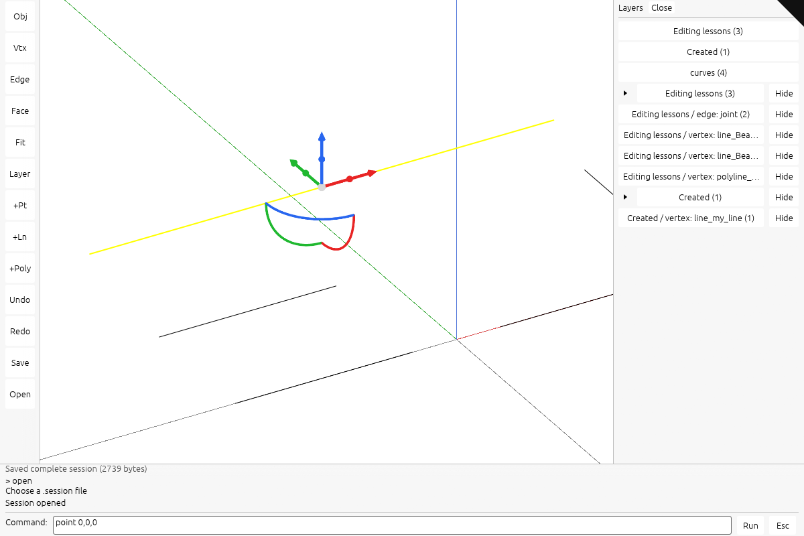

# 29 · Dock the workspace, edit source geometry and save

Commands dock below the viewport, selection tools support touch, and Save/Open retains editable source geometry.

## Step 1 · src/app/command.rs
Add Save and Open to the command vocabulary and argument checks.

`lessons/29/src/app/command.rs` · edit · type this

Added after the line `Scale(f64),` in `lessons/28/src/app/command.rs`

```rust
--8<-- "lessons/29/src/app/command.rs:step-1a"
```

Replaces the line `"delete" | "del" | "undo" | "redo" | "hide" | "show" | "f…` in `lessons/28/src/app/command.rs`

```rust
--8<-- "lessons/29/src/app/command.rs:step-1b"
```

Added after the line `}` in `lessons/28/src/app/command.rs`

```rust
--8<-- "lessons/29/src/app/command.rs:step-1c"
```

## Step 2 · src/app/deform.rs
Resolve selected source controls, edges and faces, then transform their shared geometry.

`lessons/29/src/app/deform.rs` · 481 lines · type this, new file

```rust
--8<-- "lessons/29/src/app/deform.rs"
```

## Step 3 · src/app/edit.rs
Add source replacement, component edits and temporary geometry previews.

`lessons/29/src/app/edit.rs` · edit · type this

Added after the line `}` in `lessons/28/src/app/edit.rs`

```rust
--8<-- "lessons/29/src/app/edit.rs:step-3"
```

## Step 4 · src/app/gizmo.rs
Allow a larger hit radius for touch without changing handle geometry.

`lessons/29/src/app/gizmo.rs` · edit · type this

Added after the line `pub fn hit(&self, from: &Point, dir: &Vector, world_per_p…` in `lessons/28/src/app/gizmo.rs`

```rust
--8<-- "lessons/29/src/app/gizmo.rs:step-4a"
```

Replaces the line `if within(from, dir, &at, GRAB * s) {` in `lessons/28/src/app/gizmo.rs`

```rust
--8<-- "lessons/29/src/app/gizmo.rs:step-4b"
```

Replaces the line `if (HUB * s..=ARM * s).contains(&t) && within(from, dir, …` in `lessons/28/src/app/gizmo.rs`

```rust
--8<-- "lessons/29/src/app/gizmo.rs:step-4c"
```

Replaces the line `if d.dot(&u) < 0.0 && d.dot(&v) < 0.0 && (d.magnitude() -…` in `lessons/28/src/app/gizmo.rs`

```rust
--8<-- "lessons/29/src/app/gizmo.rs:step-4d"
```

## Step 5 · src/app/input.rs
Route touch gestures through control and gumball editing before camera navigation.

`lessons/29/src/app/input.rs` · edit · type this

Added after the line `touch: Touches,` in `lessons/28/src/app/input.rs`

```rust
--8<-- "lessons/29/src/app/input.rs:step-5a"
```

Added after the line `touch: Touches::new(),` in `lessons/28/src/app/input.rs`

```rust
--8<-- "lessons/29/src/app/input.rs:step-5b"
```

Added after the line `};` in `lessons/28/src/app/input.rs`

```rust
--8<-- "lessons/29/src/app/input.rs:step-5c"
```

Added after the line `self.touch = Touches::new();` in `lessons/28/src/app/input.rs`

```rust
--8<-- "lessons/29/src/app/input.rs:step-5d"
```

## Step 6 · src/app/loader.rs
Install a restored editable scene through the normal loading path.

`lessons/29/src/app/loader.rs` · edit · type this

Added after the line `}` in `lessons/28/src/app/loader.rs`

```rust
--8<-- "lessons/29/src/app/loader.rs:step-6"
```

## Step 7 · src/app/mod.rs
Declare the new application modules so their files join the crate.

`lessons/29/src/app/mod.rs` · edit · type this

Added after the line `pub mod cplane;` in `lessons/28/src/app/mod.rs`

```rust
--8<-- "lessons/29/src/app/mod.rs:step-7a"
```

Added after the line `pub mod selection;` in `lessons/28/src/app/mod.rs`

```rust
--8<-- "lessons/29/src/app/mod.rs:step-7b"
```

## Step 8 · src/app/scene_text.rs
Retain authored text while rebuilding the scene and registering its labels.

`lessons/29/src/app/scene_text.rs` · edit · type this

Replaces the 2 lines from `pub(super) key: String,` in `lessons/28/src/app/scene_text.rs`

```rust
--8<-- "lessons/29/src/app/scene_text.rs:step-8a"
```

Replaces the line `pub(super) fn register_text(&mut self, key: String, mut l…` in `lessons/28/src/app/scene_text.rs`

```rust
--8<-- "lessons/29/src/app/scene_text.rs:step-8b"
```

## Step 9 · src/app/selection.rs
Add explicit object, edge and face selection tools.

`lessons/29/src/app/selection.rs` · edit · type this

Added after the line `}` in `lessons/28/src/app/selection.rs`

```rust
--8<-- "lessons/29/src/app/selection.rs:step-9"
```

## Step 10 · src/app/session_io.rs
Save retained sessions, placements and authored text into one archive and restore them on Open.

`lessons/29/src/app/session_io.rs` · 261 lines · type this, new file

```rust
--8<-- "lessons/29/src/app/session_io.rs"
```

## Step 11 · src/app/ui.rs
Dock commands below the viewport, add the tool stripe and adapt panel widths to the screen.

`lessons/29/src/app/ui.rs` · edit · type this

Delete the line `#[derive(Default)]` above `pub struct Model` in `lessons/28/src/app/ui.rs`.

Added after the line `history: VecDeque<String>,` in `lessons/28/src/app/ui.rs`

```rust
--8<-- "lessons/29/src/app/ui.rs:step-11b"
```

Added after the line `controls: Option<Vec<Control>>,` in `lessons/28/src/app/ui.rs`

```rust
--8<-- "lessons/29/src/app/ui.rs:step-11c"
```

Added after the line `controls: (super::route::query("inspect").as_deref() == S…` in `lessons/28/src/app/ui.rs`

```rust
--8<-- "lessons/29/src/app/ui.rs:step-11d"
```

Replaces the line `(response.consumed || escape, response.repaint || escape)` in `lessons/28/src/app/ui.rs`

```rust
--8<-- "lessons/29/src/app/ui.rs:step-11e"
```

Added after the line `let mut command = None;` in `lessons/28/src/app/ui.rs`

```rust
--8<-- "lessons/29/src/app/ui.rs:step-11f"
```

Replaces the 2 lines from `output.pixels_per_point *=` in `lessons/28/src/app/ui.rs`

```rust
--8<-- "lessons/29/src/app/ui.rs:step-11g"
```

Replaces the lines from `let hidden = MODEL.with_borrow(|model| model.command_open);` in `lessons/28/src/app/ui.rs`

```rust
--8<-- "lessons/29/src/app/ui.rs:step-11h"
```

Replaces the line `visuals.panel_fill = egui::Color32::WHITE;` in `lessons/28/src/app/ui.rs`

```rust
--8<-- "lessons/29/src/app/ui.rs:step-11i"
```

Replaces the line `context: &egui::Context,` in `lessons/28/src/app/ui.rs`

```rust
--8<-- "lessons/29/src/app/ui.rs:step-11j"
```

Replaces the 7 lines from `egui::Window::new("Session layers")` in `lessons/28/src/app/ui.rs`

```rust
--8<-- "lessons/29/src/app/ui.rs:step-11k"
```

Replaces the line `let (rect, response) = ui.allocate_exact_size(egui::vec2(…` in `lessons/28/src/app/ui.rs`

```rust
--8<-- "lessons/29/src/app/ui.rs:step-11l"
```

Replaces the line `ui.button(text).on_hover_text(label)` in `lessons/28/src/app/ui.rs`

```rust
--8<-- "lessons/29/src/app/ui.rs:step-11m"
```

## Step 12 · src/engine/gpu/faces.rs
Keep source-face identities attached to the updated triangle ranges.

`lessons/29/src/engine/gpu/faces.rs` · edit · type this

Added after the line `(source.parent == row).then_some((address, source))` in `lessons/28/src/engine/gpu/faces.rs`

```rust
--8<-- "lessons/29/src/engine/gpu/faces.rs:step-12"
```

## Step 13 · src/engine/text.rs
Keep retained text records available when the scene is saved or replaced.

`lessons/29/src/engine/text.rs` · edit · type this

Replaces the line `#[derive(Clone, Debug, PartialEq)]` in `lessons/28/src/engine/text.rs`

```rust
--8<-- "lessons/29/src/engine/text.rs:step-13a"
```

Replaces the line `#[derive(Clone, Copy, Debug, PartialEq)]` in `lessons/28/src/engine/text.rs`

```rust
--8<-- "lessons/29/src/engine/text.rs:step-13b"
```

## Step 14 · src/lib.rs
Connect browser events, scene changes and drawing through the application state.

`lessons/29/src/lib.rs` · edit · type this

Added after the line `CancelPointer,` in `lessons/28/src/lib.rs`

```rust
--8<-- "lessons/29/src/lib.rs:step-14a"
```

Replaces the line `self.ui = Some(app::ui::Ui::new(&state.window));` in `lessons/28/src/lib.rs`

```rust
--8<-- "lessons/29/src/lib.rs:step-14b"
```

Added after the line `Msg::SheetEntity(resolved) => state.sheet_entity(resolved),` in `lessons/28/src/lib.rs`

```rust
--8<-- "lessons/29/src/lib.rs:step-14c"
```

Replaces the line `}` in `lessons/28/src/lib.rs`

```rust
--8<-- "lessons/29/src/lib.rs:step-14d"
```

## Step 15 · src/state.rs
Track the active selection tool and edited component while replacing or picking a scene.

`lessons/29/src/state.rs` · edit · type this

Added after the line `pub selection: SelectionMode,` in `lessons/28/src/state.rs`

```rust
--8<-- "lessons/29/src/state.rs:step-15a"
```

Added after the line `selection: SelectionMode::Object,` in `lessons/28/src/state.rs`

```rust
--8<-- "lessons/29/src/state.rs:step-15b"
```

Added after the line `.set_edge(&self.gpu.ctx, Some((pick.row, edge)));` in `lessons/28/src/state.rs`

```rust
--8<-- "lessons/29/src/state.rs:step-15c"
```

Added after the line `.select(&self.gpu.ctx, Some(address));` in `lessons/28/src/state.rs`

```rust
--8<-- "lessons/29/src/state.rs:step-15d"
```

Added after the line `pub fn request_selection(&mut self, x: u32, y: u32, edge:…` in `lessons/28/src/state.rs`

```rust
--8<-- "lessons/29/src/state.rs:step-15e"
```

Added after the line `self.upload_controls();` in `lessons/28/src/state.rs`

```rust
--8<-- "lessons/29/src/state.rs:step-15f"
```

## Step 16 · src/state/edit.rs
Route component gumball previews, touch grabs and Save/Open through the source-editing helpers.

`lessons/29/src/state/edit.rs` · edit · type this

Added after the line `drag: Drag,` in `lessons/28/src/state/edit.rs`

```rust
--8<-- "lessons/29/src/state/edit.rs:step-16a"
```

Replaces the line `let origin = Point::new(box_.cx, box_.cy, box_.cz);` in `lessons/28/src/state/edit.rs`

```rust
--8<-- "lessons/29/src/state/edit.rs:step-16b"
```

Added after the line `pub fn begin_gizmo(&mut self, x: f64, y: f64) -> bool {` in `lessons/28/src/state/edit.rs`

```rust
--8<-- "lessons/29/src/state/edit.rs:step-16c"
```

Replaces the line `let Some(handle) = gizmo.hit(&from, &dir, per_px) else {` in `lessons/28/src/state/edit.rs`

```rust
--8<-- "lessons/29/src/state/edit.rs:step-16d"
```

Added after the line `drag,` in `lessons/28/src/state/edit.rs`

```rust
--8<-- "lessons/29/src/state/edit.rs:step-16e"
```

Replaces the line `let Some(gizmo) = self.gizmo.as_ref() else {` in `lessons/28/src/state/edit.rs`

```rust
--8<-- "lessons/29/src/state/edit.rs:step-16f"
```

Added after the line `};` in `lessons/28/src/state/edit.rs`

```rust
--8<-- "lessons/29/src/state/edit.rs:step-16g"
```

Replaces the line `let Some(delta) = gizmo.update(&active.drag, &from, &dir)…` in `lessons/28/src/state/edit.rs`

```rust
--8<-- "lessons/29/src/state/edit.rs:step-16h"
```

Added after the line `if let Some(active) = self.dragging.take() {` in `lessons/28/src/state/edit.rs`

```rust
--8<-- "lessons/29/src/state/edit.rs:step-16i"
```

Added after the line `match command {` in `lessons/28/src/state/edit.rs`

```rust
--8<-- "lessons/29/src/state/edit.rs:step-16j"
```

Added after the line `};` in `lessons/28/src/state/edit.rs`

```rust
--8<-- "lessons/29/src/state/edit.rs:step-16k"
```

Replaces the 7 lines from `let index = match active.id {` in `lessons/28/src/state/edit.rs`

```rust
--8<-- "lessons/29/src/state/edit.rs:step-16l"
```

Added after the line `}` in `lessons/28/src/state/edit.rs`

```rust
--8<-- "lessons/29/src/state/edit.rs:step-16m"
```

## Check

Run `trunk serve` in `lessons/29/` and open <http://127.0.0.1:8770/>.

Expected: the bottom command dock and right layer panel surround the scene; reopening a saved session reports **Session opened**.



If it fails:

- A shared mesh corner separates: the edit changes render triangles instead of source vertices.
- Save omits geometry: a streamed prefix is treated as a complete source.

## What changed

```text
lessons/29/src/
├── app/
│   ├── inspection/
│   │   └── source_memory.rs
│   ├── walk/
│   │   ├── bounds.rs
│   │   ├── brep.rs
│   │   ├── brep_edges.rs
│   │   ├── brep_orient.rs
│   │   ├── cloud.rs
│   │   ├── curves.rs
│   │   ├── encode.rs
│   │   ├── frames.rs
│   │   ├── mesh.rs
│   │   ├── mesh_ink.rs
│   │   ├── mesh_topology.rs
│   │   ├── mod.rs
│   │   ├── points.rs
│   │   └── sheet.rs
│   ├── cloud_query.rs
│   ├── command.rs  ~
│   ├── coords.rs
│   ├── cplane.rs
│   ├── decode.rs
│   ├── deform.rs  +
│   ├── edit.rs  ~
│   ├── feedback.rs
│   ├── fetch.rs
│   ├── gizmo.rs  ~
│   ├── hierarchy.rs
│   ├── input.rs  ~
│   ├── inspection.rs
│   ├── knobs.rs
│   ├── layers.rs
│   ├── live.rs
│   ├── loader.rs  ~
│   ├── manifest.rs
│   ├── mod.rs  ~
│   ├── modeling.rs
│   ├── route.rs
│   ├── scene.rs
│   ├── scene_text.rs  ~
│   ├── selection.rs  ~
│   ├── session_io.rs  +
│   ├── sheet_query.rs
│   ├── snap.rs
│   ├── stream.rs
│   ├── touch.rs
│   ├── ui.rs  ~
│   └── validate.rs
├── engine/
│   ├── gpu/
│   │   ├── arena.rs
│   │   ├── backdrop.rs
│   │   ├── buffers.rs
│   │   ├── cloud.rs
│   │   ├── device.rs
│   │   ├── faces.rs  ~
│   │   ├── frame.rs
│   │   ├── glyphs.rs
│   │   ├── instance.rs
│   │   ├── lod.rs
│   │   ├── mod.rs
│   │   ├── objects.rs
│   │   ├── pick.rs
│   │   ├── present.rs
│   │   ├── render.rs
│   │   ├── segments.rs
│   │   ├── splat.rs
│   │   ├── surface_outline.rs
│   │   ├── targets.rs
│   │   ├── text.rs
│   │   ├── text_outline.rs
│   │   ├── text_plane.rs
│   │   ├── text_plate.rs
│   │   ├── triangle_tiles.rs
│   │   ├── ui.rs
│   │   ├── upload.rs
│   │   ├── view.rs
│   │   ├── widget.rs
│   │   └── widget_mesh.rs
│   ├── pipelines/
│   │   ├── layouts.rs
│   │   └── mod.rs
│   ├── mod.rs
│   ├── performance.rs
│   └── text.rs  ~
├── shaders/
│   ├── background.wgsl
│   ├── glyph.wgsl
│   ├── grid.wgsl
│   ├── ink_visibility.wgsl
│   ├── normals.wgsl
│   ├── physical.wgsl
│   ├── project_triangles.wgsl
│   ├── projected_triangle.wgsl
│   ├── ribbon.wgsl
│   ├── scan_triangle_tiles.wgsl
│   ├── scene.wgsl
│   ├── sphere.wgsl
│   ├── splat.wgsl
│   ├── splat_resolve.wgsl
│   ├── surface_outline.wgsl
│   ├── text_outline.wgsl
│   ├── text_plane.wgsl
│   ├── text_plate.wgsl
│   ├── triangle.wgsl
│   ├── triangle_tiles.wgsl
│   └── widget.wgsl
├── state/
│   ├── cloud_query.rs
│   ├── edit.rs  ~
│   ├── panel.rs
│   ├── sheet_query.rs
│   └── text.rs
├── camera.rs
├── lib.rs  ~
└── state.rs  ~
```

`+` new in this lesson · `~` changed in this lesson

Data flow: component pick → source edit → preview → saved session archive.
Every file at this point: `lessons/29/`.

## Next

[30 · Keep source dragging live and build one layer tree](30-layer-tree.md)

## Expected viewer result

The completed workspace: a command area across the entire bottom, a right-hand Layers panel, a left toolbar and a selected object with its solid gumball. Commands operate on source geometry; Save writes the complete retained session to one .session file. See the [phone capture](screenshots/extensions-workspace-phone.png) for the narrow-screen layout.

[](screenshots/extensions-workspace-desktop.png)
