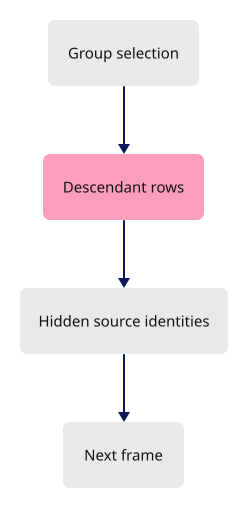

# 30 · The layers panel and the layer tree

**Estimated study time: about 20–35 hours.** Includes reading, typing, tracing, testing and experiments. [How to use this estimate](map.md#time-estimates).

**This section:** Apply layer visibility and selection through shared source identities.

**In the whole viewer:** The layer panel is a view of the same document, so its actions must agree with picking and scene drawing.

**Follow the data:** Panel action → affected source identities → row flags/state → redraw.

**Start with these files:** [`src/app/ui/layers.rs`](30-layer-tree.md#code-30-012), [`src/state/panel.rs`](30-layer-tree.md#code-30-032).

**Aim to explain:** Why should hiding a group use the same identity mapping as selection?

[Whole-viewer map and course milestones](map.md)

A layer or group can contain many objects. Hiding it should update the same source identities used by selection and drawing. This helper applies the requested visibility to a sorted row set and records which identities actually changed.



Start from the working result of [step 26](26-nested-panel.md).

**One buildable step:** type the additions below in `workspace/handwritten`, then build and test. This step adds 2,248 lines across 17 files and may take several sittings. Individual listings are parts of this step, not separate build checkpoints.

<span id="code-30-001"></span>

## `src/lib.rs`

Insert **after line 484** of your current file.

Keep these preceding lines:

```rust
    state.scene.upload_to(&mut state.gpu);
    state.scene.restore_text_visibility(&mut state.gpu); // register:scene_text
    state.update_label(); // the saved texts reach the GPU; register:scene_text
    state.fit_all();
```

Keep these following lines:

```rust
    state.touch();
    app::feedback::status("Session opened");
}
```

Type these new lines:

```rust
--8<-- "typing/code/30-001.rs"
```

<span id="code-30-002"></span>

## `src/app/command/tests.rs`

Append **after line 344** of your current file.

Blank lines before: **1**; after: **0**. End with a newline.

```rust
--8<-- "typing/code/30-002.rs"
```

<span id="code-30-003"></span>

## `src/app/command/verbs/add_edge.rs`

Create this file. Type the complete listing, including comments and blank lines.

```rust
--8<-- "typing/code/30-003.rs"
```

<span id="code-30-004"></span>

## `src/app/command/verbs/add_group.rs`

Create this file. Type the complete listing, including comments and blank lines.

```rust
--8<-- "typing/code/30-004.rs"
```

<span id="code-30-005"></span>

## `src/app/command/verbs/layers.rs`

Create this file. Type the complete listing, including comments and blank lines.

```rust
--8<-- "typing/code/30-005.rs"
```

<span id="code-30-006"></span>

## `src/app/command/verbs/mod.rs`

Insert **after line 44** of your current file.

Keep these preceding lines:

```rust
    hide,                    // register:hide
    show,                    // register:show
    fit,                     // register:fit
    escape,                  // register:escape
```

Keep these following lines:

```rust
    arrowhead,               // register:arrowhead
    snap,                    // register:snap
    object,                  // register:object
    edge,                    // register:edge
```

Type these new lines:

```rust
--8<-- "typing/code/30-006.rs"
```

<span id="code-30-007"></span>

## `src/app/command/verbs/mod.rs`

Insert **after line 86** of your current file.

Keep these preceding lines:

```rust
    measure_distance,        // register:measure_distance
    length,                  // register:length
    area,                    // register:area
    volume,                  // register:volume
```

Keep these following lines:

```rust
}
```

Type these new lines:

```rust
--8<-- "typing/code/30-007.rs"
```

<span id="code-30-008"></span>

## `src/app/feedback.rs`

Append **after line 133** of your current file.

Blank lines before: **1**; after: **0**. End with a newline.

```rust
--8<-- "typing/code/30-008.rs"
```

<span id="code-30-009"></span>

## `src/app/inspection.rs`

Insert **after line 38** of your current file.

Keep these preceding lines:

```rust
        "widget": state.gpu.widget.placement, // register:gumball
        "widget_highlight": state.gpu.widget.active, // register:gumball
        "widget_bytes": state.gpu.widget.allocated_bytes(), // register:gumball
        "selected": parent,
```

Keep these following lines:

```rust
        "hidden_count": state.scene.hidden.len(),
        "identity": identity,
        "selection": state.selection,
        "controls": state.inspected_controls(),
```

Type these new lines:

```rust
--8<-- "typing/code/30-009.rs"
```

<span id="code-30-010"></span>

## `src/app/keys.rs`

Insert **after line 73** of your current file.

Keep these preceding lines:

```rust
    named(NamedKey::Enter, |s| s.enter()), // register:enter
    named(NamedKey::F10, |s| s.enable_controls()), // register:controls
    named(NamedKey::Delete, |s| s.delete_selected()), // register:delete
    plain(&[":"], |_| crate::app::feedback::command_line(true)), // register:command-line
```

Keep these following lines:

```rust
    ctrl(&["z", "Z"], Some(true), |s| s.redo()), // register:redo-shift
    ctrl(&["z", "Z"], Some(false), |s| s.undo()), // register:undo
    ctrl(&["y", "Y"], None, |s| s.redo()), // register:redo
    // register:view-front
```

Type these new lines:

```rust
--8<-- "typing/code/30-010.rs"
```

<span id="code-30-011"></span>

## `src/app/ui/graph.rs`

Create this file. Type the complete listing, including comments and blank lines.

```rust
--8<-- "typing/code/30-011.rs"
```

<span id="code-30-012"></span>

## `src/app/ui/layers.rs`

Create this file. Type the complete listing, including comments and blank lines.

```rust
--8<-- "typing/code/30-012.rs"
```

<span id="code-30-013"></span>

## `src/app/ui/mod.rs`

Insert **after line 5** of your current file.

Keep these preceding lines:

```rust
use crate::State;
use std::cell::Cell;
use theme::{BUNDLED, fonts, visuals};
use winit::window::Window;
```

Keep these following lines:

```rust
mod overlay; // register:overlay
#[cfg(target_arch = "wasm32")] // register:phone
mod phone; // register:phone
mod pointer; // register:pointer
```

Type these new lines:

```rust
--8<-- "typing/code/30-013.rs"
```

<span id="code-30-014"></span>

## `src/app/ui/mod.rs`

Insert **after line 27** of your current file.

Keep these preceding lines:

```rust

panels! {
    number_box,   // register:number_box
    command_line, // register:command_line
```

Keep these following lines:

```rust
}

// As with Lane in 04a, every hook but `show` has a default body, so a panel writes only the hooks it uses.
/// One panel. Its state lives in its own file; these hooks are all the frame needs from it.
```

Type these new lines:

```rust
--8<-- "typing/code/30-014.rs"
```

<span id="code-30-015"></span>

## `src/app/ui/mod.rs`

Insert **after line 268** of your current file.

Keep these preceding lines:

```rust
        let Output { action, command } = out;
        changed |= action.is_some() || command.is_some();

        if let Some(key) = action {
```

Keep these following lines:

```rust
        }

        if let Some(text) = command {
            self.run_line(state, &text); // register:commands
```

Type these new lines:

```rust
--8<-- "typing/code/30-015.rs"
```

<span id="code-30-016"></span>

## `src/state.rs`

Insert **after line 19** of your current file.

Keep these preceding lines:

```rust
pub mod edit; // register:edit
mod features; // register:features
mod hydrate; // register:hydrate
pub(crate) mod number_box; // register:number_box
```

Keep these following lines:

```rust
mod sheet_query; // register:sheet_query
mod text; // register:text
mod tool; // register:tool
use features::Features;
```

Type these new lines:

```rust
--8<-- "typing/code/30-016.rs"
```

<span id="code-30-017"></span>

## `src/state.rs`

Insert **after line 122** of your current file.

Keep these preceding lines:

```rust
        self.annotate_document(first_row); // register:scene_text
        self.release_display_only(index, first_row, source); // register:release

        // the layer panel lists the new rows
```

Keep these following lines:

```rust
        self.update_label(); // register:scene_text
        log::info!(
            "appended: walk {:.0} ms, upload {:.0} ms | {} docs | memory observation {:.0} MiB",
            t1 - t0,
```

Type these new lines:

```rust
--8<-- "typing/code/30-017.rs"
```

<span id="code-30-018"></span>

## `src/state.rs`

Insert **after line 139** of your current file.

Keep these preceding lines:

```rust
    pub fn clear(&mut self) {
        self.load_camera = self.camera.pose(); // remember the view
        self.cancel_gesture(); // register:editing
        self.features.draft = None; // its rows are gone; register:commands
```

Keep these following lines:

```rust
        self.selection = SelectionMode::Object;
        self.features.sheet_query = None; // register:sheets
        self.gpu.arena.source_faces.select(&self.gpu.ctx, None);
        self.controls = Controls::default();
```

Type these new lines:

```rust
--8<-- "typing/code/30-018.rs"
```

<span id="code-30-019"></span>

## `src/state.rs`

Insert **after line 147** of your current file.

Keep these preceding lines:

```rust
        self.controls = Controls::default();
        self.features.resume.clear(); // a waiting Save or F10 belonged to the old scene; register:editing
        self.scene.clear(&mut self.gpu);
        self.place_gizmo(None); // register:editing
```

Keep these following lines:

```rust
        self.touch();
    }

    /// Fit the camera, unless the user already moved it.
```

Type these new lines:

```rust
--8<-- "typing/code/30-019.rs"
```

<span id="code-30-020"></span>

## `src/state.rs`

Insert **after line 268** of your current file.

Keep these preceding lines:

```rust
        let row = row.filter(|row| self.scene.selectable(*row));
        self.cancel_gesture(); // register:editing

        // unhighlight the old selection and the clicked layers
```

Keep these following lines:

```rust

        for old in self.highlighted.drain(..) {
            self.gpu.set_selected(old, false);
        }
```

Type these new lines:

```rust
--8<-- "typing/code/30-020.rs"
```

<span id="code-30-021"></span>

## `src/state.rs`

Insert **after line 294** of your current file.

Keep these preceding lines:

```rust
        }

        self.scene.selected = row;
        self.selection_order = row.into_iter().collect();
```

Keep these following lines:

```rust
        self.place_gizmo(row); // register:editing
        self.update_label(); // register:scene_text
        self.touch();
    }
```

Type these new lines:

```rust
--8<-- "typing/code/30-021.rs"
```

<span id="code-30-022"></span>

## `src/state.rs`

Insert **after line 343** of your current file.

Keep these preceding lines:

```rust
        if selected.len() > 1 {
            self.highlighted = selected;
        }
        self.place_gizmo(self.scene.selected); // register:editing
```

Keep these following lines:

```rust
        self.update_label(); // register:scene_text
        self.touch();
    }
```

Type these new lines:

```rust
--8<-- "typing/code/30-022.rs"
```

<span id="code-30-023"></span>

## `src/state.rs`

Insert **after line 375** of your current file.

Keep these preceding lines:

```rust
            for row in &rows {
                self.gpu.set_selected(*row, false);
            }
```

Keep these following lines:

```rust
            return;
        }

        let Some(row) = self.scene.selected else {
```

Type these new lines:

```rust
--8<-- "typing/code/30-023.rs"
```

<span id="code-30-024"></span>

## `src/state.rs`

Insert **after line 388** of your current file.

Keep these preceding lines:

```rust
        };
        self.select(None);
        self.scene.hidden.insert(guid); // by id, so a new row of it stays hidden
        self.gpu.set_hidden(row, true);
```

Keep these following lines:

```rust
        self.update_label(); // register:scene_text
        self.touch();
    }
```

Type these new lines:

```rust
--8<-- "typing/code/30-024.rs"
```

<span id="code-30-025"></span>

## `src/state.rs`

Insert **after line 400** of your current file.

Keep these preceding lines:

```rust
            self.gpu.set_hidden(row, false);
        }

        self.scene.hidden.clear();
```

Keep these following lines:

```rust
        self.update_label(); // register:scene_text
        self.touch();
    }
```

Type these new lines:

```rust
--8<-- "typing/code/30-025.rs"
```

<span id="code-30-026"></span>

## `src/state/edit.rs`

Insert **after line 242** of your current file.

Keep these preceding lines:

```rust
                self.status(&error);
                return false;
            }
```

Keep these following lines:

```rust
            self.touch();
            return true;
        }
```

Type these new lines:

```rust
--8<-- "typing/code/30-026.rs"
```

<span id="code-30-027"></span>

## `src/state/edit.rs`

Insert **after line 398** of your current file.

Keep these preceding lines:

```rust
    /// After an undo, redo or delete: sync the rows, drop the selection.
    pub(crate) fn after_history(&mut self) {
        self.cancel_running_tool(); // a tool's preview and bases belong to the documents as they were; register:tools
```

Keep these following lines:

```rust
        self.selection = SelectionMode::Object;
        self.select(None);
        self.scene.flag_texts(&mut self.gpu);
        self.commit_rows();
```

Type these new lines:

```rust
--8<-- "typing/code/30-027.rs"
```

<span id="code-30-028"></span>

## `src/state/edit.rs`

Insert **after line 442** of your current file.

Keep these preceding lines:

```rust
        if lost {
            self.select_rows(rows, false);
        }
```

Keep these following lines:

```rust
        self.update_label();
        self.touch();
    }
```

Type these new lines:

```rust
--8<-- "typing/code/30-028.rs"
```

<span id="code-30-029"></span>

## `src/state/edit.rs`

Insert **after line 801** of your current file.

Keep these preceding lines:

```rust
            SelectionMode::Object => {}
        }

        self.place_gizmo(Some(row));
```

Keep these following lines:

```rust
        self.touch();
    }
}
```

Type these new lines:

```rust
--8<-- "typing/code/30-029.rs"
```

<span id="code-30-030"></span>

## `src/state/edit.rs`

Append **after line 1008** of your current file.

Blank lines before: **1**; after: **0**. End with a newline.

```rust
--8<-- "typing/code/30-030.rs"
```

<span id="code-30-031"></span>

## `src/state/hydrate.rs`

Insert **after line 74** of your current file.

Keep these preceding lines:

```rust
        for resume in waiting {
            self.run_resume(resume);
        }
```

Keep these following lines:

```rust
        self.touch();
    }

    /// Idle work between edits: one kernel purge step, frames kept coming until the cycle ends.
```

Type these new lines:

```rust
--8<-- "typing/code/30-031.rs"
```

<span id="code-30-032"></span>

## `src/state/panel.rs`

Create this file. Type the complete listing, including comments and blank lines.

```rust
--8<-- "typing/code/30-032.rs"
```

<span id="code-30-033"></span>

## `tests/layer-workspace.cjs`

Create this file. Type the complete listing, including comments and blank lines.

```javascript
--8<-- "typing/code/30-033.cjs"
```

## Check the completed chapter

From `session_viewer`, compare everything you have typed:

```sh
npm --prefix ../session_tests run course -- reference-check 30
```

From `workspace/handwritten`:

```sh
cargo build --lib --locked -j4
cargo xtest --lib --locked -j4
```

Run the native layer tests. Hide a group, confirm its descendants disappear, then show it and check selection behavior.

If the panel and canvas disagree, trace the identity set through the display update. Changing only the panel checkbox leaves the rendered state untouched.


**Before moving on:** explain what changed, check the expected result above, and fix any build or test failure.

<details>
<summary>Check your explanation of the opening question</summary>

Both actions refer to the same source objects even when each object has several display rows. Separate identity schemes could hide one object and select another.

</details>

[Next step: 31](31-splitting.md)
