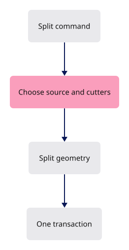

# 31 · Split curves and faces

**Estimated study time: about 20–40 hours.** Includes reading, typing, tracing, testing and experiments. [How to use this estimate](map.md#time-estimates).

**This section:** Connect splitting tools, cutters and the resulting geometry edits.

**In the whole viewer:** This is a modeling operation: interactive intent reaches the kernel and returns as a source transaction and display update.

**Follow the data:** Targets and cutters → split operation → replacement geometry → transaction and redraw.

**Start with these files:** [`src/app/splitting.rs`](31-splitting.md#code-31-007), [`src/state/splitting.rs`](31-splitting.md#code-31-021).

**Aim to explain:** How would you distinguish a wrong split from a correct split that is displayed incorrectly?

[Whole-viewer map and course milestones](map.md)

Splitting is a multi-step interaction: choose the thing to split, choose cutters, then apply the result. The command’s job is to start that interaction. The geometry algorithms and preview state stay in their own modules, which keeps the verb easy to understand.



Start from the working result of [step 30](30-layer-tree.md).

**One buildable step:** type the additions below in `workspace/handwritten`, then build and test. This step adds 1,675 lines across 16 files and may take several sittings. Individual listings are parts of this step, not separate build checkpoints.

<span id="code-31-001"></span>

## `src/app/command/verbs/mod.rs`

Insert **after line 35** of your current file.

Keep these preceding lines:

```rust
    rotate,                  // register:rotate
    scale,                   // register:scale
    copy,                    // register:copy
    orient_3_points,         // register:orient_3_points
```

Keep these following lines:

```rust
    save,                    // register:save
    open,                    // register:open
    delete,                  // register:delete
    undo,                    // register:undo
```

Type these new lines:

```rust
--8<-- "typing/code/31-001.rs"
```

<span id="code-31-002"></span>

## `src/app/command/verbs/split.rs`

Create this file. Type the complete listing, including comments and blank lines.

```rust
--8<-- "typing/code/31-002.rs"
```

<span id="code-31-003"></span>

## `src/app/inspection.rs`

Insert **after line 95** of your current file.

Keep these preceding lines:

```rust
    snapshot["ssao"] = serde_json::json!(state.gpu.view.ssao);
    snapshot["locked_count"] = serde_json::json!(state.scene.locked.len());
    snapshot["color_count"] = serde_json::json!(state.scene.colors.len());
    snapshot["edge_color_count"] = serde_json::json!(state.scene.edge_colors.len());
```

Keep these following lines:

```rust
    snapshot["current_layer"] = serde_json::json!(state.scene.current_layer()); // register:editing
    snapshot["source_faces"] =
        serde_json::json!(parent.and_then(|row| match state.scene.geometry(row)? {
            session_rust::Geometry::BRep(brep) => Some(brep.face_count()),
```

Type these new lines:

```rust
--8<-- "typing/code/31-003.rs"
```

<span id="code-31-004"></span>

## `src/app/mod.rs`

Insert **after line 42** of your current file.

Keep these preceding lines:

```rust
pub mod selection; // register:selection
pub mod session_io; // register:session_io
pub mod sheet_query; // register:sheet_query
pub mod snap; // register:snap
```

Keep these following lines:

```rust
pub mod stream; // register:stream
pub mod surface_preview; // register:surface_preview
pub mod touch; // register:touch
#[cfg(any(target_arch = "wasm32", test))] // register:ui
```

Type these new lines:

```rust
--8<-- "typing/code/31-004.rs"
```

<span id="code-31-005"></span>

## `src/app/scene_sync.rs`

Append **after line 610** of your current file.

Blank lines before: **1**; after: **0**. End with a newline.

```rust
--8<-- "typing/code/31-005.rs"
```

<span id="code-31-006"></span>

## `src/app/scene_sync/split_tests.rs`

Create this file. Type the complete listing, including comments and blank lines.

```rust
--8<-- "typing/code/31-006.rs"
```

<span id="code-31-007"></span>

## `src/app/splitting.rs`

Splitting computes pieces and updates their ownership in the document. It must preserve the intended placement and metadata while replacing the original geometry coherently. Undo needs enough information to restore the original.

Create this file. Type the complete listing, including comments and blank lines.

```rust
--8<-- "typing/code/31-007.rs"
```

<span id="code-31-008"></span>

## `src/state.rs`

Insert **after line 21** of your current file.

Keep these preceding lines:

```rust
mod hydrate; // register:hydrate
pub(crate) mod number_box; // register:number_box
mod panel; // register:panel
mod sheet_query; // register:sheet_query
```

Keep these following lines:

```rust
mod text; // register:text
mod tool; // register:tool
use features::Features;
use std::sync::Arc;
```

Type these new lines:

```rust
--8<-- "typing/code/31-008.rs"
```

<span id="code-31-009"></span>

## `src/state.rs`

Insert **after line 138** of your current file.

Keep these preceding lines:

```rust

    /// Remove every document; camera and GPU stay.
    pub fn clear(&mut self) {
        self.load_camera = self.camera.pose(); // remember the view
```

Keep these following lines:

```rust
        self.cancel_gesture(); // register:editing
        self.features.draft = None; // its rows are gone; register:commands
        self.features.hierarchy = Default::default(); // register:panel
        self.selection = SelectionMode::Object;
```

Type these new lines:

```rust
--8<-- "typing/code/31-009.rs"
```

<span id="code-31-010"></span>

## `src/state.rs`

Insert **after line 266** of your current file.

Keep these preceding lines:

```rust
    }

    /// Select one row, or nothing.
    pub fn select(&mut self, row: Option<u32>) {
```

Keep these following lines:

```rust
        let row = row.filter(|row| self.scene.selectable(*row));
        self.cancel_gesture(); // register:editing

        // unhighlight the old selection and the clicked layers
```

Type these new lines:

```rust
--8<-- "typing/code/31-010.rs"
```

<span id="code-31-011"></span>

## `src/state.rs`

Insert **after line 639** of your current file.

Keep these preceding lines:

```rust
    /// Ask what is under a pixel: an object, an edge (Ctrl) or a face (Ctrl+Shift).
    pub fn request_selection(&mut self, x: u32, y: u32, edge: bool, face: bool) {
        // a split or a tool wants a plain object
        let mut splitting = false;
```

Keep these following lines:

```rust
        splitting |= self.tool_picks(); // register:tools
        let face = !splitting
            && (face || self.selection_tool == crate::app::selection::SelectionTool::Face);
        let edge = !splitting
```

Type these new lines:

```rust
--8<-- "typing/code/31-011.rs"
```

<span id="code-31-012"></span>

## `src/state/drag.rs`

Insert **after line 89** of your current file.

Keep these preceding lines:

```rust
    pub(crate) fn start_object_drag(&mut self, down: (f64, f64), at: (f64, f64)) -> bool {
        // F10 control points keep the left button
        if matches!(self.selection, SelectionMode::Controls { .. })
            || self.drafting() // register:commands
```

Keep these following lines:

```rust
            || self.selection_tool != SelectionTool::Object
        {
            return false;
        }
```

Type these new lines:

```rust
--8<-- "typing/code/31-012.rs"
```

<span id="code-31-013"></span>

## `src/state/drawing.rs`

Insert **after line 86** of your current file.

Keep these preceding lines:

```rust
            let start = count + usize::from(construction.is_some()); // where the points begin

            if construction.is_some() || words.len() - count < *draw.points.start() {
                self.cancel_drawing();
```

Keep these following lines:

```rust
                let needed = match &construction {
                    _ if !draw.open() => *draw.points.start(),
                    Some(kind) if kind != "points" => 2,
                    _ => 0,
```

Type these new lines:

```rust
--8<-- "typing/code/31-013.rs"
```

<span id="code-31-014"></span>

## `src/state/drawing.rs`

Insert **after line 158** of your current file.

Keep these preceding lines:

```rust
        prefix: &str,
        prompts: &'static [&'static str],
    ) -> String {
        self.cancel_drawing();
```

Keep these following lines:

```rust
        // points land on the plane the camera faces most
        let mut draft = Draft::new(verb, prefix, self.facing());
        draft.needed = prompts.len();
        draft.prompts = prompts;
```

Type these new lines:

```rust
--8<-- "typing/code/31-014.rs"
```

<span id="code-31-015"></span>

## `src/state/edit.rs`

Insert **after line 436** of your current file.

Keep these preceding lines:

```rust
            .selected_rows()
            .into_iter()
            .filter(|row| !gone(row))
            .collect();
```

Keep these following lines:

```rust

        // the survivors stay selected; a freed id keeps no controls
        if lost {
            self.select_rows(rows, false);
```

Type these new lines:

```rust
--8<-- "typing/code/31-015.rs"
```

<span id="code-31-016"></span>

## `src/state/edit.rs`

Insert **after line 885** of your current file.

Keep these preceding lines:

```rust
            self.cancel_drawing();
        }

        if !action.keeps_split() {
```

Keep these following lines:

```rust
        }

        // Rhino-like: pick the objects first, Enter runs the command
        if action.needs_selection() && self.scene.selected.is_none() {
```

Type these new lines:

```rust
--8<-- "typing/code/31-016.rs"
```

<span id="code-31-017"></span>

## `src/state/features.rs`

Insert **after line 5** of your current file.

Keep these preceding lines:

```rust
use super::drag; // register:object_drag
use super::drawing; // register:drawing
use super::edit; // register:gizmo_drag
use super::hydrate; // register:hydrate
```

Keep these following lines:

```rust
use crate::app::command::verbs::measure::Mark; // register:measure
use crate::app::gizmo::Gizmo; // register:gizmo
use crate::app::hierarchy::Hierarchy; // register:hierarchy
use crate::app::snap::Snapping; // register:snap
```

Type these new lines:

```rust
--8<-- "typing/code/31-017.rs"
```

<span id="code-31-018"></span>

## `src/state/features.rs`

Insert **after line 30** of your current file.

Keep these preceding lines:

```rust
    pub(crate) draft: Option<drawing::Draft>, // register:drawing
    pub(crate) snap: Snapping,        // register:snap
    pub(crate) mark: Option<Mark>,    // register:measure
    pub(super) hierarchy: Hierarchy,  // register:hierarchy
```

Keep these following lines:

```rust
}

// Each list starts empty; a later lesson adds one line per hook.
// `fn(&mut State)` is a function pointer; a method such as `State::purge_idle` is one, with `self` as its first argument.
```

Type these new lines:

```rust
--8<-- "typing/code/31-018.rs"
```

<span id="code-31-019"></span>

## `src/state/features.rs`

Insert **after line 51** of your current file.

Keep these preceding lines:

```rust
/// Features that take a pick answer before the selection does, in this order.
pub(super) const TAKE_PICK: &[fn(&mut State, Option<crate::engine::gpu::Pick>) -> bool] = &[
    State::take_drag_pick,  // register:editing
    State::take_tool_pick,  // register:tools
```

Keep these following lines:

```rust
    #[cfg(target_arch = "wasm32")] // register:cloud_query
    State::take_cloud_pick, // register:cloud_query
];
```

Type these new lines:

```rust
--8<-- "typing/code/31-019.rs"
```

<span id="code-31-020"></span>

## `src/state/panel.rs`

Insert **after line 143** of your current file.

Keep these preceding lines:

```rust
                    }

                    // a later feature may take the click first, one `taken |=` line each; Split does in lesson 31
                    let mut taken = false;
```

Keep these following lines:

```rust

                    if taken {
                        return;
                    }
```

Type these new lines:

```rust
--8<-- "typing/code/31-020.rs"
```

<span id="code-31-021"></span>

## `src/state/splitting.rs`

Create this file. Type the complete listing, including comments and blank lines.

```rust
--8<-- "typing/code/31-021.rs"
```

<span id="code-31-022"></span>

## `src/state/tool.rs`

Insert **after line 21** of your current file.

Keep these preceding lines:

```rust
            return Err("This selection cannot be edited".into());
        }

        self.cancel_drawing();
```

Keep these following lines:

```rust
        let mut draft = Draft::new(tool.name(), tool.name(), self.facing());

        // whole objects follow the cursor; a face, edge or control point commits without a preview
        if crate::app::deform::Target::selected(&self.selection).is_none() {
```

Type these new lines:

```rust
--8<-- "typing/code/31-022.rs"
```

<span id="code-31-023"></span>

## `src/state/tool.rs`

Insert **after line 42** of your current file.

Keep these preceding lines:

```rust

    /// Run `tool` with no selection needed: it picks objects or clicks the screen itself.
    pub(crate) fn open_tool(&mut self, tool: Box<dyn Tool>) -> Result<String, String> {
        self.cancel_drawing();
```

Keep these following lines:

```rust
        let mut draft = Draft::new(tool.name(), tool.name(), self.facing());
        draft.tool = Some(tool);
        self.features.draft = Some(draft);
        self.gpu.pick.cancel();
```

Type these new lines:

```rust
--8<-- "typing/code/31-023.rs"
```

<span id="code-31-024"></span>

## `src/state/tool.rs`

Insert **after line 175** of your current file.

Keep these preceding lines:

```rust

    /// Nothing is selected for `line`: clicks pick objects until Enter runs it.
    pub(crate) fn ask_for_objects(&mut self, line: &str) -> Result<String, String> {
        self.cancel_drawing();
```

Keep these following lines:

```rust
        let mut draft = Draft::new("select", "select", self.facing());
        draft.then = Some(line.to_owned());
        self.features.draft = Some(draft);
        self.place_gizmo(None);
```

Type these new lines:

```rust
--8<-- "typing/code/31-024.rs"
```

<span id="code-31-025"></span>

## `src/state/tool.rs`

Insert **after line 462** of your current file.

Keep these preceding lines:

```rust
        if self.features.draft.is_some() {
            let result = self.run_command("");
            crate::app::feedback::status(&result.unwrap_or_else(|e| e));
        } else {
```

Keep these following lines:

```rust
        }
    }

    /// A tool asked for this object: it takes the pick.
```

Type these new lines:

```rust
--8<-- "typing/code/31-025.rs"
```

<span id="code-31-026"></span>

## `tests/splitting.cjs`

Create this file. Type the complete listing, including comments and blank lines.

```javascript
--8<-- "typing/code/31-026.cjs"
```

## Check the completed chapter

From `session_viewer`, compare everything you have typed:

```sh
npm --prefix ../session_tests run course -- reference-check 31
```

From `workspace/handwritten`:

```sh
cargo build --lib --locked -j4
cargo xtest --lib --locked -j4
```

Run the native splitting tests. Split a simple curve, then undo and confirm that the original source returns.

If a cutter selection unexpectedly cancels the tool, inspect the conversation-preservation hook. If intersections are wrong, inspect the splitting module instead of the command parser.

**Before moving on:** explain what changed, check the expected result above, and fix any build or test failure.

<details>
<summary>Check your explanation of the opening question</summary>

Inspect the committed source result first. If it is correct, follow synchronization and display generation; if it is wrong, inspect inputs and the geometry operation.

</details>

[Next step: 32](32-colors-lighting.md)
