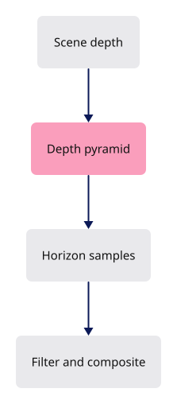

# 32 · Ambient occlusion

**Estimated study time: about 35–65 hours.** Includes reading, typing, tracing, testing and experiments. [How to use this estimate](map.md#time-estimates).

**This section:** Estimate ambient occlusion using depth data and a depth pyramid.

**In the whole viewer:** This is a screen-space shading pass that reads existing frame information and changes the light response, not the source model.

**Follow the data:** Depth image → coarser depth levels → neighbourhood samples → occlusion → shaded frame.

**Start with these files:** [`src/engine/gpu/ssao.rs`](32-colors-lighting.md#code-32-018), [`src/shaders/ambient_depth.wgsl`](32-colors-lighting.md#code-32-026).

**Aim to explain:** Why can a camera change require new occlusion work even if no geometry was edited?

[Whole-viewer map and course milestones](map.md)

Ambient occlusion estimates how nearby geometry blocks light from the surroundings. Long searches are expensive at full resolution. A depth pyramid summarizes small groups of pixels into successively smaller images, letting distant samples inspect a coarser level.



Start from the working result of [step 31](31-splitting.md).

**One buildable step:** type the additions below in `workspace/handwritten`, then build and test. This step adds 2,901 lines across 16 files and may take several sittings. Individual listings are parts of this step, not separate build checkpoints.

<span id="code-32-001"></span>

## `src/engine/gpu/ambient_warm.rs`

Some GPU setup is expensive the first time it runs. Preparing resources ahead of use avoids putting all that work on an interactive frame. The warm-up path must still use the same formats and contracts as the real pass.

Create this file. Type the complete listing, including comments and blank lines.

```rust
--8<-- "typing/code/32-001.rs"
```

<span id="code-32-002"></span>

## `src/engine/gpu/clip.rs`

Insert **after line 747** of your current file.

Keep these preceding lines:

```rust

        if count > 0 {
            let b = g.frame.binds(&g.objects.group);
            draws += self.encode_count(encoder, &g.arena, &b, planes[count - 1]);
```

Keep these following lines:

```rust
        }

        draws
    }
```

Type these new lines:

```rust
--8<-- "typing/code/32-002.rs"
```

<span id="code-32-003"></span>

## `src/engine/gpu/mod.rs`

Insert **after line 26** of your current file.

Keep these preceding lines:

```rust
pub mod present; // register:present
pub mod render; // register:render
pub mod segments; // register:segments
pub mod splat; // register:splat
```

Keep these following lines:

```rust
pub mod surface_outline; // register:surface_outline
pub mod targets; // register:targets
pub mod text; // register:text
pub mod text_outline; // register:text_outline
```

Type these new lines:

```rust
--8<-- "typing/code/32-003.rs"
```

<span id="code-32-004"></span>

## `src/engine/gpu/mod.rs`

Insert **after line 31** of your current file.

Keep these preceding lines:

```rust
pub mod surface_outline; // register:surface_outline
pub mod targets; // register:targets
pub mod text; // register:text
pub mod text_outline; // register:text_outline
```

Keep these following lines:

```rust
mod triangle_tiles; // register:triangle_tiles
pub mod ui; // register:ui
pub mod upload; // register:upload
pub mod vectors; // register:vectors
```

Type these new lines:

```rust
--8<-- "typing/code/32-004.rs"
```

<span id="code-32-005"></span>

## `src/engine/gpu/mod.rs`

Insert **after line 99** of your current file.

Keep these preceding lines:

```rust
    dead_points: u32,    // cloud points retired and not yet reclaimed; register:clouds
    pub splat: Splat,    // point cloud drawing; register:clouds
    pub pick: Picker,    // reads object ids under the cursor; register:shell
    pub performance: Performance, // frame timing
```

Keep these following lines:

```rust
    pub bounds: AABB,                     // world box of everything uploaded
    device_type: wgpu::DeviceType,        // discrete, integrated or CPU
    pub failure: std::sync::Arc<std::sync::Mutex<Option<String>>>, // first GPU error
}
```

Type these new lines:

```rust
--8<-- "typing/code/32-005.rs"
```

<span id="code-32-006"></span>

## `src/engine/gpu/mod.rs`

Insert **after line 255** of your current file.

Keep these preceding lines:

```rust
            dead_points: 0,                 // register:clouds
            splat,                          // register:clouds
            pick: Picker::new(),            // register:shell
            performance: Performance::new(),
```

Keep these following lines:

```rust
            bounds: AABB::empty(),
            device_type,
            failure,
        };
```

Type these new lines:

```rust
--8<-- "typing/code/32-006.rs"
```

<span id="code-32-007"></span>

## `src/engine/gpu/pass.rs`

Insert **after line 106** of your current file.

Keep these preceding lines:

```rust
/// The passes in frame order. Adding one means its `Pass` impl in one file and one line here.
pub const PASSES: &[fn(&GpuCtx, Target) -> Box<dyn Pass>] = &[
    super::instanced::pass,       // register:instanced
    super::clip::pass,            // register:clip
```

Keep these following lines:

```rust
    super::surface_outline::pass, // register:outline
];

// `pub(super)` = visible to the parent module, `gpu`, and no further.
```

Type these new lines:

```rust
--8<-- "typing/code/32-007.rs"
```

<span id="code-32-008"></span>

## `src/engine/gpu/present.rs`

Insert **after line 136** of your current file.

Keep these preceding lines:

```rust
                depth_or_array_layers: 1,
            },
        );
```

Keep these following lines:

```rust
        self.ctx.queue.submit([encoder.finish()]);
        self.pick.map(); // register:shell
        self.arena.tiles.map_report(); // register:tiles
        log::info!("headless frame: {draws} draws, {objects} objects, {w}x{h}");
```

Type these new lines:

```rust
--8<-- "typing/code/32-008.rs"
```

<span id="code-32-009"></span>

## `src/engine/gpu/present.rs`

Insert **after line 161** of your current file.

Keep these preceding lines:

```rust

        drop(data);
        readback.unmap();
```

Keep these following lines:

```rust
        out
    }
}
```

Type these new lines:

```rust
--8<-- "typing/code/32-009.rs"
```

<span id="code-32-010"></span>

## `src/engine/gpu/present.rs`

Append **after line 245** of your current file.

Blank lines before: **1**; after: **0**. End with a newline.

```rust
--8<-- "typing/code/32-010.rs"
```

<span id="code-32-011"></span>

## `src/engine/gpu/render.rs`

Insert **after line 13** of your current file.

Keep these preceding lines:

```rust
        encoder: &mut wgpu::CommandEncoder,
        view: &wgpu::TextureView,
        clear: wgpu::Color,
    ) -> (u32, u32) {
```

Keep these following lines:

```rust
        self.each_pass(|pass, g| pass.prepare(g, encoder));

        let tier = if self.view.ssao {
            0
```

Type these new lines:

```rust
--8<-- "typing/code/32-011.rs"
```

<span id="code-32-012"></span>

## `src/engine/gpu/render.rs`

Insert **after line 22** of your current file.

Keep these preceding lines:

```rust
        } else {
            self.performance.drag_tier()
        };
        let rough = self.tile_passes(encoder, tier); // register:tiles
```

Keep these following lines:

```rust
        self.point_pass(encoder); // register:clouds

        let frame = Frame {
            view,
```

Type these new lines:

```rust
--8<-- "typing/code/32-012.rs"
```

<span id="code-32-013"></span>

## `src/engine/gpu/render.rs`

Insert **after line 24** of your current file.

Keep these preceding lines:

```rust
        };
        let rough = self.tile_passes(encoder, tier); // register:tiles
        self.mark(encoder, "tiles"); // register:gtao
        self.point_pass(encoder); // register:clouds
```

Keep these following lines:

```rust

        let frame = Frame {
            view,
            clear,
```

Type these new lines:

```rust
--8<-- "typing/code/32-013.rs"
```

<span id="code-32-014"></span>

## `src/engine/gpu/render.rs`

Insert **after line 34** of your current file.

Keep these preceding lines:

```rust
            rough, // register:tiles
        };
        // pass 1: background, section caps, faces and clouds write depth
        let mut draws = self.face_passes(encoder, &frame);
```

Keep these following lines:

```rust
        // pass 2: ambient occlusion and the outline masks, each pass in turn
        self.each_pass(|pass, g| draws += pass.after_faces(g, encoder, &frame));
        draws += self.ink_pass(encoder, view); // pass 3: lines, markers, outlines and text; register:ink
        self.pending_pick(encoder); // a click waiting: draw the id pass now; register:shell
```

Type these new lines:

```rust
--8<-- "typing/code/32-014.rs"
```

<span id="code-32-015"></span>

## `src/engine/gpu/render.rs`

Insert **after line 38** of your current file.

Keep these preceding lines:

```rust
        self.mark(encoder, "faces"); // register:gtao
        // pass 2: ambient occlusion and the outline masks, each pass in turn
        self.each_pass(|pass, g| draws += pass.after_faces(g, encoder, &frame));
        draws += self.ink_pass(encoder, view); // pass 3: lines, markers, outlines and text; register:ink
```

Keep these following lines:

```rust
        self.pending_pick(encoder); // a click waiting: draw the id pass now; register:shell
        draws += self.widget.draw(encoder, view, &self.targets); // gumball on top, own depth; register:gumball
        self.draw_panels(encoder, view); // register:egui
        (draws, self.objects.len())
```

Type these new lines:

```rust
--8<-- "typing/code/32-015.rs"
```

<span id="code-32-016"></span>

## `src/engine/gpu/render.rs`

Insert **after line 42** of your current file.

Keep these preceding lines:

```rust
        self.mark(encoder, "ink"); // register:gtao
        self.pending_pick(encoder); // a click waiting: draw the id pass now; register:shell
        draws += self.widget.draw(encoder, view, &self.targets); // gumball on top, own depth; register:gumball
        self.draw_panels(encoder, view); // register:egui
```

Keep these following lines:

```rust
        (draws, self.objects.len())
    }

    /// The first pass: each pass's own face passes, then the one the faces draw in.
```

Type these new lines:

```rust
--8<-- "typing/code/32-016.rs"
```

<span id="code-32-017"></span>

## `src/engine/gpu/render.rs`

Append **after line 474** of your current file.

Blank lines before: **1**; after: **0**. End with a newline.

```rust
--8<-- "typing/code/32-017.rs"
```

<span id="code-32-018"></span>

## `src/engine/gpu/ssao.rs`

Screen-space ambient occlusion uses visible depth and normals to estimate how much nearby geometry blocks ambient light. It cannot see hidden geometry outside the image. Reprojection and filtering reduce noise, but must reject stale information after motion.

Create this file. Type the complete listing, including comments and blank lines.

```rust
--8<-- "typing/code/32-018.rs"
```

<span id="code-32-019"></span>

## `src/engine/gpu/ssao/pipelines.rs`

Create this file. Type the complete listing, including comments and blank lines.

Blank lines before: **0**; after: **1**. End with a newline.

```rust
--8<-- "typing/code/32-019.rs"
```

<span id="code-32-020"></span>

## `src/engine/gpu/ssao/tests.rs`

Create this file. Type the complete listing, including comments and blank lines.

```rust
--8<-- "typing/code/32-020.rs"
```

<span id="code-32-021"></span>

## `src/engine/gpu/surface_outline.rs`

Insert **after line 1001** of your current file.

Keep these preceding lines:

```rust
                if edges {
                    draws += g.segments.draw_selection_mask(&mut pass, &ink);
                }
            }
```

Keep these following lines:

```rust

            if solid {
                self.solid.encode_pool(encoder);
                self.solid.mark_valid(key);
```

Type these new lines:

```rust
--8<-- "typing/code/32-021.rs"
```

<span id="code-32-022"></span>

## `src/engine/gpu/surface_outline.rs`

Insert **after line 1013** of your current file.

Keep these preceding lines:

```rust
                self.selection.encode_pool(encoder);
                self.selection.mark_valid(key);
            }
```

Keep these following lines:

```rust
        }

        self.solid.encode_alpha(&self.selection, encoder, stale);
        draws
```

Type these new lines:

```rust
--8<-- "typing/code/32-022.rs"
```

<span id="code-32-023"></span>

## `src/engine/gpu/surface_outline.rs`

Insert **after line 1017** of your current file.

Keep these preceding lines:

```rust
            g.mark(encoder, "pool"); // register:gtao
        }

        self.solid.encode_alpha(&self.selection, encoder, stale);
```

Keep these following lines:

```rust
        draws
    }

    fn over_ink(&self, _g: &Gpu, pass: &mut wgpu::RenderPass<'_>, _b: &Binds) -> u32 {
```

Type these new lines:

```rust
--8<-- "typing/code/32-023.rs"
```

<span id="code-32-024"></span>

## `src/engine/gpu/timing.rs`

CPU submission time does not tell us how long the GPU spent drawing. Timestamp queries measure positions in the GPU command stream. Reading them back adds its own bookkeeping and may require an optional device feature.

Create this file. Type the complete listing, including comments and blank lines.

```rust
--8<-- "typing/code/32-024.rs"
```

<span id="code-32-025"></span>

## `src/shaders/ambient_composite.wgsl`

Create this file. Type the complete listing, including comments and blank lines.

```wgsl
--8<-- "typing/code/32-025.wgsl"
```

<span id="code-32-026"></span>

## `src/shaders/ambient_depth.wgsl`

Create this file. Type the complete listing, including comments and blank lines.

```wgsl
--8<-- "typing/code/32-026.wgsl"
```

<span id="code-32-027"></span>

## `src/shaders/ambient_geometry.wgsl`

Create this file. Type the complete listing, including comments and blank lines.

```wgsl
--8<-- "typing/code/32-027.wgsl"
```

<span id="code-32-028"></span>

## `src/shaders/ssao.wgsl`

Create this file. Type the complete listing, including comments and blank lines.

```wgsl
--8<-- "typing/code/32-028.wgsl"
```

<span id="code-32-029"></span>

## `tests/ambient-lighting.cjs`

Create this file. Type the complete listing, including comments and blank lines.

```javascript
--8<-- "typing/code/32-029.cjs"
```

## Check the completed chapter

From `session_viewer`, compare everything you have typed:

```sh
npm --prefix ../session_tests run course -- reference-check 32
```

From `workspace/handwritten`:

```sh
cargo build --lib --locked -j4
cargo xtest --lib --locked -j4
```

Run the native ambient-lighting tests. Locate the reduction pass and trace one pixel block into its next pyramid level.

If dark halos appear around silhouettes, inspect background handling and the reduction rule before increasing the shadow radius.

**Before moving on:** explain what changed, check the expected result above, and fix any build or test failure.

<details>
<summary>Check your explanation of the opening question</summary>

The pass uses screen-space depths and neighbours. Changing the view changes those inputs even when the underlying source geometry stays the same.

</details>

[Next step: 33](33-contact-shadows.md)
