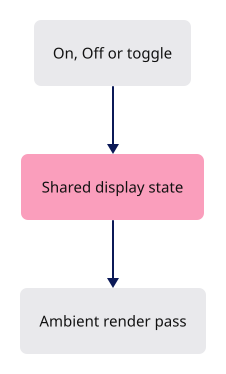

# 33 · GTAO, Arctic and Outline

**Estimated study time: about 3–7 hours.** Includes reading, typing, tracing, testing and experiments. [How to use this estimate](map.md#time-estimates).

**This section:** Connect Arctic, outline and contact-shading controls to render state.

**In the whole viewer:** These commands expose presentation choices built by earlier passes while preserving the camera and document.

**Follow the data:** Display command → view state → enabled passes and uniforms → new appearance.

**Start with these files:** [`src/app/command/verbs/arctic.rs`](33-contact-shadows.md#code-33-001), [`src/app/command/verbs/outline.rs`](33-contact-shadows.md#code-33-004).

**Aim to explain:** Which data should remain unchanged when you switch a lighting style?

[Whole-viewer map and course milestones](map.md)

A lighting switch should change presentation without moving the camera or changing the objects. Arctic connects the command system to the existing ambient-lighting state. The heavy shader work stays in the render passes you examined in the previous lesson.



Start from the working result of [step 32](32-colors-lighting.md).

**One buildable step:** type the additions below in `workspace/handwritten`, then build and test. This step adds 258 lines across 8 files and may take several sittings. Individual listings are parts of this step, not separate build checkpoints.

<span id="code-33-001"></span>

## `src/app/command/verbs/arctic.rs`

Create this file. Type the complete listing, including comments and blank lines.

```rust
--8<-- "typing/code/33-001.rs"
```

<span id="code-33-002"></span>

## `src/app/command/verbs/measure_distance.rs`

Insert **after line 182** of your current file.

Keep these preceding lines:

```rust
        assert_eq!(accept("mea"), ("Measure Distance".into(), true));
        assert_eq!(accept("len"), ("Length".into(), true));
        assert_eq!(accept("are"), ("Area".into(), true));
        assert_eq!(accept("vol"), ("Volume".into(), true));
```

Keep these following lines:

```rust
        assert_eq!(accept("Lin"), ("Line".into(), true));
        assert_eq!(
            crate::app::command::completions("m")[..2],
            ["Move", "Measure Distance"]
```

Type these new lines:

```rust
--8<-- "typing/code/33-002.rs"
```

<span id="code-33-003"></span>

## `src/app/command/verbs/mod.rs`

Insert **after line 48** of your current file.

Keep these preceding lines:

```rust
    escape,                  // register:escape
    layers,                  // register:layers
    arrowhead,               // register:arrowhead
    snap,                    // register:snap
```

Keep these following lines:

```rust
    object,                  // register:object
    edge,                    // register:edge
    face,                    // register:face
    controls,                // register:controls
```

Type these new lines:

```rust
--8<-- "typing/code/33-003.rs"
```

<span id="code-33-004"></span>

## `src/app/command/verbs/outline.rs`

Create this file. Type the complete listing, including comments and blank lines.

```rust
--8<-- "typing/code/33-004.rs"
```

<span id="code-33-005"></span>

## `tests/ambient-details.cjs`

Create this file. Type the complete listing, including comments and blank lines.

```javascript
--8<-- "typing/code/33-005.cjs"
```

<span id="code-33-006"></span>

## `tests/ambient-floor.cjs`

Create this file. Type the complete listing, including comments and blank lines.

```javascript
--8<-- "typing/code/33-006.cjs"
```

<span id="code-33-007"></span>

## `tests/ambient-motion.cjs`

Create this file. Type the complete listing, including comments and blank lines.

```javascript
--8<-- "typing/code/33-007.cjs"
```

<span id="code-33-008"></span>

## `tests/ambient-scenes.cjs`

Create this file. Type the complete listing, including comments and blank lines.

```javascript
--8<-- "typing/code/33-008.cjs"
```

## Check the completed chapter

From `session_viewer`, compare everything you have typed:

```sh
npm --prefix ../session_tests run course -- reference-check 33
```

From `workspace/handwritten`:

```sh
cargo build --lib --locked -j4
cargo xtest --lib --locked -j4
```

Run the native ambient-lighting tests. Toggle Arctic on and off in the browser and confirm the same camera and selection remain.

If toggling lighting moves the view, inspect whether the command is incorrectly refitting or reloading the scene.


**Before moving on:** explain what changed, check the expected result above, and fix any build or test failure.

<details>
<summary>Check your explanation of the opening question</summary>

Source geometry, source identity and camera placement should remain unchanged. Presentation settings determine the different rendered appearance.

</details>

[Next step: 35](35-attributes.md)
