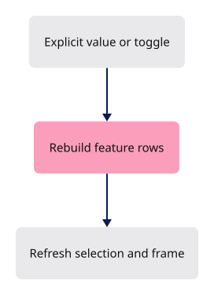

# 35 · Element features

**Estimated study time: about 3–6 hours.** Includes reading, typing, tracing, testing and experiments. [How to use this estimate](map.md#time-estimates).

**This section:** Show or hide element features through the shared display state.

**In the whole viewer:** This is a display-generation choice for existing source elements, connected to the command system and selection handling.

**Follow the data:** Element Features command → state update → rebuilt display rows → redraw.

**Start with these files:** [`src/app/command/verbs/attributes.rs`](35-attributes.md#code-35-002), [`src/state.rs`](35-attributes.md#code-35-005).

**Aim to explain:** Why can rebuilding feature rows require clearing selection or controls?

[Whole-viewer map and course milestones](map.md)

Elements can carry visible features such as outlines, contacts and joints. The code uses the field name `attributes` for this display option. The `Element Features` command calls one state method to show or hide them. That method rebuilds display rows from the same source objects and clears the selection, so controls do not keep pointing at old rows.



Start from the working result of [step 33](33-contact-shadows.md).

**One buildable step:** type the additions below in `workspace/handwritten`, then build and test. This step adds 189 lines across 5 files and may take several sittings. Individual listings are parts of this step, not separate build checkpoints.

<span id="code-35-001"></span>

## `src/app/command/tests.rs`

Append **after line 360** of your current file.

Blank lines before: **1**; after: **0**. End with a newline.

```rust
--8<-- "typing/code/35-001.rs"
```

<span id="code-35-002"></span>

## `src/app/command/verbs/attributes.rs`

Create this file. Type the complete listing, including comments and blank lines.

```rust
--8<-- "typing/code/35-002.rs"
```

<span id="code-35-003"></span>

## `src/app/command/verbs/mod.rs`

Insert **after line 47** of your current file.

Keep these preceding lines:

```rust
    fit,                     // register:fit
    escape,                  // register:escape
    layers,                  // register:layers
    arrowhead,               // register:arrowhead
```

Keep these following lines:

```rust
    snap,                    // register:snap
    arctic,                  // register:arctic
    outline,                 // register:outline
    object,                  // register:object
```

Type these new lines:

```rust
--8<-- "typing/code/35-003.rs"
```

<span id="code-35-004"></span>

## `src/app/ui/command_line/tests.rs`

Append **after line 74** of your current file.

Blank lines before: **1**; after: **0**. End with a newline.

```rust
--8<-- "typing/code/35-004.rs"
```

<span id="code-35-005"></span>

## `src/state.rs`

Append **after line 1016** of your current file.

Blank lines before: **1**; after: **0**. End with a newline.

```rust
--8<-- "typing/code/35-005.rs"
```

## Check the completed chapter

From `session_viewer`, compare everything you have typed:

```sh
npm --prefix ../session_tests run course -- reference-check 35
```

From `workspace/handwritten`:

```sh
cargo build --lib --locked -j4
cargo xtest --lib --locked -j4
```

Run the native element-feature tests. Enter `Element Features On`, repeat it, then enter `Element Features Off`. Ordinary boxes have no element features, so the test fixture you constructed is the useful example here. Source geometry stays intact; the display rows are rebuilt and selection is cleared.

If two controls disagree about visibility, check whether both call this method or maintain separate flags.

**Before moving on:** explain what changed, check the expected result above, and fix any build or test failure.

<details>
<summary>Check your explanation of the opening question</summary>

Those controls may refer to old display rows. They must not continue pointing into storage that the rebuild has changed.

</details>

[Next step: 36](36-translucent-faces.md)
