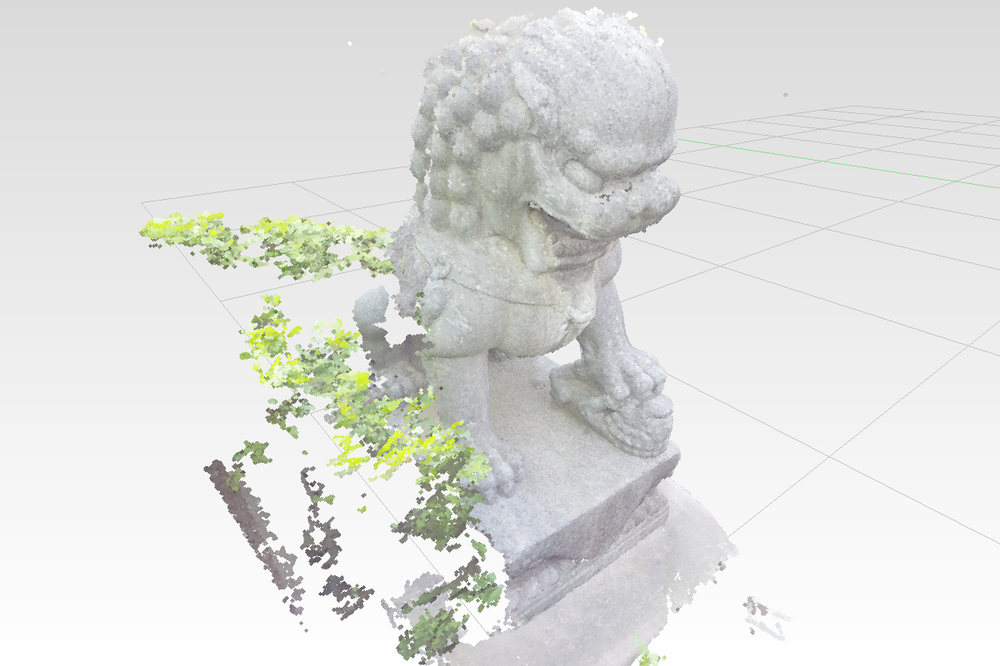

# 36 The cloud tables — 20 bytes a point, a record per cloud

> **This chain (36–41) is the DIRECT path.** It replaces an earlier sequence that built a
> vertex-pipeline cloud lane first and then tore it out; what you type here goes straight
> to the shipped design. Every step is replay-verified against a clean end-of-35 checkout.
> The build only compiles again at the END of the lesson — type all steps, then check.

## Goal

Get a point cloud out of the kernel and ONTO THE SCREEN in one lesson: **20 bytes a
point** (position, colour, normal) in GPU-shaped tables, one draw record per cloud, a
per-cloud point size — and a first, deliberately simple COMPUTE splatter that draws it
all as round dots. Lessons 37-40 make it frugal, robust and beautiful without replacing it.

## Why the lane is compute, not vertices

Every vertex-pipeline variant was measured on a 10.6 M point scene (Intel iGPU, TRUE
rAF-measured fps): 1 px `PointList` 60 fps — but sized quads 45, round-`discard`
triangles 30, with a depth prepass 15. Two laws fell out: this class of GPU pulls
~1 G verts/s from storage buffers, so 7 M sized points × 3 verts already overflows a
frame; and a ROUND dot in the raster pipeline needs `discard`, which turns early-Z off.
(Also: the CPU frame counter prints 60 fps while the GPU drowns — only
`requestAnimationFrame` intervals measure the presented rate.) So a compute thread
rasterises the dots instead. That is what this lesson builds.

## Step 0 — demolition

The 32b glyph cloud path and the dormant `CloudPoint` vertex path both die here. Five
files.

**0a.** Delete the file `src/shaders/point.wgsl`.

**0b.** In `src/engine/pipelines/build.rs` — **find** `pub fn build_point_pipeline(` and
**delete the whole function**, everything down to (not including)
`pub fn build_ink_depth_pipeline(`.

**0c.** In `src/engine/pipelines/mod.rs` — **delete these three lines** (they are the
only mentions of `point`):

```rust
use build::build_point_pipeline;
```
```rust
    pub point: wgpu::RenderPipeline,
```
```rust
            point: build_point_pipeline(device, samples, color_format, aspect_layout, line_layout, instance_layout, glyph_layout),
```

**0d.** In `src/app/scene.rs` — **find** near the bottom of the file:

```rust
/// One glyph per point. `point_size` rides the same width encoding as every other pen, and
/// a cloud with fewer colors than points falls back to black for the tail.
fn pointcloud_to_glyphs(pc: &PointCloud, instance_id: u32) -> Vec<GlyphPoint>{
```

**Delete the whole function including that comment.** (Its caller — the
`Geometry::PointCloud` match arm — is replaced in step 4.)

**0e.** In `src/engine/gpu/mod.rs`, four edits:

**Find** (near the bottom of the file):

```rust
// Points inscribed in circles used for pointclouds
#[repr(C)]
#[derive(Clone, Copy, bytemuck::Pod, bytemuck::Zeroable)]
struct CloudPoint{
    position: [f32; 3], // 12 B - mesh local
    instance_id: u32, // 4 B - fills position's tail
    color: [f32; 4], // 16 B
} // 32 B total, two 16-byte rows, zero padding
```

**Delete it.**

**Find** in the `Gpu` struct fields:

```rust
    pub point_buffer: wgpu::Buffer,
    pub point_bind_group: wgpu::BindGroup,
    pub point_count: u32,
```

**Replace with** (the `point_buffer` NAME survives — it will hold flat positions):

```rust
    pub point_buffer: wgpu::Buffer,     // positions, array<f32>
    pub point_col_buffer: wgpu::Buffer, // colours, array<u32> RGBA8
    pub point_nrm_buffer: wgpu::Buffer, // normals, array<u32> oct16 (u32::MAX = none)
    pub point_count: u32,
```

**Find** in `Gpu::new`:

```rust
        // Point buffer + the cloud uniform
        let points: Vec<CloudPoint> = Vec::new();
        let point_count = points.len() as u32;
        let point_buffer = storage_buffer(&device, "points.buffer", &points);
        let point_bind_group = device.create_bind_group(&wgpu::BindGroupDescriptor {
            label: Some("points.bind_group"),
            layout: &glyph_layout,
            entries: &[wgpu::BindGroupEntry {binding: 0, resource: point_buffer.as_entire_binding()}],
        });
```

**Replace with:**

```rust
        // Point cloud tables - empty until set_scene fills them from ArenaUpload
        let point_count = 0u32;
        let point_buffer = storage_buffer(&device, "points.buffer", &[0f32]);
        let point_col_buffer = storage_buffer(&device, "points.col.buffer", &[0u32]);
        let point_nrm_buffer = storage_buffer(&device, "points.nrm.buffer", &[u32::MAX]);
```

**Find** in the `Ok(Self { ... })` struct literal at the end of `Gpu::new`:

```rust
            point_buffer,
            point_bind_group,
            point_count,
```

**Replace with:**

```rust
            point_buffer,
            point_col_buffer,
            point_nrm_buffer,
            point_count,
```

**Find** in `encode_frame` (the old cloud draw):

```rust
            if self.point_count > 0 {
                pass.set_pipeline(&self.pipelines.point);
                pass.set_bind_group(0, &self.mvp_bind_group, &[]);
                pass.set_bind_group(1, &self.cloud_bind_group, &[]); // cloud size + viewport
                pass.set_bind_group(2, &self.instance_bind_group, &[]);
                pass.set_bind_group(3, &self.point_bind_group, &[]);
                pass.draw(0..3 * self.point_count, 0..1); // 3 vertices per point, no template
                draws += 1;
            }
```

**Delete it** (the compute lane's one-triangle draw replaces it in step 8).

Small clouds do NOT keep a special path: every `PointCloud` goes through this lane.
Single `Point` objects keep their glyph dots — that lane is untouched.

## Step 1 — the kernel's flat arrays

A renderer walking millions of points cannot afford `get_point(i)` — that builds a
`Point`, and a `Point` owns Strings (measured: 1.08 s vs 0.24 s for the flat walk).
`coords()`/`colors()` already exist; normals get the same treatment.

**Find** in `session_rust/src/pointcloud.rs`:

```rust
    /// The flat colour array itself, [r0, g0, b0, a0, r1, ...] as 0-255 - the same encoding the
    /// proto carries. Same reason as `coords`: `get_color` builds a `Color`, which owns a name.
    pub fn colors(&self) -> &[i32] {
        &self._colors
    }
```

**Add below it:**

```rust
    /// The flat normal array, [nx0, ny0, nz0, ...]; empty when the cloud has none.
    pub fn normals(&self) -> &[f64] {
        &self._normals
    }
```

## Step 2 — the tables: `src/engine/gpu/mod.rs`

**Find** in `ArenaUpload`:

```rust
    pub glyphs: Vec<GlyphPoint>, // Flat lane: points, draw as SDF dots,
```

**Add below it:**

```rust
    pub cloud_pos: Vec<f32>,  // Raw lane: 3 floats per point, 12 B
    pub cloud_col: Vec<u32>,  // Raw lane: RGBA8 per point, 4 B
    pub cloud_nrm: Vec<u32>,  // Raw lane: oct16 normal per point (u32::MAX = none), 4 B -> 20 B/pt
    pub cloud_draws: Vec<(u32, u32, u32, f32)>, // (first, count, instance, point spacing world units)
```

**Find** in `ArenaUpload::new()`:

```rust
            glyphs: Vec::new(),
```

**Add below it:**

```rust
            cloud_pos: Vec::new(),
            cloud_col: Vec::new(),
            cloud_nrm: Vec::new(),
            cloud_draws: Vec::new(),
```

The layout choices are the lesson:

- **Split arrays, not an interleaved struct.** `array<f32>` has stride 4 in storage, so
  three floats really cost 12 B; an interleaved struct would pad, and the colour would be
  tempted into `vec4<f32>` — 16 B for the 4 bytes the proto holds. 13.8M points at 20 B
  is 276 MB; at the naive 48 B it is 662 MB.
- **No per-point instance id.** Three clouds in a scene, not 13.8 million ids: the draw
  RECORD carries the object row.
- **The normal is oct16** — the mesh edge lanes' 16-bit octahedral encoding, all-ones =
  "none". A cloud without normals still pays the 4 B, but every branch stays uniform per
  cloud, which is what a GPU wants.

## Step 3 — the per-cloud size plumbing

The kernel carries `point_size` per cloud; the manifest gets an override so scenes can
restyle scans without touching `.pb` files, and it must survive `rebuild` (documents
re-walk from `Doc`s). Pure plumbing, six files.

**3a.** `src/app/scene.rs`, **find** in `struct Item`:

```rust
    #[serde(default)]
    pub xform: Option<[f64; 16]>,     // full 4x4 (wins over `at`); neither = auto_grid
```

**Add below it:**

```rust
    #[serde(default)]
    pub point_size: f64,              // raw-cloud px for this file; 0 = keep the pb's own
```

**3b.** Same file, **find**:

```rust
pub struct Doc{
    pub name: String,
    pub place: Xform,
    pub session: Session,
}
```

**Add** `pub cloud_px: f32, // per-file raw-cloud point size, px; 0 = pb's own` **after
the `session` field**.

**3c.** Same file, **find**:

```rust
    pub fn add_file(&mut self, name: String, session: Session, place: Xform){
```

**Replace with:**

```rust
    pub fn add_file(&mut self, name: String, session: Session, place: Xform, cloud_px: f32){
```

**3d.** Same file, at the end of `add_file`, **find**:

```rust
        self.docs.push(Doc {
            name,
            place,
            session
        });
```

**Replace with:**

```rust
        self.docs.push(Doc {
            name,
            place,
            session,
            cloud_px
        });
```

**3e.** Same file, in `rebuild`, **find**:

```rust
            self.add_file(d.name, d.session, d.place);
```

**Replace with:**

```rust
            self.add_file(d.name, d.session, d.place, d.cloud_px);
```

**3f.** `src/lib.rs`, **find**:

```rust
    File(String, session_rust::Session, session_rust::Xform),
```

**Replace with:**

```rust
    File(String, session_rust::Session, session_rust::Xform, f32),
```

**Find**:

```rust
                        scene.add_file(name, session, place);
```

**Replace with:**

```rust
                        scene.add_file(name, session, place, item.point_size as f32);
```

**Find**:

```rust
                        let _ = proxy.send_event(Msg::File(name, session, place));
```

**Replace with:**

```rust
                        let _ = proxy.send_event(Msg::File(name, session, place, item.point_size as f32));
```

**Find** (two lines inside `user_event`):

```rust
            Msg::File(name, session, place) => {
```
```rust
                state.scene.add_file(name, session, place);
```

**Replace with:**

```rust
            Msg::File(name, session, place, cloud_px) => {
```
```rust
                state.scene.add_file(name, session, place, cloud_px);
```

**3g.** The global scale lives on `Gpu`. In `src/engine/gpu/mod.rs`, **find**:

```rust
    pub cloud_buffer: wgpu::Buffer,
    pub cloud_bind_group: wgpu::BindGroup,
```

**Replace with:**

```rust
    pub cloud_buffer: wgpu::Buffer,
    pub cloud_size: f32, // global SCALE on per-cloud sizes, [ and ] keys
    pub cloud_bind_group: wgpu::BindGroup,
```

**Find** in the struct literal at the end of `Gpu::new`:

```rust
            cloud_buffer,
            cloud_bind_group,
```

**Replace with:**

```rust
            cloud_buffer,
            cloud_size: std::env::var("VIEWER_CLOUD_SCALE").ok().and_then(|v| v.parse().ok()).unwrap_or(1.0),
            cloud_bind_group,
```

**Find** (in `struct CloudUniform`, near the bottom — the uniform itself is untouched,
only the meaning of `size` changes):

```rust
    size: f32, // global point-cloud dot size, px
```

**Replace with:**

```rust
    size: f32, // global point-cloud size SCALE ([ and ] keys)
```

**3h.** The two keys. In `src/lib.rs`, **find** the end of the `Key::Character("l" | "L")`
block:

```rust
                            log::info!("line style: {:?}", state.gpu.line_style);
                        }
```

**Add below it:**

```rust
                        // live cloud point size
                        Key::Character("[") => {
                            state.gpu.cloud_size = (state.gpu.cloud_size - 0.25).max(0.25);
                            log::info!("cloud size scale: x{}", state.gpu.cloud_size);
                        }
                        Key::Character("]") => {
                            state.gpu.cloud_size = (state.gpu.cloud_size + 0.25).min(8.0);
                            log::info!("cloud size scale: x{}", state.gpu.cloud_size);
                        }
```

**3i.** The native harness calls `add_file` too. In `src/selftest.rs`, **find**:

```rust
pub fn render_scene(files: &[(&str, Xform)], w: u32, h: u32, out: &str) -> String {
```

**Replace with:**

```rust
pub fn render_scene(files: &[(&str, Xform, f32)], w: u32, h: u32, out: &str) -> String {
```

**Find** (in `render_scene` — `bench_scene` below has the same loop head, leave that one):

```rust
    let rss0 = rss_mb();
    for (path, place) in files {
```

**Replace with:**

```rust
    let rss0 = rss_mb();
    for (path, place, px) in files {
```

**Find**:

```rust
        scene.add_file(name, session, place.clone());
        println!("  after walk into GPU tables: {:.1} MB | walk {:?}", rss_mb() - rss0, t0.elapsed() - t_read - t_decode);
```

**Replace the first line with** `scene.add_file(name, session, place.clone(), *px);`

**Find** (in `bench_scene`, which keeps 2-tuples):

```rust
        scene.add_file(name, session, place.clone());
```

**Replace with** `scene.add_file(name, session, place.clone(), 0.0);`

**3j.** In `examples/selftest.rs`, **find**:

```rust
    log::set_max_level(log::LevelFilter::Warn);
```

**Replace with** `log::set_max_level(log::LevelFilter::Info);` (so the `scene:` log with
the cloud-point count shows up in the harness).

**Find**:

```rust
    let mut owned: Vec<(String, session_rust::Xform)> = Vec::new();
```

**Replace with:**

```rust
    let mut owned: Vec<(String, session_rust::Xform, f32)> = Vec::new();
```

**Find**:

```rust
                owned.push((root.join(&item.file).to_string_lossy().into_owned(), place));
```

**Replace with:**

```rust
                owned.push((root.join(&item.file).to_string_lossy().into_owned(), place, item.point_size as f32));
```

**Find**:

```rust
            owned.push((p.clone(), session_rust::Xform::identity()));
```

**Replace with:**

```rust
            owned.push((p.clone(), session_rust::Xform::identity(), 0.0));
```

**Find**:

```rust
    let files: Vec<(&str, session_rust::Xform)> =
        owned.iter().map(|(p, x)| (p.as_str(), x.clone())).collect();
```

**Replace with:**

```rust
    let files: Vec<(&str, session_rust::Xform, f32)> =
        owned.iter().map(|(p, x, px)| (p.as_str(), x.clone(), *px)).collect();
```

**3k (optional) — TOML manifests.** Hand-written scene files deserve comments, which JSON
doesn't have. Three tiny edits and every manifest parses as EITHER format (same structs,
serde does the rest). `Cargo.toml`: add `toml = "0.8"` above `serde_json`. In
`Manifest::parse`, **find** `serde_json::from_slice(bytes).ok()` and **replace with:**

```rust
        serde_json::from_slice(bytes).ok()
            .or_else(|| std::str::from_utf8(bytes).ok().and_then(|s| toml::from_str(s).ok()))
```

(JSON first — every existing scene; a JSON parse of TOML text fails fast, so the fallback
costs nothing.) And in `examples/selftest.rs`, the manifest gate
`if p.ends_with(".json")` gains `|| p.ends_with(".toml")`. See
`assets/scenes/bunny_drawings.toml` for the commented style.

## Step 4 — the walk: `src/app/scene.rs`

**4a.** At the top of `add_file`, **find**:

```rust
        let obj0 = self.tables.objects.len();
```

**Add below it:**

```rust
        let draw0 = self.tables.cloud_draws.len();
```

**4b.** **Find** the match arm:

```rust
                Geometry::PointCloud(pc) => { t.glyphs.extend(pointcloud_to_glyphs(pc, ri)); t.object_bounds.push(None); t.object_spacing.push(0.0); }
```

**Replace with:**

```rust
                // EVERY cloud takes the splat lane: split flat rows into the shared tables,
                // one draw record per cloud, and the per-cloud point size rides the spacing
                // row (unused for clouds - the ink lanes read 0 there as "never cull").
                Geometry::PointCloud(pc) => {
                    let first = (t.cloud_pos.len() / 3) as u32;
                    push_cloud(pc, &mut t.cloud_pos, &mut t.cloud_col, &mut t.cloud_nrm);
                    t.cloud_draws.push((first, pc.len() as u32, ri, cloud_spacing(pc)));
                    let px = if cloud_px > 0.0 { cloud_px } else { pc.point_size as f32 };
                    t.object_bounds.push(None); t.object_spacing.push(px);
                }
```

**4c.** The two helpers. **Find**:

```rust
/// At or above this many edges a mesh's wireframe draws BLACK whatever the file says - see
/// push_mesh. 104,288 on the bunny; 12 on a box, whose authored red pen always survives.
const WIREFRAME_BLACK_MIN: usize = 10_000;
```

**Add below it** — `push_cloud` writes STRAIGHT into the shared tables (collect-then-extend
built a 13.8M-point table twice: 843 MB peak against a wasm heap that practically ends
around 2 GB; reserve-and-push peaks at 423 MB), and `cloud_spacing` measures the median
consecutive-point distance (a scanner emits angular neighbours in order, so consecutive
points are usually adjacent on the surface — lesson [40](40-potree-look.md)'s attenuated
sizes are built on it):

```rust
/// The raw lane's rows, written STRAIGHT into the shared table (one 423 MB peak, not two),
/// reading the kernel's FLAT arrays rather than get_point/get_color (no per-point allocs).
fn push_cloud(pc: &PointCloud, pos: &mut Vec<f32>, col: &mut Vec<u32>, nrm: &mut Vec<u32>){
    let coords = pc.coords();
    let colors = pc.colors();
    let normals = pc.normals();
    let n = pc.len();
    pos.reserve(n * 3);
    col.reserve(n);
    nrm.reserve(n);
    for i in 0..n {
        pos.push(coords[i * 3] as f32);
        pos.push(coords[i * 3 + 1] as f32);
        pos.push(coords[i * 3 + 2] as f32);
        // Normal, oct16-packed into 16 bits (same encoding as the edge facing words).
        // All-ones = this point HAS no normal: a scan without them still pays the 4 B,
        // but the shading branch stays uniform per cloud, which is what the GPU wants.
        nrm.push(if i * 3 + 2 < normals.len() {
            let v = Vector::new(normals[i * 3], normals[i * 3 + 1], normals[i * 3 + 2]);
            oct16(&v).unwrap_or(u32::MAX)
        } else {
            u32::MAX
        });
        let c = i * 4;
        // The colour is 8-bit at the source (proto 0-255): pack it back to the four bytes it
        // is, instead of four f32s carrying four bytes of information.
        col.push(if c + 3 < colors.len() {
            (colors[c] as u32 & 255) | (colors[c + 1] as u32 & 255) << 8
                | (colors[c + 2] as u32 & 255) << 16 | (colors[c + 3] as u32 & 255) << 24
        } else {
            0xff00_0000
        });
    }
}

/// Median distance between CONSECUTIVE points - a scanner emits angular neighbours in order,
/// so successive points are usually adjacent on the surface, which makes this a cheap and
/// honest estimate of the cloud's point spacing (world units). Potree never measures this:
/// it PRESCRIBES a spacing per octree node at conversion time. Lesson 44's octree does the
/// same for its coarse nodes - and still needs this MEASURED number for the raw points in
/// its leaves. Drives the attenuated (world-sized) splat radius.
fn cloud_spacing(pc: &PointCloud) -> f32 {
    let c = pc.coords();
    let n = pc.len();
    if n < 2 { return 20.0; }
    let step = (n / 1024).max(1);
    let mut d: Vec<f64> = Vec::with_capacity(1024);
    let mut i = 0;
    while i + 1 < n {
        let (a, b) = (i * 3, (i + 1) * 3);
        let dd = (c[a] - c[b]).powi(2) + (c[a + 1] - c[b + 1]).powi(2) + (c[a + 2] - c[b + 2]).powi(2);
        if dd > 0.0 { d.push(dd.sqrt()); }
        i += step;
    }
    if d.is_empty() { return 20.0; }
    d.sort_by(|x, y| x.partial_cmp(y).unwrap());
    d[d.len() / 2] as f32
}
```

**4d.** The raw rows still have to reach the SCENE bounds (zoom-extents reads `t.min/max`).
(Skipping this block has a compiler tell: `warning: unused variable: draw0`. If you see that
warning, you typed 4a's counter but not this loop — and a cloud-only file will load with an
empty scene box, so **F** frames nothing.)
**Find** the last bounds loop in `add_file`:

```rust
        for s in t.spheres.iter().skip(sphere0).chain(t.glyphs.iter().skip(glyph0)){
            if let Some((xf, _, _)) = t.objects.get(s.instance_id as usize){
                grow_bounds(&mut fmin, &mut fmax, xform_point(xf, s.center));
            } 
        }
```

**Add below it:**

```rust
        for &(first, count, inst, _) in t.cloud_draws.iter().skip(draw0){
            let Some((xf, _, _)) = t.objects.get(inst as usize) else { continue };
            for i in first as usize..(first + count) as usize {
                let p = [t.cloud_pos[i * 3], t.cloud_pos[i * 3 + 1], t.cloud_pos[i * 3 + 2]];
                grow_bounds(&mut fmin, &mut fmax, xform_point(xf, p));
            }
        }
```

## Step 5 — upload: `set_scene` in `src/engine/gpu/mod.rs`

Three storage buffers, and the records kept CPU-side (the draw loop and the compute
prelude both read them). **Find** (after the glyph upload block):

```rust
        self.last_origin = None; // force the next frame to rebase agains the new table
```

**Add above it:**

```rust
        // Raw cloud lane: one row per scanned point, uploaded like any other table.
        self.cloud_draws = up.cloud_draws.clone();
        self.point_count = (up.cloud_pos.len() / 3) as u32;
        self.point_buffer = storage_buffer(&self.device, "points.buffer", &up.cloud_pos);
        self.point_col_buffer = storage_buffer(&self.device, "points.col.buffer", &up.cloud_col);
        self.point_nrm_buffer = storage_buffer(&self.device, "points.nrm.buffer", &up.cloud_nrm);
```

(`self.cloud_draws` — the field arrives in step 8 with the rest of the splat state.)

**Find** the scene log:

```rust
        log::info!(
            "scene: {} objects {} arena verts {} segments ({} pipes) {} glyphs ({} spheres)",
            self.instances.len(), self.arena_vert_count, self.segment_count, self.pipe_count, self.glyph_count, self.sphere_count
        );
```

**Replace with:**

```rust
        log::info!(
            "scene: {} objects {} arena verts {} segments ({} pipes) {} glyphs ({} spheres) {} cloud points",
            self.instances.len(), self.arena_vert_count, self.segment_count, self.pipe_count, self.glyph_count, self.sphere_count, self.point_count
        );
```

## Step 6 — the shaders

The idea (Schutz-style, WebGPU dialect): a z-buffer is just "per pixel, keep the
nearest", and compute can do that with atomics. WebGPU has no 64-bit atomics, so depth
and colour cannot share one word — the standard adaptation is two passes over the points:
`cs_depth` projects each point and `atomicMax`es its reverse-Z bits into a per-pixel u32
buffer for every pixel of its disc (positive f32 bit patterns order like the floats, and
reverse-Z makes bigger = closer, so `atomicMax` IS "keep nearest" and 0 = empty/far);
`cs_color` re-projects, and the thread whose depth WON a pixel stores its colour. One
fullscreen triangle then composites the result into the frame with real depth via
`frag_depth`.

**Create `src/shaders/splat.wgsl`:**

```wgsl
// Compute-shader point splatting for the cloud lane (Schutz-style).
// One thread per point. Pass 1 (cs_depth): atomicMax the point's reverse-Z depth into a
// per-pixel u32 buffer for every pixel of its disc - bigger f32 bits = closer, and positive
// f32s compare correctly as u32s. Pass 2 (cs_color): re-project, and the thread whose depth
// WON a pixel stores its colour there. No rasterizer, no per-point vertices, no discard.

struct CloudUniform {
    size: f32,
    vp_w: f32,
    vp_h: f32,
    _pad: f32,
};

// The record table is read as RAW WORDS - 4-word header {n, total, 0, 0}, then 20 words per
// record: 16 matrix (mvp x model, column-major) and {first, count, cum, rbits}. Raw
// indexing sidesteps every struct-layout question between Rust packing and WGSL rules.
const REC_WORDS: u32 = 20u;

@group(0) @binding(0) var<uniform> mvp: mat4x4<f32>;
@group(0) @binding(1) var<uniform> cloud: CloudUniform;
@group(0) @binding(2) var<storage, read> instances_unused: array<vec4<f32>>;
@group(0) @binding(3) var<storage, read> table: array<u32>;

@group(1) @binding(0) var<storage, read> positions: array<f32>;
@group(1) @binding(1) var<storage, read> colors: array<u32>;
@group(1) @binding(2) var<storage, read_write> sdepth: array<atomic<u32>>;
@group(1) @binding(3) var<storage, read_write> scolor: array<u32>;

struct Splat { px: vec2<i32>, r: f32, dbits: u32, color: u32, ok: bool };

fn rec_f(base: u32, w: u32) -> f32 { return bitcast<f32>(table[base + w]); }

fn project(gid: u32) -> Splat {
    var s: Splat;
    s.ok = false;
    if (gid >= table[1]) { return s; } // header: total threads
    let n = table[0];
    var i = 0u;
    var base = 4u;
    for (var j = 0u; j < n; j++) {
        let b = 4u + j * REC_WORDS;
        let cum = table[b + 18u];
        let count = table[b + 17u];
        if (gid >= cum && gid < cum + count) { i = table[b + 16u] + (gid - cum); base = b; break; }
    }
    let m = mat4x4<f32>(
        vec4<f32>(rec_f(base, 0u),  rec_f(base, 1u),  rec_f(base, 2u),  rec_f(base, 3u)),
        vec4<f32>(rec_f(base, 4u),  rec_f(base, 5u),  rec_f(base, 6u),  rec_f(base, 7u)),
        vec4<f32>(rec_f(base, 8u),  rec_f(base, 9u),  rec_f(base, 10u), rec_f(base, 11u)),
        vec4<f32>(rec_f(base, 12u), rec_f(base, 13u), rec_f(base, 14u), rec_f(base, 15u)),
    );
    let clip = m * vec4<f32>(positions[i * 3u], positions[i * 3u + 1u], positions[i * 3u + 2u], 1.0);
    if (clip.w <= 0.0) { return s; }
    let ndc = clip.xyz / clip.w;
    if (ndc.z < 0.0 || ndc.z > 1.0) { return s; } // outside [far, near] in reverse-Z
    s.r = bitcast<f32>(table[base + 19u]);
    let x = (ndc.x * 0.5 + 0.5) * cloud.vp_w;
    let y = (0.5 - ndc.y * 0.5) * cloud.vp_h;
    if (x < -s.r || y < -s.r || x >= cloud.vp_w + s.r || y >= cloud.vp_h + s.r) { return s; }
    s.px = vec2<i32>(i32(x), i32(y));
    s.dbits = bitcast<u32>(ndc.z);
    s.color = colors[i];
    s.ok = true;
    return s;
}

@compute @workgroup_size(64)
fn cs_depth(@builtin(global_invocation_id) g: vec3<u32>) {
    let s = project(g.x);
    if (!s.ok) { return; }
    let ir = i32(ceil(s.r - 0.5));
    let w = i32(cloud.vp_w);
    let h = i32(cloud.vp_h);
    for (var dy = -ir; dy <= ir; dy++) {
        for (var dx = -ir; dx <= ir; dx++) {
            let q = s.px + vec2<i32>(dx, dy);
            if (q.x < 0 || q.y < 0 || q.x >= w || q.y >= h) { continue; }
            if (f32(dx * dx + dy * dy) > s.r * s.r) { continue; } // ROUND dot
            let idx = u32(q.y) * u32(w) + u32(q.x);
            // Contention killer: plain load first, the atomic RMW only when this point
            // would actually win - losing threads must not serialize on the atomic unit.
            if (s.dbits > atomicLoad(&sdepth[idx])) {
                atomicMax(&sdepth[idx], s.dbits);
            }
        }
    }
}

@compute @workgroup_size(64)
fn cs_color(@builtin(global_invocation_id) g: vec3<u32>) {
    let s = project(g.x);
    if (!s.ok) { return; }
    let ir = i32(ceil(s.r - 0.5));
    let w = i32(cloud.vp_w);
    let h = i32(cloud.vp_h);
    for (var dy = -ir; dy <= ir; dy++) {
        for (var dx = -ir; dx <= ir; dx++) {
            let q = s.px + vec2<i32>(dx, dy);
            if (q.x < 0 || q.y < 0 || q.x >= w || q.y >= h) { continue; }
            if (f32(dx * dx + dy * dy) > s.r * s.r) { continue; }
            let idx = u32(q.y) * u32(w) + u32(q.x);
            // The winner of pass 1 owns the pixel; equal-depth ties race, any tied colour
            // is a correct answer.
            if (atomicLoad(&sdepth[idx]) == s.dbits) { scolor[idx] = s.color; }
        }
    }
}
```

Note the load-before-RMW guard in `cs_depth`: at a fit view millions of points share a
handful of pixels, and losing threads must not serialise on the atomic unit — measured
420 → 87 ms for one frame.

**Create `src/shaders/splat_resolve.wgsl`:**

```wgsl
// Composite the splat buffers into the frame: ONE fullscreen triangle. Each fragment looks up
// its pixel; no splat (depth bits 0 = reverse-Z far) discards, a splat emits the colour and
// exports the splat's depth via frag_depth - so points and solids depth-test each other
// exactly, and later passes (markers, flat ink) see real cloud depth. frag_depth costs
// early-Z only for THIS one triangle, ~2M cheap fragments.

struct CloudUniform {
    size: f32,
    vp_w: f32,
    vp_h: f32,
    _pad: f32,
};
@group(0) @binding(0) var<uniform> cloud: CloudUniform;

@group(1) @binding(0) var<storage, read> sdepth: array<u32>;
@group(1) @binding(1) var<storage, read> scolor: array<u32>;

struct VsOut { @builtin(position) pos: vec4<f32> };

@vertex
fn vs_main(@builtin(vertex_index) vid: u32) -> VsOut{
    var o: VsOut;
    let x = f32(i32(vid & 1u) * 4 - 1);
    let y = f32(i32(vid >> 1u) * 4 - 1);
    o.pos = vec4<f32>(x, y, 0.0, 1.0); // (-1,-1) (3,-1) (-1,3): one triangle covers the screen
    return o;
}

struct FsOut {
    @location(0) color: vec4<f32>,
    @builtin(frag_depth) depth: f32,
};

@fragment
fn fs_main(in: VsOut) -> FsOut{
    let idx = u32(in.pos.y) * u32(cloud.vp_w) + u32(in.pos.x);
    let d = sdepth[idx];
    if (d == 0u) {
        discard; // no splat landed here
    }
    var o: FsOut;
    o.color = vec4<f32>(unpack4x8unorm(scolor[idx]).rgb, 1.0);
    o.depth = bitcast<f32>(d);
    return o;
}
```

## Step 7 — the resolve pipeline

**7a.** In `src/engine/pipelines/build.rs`, **at the very end of the file** (after
`build_glyph_pipeline`), **add:**

```rust
pub fn build_splat_resolve_pipeline(
    device: &wgpu::Device,
    samples: u32,
    color_format: wgpu::TextureFormat,
    line_layout: &wgpu::BindGroupLayout,
    splat_layout: &wgpu::BindGroupLayout,
) -> wgpu::RenderPipeline{
    let shader = device.create_shader_module(
        wgpu::ShaderModuleDescriptor{
            label: Some("splat.resolve.shader"),
            source: wgpu::ShaderSource::Wgsl(include_str!("../../shaders/splat_resolve.wgsl").into()),
    });
    let layout = device.create_pipeline_layout(&wgpu::PipelineLayoutDescriptor{
        label: Some("splat.resolve.layout"),
        bind_group_layouts: &[Some(line_layout), Some(splat_layout)],
        immediate_size: 0,
    });
    device.create_render_pipeline(&wgpu::RenderPipelineDescriptor{
        label: Some("splat.resolve"),
        layout: Some(&layout),
        vertex: wgpu::VertexState{
            module: &shader,
            entry_point: Some("vs_main"),
            buffers: &[],
            compilation_options: Default::default(),
        },
        fragment: Some(wgpu::FragmentState{
            module: &shader,
            entry_point: Some("fs_main"),
            targets: &[Some(wgpu::ColorTargetState{
                format: color_format,
                blend: None,
                write_mask: wgpu::ColorWrites::ALL,
            })],
        compilation_options: Default::default(),
        }),
        primitive: wgpu::PrimitiveState{
            topology: wgpu::PrimitiveTopology::TriangleList,
            strip_index_format: None,
            front_face: wgpu::FrontFace::Ccw,
            cull_mode: None,
            polygon_mode: wgpu::PolygonMode::Fill,
            unclipped_depth: false,
            conservative: false,
        },
        depth_stencil: Some(wgpu::DepthStencilState{
            format: wgpu::TextureFormat::Depth32Float,
            depth_write_enabled: Some(true), // splats occlude like any solid
            depth_compare: Some(wgpu::CompareFunction::Greater), // reverse-Z
            stencil: wgpu::StencilState::default(),
            bias: wgpu::DepthBiasState::default(),
        }),
        multisample: wgpu::MultisampleState{ count: samples, mask: !0, alpha_to_coverage_enabled: false},
        multiview_mask: None,
        cache: None,
    })
}
```

**7b.** In `src/engine/pipelines/mod.rs`, four small edits.

**Find** `use build::build_background_pipeline;` — **add below it:**

```rust
use build::build_splat_resolve_pipeline;
```

**Find** `    pub background: wgpu::RenderPipeline,` — **add below it:**

```rust
    pub splat_resolve: wgpu::RenderPipeline, // fullscreen composite of the splat buffers
```

**Find** in `Pipelines::new`'s parameter list `        glyph_layout: &wgpu::BindGroupLayout,`
— **add below it:**

```rust
        splat_resolve_layout: &wgpu::BindGroupLayout,
```

**Find** `            background: build_background_pipeline(device, samples, color_format),`
— **add below it:**

```rust
            splat_resolve: build_splat_resolve_pipeline(device, samples, color_format, line_layout, splat_resolve_layout),
```

## Step 8 — the compute machinery: `src/engine/gpu/mod.rs`

**8a. Fields.** **Find** (from step 0e):

```rust
    pub point_nrm_buffer: wgpu::Buffer, // normals, array<u32> oct16 (u32::MAX = none)
```

**Add below it:**

```rust
    // compute splatting for the cloud lane
    splat_depth_buf: wgpu::Buffer,    // one u32 per pixel: winning reverse-Z bits (0 = empty)
    splat_color_buf: wgpu::Buffer,    // one u32 per pixel: winner's RGBA8
    splat_recs: wgpu::Buffer,         // header + one Rec per cloud, written per frame
    splat_group0_layout: wgpu::BindGroupLayout,
    splat_group1_layout: wgpu::BindGroupLayout,
    splat_resolve_layout: wgpu::BindGroupLayout,
    splat_group0: wgpu::BindGroup,
    splat_group1: wgpu::BindGroup,
    splat_resolve_group: wgpu::BindGroup,
    splat_depth_pipeline: wgpu::ComputePipeline,
    splat_color_pipeline: wgpu::ComputePipeline,
    splat_total: u32,
    mvp_f32: [f32; 16],
    cloud_draws: Vec<(u32, u32, u32, f32)>, // (first, count, instance, spacing)
```

**8b. Construction.** **Find** in `Gpu::new`:

```rust
        // Pipelines
        let pipelines = Pipelines::new(
```

**Add above the `// Pipelines` comment:**

```rust
        // compute splatting - buffers, layouts, groups, pipelines.
        // The per-pixel buffers are framebuffer-sized u32s; clear_buffer needs COPY_DST.
        let pixels = (config.width.max(1) * config.height.max(1)) as u64 * 4;
        let splat_depth_buf = zeroed_buffer(&device, "splat.depth", pixels,
            wgpu::BufferUsages::STORAGE | wgpu::BufferUsages::COPY_DST);
        let splat_color_buf = zeroed_buffer(&device, "splat.color", pixels,
            wgpu::BufferUsages::STORAGE | wgpu::BufferUsages::COPY_DST);
        let splat_recs = zeroed_buffer(&device, "splat.recs", 16 + 256 * 144,
            wgpu::BufferUsages::STORAGE | wgpu::BufferUsages::COPY_DST);
        let splat_group0_layout = device.create_bind_group_layout(&wgpu::BindGroupLayoutDescriptor{
            label: Some("splat.group0.layout"),
            entries: &[
                Self::splat_entry(0, wgpu::BufferBindingType::Uniform),
                Self::splat_entry(1, wgpu::BufferBindingType::Uniform),
                Self::splat_entry(2, wgpu::BufferBindingType::Storage { read_only: true }),
                Self::splat_entry(3, wgpu::BufferBindingType::Storage { read_only: true }),
            ],
        });
        // ── TWIN TRAP ── group0/group1 machinery comes in near-identical pairs (layouts,
        // mk_ helpers, calls). The three bugs you will most likely type are all unedited
        // copies of the FIRST twin: group0's Uniform entries left in group1's layout, the
        // second mk_ helper never renamed, rebuild calling mk_splat_group0 for group1.
        // Symptom for all of them: a wgpu VALIDATION ERROR naming the exact label — and the
        // frame silently shows the LAST GOOD image (or 100% painted in the headless
        // harness), because an invalid bind group invalidates the whole submit. Read the
        // console before touching the math.
        let splat_group1_layout = device.create_bind_group_layout(&wgpu::BindGroupLayoutDescriptor{
            label: Some("splat.group1.layout"),
            entries: &[
                Self::splat_entry(0, wgpu::BufferBindingType::Storage { read_only: true }),
                Self::splat_entry(1, wgpu::BufferBindingType::Storage { read_only: true }),
                Self::splat_entry(2, wgpu::BufferBindingType::Storage { read_only: false }),
                Self::splat_entry(3, wgpu::BufferBindingType::Storage { read_only: false }),
            ],
        });
        let splat_resolve_layout = device.create_bind_group_layout(&wgpu::BindGroupLayoutDescriptor{
            label: Some("splat.resolve.layout"),
            entries: &[
                wgpu::BindGroupLayoutEntry{
                    binding: 0,
                    visibility: wgpu::ShaderStages::FRAGMENT,
                    ty: wgpu::BindingType::Buffer { ty: wgpu::BufferBindingType::Storage { read_only: true }, has_dynamic_offset: false, min_binding_size: None },
                    count: None,
                },
                wgpu::BindGroupLayoutEntry{
                    binding: 1,
                    visibility: wgpu::ShaderStages::FRAGMENT,
                    ty: wgpu::BindingType::Buffer { ty: wgpu::BufferBindingType::Storage { read_only: true }, has_dynamic_offset: false, min_binding_size: None },
                    count: None,
                },
            ],
        });
        let splat_group0 = Self::mk_splat_group0(&device, &splat_group0_layout, &mvp_buffer, &cloud_buffer, &instance_buffer, &splat_recs);
        let splat_group1 = Self::mk_splat_group1(&device, &splat_group1_layout, &point_buffer, &point_col_buffer, &splat_depth_buf, &splat_color_buf);
        let splat_resolve_group = Self::mk_splat_resolve_group(&device, &splat_resolve_layout, &splat_depth_buf, &splat_color_buf);
        let splat_shader = device.create_shader_module(wgpu::ShaderModuleDescriptor{
            label: Some("splat.shader"),
            source: wgpu::ShaderSource::Wgsl(include_str!("../../shaders/splat.wgsl").into()),
        });
        let splat_layout = device.create_pipeline_layout(&wgpu::PipelineLayoutDescriptor{
            label: Some("splat.layout"),
            bind_group_layouts: &[Some(&splat_group0_layout), Some(&splat_group1_layout)],
            immediate_size: 0,
        });
        let splat_depth_pipeline = device.create_compute_pipeline(&wgpu::ComputePipelineDescriptor{
            label: Some("splat.depth"),
            layout: Some(&splat_layout),
            module: &splat_shader,
            entry_point: Some("cs_depth"),
            compilation_options: Default::default(),
            cache: None,
        });
        let splat_color_pipeline = device.create_compute_pipeline(&wgpu::ComputePipelineDescriptor{
            label: Some("splat.color"),
            layout: Some(&splat_layout),
            module: &splat_shader,
            entry_point: Some("cs_color"),
            compilation_options: Default::default(),
            cache: None,
        });
```

**8c. Both `Pipelines::new` call sites** grow the new layout argument — in `Gpu::new`,
**find**:

```rust
            &glyph_layout,
        );
```

**Replace with:**

```rust
            &glyph_layout,
            &splat_resolve_layout,
        );
```

and in `set_scene` (the MSAA-flip rebuild), **find**:

```rust
                &self.glyph_layout
            );
```

**Replace with:**

```rust
                &self.glyph_layout,
                &self.splat_resolve_layout
            );
```

**8d. Struct literal.** **Find** (from step 0e):

```rust
            point_buffer,
            point_col_buffer,
            point_nrm_buffer,
            point_count,
```

**Replace with:**

```rust
            point_buffer,
            point_col_buffer,
            point_nrm_buffer,
            splat_depth_buf,
            splat_color_buf,
            splat_recs,
            splat_group0_layout,
            splat_group1_layout,
            splat_resolve_layout,
            splat_group0,
            splat_group1,
            splat_resolve_group,
            splat_depth_pipeline,
            splat_color_pipeline,
            splat_total: 0,
            mvp_f32: [0.0; 16],
            cloud_draws: Vec::new(),
            point_count,
```

**8e. The helpers.** **Find**:

```rust
    /// Reconfigure the surface and recreate the depth + MSAA targets for a new canvas size.
    pub fn resize(&mut self, width: u32, height: u32) {
```

**Add above it:**

```rust
    // splat helpers - one compute-visible buffer entry, and the three bind groups,
    // rebuilt whenever any bound buffer is recreated (set_scene, resize).
    fn splat_entry(binding: u32, ty: wgpu::BufferBindingType) -> wgpu::BindGroupLayoutEntry {
        wgpu::BindGroupLayoutEntry{
            binding,
            visibility: wgpu::ShaderStages::COMPUTE,
            ty: wgpu::BindingType::Buffer { ty, has_dynamic_offset: false, min_binding_size: None },
            count: None,
        }
    }
    fn mk_splat_group0(device: &wgpu::Device, layout: &wgpu::BindGroupLayout, mvp: &wgpu::Buffer, cloud: &wgpu::Buffer, instances: &wgpu::Buffer, recs: &wgpu::Buffer) -> wgpu::BindGroup {
        device.create_bind_group(&wgpu::BindGroupDescriptor{
            label: Some("splat.group0"),
            layout,
            entries: &[
                wgpu::BindGroupEntry{binding: 0, resource: mvp.as_entire_binding()},
                wgpu::BindGroupEntry{binding: 1, resource: cloud.as_entire_binding()},
                wgpu::BindGroupEntry{binding: 2, resource: instances.as_entire_binding()},
                wgpu::BindGroupEntry{binding: 3, resource: recs.as_entire_binding()},
            ],
        })
    }
    fn mk_splat_group1(device: &wgpu::Device, layout: &wgpu::BindGroupLayout, pos: &wgpu::Buffer, col: &wgpu::Buffer, sdepth: &wgpu::Buffer, scolor: &wgpu::Buffer) -> wgpu::BindGroup {
        device.create_bind_group(&wgpu::BindGroupDescriptor{
            label: Some("splat.group1"),
            layout,
            entries: &[
                wgpu::BindGroupEntry{binding: 0, resource: pos.as_entire_binding()},
                wgpu::BindGroupEntry{binding: 1, resource: col.as_entire_binding()},
                wgpu::BindGroupEntry{binding: 2, resource: sdepth.as_entire_binding()},
                wgpu::BindGroupEntry{binding: 3, resource: scolor.as_entire_binding()},
            ],
        })
    }
    fn mk_splat_resolve_group(device: &wgpu::Device, layout: &wgpu::BindGroupLayout, sdepth: &wgpu::Buffer, scolor: &wgpu::Buffer) -> wgpu::BindGroup {
        device.create_bind_group(&wgpu::BindGroupDescriptor{
            label: Some("splat.resolve.group"),
            layout,
            entries: &[
                wgpu::BindGroupEntry{binding: 0, resource: sdepth.as_entire_binding()},
                wgpu::BindGroupEntry{binding: 1, resource: scolor.as_entire_binding()},
            ],
        })
    }
    fn rebuild_splat_groups(&mut self) {
        self.splat_group0 = Self::mk_splat_group0(&self.device, &self.splat_group0_layout, &self.mvp_buffer, &self.cloud_buffer, &self.instance_buffer, &self.splat_recs);
        self.splat_group1 = Self::mk_splat_group1(&self.device, &self.splat_group1_layout, &self.point_buffer, &self.point_col_buffer, &self.splat_depth_buf, &self.splat_color_buf);
        self.splat_resolve_group = Self::mk_splat_resolve_group(&self.device, &self.splat_resolve_layout, &self.splat_depth_buf, &self.splat_color_buf);
    }
```

**8f. Rebuild hooks.** In `set_scene`, **find** the last line of step 5's upload block:

```rust
        self.point_nrm_buffer = storage_buffer(&self.device, "points.nrm.buffer", &up.cloud_nrm);
```

**Add below it:**

```rust
        self.rebuild_splat_groups(); // instance + point buffers are fresh
```

In `resize`, **find**:

```rust
            if let Some(s) = &self.surface { s.configure(&self.device, &self.config); }
            self.depth_view = Self::create_depth_view(&self.device, &self.config, self.samples);
            self.msaa_view = Self::create_msaa_view(&self.device, &self.config, self.samples);
```

**Add below it** (the per-pixel buffers are framebuffer-sized):

```rust
            let pixels = (width * height) as u64 * 4;
            self.splat_depth_buf = zeroed_buffer(&self.device, "splat.depth", pixels,
                wgpu::BufferUsages::STORAGE | wgpu::BufferUsages::COPY_DST);
            self.splat_color_buf = zeroed_buffer(&self.device, "splat.color", pixels,
                wgpu::BufferUsages::STORAGE | wgpu::BufferUsages::COPY_DST);
            self.rebuild_splat_groups();
```

**8g. Frame uniforms.** In `write_frame_uniforms`, **find**:

```rust
        self.queue.write_buffer(&self.mvp_buffer, 0, bytemuck::cast_slice(&view_proj.to_f32()));
```

**Replace with** (the compute prelude needs the mvp CPU-side):

```rust
        self.mvp_f32 = view_proj.to_f32();
        self.queue.write_buffer(&self.mvp_buffer, 0, bytemuck::cast_slice(&self.mvp_f32));
```

**Find**:

```rust
        self.queue.write_buffer(&self.line_buffer, 0, bytemuck::bytes_of(&line));
```

**Add below it** (the cloud uniform now updates every frame — `[`/`]` act live):

```rust
        self.queue.write_buffer(&self.cloud_buffer, 0, bytemuck::bytes_of(&CloudUniform{
            size: self.cloud_size,
            vp_w: self.config.width as f32,
            vp_h: self.config.height as f32,
            _pad: 0.0,
        }));
```

**8h. The compute prelude.** In `encode_frame`, **find** the first line of the body:

```rust
        let mut draws = 0u32;
```

**Add below it** (BEFORE the `encoder.begin_render_pass` block):

```rust
        // Splat the clouds by COMPUTE before the render pass. One thread per point,
        // twice (depth race, then colour claim); the render pass composites the result
        // with one fullscreen triangle.
        {
            // A record folds the cloud's whole per-frame state: mvp x rebased model as ONE
            // matrix and the radius - so a thread does one mat-vec, no instance fetch.
            let mut header = [0u32; 4];
            let mut recs: Vec<u8> = Vec::new();
            let mut cum = 0u32;
            for &(first, count, inst, _spacing) in &self.cloud_draws {
                let Some(row) = self.instances.get(inst as usize) else { continue };
                if row.flags & Instance::FLAG_HIDDEN != 0 { continue; }
                let px = if row.spacing > 0.0 { row.spacing } else { 3.0 } * self.cloud_size;
                if px > 0.0 && header[0] < 256 {
                    // column-major 4x4: combined = mvp x model
                    let (a, b) = (&self.mvp_f32, &row.model);
                    let mut m = [0.0f32; 16];
                    for col in 0..4 {
                        for r in 0..4 {
                            m[col * 4 + r] = (0..4).map(|k| a[k * 4 + r] * b[col * 4 + k]).sum();
                        }
                    }
                    recs.extend_from_slice(bytemuck::cast_slice(&m));
                    recs.extend_from_slice(bytemuck::cast_slice(&[first, count, cum, (px * 0.5).to_bits()]));
                    header[0] += 1;
                    cum += count;
                }
            }
            header[1] = cum;
            self.splat_total = cum;
            if cum > 0 {
                self.queue.write_buffer(&self.splat_recs, 0, bytemuck::bytes_of(&header));
                self.queue.write_buffer(&self.splat_recs, 16, &recs);
                encoder.clear_buffer(&self.splat_depth_buf, 0, None); // 0 bits = reverse-Z far = empty
                encoder.clear_buffer(&self.splat_color_buf, 0, None);
                let groups = cum.div_ceil(64);
                let mut cp = encoder.begin_compute_pass(&wgpu::ComputePassDescriptor::default());
                cp.set_bind_group(0, &self.splat_group0, &[]);
                cp.set_bind_group(1, &self.splat_group1, &[]);
                cp.set_pipeline(&self.splat_depth_pipeline);
                cp.dispatch_workgroups(groups, 1, 1);
                cp.set_pipeline(&self.splat_color_pipeline);
                cp.dispatch_workgroups(groups, 1, 1);
            }
        }
```

**8i. The draw** — the whole visible cloud lane is ONE triangle, placed WITH the solids.
**Find**:

```rust
            // Vertex markers are drawn LAST of the solid lane, after the bands, and their
```

**Add above that comment:**

```rust
            // The cloud lane, drawn WITH THE SOLIDS: the compute splatter already resolved
            // every cloud into the per-pixel depth/colour buffers, so the whole lane is ONE
            // fullscreen triangle that composites them - depth-writing via frag_depth, so
            // splats and solids occlude each other exactly.
            if self.splat_total > 0 {
                pass.set_pipeline(&self.pipelines.splat_resolve);
                pass.set_bind_group(0, &self.cloud_bind_group, &[]);
                pass.set_bind_group(1, &self.splat_resolve_group, &[]);
                pass.draw(0..3, 0..1);
                draws += 1;
            }
```

What version 0 deliberately leaves out — and where it returns: per-cloud tint, the
static skip and the safe dispatch ([39](39-compute-splatting.md)); attenuation, EDL and
normals ([40](40-potree-look.md)).

## Expected state

- `naga src/shaders/splat.wgsl` and `naga src/shaders/splat_resolve.wgsl`:
  `Validation successful`.
- `cargo check --target wasm32-unknown-unknown --lib`: clean.
- **In the browser**: the default scene (`DEMO_SCENE_URL`, lib.rs line ~25) is
  `scenes/bunny_drawings.toml`, which carries NO cloud — you will see no splats until you
  point it at one. Set it to `"scenes/lion.toml"` (or add the lion item to your default
  scene), let trunk rebuild, hard-reload: the console logs `... 341989 cloud points` and
  the lion renders as round dots. `[` / `]` scale them live.
- Two IDE gotchas worth checking with `git diff` before you trust a failure: editors
  auto-insert `use` lines while you type (this session's build broke twice on
  `use std::intrinsics::…` and `use egui::Layout` that nobody wrote on purpose), and
  `cargo check --lib` does NOT compile `examples/` — run `--lib --examples` for the full
  answer.
- Headless:

```
VIEWER_W=1200 VIEWER_H=800 VIEWER_ZOOM=6 VIEWER_ORBIT="25,-10" \
cargo run --example selftest --target x86_64-unknown-linux-gnu --release -- \
    out.ppm assets/scenes/lion.toml
# => non-background pixels: 189148 (19.7%)
```



Flat, fixed-size, but REAL: round compute-splatted dots with correct depth against every
other lane, at the end of the first lesson.
