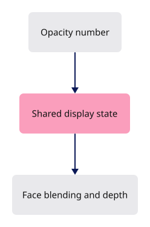

# 36 · Translucent faces and Opacity

**Estimated study time: about 2–5 hours.** Includes reading, typing, tracing, testing and experiments. [How to use this estimate](map.md#time-estimates).

**This section:** Expose face opacity through the command and state layers.

**In the whole viewer:** The small command relies on blending, ordering and depth behavior already implemented by the renderer.

**Follow the data:** Opacity value → state method → face rendering rules → transparent appearance.

**Start with these files:** [`src/app/command/verbs/opacity.rs`](36-translucent-faces.md#code-36-003), [`src/state/features.rs`](36-translucent-faces.md#code-36-006).

**Aim to explain:** Why is parsing a valid opacity number not enough to make transparency correct?

[Whole-viewer map and course milestones](map.md)

Opacity controls how strongly faces contribute to the image. Zero makes faces invisible, while one restores opaque drawing. The command reads a number and sends it to the shared state method. Sorting, blending and depth rules remain the renderer’s responsibility.



Start from the working result of [step 35](35-attributes.md).

**One buildable step:** type the additions below in `workspace/handwritten`, then build and test. This step adds 90 lines across 5 files and may take several sittings. Individual listings are parts of this step, not separate build checkpoints.

<span id="code-36-001"></span>

## `src/app/command/tests.rs`

Append **after line 460** of your current file.

Blank lines before: **1**; after: **0**. End with a newline.

```rust
--8<-- "typing/code/36-001.rs"
```

<span id="code-36-002"></span>

## `src/app/command/verbs/mod.rs`

Insert **after line 46** of your current file.

Keep these preceding lines:

```rust
    show,                    // register:show
    fit,                     // register:fit
    escape,                  // register:escape
    layers,                  // register:layers
```

Keep these following lines:

```rust
    arrowhead,               // register:arrowhead
    attributes,              // register:attributes
    snap,                    // register:snap
    arctic,                  // register:arctic
```

Type these new lines:

```rust
--8<-- "typing/code/36-002.rs"
```

<span id="code-36-003"></span>

## `src/app/command/verbs/opacity.rs`

Create this file. Type the complete listing, including comments and blank lines.

```rust
--8<-- "typing/code/36-003.rs"
```

<span id="code-36-004"></span>

## `src/state.rs`

Insert **after line 120** of your current file.

Keep these preceding lines:

```rust
        // only the new rows go to the GPU
        self.scene.upload_to(&mut self.gpu);
        self.camera.grow_extent(&self.gpu.bounds);
        self.annotate_document(first_row); // register:scene_text
```

Keep these following lines:

```rust
        self.release_display_only(index, first_row, source); // register:release

        // the layer panel lists the new rows
        self.refresh_layers(); // register:panel
```

Type these new lines:

```rust
--8<-- "typing/code/36-004.rs"
```

<span id="code-36-005"></span>

## `src/state.rs`

Append **after line 1036** of your current file.

Blank lines before: **1**; after: **0**. End with a newline.

```rust
--8<-- "typing/code/36-005.rs"
```

<span id="code-36-006"></span>

## `src/state/features.rs`

Insert **after line 31** of your current file.

Keep these preceding lines:

```rust
    pub(crate) snap: Snapping,        // register:snap
    pub(crate) mark: Option<Mark>,    // register:measure
    pub(super) hierarchy: Hierarchy,  // register:hierarchy
    pub(super) pending_split: Option<splitting::Pending>, // register:split
```

Keep these following lines:

```rust
}

// Each list starts empty; a later lesson adds one line per hook.
// `fn(&mut State)` is a function pointer; a method such as `State::purge_idle` is one, with `self` as its first argument.
```

Type these new lines:

```rust
--8<-- "typing/code/36-006.rs"
```

## Check the completed chapter

From `session_viewer`, compare everything you have typed:

```sh
npm --prefix ../session_tests run course -- reference-check 36
```

From `workspace/handwritten`:

```sh
cargo build --lib --locked -j4
cargo xtest --lib --locked -j4
```

Run the native opacity tests. Try the three values in the browser and check that edges and selection still behave as described.

If translucent faces look incorrectly ordered, distinguish a valid command value from the renderer’s blending and depth behavior.


**Before moving on:** explain what changed, check the expected result above, and fix any build or test failure.

<details>
<summary>Check your explanation of the opening question</summary>

Correct appearance also depends on how faces are ordered, blended and compared against depth. Those responsibilities belong to the renderer.

</details>

[Next step: 37](37-command-dock.md)
