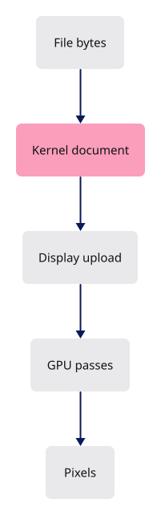
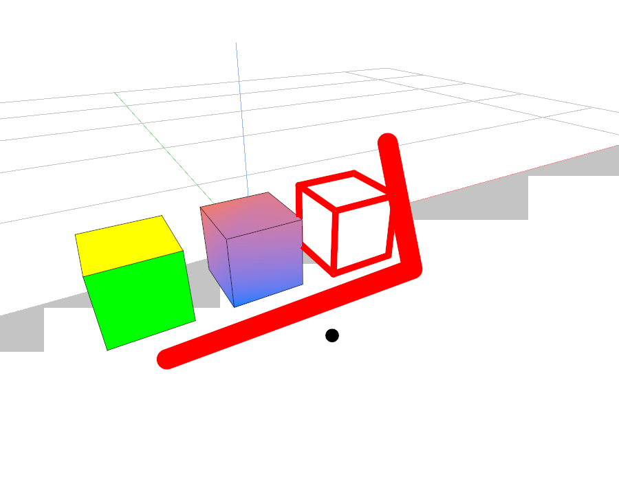

# 37 · Self-test: the finished viewer

**Estimated study time: about 15–30 hours.** Includes reading, typing, tracing, testing and experiments. [How to use this estimate](map.md#time-estimates).

**This section:** Exercise the finished viewer from a scene file through GPU output.

**In the whole viewer:** This closes the full course loop: loading, source identity, display generation, rendering and interactive editing now belong to one application.

**Follow the data:** Scene bytes → document → display rows → GPU frame and IDs → selection/edit → updated document.

**Start with these files:** [`src/selftest.rs`](37-command-dock.md#code-37-005), [`src/lib.rs`](37-command-dock.md#code-37-001).

**Aim to explain:** If a selected object moves on screen, how would you establish that the edit really changed the document?

[Whole-viewer map and course milestones](map.md)

You now have the same source as the maintained viewer. The final chapter connects file loading to scene upload and prepares a frame with the correct camera anchor. Use it to explain the whole route from an editable document to pixels, rather than memorizing every support file.



Start from the working result of [step 36](36-translucent-faces.md).

**One buildable step:** type the additions below in `workspace/handwritten`, then build and test. This step adds 1,088 lines across 8 files and may take several sittings. Individual listings are parts of this step, not separate build checkpoints.

<span id="code-37-001"></span>

## `src/lib.rs`

Append **after line 513** of your current file.

Blank lines before: **1**; after: **0**. End with a newline.

```rust
--8<-- "typing/code/37-001.rs"
```

<span id="code-37-002"></span>

## `examples/check_cad_fixture.rs`

Create this file. Type the complete listing, including comments and blank lines.

```rust
--8<-- "typing/code/37-002.rs"
```

<span id="code-37-003"></span>

## `examples/check_hidden_line_lifecycle.rs`

Create this file. Type the complete listing, including comments and blank lines.

```rust
--8<-- "typing/code/37-003.rs"
```

<span id="code-37-004"></span>

## `examples/selftest.rs`

Create this file. Type the complete listing, including comments and blank lines.

```rust
--8<-- "typing/code/37-004.rs"
```

<span id="code-37-005"></span>

## `src/selftest.rs`

A render test creates a scene, draws it and inspects output rather than trusting compilation alone. The expected result should distinguish the failure we care about, such as missing ink or stale geometry after an edit.

Create this file. Type the complete listing, including comments and blank lines.

```rust
--8<-- "typing/code/37-005.rs"
```

<span id="code-37-006"></span>

## `src/selftest/lifecycle.rs`

Create this file. Type the complete listing, including comments and blank lines.

```rust
--8<-- "typing/code/37-006.rs"
```

<span id="code-37-007"></span>

## `tests/color-channels.cjs`

Create this file. Type the complete listing, including comments and blank lines.

```javascript
--8<-- "typing/code/37-007.cjs"
```

<span id="code-37-008"></span>

## `tests/final-review.md`

Create this file. Type the complete listing, including comments and blank lines.

```markdown
--8<-- "typing/code/37-008.md"
```

## Check the completed chapter

From `session_viewer`, compare everything you have typed:

```sh
npm --prefix ../session_tests run course -- reference-check 37
```

From `workspace/handwritten`:

```sh
cargo build --lib --locked -j4
cargo xtest --lib --locked -j4
```

The checks above run the native suite. Then render the supplied scene:

```sh
cargo run --example selftest --target x86_64-unknown-linux-gnu -j4 -- final.ppm assets/view_local.yaml
```

Open `final.ppm`, then start the browser with `trunk serve --port 8780`. At http://localhost:8780/?data=off, enter `Point 300,200,200`, then `Undo`; the point should appear and disappear. Use `Save` to download the scene and `Open` to load that saved file. These commands exercise the same document that the renderer displays.

If the headless image differs from the browser, compare scene, camera, pixel size and display settings first. A screenshot alone cannot establish that those inputs were equal.



**Before moving on:** explain what changed, check the expected result above, and fix any build or test failure.

<details>
<summary>Check your explanation of the opening question</summary>

Inspect the committed source change and its undo record, then verify display synchronization. A temporary GPU preview can move pixels without committing an edit.

</details>
