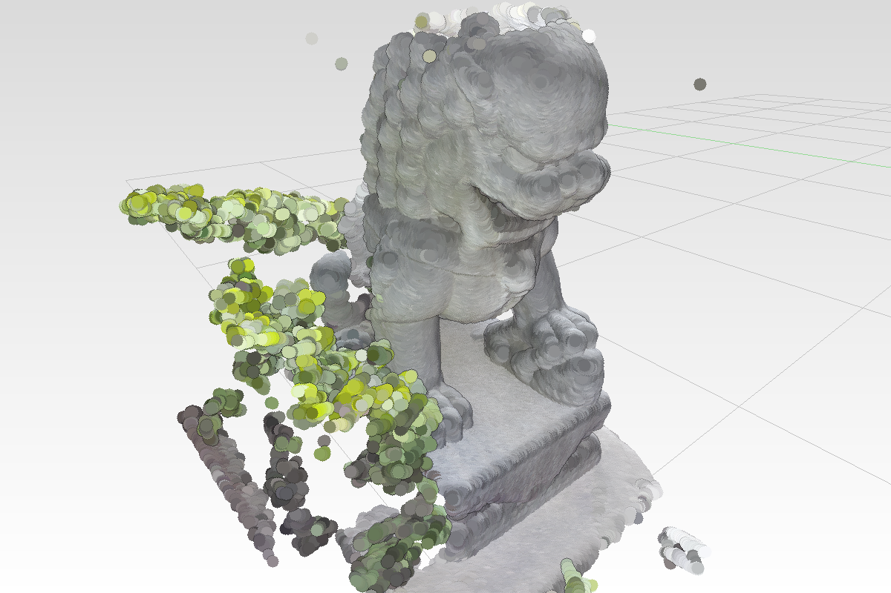
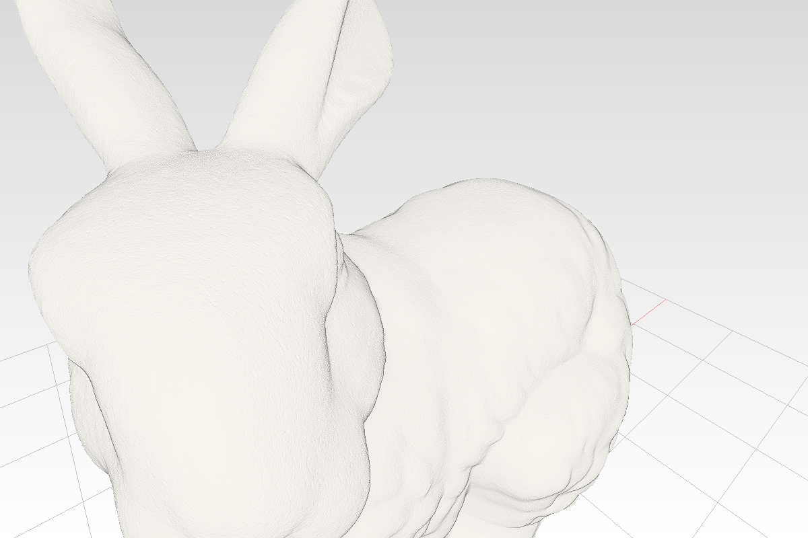

# 41 Cloud normals — lambert in the splat lane, and the clouds that carry it

> Direct-path chain (36-44); continues lesson [40](40-potree-look.md), which added EDL and
> attenuated sizes to lesson 39's splat lane.

## Goal

EDL shades a cloud that has no normals. A cloud that HAS them can do better: a real
lambert term, from an `oct16` normal already sitting unused in the point buffer. This
lesson lights the splat lane properly and then builds the two datasets the rest of the
chain uses — Potree's Takanawa lion (342k points, colours + normals) and a bunny sampled
off a mesh with exact ground-truth normals.

## Step 1 — normals: lambert for clouds that have them

The kernel's `PointCloud` has carried a `normals` array since the proto was written, and
lesson 36 already packs it oct16 into `point_nrm_buffer` — unused until now. The record
grows the model's rotation columns so the normal reaches world space even under a
rotated placement.

**1a.** In `src/shaders/splat.wgsl`, **find** (lesson 39's record width):

```wgsl
const REC_WORDS: u32 = 24u;
```

**Replace with:**

```wgsl
// The record table is read as RAW WORDS - 4-word header {n, total, 0, 0}, then 36 words per
// record: 16 matrix (mvp x model, column-major), 4 tint (.a = minimum radius px),
// {first, count, cum, k-bits}, then 12 words of the model's rotation columns for normals.
// Raw indexing sidesteps every struct-layout question between Rust packing and WGSL rules.
const REC_WORDS: u32 = 36u;
```

**1b.** Same file, **find**:

```wgsl
@group(1) @binding(3) var<storage, read_write> scolor: array<u32>;
```

**Add below it:**

```wgsl
@group(1) @binding(4) var<storage, read> normals: array<u32>; // oct16; MAX = point has none
```

**1c.** Same file, **find** (lesson 39's tint pack in `project`):

```wgsl
    let tint = vec4<f32>(rec_f(base, 16u), rec_f(base, 17u), rec_f(base, 18u), 1.0);
    s.color = pack4x8unorm(unpack4x8unorm(colors[i]) * tint);
```

**Replace with:**

```wgsl
    let tint = vec4<f32>(rec_f(base, 16u), rec_f(base, 17u), rec_f(base, 18u), 1.0); // .a is r_min
    var rgba = unpack4x8unorm(colors[i]) * tint;
    // LAMBERT, when the point HAS a normal (scans do not; sampled/imported clouds do). The
    // record's trailing words carry the model's rotation columns, so the oct16 normal reaches
    // world space; abs() because a scanned normal's orientation is a coin toss.
    let packed_n = normals[i];
    if (packed_n != 0xffffffffu) {
        let rot = mat3x3<f32>(
            vec3<f32>(rec_f(base, 24u), rec_f(base, 25u), rec_f(base, 26u)),
            vec3<f32>(rec_f(base, 28u), rec_f(base, 29u), rec_f(base, 30u)),
            vec3<f32>(rec_f(base, 32u), rec_f(base, 33u), rec_f(base, 34u)),
        );
        let nw = normalize(rot * oct16_decode(packed_n));
        let light = normalize(vec3<f32>(0.4, 0.4, 0.8)); // fixed key light
        let lambert = 0.25 + 0.75 * abs(dot(nw, light));
        rgba = vec4<f32>(rgba.rgb * lambert, rgba.a);
    }
    s.color = pack4x8unorm(rgba);
```

**1d.** Same file, at the very end (after `cs_color`'s closing brace), **add:**

```wgsl

// Octahedral decode: undo the fold, then normalize - the mirror of scene.rs oct16().
fn oct16_decode(p: u32) -> vec3<f32> {
    let e = vec2<f32>(
        f32(i32(p << 24u) >> 24u) / 127.0,
        f32(i32(p << 16u) >> 24u) / 127.0,
    );
    var n = vec3<f32>(e, 1.0 - abs(e.x) - abs(e.y));
    if (n.z < 0.0){
        let sgn = vec2<f32>(select(1.0, -1.0, n.x < 0.0), select(1.0, -1.0, n.y < 0.0));
        n = vec3<f32>((1.0 - abs(n.y)) * sgn.x, (1.0 - abs(n.x)) * sgn.y, n.z);
    }
    return normalize(n);
}
```

**1e.** The fifth binding, CPU side. In `src/engine/gpu/mod.rs`, **find** (the group-1
layout in `Gpu::new`):

```wgsl
                Self::splat_entry(3, wgpu::BufferBindingType::Storage { read_only: false }),
```

**Add below it:**

```rust
                Self::splat_entry(4, wgpu::BufferBindingType::Storage { read_only: true }),
```

**Find** in `mk_splat_group1`'s parameter list:

```rust
        col: &wgpu::Buffer,
```

**Add below it** (the normals ride next to the colours; the BINDING number below is what the
shader reads, so the parameter's position in the list is free):

```rust
        nrm: &wgpu::Buffer,
```

**Find** (inside `mk_splat_group1`):

```rust
                wgpu::BindGroupEntry{binding: 3, resource: scolor.as_entire_binding()},
```

**Add below it:**

```rust
                wgpu::BindGroupEntry{binding: 4, resource: nrm.as_entire_binding()},
```

**Find** (call site in `Gpu::new`):

```rust
            &point_col_buffer,
```

**Add below it:**

```rust
            &point_nrm_buffer,
```

**Find** (call site in `rebuild_splat_groups` — this one IS a single line):

```rust
        self.splat_group1 = Self::mk_splat_group1(&self.device, &self.splat_group1_layout, &self.point_buffer, &self.point_col_buffer, &self.splat_depth_buf, &self.splat_color_buf);
```

**Replace with:**

```rust
        self.splat_group1 = Self::mk_splat_group1(&self.device, &self.splat_group1_layout, &self.point_buffer, &self.point_col_buffer, &self.point_nrm_buffer, &self.splat_depth_buf, &self.splat_color_buf);
```

**1f.** The rotation columns ride the record. In `encode_frame`, **find** (the k push
from lesson 40's step 2c):

```rust
                    recs.extend_from_slice(bytemuck::cast_slice(&[first, count, cum, (k as f32).to_bits()]));
```

**Add below it:**

```rust
                    // the MODEL rotation columns (translation-free), so a cloud with
                    // normals can rotate them into world space for the lambert term
                    let b = &row.model;
                    recs.extend_from_slice(bytemuck::cast_slice(&[
                        b[0], b[1], b[2], 0.0f32,
                        b[4], b[5], b[6], 0.0,
                        b[8], b[9], b[10], 0.0,
                    ]));
```

## Step 2 — demo data: clouds that HAVE normals

Two generator tools; both write `.pb`s that already ship in `assets/pb`, so typing them
is optional if you only want to render.

**The real one: Potree's own Takanawa lion** — 342k points with colours AND
`NORMAL_OCT16` normals, in the Potree 1.x octree format. The format is pleasantly
decodable: every point lives in exactly ONE node file, so the union of all `r*.bin`
files IS the cloud; a node's box comes from the root cube by walking its name's digits
(bit 4 = +x half, 2 = +y, 1 = +z); positions are `u32 × scale` relative to that box's
min; normals are two UNSIGNED bytes, octahedral. 18 bytes a record.

**Create `examples/potree_import.rs`** (cargo auto-discovers it):

```rust
// Import a Potree 1.x octree (POSITION_CARTESIAN + COLOR_PACKED + NORMAL_OCT16) into one
// kernel PointCloud .pb. Every point lives in exactly ONE node file, so the union of all
// r*.bin files IS the cloud; each node's positions are u32 * scale relative to the NODE's
// bounding box min, and a node's box comes from the root cube by walking the digits of its
// name (bit 4 = +x half, bit 2 = +y half, bit 1 = +z half).
//
// cargo run --example potree_import --target x86_64-unknown-linux-gnu --release -- \
//     assets/lion_src assets/pb/lion.pb 1000

fn main() {
    let a: Vec<String> = std::env::args().skip(1).collect();
    let dir = a.first().cloned().unwrap_or_else(|| "assets/lion_src".into());
    let out = a.get(1).cloned().unwrap_or_else(|| "assets/pb/lion.pb".into());
    let unit: f64 = a.get(2).and_then(|v| v.parse().ok()).unwrap_or(1000.0); // metres -> mm

    let cloud: serde_json::Value =
        serde_json::from_str(&std::fs::read_to_string(format!("{dir}/cloud.js")).expect("cloud.js")).expect("json");
    let bb = &cloud["boundingBox"];
    let root_min = [bb["lx"].as_f64().unwrap(), bb["ly"].as_f64().unwrap(), bb["lz"].as_f64().unwrap()];
    let root_size = bb["ux"].as_f64().unwrap() - root_min[0]; // potree root is a cube
    let scale = cloud["scale"].as_f64().unwrap();

    let mut coords = Vec::new();
    let mut colors = Vec::new();
    let mut normals = Vec::new();
    let mut files: Vec<_> = std::fs::read_dir(&dir).unwrap()
        .filter_map(|e| e.ok().map(|e| e.path()))
        .filter(|p| p.extension().is_some_and(|e| e == "bin"))
        .collect();
    files.sort();
    for path in &files {
        let name = path.file_stem().unwrap().to_str().unwrap(); // "r", "r07", ...
        let (mut min, mut size) = (root_min, root_size);
        for d in name[1..].chars() {
            let i = d.to_digit(10).unwrap();
            size *= 0.5;
            if i & 0b100 != 0 { min[0] += size; }
            if i & 0b010 != 0 { min[1] += size; }
            if i & 0b001 != 0 { min[2] += size; }
        }
        let data = std::fs::read(path).unwrap();
        for rec in data.chunks_exact(18) {
            for k in 0..3 {
                let v = u32::from_le_bytes(rec[k * 4..k * 4 + 4].try_into().unwrap()) as f64;
                coords.push((v * scale + min[k]) * unit);
            }
            colors.extend_from_slice(&[rec[12] as i32, rec[13] as i32, rec[14] as i32, 255]);
            // potree NORMAL_OCT16: two UNSIGNED bytes mapped to [-1,1], octahedral unfold
            let u = rec[16] as f64 / 255.0 * 2.0 - 1.0;
            let v = rec[17] as f64 / 255.0 * 2.0 - 1.0;
            let z = 1.0 - u.abs() - v.abs();
            let (x, y) = if z < 0.0 {
                let s = |t: f64| if t < 0.0 { -1.0 } else { 1.0 };
                ((1.0 - v.abs()) * s(u), (1.0 - u.abs()) * s(v))
            } else { (u, v) };
            let l = (x * x + y * y + z * z).sqrt().max(1e-9);
            normals.extend_from_slice(&[x / l, y / l, z / l]);
        }
    }
    let n = coords.len() / 3;
    let mut pc = session_rust::PointCloud::from_coords(coords, colors, normals);
    pc.point_size = 3.0;
    pc.name = "lion_takanawa".to_string();
    let mut s = session_rust::Session::new("lion_takanawa");
    s.add_pointcloud(pc, None);
    s.pb_dump(&out);
    println!("wrote {out}: {n} points from {} nodes", files.len());
}
```

**Nothing to download, nothing to run.** `assets/pb/lion.pb` (341,989 points, 18 MB) is in the
repo — skip to *Load them* below if you only want the picture. The importer is here because the
format is worth reading, and because the source it converts is tracked too (`assets/lion_src/`,
Potree's own export: `cloud.js` plus 77 `r*.bin` octree nodes, 6 MB). To rebuild the `.pb` —
three arguments, source directory, output, and the unit scale, since the lion is in METRES and the
viewer works in millimetres:

```bash
cargo run --example potree_import --target x86_64-unknown-linux-gnu --release -- \
    assets/lion_src assets/pb/lion.pb 1000
# wrote assets/pb/lion.pb: 341989 points from 77 nodes      (~0.1 s)
```

(Byte-identical output is not expected: every run mints fresh object guids, so the size matches and
the bytes do not.)

<details>
<summary>Where <code>assets/lion_src/</code> came from</summary>

Potree's `lion_takanawa_normals` — the variant WITH `NORMAL_OCT16`; the plain `lion_takanawa`
next to it has no normals and would leave this lesson's lambert term doing nothing. The importer reads
`cloud.js` and every `*.bin` beside it, so the download is flattened (node names `r`, `r07`, `r070`
are globally unique, which makes that safe):

```bash
mkdir -p assets/lion_src
curl -sL https://github.com/potree/potree/archive/refs/heads/develop.tar.gz \
  | tar -xz -C assets/lion_src --wildcards --transform 's|.*/||' --no-anchored \
      'lion_takanawa_normals/cloud.js' 'lion_takanawa_normals/data/r/*.bin'
```

One download instead of a file list: the dataset has no index and node names are not a guessable
sequence (`r0`, `r07`, `r070`, `r6`, … only occupied octants exist), so fetching them one at a time
means first asking GitHub's API to list them. `--transform 's|.*/||'` drops every directory from the
member names; the two patterns keep the other 53 MB of the repository out.

</details>

**The synthetic one** — a mesh sampled into a cloud with EXACT ground-truth normals, to
check shading against (`assets/scenes/bunny_cloud.toml` keeps it one keypress away).

**Create `examples/mk_bunny_cloud.rs`:**

```rust
// Sample a mesh's surface into a point cloud WITH normals - the demo data for the splat
// lane's lambert shading (scans carry no normals; a sampled surface does). Area-weighted
// triangle sampling, barycentric position + interpolated vertex normal per point.
//
// cargo run --example mk_bunny_cloud --target x86_64-unknown-linux-gnu --release -- \
//     assets/pb/mesh_bunny_grey.pb assets/pb/bunny_cloud.pb 400000

fn main() {
    let a: Vec<String> = std::env::args().skip(1).collect();
    let src = a.first().cloned().unwrap_or_else(|| "assets/pb/mesh_bunny_grey.pb".into());
    let out = a.get(1).cloned().unwrap_or_else(|| "assets/pb/bunny_cloud.pb".into());
    let count: usize = a.get(2).and_then(|v| v.parse().ok()).unwrap_or(400_000);

    let bytes = std::fs::read(&src).expect("read src pb");
    let session = session_rust::Session::pb_loads(&bytes).expect("parse src pb");
    let mesh = session.order().into_iter().find_map(|g| match session.lookup.get(&g) {
        Some(session_rust::Geometry::Mesh(m)) => Some(m.clone()),
        _ => None,
    }).expect("no mesh in source pb");

    let rm = mesh.to_render();
    // cumulative triangle areas for area-weighted sampling
    let tri = |i: usize| {
        let f = [rm.indices[i * 3] as usize, rm.indices[i * 3 + 1] as usize, rm.indices[i * 3 + 2] as usize];
        f.map(|k| rm.vertices[k].clone())
    };
    let ntri = rm.indices.len() / 3;
    let mut cum = Vec::with_capacity(ntri);
    let mut total = 0.0f64;
    for i in 0..ntri {
        let [a, b, c] = tri(i);
        let u = [b.position[0] as f64 - a.position[0] as f64, b.position[1] as f64 - a.position[1] as f64, b.position[2] as f64 - a.position[2] as f64];
        let v = [c.position[0] as f64 - a.position[0] as f64, c.position[1] as f64 - a.position[1] as f64, c.position[2] as f64 - a.position[2] as f64];
        let x = [u[1] * v[2] - u[2] * v[1], u[2] * v[0] - u[0] * v[2], u[0] * v[1] - u[1] * v[0]];
        total += 0.5 * (x[0] * x[0] + x[1] * x[1] + x[2] * x[2]).sqrt();
        cum.push(total);
    }

    // deterministic LCG - no rand dependency, same cloud every run
    let mut state = 0x2545F491_4F6CDD1Du64;
    let mut rnd = move || { state = state.wrapping_mul(6364136223846793005).wrapping_add(1442695040888963407); (state >> 33) as f64 / (1u64 << 31) as f64 };

    let mut coords = Vec::with_capacity(count * 3);
    let mut colors = Vec::with_capacity(count * 4);
    let mut normals = Vec::with_capacity(count * 3);
    for _ in 0..count {
        let r = rnd() * total;
        let t = cum.partition_point(|&c| c < r).min(ntri - 1);
        let [va, vb, vc] = tri(t);
        // uniform barycentric via the sqrt trick
        let (mut b1, mut b2) = (rnd(), rnd());
        if b1 + b2 > 1.0 { b1 = 1.0 - b1; b2 = 1.0 - b2; }
        let b0 = 1.0 - b1 - b2;
        for k in 0..3 {
            coords.push(b0 * va.position[k] as f64 + b1 * vb.position[k] as f64 + b2 * vc.position[k] as f64);
            normals.push(b0 * va.normal[k] as f64 + b1 * vb.normal[k] as f64 + b2 * vc.normal[k] as f64);
        }
        // near-white so the lambert term IS the picture
        colors.extend_from_slice(&[235, 230, 220, 255]);
    }

    let mut pc = session_rust::PointCloud::from_coords(coords, colors, normals);
    pc.point_size = 3.0;
    pc.name = "bunny_cloud".to_string();
    let mut s = session_rust::Session::new("bunny_cloud");
    s.add_pointcloud(pc, None);
    s.pb_dump(&out);
    println!("wrote {out}: {count} points with normals");
}
```

**Also already built.** `assets/pb/bunny_cloud.pb` (400,000 points, 21 MB) is in the repo, sampled
from `assets/pb/mesh_bunny_grey.pb` — the Stanford bunny, 35,947 vertices, repainted to one object
colour, tracked beside it. To resample: three arguments, source mesh, output cloud, and how many
points to scatter over the surface:

```bash
cargo run --example mk_bunny_cloud --target x86_64-unknown-linux-gnu --release -- \
    assets/pb/mesh_bunny_grey.pb assets/pb/bunny_cloud.pb 400000
# wrote assets/pb/bunny_cloud.pb: 400000 points with normals      (~0.2 s)
```

The count is the only knob, and it matters less than it looks. Sampling is area-weighted, so points
land at even density over the surface instead of clumping on small triangles, and lesson 40's attenuation then sizes
each splat by the cloud's own measured spacing — so a 400k and a 1.5M bunny draw the same picture
(4741 vs 4741 non-background pixels at one zoom, 4298 vs 4303 at another); the sparser one just
uses bigger dots. What earns this dataset its place is the normals: every point carries the
barycentric-interpolated vertex normal, so unlike a scan's estimated normals these are exact, and a
shading bug has nowhere to hide.

**Load them.** Both clouds already have a scene, so the quickest look is a URL — the page takes the
manifest as a query parameter, so switching costs no rebuild:

```
http://127.0.0.1:8770/?scene=scenes/lion.toml
http://127.0.0.1:8770/?scene=scenes/bunny_cloud.toml
```

### Adding them to the scene you actually use

Nothing to create: a manifest is a LIST, so a cloud joins a scene as one more `[[items]]` block in
the `.toml` you already have open. The default scene, `assets/scenes/bunny_drawings.toml`, already
loads the lion (third item) — so the one edit left is the bunny cloud. Append:

```toml
[[items]]  # the sampled cloud, beside the mesh it came from
file = "pb/bunny_cloud.pb"
name = "bunny cloud"
xform = [12845,0,0,0,  0,0,12845,0,  0,-12845,0,0,  6000,0,600,1]
point_size = 6
```

Save and reload the page — `Trunk.toml` watches `assets/scenes`, so writing the file is the whole
loop. The log line confirms it:

```
scene: 148560 objects  645635 arena verts  258604 segments  741989 cloud points
```

741,989 = the lion's 341,989 plus the bunny's 400,000. The four fields are the whole schema:

- `file` — path under `assets/`.
- `name` — what the log and the tree call it.
- `at = [x, y, z]` — a translation in mm, applied ON TOP of the file's own coordinates. Not an
  absolute position: a scan carrying survey coordinates can sit kilometres away at `at = [0,0,0]`,
  the camera fits both, and everything becomes a speck. `xform = [16 numbers]` instead when you
  need rotation or scale — the block above reuses the bunny mesh's own matrix (scale 12845, Z-up)
  and moves it to x = 6000, so the cloud stands beside the mesh it was sampled from rather than
  inside it. Omit both and the loader falls back to an auto-grid.
- `point_size` — per item, so a dense scan and a sparse one can each look right in one scene.

Headless, which is where every number in *Expected state* comes from:

```bash
VIEWER_W=1200 VIEWER_H=800 VIEWER_ZOOM=6 VIEWER_ORBIT="25,-10" \
cargo run --example selftest --target x86_64-unknown-linux-gnu --release -- \
    out.ppm assets/scenes/lion.toml
```

## What is still Potree's, not ours

The octree. Potree preprocesses (PotreeConverter) into a multi-res hierarchy and streams
nodes by screen-space error under a point budget — that is both its unbounded scale AND
its uniform on-screen density. Lesson [44](44-cloud-octree.md) builds exactly that for
the WALKED lane, on the kernel's own `SpatialOctree`.

## Expected state

- Both shaders `naga`-clean; wasm check clean; the examples build.
- The lion, now shaded (same command as lesson 36):
  `non-background pixels: 325369 (33.9%)` — attenuation fills the surface, lambert and
  EDL light it.



- The sampled bunny (`assets/scenes/bunny_cloud.toml`, ground-truth normals):


