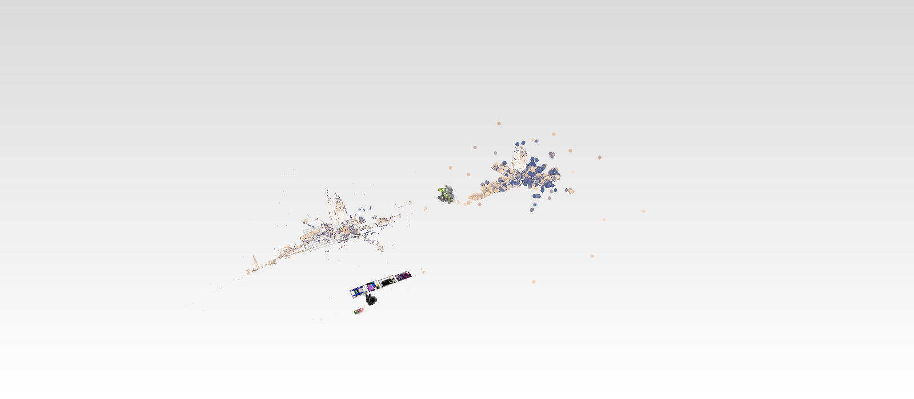

# 43 Cloud scenes — datasets, bbox packing, and the stress test

> Direct-path chain (36–44); replay-verified.

## Goal

Assemble the scene that exercises everything: real datasets placed by MEASURED bounding
boxes, and the final numbers the chain has earned.

## Placing clouds: pack by bounding box, but the RIGHT box

Hand-guessed translations either overlap scans or strand them 90 m apart. The honest way
is to measure: `examples/pb_bbox.rs` loads each `.pb` and prints every cloud's min/max
bounds — and, crucially, its **2–98 percentile box**:

```
assets/pb/lidar_scan000.pb  min/max ~67 x 69 x 33 m   p2..p98 ~9.8 x 8.4 x 4.2 m
```

A terrestrial scan's min/max box is mostly empty air — a handful of sparse far returns
inflate it 7×. Packing on it leaves the dense cores tens of metres apart; packing on the
percentile core with no margin makes the outskirts overlap. The layout that works:
**cursor-pack the percentile cores along x with a deliberate visible gap (25 m here),
centre each core's y on 0, and ground each floor (p2 z) at 0** — the last part is what
makes unregistered scans sit on one shared ground plane. Rotated placements (the lion's
xform) get their box corners transformed before packing. The translations in
`cloud_mix.json` are those numbers, with the measurement command in the comment.

## The stress scene

`assets/scenes/cloud_mix.toml`: the bunny mesh (104k edge tubes), four architectural
sheets, the pen-test boxes — and three clouds, each showing a different part of the lane:

- **scan000** — 3.65 M points, reflectance colours, no normals, `point_size: 1`
- **Takanawa lion** — 342k points, colours AND normals (lesson [41](41-potree-look.md)),
  `point_size: 3`
- **scan006** — 3.50 M points, `point_size: 6`

Three sizes on screen at once is the per-cloud size feature demonstrating itself; the
lion's lambert against the scans' EDL-only shading is the normals feature doing the same.

## The numbers this chain ends on

Intel RPL-S iGPU (Vulkan under BrowserWebGpu), 1332×927, rAF medians:

```
        full scene, 7.5 M cloud points + 210k objects     presented fps
        ─────────────────────────────────────────────     ─────────────
        fit view, idle                                    60
        fit view, orbiting                                60
        fit view, wheel-zooming                           60
        deep zoom inside a scan, orbiting                 60
```

The remaining known costs are NOT the clouds: the load-phase jank (1–3 fps while sheets
parse) is the main-thread prost decode — lesson [44](44-streaming-cloud.md)'s territory —
and the occasional 20 ms rebase blip is the 210k-object instance table, throttled to
≤5/s by lesson [39](39-big-scenes.md).

## Tooling steps this lesson adds

**Create `examples/pb_bbox.rs`** (the measurement tool behind the packing numbers):

```rust
// Print each point cloud's bounding box from .pb files - feeds the bbox-packing layout.
fn main() {
    for path in std::env::args().skip(1) {
        let bytes = std::fs::read(&path).expect("read");
        let s = session_rust::Session::pb_loads(&bytes).expect("parse");
        for g in s.order() {
            if let Some(session_rust::Geometry::PointCloud(pc)) = s.lookup.get(&g) {
                let c = pc.coords();
                let mut mn = [f64::INFINITY; 3];
                let mut mx = [f64::NEG_INFINITY; 3];
                for i in (0..c.len()).step_by(3) {
                    for k in 0..3 { mn[k] = mn[k].min(c[i + k]); mx[k] = mx[k].max(c[i + k]); }
                }
                // percentile bounds too: a scan's min/max box is mostly empty air
                let n = c.len() / 3;
                let mut pl = [0.0f64; 3];
                let mut ph = [0.0f64; 3];
                for k in 0..3 {
                    let mut v: Vec<f64> = (0..n).step_by((n / 20000).max(1)).map(|i| c[i * 3 + k]).collect();
                    v.sort_by(|a, b| a.partial_cmp(b).unwrap());
                    pl[k] = v[v.len() * 2 / 100];
                    ph[k] = v[v.len() * 98 / 100];
                }
                println!("{path} {mn:?} {mx:?} p2 {pl:?} p98 {ph:?}");
            }
        }
    }
}
```

**The frame benchmark.** In `src/selftest.rs`, **find** (the final render in
`render_scene`):

```rust
    let rgba = gpu.render_offscreen(wgpu::Color { r: 0.9, g: 0.9, b: 0.9, a: 1.0 }, &view_proj);
```

**Add above it:**

```rust
    // VIEWER_FRAMES=N times N full offscreen frames (each one submits and reads
    // back, so the wall clock includes the GPU actually finishing) and reports the median.
    if let Some(n) = std::env::var("VIEWER_FRAMES").ok().and_then(|v| v.parse::<usize>().ok()).map(|n| n.max(1)) {
        let mut ms: Vec<f64> = Vec::new();
        for _ in 0..n {
            let t = std::time::Instant::now();
            let _ = gpu.render_offscreen(wgpu::Color { r: 0.9, g: 0.9, b: 0.9, a: 1.0 }, &view_proj);
            ms.push(t.elapsed().as_secs_f64() * 1000.0);
        }
        ms.sort_by(|a, b| a.partial_cmp(b).unwrap());
        println!("frames: n={} median {:.1} ms ({:.0} fps) min {:.1} max {:.1} | cloud scale x{}",
            n, ms[n / 2], 1000.0 / ms[n / 2], ms[0], ms[n - 1], gpu.cloud_size);
    }
```

Same-camera frames hit lesson 40's static skip, so this measures the CACHED path; treat
it comparatively.

**The browser scene.** In `src/lib.rs`, **find**:

```rust
const DEMO_SCENE_URL: &str = "scenes/bunny_drawings.toml";
```

**Replace with:**

```rust
const DEMO_SCENE_URL: &str = "scenes/cloud_mix.toml"; // was bunny_drawings.json
```

The scene manifests themselves — `cloud_mix.json` (the packed stress scene),
`lion.json`, `bunny_cloud.json` — are data, in `assets/scenes/`.

## The rest of the tooling

Five more dev programs ship with this lesson. None of them is part of the viewer — they are
the instruments the last eight lessons were measured with, and later lessons run two of them
as gates.

**Create `examples/bench_load.rs`**:

```rust
//! Where the load time actually goes: prost decode vs object build vs lookup vs walk.
use std::time::Instant;
use std::rc::Rc;
use prost::Message;
use session_rust::{proto, Session, Geometry, Polyline, Point, Line, Mesh, PointCloud, Xform};
use session_viewer::app::scene::Scene;

fn main() {
    let path = std::env::args().nth(1).expect("usage: bench_load <file.pb>");
    let t = Instant::now();
    let bytes = std::fs::read(&path).unwrap();
    println!("read           {:>7.0} ms  ({:.1} MB)", t.elapsed().as_secs_f64()*1e3, bytes.len() as f64/1.048576e6);

    let t = Instant::now();
    let p = proto::Session::decode(&bytes[..]).unwrap();
    println!("prost decode   {:>7.0} ms  (full: objects + tree + graph)", t.elapsed().as_secs_f64()*1e3);
    let t = Instant::now();
    let lean = session_viewer::app::persistence::LeanSessionProbe::decode(&bytes[..]).unwrap();
    println!("lean decode    {:>7.0} ms  (objects + xforms only, {} xforms)", t.elapsed().as_secs_f64()*1e3, lean.xforms.len());

    {
        use prost::Message;
        fn count(n: &session_rust::proto::TreeNode) -> (usize, usize) {
            let mut c = 1; let mut b = n.name.len();
            for ch in &n.children { let (cc, bb) = count(ch); c += cc; b += bb; }
            (c, b)
        }
        let tree_len = p.tree.as_ref().map_or(0, |t| t.encoded_len());
        let (nodes, namebytes) = p.tree.as_ref().and_then(|t| t.root.as_ref()).map_or((0,0), count);
        println!("  tree: {:.1} MB encoded | {nodes} nodes | {:.1} MB of names", tree_len as f64/1.048576e6, namebytes as f64/1.048576e6);
        println!("  xforms: {} entries | graph {:.1} MB", p.xforms.len(), p.graph.as_ref().map_or(0, |g| g.encoded_len()) as f64/1.048576e6);
        println!("  objects total: {:.1} MB", p.objects.as_ref().map_or(0, |o| o.encoded_len()) as f64/1.048576e6);
    }
    {
        use prost::Message;
        use session_rust::proto as sp;
        #[derive(Clone, PartialEq, prost::Message)]
        struct LinesOnly { #[prost(message, repeated, tag = "4")] lines: Vec<sp::Line> }
        #[derive(Clone, PartialEq, prost::Message)]
        struct MeshesOnly { #[prost(message, repeated, tag = "9")] meshes: Vec<sp::Mesh> }
        #[derive(Clone, PartialEq, prost::Message)]
        struct LinesSess { #[prost(message, optional, tag = "3")] objects: Option<LinesOnly> }
        #[derive(Clone, PartialEq, prost::Message)]
        struct MeshSess { #[prost(message, optional, tag = "3")] objects: Option<MeshesOnly> }
        let t = Instant::now();
        let l = LinesSess::decode(&bytes[..]).unwrap();
        println!("  lines only   {:>7.0} ms  ({} lines)", t.elapsed().as_secs_f64()*1e3, l.objects.map_or(0, |o| o.lines.len()));
        // Wire-identical mirror: protobuf encodes map<K,V> exactly as repeated {K key=1; V value=2},
        // so declaring the map fields `repeated` turns 700k+ hashed map inserts into Vec pushes.
        #[derive(Clone, PartialEq, prost::Message)]
        struct VEntry { #[prost(uint64, tag="1")] k: u64, #[prost(message, optional, tag="2")] v: Option<sp::VertexData> }
        #[derive(Clone, PartialEq, prost::Message)]
        struct FEntry { #[prost(uint64, tag="1")] k: u64, #[prost(message, optional, tag="2")] v: Option<sp::FaceData> }
        #[derive(Clone, PartialEq, prost::Message)]
        struct LeanMeshP {
            #[prost(message, repeated, tag="3")] vertices: Vec<VEntry>,
            #[prost(message, repeated, tag="4")] faces: Vec<FEntry>,
        }
        #[derive(Clone, PartialEq, prost::Message)]
        struct LeanMeshesOnly { #[prost(message, repeated, tag = "9")] meshes: Vec<LeanMeshP> }
        #[derive(Clone, PartialEq, prost::Message)]
        struct LeanMeshSess { #[prost(message, optional, tag = "3")] objects: Option<LeanMeshesOnly> }
        let t = Instant::now();
        let lm = LeanMeshSess::decode(&bytes[..]).unwrap();
        let (nv, nf) = lm.objects.as_ref().map_or((0,0), |o| (
            o.meshes.iter().map(|m| m.vertices.len()).sum::<usize>(),
            o.meshes.iter().map(|m| m.faces.len()).sum::<usize>()));
        println!("  meshes VEC   {:>7.0} ms  ({nv} verts {nf} faces, no map hashing)", t.elapsed().as_secs_f64()*1e3);

        // Decode the map fields as repeated entries (wire-identical), then BULK-BUILD the
        // BTreeMap the generated type wants. std's FromIterator sorts + bulk-builds, which beats
        // 362k individual B-tree inserts.
        let t = Instant::now();
        let lm2 = LeanMeshSess::decode(&bytes[..]).unwrap();
        let t2 = Instant::now();
        let mut nb = 0usize;
        if let Some(o) = lm2.objects {
            for mm in o.meshes {
                let v: std::collections::BTreeMap<u64, sp::VertexData> =
                    mm.vertices.into_iter().filter_map(|e| e.v.map(|x| (e.k, x))).collect();
                let f: std::collections::BTreeMap<u64, sp::FaceData> =
                    mm.faces.into_iter().filter_map(|e| e.v.map(|x| (e.k, x))).collect();
                nb += v.len() + f.len();
            }
        }
        println!("  VEC+bulk     {:>7.0} ms  (decode {:.0} + build {:.0}, {nb} entries)",
            t.elapsed().as_secs_f64()*1e3, (t2 - t).as_secs_f64()*1e3, t2.elapsed().as_secs_f64()*1e3);

        let t = Instant::now();
        let m = MeshSess::decode(&bytes[..]).unwrap();
        println!("  meshes only  {:>7.0} ms  ({} meshes)", t.elapsed().as_secs_f64()*1e3, m.objects.map_or(0, |o| o.meshes.len()));
    }
    let o = p.objects.as_ref().unwrap();
    println!("  counts: {} pts {} lines {} plines {} meshes {} clouds",
        o.points.len(), o.lines.len(), o.polylines.len(), o.meshes.len(), o.pointclouds.len());

    if let Some(l) = o.lines.first() {
        println!("  sample line: encoded {} B | guid {:?} name {:?} dash {} start.guid {:?} start.name {:?} color {:?}",
            l.encoded_len(), l.guid, l.name, l.dash.len(),
            l.start.as_ref().map(|p| p.guid.clone()), l.start.as_ref().map(|p| p.name.clone()), l.linecolor.is_some());
        let tot: usize = o.lines.iter().map(|l| l.encoded_len()).sum();
        let guids: usize = o.lines.iter().map(|l| l.guid.len() + l.name.len()
            + l.start.as_ref().map_or(0, |p| p.guid.len()+p.name.len())
            + l.end.as_ref().map_or(0, |p| p.guid.len()+p.name.len())).sum();
        let dash: usize = o.lines.iter().map(|l| l.dash.len()*8).sum();
        println!("  lines total {:.1} MB | guid+name {:.1} MB | dash {:.1} MB",
            tot as f64/1.048576e6, guids as f64/1.048576e6, dash as f64/1.048576e6);
    }

    {
        use prost::Message;
        let ms = &o.meshes;
        let tot: usize = ms.iter().map(|m| m.encoded_len()).sum();
        let he: usize = ms.iter().map(|m| m.halfedges.iter().map(|(k,v)| {
            let inner: usize = v.neighbors.len() * 4 + 2;
            let _ = k; inner + 6
        }).sum::<usize>()).sum();
        let he_entries: usize = ms.iter().map(|m| m.halfedges.values().map(|v| v.neighbors.len()).sum::<usize>()).sum();
        let verts: usize = ms.iter().map(|m| m.vertices.len()).sum();
        let attrs: usize = ms.iter().map(|m| m.vertices.values().map(|v| v.attributes.len()).sum::<usize>()).sum();
        let faces: usize = ms.iter().map(|m| m.faces.len()).sum();
        println!("  meshes: {:.1} MB encoded | {verts} verts ({attrs} attr entries) | {faces} faces | halfedge {he_entries} entries ~{:.1} MB",
            tot as f64/1.048576e6, he as f64/1.048576e6);
    }

    // object build only (no lookup)
    let o = p.objects.unwrap();
    let t = Instant::now();
    let plines: Vec<Rc<Polyline>> = o.polylines.into_iter().map(|x| Rc::new(Polyline::from_proto(x))).collect();
    println!("polyline build {:>7.0} ms  ({} objs)", t.elapsed().as_secs_f64()*1e3, plines.len());
    let t = Instant::now();
    let lines: Vec<Rc<Line>> = o.lines.into_iter().map(|x| Rc::new(Line::from_proto(x))).collect();
    println!("line build     {:>7.0} ms  ({} objs)", t.elapsed().as_secs_f64()*1e3, lines.len());
    let t = Instant::now();
    let meshes: Vec<Rc<Mesh>> = o.meshes.into_iter().map(|x| Rc::new(Mesh::from_proto(x))).collect();
    println!("mesh build     {:>7.0} ms  ({} objs)", t.elapsed().as_secs_f64()*1e3, meshes.len());
    let t = Instant::now();
    let clouds: Vec<Rc<PointCloud>> = o.pointclouds.into_iter().map(|x| Rc::new(PointCloud::from_proto(x))).collect();
    println!("cloud build    {:>7.0} ms  ({} objs)", t.elapsed().as_secs_f64()*1e3, clouds.len());

    // lookup insert cost, measured on its own
    let mut s = Session::new("bench");
    let t = Instant::now();
    for g in &lines { s.lookup.insert(g.guid().to_string(), Geometry::Line(Rc::clone(g))); }
    for g in &plines { s.lookup.insert(g.guid().to_string(), Geometry::Polyline(Rc::clone(g))); }
    for g in &meshes { s.lookup.insert(g.guid().to_string(), Geometry::Mesh(Rc::clone(g))); }
    for g in &clouds { s.lookup.insert(g.guid().to_string(), Geometry::PointCloud(Rc::clone(g))); }
    println!("lookup insert  {:>7.0} ms  ({} keys)", t.elapsed().as_secs_f64()*1e3, s.lookup.len());
    s.objects.polylines = plines;
    s.objects.lines = lines;
    s.objects.meshes = meshes;
    s.objects.pointclouds = clouds;

    {
        // Do the sheet's fills share a plane? If so the depth buffer cannot order them.
        let mut zs: std::collections::BTreeMap<i64, usize> = std::collections::BTreeMap::new();
        for m in &s.objects.meshes {
            for (_, v) in &m.vertex { *zs.entry((v.z * 1e6).round() as i64).or_insert(0) += 1; }
        }
        let shown: Vec<String> = zs.iter().take(6).map(|(z, n)| format!("z={:.6} x{n}", *z as f64 / 1e6)).collect();
        println!("  mesh vertex Z levels: {} distinct -> {}", zs.len(), shown.join(", "));
    }

    {
        // What distinguishes text from hatch? Look at the names/colors the importer wrote.
        let mut mnames: std::collections::BTreeMap<String, usize> = std::collections::BTreeMap::new();
        for m in &s.objects.meshes { *mnames.entry(m.name.clone()).or_insert(0) += 1; }
        println!("  mesh names: {:?}", mnames.iter().take(12).collect::<Vec<_>>());
        fn walk(n: &session_rust::proto::TreeNode, out: &mut std::collections::BTreeMap<String, usize>, d: usize) {
            if d < 3 { *out.entry(format!("d{d}:{}", n.name)).or_insert(0) += 1; }
            for c in &n.children { walk(c, out, d + 1); }
        }
        let mut tn: std::collections::BTreeMap<String, usize> = std::collections::BTreeMap::new();
        if let Some(t) = p.tree.as_ref().and_then(|t| t.root.as_ref()) { walk(t, &mut tn, 0); }
        println!("  tree names (depth<3): {:?}", tn.iter().take(14).collect::<Vec<_>>());
        for (i, m) in s.objects.meshes.iter().enumerate() {
            let oc = m.objectcolor();
            let n = m.number_of_vertices();
            let f = m.face.len();
            let ws: Vec<f64> = m.widths().iter().take(2).copied().collect();
            println!("    mesh[{i}] verts {n:>7} faces {f:>7} color ({:.2},{:.2},{:.2},a={:.2}) widths{:?} pcols {} fcols {}",
                oc.r, oc.g, oc.b, oc.a, ws, m.get_pointcolors().len(), m.get_facecolors().len());
        }
        let mut lnames: std::collections::BTreeMap<String, usize> = std::collections::BTreeMap::new();
        for l in &s.objects.lines { *lnames.entry(l.name.clone()).or_insert(0) += 1; }
        println!("  line names: {:?}", lnames.iter().take(12).collect::<Vec<_>>());
        
    }

    // Is the per-line cost really Point::new (name String + Color::black) x2?
    let t = Instant::now();
    let mut acc = 0.0f64;
    for l in &s.objects.lines { let a = l.start(); let b = l.end(); acc += a.to_f32()[0] as f64 + b.to_f32()[0] as f64; }
    println!("  start()+end()  {:>7.0} ms  (acc {acc:.0})", t.elapsed().as_secs_f64()*1e3);
    let t = Instant::now();
    let mut acc2 = 0.0f64;
    for l in &s.objects.lines { acc2 += l.length(); }
    println!("  length() only  {:>7.0} ms  (acc {acc2:.0})", t.elapsed().as_secs_f64()*1e3);

    let t = Instant::now();
    let mut closed = 0;
    for m in &s.objects.meshes { if m.is_closed() { closed += 1; } }
    println!("  is_closed()    {:>7.0} ms  ({closed}/{} closed)", t.elapsed().as_secs_f64()*1e3, s.objects.meshes.len());
    let t = Instant::now();
    let mut nv = 0;
    for m in &s.objects.meshes { nv += m.number_of_vertices(); }
    println!("  n_vertices()   {:>7.0} ms  ({nv} verts)", t.elapsed().as_secs_f64()*1e3);
    let t = Instant::now();
    let mut nr = 0;
    for m in &s.objects.meshes { nr += m.to_render().vertices.len(); }
    println!("  to_render()    {:>7.0} ms  ({nr} rows)", t.elapsed().as_secs_f64()*1e3);

    // what add_file pays BEFORE touching geometry: order() Strings + lookup hashing
    let t = Instant::now();
    let ord = s.order();
    println!("  order()      {:>7.0} ms  ({} guid Strings)", t.elapsed().as_secs_f64()*1e3, ord.len());
    let t = Instant::now();
    let mut hit = 0usize;
    for g in &ord { if s.lookup.get(g).is_some() { hit += 1; } }
    println!("  lookup.get() {:>7.0} ms  ({hit} hits)", t.elapsed().as_secs_f64()*1e3);
    let t = Instant::now();
    let w = s.world_xforms();
    println!("  world_xforms {:>7.0} ms  ({} entries)", t.elapsed().as_secs_f64()*1e3, w.len());

    let t = Instant::now();
    let mut scene = Scene::new();
    scene.add_file("bench".into(), s, Xform::identity(), 1.0, false);
    println!("walk           {:>7.0} ms", t.elapsed().as_secs_f64()*1e3);
    let _ = Point::new(0.0,0.0,0.0);
    let _ = Line::default();
}
```

**Create `examples/check_determinism.rs`**:

```rust
// Flake hunt: load each file TWICE in one process and compare everything a golden test could
// look at. Rust seeds every HashMap differently, so any place the kernel lets map iteration
// order reach an ORDERED result (a Vec, a float sum, a last-writer-wins insert) shows up here as
// a difference between two loads of identical bytes.
//
// cargo run --release --target x86_64-unknown-linux-gnu --example check_determinism -- <file.pb>...
//
// Green means: two loads of the same bytes produce the same GPU tables, the same area/volume/
// centroid, the same edge and halfedge topology, the same JSON. `PB_BYTES=1` additionally
// requires the ENCODED .pb bytes to match - see the note at that check for why it is off.
use session_rust::{Session, Xform};
use session_viewer::app::scene::Scene;

fn tables(bytes: &[u8]) -> Scene {
    let s = Session::pb_loads(bytes).expect("pb_loads");
    let mut sc = Scene::new();
    sc.add_file("d".into(), s, Xform::identity(), 0.0, false);
    sc
}

fn main() {
    let mut bad = 0;
    for path in std::env::args().skip(1) {
        let Ok(bytes) = std::fs::read(&path) else { continue };
        let name = path.rsplit('/').next().unwrap_or(&path).to_string();
        let mut fails: Vec<String> = Vec::new();

        // 1. the GPU tables, byte for byte
        let (a, b) = (tables(&bytes), tables(&bytes));
        macro_rules! same { ($f:ident) => {
            if bytemuck::cast_slice::<_, u8>(&a.tables.$f) != bytemuck::cast_slice::<_, u8>(&b.tables.$f) {
                fails.push(format!("tables.{}", stringify!($f)));
            }
        }; }
        same!(verts); same!(idx); same!(segments); same!(pipes); same!(spheres); same!(glyphs);
        same!(cloud_pos); same!(cloud_col); same!(cloud_nrm);
        if a.tables.min != b.tables.min || a.tables.max != b.tables.max { fails.push("tables.bounds".into()) }

        // 2. per-mesh kernel readers a test or an exporter would call
        let (sa, sb) = (Session::pb_loads(&bytes).unwrap(), Session::pb_loads(&bytes).unwrap());
        for (i, (ma, mb)) in sa.objects.meshes.iter().zip(&sb.objects.meshes).enumerate() {
            let mut m = |what: &str| fails.push(format!("mesh[{i}].{what}"));
            if ma.area().to_bits() != mb.area().to_bits() { m("area") }
            if ma.volume().to_bits() != mb.volume().to_bits() { m("volume") }
            let (ca, cb) = (ma.centroid(), mb.centroid());
            if ca.to_f32() != cb.to_f32() { m("centroid") }
            if ma.is_closed() != mb.is_closed() { m("is_closed") }
            if ma.edges_with_colors().iter().map(|e| (e.0, e.1)).ne(
               mb.edges_with_colors().iter().map(|e| (e.0, e.1))) { m("edges_with_colors") }
            if ma.edge_face_map() != mb.edge_face_map() { m("edge_face_map") }
            if ma.to_vertices_and_faces().1 != mb.to_vertices_and_faces().1 { m("to_vertices_and_faces") }
            if ma.jsondump().to_string() != mb.jsondump().to_string() {
                m("jsondump");
                if std::env::var("DETAIL").is_ok() {
                    let (x, y) = (ma.jsondump().to_string(), mb.jsondump().to_string());
                    let at = x.bytes().zip(y.bytes()).position(|(p, q)| p != q).unwrap_or(x.len().min(y.len()));
                    let lo = at.saturating_sub(120);
                    println!("    jsondump differs at {at}:\n      A: ...{}\n      B: ...{}",
                        &x[lo..(at + 60).min(x.len())], &y[lo..(at + 60).min(y.len())]);
                }
            }
            // ACCEPTED EXCEPTION, not an oversight: prost writes a map field in iteration order,
            // and Mesh's four big maps (vertices, faces, halfedges, triangulation) stay HashMap
            // ON PURPOSE - a BTreeMap there cost 55% on every DECODE (216 -> 338 ms on one 52 MB
            // sheet) to fix an order that only matters when WRITING, and the two encodings are
            // the same file semantically. Nothing in the repo compares .pb bytes. PB_BYTES=1
            // re-enables the check if that ever changes.
            if std::env::var("PB_BYTES").is_ok() && ma.pb_dumps() != mb.pb_dumps() { m("pb_dumps") }
            let (wa, wb) = (ma.weld(0.001), mb.weld(0.001));
            if wa.to_vertices_and_faces().1 != wb.to_vertices_and_faces().1 { m("weld") }
            let (mut ua, mut ub) = ((**ma).clone(), (**mb).clone());
            ua.unify_winding(); ub.unify_winding();
            if ua.to_vertices_and_faces().1 != ub.to_vertices_and_faces().1 { m("unify_winding") }
            if fails.len() > 40 { break }
        }

        if fails.is_empty() {
            println!("{name}: DETERMINISTIC");
        } else {
            bad += 1;
            let mut seen: Vec<String> = Vec::new();
            for f in &fails {
                let kind = f.split('.').next_back().unwrap_or(f).to_string();
                if !seen.contains(&kind) { seen.push(kind) }
            }
            println!("{name}: FLAKY -> {}", seen.join(", "));
        }
    }
    if bad > 0 { std::process::exit(1) }
}
```

**Create `examples/check_lean.rs`**:

```rust
// Equivalence check for the viewer's lean decode: build the SAME file through
// `Session::pb_loads` (the kernel's full path) and through the viewer's lean path, walk both
// into GPU tables, and compare the tables byte for byte. A skipped proto field that mattered
// shows up here as a table mismatch.
use prost::Message;
use std::rc::Rc;
use session_rust::{Session, Geometry, Xform, Line, Mesh, NurbsCurve, NurbsSurface, OBB, Plane, Point, Polyline, PointCloud, BRep, Element};
use session_viewer::app::persistence::LeanSessionProbe;
use session_viewer::app::scene::Scene;

fn lean_session(bytes: &[u8]) -> Session {
    let p = LeanSessionProbe::decode(bytes).expect("lean decode");
    let mut s = Session::new(&p.name);
    s.set_guid(p.guid.clone());
    macro_rules! put { ($g:expr, $v:ident, $slot:ident) => {{
        let g = Rc::new($g);
        s.lookup.insert(g.guid().to_string(), Geometry::$v(Rc::clone(&g)));
        s.objects.$slot.push(g);
    }}; }
    if let Some(o) = p.objects {
        s.objects.set_guid(o.guid); s.objects.name = o.name;
        for x in o.points { put!(Point::from_proto(x), Point, points) }
        for x in o.lines { put!(Line::from_proto(x), Line, lines) }
        for x in o.planes { put!(Plane::from_proto(x), Plane, planes) }
        for x in o.bboxes { if let Ok(v) = OBB::from_proto(x) { put!(v, OBB, bboxes) } }
        for x in o.polylines { put!(Polyline::from_proto(x), Polyline, polylines) }
        for x in o.pointclouds { put!(PointCloud::from_proto(x), PointCloud, pointclouds) }
        for x in o.meshes { put!(Mesh::from_proto(x.into_proto_pub()), Mesh, meshes) }
        for x in o.nurbscurves { put!(NurbsCurve::from_proto(x), NurbsCurve, nurbscurves) }
        for x in o.nurbssurfaces { if let Ok(v) = NurbsSurface::from_proto(x) { put!(v, NurbsSurface, nurbssurfaces) } }
        for x in o.breps { if let Ok(v) = BRep::from_proto(x) { put!(v, BRep, breps) } }
        for x in o.elements { if let Ok(v) = Element::from_proto(x) { put!(v, Element, elements) } }
    }
    // …and the transform/tree tail, exactly as the loader does it.
    for entry in &p.xforms {
        if let Some(xf) = &entry.xform {
            let mut xform = Xform::identity();
            xform.set_guid(xf.guid.clone());
            xform.name = xf.name.clone();
            for (i, val) in xf.matrix.iter().enumerate().take(16) { xform.m[i] = *val; }
            s.xforms.insert(entry.guid.clone(), xform);
        }
    }
    if s.xforms.is_empty() { return s }
    let t = session_viewer::app::persistence::TreeOnlyProbe::decode(bytes).expect("tree decode");
    if let Some(tp) = &t.tree {
        s.tree = session_rust::tree::Tree::new(&tp.name);
        s.tree.set_guid(tp.guid.clone());
        if let Some(rp) = &tp.root {
            fn build(pr: &session_rust::proto::TreeNode) -> Rc<std::cell::RefCell<session_rust::tree::TreeNode>> {
                let node = session_rust::tree::TreeNode::new(&pr.name);
                for c in &pr.children { let child = build(c); node.borrow_mut().add(&child); }
                node
            }
            let root = build(rp);
            s.tree.add(&root, None);
        }
    }
    s
}

fn tables_of(session: Session) -> Scene {
    let mut sc = Scene::new();
    sc.add_file("check".into(), session, Xform::identity(), 0.0, false);
    sc
}

fn main() {
    let mut bad = 0;
    for path in std::env::args().skip(1) {
        let bytes = std::fs::read(&path).expect("read");
        let full = tables_of(Session::pb_loads(&bytes).expect("pb_loads"));
        let lean = if std::env::var("SELF_CHECK").is_ok() {
            tables_of(Session::pb_loads(&bytes).expect("pb_loads"))
        } else {
            tables_of(lean_session(&bytes))
        };
        let (a, b) = (&full.tables, &lean.tables);
        let mut ok = true;
        macro_rules! same { ($f:ident) => {
            if bytemuck::cast_slice::<_, u8>(&a.$f) != bytemuck::cast_slice::<_, u8>(&b.$f) {
                println!("  MISMATCH {}: {} vs {}", stringify!($f), a.$f.len(), b.$f.len()); ok = false;
            }
        }; }
        same!(verts); same!(idx); same!(segments); same!(pipes); same!(spheres); same!(glyphs);
        if std::env::var("DETAIL").is_ok() {
            for (i, (x, y)) in a.pipes.iter().zip(&b.pipes).enumerate() {
                if bytemuck::bytes_of(x) != bytemuck::bytes_of(y) {
                    println!("  pipe[{i}] p0 {:?}/{:?} r {}/{} p1 {:?}/{:?} inst {}/{} col {:08x}/{:08x} facing {:08x}/{:08x}",
                        x.p0, y.p0, x.radius, y.radius, x.p1, y.p1, x.instance_id, y.instance_id, x.color, y.color, x.facing, y.facing);
                    break;
                }
            }
            for (i, (x, y)) in a.spheres.iter().zip(&b.spheres).enumerate() {
                if bytemuck::bytes_of(x) != bytemuck::bytes_of(y) {
                    println!("  sphere[{i}] c {:?}/{:?} inst {}/{} col {:?}/{:?}",
                        x.center, y.center, x.instance_id, y.instance_id, x.color, y.color);
                    break;
                }
            }
        }
        same!(cloud_pos); same!(cloud_col); same!(cloud_nrm);
        if a.objects.len() != b.objects.len() { println!("  MISMATCH objects rows"); ok = false; }
        if a.min != b.min || a.max != b.max { println!("  MISMATCH bounds {:?}{:?} vs {:?}{:?}", a.min, a.max, b.min, b.max); ok = false; }
        for (x, y) in a.objects.iter().zip(&b.objects) {
            if x.0 != y.0 || x.1 != y.1 || x.2 != y.2 { println!("  MISMATCH object row"); ok = false; break }
        }
        println!("{}: {}", path.rsplit('/').next().unwrap_or(&path), if ok { "IDENTICAL" } else { bad += 1; "DIFFERS" });
    }
    if bad > 0 { std::process::exit(1) }
}
```

**Find** in `examples/mk_bunny_cloud.rs`:

```rust
    println!("wrote {out}: {count} points with normals");
}

```

**Replace with:**

```rust
    println!("wrote {out}: {count} points with normals");
}
```

**Create `examples/mk_facing_probe.rs`**:

```rust
// Back-face probe: two coplanar 200 mm quads side by side, wound in OPPOSITE directions.
// From any one camera exactly one of them shows its back — so a single render proves both
// branches of the front_facing test at once.
fn main() {
    let out = std::env::args().nth(1).unwrap_or_else(|| "target/facing.pb".into());
    let p = |x: f64, y: f64| session_rust::Point::new(x, y, 0.0);
    let polys = vec![
        vec![p(0.0, 0.0), p(200.0, 0.0), p(200.0, 200.0), p(0.0, 200.0)],      // CCW seen from +Z
        vec![p(240.0, 0.0), p(240.0, 200.0), p(440.0, 200.0), p(440.0, 0.0)],  // CW  seen from +Z
    ];
    let m = session_rust::Mesh::from_polylines(polys, None);
    let mut s = session_rust::Session::new("facing");
    s.add_mesh(m, None);
    s.pb_dump(&out);
    println!("wrote {out}");
}
```

**Find** in `examples/pb_bbox.rs`:

```rust
// Print each point cloud's bounding box from .pb files - feeds the bbox-packing layout.
fn main() {
    for path in std::env::args().skip(1) {
        let bytes = std::fs::read(&path).expect("read");
        let s = session_rust::Session::pb_loads(&bytes).expect("parse");
        for g in s.order() {
            if let Some(session_rust::Geometry::PointCloud(pc)) = s.lookup.get(&g) {
                let c = pc.coords();
                let mut mn = [f64::INFINITY; 3];
                let mut mx = [f64::NEG_INFINITY; 3];
                for i in (0..c.len()).step_by(3) {
                    for k in 0..3 { mn[k] = mn[k].min(c[i + k]); mx[k] = mx[k].max(c[i + k]); }
                }
                // percentile bounds too: a scan's min/max box is mostly empty air
                let n = c.len() / 3;
                let mut pl = [0.0f64; 3];
                let mut ph = [0.0f64; 3];
                for k in 0..3 {
                    let mut v: Vec<f64> = (0..n).step_by((n / 20000).max(1)).map(|i| c[i * 3 + k]).collect();
                    v.sort_by(|a, b| a.partial_cmp(b).unwrap());
                    pl[k] = v[v.len() * 2 / 100];
                    ph[k] = v[v.len() * 98 / 100];
                }
                println!("{path} {mn:?} {mx:?} p2 {pl:?} p98 {ph:?}");
```

**Replace with:**

```rust
// Print each point cloud's bounding box from .pb files

fn main() {
    for path in std::env::args().skip(1){
        let bytes = std::fs::read(&path).expect("read");
        let s = session_rust::Session::pb_loads(&bytes).expect("parse");
        for g in s.order(){
            if let Some(session_rust::Geometry::PointCloud(pc)) = s.lookup.get(&g){
                let c = pc.coords();
                let mut mn = [f64::INFINITY; 3];
                let mut mx = [f64::NEG_INFINITY; 3];
                for i in (0..c.len()).step_by(3){
                    for k in 0..3{
                        mn[k] = mn[k].min(c[i+k]);
                        mx[k] = mx[k].max(c[i+k]);
                    }
                    // percentile bounds too: a scane's min/max box is mostly empty air
                    let n = c.len() / 3;
                    let mut pl = [0.0f64; 3];
                    let mut ph = [0.0f64; 3];
                    for k in 0..3 {
                        let mut v: Vec<f64> = (0..n).step_by((n / 20000).max(1)).map(|i| c[i*3 + k]).collect();
                        v.sort_by(|a, b| a.partial_cmp(b).unwrap());
                        pl[k] = v[v.len() * 2 / 100];
                        ph[k] = v[v.len() * 98 / 100];
                    }
                    println!("{path} {mn:?} {mx:?} p2 {pl:?} p98 {ph:?}");
                }
```

**Find** in `examples/pb_bbox.rs`:

```rust
    }
}

```

**Replace with:**

```rust
    }
}
```

**Find** in `examples/potree_import.rs`:

```rust
    println!("wrote {out}: {n} points from {} nodes", files.len());
}

```

**Replace with:**

```rust
    println!("wrote {out}: {n} points from {} nodes", files.len());
}
```

**Create `examples/probe_mem.rs`**:

```rust
//! EXACT live-heap accounting for one .pb, via a counting global allocator.
//!
//! RSS cannot answer "what costs what" - it counts allocator slack and never shrinks. A counting
//! allocator can: load the file, then DROP one part at a time and read the delta.
use session_rust::{Session, Geometry, Line, Point, Polyline, Mesh, Color, NurbsCurve};
use std::alloc::{GlobalAlloc, Layout, System};
use std::sync::atomic::{AtomicUsize, Ordering::Relaxed};
use std::time::Instant;

static LIVE: AtomicUsize = AtomicUsize::new(0);
static PEAK: AtomicUsize = AtomicUsize::new(0);
static NALLOC: AtomicUsize = AtomicUsize::new(0);

struct Counting;
unsafe impl GlobalAlloc for Counting {
    unsafe fn alloc(&self, l: Layout) -> *mut u8 {
        let n = LIVE.fetch_add(l.size(), Relaxed) + l.size();
        PEAK.fetch_max(n, Relaxed);
        NALLOC.fetch_add(1, Relaxed);
        unsafe { System.alloc(l) }
    }
    unsafe fn dealloc(&self, p: *mut u8, l: Layout) {
        LIVE.fetch_sub(l.size(), Relaxed);
        unsafe { System.dealloc(p, l) }
    }
    unsafe fn realloc(&self, p: *mut u8, l: Layout, new: usize) -> *mut u8 {
        LIVE.fetch_add(new, Relaxed);
        LIVE.fetch_sub(l.size(), Relaxed);
        PEAK.fetch_max(LIVE.load(Relaxed), Relaxed);
        NALLOC.fetch_add(1, Relaxed);
        unsafe { System.realloc(p, l, new) }
    }
}
#[global_allocator]
static A: Counting = Counting;

fn live() -> f64 { LIVE.load(Relaxed) as f64 / 1.048576e6 }
fn mb(b: usize) -> f64 { b as f64 / 1.048576e6 }

fn main() {
    let path = std::env::args().nth(1).unwrap();
    let bytes = std::fs::read(&path).unwrap();
    let file_mb = mb(bytes.len());
    let base = live();
    let t = Instant::now();
    let mut s = Session::pb_loads(&bytes).unwrap();
    let decode = t.elapsed();
    drop(bytes);
    let n0 = NALLOC.load(Relaxed);
    let total = live() - base + file_mb;
    println!("{}", path.rsplit('/').next().unwrap());
    println!("  file {file_mb:.1} MB | pb_loads {decode:?} | live heap {:.1} MB ({:.1}x file) | peak {:.1} MB | {:.2} M allocations",
        total, total / file_mb, mb(PEAK.load(Relaxed)), n0 as f64 / 1e6);
    println!("  sizeof: Line {} Point {} Polyline {} Mesh {} Color {} NurbsCurve {} Geometry {}",
        std::mem::size_of::<Line>(), std::mem::size_of::<Point>(), std::mem::size_of::<Polyline>(),
        std::mem::size_of::<Mesh>(), std::mem::size_of::<Color>(), std::mem::size_of::<NurbsCurve>(),
        std::mem::size_of::<Geometry>());
    let o = &s.objects;
    println!("  counts: {} lines {} plines {} points {} meshes {} nurbs | lookup {} | graph v {} e {}",
        o.lines.len(), o.polylines.len(), o.points.len(), o.meshes.len(), o.nurbscurves.len(),
        s.lookup.len(), s.graph.vertex_count, s.graph.edges.len());
    let (mv, mf): (usize, usize) = o.meshes.iter().fold((0, 0), |(a, b), m| (a + m.vertex.len(), b + m.face.len()));
    println!("  mesh interiors: {mv} verts {mf} faces");

    // Drop one part at a time; each delta is that part's exact live cost.
    let mut prev = live();
    let mut step = |name: &str, now: f64, prev: &mut f64| {
        println!("  {name:<28} {:>7.1} MB", *prev - now);
        *prev = now;
    };
    s.lookup = Default::default();               step("lookup (guid -> Rc)", live(), &mut prev);
    s.graph = Default::default();                step("graph", live(), &mut prev);
    s.tree = Default::default();                 step("tree", live(), &mut prev);
    {
        let lines = std::mem::take(&mut s.objects.lines);
        let mut owned: Vec<Line> = lines.into_iter().filter_map(|l| std::rc::Rc::try_unwrap(l).ok()).collect();
        println!("  unwrapped {} lines", owned.len());
        let mut p2 = live();
        for l in owned.iter_mut() { l.name = String::new(); }
        step("  line.name", live(), &mut p2);
        for l in owned.iter_mut() { l.dash = Vec::new(); }
        step("  line.dash", live(), &mut p2);
        for l in owned.iter_mut() { l.linecolor.name = String::new(); }
        step("  line.linecolor.name", live(), &mut p2);
        for l in owned.iter_mut() { l.linecolor = Color::new(0.0, 0.0, 0.0, 1.0); }
        step("  line.linecolor.guid", live(), &mut p2);
        drop(owned);
        step("  line guid + struct", live(), &mut p2);
    }
    step("lines TOTAL", live(), &mut prev);
    s.objects.nurbscurves = Vec::new();          step("nurbscurves", live(), &mut prev);
    s.objects.polylines = Vec::new();            step("polylines", live(), &mut prev);
    s.objects.points = Vec::new();               step("points", live(), &mut prev);
    {
        println!("  sizeof VertexData {} | HashMap {} | Vec<usize> {}",
            std::mem::size_of::<session_rust::mesh::VertexData>(),
            std::mem::size_of::<std::collections::HashMap<usize, f64>>(),
            std::mem::size_of::<Vec<usize>>());
        let meshes = std::mem::take(&mut s.objects.meshes);
        let mut owned: Vec<Mesh> = meshes.into_iter().filter_map(|m| std::rc::Rc::try_unwrap(m).ok()).collect();
        println!("  unwrapped {} meshes", owned.len());
        let mut p2 = live();
        for m in owned.iter_mut() { m.vertex = Default::default(); }
        step("  mesh.vertex", live(), &mut p2);
        for m in owned.iter_mut() { m.face = Default::default(); }
        step("  mesh.face", live(), &mut p2);
        for m in owned.iter_mut() { m.triangulation = Default::default(); }
        step("  mesh.triangulation", live(), &mut p2);
        for m in owned.iter_mut() { m.facedata = Default::default(); m.edgedata = Default::default(); m.face_holes = Default::default(); }
        step("  mesh.facedata/edge/holes", live(), &mut p2);
        for m in owned.iter_mut() { m.clear_pointcolors(); m.clear_facecolors(); m.clear_linecolors(); }
        step("  mesh colors+widths", live(), &mut p2);
        drop(owned);
        step("  mesh rest", live(), &mut p2);
    }
    step("meshes TOTAL", live(), &mut prev);
    s.objects.pointclouds = Vec::new();          step("pointclouds", live(), &mut prev);
    drop(s);                                     step("the rest", live(), &mut prev);
    println!("  residual {:.1} MB", live() - base);
}
```


## Reconciling the tree

Everything from here on is the state the NEXT nine lessons were written against, and they
anchor on it byte-for-byte — comment wording and trailing spaces included. Roughly half of
these steps change no behaviour at all; they are here so your tree and theirs agree.

The ones that do change behaviour are worth naming:

- `?scene=<path>` on the URL picks the manifest, so one 7.7 MB wasm serves every example on
  the docs site and the page varies only the query string. It is rejected unless the path
  stays under `assets/` — an absolute URL, a scheme, or a `..` segment would let a page aim
  the viewer at another origin.
- `reload_scene` drops the documents and keeps `State`, which needs an `EventLoopProxy` kept
  past start-up (`resumed` takes `self.proxy`, so without a second copy there is no way back
  into a running app).
- `bounded_rows` — the inside test walks only rows that HAVE a world AABB, a fraction of the
  table on a scene that is mostly linework.
- `splat_state` caches the last (mvp, cloud size) so a still camera re-runs no compute pass.
- Each lane's draw is guarded by its own count, so an empty lane costs no bind-group calls.

**Find** in `src/app/scene.rs`:

```rust
use session_rust::{Session, Geometry, Mesh, Line, Point, Polyline, NurbsCurve, RenderVertex, Plane, OBB, PointCloud, Vector, Color, Tolerance};
```

**Replace with:**

```rust
use session_rust::{Session, Geometry, Mesh, Line, Point, Polyline, NurbsCurve, RenderVertex, Plane, OBB, PointCloud, Vector, Tolerance};
```

**Find** in `src/app/scene.rs`:

```rust
    /// edit commit, not behind a drag.
```

**Add below it:**

```rust
    /// Drop every document and its GPU rows, keeping the scene usable.
    ///
    /// The counterpart to `rebuild`: same reset, minus the re-walk. It exists so a scene can be
    /// REPLACED without tearing down `State` - the camera, the surface and the pipelines all
    /// survive, so reloading an edited file redraws the model instead of restarting the viewer.
    pub fn clear(&mut self, gpu: &mut crate::engine::gpu::Gpu) {
        self.docs.clear();
        self.tables = ArenaUpload::new();
        self.order.clear();
        self.guid_to_row.clear();
        self.hidden.clear();
        self.vert_base = 0;
        self.cloud_base = 0;
        gpu.reset_arena();
    }

```

**Find** in `src/app/scene.rs`:

```rust
            t.objects.push((placed, [1.0; 4], flags));
            
            match geom{
```

**Replace with:**

```rust
            t.objects.push((placed, [1.0; 4], flags));

            match geom{
```

**Find** in `src/app/scene.rs`:

```rust
                        m, 
                        ri,
                        vb, 
                        &mut t.verts, 
                        &mut t.vids, 
                        idx_lane, 
```

**Replace with:**

```rust
                        m,
                        ri,
                        vb,
                        &mut t.verts,
                        &mut t.vids,
                        idx_lane,
```

**Find** in `src/app/scene.rs`:

```rust
                        &bm, 
                        ri,
                        vb, 
                        &mut t.verts, 
                        &mut t.vids, 
                        &mut t.idx, 
```

**Replace with:**

```rust
                        &bm,
                        ri,
                        vb,
                        &mut t.verts,
                        &mut t.vids,
                        &mut t.idx,
```

**Find** in `src/app/scene.rs`:

```rust
                        &sm, 
                        ri,
                        vb, 
                        &mut t.verts, 
                        &mut t.vids, 
                        &mut t.idx, 
```

**Replace with:**

```rust
                        &sm,
                        ri,
                        vb,
                        &mut t.verts,
                        &mut t.vids,
                        &mut t.idx,
```

**Find** in `src/app/scene.rs`:

```rust
                            &m, 
                            ri,
                        vb, 
                            &mut t.verts, 
                            &mut t.vids, 
                            idx_lane, 
```

**Replace with:**

```rust
                            &m,
                            ri,
                        vb,
                            &mut t.verts,
                            &mut t.vids,
                            idx_lane,
```

**Find** in `src/app/scene.rs`:

```rust
                            &bm, 
                            ri,
                        vb, 
                            &mut t.verts, 
                            &mut t.vids, 
                            &mut t.idx, 
```

**Replace with:**

```rust
                            &bm,
                            ri,
                        vb,
                            &mut t.verts,
                            &mut t.vids,
                            &mut t.idx,
```

**Find** in `src/app/scene.rs`:

```rust
        }
        
        for s in t.pipes.iter().skip(pipe0).chain(t.segments.iter().skip(seg0)){
```

**Replace with:**

```rust
        }

        for s in t.pipes.iter().skip(pipe0).chain(t.segments.iter().skip(seg0)){
```

**Find** in `src/app/scene.rs`:

```rust
                grow_bounds(&mut fmin, &mut fmax, xform_point(xf, s.p1));
            } 
        }
```

**Replace with:**

```rust
                grow_bounds(&mut fmin, &mut fmax, xform_point(xf, s.p1));
            }
        }
```

**Find** in `src/app/scene.rs`:

```rust
                grow_bounds(&mut fmin, &mut fmax, xform_point(xf, s.center));
            } 
        }
```

**Replace with:**

```rust
                grow_bounds(&mut fmin, &mut fmax, xform_point(xf, s.center));
            }
        }
```

**Find** in `src/app/scene.rs`:

```rust
                    0.5
                } 
            }
```

**Replace with:**

```rust
                    0.5
                }
            }
```

**Find** in `src/app/scene.rs`:

```rust


fn line_to_segment(l: &Line, instance_id: u32) -> CylinderSegment {
```

**Replace with:**

```rust

fn line_to_segment(l: &Line, instance_id: u32) -> CylinderSegment {
```

**Find** in `src/app/scene.rs`:

```rust
static VIEWER_NO_DOTS: std::sync::OnceLock<bool> = std::sync::OnceLock::new();
```

**Add below it:**

```rust
static VIEWER_ALL_EDGES: std::sync::OnceLock<bool> = std::sync::OnceLock::new();

/// Two adjacent faces count as one flat region above this normal dot, so the edge between them is
/// interior tessellation rather than an edge of the shape.
///
/// EXACT coplanarity, not "nearly flat". The edges this is meant to remove - a diagonal across a
/// lofted plate cap, an earclipped joint area, any n-gon a kernel fanned out - lie in faces that
/// are the SAME plane, so their f64 normals agree to a few ULPs. 0.9999 was 0.81 deg of slack,
/// which is nothing on a CAD part but is most of the curvature between neighbouring triangles on
/// a dense scan: it silently ate 14,644 of the bunny's 104,288 edges (14%), all of them real
/// surface, and the wireframe came out full of holes. Curvature is not tessellation.
const COPLANAR_DOT: f64 = 1.0 - 1e-9;
```

**Find** in `src/app/scene.rs`:

```rust
            continue
        }
```

**Add below it:**

```rust

        // Interior tessellation, not an edge of the shape. A flat region arrives triangulated -
        // a lofted plate cap, an earclipped joint area, any n-gon a kernel fanned out - and every
        // diagonal across it shares two COPLANAR faces. Drawing those puts a wireframe over what
        // the eye reads as one polygon, which is exactly the triangulation nobody modelled.
        // A boundary edge has one face and a crease has two that disagree, so both survive;
        // this only ever removes ink that lies flat inside a face. VIEWER_ALL_EDGES brings the
        // full tessellation back for debugging a mesh's actual topology.
        if let (Some(n0), Some(n1)) = (normal_of(0), normal_of(1)) {
            let dot = n0[0] * n1[0] + n0[1] * n1[1] + n0[2] * n1[2];
            if dot >= COPLANAR_DOT && !env_flag("VIEWER_ALL_EDGES", &VIEWER_ALL_EDGES) {
                continue
            }
        }
```

**Find** in `src/app/scene.rs`:

```rust


/// A plane is infinite - draw a fix sqzare around its origin, spanned by its x/y axes
```

**Replace with:**

```rust

/// A plane is infinite - draw a fix sqzare around its origin, spanned by its x/y axes
```

**Find** in `src/app/scene.rs`:

```rust
        [0, 1], 
        [1, 2], 
        [2, 3], 
        [3, 0],
        [4, 5], 
        [5, 6], 
        [6, 7], 
        [7, 4], 
        [0, 4], 
        [1, 5], 
        [2, 6], 
```

**Replace with:**

```rust
        [0, 1],
        [1, 2],
        [2, 3],
        [3, 0],
        [4, 5],
        [5, 6],
        [6, 7],
        [7, 4],
        [0, 4],
        [1, 5],
        [2, 6],
```

**Find** in `src/app/scene.rs`:

```rust
    EDGES.iter().map(|&[i, j]| CylinderSegment { p0: c[i], radius: 0.0, p1: c[j], instance_id, color: pack_rgba([0.0, 0.0, 0.0, 1.0]), facing: FACING_UNKNOWN }).collect()
    
}
```

**Replace with:**

```rust
    EDGES.iter().map(|&[i, j]| CylinderSegment { p0: c[i], radius: 0.0, p1: c[j], instance_id, color: pack_rgba([0.0, 0.0, 0.0, 1.0]), facing: FACING_UNKNOWN }).collect()

}
```

**Find** in `src/app/scene.rs`:

```rust
    }
   
}
```

**Replace with:**

```rust
    }

}
```

**Find** in `src/app/scene.rs`:

```rust
/// honest estimate of the clouds's point spacing (world units). 
```

**Replace with:**

```rust
/// honest estimate of the clouds's point spacing (world units).
```

**Find** in `src/camera.rs`:

```rust
    /// Grow the far-plane floor to cover a scene that streamed in AFTER the last fit,
    /// without touching the view. Same definition as fit's: the farthest scene corner
    /// from the target, in metres.
    pub fn grow_extent(&mut self, min: [f32; 3], max: [f32; 3]) {
        let s = self.unit.to_meters();
        let mut extent: f64 = 0.0;
        for c in 0..8u32 {
            let p = [
                (if c & 1 == 0 { min[0] } else { max[0] }) as f64 * s - self.target[0],
                (if c & 2 == 0 { min[1] } else { max[1] }) as f64 * s - self.target[1],
                (if c & 4 == 0 { min[2] } else { max[2] }) as f64 * s - self.target[2],
            ];
            extent = extent.max((p[0] * p[0] + p[1] * p[1] + p[2] * p[2]).sqrt());
```

**Replace with:**

```rust

    /// Grow the far-plane floor to cover a scene that streamed in after the last fit.
    /// without touching the view. Same definition as fit's: the farthest scene corner from the target in meters.
    pub fn grow_extent(&mut self, min: [f32; 3], max: [f32; 3]){
        let s = self.unit.to_meters();
        let mut extent: f64 = 0.0;
        for c in 0..8u32{
            let p = [
                (if c & 1 == 0 {min[0]} else {max[0]}) as f64 * s - self.target[0],
                (if c & 2 == 0 {min[1]} else {max[1]}) as f64 * s - self.target[1],
                (if c & 4 == 0 {min[2]} else {max[2]}) as f64 * s - self.target[2],
            ];
            extent = extent.max((p[0]*p[0] + p[1]*p[1] + p[2]*p[2]).sqrt());
```


### The GPU lanes

**Find** in `src/engine/gpu/mod.rs`:

```rust
 

use crate::engine::pipelines::Pipelines;
 
use crate::engine::performance::Performance;

```

**Replace with:**

```rust
use crate::engine::pipelines::Pipelines;

use crate::engine::performance::Performance;

use bytemuck::bytes_of_mut;
```

**Find** in `src/engine/gpu/mod.rs`:

```rust
/// Lanes stay apart (SOLID pipes/spheres vs flat segments/glyphs) 
```

**Replace with:**

```rust
/// Lanes stay apart (SOLID pipes/spheres vs flat segments/glyphs)
```

**Find** in `src/engine/gpu/mod.rs`:

```rust
    base_f32: Vec<[f32; 16]>, // model.to_f32() cached once - rebase only re-patches 3 slots
    bounded_rows: Vec<u32>,   // rows with Some(world AABB) - the only ones the inside test walks
```

**Replace with:**

```rust
    base_f32: Vec<[f32; 16]>, // mode.to_f32() cached once - rebase only re-patches 3 slots
    bounded_rows: Vec<u32>, // rows with Some(world AABB) - the only onces the inside test walks
```

**Find** in `src/engine/gpu/mod.rs`:

```rust
    splat_state: Option<([f32; 16], f32)>, // (mvp, cloud_size) the buffers were built for; None = stale
```

**Replace with:**

```rust
    splat_state: Option<([f32; 16], f32)>, // (mvp, cloud_size) the buffers were build for; None = stale
```

**Find** in `src/engine/gpu/mod.rs`:

```rust
    pub line_style: LineStyle,
```

**Add below it:**

```rust
    /// Point markers - the FLAT lane's dots. `Q`.
    pub show_points: bool,
    /// Lines and polylines - the FLAT lane's ribbons. `W`.
    pub show_lines: bool,
    /// Mesh/BRep edges and their vertex markers - the SOLID lane. `E`.
    ///
    /// ON by default. Turn it off for a model whose outlines are drawn as
    /// polylines too - a plate with its cut outline, say - where the mesh's own
    /// topology gives those same edges a second time, and two strokes a fraction
    /// of a pixel apart read as one thick ragged line rather than as two things.
    pub show_mesh_edges: bool,
```

**Find** in `src/engine/gpu/mod.rs`:

```rust
    last_ortho_h: f32, // ortho half-height this frame (0 = perspective), for the splat k
```

**Replace with:**

```rust
    last_ortho_h: f32, // ortho half-height this frame (0=perspective), for the plat k
```

**Find** in `src/engine/gpu/mod.rs`:

```rust
    ) -> anyhow::Result<Self> {
        

```

**Replace with:**

```rust
    ) -> anyhow::Result<Self> {

```

**Find** in `src/engine/gpu/mod.rs`:

```rust
            .await?;
    
        device.on_uncaptured_error(std::sync::Arc::new(|e|{ log::error!("wgpu on_uncaptured_error: {e}") }));
```

**Replace with:**

```rust
            .await?;

        device.on_uncaptured_error(std::sync::Arc::new(|e|{ log::error!("wgpu on_uncaptured_error: {e}") }));
```

**Find** in `src/engine/gpu/mod.rs`:

```rust
            }],    
```

**Replace with:**

```rust
            }],
```

**Find** in `src/engine/gpu/mod.rs`:

```rust


        // The scene-shaped fields start as empty placeholders
```

**Replace with:**

```rust

        // The scene-shaped fields start as empty placeholders
```

**Find** in `src/engine/gpu/mod.rs`:

```rust
        let instance_buffer = zeroed_buffer(
            &device, 
            "instance.buffer",
```

**Replace with:**

```rust
        let instance_buffer = zeroed_buffer(
            &device,
            "instance.buffer",
```

**Find** in `src/engine/gpu/mod.rs`:

```rust
                ty: wgpu::BindingType::Buffer { 
                    ty: wgpu::BufferBindingType::Storage { read_only: true }, 
                    has_dynamic_offset: false, 
```

**Replace with:**

```rust
                ty: wgpu::BindingType::Buffer {
                    ty: wgpu::BufferBindingType::Storage { read_only: true },
                    has_dynamic_offset: false,
```

**Find** in `src/engine/gpu/mod.rs`:

```rust
            &device, "segments.buffer", 
            std::mem::size_of::<CylinderSegment>() as u64, 
            wgpu::BufferUsages::STORAGE | wgpu::BufferUsages::COPY_DST | wgpu::BufferUsages::COPY_SRC);
        
```

**Replace with:**

```rust
            &device, "segments.buffer",
            std::mem::size_of::<CylinderSegment>() as u64,
            wgpu::BufferUsages::STORAGE | wgpu::BufferUsages::COPY_DST | wgpu::BufferUsages::COPY_SRC);

```

**Find** in `src/engine/gpu/mod.rs`:

```rust
            label: Some("sph.template.vbo"), 
```

**Replace with:**

```rust
            label: Some("sph.template.vbo"),
```

**Find** in `src/engine/gpu/mod.rs`:

```rust
            &device, 
            "glyphs.buffer", 
```

**Replace with:**

```rust
            &device,
            "glyphs.buffer",
```

**Find** in `src/engine/gpu/mod.rs`:

```rust
        let glyph_bind_group = Self::mk_rows_group(&device, &glyph_layout, "glyphs.bind_group", &glyph_buffer);
        

```

**Replace with:**

```rust
        let glyph_bind_group = Self::mk_rows_group(&device, &glyph_layout, "glyphs.bind_group", &glyph_buffer);

```

**Find** in `src/engine/gpu/mod.rs`:

```rust
            label: Some("line.bind_group"), 
```

**Replace with:**

```rust
            label: Some("line.bind_group"),
```

**Find** in `src/engine/gpu/mod.rs`:

```rust
                Self::splat_entry(3, wgpu::BufferBindingType::Storage { read_only: false }),
                Self::splat_entry(4, wgpu::BufferBindingType::Storage { read_only: true }), // scolor
```

**Replace with:**

```rust
                Self::splat_entry(3, wgpu::BufferBindingType::Storage { read_only: false }), // scolor
                Self::splat_entry(4, wgpu::BufferBindingType::Storage { read_only: true }),
```

**Find** in `src/engine/gpu/mod.rs`:

```rust
                    ty: wgpu::BindingType::Buffer { 
                        ty: wgpu::BufferBindingType::Storage { read_only: true }, 
                        has_dynamic_offset: false, 
                        min_binding_size: None 
```

**Replace with:**

```rust
                    ty: wgpu::BindingType::Buffer {
                        ty: wgpu::BufferBindingType::Storage { read_only: true },
                        has_dynamic_offset: false,
                        min_binding_size: None
```

**Find** in `src/engine/gpu/mod.rs`:

```rust
        let splat_group0 = Self::mk_splat_group0(
            &device, 
            &splat_group0_layout,
```

**Replace with:**

```rust
        let splat_group0 = Self::mk_splat_group0(
            &device,
            &splat_group0_layout,
```

**Find** in `src/engine/gpu/mod.rs`:

```rust
        let splat_group1 = Self::mk_splat_group1(
            &device, 
            &splat_group1_layout,
```

**Replace with:**

```rust
        let splat_group1 = Self::mk_splat_group1(
            &device,
            &splat_group1_layout,
```

**Find** in `src/engine/gpu/mod.rs`:

```rust
            &mvp_layout, 
            &time_layout, 
```

**Replace with:**

```rust
            &mvp_layout,
            &time_layout,
```

**Find** in `src/engine/gpu/mod.rs`:

```rust

        // Output
        log::info!("viewer init OK — surface {}x{}, format {:?}", config.width, config.height, config.format);
        Ok(Self { 
            surface, 
            device, 
            queue, 
            config, 
            pipelines, 
            mvp_buffer, // shared: camera
            mvp_bind_group, 
```

**Replace with:**

```rust
        // Output
        log::info!("viewer init OK — surface {}x{}, format {:?}", config.width, config.height, config.format);
        Ok(Self {
            surface,
            device,
            queue,
            config,
            pipelines,
            mvp_buffer, // shared: camera
            mvp_bind_group,
```

**Find** in `src/engine/gpu/mod.rs`:

```rust
            time: 0.0, 
```

**Replace with:**

```rust
            time: 0.0,
```

**Find** in `src/engine/gpu/mod.rs`:

```rust
            point_count,
```

**Add below it:**

```rust
            show_points: true,
            show_lines: true,
            show_mesh_edges: true,
```

**Find** in `src/engine/gpu/mod.rs`:

```rust
        // Rebase re-patches only translations, so the 13 other floats can be cast ONCE here
        // instead of per re-anchor: at 210k objects that turns a 20+ ms CPU loop into a copy.
```

**Replace with:**

```rust
        // Rebase re-patches only translations, so the 13 other floats can be cast once here
        // instead of per re-achor: at 210k objects that turns a 20+ msCPU loop into a copy
```

**Find** in `src/engine/gpu/mod.rs`:

```rust
        self.bounded_rows = self.object_bounds_world.iter().enumerate()
            .filter_map(|(i, b)| b.map(|_| i as u32)).collect();
```

**Replace with:**

```rust
        self.bounded_rows = self.object_bounds_world.iter().enumerate().filter_map(|(i, b)| b.map(|_| i as u32)).collect();
```

**Find** in `src/engine/gpu/mod.rs`:

```rust


        self.last_origin = None; // force the next frame to rebase agains the new table
```

**Replace with:**

```rust

        self.last_origin = None; // force the next frame to rebase agains the new table
```

**Find** in `src/engine/gpu/mod.rs`:

```rust
        // Throttled: during a wheel-zoom gesture the target moves every tick, and an
        // every-frame rebuild (~25 ms at 210k rows) is exactly the motion jank the rule
        // forbids. Between rebuilds the old anchor stays valid - it is just farther from
        // the eye than the threshold likes, which costs f32 precision only PAST the
        // threshold distance, never a wrong image.
```

**Replace with:**

```rust
        // Throttled: during a wheel-zoom gesture the target moves every tick,
        // and an every-frame rebuild is the motion jank the rule forbids.
        // Between rebuulds the old achor stays valid - it is just farther from the eye than the threshold likes, which costs f32 precision
        // only past the threshold distance, never a wrong image.
```

**Find** in `src/engine/gpu/mod.rs`:

```rust
            let mut m = self.base_f32[i]; // rotation/scale cast once at set_scene
```

**Replace with:**

```rust
            let mut m = self.base_f32[i]; // rotation / scale casr once at set_scene
```

**Find** in `src/engine/gpu/mod.rs`:

```rust
        self.splat_state = None; // instance models moved - splats are stale
```

**Replace with:**

```rust
        self.splat_state = None; // instance model moved - splats are stale

```

**Find** in `src/engine/gpu/mod.rs`:

```rust
        binding: u32, 
        ty: wgpu::BufferBindingType) -> wgpu::BindGroupLayoutEntry{
        wgpu::BindGroupLayoutEntry { 
            binding, 
            visibility: wgpu::ShaderStages::COMPUTE, 
            ty: wgpu::BindingType::Buffer { ty, has_dynamic_offset: false, min_binding_size: None }, 
```

**Replace with:**

```rust
        binding: u32,
        ty: wgpu::BufferBindingType) -> wgpu::BindGroupLayoutEntry{
        wgpu::BindGroupLayoutEntry {
            binding,
            visibility: wgpu::ShaderStages::COMPUTE,
            ty: wgpu::BindingType::Buffer { ty, has_dynamic_offset: false, min_binding_size: None },
```

**Find** in `src/engine/gpu/mod.rs`:

```rust
        device: &wgpu::Device, 
        layout: &wgpu::BindGroupLayout, 
        mvp: &wgpu::Buffer, 
```

**Replace with:**

```rust
        device: &wgpu::Device,
        layout: &wgpu::BindGroupLayout,
        mvp: &wgpu::Buffer,
```

**Find** in `src/engine/gpu/mod.rs`:

```rust
        device: &wgpu::Device, 
        layout: &wgpu::BindGroupLayout, 
```

**Replace with:**

```rust
        device: &wgpu::Device,
        layout: &wgpu::BindGroupLayout,
```

**Find** in `src/engine/gpu/mod.rs`:

```rust
        if self.bounded_rows.is_empty() {
```

**Replace with:**

```rust
        if self.bounded_rows.is_empty(){
```

**Find** in `src/engine/gpu/mod.rs`:

```rust
        for &row in &self.bounded_rows {
```

**Replace with:**

```rust
        for &row in &self.bounded_rows{
```

**Find** in `src/engine/gpu/mod.rs`:

```rust
            // Attenuated (world-sized) dots, Potree-style: the record carries k such that
            // the shader's radius is clamp(k * vp_h / clip.w, ...) px - a point covers its
            // own world-space footprint, so near surfaces close up gap-free and far points
            // shrink. The manifest px is a size FACTOR on the measured spacing.
```

**Delete**

**Find** in `src/engine/gpu/mod.rs`:

```rust
            let mut cum = 0u32;

            let ortho_h = self.last_ortho_h as f64;
```

**Replace with:**

```rust
            let mut cum = 0u32;
            let ortho_h = self.last_ortho_h as f64;
```

**Find** in `src/engine/gpu/mod.rs`:

```rust
                    // tint.a smuggles the MINIMUM radius (the manifest px, halved): without a
                    // floor, attenuation turns distant clouds to dust - Potree avoids that with
                    // octree LOD (far nodes have bigger spacing); we keep the user's px instead.
                    let tint = [row.color[0], row.color[1], row.color[2], (px * 0.5).max(0.5)];
                    recs.extend_from_slice(bytemuck::cast_slice(&tint));
                    // world radius = spacing x (px/6): manifest 6 ~ a full spacing of radius,
                    // 3 ~ half. k folds the projection so the shader only divides by clip.w:
                    //   perspective: r_px = world_r * cot(fov/2) * (vp_h/2) / w
                    //   ortho:       r_px = world_r * vp_h / (2*ortho_h), and w = 1
                    // spacing was measured in the cloud's LOCAL units; the model may scale -
                    // col0's length is that scale, so the footprint reaches world units first.
                    let mscale = ((row.model[0] as f64).powi(2) + (row.model[1] as f64).powi(2) + (row.model[2] as f64).powi(2)).sqrt();
                    let world_r = (spacing as f64).max(1.0e-9) * mscale * 0.001 * (px as f64) / 6.0; // metres
                    let k = if ortho_h > 0.0 { world_r / (2.0 * ortho_h) }
                            else { world_r * 1.7320508 * 0.5 }; // cot(30 deg) / 2
                    recs.extend_from_slice(bytemuck::cast_slice(&[first, count, cum, (k as f32).to_bits()]));
                    // the MODEL rotation columns (translation-free), so a cloud with
                    // normals can rotate them into world space for the lambert term
```

**Replace with:**

```rust

                    // tint.a smuggles the minimum radius (the manifest px, halved): without a
                    // floor attenuation turns distant clouds to dust - Potree avoids that with
                    // octree LOD (far nodes have bigger spacing)
                    let tint = [row.color[0], row.color[1], row.color[2], (px * 0.5).max(0.5)];
                    recs.extend_from_slice(bytemuck::cast_slice(&tint));
                    // world radois = spacing x (px/6): manifest 6 ~ a full spacing of radius,
                    // 3 ~ half. k folds the projection so the shader only divides by clip.w:
                    // perspective: r_px = world_r * cot(fov/2) * vp_h/2 / w
                    // ortho: r_px = world_r * vp_h / (2*ortho_h), anw w = 1
                    // spacing was measured in the clouds's local units; the model may slcae
                    // col0's length is that scale so the footprint reacher world units first.
                    let mscale = ((row.model[0] as f64).powi(2) + (row.model[1] as f64).powi(2) + (row.model[2] as f64).powi(2)).sqrt();
                    let world_r = (spacing as f64).max(1.0e-9) * mscale * 0.001 * (px as f64) / 6.0; // metres
                    let k = if ortho_h > 0.0 {
                        world_r / (2.0 * ortho_h)
                    } else {
                        world_r * 1.7320508 * 0.5
                    }; // cot(30 deg) / 2
                    recs.extend_from_slice(bytemuck::cast_slice(&[first, count, cum, (k as f32).to_bits()]));

                    // the model rotation columns (translation-free), so a cloud with normals
                    // can rotate them into world space for the lambrt term
```

**Find** in `src/engine/gpu/mod.rs`:

```rust
                    ]));
```

**Add below it:**

```rust

```

**Find** in `src/engine/gpu/mod.rs`:

```rust
            // Static skip: camera still, same scale, nothing rebuilt - the buffers already
            // hold this exact frame's splats, so the whole compute prelude is free.
```

**Replace with:**

```rust
            // Static skip: camera still ,same sclae, nothing rebuild - the buffers already
            // hold this example frame's splat, so the whole compute is free.
```

**Find** in `src/engine/gpu/mod.rs`:

```rust
                depth_stencil_attachment: Some(wgpu::RenderPassDepthStencilAttachment { 
                    view: &self.depth_view, 
                    depth_ops: Some(
                        wgpu::Operations{load: wgpu::LoadOp::Clear(0.0),
                        store:wgpu::StoreOp::Store,
                    }), 
```

**Replace with:**

```rust
                depth_stencil_attachment: Some(wgpu::RenderPassDepthStencilAttachment {
                    view: &self.depth_view,
                    depth_ops: Some(
                        wgpu::Operations{load: wgpu::LoadOp::Clear(0.0),
                        store:wgpu::StoreOp::Store,
                    }),
```

**Find** in `src/engine/gpu/mod.rs`:

```rust
            });
       

```

**Replace with:**

```rust
            });

```

**Find** in `src/engine/gpu/mod.rs`:

```rust
            pass.draw(0..3, 0..1); 
```

**Replace with:**

```rust
            pass.draw(0..3, 0..1);
```

**Find** in `src/engine/gpu/mod.rs`:

```rust
            if self.pipe_count > 0 {
```

**Replace with:**

```rust
            if self.pipe_count > 0 && self.show_mesh_edges {
```

**Find** in `src/engine/gpu/mod.rs`:

```rust
            if self.sphere_count > 0 && std::env::var("BENCH_NO_MARKERS").is_err() {
```

**Replace with:**

```rust
            if self.sphere_count > 0 && self.show_mesh_edges && std::env::var("BENCH_NO_MARKERS").is_err() {
```

**Find** in `src/engine/gpu/mod.rs`:

```rust
            if INK_DEPTH_PREPASS && self.segment_count > 0 {
```

**Replace with:**

```rust
            if INK_DEPTH_PREPASS && self.segment_count > 0 && self.show_lines {
```

**Find** in `src/engine/gpu/mod.rs`:

```rust
            if INK_DEPTH_PREPASS && self.glyph_count > 0 {
```

**Replace with:**

```rust
            if INK_DEPTH_PREPASS && self.glyph_count > 0 && self.show_points {
```

**Find** in `src/engine/gpu/mod.rs`:

```rust
            if self.segment_count > 0 {
```

**Replace with:**

```rust
            if self.segment_count > 0 && self.show_lines {
```

**Find** in `src/engine/gpu/mod.rs`:

```rust
            if self.glyph_count > 0 {
```

**Replace with:**

```rust
            if self.glyph_count > 0 && self.show_points {
```

**Find** in `src/engine/gpu/mod.rs`:

```rust


    /// MSAA sample count for a scene. It cannot be chosen per lane: sample count belongs to the
```

**Replace with:**

```rust

    /// MSAA sample count for a scene. It cannot be chosen per lane: sample count belongs to the
```

**Find** in `src/engine/gpu/mod.rs`:

```rust
        self.instances.clear();
        self.instance_rows = 0;
```

**Add below it:**

```rust
        // DERIVED from object_bounds_world (rebuilt in set_scene), so leaving it
        // behind holds row indices into a vector that is now empty. `rebuild`
        // hides that by re-walking immediately, but a scene that is cleared and
        // then DRAWN before the next upload - reload_scene between Clear and the
        // first File - panics in update_inside_flags on the stale rows.
        self.bounded_rows.clear();
```

**Find** in `src/engine/gpu/mod.rs`:

```rust
}


//////////////////////////////////////////////////////////////////////////////////////////////////
/// Individual type memory layouts
```

**Replace with:**

```rust
}

//////////////////////////////////////////////////////////////////////////////////////////////////
/// Individual type memory layouts
```

**Find** in `src/engine/gpu/mod.rs`:

```rust


// One instance of the unit-sphere template.
```

**Replace with:**

```rust

// One instance of the unit-sphere template.
```

**Find** in `src/engine/gpu/mod.rs`:

```rust


/// Unit-cylinder template mesh (positions + indices) along +Z, radius 1, z in [0,1], with cap fans.
```

**Replace with:**

```rust

/// Unit-cylinder template mesh (positions + indices) along +Z, radius 1, z in [0,1], with cap fans.
```

**Find** in `src/engine/gpu/mod.rs`:

```rust


/// Camera-facing quad template (positions + indices) for the instanced vertex markers. The
```

**Replace with:**

```rust

/// Camera-facing quad template (positions + indices) for the instanced vertex markers. The
```

**Find** in `src/engine/gpu/mod.rs`:

```rust
/// On-screen pen weight in px. `VIEWER_THICKNESS` overrides it so the headless harness can
/// sweep line weight without a rebuild; unset (and always on wasm) it is the usual 2.0.
fn line_thickness_px() -> f32 {
    std::env::var("VIEWER_THICKNESS").ok().and_then(|v| v.parse().ok()).unwrap_or(2.0)
```

**Replace with:**

```rust
/// On-screen pen weight in px. Default 2.0.
///
/// It was briefly 1.0, to stop an embedded viewer reading as a blob of ink. That trades one
/// problem for a worse one: a tube is opaque GEOMETRY, and 4x MSAA gives a pixel four coverage
/// samples - enough to smooth the edge of a shape that covers it, nothing at all for a shape
/// THINNER than it. A 1 px pen lands on one or two samples and resolves dim and broken, and the
/// density taper below (`WIRE_MIN_PENS`) can thin it to 0.15 of that again on a dense mesh. Two
/// pixels is the floor at which MSAA has something to work with.
///
/// Tune per embed with `?thickness=1.5` rather than rebuilding, the same query-string mechanism
/// as `?scene=`; `VIEWER_THICKNESS` does the same for native (env vars are unreachable on wasm).
fn line_thickness_px() -> f32 {
    #[cfg(target_arch = "wasm32")]
    {
        static PX: std::sync::OnceLock<f32> = std::sync::OnceLock::new();
        return *PX.get_or_init(|| {
            web_sys::window()
                .and_then(|w| w.location().search().ok())
                .and_then(|search| {
                    search
                        .trim_start_matches('?')
                        .split('&')
                        .find_map(|pair| pair.strip_prefix("thickness=").map(str::to_owned))
                })
                .and_then(|value| value.parse().ok())
                .filter(|px: &f32| px.is_finite() && *px > 0.0)
                .unwrap_or(2.0)
        });
    }
    #[cfg(not(target_arch = "wasm32"))]
    {
        std::env::var("VIEWER_THICKNESS").ok().and_then(|v| v.parse().ok()).unwrap_or(2.0)
    }
```

**Find** in `src/engine/performance.rs`:

```rust
            let fps = if self.frame_ms > 0.0 {1000.0 / self.frame_ms } else { 0.0 };
            log::info!("perf: {:.1} fps | {:.2} | {} draws | {} objects | heap {:.0} MB", fps, self.frame_ms, draws, objects, heap_mb());
            self.last_log = t;
        }
    }
```

**Replace with:**

```rust
            if perf_logging() {
                let fps = if self.frame_ms > 0.0 {1000.0 / self.frame_ms } else { 0.0 };
                log::info!("perf: {:.1} fps | {:.2} | {} draws | {} objects | heap {:.0} MB", fps, self.frame_ms, draws, objects, heap_mb());
            }
            self.last_log = t;
        }
    }
}

/// Whether to print the once-a-second frame line. OFF unless asked for.
///
/// It used to be unconditional, which meant a message worth reading - a panic,
/// a load failure - was a second away from being pushed off the top of the
/// console by frame timings nobody had asked for.
///
/// Opt in with `?perf=1`, the same query-string mechanism the scene URL uses.
/// An ENV var would not do: `std::env::var` always fails on wasm32, so an
/// env-gated flag is not "off by default" in a browser, it is unreachable.
#[cfg(target_arch = "wasm32")]
fn perf_logging() -> bool {
    static ON: std::sync::OnceLock<bool> = std::sync::OnceLock::new();
    *ON.get_or_init(|| {
        web_sys::window()
            .and_then(|w| w.location().search().ok())
            .is_some_and(|search| search.contains("perf=1"))
    })
}

/// Native builds have a real environment, so the harness keeps using it.
#[cfg(not(target_arch = "wasm32"))]
fn perf_logging() -> bool {
    static ON: std::sync::OnceLock<bool> = std::sync::OnceLock::new();
    *ON.get_or_init(|| std::env::var("VIEWER_PERF").is_ok())
```


### The scene switcher

**Find** in `src/lib.rs`:

```rust
const DEMO_SCENE_URL: &str = "scenes/cloud_mix.toml"; // was bunny_drawings.json
```

**Replace with:**

```rust
const DEMO_SCENE_URL: &str = "scenes/bunny_drawings.toml";
// const DEMO_SCENE_URL: &str = "scenes/cloud_mix.toml"; // was bunny_drawings.json

/// The manifest to load: `?scene=<path under assets/>` when the page supplies one, else
/// [`DEMO_SCENE_URL`]. One build can therefore serve many scenes - the docs embed a single
/// 7.7 MB wasm in an iframe per example and vary only the query string.
///
/// The value is a path under `assets/`, exactly like a manifest's own `file` entries. It is
/// rejected unless it stays inside that tree: an absolute URL, a scheme, or any `..` segment
/// would let a page point the viewer at another origin.
fn scene_url() -> String {
    fn from_query() -> Option<String> {
        let search = web_sys::window()?.location().search().ok()?;
        let raw = search.strip_prefix('?')?;
        let value = raw
            .split('&')
            .find_map(|pair| pair.strip_prefix("scene="))?;
        let decoded = js_sys::decode_uri_component(value).ok()?.as_string()?;
        let safe = !decoded.is_empty()
            && !decoded.starts_with('/')
            && !decoded.contains("//")
            && !decoded.contains(':')
            && !decoded.split('/').any(|seg| seg == "..");
        safe.then_some(decoded)
    }
    from_query().unwrap_or_else(|| DEMO_SCENE_URL.to_string())
}
```

**Find** in `src/lib.rs`:

```rust
    File(String, session_rust::Session, session_rust::Xform, f32, bool),
```

**Add below it:**

```rust
    /// Drop the current documents, keeping `State` - see [`reload_scene`].
    Clear,
}

thread_local! {
    /// A proxy kept past start-up so [`reload_scene`] can post files into the
    /// running event loop. `resumed` takes `self.proxy`, so without this copy
    /// there is no way back into the app once it is going.
    static RELOAD_PROXY: std::cell::RefCell<Option<winit::event_loop::EventLoopProxy<Msg>>> =
        const { std::cell::RefCell::new(None) };
}

/// Reload the scene in place: same canvas, same camera, new geometry.
///
/// The page calls this after rewriting a `.pb` (see the docs' Thebe cells) so an
/// edit redraws the MODEL instead of restarting the viewer - reloading the
/// iframe would rebuild the WebGPU device and throw away the view you had
/// framed. `url` is a manifest path under `assets/`, as with `?scene=`.
#[wasm_bindgen]
pub fn reload_scene(url: Option<String>) {
    let proxy = RELOAD_PROXY.with(|slot| slot.borrow().clone());
    let Some(proxy) = proxy else {
        log::warn!("reload_scene: viewer is not running yet");
        return;
    };
    let url = url.unwrap_or_else(scene_url);
    wasm_bindgen_futures::spawn_local(async move {
        let _ = proxy.send_event(Msg::Clear);
        load_manifest(url, move |name, session, place, px, only| {
            let _ = proxy.send_event(Msg::File(name, session, place, px, only));
        })
        .await;
    });
}

/// Fetch a manifest and hand every parsed file to `emit`, in manifest order.
///
/// Shared by start-up and [`reload_scene`]; the only difference between them is
/// that start-up builds `State` around the first file, so it cannot use this
/// directly for that one.
async fn load_manifest<F>(url: String, mut emit: F)
where
    F: FnMut(String, session_rust::Session, session_rust::Xform, f32, bool),
{
    let manifest_bytes = persistence::fetch_bytes(&url).await.unwrap_or_default();
    let Some(manifest) = Manifest::parse(&manifest_bytes) else {
        log::error!("cannot read the scene manifest at {url}");
        return;
    };
    let count = manifest.items.len();
    for (i, item) in manifest.items.iter().enumerate() {
        let bytes = persistence::fetch_bytes(&item.file).await.unwrap_or_default();
        let session = persistence::session_from_bytes_chunked(&item.file, &bytes).await;
        if session.lookup.is_empty() {
            continue;
        }
        let name = if item.name.is_empty() { session.name.clone() } else { item.name.clone() };
        let place = item.placement().unwrap_or_else(|| auto_grid(i, count, [0.0, 0.0]));
        emit(name, session, place, item.point_size as f32, item.display_only);
    }
```

**Find** in `src/lib.rs`:

```rust
        if let Some(proxy) = self.proxy.take() {
```

**Add below it:**

```rust
            RELOAD_PROXY.with(|slot| *slot.borrow_mut() = Some(proxy.clone()));
```

**Find** in `src/lib.rs`:

```rust
                let manifest_bytes = persistence::fetch_bytes(DEMO_SCENE_URL).await.unwrap_or_default();
                let manifest = Manifest::parse(&manifest_bytes).unwrap_or_else(|| panic!("cannot read the scene manifest at {DEMO_SCENE_URL}"));
```

**Replace with:**

```rust
                let scene_url = scene_url();
                let manifest_bytes = persistence::fetch_bytes(&scene_url).await.unwrap_or_default();
                let manifest = Manifest::parse(&manifest_bytes).unwrap_or_else(|| panic!("cannot read the scene manifest at {scene_url}"));
```

**Find** in `src/lib.rs`:

```rust


            });
```

**Replace with:**

```rust

            });
```

**Find** in `src/lib.rs`:

```rust
                self.state = Some(state);
            }
```

**Add below it:**

```rust
            Msg::Clear => {
                if let Some(state) = &mut self.state {
                    state.scene.clear(&mut state.gpu);
                    state.window.request_redraw();
                }
            }
```

**Find** in `src/lib.rs`:

```rust
                        // instance table either way, so it is a free A/B at any zoom.
```

**Add below it:**

```rust
                        // Q / W / E hide a whole KIND of thing, so an overlap can be taken
                        // apart by eye: points, then lines and polylines, then mesh/BRep edges.
                        // E is the one to reach for on a model that draws its own outlines as
                        // polylines: the mesh topology gives every edge a second time, and two
                        // strokes a fraction of a pixel apart read as one thick ragged line.
                        Key::Character("q" | "Q") => {
                            state.gpu.show_points = !state.gpu.show_points;
                            log::info!("points: {}", state.gpu.show_points);
                            state.window.request_redraw();
                        }
                        Key::Character("w" | "W") => {
                            state.gpu.show_lines = !state.gpu.show_lines;
                            log::info!("lines: {}", state.gpu.show_lines);
                            state.window.request_redraw();
                        }
                        Key::Character("e" | "E") => {
                            state.gpu.show_mesh_edges = !state.gpu.show_mesh_edges;
                            log::info!("mesh edges: {}", state.gpu.show_mesh_edges);
                            state.window.request_redraw();
                        }
```

**Find** in `src/lib.rs`:

```rust


}
```

**Replace with:**

```rust

}
```

**Find** in `src/selftest.rs`:

```rust
    // VIEWER_FRAMES=N times N full offscreen frames (each one submits and reads
    // back, so the wall clock includes the GPU actually finishing) and reports the median.
    if let Some(n) = std::env::var("VIEWER_FRAMES").ok().and_then(|v| v.parse::<usize>().ok()).map(|n| n.max(1)) {
        let mut ms: Vec<f64> = Vec::new();
        for _ in 0..n {
            let t = std::time::Instant::now();
            let _ = gpu.render_offscreen(wgpu::Color { r: 0.9, g: 0.9, b: 0.9, a: 1.0 }, &view_proj);
```

**Replace with:**

```rust
    // VIEWER_FRAMES=N times N full offscreen frames
    // each one submits and reads back
    // so the wall clock includes the gpu actually finishing and reports the median
    if let Some(n) = std::env::var("VIEWER_FRAMES").ok().and_then(|v| v.parse::<usize>().ok()).map(|n| n.max(1)){
        let mut ms: Vec<f64> = Vec::new();
        for _ in 0..n {
            let t = std::time::Instant::now();
            let _ = gpu.render_offscreen(wgpu::Color {r: 0.9, g: 0.9, b:0.9, a:1.0}, &view_proj);
```

**Find** in `src/selftest.rs`:

```rust
            n, ms[n / 2], 1000.0 / ms[n / 2], ms[0], ms[n - 1], gpu.cloud_size);
    }
```

**Add below it:**

```rust

```


### The shaders

**Find** in `src/shaders/background.wgsl`:

```wgsl
@fragment
fn fs_main(in: VsOut) -> @location(0) vec4<f32>{
    let bottom = vec3<f32>(1.0, 1.0, 1.0);
    let top = vec3<f32>(0.7, 0.7, 0.7);
    return vec4<f32>(mix(bottom, top, clamp(in.t, 0.0, 1.0)), 1.0);
}
```

**Replace with:**

```wgsl
// Flat white. The vertical white -> grey gradient this used to draw reads as a
// horizon, which tilts with the camera and competes with the model's own
// shading; a plain ground also matches the white page an embedded viewer sits
// on. `t` is left in VsOut so a gradient is one line away again.
@fragment
fn fs_main(in: VsOut) -> @location(0) vec4<f32>{
    return vec4<f32>(1.0, 1.0, 1.0, 1.0);
}

```

**Find** in `src/shaders/splat_resolve.wgsl`:

```wgsl
// no splat (depth bits = 0 = reverse-Z far) discards, a splat emits the colour and 
// exports the splat's depth via frag_depth - so points and solids depth-test each other
// exactly, and late passes (markers, flat ink) see real cloud depth.
// frag_depths costs early-Z only this one triangle, ~2M cheap fragments.
// splat_resolve.wgsl is a RENDER shader (vs + fs). 
// Only a render pipeline can write the swapchain texture and the real depth buffer. 
// So one fullscreen triangle, drawn inside the render pass with the solids, looks up each pixel in those two storage buffers, 
```

**Replace with:**

```wgsl
// no splat (depth bits = 0 = reverse-Z far) discards, a splat emits the colour and
// exports the splat's depth via frag_depth - so points and solids depth-test each other
// exactly, and late passes (markers, flat ink) see real cloud depth.
// frag_depths costs early-Z only this one triangle, ~2M cheap fragments.
// splat_resolve.wgsl is a RENDER shader (vs + fs).
// Only a render pipeline can write the swapchain texture and the real depth buffer.
// So one fullscreen triangle, drawn inside the render pass with the solids, looks up each pixel in those two storage buffers,
```

**Find** in `src/shaders/splat_resolve.wgsl`:

```wgsl
    // EYE-DOME LIGHTING (CloudCompare/Potree formula): darken a pixel by how much CLOSER
    // its neighbours are - depth discontinuities become dark rims, and a normal-less LiDAR
    // cloud suddenly reads as a 3D surface. All from the splat depth buffer, four taps.
    // Our depth is reverse-Z ndc bits; -log2(z) grows with distance like Potree's log depth.
```

**Replace with:**

```wgsl
    // EYE-DOM LIGHTING - Cloudcompare - potree formula.
    // Darket a pixel by how much closer its neihgbor are
    // depth discontinuities become dark rims, and a normal-less LIDAR
    // cloud suddenly reads as a 3D surface.
    // All from the splat depth buffer, four taps.
    // Our depth is reverse-z ndc bits; -log2(z) grows with distance like Potree's log depth
```

**Find** in `src/shaders/splat_resolve.wgsl`:

```wgsl
        for (var k = 0; k < 4; k++) {
            var q = vec2<i32>(in.pos.xy);
            if (k == 0) { q.x -= 1; } else if (k == 1) { q.x += 1; }
            else if (k == 2) { q.y -= 1; } else { q.y += 1; }
            if (q.x < 0 || q.y < 0 || q.x >= w || q.y >= h) { continue; }
            let nd = sdepth[u32(q.y) * u32(w) + u32(q.x)];
            if (nd == 0u) { continue; } // empty neighbour: no opinion
            sum += max(0.0, me - (-log2(max(bitcast<f32>(nd), 1.0e-7))));
        }
        // floor at 0.25: an edge darkens, it never goes pure black - sparse dots
        // otherwise grow cartoon outlines instead of shading.
```

**Replace with:**

```wgsl
        for (var k = 0; k < 4; k++){
            var q = vec2<i32>(in.pos.xy);
            if (k==0) {
                q.x -= 1;
            } else if (k==1) {
                q.x += 1;
            } else if ( k==2 ) {
                q.y -= 1;
            } else {
                q.y += 1;
            }

            if (q.x < 0 || q.y < 0 || q.x >= w || q.y >= h ) {
                continue;
            }

            let nd = sdepth[u32(q.y) * u32(w) + u32(q.x)];

            if (nd == 0u) {
                continue; // empty neighbour: no opinion;
            }
            sum += max(0.0, me - (-log2(max(bitcast<f32>(nd), 1.0e-7))));
        }

        // floor at 0.25: an edge darkens, it never goes pure black - sparse dots
        // otherwise grow cartoon outliens instead of shading
```

**Find** in `src/shaders/splat_resolve.wgsl`:

```wgsl
    o.depth = bitcast<f32>(d);
    return o;
}
```

**Add below it:**

```wgsl

```

**Find** in `src/shaders/splat.wgsl`:

```wgsl
// they cannot draw a pixel to the screen or touch the depth attachment at all. 
// What they can do is hammer atomics into plain storage buffers, so they build a hand-made z-buffer: 
// sdepth (per-pixel winning reverse-Z bits via atomicMax) and scolor (the winner's colour). 
```

**Replace with:**

```wgsl
// they cannot draw a pixel to the screen or touch the depth attachment at all.
// What they can do is hammer atomics into plain storage buffers, so they build a hand-made z-buffer:
// sdepth (per-pixel winning reverse-Z bits via atomicMax) and scolor (the winner's colour).
```

**Find** in `src/shaders/splat.wgsl`:

```wgsl
// The record table is read as raw words - 4-word header {n, total, 0, 0}, then 20 words per record:
// 16 matrix (mvp x model, column-major) and {first, count, cum, rbits}.
// Raw indexing sidesteps every struct-layout question between Rust pacaking and WGSL rules.
// The record table is read as RAW WORDS - 4-word header {n, total, 0, 0}, then 36 words per
// record: 16 matrix (mvp x model, column-major), 4 tint (.a = minimum radius px),
// {first, count, cum, k-bits}, then 12 words of the model's rotation columns for normals.
// Raw indexing sidesteps every struct-layout question between Rust packing and WGSL rules.
```

**Replace with:**

```wgsl
// The record table is read as raw words - 4-word header {n, total, 0, 0}, then 36 words per
// record: 16 matrix (mvp x model, column-major), 4 tint (.a = minimum radius px),
// {first, count, cum, k-bits}, then 12 words of the model's rotation columns for normals.
// Raw indexing sidesteps every struct-layout question between Rust pacaking and WGSL rules.
```

**Find** in `src/shaders/splat.wgsl`:

```wgsl
    // ATTENUATED radius: the record's k folds the cloud's world-space point footprint and
    // the projection, so the screen radius is one divide - big near, dust far, gap-free in
    // between (Potree's attenuated mode). The floor (tint.a) keeps the manifest px at range.
    let r_min = rec_f(base, 19u);
    s.r = clamp(bitcast<f32>(table[base + 23u]) * cloud.vp_h / clip.w, r_min, 8.0);
```

**Replace with:**

```wgsl

    // Attenuated radius: the record's k folds the cloud's world-space point footprint and the
    // projection, so the screen radius is one divide - big near, dust far, gap-free in between
    // (Potree's attenuated model). The floor (tint.a) keeps the manifest px at range.
    let r_min = rec_f(base, 19u);
    s.r = clamp(bitcast<f32>(table[base + 23u]) * cloud.vp_h / clip.w, r_min, 8.0);

```

**Find** in `src/shaders/splat.wgsl`:

```wgsl
    let tint = vec4<f32>(rec_f(base, 16u), rec_f(base, 17u), rec_f(base, 18u), 1.0); // .a is r_min
    var rgba = unpack4x8unorm(colors[i]) * tint;
    // LAMBERT, when the point HAS a normal (scans do not; sampled/imported clouds do). The
    // record's trailing words carry the model's rotation columns, so the oct16 normal reaches
    // world space; abs() because a scanned normal's orientation is a coin toss.
```

**Replace with:**

```wgsl

    let tint = vec4<f32>(rec_f(base, 16u), rec_f(base, 17u), rec_f(base, 18u), 1.0); // .a is r_min
    var rgba = unpack4x8unorm(colors[i]) * tint;
    // LAMBERT, when the point has a normal. The record's trailing words carry the model's
    // rotation columns, so the oct16 normal reaches world space; abs() because a scanned
    // normal's orientation is a coin toss.
```

**Find** in `src/shaders/splat.wgsl`:

```wgsl
    s.color = pack4x8unorm(rgba);
```

**Add below it:**

```wgsl

```

**Find** in `src/shaders/splat.wgsl`:

```wgsl
// Dispatched as a 2D grid: 4096 workgroups wide, as many rows as needed - a 1D dispatch
// caps at 65535 workgroups (4.2M threads), well under a 7M-point frame, and an oversized
// dispatch INVALIDATES the whole command buffer: the frame silently never draws.
const STRIDE: u32 = 4096u * 64u; // threads per grid row

@compute @workgroup_size(64)
fn cs_depth(@builtin(global_invocation_id) g: vec3<u32>) {
```

**Replace with:**

```wgsl
// DIspatched a a 2D grid: 4096 workgroups wide, as many rows as needed - a 1D dispatch
// caps at 65535 workgroups (4.2M threads), well under a 7M-point frame, and an oversized
// dispatch invalidates the whole command buffer: the frame silently never draws.
const STRIDE: u32 = 4096u * 64u; // threads per grid row

@compute @workgroup_size(64)
fn cs_depth(@builtin(global_invocation_id) g: vec3<u32>){
```

**Find** in `src/shaders/splat.wgsl`:

```wgsl
            if (atomicLoad(&sdepth[idx]) == s.dbits) { scolor[idx] = s.color; }
        }
    }
}
```

**Add below it:**

```wgsl

// Octahedral decode: undo the fold, then normalize - the mirror of scene.rs oct16()
fn oct16_decode(p: u32) -> vec3<f32> {
    let e = vec2<f32>(
        f32(i32(p << 24u) >> 24u) / 127.0,
        f32(i32(p << 16u) >> 24u) / 127.0,
    );
    var n = vec3<f32>(e, 1.0 -abs(e.x) - abs(e.y));
    if (n.z < 0.0){
        let sgn = vec2<f32>(select(1.0, -1.0, n.x < 0.0), select(1.0, -1.0, n.y < 0.0));
        n = vec3<f32>((1.0 - abs(n.y)) * sgn.x, (1.0 - abs(n.x)) * sgn.y, n.z);
    }
    return normalize(n);
}

```

## Keys and knobs

```
        [  ]          global cloud size scale, ×0.25 steps
        F             fit; also re-grows the far-plane floor
        VIEWER_EDL    EDL strength (default 0.25, 0 = off)
        point_size    per cloud, in the manifest; 0 = the pb's own
```

## What would come next

Potree's remaining edge is the **octree**: a multi-res hierarchy selected by screen-space
error. Lesson [45](45-cloud-octree.md) builds it for the walked lane on the kernel's own
`SpatialOctree`; streaming BY OCTREE NODE (unbounded scale) stays future work beside
lesson [44](44-streaming-cloud.md)'s byte-range streaming.


## Expected state

```
VIEWER_W=1600 VIEWER_H=700 VIEWER_ZOOM=3 \
cargo run --example selftest --target x86_64-unknown-linux-gnu --release -- \
    out.ppm assets/scenes/cloud_mix.toml
# => non-background pixels: 12143 (1.1%)
```



And in the browser: 60 fps at the fit view — idle, orbiting, wheel-zooming — measured
with an rAF probe, not the frame counter.
