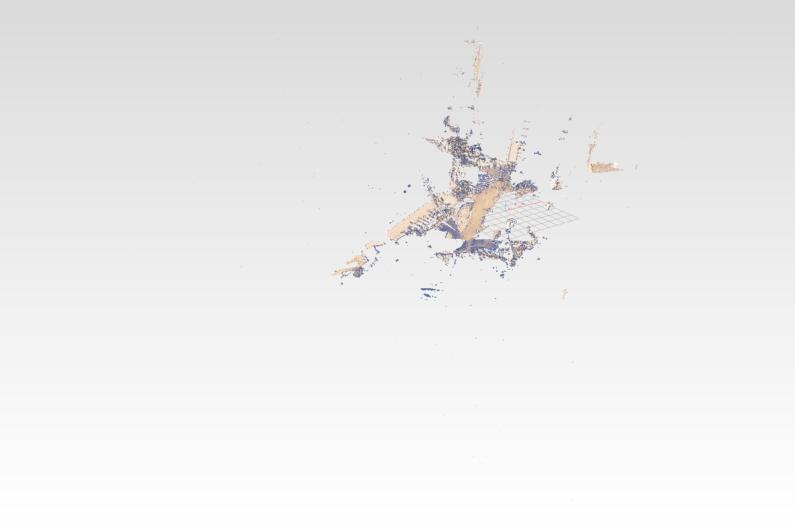

# 43 Streaming cloud — HTTP Range in, GPU rows out

> Replay-verified against `main` as of 2026-09-02 (the rasterized point lane and the live
> loader included); every number in **Expected state** is measured.

## Goal

**A 431 MB cloud crashes the tab. This makes it load.**

- `lidar_14m.pb`, 13.8 M points, peaks near **1 GB** of wasm heap — prost decodes the whole
  message before you can read any of it, so proto and GPU rows coexist. Not slow; dead.
- Fix: never decode it. Pull with HTTP `Range`, 8 MB at a time, straight to the GPU.
- **Peak heap ≈130 MB at any file size.** Draws while downloading: 3.4 s, measured.

## What changed in the kernel, 2026-09-03

The LOD octree is now part of `PointCloud` in all three languages, so a `.pb` carries it and
the browser never builds one. Done in the source, not as steps here.

- `build_lod(root_spacing, leaf_capacity)` runs `SpatialOctree` over the points, then
  **reorders `coords`/`colors`/`normals` into octree order**. A node becomes one contiguous
  `(first, count)` range, so the order permutation never ships — it would be 4 bytes a point,
  55 MB on the 13.8 M cloud. Every point's index changes; anything holding one must re-read.
- Seven packed proto arrays, fields 8-14: `lod_min` (3/node), `lod_size`, `lod_spacing`,
  `lod_level`, `lod_first`, `lod_count`, `lod_children` (8 slots/node). Flat arrays, not a
  `repeated LodNode` — same reason `coords` is packed: a length prefix gives the exact node
  count and a byte range can slice it. A message with variable-length entries cannot.
- Accessors, identical in C++/Rust/Python: `has_lod`, `lod_node_count`, `lod_cube`,
  `lod_spacing`, `lod_level`, `lod_range`, `lod_children`. Carried through `pb_dumps`/`pb_loads`,
  JSON and equality. One minitest each, `PointCloud / Build Lod`.
- Building is EXPLICIT — about 10 s on 14 M points, so it cannot run inside a constructor.
  Whoever writes the cloud calls it once.

Two traps found while doing it, both now handled: `SpatialOctree::node_cube` returns the cube
CENTRE, not the min corner (stored as `centre - size/2`, read back as `min + size/2`); and
`children()` returns only the present children, COMPACTED — the octant slot is dropped. A
screen-error walk never needs the slot, because every child carries its own cube.

Also fixed, unrelated and pre-existing: `serde_json` parsed floats with a non-round-tripping
algorithm, so a `.json` cloud came back one ULP off (`7.2861939802998155` ->
`7.286193980299816`). It reproduced with no octree involved. `features = ["float_roundtrip"]`
in the kernel and the viewer; C++ and Python were already exact.

**What this buys.** The viewer no longer has to choose between a big cloud and a usable one:
the tree arrives with the file, so LOD costs nothing at load, and because points are stored in
node order a `Range` request can fetch exactly the nodes the camera needs — far detail is never
downloaded at all.

## Where a scene comes from

Two sources, neither compiled in.

- **Branch (default)** — no query string → `session_viewer.toml` on the `session_viewer_data`
  branch, `.pb` from `pb/` beside it. `assets/scenes/` never opened. Commit, push, reload:
  ≈1 min; an open page follows in ≈5. No build, no deploy.
- **Pinned local** — `?scene=<path under assets/>` → that manifest, live source off.
- **Neither** (`?live=off`, no `?scene=`) → empty grid. No built-in default.
- `[[items]]` keys: `file` (required), `name`, `at [x,y,z]`, `xform` (16, row-major, overrides
  `at`), `point_size`, `display_only`. Millimetres.
- Bad file → skipped, console warning. Bad TOML → previous scene stays.
- **Over 100 MB cannot go on the branch** — GitHub refuses the push. So this lesson's scans
  stay local, reached with `?scene=`.
- Native harness (`selftest`, `docs/_gate.sh`) reads `assets/scenes/*.toml` off disk, always.

## Why it works — two schema properties

`PointCloud` is the only message with both. A real scan (`lidar_scan000.pb`, 114.8 MB):

```
PointCloud.3 coords   LEN 87,570,576   packed double
PointCloud.4 colors   LEN 27,237,048   packed uint32
```

- **Every hop is length-delimited** → all headers sit in the first ~170 bytes. Reaching
  `coords` is three length prefixes, no decoding.
- **`coords` is packed `double`**, 8 bytes fixed → `87,570,576 / 24 = 3,648,774` points,
  known before any payload. Both GPU buffers sized once, exactly. No reallocation.

`Mesh` has neither (`map<uint64, VertexData>` — variable length, unsliceable, two hash
builds). Fixing that schema is P6 in `.claude/SESSION_DATASTRUCTURE_PLAN.md`.

## Pull, don't be pushed

```
  1. Range 0-8191        -> three headers, contiguous. No state machine.
  2. coords_len / 24     -> exact count -> size both buffers, once.
  3. Range, 8 MB slices  -> 24 B aligned, so a slice cannot split a point.
  4. Range, colours      -> 27 MB in one pass.
```

Each slice converts to f32, goes to the GPU, dies. A push stream (`getReader()`) has a whole
risk surface — split doubles, split varints — that exists *only because data is pushed at you*.

**Prerequisite:** a server ignoring `Range` returns `200` + the whole file. The fetch refuses
anything but `206`. `trunk serve` does ranges.

## Its own lane

Streamed clouds get their own buffers, draw list and record table — `set_scene` rebuilds the
walked lane's buffers whole on every upload, and a streamed cloud has no rows there, so it
would vanish on the next load. The lanes meet in the point pass's shared depth/colour targets:
same hardware depth test, nearest point wins, resolve never knows there were two.

## Files we touch

| file | change |
|---|---|
| `Cargo.toml` | `web-sys` gains `"Headers"` |
| `src/app/persistence.rs` | `varint`, `walk_to_coords`, `fetch_range(_start/_finish)`, `positions_from`, `cloud_fields`, `cloud_colors`; `next_tick` goes `pub` |
| `src/engine/gpu/mod.rs` | the stream lane: buffers, `stream_reserve`, `cloud_begin`/`cloud_pos`/`cloud_col`, `grow_scene`; `splat_records` factored out; two-lane draw |
| `src/app/scene.rs` | `Item.stream`, `CloudSlot`, `begin_cloud`, `grow_bounds`; `rebuild` preserves streamed clouds |
| `src/lib.rs` | four `Msg` variants, GPU-first boot, the streaming branch, four handler arms |
| `assets/scenes/*.toml` | `stream = true` on the scan items |

---

## Step 1 — `Cargo.toml`

Setting a `Range` header needs the `"Headers"` binding of `web-sys`. It is already in the
feature list under `"Response",` (it arrived with the P6 refactor) - check it is there, and
type nothing.

## Step 2 — the reader: `src/app/persistence.rs`

Three edits.

**1.** Drop the unfinished sketch at the tail of the file — a comment block and a
`CloudFields` carrying `coord_at`. The real reader replaces it.

**Remove** `src/app/persistence.rs` `// streaming a point cloud: HTTP Range in, GPU rows out, nothing large in between ──` **through** `}`

**2.** The reader sets a `Range` header, so `Headers` has to be imported.

**Find** in `src/app/persistence.rs`:

```rust
use web_sys::{Request, RequestInit, RequestMode, Response};
```

**Replace with:**

```rust
use web_sys::{Headers, Request, RequestInit, RequestMode, Response};
```

**3.** The streaming block goes at the end of the file.

**Find** in `src/app/persistence.rs`:

```rust
            let root = build(rp);
            s.tree.add(&root, None);
        }
    }

    s
}
```

**Add below it:**

```rust
// ── streaming a point cloud: HTTP Range in, GPU rows out, nothing large in between ──
//
// The whole-file path above peaks at raw bytes + decoded proto + kernel object + GPU rows.
// This one never holds more than one slice. It is possible because of two facts about the
// wire format, both checked against a real scan (assets/pb/lidar_scan000.pb):
//
//   Session.3 (Objects) -> Objects.8 (pointclouds) -> PointCloud.3 coords / .4 colors
//
//   - every hop is wire type 2, length-delimited, so the headers sit in the first ~170 bytes
//   - `coords` is packed DOUBLE, a fixed 8 bytes an element, so its length prefix gives the
//     exact point count BEFORE a byte of payload is read: 87,570,576 / 24 = 3,648,774
//
// Knowing the count up front is what removes every reallocation: all three GPU buffers are
// sized once, exactly, and each slice is written at a known offset.

/// Where the two packed arrays live in the file, as absolute byte offsets.
pub struct CloudFields {
    pub coords_at: u64,
    pub coords_len: u64,
    pub colors_at: u64,
    pub colors_len: u64,
    pub count: u32,
}

/// One protobuf varint. Returns the value and how many bytes it ate.
fn varint(b: &[u8], mut i: usize) -> Option<(u64, usize)> {
    let (mut v, mut shift) = (0u64, 0u32);
    let start = i;
    loop {
        let byte = *b.get(i)?;
        v |= ((byte & 0x7f) as u64) << shift;
        i += 1;
        if byte & 0x80 == 0 { return Some((v, i - start)) }
        shift += 7;
        if shift > 63 { return None }
    }
}

/// Walk `head` (the first few KB of the file) down Session.3 -> Objects.8 -> PointCloud, and
/// report where `coords` starts. Descends into exactly the three fields it cares about and
/// skips every other one by its length - no allocation, no decoding.
///
/// Returns `None` for anything that is not a single-cloud file, which is the signal to fall
/// back to the whole-file prost path.
fn walk_to_coords(head: &[u8]) -> Option<(u64, u64)> {
    let mut i = 0usize;
    let mut end = head.len();
    for want in [3u32, 8u32] {
        let mut found = false;
        while i < end {
            let (tag, n) = varint(head, i)?;
            i += n;
            let (field, wire) = ((tag >> 3) as u32, (tag & 7) as u32);
            if wire != 2 { return None } // every hop we care about is length-delimited
            let (len, n) = varint(head, i)?;
            i += n;
            if field == want { end = i + len as usize; found = true; break }
            i += len as usize; // skip this sub-message whole
        }
        if !found { return None }
    }
    // inside PointCloud now: find field 3 (coords)
    while i < end {
        let (tag, n) = varint(head, i)?;
        i += n;
        let (field, wire) = ((tag >> 3) as u32, (tag & 7) as u32);
        if wire != 2 {
            // point_size is a fixed64, everything else we skip by wire type
            i += match wire { 0 => varint(head, i)?.1, 1 => 8, 5 => 4, _ => return None };
            continue;
        }
        let (len, n) = varint(head, i)?;
        i += n;
        if field == 3 { return Some((i as u64, len)) }
        if field == 4 { return None } // colours before coords - not a layout we can size from
        i += len as usize;
    }
    None
}

/// Start a range request WITHOUT awaiting it. `window.fetch()` is eager - the browser has the
/// request in flight the moment this returns - so the caller can keep slice n+1 travelling
/// while it converts slice n. That overlap is the difference between 11 sequential round trips
/// and 11 hidden ones; see the loader in lib.rs.
pub fn fetch_range_start(url: &str, start: u64, len: u64) -> Result<Fetch, JsValue> {
    let headers = Headers::new()?;
    headers.set("Range", &format!("bytes={}-{}", start, start + len - 1))?;
    let opts = RequestInit::new();
    opts.set_method("GET");
    opts.set_mode(RequestMode::SameOrigin);
    opts.set_headers(&headers);
    let request = Request::new_with_str_and_init(url, &opts)?;
    let window = web_sys::window().ok_or_else(|| JsValue::from_str("no window"))?;
    Ok(Fetch { fut: JsFuture::from(window.fetch_with_request(&request)) })
}

/// Finish one, insisting on `206` - see `fetch_range`.
pub async fn fetch_range_finish(f: Fetch) -> Result<Vec<u8>, JsValue> {
    let resp: Response = f.fut.await?.dyn_into()?;
    if resp.status() != 206 {
        return Err(JsValue::from_str("server ignored Range (no 206) - refusing to pull the whole body"));
    }
    let buf = JsFuture::from(resp.array_buffer()?).await?;
    Ok(js_sys::Uint8Array::new(&buf).to_vec())
}

/// Convert one already-fetched coords slice to f32 triples.
pub fn positions_from(raw: &[u8]) -> Vec<f32> {
    let mut out = Vec::with_capacity(raw.len() / 8);
    for c in raw.chunks_exact(8) {
        out.push(f64::from_le_bytes(c.try_into().unwrap()) as f32);
    }
    out
}

/// GET a byte range. Refuses anything but `206`: a server that ignores `Range` answers `200`
/// with the WHOLE body, which for a 431 MB scan would be catastrophic and silent.
/// `trunk serve` (axum + tower-http) does support ranges; `docs/serve.py`
/// (SimpleHTTPRequestHandler) does NOT.
pub async fn fetch_range(url: &str, start: u64, len: u64) -> Result<Vec<u8>, JsValue> {
    fetch_range_finish(fetch_range_start(url, start, len)?).await
}

/// Locate both packed arrays with two small reads: one at the head for `coords`, then one at
/// the end of the coords payload, where the `colors` header must be.
pub async fn cloud_fields(url: &str) -> Option<CloudFields> {
    let head = fetch_range(url, 0, 8192).await.ok()?;
    let (coords_at, coords_len) = walk_to_coords(&head)?;
    if coords_len == 0 || coords_len % 24 != 0 { return None }

    let hdr = fetch_range(url, coords_at + coords_len, 16).await.ok()?;
    let (tag, n) = varint(&hdr, 0)?;
    if (tag >> 3) != 4 || (tag & 7) != 2 { return None } // expected the colours field next
    let (colors_len, n2) = varint(&hdr, n)?;
    Some(CloudFields {
        coords_at,
        coords_len,
        colors_at: coords_at + coords_len + (n + n2) as u64,
        colors_len,
        count: (coords_len / 24) as u32,
    })
}

/// Read the whole `colors` run and pack it to RGBA8. Packed uint32 is VARINT on the wire - not
/// memcpy-able the way `coords` is - so this decodes sequentially. It is 27 MB against the
/// coords' 87 MB, and taking it in one piece buys complete freedom from split-varint handling.
pub async fn cloud_colors(url: &str, at: u64, len: u64, count: u32) -> Option<Vec<u32>> {
    let raw = fetch_range(url, at, len).await.ok()?;
    let mut out = Vec::with_capacity(count as usize);
    let mut i = 0usize;
    for _ in 0..count {
        let mut rgba = [255u8; 4];
        for k in 0..4 {
            let (v, n) = varint(&raw, i)?;
            i += n;
            rgba[k] = (v & 255) as u8;
        }
        out.push(u32::from_le_bytes(rgba));
    }
    Some(out)
}
```

`positions_from` has no per-element *decode*, only the narrowing cast: packed
little-endian doubles are bit-identical to a `&[f64]` on any LE target.

## Step 3 — the GPU side: `src/engine/gpu/mod.rs`

**3a — fields.** The stream lane's own buffers, counters and record table. **Find** in `src/engine/gpu/mod.rs`:

```rust
    pub point_count: u32,
```

**Add below it:**

```rust
    // The STREAM lane: clouds whose points never existed on the CPU. Their own three buffers
    // and record table - the walked lane above is rebuilt whole by every set_scene, so a
    // streamed cloud cannot live in it. The two lanes meet in the shared depth + colour
    // targets of the point pass: the depth test composes across draws.
    stream_pos_buf: wgpu::Buffer,
    stream_col_buf: wgpu::Buffer,
    stream_nrm_buf: wgpu::Buffer,
    stream_capacity: u64, // rows
    stream_count: u32,
    stream_pos_at: u32,
    stream_col_at: u32,
    pub stream_draws: Vec<(u32, u32, u32, f32)>, // (first, count, instance, spacing)
    splat_stream_recs: wgpu::Buffer,
    splat_group0_stream: wgpu::BindGroup,
    splat_group1_stream: wgpu::BindGroup,
```

**3b — construction.** In `Gpu::new`, **find** the line that starts the NEXT group's
construction — anchor past `mk_splat_group1`'s call, which you may have wrapped over
several lines:

```rust
        let splat_resolve_group = Self::mk_splat_resolve_group(
```

**Add above it:**

```rust
        // stream lane: same layouts, its own buffers; grown for real by stream_reserve
        let stream_usage = wgpu::BufferUsages::STORAGE | wgpu::BufferUsages::COPY_DST | wgpu::BufferUsages::COPY_SRC;
        let stream_pos_buf = zeroed_buffer(&device, "stream.pos", 12, stream_usage);
        let stream_col_buf = zeroed_buffer(&device, "stream.col", 4, stream_usage);
        let stream_nrm_buf = zeroed_buffer(&device, "stream.nrm", 4, stream_usage);
        let splat_stream_recs = zeroed_buffer(&device, "splat.stream.recs", 16 + 256 * 144,
            wgpu::BufferUsages::STORAGE | wgpu::BufferUsages::COPY_DST);
        let splat_group0_stream = Self::mk_splat_group0(&device, &splat_group0_layout, &mvp_buffer, &cloud_buffer, &instance_buffer, &splat_stream_recs);
        let splat_group1_stream = Self::mk_splat_group1(&device, &splat_group1_layout, &stream_pos_buf, &stream_col_buf, &stream_nrm_buf);
```

Then the matching struct-literal entries. **Find** in `src/engine/gpu/mod.rs`:

```rust
            splat_state: None,
```

**Add below it:**

```rust
            stream_pos_buf,
            stream_col_buf,
            stream_nrm_buf,
            stream_capacity: 1,
            stream_count: 0,
            stream_pos_at: 0,
            stream_col_at: 0,
            stream_draws: Vec::new(),
            splat_stream_recs,
            splat_group0_stream,
            splat_group1_stream,
```

**3c — group rebuilds.** `rebuild_splat_groups` recreates bind groups whenever a bound
buffer is replaced (`stream_reserve` below replaces the stream buffers). **Find** in
`src/engine/gpu/mod.rs`:

```rust
        self.splat_resolve_group = Self::mk_splat_resolve_group(&self.device, &self.splat_resolve_layout, &self.splat_depth_view, &self.splat_color_view);
```

**Add above it:**

```rust
        self.splat_group0_stream = Self::mk_splat_group0(&self.device, &self.splat_group0_layout, &self.mvp_buffer, &self.cloud_buffer, &self.instance_buffer, &self.splat_stream_recs);
        self.splat_group1_stream = Self::mk_splat_group1(&self.device, &self.splat_group1_layout, &self.stream_pos_buf, &self.stream_col_buf, &self.stream_nrm_buf);
```

Group 1 binds the lane's OWN three point buffers; the depth and colour targets are render
attachments of the point pass, not bindings, so nothing here is shared. Get the argument
order wrong and the shader reads colours as normals and renders dimly and wrongly with no
message anywhere. The order is `pos, col, nrm`; count them before you move on.

**3d — the grow API.** Four methods, right after `rebuild_splat_groups` closes. **Find** in `src/engine/gpu/mod.rs`:

```rust
        self.splat_resolve_group = Self::mk_splat_resolve_group(&self.device, &self.splat_resolve_layout, &self.splat_depth_view, &self.splat_color_view);

    }
```

**Add below it:**

```rust

    /// Make room for `need` stream rows total, copying the live prefix GPU-side.
    ///
    /// EXACT, not doubling: appends here are few and huge, so doubling would waste over a
    /// hundred MB on a multi-scan scene AND worsen the worst transient (old+new live at once).
    /// What doubling avoids is a GPU-side copy - the one thing here that never touches wasm.
    fn stream_reserve(&mut self, need: u64) {
        if need <= self.stream_capacity { return }
        let cap = need;
        let usage = wgpu::BufferUsages::STORAGE | wgpu::BufferUsages::COPY_DST | wgpu::BufferUsages::COPY_SRC;
        let pos = zeroed_buffer(&self.device, "stream.pos", cap * 12, usage);
        let col = zeroed_buffer(&self.device, "stream.col", cap * 4, usage);
        let nrm = zeroed_buffer(&self.device, "stream.nrm", cap * 4, usage);
        if self.stream_count > 0 {
            let mut enc = self.device.create_command_encoder(&Default::default());
            enc.copy_buffer_to_buffer(&self.stream_pos_buf, 0, &pos, 0, self.stream_count as u64 * 12);
            enc.copy_buffer_to_buffer(&self.stream_col_buf, 0, &col, 0, self.stream_count as u64 * 4);
            enc.copy_buffer_to_buffer(&self.stream_nrm_buf, 0, &nrm, 0, self.stream_count as u64 * 4);
            self.queue.submit([enc.finish()]);
        }
        // The wire has no normals, and a zeroed buffer is NOT "no normal" - oct code 0 decodes
        // to a real direction. Fill the new region with the sentinel, in 1M-row slabs so the
        // staging cost stays bounded.
        let fill = vec![u32::MAX; 1 << 20];
        let mut at = self.stream_count as u64;
        while at < cap {
            let n = (cap - at).min(1 << 20) as usize;
            self.queue.write_buffer(&nrm, at * 4, bytemuck::cast_slice(&fill[..n]));
            self.queue.submit([]);
            at += n as u64;
        }
        self.stream_pos_buf = pos;
        self.stream_col_buf = col;
        self.stream_nrm_buf = nrm;
        self.stream_capacity = cap;
        self.rebuild_splat_groups();
        self.splat_state = None;
    }

    /// A cloud is about to STREAM in. The count is known before a single point has been read -
    /// the protobuf packed-double length prefix gives it - so all three buffers are sized once,
    /// exactly, and every slice afterwards lands at a known offset. No growth mid-cloud.
    pub fn cloud_begin(&mut self, count: u32, instance: u32) {
        self.stream_reserve(self.stream_count as u64 + count as u64);
        self.stream_draws.push((self.stream_count, count, instance, 0.0));
        self.stream_pos_at = self.stream_count;
        self.stream_col_at = self.stream_count;
        self.stream_count += count;
    }

    /// One slice of positions, straight from the socket into GPU memory. `write_buffer` passes
    /// a subarray VIEW of wasm memory - the slice is the only copy that exists. The FIRST slice
    /// also measures the cloud's point spacing (median consecutive distance - scan order is
    /// surface order), which lesson 41's attenuation needs and a streamed cloud cannot get
    /// from the kernel walk.
    pub fn cloud_pos(&mut self, pos: &[f32]) {
        if let Some(d) = self.stream_draws.last_mut() {
            if d.3 == 0.0 && self.stream_pos_at == d.0 && pos.len() >= 6 {
                let n = (pos.len() / 3).min(2048);
                let mut gaps: Vec<f32> = (1..n).map(|i| {
                    let (a, b) = ((i - 1) * 3, i * 3);
                    ((pos[b] - pos[a]).powi(2) + (pos[b + 1] - pos[a + 1]).powi(2) + (pos[b + 2] - pos[a + 2]).powi(2)).sqrt()
                }).filter(|g| *g > 0.0).collect();
                if !gaps.is_empty() {
                    gaps.sort_by(|x, y| x.partial_cmp(y).unwrap());
                    d.3 = gaps[gaps.len() / 2];
                }
            }
        }
        self.queue.write_buffer(&self.stream_pos_buf, self.stream_pos_at as u64 * 12, bytemuck::cast_slice(pos));
        self.stream_pos_at += (pos.len() / 3) as u32;
        // Dawn only recycles its upload staging when a submitted serial completes. Without a
        // flush, 165 MB of write_buffer piles 165 MB of staging on top of the destination.
        self.queue.submit([]);
        self.splat_state = None; // new points - the splat buffers are stale
    }

    /// The colour run, packed to RGBA8.
    pub fn cloud_col(&mut self, col: &[u32]) {
        self.queue.write_buffer(&self.stream_col_buf, self.stream_col_at as u64 * 4, bytemuck::cast_slice(col));
        self.stream_col_at += col.len() as u32;
        self.queue.submit([]);
        self.splat_state = None;
    }

    /// Grow the scene box by a streamed cloud's world-space AABB, so the camera can fit it.
    pub fn grow_scene(&mut self, min: [f32; 3], max: [f32; 3]) {
        if !min[0].is_finite() { return }
        // an empty scene starts with a zero box; the first cloud replaces it
        if self.scene_min[0] >= self.scene_max[0] {
            self.scene_min = min;
            self.scene_max = max;
            return;
        }
        for k in 0..3 {
            self.scene_min[k] = self.scene_min[k].min(min[k]);
            self.scene_max[k] = self.scene_max[k].max(max[k]);
        }
    }
```

The three comments in there each cost a debugging session: the exact (not doubling)
reserve, the `u32::MAX` normal fill (lesson [41](41-potree-look.md)'s lambert would shade
the scan with oct code 0), and the empty `queue.submit([])` after every slice write.

**3e — two-lane draw.** The record builder moves out of `encode_frame`, generalised
over `draws`, so both draw lists can use it. **Find** in `src/engine/gpu/mod.rs`:

```rust
        if dirty {
            self.queue.write_buffer(&self.instance_buffer, 0, bytemuck::cast_slice(&self.instances));
        }
    }
```

**Add below it:**

```rust

    /// Build the record table for one cloud lane. A record folds the cloud's whole per-frame
    /// state: mvp x rebased model as ONE matrix, the tint, the attenuation constant and the
    /// model rotation - so a point's vertex does one mat-vec, no instance fetch.
    /// Attenuated (world-sized) dots, Potree-style: the record carries k such that the
    /// shader's radius is clamp(k * vp_h / clip.w, ...) px - a point covers its own
    /// world-space footprint, so near surfaces close up gap-free and far points shrink.
    /// The manifest px is a size FACTOR on the measured spacing.
    fn splat_records(&self, draws: &[(u32, u32, u32, f32)]) -> ([u32; 4], Vec<u8>, u32) {
        let mut header = [0u32; 4];
        let mut recs: Vec<u8> = Vec::new();
        let mut cum = 0u32;
        let ortho_h = self.last_ortho_h as f64;
        for &(first, count, inst, spacing) in draws {
            let Some(row) = self.instances.get(inst as usize) else { continue };
            if row.flags & Instance::FLAG_HIDDEN != 0 { continue; }
            let px = if row.spacing > 0.0 { row.spacing } else { 3.0 } * self.cloud_size;
            if px > 0.0 && header[0] < 256 {
                // column-major 4x4: combined = mvp x model
                let (a, b) = (&self.mvp_f32, &row.model);
                let mut m = [0.0f32; 16];
                for col in 0..4 {
                    for r in 0..4 {
                        m[col * 4 + r] = (0..4).map(|k| a[k * 4 + r] * b[col * 4 + k]).sum();
                    }
                }
                recs.extend_from_slice(bytemuck::cast_slice(&m));
                // tint.a smuggles the MINIMUM radius (the manifest px, halved): without a
                // floor, attenuation turns distant clouds to dust - Potree avoids that with
                // octree LOD (far nodes have bigger spacing); we keep the user's px instead.
                let tint = [row.color[0], row.color[1], row.color[2], (px * 0.5).max(0.5)];
                recs.extend_from_slice(bytemuck::cast_slice(&tint));
                // world radius = spacing x (px/6): manifest 6 ~ a full spacing of radius,
                // 3 ~ half. k folds the projection so the shader only divides by clip.w:
                //   perspective: r_px = world_r * cot(fov/2) * (vp_h/2) / w
                //   ortho:       r_px = world_r * vp_h / (2*ortho_h), and w = 1
                // spacing was measured in the cloud's LOCAL units; the model may scale -
                // col0's length is that scale, so the footprint reaches world units first.
                let mscale = ((row.model[0] as f64).powi(2) + (row.model[1] as f64).powi(2) + (row.model[2] as f64).powi(2)).sqrt();
                let world_r = (spacing as f64).max(1.0e-9) * mscale * 0.001 * (px as f64) / 6.0; // metres
                let k = if ortho_h > 0.0 { world_r / (2.0 * ortho_h) }
                        else { world_r * 1.7320508 * 0.5 }; // cot(30 deg) / 2
                recs.extend_from_slice(bytemuck::cast_slice(&[first, count, cum, (k as f32).to_bits()]));
                // the MODEL rotation columns (translation-free), so a cloud with
                // normals can rotate them into world space for the lambert term
                let b = &row.model;
                recs.extend_from_slice(bytemuck::cast_slice(&[
                    b[0], b[1], b[2], 0.0f32,
                    b[4], b[5], b[6], 0.0,
                    b[8], b[9], b[10], 0.0,
                ]));
                header[0] += 1;
                cum += count;
            }
        }
        header[1] = cum;
        (header, recs, cum)
    }
```

The old record loop and the whole point-pass prelude around it now go.

**Remove** `src/engine/gpu/mod.rs` `        let mut draws = 0u32;` **through** `        }`

**Find** in `src/engine/gpu/mod.rs`:

```rust
    ) -> (u32, u32) {
```

**Add below it:**

```rust
        let mut draws = 0u32;

        // The point pass before the render pass: one quad per point into the clouds' own
        // depth + colour targets, the depth test keeping the nearest point per pixel; the
        // render pass composites the result with one fullscreen triangle. TWO record sets -
        // the walked lane and the stream lane bind different point buffers - but ONE target
        // pair: the depth test composes across draws, so both lanes contest the same pixels.
        {
            let (header, recs, cum) = self.splat_records(&self.cloud_draws);
            let (header_s, recs_s, cum_s) = self.splat_records(&self.stream_draws);
            self.splat_total = cum + cum_s;
            // Static skip: camera still, same scale, nothing rebuilt - the targets already
            // hold this exact frame's points, so the whole prelude is free.
            let state = (self.mvp_f32, self.cloud_size);
            if self.splat_total > 0 && self.splat_state != Some(state) && !skip("splat_points") {
                self.queue.write_buffer(&self.splat_recs, 0, bytemuck::bytes_of(&header));
                self.queue.write_buffer(&self.splat_recs, 16, &recs);
                self.queue.write_buffer(&self.splat_stream_recs, 0, bytemuck::bytes_of(&header_s));
                self.queue.write_buffer(&self.splat_stream_recs, 16, &recs_s);
                // Depth 0 = reverse-Z far = empty; the resolve reads it as "no point here".
                let mut pass = encoder.begin_render_pass(&wgpu::RenderPassDescriptor {
                    label: Some("splat.points"),
                    color_attachments: &[Some(wgpu::RenderPassColorAttachment {
                        view: &self.splat_color_view,
                        resolve_target: None,
                        depth_slice: None,
                        ops: wgpu::Operations { load: wgpu::LoadOp::Clear(wgpu::Color::TRANSPARENT), store: wgpu::StoreOp::Store },
                    })],
                    depth_stencil_attachment: Some(wgpu::RenderPassDepthStencilAttachment {
                        view: &self.splat_depth_view,
                        depth_ops: Some(wgpu::Operations { load: wgpu::LoadOp::Clear(0.0), store: wgpu::StoreOp::Store }),
                        stencil_ops: None,
                    }),
                    timestamp_writes: None,
                    occlusion_query_set: None,
                    multiview_mask: None,
                });
                pass.set_pipeline(&self.splat_point_pipeline);
                // Lane order is free: the depth test picks the nearest point whichever lane
                // drew it, and a tie keeps the first - the same rule inside one lane.
                if cum > 0 {
                    pass.set_bind_group(0, &self.splat_group0, &[]);
                    pass.set_bind_group(1, &self.splat_group1, &[]);
                    pass.draw(0..6 * cum, 0..1);
                }
                if cum_s > 0 {
                    pass.set_bind_group(0, &self.splat_group0_stream, &[]);
                    pass.set_bind_group(1, &self.splat_group1_stream, &[]);
                    pass.draw(0..6 * cum_s, 0..1);
                }
                drop(pass);
                self.splat_state = Some(state);
            }
        }
```

Two lanes, one depth test: a walked point and a streamed point that land on the same pixel
are compared by the hardware exactly as two walked points would be, so there is no ordering
rule to get right between the lanes.

**3f — the box.** Nothing to type. A streamed cloud's instance row arrives through `set_scene`
in an upload whose walk tables are empty, so its `up.min`/`up.max` are still infinite - and
`set_scene` folds every upload's box into the scene's with `min`/`max`, which an infinite box
leaves untouched. The cloud's real box reaches the scene through `grow_scene` (3d) when its
last slice lands.

## Step 4 — the document row: `src/app/scene.rs`

**4a — the manifest flag.** Streaming is OPT-IN per item, never sniffed: the lion's .pb is
also a single-cloud file, and the wire walk would happily stream it right past its NORMALS,
which only the prost path decodes. **Find** in `Item`:

```rust
    pub point_size: f64,              // raw-cloud px for this file; 0 = keep the pb'own
```

**Add below it:**

```rust
    #[serde(default)]
    pub stream: bool,                 // Range-stream this file's cloud instead of parsing it
```

The field only — do NOT close the struct here; `Item` has more fields after it.

**4b — the slot.** A streamed cloud has no `Session` and no `Doc`. **Find** in `src/app/scene.rs`:

```rust
pub struct Scene {
```

**Add above it:**

```rust
/// A cloud whose points never became kernel objects: the loader streamed them from the file
/// straight into GPU memory. This struct is the ENTIRE CPU-side footprint of a 13.8M-point
/// scan - a name, a placement, a count, a point size and the instance row it draws with.
pub struct CloudSlot {
    pub name: String,
    pub place: Xform,
    pub count: u32,
    pub px: f32,
    pub instance: u32,
}

```

`Scene` gets the list. **Find** in `src/app/scene.rs`:

```rust
    pub docs: Vec<Doc>,
```

**Add below it:**

```rust
    pub clouds: Vec<CloudSlot>,
```

and its initialiser. **Find** in `src/app/scene.rs`:

```rust
        docs: Vec::new(),
```

**Add below it:**

```rust
        clouds: Vec::new(),
```

**4c — the row.** Two methods, above `rebuild`. **Find** in `src/app/scene.rs`:

```rust
    pub fn rebuild(&mut self, gpu: &mut crate::engine::gpu::Gpu) {
```

**Add above it:**

```rust
    /// Widen the shared walk box by a streamed cloud's world AABB. Without this the box lives
    /// only in `Gpu` and the next `set_scene` from a real walk would replace it.
    pub fn grow_bounds(&mut self, min: [f32; 3], max: [f32; 3]) {
        for k in 0..3 {
            self.tables.min[k] = self.tables.min[k].min(min[k]);
            self.tables.max[k] = self.tables.max[k].max(max[k]);
        }
    }

    /// Reserve the document row for a cloud that is about to stream in. Called before a single
    /// point has been fetched: the count comes from the file's packed-double length prefix.
    /// Returns the instance row the streamed points will draw against.
    pub fn begin_cloud(&mut self, name: String, place: Xform, count: u32, px: f32) -> u32 {
        let row = self.tables.objects.len() as u32;
        self.tables.objects.push((place.m, [1.0; 4], 0));
        self.tables.object_bounds.push(None);
        self.tables.object_spacing.push(px); // the manifest px rides the spacing row, like the walk's clouds
        // Keep the row bookkeeping aligned - `order` is indexed by row everywhere else.
        let guid = format!("cloud:{name}");
        self.guid_to_row.insert(guid.clone(), row);
        self.order.push(guid);
        self.clouds.push(CloudSlot { name, place, count, px, instance: row });
        row
    }

```

The spacing row carries the manifest px exactly like the walked clouds, so the record
builder reads `row.spacing` for both lanes without knowing which is which.

**4d — rebuild preserves clouds.** In `rebuild`, **Find** `        let docs = std::mem::take(&mut self.docs);` and **Add below it:** `        let clouds = std::mem::take(&mut self.clouds);`

Then, still in `rebuild`, the loop over the taken clouds goes after the `for d in docs { … }`
loop, so **Find** `        self.upload_to(gpu);` and **Add above it:**

```rust
        // Clouds keep their GPU rows; only the instance they draw against is re-issued, and
        // the Gpu's stream draw list is patched to match. Order is preserved on both sides,
        // so index i here is index i there.
        for (i, c) in clouds.into_iter().enumerate() {
            let row = self.begin_cloud(c.name, c.place, c.count, c.px);
            if let Some(d) = gpu.stream_draws.get_mut(i) {
                d.2 = row;
            }
        }
```

## Step 5 — the loader: `src/lib.rs`

**5a — the variants.** Four messages carry a streamed cloud: one to reserve its rows, one
per slice, one for the colour run, one to close it. **Find** in `src/lib.rs`:

```rust
    Ready(Box<State>),
```

**Add below it:**

```rust
    CloudBegin(String, session_rust::Xform, u32, f32),
    CloudPos(Vec<f32>),
    CloudCol(Vec<u32>),
    CloudEnd([f32; 3], [f32; 3]),
```

`CloudBegin` carries the count, already known, which is what lets the GPU size its buffers
once. Nothing keeps a `CloudPos`/`CloudCol` slice after its handler runs.

**5b — GPU first, empty.** The one structural change. Today `resumed` builds the `State`
around the first file that loads, in whichever path wins (the live manifest or the built-in
scene). A streamed cloud writes into GPU buffers, so the GPU has to exist before the first
byte of geometry is fetched - and as a bonus the viewport is live immediately, not after a
parse. **Find** in `src/lib.rs`:

```rust
                let mut live = LiveSource::from_query();
                let mut sent_ready = false;
```

**Replace with:**

```rust
                // The canvas and the GPU come up FIRST, empty. Every path below only appends.
                let t0 = crate::engine::performance::now_ms();
                let state = State::new(window.clone(), Scene::new()).await.expect("State init failed");
                log::info!("canvas live {:.0}ms", crate::engine::performance::now_ms() - t0);
                let _ = proxy.send_event(Msg::Ready(Box::new(state)));

                let mut live = LiveSource::from_query();
                let mut loaded = false;
```

The live path no longer builds a `State`; every file is a plain `Msg::File`. **Find** in
`src/lib.rs`:

```rust
                        for item in src.load_all(&manifest).await {
                            if !sent_ready {
                                sent_ready = true;
                                let mut scene = Scene::new();
                                scene.add_file(item.name, item.session, item.place, item.point_size, item.display_only);
                                let state = State::new(window.clone(), scene).await.expect("State init failed");
                                let _ = proxy.send_event(Msg::Ready(Box::new(state)));
                            } else {
                                let _ = proxy.send_event(Msg::File(item.name, item.session, item.place, item.point_size, item.display_only));
                            }
                        }
                        // `Ready` framed the first file only; frame everything the manifest listed.
                        if sent_ready { let _ = proxy.send_event(Msg::Fit); }
```

**Replace with:**

```rust
                        for item in src.load_all(&manifest).await {
                            loaded = true;
                            let _ = proxy.send_event(Msg::File(item.name, item.session, item.place, item.point_size, item.display_only));
                        }
                        // the first file fitted the camera; frame everything the manifest listed
                        if loaded { let _ = proxy.send_event(Msg::Fit); }
```

**Find** in `src/lib.rs`:

```rust
                if !sent_ready {
                    sent_ready = demo_scene(&proxy, window.clone()).await;
                }
                let Some(mut src) = live else { return };
                if !sent_ready {
                    log::error!("nothing could be loaded: neither the live manifest nor the demo scene");
                    return;
                }
```

**Replace with:**

```rust
                if !loaded {
                    demo_scene(&proxy).await;
                }
                let Some(mut src) = live else { return };
```

`demo_scene` stops owning the window and the first-file special case. **Find** in `src/lib.rs`:

```rust
/// Start-up path for the built-in scene (`?scene=` or the demo). Builds `State` around the
/// first file that loads and streams the rest as `Msg::File`. Returns whether a `State` was sent.
#[cfg(target_arch = "wasm32")]
async fn demo_scene(proxy: &winit::event_loop::EventLoopProxy<Msg>, window: Arc<Window>) -> bool {
```

**Replace with:**

```rust
/// Start-up path for the built-in scene (`?scene=` or the demo): every file that loads is a
/// `Msg::File`, whole files pipelined two deep, `stream` items sliced through the GPU.
#[cfg(target_arch = "wasm32")]
async fn demo_scene(proxy: &winit::event_loop::EventLoopProxy<Msg>) {
```

**Find** in `src/lib.rs`:

```rust
        Err(e) => { log::error!("cannot read the scene manifest at {scene_url}: {e}"); return false; }
```

**Replace with:**

```rust
        Err(e) => { log::error!("cannot read the scene manifest at {scene_url}: {e}"); return; }
```

The "first file on screen" stopwatch went with the special case. **Find** in `src/lib.rs`:

```rust
    let t0 = crate::engine::performance::now_ms();
    let scene_url = scene_url();
```

**Replace with:**

```rust
    let scene_url = scene_url();
```

**Find** in `src/lib.rs`:

```rust
    let mut next = manifest.items.first().map(|it| persistence::fetch_start(&it.file));
    let mut sent_ready = false;
```

**Replace with:**

```rust
    // whole-file prefetch skips `stream` items - starting a plain GET on a 431 MB scan would
    // pull the entire body
    let prefetch = |it: &crate::app::scene::Item| (!it.stream).then(|| persistence::fetch_start(&it.file));
    let mut next = manifest.items.first().and_then(prefetch);
```

The window-2 fetch-ahead survives; it just skips `stream` items. **Find** in `src/lib.rs`:

```rust
        next = manifest.items.get(i + 1).map(|it| persistence::fetch_start(&it.file));
```

**Replace with:**

```rust
        next = manifest.items.get(i + 1).and_then(prefetch);
```

`Ready` went out before the loop, so the first-file branch collapses to a plain `Msg::File`
send. **Find** in `src/lib.rs`:

```rust
        if !sent_ready {
            sent_ready = true;
            let mut scene = Scene::new();
            scene.add_file(name, session, place, item.point_size as f32, item.display_only);
            let state = State::new(window.clone(), scene).await.expect("State init failed");
            log::info!("first file on screen {:.0}ms after manifest fetch", crate::engine::performance::now_ms() - t0);
            let _ = proxy.send_event(Msg::Ready(Box::new(state)));
        } else {
            let _ = proxy.send_event(Msg::File(name, session, place, item.point_size as f32, item.display_only));
        }

    }
    sent_ready
}
```

**Replace with:**

```rust
        let _ = proxy.send_event(Msg::File(name, session, place, item.point_size as f32, item.display_only));
    }
}
```

**5c — the streaming branch.** It goes after the NEXT item's fetch-ahead has started (a
`stream` item must not swallow its successor's prefetch) and before the whole-file fetch
uses `cur`. **Find** in `src/lib.rs`:

```rust
        next = manifest.items.get(i + 1).and_then(prefetch);
```

**Add below it:**

```rust
        // ── STREAMING PATH ─────────────────────────────────────────────────
        // A `stream` cloud never becomes a kernel object and never exists whole
        // in wasm memory. Two small Range reads find the packed arrays; the
        // coords run then arrives in 8 MB slices, each converted, handed to the
        // GPU and dropped.
        if item.stream {
            let place = item.placement().unwrap_or_else(|| auto_grid(i, count, [0.0, 0.0]));
            let named = if item.name.is_empty() { item.file.clone() } else { item.name.clone() };
            let Some(f) = persistence::cloud_fields(&item.file).await else {
                log::warn!("'{}': stream requested but no Range-addressable cloud found - skipped", named);
                continue;
            };
            log::info!("streaming '{}': {} points | coords {:.0} MB + colours {:.0} MB",
                named, f.count, f.coords_len as f64 / 1048576.0, f.colors_len as f64 / 1048576.0);
            let _ = proxy.send_event(Msg::CloudBegin(named.clone(), place, f.count, item.point_size as f32));

            // 8 MB, rounded DOWN to a whole number of points: a slice boundary can
            // then never fall inside a point, let alone inside one of its doubles.
            const SLICE: u64 = (8 * 1024 * 1024 / 24) * 24;
            let (mut at, mut left) = (f.coords_at, f.coords_len);
            let (mut lo, mut hi) = ([f32::INFINITY; 3], [f32::NEG_INFINITY; 3]);

            // PIPELINED, and this is the whole performance story of the loader:
            // `fetch_range(..).await` resolves off network I/O, so it cannot
            // resume until the current FRAME is done - a sequential loop pays one
            // frame per slice. Keeping slice n+1 in flight while slice n converts
            // hides the round trip AND the frame behind work we had to do anyway.
            let mut inflight = if left > 0 {
                persistence::fetch_range_start(&item.file, at, SLICE.min(left)).ok()
            } else {
                None
            };
            while let Some(f_in) = inflight.take() {
                let n = SLICE.min(left);
                at += n;
                left -= n;
                // next one on the wire BEFORE we spend time on this one
                inflight = if left > 0 {
                    persistence::fetch_range_start(&item.file, at, SLICE.min(left)).ok()
                } else {
                    None
                };
                let Ok(raw) = persistence::fetch_range_finish(f_in).await else { break };
                let pos = persistence::positions_from(&raw);
                drop(raw);
                for q in pos.chunks_exact(3) {
                    for k in 0..3 { lo[k] = lo[k].min(q[k]); hi[k] = hi[k].max(q[k]); }
                }
                let _ = proxy.send_event(Msg::CloudPos(pos));
                // A real macrotask between slices. With a warm cache the fetch
                // promises resolve as MICROtasks, which never let the browser paint -
                // the same freeze the sliced prost parse exists to avoid.
                persistence::next_tick().await;
            }
            if let Some(col) = persistence::cloud_colors(&item.file, f.colors_at, f.colors_len, f.count).await {
                let _ = proxy.send_event(Msg::CloudCol(col));
            }
            let _ = proxy.send_event(Msg::CloudEnd(lo, hi));
            log::info!("streamed '{}' in {:.0}ms", named, crate::engine::performance::now_ms() - f0);
            continue;
        }
```

**5d — the fit flag.** `App` gains a field. **Find** in `src/lib.rs`:

```rust
    ctrl: bool,
```

**Add below it:**

```rust
    fitted: bool, // first geometry fits the camera; everything later only grows the extent
```

and its initialiser. **Find** in `src/lib.rs`:

```rust
            ctrl: false,
```

**Add below it:**

```rust
            fitted: false,
```

The `Ready` arm no longer fits — the scene is empty at boot. **Find** in it:

```rust
                state.resize(w, h);
                let aspect = w as f64 / h as f64;
                state.camera.fit(state.gpu.scene_min, state.gpu.scene_max, aspect);
                state.window.request_redraw();
```

**Replace with:**

```rust
                state.resize(w, h);
                state.window.request_redraw(); // the scene is still empty - the first file fits
```

And in the `Msg::File` arm (lesson [39](39-big-scenes.md)).

**Find** in `src/lib.rs`:

```rust
                state.camera.grow_extent(state.gpu.scene_min, state.gpu.scene_max);
```

**Replace with:**

```rust
                if self.fitted {
                    state.camera.grow_extent(state.gpu.scene_min, state.gpu.scene_max);
                } else {
                    let s = state.window.inner_size();
                    let aspect = s.width.max(1) as f64 / s.height.max(1) as f64;
                    state.camera.fit(state.gpu.scene_min, state.gpu.scene_max, aspect);
                    self.fitted = true;
                }
```

A live swap (`Msg::Fit`, the live loader's re-frame) counts as a fit too. **Find** in `src/lib.rs`:

```rust
                    state.camera.fit(state.gpu.scene_min, state.gpu.scene_max, aspect);
                    state.window.request_redraw();
                }
            }
            Msg::File(name, session, place, cloud_px, display_only) => {
```

**Replace with:**

```rust
                    state.camera.fit(state.gpu.scene_min, state.gpu.scene_max, aspect);
                    self.fitted = true;
                    state.window.request_redraw();
                }
            }
            Msg::File(name, session, place, cloud_px, display_only) => {
```

**5e — the handlers.** Four new arms, after the `Msg::File` arm. **Find** in `src/lib.rs`:

```rust
                    crate::engine::performance::heap_mb());
                state.window.request_redraw();
            }
```

**Add below it:**

```rust
            // A cloud, streaming. Nothing here holds points: begin_cloud reserves the GPU
            // range from a count that is already known, each slice is written and dropped,
            // and the CPU keeps a name, a count and one instance row.
            Msg::CloudBegin(name, place, count, px) => {
                let Some(state) = &mut self.state else { return };
                let row = state.scene.begin_cloud(name, place, count, px);
                state.scene.upload_to(&mut state.gpu); // pushes the instance row
                state.gpu.cloud_begin(count, row);
            }
            Msg::CloudPos(pos) => {
                let Some(state) = &mut self.state else { return };
                state.gpu.cloud_pos(&pos);
                state.window.request_redraw(); // the cloud grows on screen as it arrives
            }
            Msg::CloudCol(col) => {
                let Some(state) = &mut self.state else { return };
                state.gpu.cloud_col(&col);
                state.window.request_redraw();
            }
            Msg::CloudEnd(lo, hi) => {
                let Some(state) = &mut self.state else { return };
                // lo/hi are the cloud's LOCAL box; place it before it can fit the camera.
                if let Some(slot) = state.scene.clouds.last() {
                    let (mut wlo, mut whi) = ([f32::INFINITY; 3], [f32::NEG_INFINITY; 3]);
                    for c in 0..8u32 {
                        let corner = [
                            if c & 1 == 0 { lo[0] } else { hi[0] },
                            if c & 2 == 0 { lo[1] } else { hi[1] },
                            if c & 4 == 0 { lo[2] } else { hi[2] },
                        ];
                        let w = crate::app::scene::xform_point(&slot.place.m, corner);
                        for k in 0..3 { wlo[k] = wlo[k].min(w[k]); whi[k] = whi[k].max(w[k]); }
                    }
                    state.gpu.grow_scene(wlo, whi);
                    state.scene.grow_bounds(wlo, whi);
                }
                // a finished scan is the dominant geometry - refit around everything so far
                let s = state.window.inner_size();
                let aspect = s.width.max(1) as f64 / s.height.max(1) as f64;
                state.camera.fit(state.gpu.scene_min, state.gpu.scene_max, aspect);
                self.fitted = true;
                state.window.request_redraw();
            }
```

Those `Vec`s are the only copy of the data that ever exists on the CPU, and they die in the
handler.

## Step 6 — the scenes

Mark the scans in `assets/scenes/cloud_mix.toml`: each `lidar_scan*` item gains a
`stream = true` line. The lion keeps parsing whole — its normals live only on the prost
path.

Then a dedicated stress scene.

**Create `assets/scenes/lidar14.toml`**

```toml
name = "lidar 14M streamed"

[[items]]
file = "pb/lidar_14m.pb"
name = "lidar 14M"
at = [0, 0, 0]
point_size = 1
stream = true
```

**Why this one stays local.** The branch is the default source (*Where a scene comes from*,
above), but GitHub refuses any file over 100 MB:

- `lidar_14m.pb` 431 MB, `lidar_scan000.pb` 109 MB, `lidar_scan006.pb` 104 MB — all gitignored.
- A file too big to commit is a file too big to hold in memory. That is this lesson's subject.
- Served from disk by `trunk serve`, 8 MB at a time: `?scene=scenes/lidar14.toml`.

## Expected state

- `cargo check --target wasm32-unknown-unknown --lib`: clean; native `--examples` build.
- The native goldens are UNTOUCHED — the selftest path parses whole files, so `lion.json`
  still renders `325369 (33.9%)` and `cloud_mix.json` `12143 (1.1%)`. The new scene, on
  both runs:

```
VIEWER_W=1200 VIEWER_H=800 VIEWER_ZOOM=8 \
cargo run --example selftest --target x86_64-unknown-linux-gnu --release -- \
    out.ppm assets/scenes/lidar14.toml
# => non-background pixels: 18784 (2.0%)
```



- In the browser at `?scene=scenes/cloud_mix.toml` (`trunk serve --release`, which answers
  `206`; the query string is what keeps the live source out of the way) `cloud_mix` prints — the
  sheets and bunny land through prost BETWEEN the streams:

```
streaming 'scan000 (3.65M pts, 1 px)': 3648774 points | coords 84 MB + colours 26 MB
streamed 'scan000 (3.65M pts, 1 px)' in 1865ms
scene: 210891 objects ... 341989 cloud points          <- the lion, walked lane
streaming 'scan006 (3.50M pts, 6 px)': 3501943 points | coords 80 MB + colours 24 MB
streamed 'scan006 (3.50M pts, 6 px)' in 1072ms
```

- And the headline, at `?scene=scenes/lidar14.toml` (the const is no longer the way in — a page
  with no query string reads the branch instead, see Step 6):

```
streaming 'lidar 14M': 13793783 points | coords 316 MB + colours 96 MB
streamed 'lidar 14M' in 3402ms
```

A **431 MB** file on screen in **3.4 seconds**, growing visibly slice by slice, JS heap
around **130 MB** — one slice, one colour run, the wasm runtime; never the file. The
whole-file path would have peaked near a gigabyte.

## What is deliberately not here

- **No push-stream state machine.** Range pulls make chunk-boundary bugs structurally
  impossible.
- **No streamed normals.** The scans have none; the fill is `u32::MAX` = unlit, and a
  dataset WITH normals (the lion) keeps the prost path.
- **No octree / LOD.** 13.8M points splat in single-digit milliseconds, so LOD only starts
  paying at the 100M+ scale.
- **No `Doc` for streamed clouds.** Picking, undo and save walk kernel sessions and a
  `CloudSlot` is not one, so streamed clouds are display objects until a lesson needs more.

## Recap

- A protobuf file is Range-addressable storage: three length prefixes reach `coords`, and
  packed-double means its length IS the point count — buffers sized once, exactly.
- That is a property of the **schema**, not of protobuf. `Mesh`'s
  `map<uint64, VertexData>` forbids up-front sizing, forbids slicing, and costs two hash
  builds. Design bulk fields as packed arrays and this lane generalises to them.
- Streaming is the architecture, not the workaround: no encoding fits 431 MB in a bounded
  heap, and f64 → f32 makes one conversion pass the floor regardless.
- Insist on `206`. A server that ignores `Range` sends the whole body, silently.
- Streamed rows land in their OWN lane; the two lanes meet in the point pass's depth test.
- `queue.submit([])` after each slice write, or staging doubles the upload.

## Next

[45 — Cloud octree](44-cloud-octree.md) closes the point-cloud chain: the walked lane gets
Potree's LOD on the kernel's own `SpatialOctree`. Streamed clouds opt out — they have no
CPU points to reorder.

Then the refactor block, lessons [44](45-pipeline-descs.md) to 51, splits `gpu/mod.rs` into one
file per row family and `scene.rs` into one file per geometry type under a pixel gate, and
finishes with a measured performance and memory pass.
