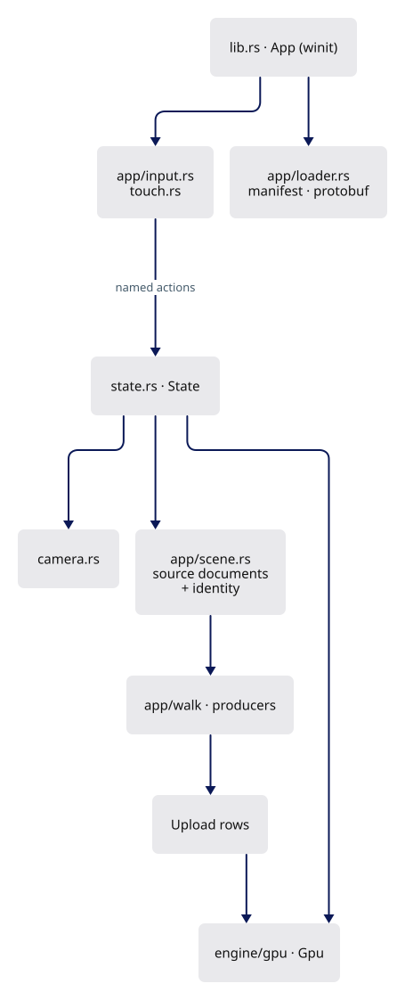
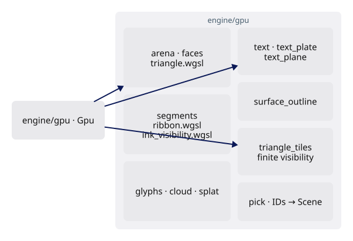

# Build the Session Viewer

A code-first course: from an empty Rust crate to the current production viewer, byte for byte. Type what is worth understanding, copy the boilerplate, compile after every step.

## What you build

App side, from the window to the upload rows:



GPU side, from `Gpu` to its passes:



Read these four first:

- [How to use this course](how-to-learn.md) — how a lesson is built. Nothing is hidden: every lesson ends in **Questions and answers**, each question followed by its reasoning and then the answer.
- [The map](map.md) — one picture of the whole viewer; every step reopens it with your position lit.
- [Words before code](words.md) — every term the lessons use before they have room to explain it, with the file where it first appears.
- [Reading failures](debugging.md) — the errors this course actually produces.

## How a lesson reads

- **You are building**: the mechanism this lesson adds, as one diagram.
- **Step k**: one idea, then the code. Every code block names its file and one of five actions: **NEW FILE**, **CURRENT → REPLACE WITH**, **CURRENT → ADD BELOW**, **CURRENT → ADD ABOVE**, **DELETE**. The two anchored inserts differ only in which side of the quoted line the new code goes.
- **TYPE THIS** marks code worth writing by hand. **COPY** marks boilerplate, pages, lockfiles, fixtures. **READ ONLY** marks a complete file shown for orientation.
- **Supplied files** are tooling (native examples, fixtures, parity ports) installed by one command; the course does not teach them.
- **Check**: `cargo check` where it is known to pass, then the checkpoint build and what you should see.

Every block is cut from that checkpoint's verified patch, a replay audit proves that typing the lesson reproduces it, and every `cargo check` marker was measured on the typed state.

## Course

| Lesson | You add | Checkpoint |
|---|---|---|
| [00 · Empty project to WASM](00-environment.md) | Crate, wasm32 default, Trunk, a status message | |
| [01 · First WebGPU frame](01-first-frame.md) | Adapter, device, surface, pipeline, one triangle | **1 · WebGPU works** |
| [02 · Camera](02-camera.md) | Production camera and math: orbit, pan, cursor zoom, reversed depth | |
| [03 · Object rows and identity](03-identity.md) | `Instance` rows, storage bind group, `instance_index` | |
| [04a · Meshes on the GPU](04a-meshes.md) | Arena buffers, object table, vertex pulling, `triangle.wgsl` | |
| [04b · Strokes](04b-strokes.md) | Segment lane and the screen-space ribbon shader | |
| [04c · Markers](04c-markers.md) | Vertex markers on a quad template, free dots as one triangle | |
| [04d · Point clouds](04d-clouds.md) | LOD nodes, splat prelude and resolve | |
| [05 · Depth and visible ink](05-visibility.md) | Reversed depth, physical metadata, the ink visibility test | **2 · Camera + meshes work** |
| [06 · CAD face contract](06-cad-contract.md) | Face meshes, UVs, normals, boundary provenance | |
| [07 · Shared boundaries](07-boundaries.md) | One canonical chain per edge, constrained meshing, edge IDs | |
| [08 · Trims and seams](08-trimming.md) | Holes, periodic seams, poles, natural boundaries | |
| [09 · Normals and shading](09-normals.md) | Analytic normals, creases, cofactor normal transform | **3 · CAD visualization works** |
| [10 · Text shaping](10-text-layout.md) | Fonts, shaping, advances, clusters | |
| [11 · Text rendering](11-text-rendering.md) | Placement, raster size, coverage, plates | |
| [12 · Production shell and picking](12-picking.md) | winit `App`, `State`, ID pass, async readback, yellow selection | |
| [13 · Source controls](13-controls.md) | F10 controls, streamed-cloud source queries | **4 · Picking + interaction work** |
| [14 · Loading scenes](14-loading.md) | Manifests, validation, staged replacement | |
| [15 · Publication and streamed reads](15-publication.md) | Immutable revisions, bounded metadata window | |
| [16 · Resource accounting](16-accounting.md) | Weak source cache, owned-capacity numbers | |
| [17 · Faces, text objects, silhouettes](17-source-presentation.md) | Source faces, selectable text, one black outline, joined strokes | |
| [18 · Finite-triangle visibility](18-finite-visibility.md) | Projected triangles, tile lists, cache | |
| [19 · Sheets](19-sheets.md) | Batched drawings, ranged slices, lazy entity metadata | |
| [20 · The document](20-history.md) | Kernel history: transactions, tombstones, undo and redo, purge on save | **5 · Full viewer** |

Then [the capstone](capstone.md): a section plane — requirements, constraints, the reasoning for each decision and the full design, but no line-by-line instructions.

Dependencies: 01 → 02 → 03 → 04a–d → 05 are strictly sequential. 06, 07 and 09 change the shared kernel; 08 is viewer-only. All four need only 05. 10–11 need 04c. 12 needs everything before it. 13–16 extend `State` and loading. 17–18 build on 12. 19 needs 15 and 17. 20 changes the kernel only and needs 19.

## Prepare one workspace

Run from the maintained `session_viewer` checkout. Choose a **new, empty** path for your work.

```sh
export COURSE_REPO="$PWD"
export COURSE_WORK="$HOME/viewer-course"
export RUSTUP_TOOLCHAIN=1.97.1
export REGEN_PROTO=0
export NO_COLOR=true
rustup toolchain install 1.97.1
rustup target add --toolchain 1.97.1 wasm32-unknown-unknown
cargo +1.97.1 install trunk --version 0.21.14 --locked
python3 "$COURSE_REPO/docs/reconstruction/replay.py" --output "$COURSE_WORK" --initialize-only
```

- `COURSE_REPO` holds the course, patches and fixtures. `COURSE_WORK` is where you type.
- The initializer extracts the pinned kernel and its siblings; it writes no viewer code.
- Python 3.13 or newer; Git is needed by the replay tools.

## Build, run, stop

```sh
cd "$COURSE_WORK/session_viewer"
cargo check --locked --lib
trunk serve --port 8780
```

Open <http://localhost:8780/?data=off&inspect=1>; stop with **Ctrl+C** before the next lesson. Port 8780 keeps the course apart from a production viewer on 8770.

A passing `cargo check` proves Rust, a Trunk build proves the WASM bundle, pixels prove the GPU work — an empty canvas is not a passing checkpoint.

## Exact reconstruction, optional

- `replay.py --output "$COURSE_WORK" --through NN` takes `--copy-supplied` to install a lesson's supplied files, or `--adopt` to verify your typed sources against the checkpoint hashes.
- `replay.py --output "$HOME/viewer-course-auto" --through NN` writes a lesson for you in a separate workspace.
- Lesson 20 ends with `converge.py`, which compares the final workspace with the frozen production inventory.

## The result

- Served viewer: <https://petrasvestartas.github.io/session/> (this course at [/docs/](https://petrasvestartas.github.io/session/docs/)).
- Source: <https://github.com/petrasvestartas/session/tree/main/session_viewer>.
- Locally, `trunk serve` serves both: the viewer at <http://localhost:8770/> with a black corner at the top right that opens the course.

## After the course

- [Architecture reference](../ARCHITECTURE.md): module graph, frame, Rust ↔ WGSL interfaces, flows, lifecycles.
- [CAD design record](cad-design.md): the shared-boundary and normal contracts, with the OCCT comparison.

## Build this site

```sh
docs/serve.sh build
python3 docs/check_site.py
python3 docs/course_pages.py --audit
docs/serve.sh
```

`docs/reconstruction/step_checks.py` runs `cargo check` at the end of every step of every lesson; `step_status.py` writes the result into each lesson as the "Does it compile yet?" line (`--check` fails when one is stale).

The build expands lesson directives from the verified patches, so lesson code is never duplicated in Git. `check_site.py` checks links, downloads and lexers; `course_pages.py --audit` checks that every checkpoint change is taught or supplied exactly once and that typing each lesson reproduces its checkpoint.

Flowcharts are D2: edit `docs/diagrams/<lesson>-<n>.d2`, then `python3 docs/diagrams.py` (it fetches its own pinned renderer once and writes the committed SVG). `python3 docs/locator.py` regenerates every step's "where you are" map. `python3 docs/check_svg.py docs/illustrations/*.svg` is the playwright-free check: a label that leaves the canvas, collides with another, or sits too close in colour to its shape fails the build — which is what stops the dark-page remapping turning a white box black under black type. (`--check` fails when a lesson or an SVG is stale.)

Illustrations are generated: `python3 docs/illustrations/draw.py` sizes every box from its text, and `node docs/check_illustrations.cjs --write` measures every label in Chrome, fails on overflow or collision, and pins the measured width so other fonts cannot overflow either. The palette is BRG Equilibrium (navy, pink, green, yellow, pale bands), shared with the D2 diagrams: a reader carries those colours from a diagram to the running viewer, so no theme replaces them.

Everything around them — ground, plates, rules, type, radius, density, the accent — comes from a Claude Design system, and the link runs both ways. `theme.json` is the project exported from claude.ai/design; `theme.py` renders it into `theme.css`; `fonts/fetch.sh` refetches the named faces against their recorded sha256; `check_site.py` fails the build if the three disagree. `course.css` is the only consumer, so switching systems is one export. `python3 docs/design_cards.py` pushes the palette, the figure plate and every illustration into `target/docs/cards/` to review as one set.
