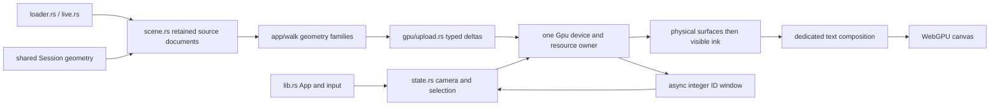

# Rebuild Session Viewer

Build the frozen browser viewer from a small WASM entry point through complete, runnable source patches.

All 17 checkpoints have been reconstructed from clean inputs, built and checked in Chrome. The final checkpoint matches every production Rust/WGSL runtime file; the [verification chapter](16-verification.md) records the checks and packaging differences.

## Verified source and tools

| Item | Pinned or observed value |
|---|---|
| Production source | SHA-256 `210120d0dd7d1c0fcdd0e41cea70f1c4e29dce1577a427cb54c032dd55b1e92d`; [exact inventory](reconstruction/baseline.json) |
| Rust / Cargo | 1.97.1; viewer edition 2024, shared kernel edition 2021 |
| WASM target | `wasm32-unknown-unknown` |
| Trunk | 0.21.14; release build; development port 8770 |
| Rendering / events | Locked wgpu 29.0.4 and winit 0.30.13 |
| Shaping / text | Glyphon 0.11.0; bundled licensed Noto fonts |
| Manifest parser | TOML 0.8.23 plus existing YAML/JSON compatibility |
| Browser evidence | Chrome 152.0.7977.82, Ubuntu 26.04.1; DPR 1/1.25/2 and actual page zoom documented in [results](../ARCHITECTURE.md) |
| Automation | Python 3.13.9, Git, Node, Playwright 1.58.2 |
| Shared parity | GCC 15.2 / C++23, CMake 4.4.3, independent Python implementation |

The course includes exact, checksum-verified original shared source archives and applies the CAD changes incrementally; it does not link to a mutable sibling checkout. Cargo's complete lockfile is supplied in checkpoint 00; network access is needed to obtain uncached pinned dependencies, but local lessons require no R2 credentials or personal bucket access.

## Set up the commands

**COPY/PASTE — run from the production `session_viewer` directory:**

```sh
export COURSE_REPO="$PWD"
rustup toolchain install 1.97.1
rustup target add --toolchain 1.97.1 wasm32-unknown-unknown
cargo +1.97.1 install trunk --version 0.21.14 --locked
npm install --prefix /tmp/viewer-browser-test playwright@1.58.2
export NODE_PATH=/tmp/viewer-browser-test/node_modules
export CHROME_BIN=/usr/bin/google-chrome
export RUSTUP_TOOLCHAIN=1.97.1
export REGEN_PROTO=0
export NO_COLOR=true
```

- Use the installed WebGPU-capable browser's actual executable in `CHROME_BIN`; HTTPS and trustworthy localhost origins are supported.
- The recorded Linux host needed `DISPLAY=:0` and `VIEWER_CHROME_ARGS='["--enable-features=Vulkan,DefaultANGLEVulkan,VulkanFromANGLE","--ozone-platform=x11"]'` for its Chrome/desktop configuration. These are test-host accommodations, not viewer or deployment requirements.
- `VIEWER_HEADLESS=1` is available only when that browser exposes a usable WebGPU adapter. A software adapter or a headless build does not establish real-GPU performance.
- Firefox, Safari, physical monitor migration and mobile hardware remain unverified; see the exact [verification scope](../ARCHITECTURE.md#publication-replacement-and-verification-scope).

## Follow the patches or type the changes

**COPY/PASTE — reconstruct checkpoint 00 in a new, empty workspace and verify it:**

```sh
python3 "$COURSE_REPO/docs/reconstruction/replay.py" --output /tmp/viewer-course --through 00 --verify --target-dir "$COURSE_REPO/target"
```

**COPY/PASTE — advance the unchanged workspace one checkpoint:**

```sh
python3 "$COURSE_REPO/docs/reconstruction/replay.py" --output /tmp/viewer-course --through 01 --advance --verify --target-dir "$COURSE_REPO/target"
```

**TYPE BY HAND** marks the essential records, math, mappings, visibility, shaping, state transitions and revision rules in each chapter. **COPY/PASTE** marks the remaining complete patch hunks, mechanical descriptors, bindings and fixture data; every changed path and full implementation is supplied.

- For manual work, start from the previous checkpoint, make every listed edit once, then replace `--advance` with `--adopt` to check the completed source bytes and run the same browser gate.
- `--advance` rejects edited prior sources; it never silently overwrites handwritten work. `--adopt` rejects any incomplete or divergent final file.
- In the manual route, `--copy-assets --through NN` installs the explicitly listed binary fonts/PB files before `--adopt`; chapters 09, 10 and 12 give the exact commands.
- Replay applies one complete plain-text patch per chapter, plus explicitly inventoried binary assets. Font and fixture bytes are stored once and verified by SHA-256.
- The shared Cargo cache is optional; omit `--target-dir` for an isolated cache. Source snapshots and generated browser evidence remain outside the production tree.
- Browser verification uses an ephemeral localhost port; it does not interrupt a viewer already using 8770.

**COPY/PASTE — run a reconstructed browser checkpoint yourself:**

```sh
cd /tmp/viewer-course/session_viewer
REGEN_PROTO=0 NO_COLOR=true trunk serve
```

Open `http://localhost:8770/?data=off&inspect=1`; stop an existing process on that port before serving another checkpoint. The generated local scene is a small deterministic teaching fixture; final source/packaging differences are listed in [convergence](16-verification.md).

## Chapter order

| Checkpoint | Add and verify |
|---|---|
| [00 — Environment](00-environment.md) | Pinned crate, WASM startup and browser diagnostics |
| [01 — First GPU frame](01-first-frame.md) | Adapter/device, canvas surface, complete triangle pipeline and WGSL |
| [02 — Coordinates and camera](02-camera.md) | f64 source coordinates, camera projection, orbit/pan/zoom and DPR |
| [03 — Scene identity](03-identity.md) | Instance records, source rows, transforms and styles |
| [04 — Modular drawing](04-modules.md) | Real mesh, point, stroke and cloud modules over one GPU context |
| [05 — Visibility and quality](05-visibility.md) | Physical depth, visible ink, floor/box regressions and stroke coverage |
| [06 — CAD contract](06-cad-contract.md) | Source geometry, face records and shared grid normal contract |
| [07 — Coherent boundaries](07-boundaries.md) | Shared edge/face samples, holes, source chains and three-language producer changes |
| [08 — Trimmed NURBS](08-trimming.md) | Outer/inner trims, seams, natural boundaries and stable source IDs |
| [09 — Smooth normals](09-normals.md) | Interpolation, inverse transpose, orientation and preserved creases |
| [10 — Text layout](10-text-layout.md) | Fonts, shaped glyphs, advances, offsets, clusters and baselines |
| [11 — Text rendering](11-text-rendering.md) | Dedicated raster/atlas path, DPI, clipping, anchoring and white-on-black reference |
| [12 — Object and edge picking](12-picking.md) | Production event shell, async visible ID windows and yellow selection |
| [13 — Source controls](13-controls.md) | F10, original source IDs, single-parent modes, Escape and late-result cancellation |
| [14 — Loading](14-loading.md) | Real manifests/PB, validation, staged replacement and owned callbacks |
| [15 — Publication](15-publication.md) | Immutable R2 revisions, preserved workflow and bounded metadata read window |
| [16 — Convergence and verification](16-verification.md) | Complete production source, resource accounting, regressions and reconstruction checks |

## Ownership and evidence



Text: retained source documents feed geometry preparation and typed uploads; one GPU owner draws them; asynchronous source identities return to the interaction state.

- [Architecture, actual measurements and archive feature map](../ARCHITECTURE.md)
- [Requirement-to-source/test/chapter coverage](coverage.md)
- [Maintained verification tools and environments](../tests/README.md)
- [Frozen source inventory](reconstruction/baseline.json) and [shared prerequisite provenance](reconstruction/kernel-base.json)
