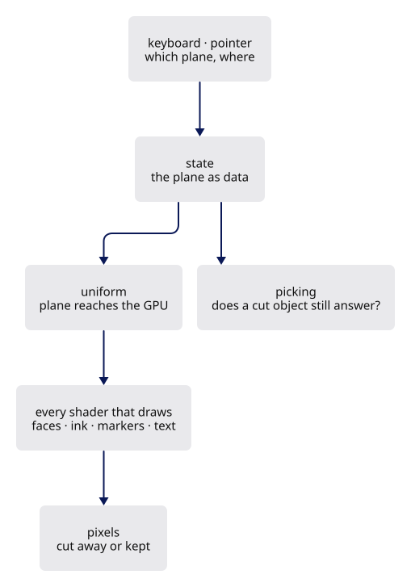

# Optional design reference · Section plane

This proposed feature is not implemented in the current viewer. This page gives its design answers and acceptance criteria, not a code tutorial. For complete runnable code, follow [the current-viewer sequence](extend-integrated-tutorial.md).

The proposal is a **section plane**: a movable plane that cuts the scene, so faces, edges, markers and text on the far side disappear and a solid's interior becomes visible.

## Requirements

- One plane: a point and a normal, in the same anchored world frame the rest of the scene uses.
- Everything on the negative side is gone: faces, edges, vertex markers, point clouds, text. Not faded — gone.
- A key toggles it; the camera can move freely with it on.
- Picking agrees with the picture: a cut-away part of an object cannot be clicked.
- Turning it off costs nothing when it is off.

## Constraints

Respect these and the feature will fit; break them and you will feel the friction immediately.

- The scene contract (`src/shaders/scene.wgsl`) is declared once and every lane shader is compiled with it.
- Lanes do not know about each other. Anything all lanes need belongs in the contract, not in six copies.
- Pipelines are built once, in `build`, never per frame.
- A view switch is a *view* change: no row is rewritten, no buffer is rebuilt, no geometry is walked again.
- The id pass and the visible pass must see the same world, or picking lies.

## Design questions

The answers are written out directly below. No question must be solved to continue the course.

1. Where does the plane live — in `Scene`, in `View`, in a lane? Which one survives a scene reload, and should it?
2. How does it reach the GPU? Which existing uniform block already goes everywhere, and what does adding four floats to it cost?
3. Which shader stage rejects a fragment on the far side — vertex or fragment? What breaks if you choose the other one?
4. A triangle straddling the plane: what happens at its cut edge, and what would a CAD user expect to see there instead?
5. Does the depth buffer need to change? Does the coverage mask that draws silhouettes?
6. Picking: is this one more shader change, or does it come for free? *Why* does it come for free?
7. When the plane is off, what code runs? What should run?

Each is worked through below, then written out in full in the answer key.

## Working it out

### 1 · Where the plane belongs

`P` (x-ray) and `D` (headlight) are the analogue: no row, `View` state, carried in the block already bound to every lane. A section plane is the same — view state, not scene state — so it survives a reload, as a user expects.

### 2 · Getting four floats everywhere

`LineUniform` is group 1 for every lane and is declared once in `scene.wgsl`. A plane is a `vec4`: `xyz` the unit normal, `w` the offset, so `dot(p, n) - w` is the signed distance. Adding a field touches the Rust struct, the offset assertions and the WGSL declaration — the three declarations of [Habit 1](debugging.md); the `instance.rs` mirror test catches a miss.

### 3 · Which stage cuts

A vertex-stage rejection removes only whole triangles, so the cut face keeps a ragged edge of whichever vertices survived. Fragment-stage `discard` cuts exactly at the plane, at pixel resolution — the reason x-ray discards in the fragment stage too. Its cost: a discarding fragment shader cannot be early-depth-tested, so compile it out when the plane is off.

### 4 · The cut face

Discarding alone leaves a hollow shell: you see the *inside* of the far wall, lit from the wrong side. A CAD viewer fills the cut with a cap. First version: paint back faces in a flat cap colour — the viewer already detects facing for the red back-face debug paint. Stencilling a true cap is a stretch goal, not a requirement.

### 5 · Picking for free

The id pass runs the *same* vertex and fragment entry points over the same rows, with the pick camera in the same uniform block. If the cut is a `discard` in a function both entry points call, a cut-away fragment writes no id, and picking agrees with the picture with no extra work.

### 6 · Paying nothing when off

Two ways, not equivalent. A uniform branch is predictable and uniform — cheap, one pipeline. A pipeline-overridable constant (`override`, as `SCENE_MSAA` does) compiles the test away entirely, at the cost of a second pipeline variant per lane. For a plane test the honest answer is usually the branch; measure before assuming otherwise.

## The answer key

**A design that satisfies the constraints**

- **State**: one `Option<Plane>` (or a `vec4` plus a `bool`) in `View`, beside `lit`, `opacity` and `show_outlines`. Toggled by a key in `input.rs` through a small `State` method that calls `touch`. No row, no buffer, no walk.
- **Transport**: a `vec4<f32>` appended to `LineUniform`, with its offset asserted on the Rust side. Off is a zero normal, so the test is `dot(n, p) - w < 0.0 && any(n != 0)` — or a separate `enabled` float if you prefer readability over packing. Both defensible; pick one and say why in a comment.
- **Cut**: one function in the scene contract, `fn clipped(world_pos: vec3<f32>) -> bool`, called at the top of every fragment entry that draws world geometry — faces, ribbons, markers, splats, text planes — and in the id entries by virtue of being in the same functions. One declaration, every lane.
- **Cap**: back faces on the cut side painted flat. Correct for convex solids, visibly wrong for a solid with an internal void — document that limit rather than hiding it.
- **Masks**: the coverage mask must discard too, or the silhouette will outline the part you cut away. This is the step most people miss; the symptom is a black ring floating in space.
- **Off**: a uniform branch, one pipeline, nothing allocated. The plane's `w` changes per frame while dragging, and that is a `write_buffer` of one small block — the same cost as moving the camera.
- **Tests**: a native test that puts a known point on each side of a known plane and asserts the signed distance's sign; a `cargo xtest` shader parse to keep WGSL honest. Both run without a GPU.

What is *not* in this design: no new lane, no new pipeline family, no trait, no per-object clipping state. A feature that fits the architecture adds one field and one function. If yours needed a new module, ask which constraint pushed you there.

## Acceptance criteria for the proposed feature

This is a design reference for a future section plane, not a runnable implementation lesson. The current viewer does not implement it. Complete [the current-viewer sequence](extend-integrated-tutorial.md) for the full supported implementation; no section-plane code is needed to finish that sequence. A future implementation must satisfy these checks:

- **It compiles at every step.** Add the field and the assertion first, and check. Then the contract function, unused, and check. Then one lane. Then the rest.
- **It fails visibly when wrong.** Set the plane to cut through the middle of the fixture and orbit. A plane that moves with the camera means you tested in view space instead of world space.
- **Picking agrees.** Click where the cut removed geometry: nothing should be selected. If something is, your id entry point skipped the test.
- **Silhouettes agree.** Turn outlines on (`O`) with the plane on. A ring around missing geometry means the mask pass is not clipping.
- **Off is off.** Toggle it off and compare a screenshot with one from before your change. They must be identical, pixel for pixel.

## If you want more

- **More planes.** Store a fixed-size plane array and an active count in the uniform. Test each active plane in a bounded loop. The count is shared by the draw, so loop iterations remain uniform; per-fragment discard results differ.
- **A dimension primitive.** Reuse stroke rows for the leader and arrow strokes, text placement for its label, and one source identity for their picks. Add a lane only if those existing representations cannot express the required drawing behavior.
- **Contribute it.** A clean section plane belongs in the viewer. Read `ARCHITECTURE.md`: changing source the course teaches means refolding the course.
