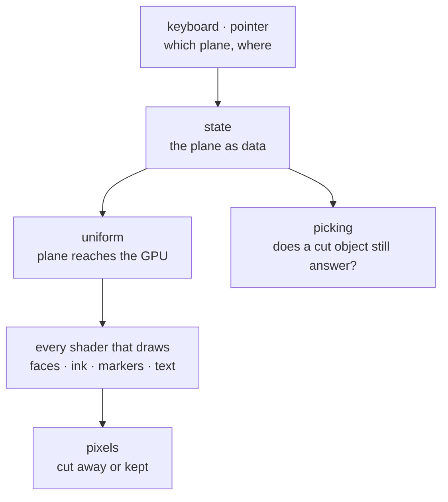
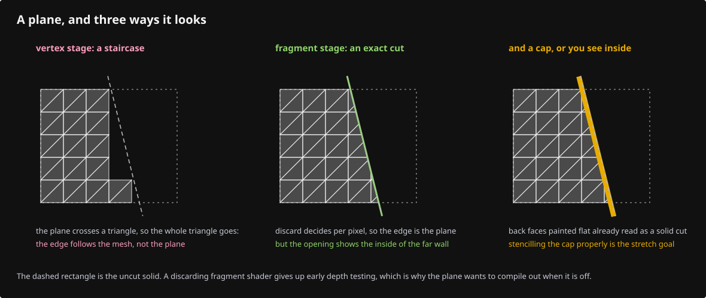

# Capstone · Build a feature nobody wrote for you

Everything until now had a next line waiting for you. This does not.

The exercise is to add a **section plane** to the viewer: a movable plane that cuts the scene, so faces, edges, markers and text on the far side of it disappear and the interior of a solid becomes visible.

It is a good final exercise because it touches every decision the course has been teaching — where data lives, who owns it, which pass sees it, what a shader may assume — and because no lesson has already made those decisions for you.

## Requirements

- One plane: a point and a normal, in the same anchored world frame the rest of the scene uses.
- Everything on the negative side is gone: faces, edges, vertex markers, point clouds, text. Not faded — gone.
- A key toggles it; the camera can move freely with it on.
- Picking agrees with the picture: a cut-away part of an object cannot be clicked.
- Turning it off costs nothing when it is off.

## Constraints

These are the architectural rules the course has established. Respect them and the feature will fit; break them and you will feel the friction immediately.

- The scene contract (`src/shaders/scene.wgsl`) is declared once and every lane shader is compiled with it.
- Lanes do not know about each other. Anything all lanes need belongs in the contract, not in six copies.
- Pipelines are built once, in `build`, never per frame.
- A view switch is a *view* change: no row is rewritten, no buffer is rebuilt, no geometry is walked again.
- The id pass and the visible pass must see the same world, or picking lies.

## Before you write anything

Answer these on paper. They are the whole exercise; the code is the easy half.

1. Where does the plane live — in `Scene`, in `View`, in a lane? Which one survives a scene reload, and should it?
2. How does it reach the GPU? Which existing uniform block already goes everywhere, and what does adding four floats to it cost?
3. Which shader stage rejects a fragment on the far side — vertex or fragment? What breaks if you choose the other one?
4. A triangle straddling the plane: what happens at its cut edge, and what would a CAD user expect to see there instead?
5. Does the depth buffer need to change? Does the coverage mask that draws silhouettes?
6. Picking: is this one more shader change, or does it come for free? *Why* does it come for free?
7. When the plane is off, what code runs? What should run?

Each of these is worked through below: the hints walk the reasoning, and the answer key gives the design in full. Read as much of it as you need.

## Working it out

Each hint is the reasoning for one of the questions above, in the same order.

### 1 · Where the plane belongs

Look at how `P` (x-ray) and `D` (headlight) are stored. Neither touches a row; both live in `View`, which is per-frame view state, and both reach the GPU in the block that is already bound to every lane. A section plane is the same kind of thing: view state, not scene state. That also answers what happens on reload — a view switch survives it, which is what a user expects.

### 2 · Getting four floats everywhere

`LineUniform` is already bound as group 1 for every lane, and `scene.wgsl` already declares it once. A plane is a `vec4`: `xyz` the unit normal, `w` the offset, so `dot(p, n) - w` is the signed distance. Adding a field means the Rust struct, the offset assertions and the WGSL declaration — the three declarations of [Habit 1](debugging.md). The mirror test in `instance.rs` will tell you if you miss one.

### 3 · Which stage cuts

A vertex-stage rejection can only remove whole triangles, so a cut face would keep a ragged edge of whichever vertices survived. Fragment-stage `discard` cuts exactly at the plane, at pixel resolution. You already saw this choice made once: x-ray discards in the fragment stage for the same reason. The cost is that a discarding fragment shader cannot be early-depth-tested — which is why you want it to compile out when the plane is off.

### 4 · The cut face

Discarding alone leaves a hollow shell: you see the *inside* of the far wall, lit from the wrong side. A real CAD viewer fills the cut with a cap. A good first version paints back faces in a flat cap colour (the viewer already knows a fragment's facing — look at how back faces are detected for the red debug paint). A full solution stencils the cap; that is a stretch goal, not a requirement.

### 5 · Picking for free

The id pass runs the *same* vertex and fragment entry points over the same rows, with the pick camera in the same uniform block. If the cut is a `discard` in a function both entry points call, a cut-away fragment writes no id, and picking agrees with the picture with no extra work. This is the payoff for the ink/physical split the course built in lesson 05 — architecture you can feel.

### 6 · Paying nothing when off

Two ways, and they are not equivalent. A branch on a uniform costs a predictable, uniform branch — cheap, and one pipeline. A pipeline-overridable constant (`override`, as `SCENE_MSAA` already does) compiles the test away entirely, at the cost of a second pipeline variant per lane. Measure before you assume the second is worth it; the honest answer for a plane test is usually the branch.

## The answer key

The design in full, with the reason for each decision.

**A design that satisfies the constraints**

- **State**: one `Option<Plane>` (or a `vec4` plus a `bool`) in `View`, beside `lit`, `opacity` and `show_outlines`. Toggled by a key in `input.rs` through a small `State` method that calls `touch`. No row, no buffer, no walk.
- **Transport**: a `vec4<f32>` field appended to `LineUniform`, declared once in `scene.wgsl`, with its offset asserted on the Rust side. Off is encoded as a zero normal, so the shader test is `dot(n, p) - w < 0.0 && any(n != 0)` — or simply a separate `enabled` float if you prefer readability over packing. Both are defensible; pick one and say why in a comment.
- **Cut**: one function in the scene contract, `fn clipped(world_pos: vec3<f32>) -> bool`, called at the top of every fragment entry that draws world geometry — faces, ribbons, markers, splats, text planes — and in the id entries by virtue of being in the same functions. One declaration, every lane.
- **Cap**: back faces on the cut side painted flat. Correct for convex solids, visibly wrong for a solid with an internal void — document that limit rather than hiding it.
- **Masks**: the coverage mask must discard too, or the silhouette will outline the part you cut away. This is the step most people miss; the symptom is a black ring floating in space.
- **Off**: a uniform branch, one pipeline, nothing allocated. The plane's `w` changes per frame while dragging, and that is a `write_buffer` of one small block — the same cost as moving the camera.
- **Tests**: a native test that puts a known point on each side of a known plane and asserts the signed distance's sign; a `cargo xtest` shader parse to keep WGSL honest. Both run without a GPU.

Notice what is *not* in this design: no new lane, no new pipeline family, no trait, no per-object clipping state. A feature that fits the architecture adds one field and one function. If your design needed a new module, re-read the constraints and ask which one pushed you there.

## Checking yourself without a reference patch

There is no solution branch to diff against, on purpose. Check it the way you would check your own work in a job:

- **It compiles at every step.** Add the field and the assertion first, and check. Then the contract function, unused, and check. Then one lane. Then the rest.
- **It fails visibly when wrong.** Set the plane to cut through the middle of the fixture and orbit. A plane that moves with the camera means you tested in view space instead of world space.
- **Picking agrees.** Click where the cut removed geometry: nothing should be selected. If something is, your id entry point skipped the test.
- **Silhouettes agree.** Turn outlines on (`O`) with the plane on. A ring around missing geometry means the mask pass is not clipping.
- **Off is off.** Toggle it off and compare a screenshot with one from before your change. They must be identical, pixel for pixel.

## If you want more

- **A second plane.** Two planes are not twice the work — but what is the right way to say "one, two, six"? An array in the uniform, a count, and a loop. Does the branch still stay uniform?
- **A dimension primitive.** A leader line, an arrowhead and a text label that keeps its size on screen. Now you *do* need a new lane, and you will decide its rows, its buffers, its pipeline, its shader and its pick answer yourself — which is exactly what lesson 04b did for strokes, but with nobody typing it for you.
- **Contribute it.** If your section plane is clean, it belongs in the viewer. Read `ARCHITECTURE.md`, and note that if you change source the course teaches, the course has to be refolded — which is the last thing this repository will teach you about keeping documentation honest.
