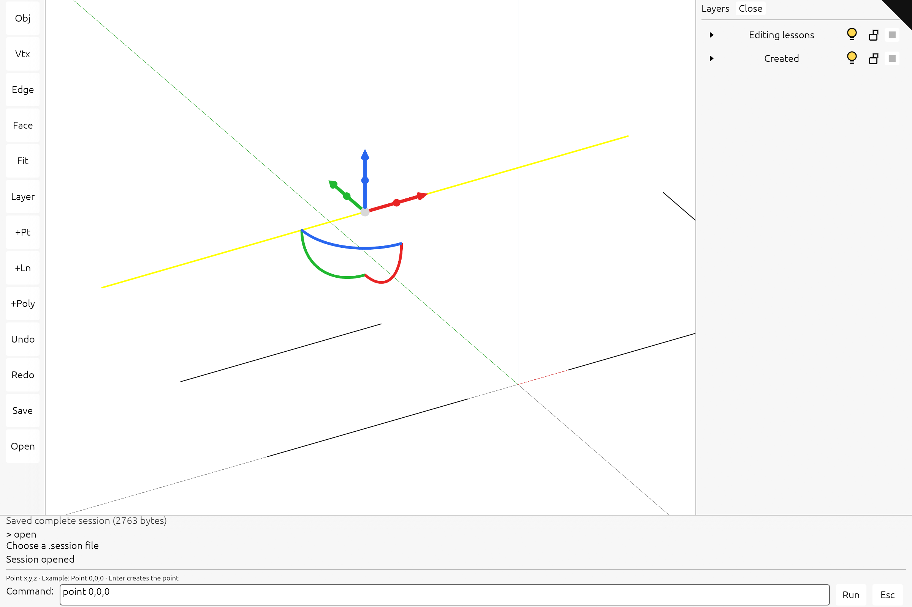

# Use the command line

The black triangle at the top right returns to the viewer. These pictures show the maintained viewer with the white, black-text egui interface. To build this complete interface yourself, follow [the nine current-viewer checkpoints](extend-integrated-tutorial.md). To learn one feature separately, choose an [independent code lesson](extend-implementation.md).

## 1. Focus and type

The command area stays across the bottom of the screen. Click its white field, or focus the canvas and press **:** (colon), then type:

```text
line 0,130,0 100,130,0
```

Coordinates are world-space `x,y,z`, separated by spaces between points. Do not type the `>` history prefix.


Press **Enter** or click **Run**. The result appears above the field. Click **Esc** to return keyboard focus to the scene; press **F** to fit the scene if the line is outside the view.


To create other objects, use the same sequence:

```text
point 0,0,0
polyline 0,180,0 100,180,0 100,230,0
```

## 2. Select and trim

Press **Escape** to return focus to the scene. Click the new line near its middle; the gumball confirms selection. Press **:** and type:

```text
trim 0.2 0.8
```


Press **Enter**. This keeps the middle 60% of the current line, from x=20 to x=80. Line and NURBS parameters are normalized to the current curve: this command does not trim against another object.

## 3. Extend the result

Press **Escape** and select the trimmed line again. Run:

```text
extend -0.2 1.2
```


The interval applies to the trimmed line, so its endpoints become x=8 and x=92. It does not restore the original endpoints.

## 4. Explode and undo

Create the polyline from step 1. Press **Escape**, then **F**, and click its horizontal segment. Click the bottom command field and run:

```text
explode
```


Two independent lines replace the selected polyline. Run `undo` to restore it; `redo` repeats the explosion. Explode supports polylines, not meshes or BReps.


## Selection and keyboard focus

**L**, or the **Layer** toolbar button, toggles the right-hand Layers panel. Expand a group with its small triangle; click its name to select descendants or its bulb to hide them. The command field owns letters while you type. **Escape** returns focus to the scene; the bottom command area remains visible. A failed command displays its reason and preserves the document.

The [capture record](extensions/screenshots.json) identifies the browser, GPU configuration and exact operations. The [verification record](extensions/README.md) covers repeated editing, resize, DPI and cleanup checks.

## Toolbar, phone editing and saving

The left toolbar provides **Obj**, **Vtx**, **Edge** and **Face** selection tools. Select an object before **Vtx**, then select its original vertex or NURBS control. **Edge** and **Face** let you tap source subobjects directly. Drag a gumball handle with a mouse or one finger, or enter `move`, `rotate` or `scale`. A second finger cancels an active edit. On a phone, **Layer** opens the right panel when needed.

**Save** downloads one `.session` file containing all retained documents, updated source geometry, placements, hidden objects, selection locks, display colors and annotations. **Open** restores it. Partially streamed scenes cannot yet be saved as complete files. Meshes, NURBS boundaries and compatible joined BRep edits are supported; BRep changes requiring trim reconstruction return an error and preserve the original shape.

[Checkpoint 8](current-8.md) explains the implementation and shows how to add a toolbar button by extending the `TOOLBAR` table.

## Layer visibility, selection locks and colors

Expand the right-hand tree to see objects and their children. Click a bulb to hide or show that subtree, a lock to prevent or allow selection, and a color swatch to choose a palette color or edit its RGB values. Save/Open retains all three settings. [Checkpoint 9](current-9.md) implements these controls and the live shell preview.

## Expected viewer result

The completed viewer: a command dock across the bottom with syntax hints, one right-hand layer tree with bulbs, selection locks and color swatches, and a left toolbar. The selected source object has its solid gumball. Save/Open retains the edited geometry and layer settings. See the [phone layout](screenshots/extensions-workspace-current-phone.png).

[](screenshots/extensions-workspace-current-desktop.png)
