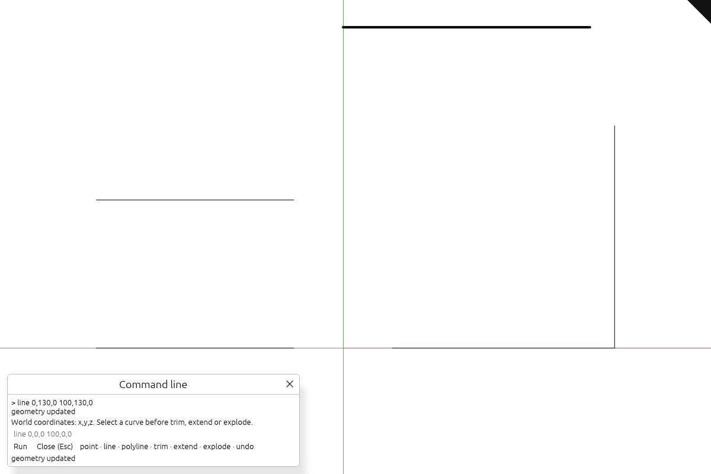
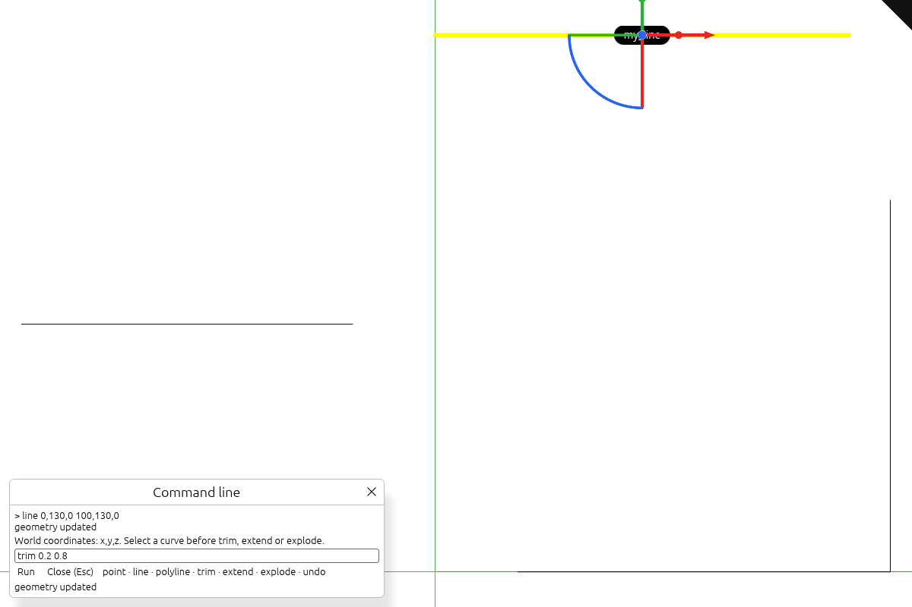
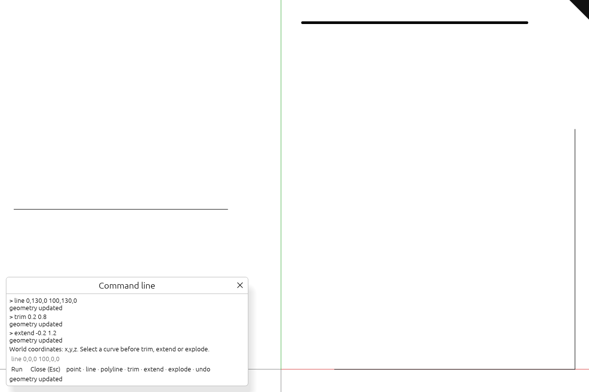
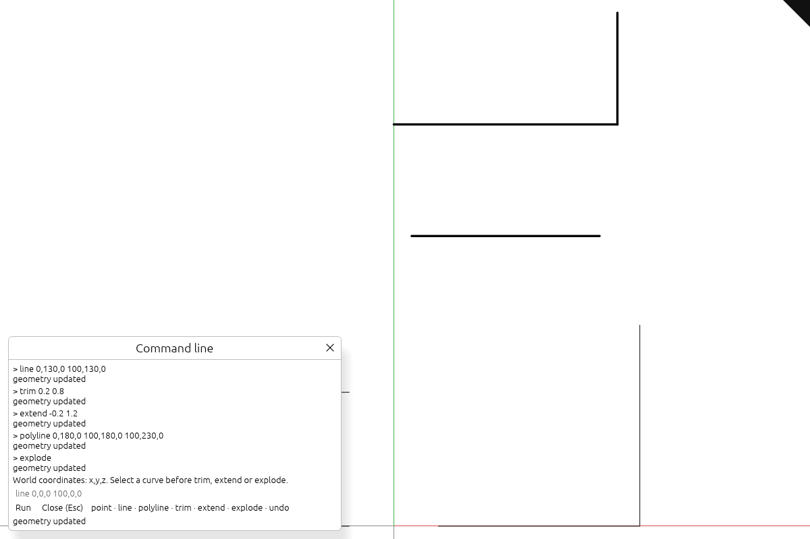
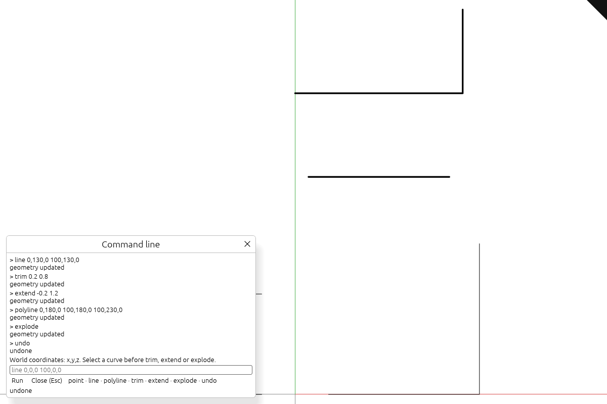

# Use the command line

The black triangle at the top right returns to the viewer. These pictures show the maintained viewer with the white, black-text egui interface. To build this complete interface yourself, follow [the seven current-viewer checkpoints](extend-integrated-tutorial.md). To learn one feature separately, choose an [independent code lesson](extend-implementation.md).

## 1. Open and type

Click the viewer canvas. Press **:** (colon). Click the white command field and type:

```text
line 0,130,0 100,130,0
```

Coordinates are world-space `x,y,z`, separated by spaces between points. Do not type the `>` history prefix.


Press **Enter** or click **Run**. The result appears above the field. Click **Close (Esc)** before using scene shortcuts; press **F** to fit the scene if the line is outside the view.



To create other objects, use the same sequence:

```text
point 0,0,0
polyline 0,180,0 100,180,0 100,230,0
```

## 2. Select and trim

Close the command window. Click the new line near its middle; the gumball confirms selection. Press **:** and type:

```text
trim 0.2 0.8
```



Press **Enter**. This keeps the middle 60% of the current line, from x=20 to x=80. Line and NURBS parameters are normalized to the current curve: this command does not trim against another object.

## 3. Extend the result

Close the window and select the trimmed line again. Run:

```text
extend -0.2 1.2
```



The interval applies to the trimmed line, so its endpoints become x=8 and x=92. It does not restore the original endpoints.

## 4. Explode and undo

Create the polyline from step 1. Close the window, press **F**, and click its horizontal segment. Open the command window and run:

```text
explode
```



Two independent lines replace the selected polyline. Run `undo` to restore it; `redo` repeats the explosion. Explode supports polylines, not meshes or BReps.



## Selection and keyboard focus

**L** opens Session layers. Expand a group with its small triangle; click its name to select descendants or **Hide** to hide them. The command field owns letters while you type. **Escape** closes it; scene shortcuts work after it closes. A failed command displays its reason and preserves the document.

The [capture record](extensions/screenshots.json) identifies the browser, GPU configuration and exact operations. The [verification record](extensions/README.md) covers repeated editing, resize, DPI and cleanup checks.
