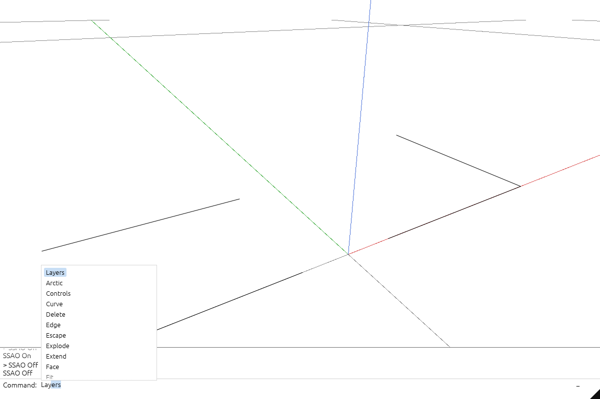

# Use the command line

The black triangle at the top right returns to the viewer. The viewer uses a white command dock with black text. Older step captures below may still show the former toolbar and Run button; commands now run with Enter. To build this interface yourself, follow the course from [lesson 22](22-runtime-helpers.md) to [lesson 37](37-command-dock.md).

## 1. Focus and type

The command area stays across the bottom and is ready for typing when the page opens. Enter a command first; its options appear only after you accept it with **Enter**, **Tab**, or **Space**. For example, type `Arctic`, press **Enter**, then click **On** or **Off** in the command row. Merely typing a matching prefix does not show options or change the shading.

Suggested command suffixes are selected inline. **Up/Down** or the mouse wheel browses the completion list; matching names come first and other commands remain available. **Escape** clears the pending command and returns focus to the scene. Complete commands such as `Arctic On` run directly with **Enter**.



Click the white field, or focus the canvas and press **:** (colon), then type:

```text
line 0,130,0 100,130,0
```

Coordinates are world-space `x,y,z`, separated by spaces between points. Do not type the `>` history prefix.


Press **Enter**. The result appears above the field. Press **Escape** to return keyboard focus to the scene; press **F** to fit the scene if the line is outside the view.


To create other objects, use the same sequence:

```text
point 0,0,0
polyline 0,180,0 100,180,0 100,230,0
```

Drag the horizontal divider at the top of the command area up or down to show more or less history. The **−** button collapses history; **+** restores its previous height.

You can also type `Point`, `Line`, or `Polyline` and press **Enter**, or click the command in the suggestion list, then pick points in the scene. Point finishes after one click and Line after two. Polyline continues until **Enter** or **Finish**. You can mix clicks with coordinates, including relative coordinates such as `@10,0,0`. **Escape** cancels the unfinished drawing.

While Polyline is active, its submenu offers:

- **Points**: the default sequence of clicked or typed vertices.
- **Rectangle**: pick two opposite corners on the construction plane.
- **Polygon**: pick a center and a radius point. The default is six sides; enter `Sides 5` before the radius point for a pentagon.

`Arctic On` enables the same soft contact shading; `Off` disables it. **G** toggles it when the viewport has keyboard focus. These controls preserve the camera. See [Arctic quality and performance](ssao.md) for floor, plate and primitive examples.

`Snap On` and `Snap Off` control endpoint, vertex and midpoint snapping, including during a draft. The default capture distance is 12 screen pixels. A blue marker names the active snap. `Layers On` and `Layers Off` show or hide the layer tree, which starts hidden. `Rotate` offers **x**, **y**, and **z**, followed by an angle.

## 2. Select and trim

Press **Escape** to return focus to the scene. Click the new line near its middle; the gumball confirms selection. Press **:** and type:

```text
trim 0.2 0.8
```


Press **Enter**. This keeps the middle 60% of the current line, from x=20 to x=80. Line and NURBS parameters are normalized to the current curve: this command does not trim against another object.

## 3. Extend the result

Press **Escape** and select the trimmed line again. Run:

```text
extend -0.2 1.2
```


The interval applies to the trimmed line, so its endpoints become x=8 and x=92. It does not restore the original endpoints.

## 4. Explode and undo

Create the polyline from step 1. Press **Escape**, then **F**, and click its horizontal segment. Click the bottom command field and run:

```text
explode
```


Two independent lines replace the selected polyline. Run `undo` to restore it; `redo` repeats the explosion. Explode supports polylines, not meshes or BReps.


## Selection and keyboard focus

**L** in the scene toggles the right-hand Layers panel. You can also run `Layers` and choose **On** or **Off**. Expand a group with its small triangle; click its name to select descendants or its bulb to hide them. The command field owns letters while you type. **Escape** returns focus to the scene; the bottom command area remains visible. A failed command displays its reason and preserves the document.

On a phone, tap the command field: the keyboard opens and what you type goes into the field, with **Enter** running the line. **Enter** on an empty field closes the command box but keeps the keyboard up, and then the letters are the scene's own keys - **H** hides, **S** shows all, **F** fits, **P** toggles x-ray, **1**-**7** set the views - exactly as on a desktop; **:** reopens the field. Tapping the scene puts the keyboard away.

`Opacity 0..1` sets how solid the shaded faces are: `Opacity 1` is opaque, `Opacity 0` is x-ray with only the edges left, and anything between is glass - the faces dim without hiding the linework inside or behind them. A document with elements opens at 0.7 so their features show through; the `Opacity` command or `?opacity=` in the address bar overrides that.

The captions identify the browser, GPU configuration and exact operations.

## Selection commands, touch editing and saving

Use `Object`, `Controls`, `Edge`, and `Face` to choose selection tools. Select an object before `Controls`, then select its original vertex or NURBS control. `Edge` and `Face` let you tap source subobjects directly. Shift-click adds objects to a shared selection and gumball; selecting a layer group selects its descendants. Drag a gumball handle with a mouse or one finger, or enter `Move`, `Rotate`, or `Scale`. A second finger cancels an active edit. `Layers On` opens the right panel when needed.

**Save** downloads one `.session` file containing all retained documents, updated source geometry, placements, hidden objects, selection locks, display colors and annotations. **Open** restores it. Partially streamed scenes cannot yet be saved as complete files. Meshes, NURBS boundaries and compatible joined BRep edits are supported; BRep changes requiring trim reconstruction return an error and preserve the original shape.

[Lesson 23](23-geometry-commands.md) builds the command line and [lesson 23a](23a-tools.md) the selection tools; a new command is one file in `app/command/verbs/` plus one line in `verbs!`.

## Layer visibility, selection locks and colors

Expand the right-hand tree to see objects and their children. Click a bulb to hide or show that subtree, a lock to prevent or allow selection, and a color swatch to choose a palette color or edit its RGB values. Save/Open retains all three settings. [Lesson 30](30-layer-tree.md) builds these controls.

## Split with cutter curves

Create a `Line`, `Polyline`, or `Curve` using world coordinates; `Curve` uses the supplied points as NURBS control points, with degree up to three. Created curves use a screen-space pen so they remain visible when zoomed out.

Select a target curve, standalone surface, or one BRep face. Use **Ctrl+Shift** or the `Face` command for face selection. Press **Split**, select one or more cutter curves in the viewport or layer tree, then press **Enter** or tap **Split** again. **Esc** cancels. The command dock reports the selected cutter count and explains invalid input.

Curve splits keep all pieces. Face splits preserve existing holes and retain every region inside the owning BRep, updating shared boundaries so the shell stays joined. Cutters must intersect curves in 3D or lie on the selected surface within tolerance. Ambiguous overlaps and unsupported seam cases are rejected. This operation does not perform booleans, project cutters, cap holes or divide a solid into separate volumes.

Use **Undo**, **Redo**, and **Save/Open** to verify the retained source. [Lesson 31](31-splitting.md) builds Split.

## Expected viewer result

Click a layer swatch to change its display colors. Surface objects expose **Faces** and **Edges** independently. **Original** restores the authored colors for the active channel; parent controls apply to children. Save/Open retains both overrides.


The current viewer has a command dock across the bottom and an optional right-hand layer tree with bulbs, selection locks and color swatches. Selection tools are commands; the older capture below still includes the former left toolbar. Split keeps both face regions in the joined shell. The selected region has its gumball; Save/Open retains the edited geometry and layer settings. See the [phone layout](screenshots/extensions-workspace-current-phone.png).

[](screenshots/extensions-workspace-current-desktop.png)
