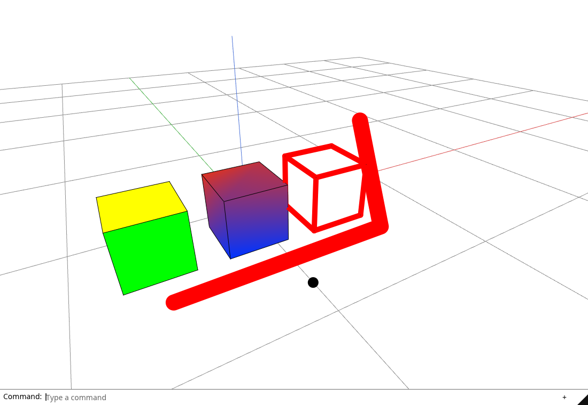
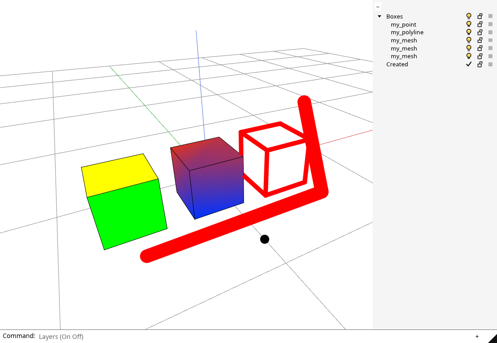
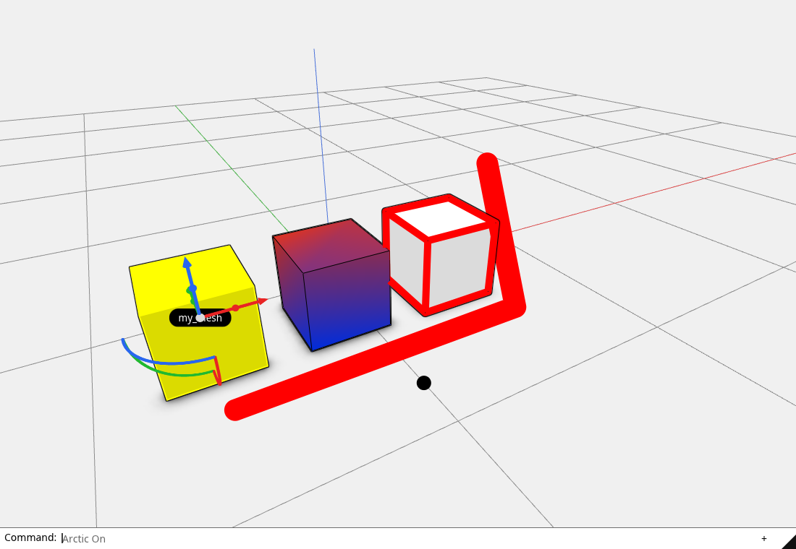
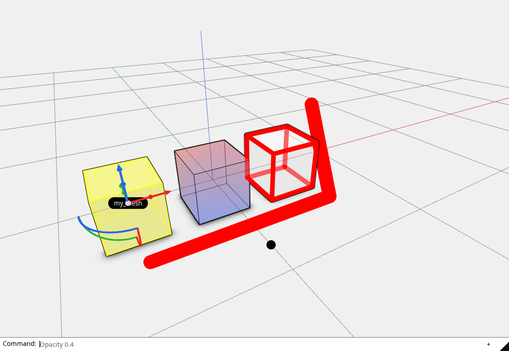

# Use the command line

Allow 30 minutes. This is a practice session in the finished viewer, with no Rust to type. Complete [lesson 37](37-command-dock.md) first, or use its supplied answer. The pictures below are actual captures of the current viewer using the course box scene.

Start the viewer with `trunk serve --port 8780` from your completed practice folder and open http://localhost:8780/?data=off. You should see three boxes, a red polyline and a black point. The command field runs across the bottom.



## Step 1 · Create one point, then undo

Click the command field and enter:

```text
Point 300,200,200
```

Press Enter. The three numbers are x, y and z in world coordinates; commas separate the components of one point. Look above the boxes for the new point. Enter `Undo` and check that it disappears. One command creates one editable object, and one undo removes that change.


If the command stays unfinished, check that you supplied all three coordinates. Do not type the `>` prefix shown in command history.

## Step 2 · Find an object through the layers panel

Enter `Layers On`. Expand the box scene if needed and click one object's row. The matching object should become selected. The panel and canvas are two views of the same source identity.




Enter `Layers Off` to make room again. Closing the panel does not delete its objects.

## Step 3 · Change how the same scene is drawn

Enter `Arctic On`. Look for the contact shading and outlines. Then enter `Opacity 0.4`; faces become translucent while edges remain readable. These are display settings, so they should not create new geometry.





Finish with `Opacity 1` and `Arctic Off`. You have restored opaque drawing and turned off Arctic shading. You can also enter an incomplete command such as `Arctic`, press Enter, and choose one of its displayed options. Escape cancels a pending command.

You are done when you can explain the difference between creating an object, selecting it, and changing its appearance. To see how the command definition works, return to [lesson 23](23-geometry-commands.md).
