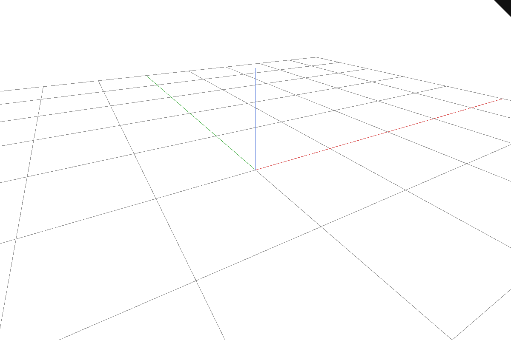

# current-1 · Refresh diagnostics and resource checks

Continuing from checkpoint 21, the grid still orbits, pans and zooms while diagnostics retain the first GPU failure.

## Step 1 · src/engine/gpu/device.rs
Two edits: keep the first device error when later submissions fail; test that the original message survives.

`lessons/current-1/src/engine/gpu/device.rs` · edit · type this

Replaces the line `#[cfg(target_arch = "wasm32")]` in `lessons/21/src/engine/gpu/device.rs`

```rust
--8<-- "lessons/current-1/src/engine/gpu/device.rs:step-1a"
```

Added after the line `}` in `lessons/21/src/engine/gpu/device.rs`

```rust
--8<-- "lessons/current-1/src/engine/gpu/device.rs:step-1b"
```

## Step 2 · src/engine/gpu/surface_outline.rs
Three edits: measure fractional silhouette coverage with selection disabled and enabled; check the accumulated coverage; require the same outline width in both states.

`lessons/current-1/src/engine/gpu/surface_outline.rs` · edit · type this

Replaces the line `gpu.view.show_mesh_edges = false;` in `lessons/21/src/engine/gpu/surface_outline.rs`

```rust
--8<-- "lessons/current-1/src/engine/gpu/surface_outline.rs:step-2a"
```

Replaces the 2 lines from `black > 500,` in `lessons/21/src/engine/gpu/surface_outline.rs`

```rust
--8<-- "lessons/current-1/src/engine/gpu/surface_outline.rs:step-2b"
```

Replaces the 3 lines from `assert!(` in `lessons/21/src/engine/gpu/surface_outline.rs`

```rust
--8<-- "lessons/current-1/src/engine/gpu/surface_outline.rs:step-2c"
```

## Step 3 · src/engine/gpu/upload.rs
Replace the upload vector with an empty vector to release its allocation.

`lessons/current-1/src/engine/gpu/upload.rs` · edit · type this

Replaces the 2 lines from `v.clear();` in `lessons/21/src/engine/gpu/upload.rs`

```rust
--8<-- "lessons/current-1/src/engine/gpu/upload.rs:step-3"
```

## Check

Run `trunk serve` in `lessons/current-1/` and open <http://127.0.0.1:8770/>.

Expected: the grid and world axes remain visible, orbit still works, and the status area has no error message.



If it fails:

- Later errors hide the allocation failure: the stored failure is overwritten.
- Memory stays allocated after replacement: the upload vector is cleared but its capacity is retained.

## What changed

```text
lessons/current-1/src/
├── app/
│   ├── inspection/
│   │   └── source_memory.rs
│   ├── walk/
│   │   ├── bounds.rs
│   │   ├── brep.rs
│   │   ├── brep_edges.rs
│   │   ├── brep_orient.rs
│   │   ├── cloud.rs
│   │   ├── curves.rs
│   │   ├── encode.rs
│   │   ├── frames.rs
│   │   ├── mesh.rs
│   │   ├── mesh_ink.rs
│   │   ├── mesh_topology.rs
│   │   ├── mod.rs
│   │   ├── points.rs
│   │   └── sheet.rs
│   ├── cloud_query.rs
│   ├── command.rs
│   ├── coords.rs
│   ├── cplane.rs
│   ├── decode.rs
│   ├── edit.rs
│   ├── feedback.rs
│   ├── fetch.rs
│   ├── gizmo.rs
│   ├── input.rs
│   ├── inspection.rs
│   ├── knobs.rs
│   ├── layers.rs
│   ├── live.rs
│   ├── loader.rs
│   ├── manifest.rs
│   ├── mod.rs
│   ├── route.rs
│   ├── scene.rs
│   ├── scene_text.rs
│   ├── selection.rs
│   ├── sheet_query.rs
│   ├── snap.rs
│   ├── stream.rs
│   ├── touch.rs
│   └── validate.rs
├── engine/
│   ├── gpu/
│   │   ├── arena.rs
│   │   ├── backdrop.rs
│   │   ├── buffers.rs
│   │   ├── cloud.rs
│   │   ├── device.rs  ~
│   │   ├── faces.rs
│   │   ├── frame.rs
│   │   ├── glyphs.rs
│   │   ├── instance.rs
│   │   ├── lod.rs
│   │   ├── mod.rs
│   │   ├── objects.rs
│   │   ├── pick.rs
│   │   ├── present.rs
│   │   ├── render.rs
│   │   ├── segments.rs
│   │   ├── splat.rs
│   │   ├── surface_outline.rs  ~
│   │   ├── targets.rs
│   │   ├── text.rs
│   │   ├── text_outline.rs
│   │   ├── text_plane.rs
│   │   ├── text_plate.rs
│   │   ├── triangle_tiles.rs
│   │   ├── upload.rs  ~
│   │   └── view.rs
│   ├── pipelines/
│   │   ├── layouts.rs
│   │   └── mod.rs
│   ├── mod.rs
│   ├── performance.rs
│   └── text.rs
├── shaders/
│   ├── background.wgsl
│   ├── glyph.wgsl
│   ├── grid.wgsl
│   ├── ink_visibility.wgsl
│   ├── normals.wgsl
│   ├── physical.wgsl
│   ├── project_triangles.wgsl
│   ├── projected_triangle.wgsl
│   ├── ribbon.wgsl
│   ├── scan_triangle_tiles.wgsl
│   ├── scene.wgsl
│   ├── sphere.wgsl
│   ├── splat.wgsl
│   ├── splat_resolve.wgsl
│   ├── surface_outline.wgsl
│   ├── text_outline.wgsl
│   ├── text_plane.wgsl
│   ├── text_plate.wgsl
│   ├── triangle.wgsl
│   └── triangle_tiles.wgsl
├── state/
│   ├── cloud_query.rs
│   ├── edit.rs
│   ├── sheet_query.rs
│   └── text.rs
├── camera.rs
├── lib.rs
└── state.rs
```

`+` new in this lesson · `~` changed in this lesson

Data flow: GPU failure or scene replacement → diagnostics and released upload storage.
Every file at this point: `lessons/current-1/`.

## Next

[Continue with current-2](current-2.md).

## Expected viewer result

With an empty scene, the viewer shows the grid and world axes. Orbit, pan and zoom should work. Runtime diagnostics add no visible editing control. Captured in the maintained viewer with an empty manifest and no object selected.

[](screenshots/current-empty.png)
