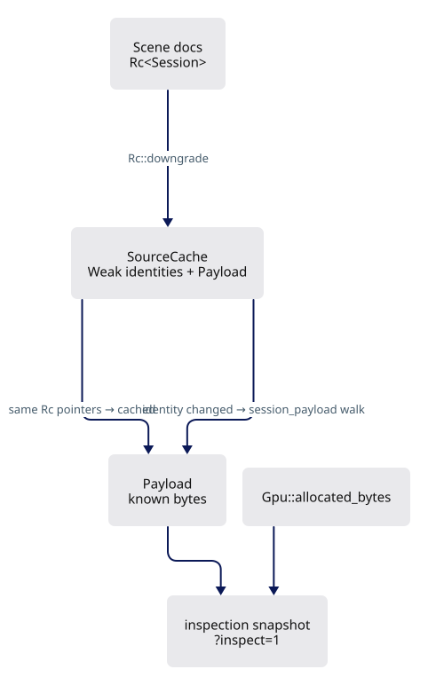

# 1 · Refresh diagnostics and resource checks

[Previous](extend-integrated-tutorial.md) · [Sequence](extend-integrated-tutorial.md) · [Next](current-2.md)

Continue in the same checkpoint workspace. Complete the edits below before compiling.



Bring the frozen runtime helpers to their maintained state before adding optional features. Existing rendering remains usable.

### `src/app/coords.rs`

**TYPE THIS**

**CURRENT**

```rust
            let v = along?;
            Some(Point::new(p[0] + v[0] * d, p[1] + v[1] * d, p[2] + v[2] * d))
        }
```

**REPLACE WITH**

```rust
            let v = along?;
            Some(Point::new(
                p[0] + v[0] * d,
                p[1] + v[1] * d,
                p[2] + v[2] * d,
            ))
        }
```

**TYPE THIS**

**CURRENT**

```rust
    fn the_four_forms_parse() {
        assert_eq!(parse("12,4,2"), Some(Typed::Absolute { x: 12.0, y: 4.0, z: Some(2.0) }));
        assert_eq!(parse(" 12 , 4 "), Some(Typed::Absolute { x: 12.0, y: 4.0, z: None }));
        assert_eq!(parse("@3,0"), Some(Typed::Relative { x: 3.0, y: 0.0, z: None }));
        assert_eq!(parse("@5<90"), Some(Typed::Polar { distance: 5.0, degrees: 90.0 }));
        assert_eq!(parse("7.5"), Some(Typed::Distance(7.5)));
```

**REPLACE WITH**

```rust
    fn the_four_forms_parse() {
        assert_eq!(
            parse("12,4,2"),
            Some(Typed::Absolute {
                x: 12.0,
                y: 4.0,
                z: Some(2.0)
            })
        );
        assert_eq!(
            parse(" 12 , 4 "),
            Some(Typed::Absolute {
                x: 12.0,
                y: 4.0,
                z: None
            })
        );
        assert_eq!(
            parse("@3,0"),
            Some(Typed::Relative {
                x: 3.0,
                y: 0.0,
                z: None
            })
        );
        assert_eq!(
            parse("@5<90"),
            Some(Typed::Polar {
                distance: 5.0,
                degrees: 90.0
            })
        );
        assert_eq!(parse("7.5"), Some(Typed::Distance(7.5)));
```

### `src/app/cplane.rs`

**TYPE THIS**

**CURRENT**

```rust
            CPlane::Xy
                .hit(&origin, &Point::new(0.0, 0.0, 4.0), &Vector::new(1.0, 0.0, 0.0))
                .is_none(),
            "parallel"
        );
        assert!(
            CPlane::Xy
                .hit(&origin, &Point::new(0.0, 0.0, 4.0), &Vector::new(0.0, 0.0, 1.0))
                .is_none(),
```

**REPLACE WITH**

```rust
            CPlane::Xy
                .hit(
                    &origin,
                    &Point::new(0.0, 0.0, 4.0),
                    &Vector::new(1.0, 0.0, 0.0)
                )
                .is_none(),
            "parallel"
        );
        assert!(
            CPlane::Xy
                .hit(
                    &origin,
                    &Point::new(0.0, 0.0, 4.0),
                    &Vector::new(0.0, 0.0, 1.0)
                )
                .is_none(),
```

### `src/app/snap.rs`

**TYPE THIS**

**CURRENT**

```rust
        let interior = i != 0 && i != last;
        let kind = if closed || interior { SnapKind::Vertex } else { SnapKind::End };
        out.push(Snap { point: p.clone(), kind, owner });
    }
```

**REPLACE WITH**

```rust
        let interior = i != 0 && i != last;
        let kind = if closed || interior {
            SnapKind::Vertex
        } else {
            SnapKind::End
        };
        out.push(Snap {
            point: p.clone(),
            kind,
            owner,
        });
    }
```

**TYPE THIS**

**CURRENT**

```rust
/// or otherwise off the frustum - a candidate that cannot be seen cannot be snapped to.
pub fn best<F>(
    candidates: &[Snap],
    cursor: (f64, f64),
    aperture: f64,
    project: F,
) -> Option<Snap>
where
    F: Fn(&Point) -> Option<(f64, f64)>,
{
    let mut winner: Option<(SnapKind, f64, &Snap)> = None;
    for c in candidates {
        let Some((x, y)) = project(&c.point) else { continue };
        let (dx, dy) = (x - cursor.0, y - cursor.1);
```

**REPLACE WITH**

```rust
/// or otherwise off the frustum - a candidate that cannot be seen cannot be snapped to.
pub fn best<F>(candidates: &[Snap], cursor: (f64, f64), aperture: f64, project: F) -> Option<Snap>
where
    F: Fn(&Point) -> Option<(f64, f64)>,
{
    let mut winner: Option<(SnapKind, f64, &Snap)> = None;
    for c in candidates {
        let Some((x, y)) = project(&c.point) else {
            continue;
        };
        let (dx, dy) = (x - cursor.0, y - cursor.1);
```

**TYPE THIS**

**CURRENT**

```rust
        let mut out = Vec::new();
        from_polyline(&[p(0.0, 0.0), p(10.0, 0.0), p(10.0, 10.0)], false, 7, &mut out);
        let count = |k: SnapKind| out.iter().filter(|s| s.kind == k).count();
```

**REPLACE WITH**

```rust
        let mut out = Vec::new();
        from_polyline(
            &[p(0.0, 0.0), p(10.0, 0.0), p(10.0, 10.0)],
            false,
            7,
            &mut out,
        );
        let count = |k: SnapKind| out.iter().filter(|s| s.kind == k).count();
```

**TYPE THIS**

**CURRENT**

```rust
        let mut out = Vec::new();
        from_polyline(&[p(0.0, 0.0), p(10.0, 0.0), p(10.0, 10.0)], true, 0, &mut out);
        assert_eq!(out.iter().filter(|s| s.kind == SnapKind::End).count(), 0);
```

**REPLACE WITH**

```rust
        let mut out = Vec::new();
        from_polyline(
            &[p(0.0, 0.0), p(10.0, 0.0), p(10.0, 10.0)],
            true,
            0,
            &mut out,
        );
        assert_eq!(out.iter().filter(|s| s.kind == SnapKind::End).count(), 0);
```

**TYPE THIS**

**CURRENT**

```rust
        let candidates = vec![
            Snap { point: p(2.0, 0.0), kind: SnapKind::Near, owner: 0 },
            Snap { point: p(6.0, 0.0), kind: SnapKind::End, owner: 0 },
        ];
```

**REPLACE WITH**

```rust
        let candidates = vec![
            Snap {
                point: p(2.0, 0.0),
                kind: SnapKind::Near,
                owner: 0,
            },
            Snap {
                point: p(6.0, 0.0),
                kind: SnapKind::End,
                owner: 0,
            },
        ];
```

**TYPE THIS**

**CURRENT**

```rust
        let candidates = vec![
            Snap { point: p(9.0, 0.0), kind: SnapKind::End, owner: 1 },
            Snap { point: p(3.0, 0.0), kind: SnapKind::End, owner: 2 },
        ];
```

**REPLACE WITH**

```rust
        let candidates = vec![
            Snap {
                point: p(9.0, 0.0),
                kind: SnapKind::End,
                owner: 1,
            },
            Snap {
                point: p(3.0, 0.0),
                kind: SnapKind::End,
                owner: 2,
            },
        ];
```

**TYPE THIS**

**CURRENT**

```rust
    fn out_of_reach_and_out_of_sight_do_not_snap() {
        let candidates = vec![Snap { point: p(40.0, 0.0), kind: SnapKind::End, owner: 0 }];
        assert!(best(&candidates, (0.0, 0.0), 12.0, flat).is_none(), "too far");
        let near = vec![Snap { point: p(1.0, 0.0), kind: SnapKind::End, owner: 0 }];
        assert!(best(&near, (0.0, 0.0), 12.0, |_| None).is_none(), "not visible");
    }
```

**REPLACE WITH**

```rust
    fn out_of_reach_and_out_of_sight_do_not_snap() {
        let candidates = vec![Snap {
            point: p(40.0, 0.0),
            kind: SnapKind::End,
            owner: 0,
        }];
        assert!(
            best(&candidates, (0.0, 0.0), 12.0, flat).is_none(),
            "too far"
        );
        let near = vec![Snap {
            point: p(1.0, 0.0),
            kind: SnapKind::End,
            owner: 0,
        }];
        assert!(
            best(&near, (0.0, 0.0), 12.0, |_| None).is_none(),
            "not visible"
        );
    }
```

### `src/camera.rs`

**TYPE THIS**

**CURRENT**

```rust
mod wheel_tests {
#[cfg(test)]
mod ray_tests {
    use super::*;

    fn viewport() -> (f64, f64) {
        (800.0, 400.0)
    }

    /// The centre pixel looks straight down the view axis, in both projections.
    #[test]
    fn the_centre_ray_is_the_view_axis() {
        let mut cam = Camera::new();
        cam.update_position();
        for perspective in [true, false] {
            cam.perspective = perspective;
            let (_, dir) = cam.ray((400.0, 200.0), viewport()).expect("a ray");
            let forward = cam.orientation.rotate_vector(Vector::y_axis());
            for i in 0..3 {
                assert!((dir[i] - forward[i]).abs() < 1e-12, "{perspective}");
            }
        }
    }

    /// Every perspective ray leaves the eye; every orthographic ray is parallel to the axis
    /// and starts somewhere else. That difference is the whole reason the two paths exist.
    #[test]
    fn perspective_rays_share_an_origin_and_ortho_rays_share_a_direction() {
        let mut cam = Camera::new();
        cam.update_position();

        cam.perspective = true;
        let (a, da) = cam.ray((100.0, 80.0), viewport()).expect("a ray");
        let (b, db) = cam.ray((700.0, 320.0), viewport()).expect("a ray");
        for i in 0..3 {
            assert!((a[i] - b[i]).abs() < 1e-9, "one eye");
        }
        assert!((0..3).any(|i| (da[i] - db[i]).abs() > 1e-6), "different directions");

        cam.perspective = false;
        let (a, da) = cam.ray((100.0, 80.0), viewport()).expect("a ray");
        let (b, db) = cam.ray((700.0, 320.0), viewport()).expect("a ray");
        for i in 0..3 {
            assert!((da[i] - db[i]).abs() < 1e-12, "one direction");
        }
        assert!((0..3).any(|i| (a[i] - b[i]).abs() > 1e-6), "different origins");
    }

    /// A ray through a pixel passes through the world point that pixel shows: walk the target
    /// plane's own point back to the screen and the ray must come back to it.
    #[test]
    fn a_ray_hits_the_target_plane_where_the_cursor_is() {
        let mut cam = Camera::new();
        cam.update_position();
        // WORLD units on both sides: the camera keeps metres internally, and a ray that
        // answered in those would miss everything it is tested against by a factor of a
        // thousand.
        let target = cam.origin();
        let half_h = cam.distance_world() * (FOVY_DEG * 0.5).to_radians().tan();
        let half_w = half_h * (viewport().0 / viewport().1);
        let right = cam.orientation.rotate_vector(Vector::x_axis());
        let forward = cam.orientation.rotate_vector(Vector::y_axis());
        // The world point a quarter right and a quarter up from the target.
        let expected: Vec<f64> = (0..3)
            .map(|i| target[i] + right[i] * 0.5 * half_w + cam.up[i] * 0.5 * half_h)
            .collect();
        for perspective in [true, false] {
            cam.perspective = perspective;
            let (origin, dir) = cam.ray((600.0, 100.0), viewport()).expect("a ray");
            // Advance to the target plane, whose normal is the view axis.
            let denom: f64 = (0..3).map(|i| dir[i] * forward[i]).sum();
            let num: f64 = (0..3).map(|i| (target[i] - origin[i]) * forward[i]).sum();
            let t = num / denom;
            for i in 0..3 {
                let hit = origin[i] + dir[i] * t;
                assert!((hit - expected[i]).abs() < 1e-6, "{perspective} axis {i}");
            }
        }
    }

    /// The unit itself, pinned: the eye sits `distance_world` from the target in the file's own
    /// units. Read straight off `position` it would be a thousand times nearer in a millimetre
    /// scene, and every hit test built on the ray would miss.
    #[test]
    fn the_ray_is_in_world_units_not_the_camera_s_metres() {
        let mut cam = Camera::new();
        cam.update_position();
        // The centre pixel, so the ray points straight at the target and the projection below
        // is the whole distance rather than its cosine.
        let (origin, dir) = cam
            .ray((viewport().0 * 0.5, viewport().1 * 0.5), viewport())
            .expect("a ray");
        let target = cam.origin();
        let reach: f64 = (0..3).map(|i| (target[i] - origin[i]) * dir[i]).sum();
        assert!(
            (reach - cam.distance_world()).abs() < 1e-6,
            "the eye is distance_world from the target, in world units"
        );
        assert!(
            cam.distance_world() > cam.distance * 100.0,
            "the fixture is a millimetre scene, so the two really do differ"
        );
    }

    /// A zero or non-finite viewport has no ray, rather than a NaN one.
    #[test]
    fn a_degenerate_viewport_has_no_ray() {
        let mut cam = Camera::new();
        cam.update_position();
        assert!(cam.ray((1.0, 1.0), (0.0, 400.0)).is_none());
        assert!(cam.ray((f64::NAN, 1.0), viewport()).is_none());
    }
}
    use super::*;
```

**REPLACE WITH**

```rust
mod wheel_tests {
    #[cfg(test)]
    mod ray_tests {
        use super::*;

        fn viewport() -> (f64, f64) {
            (800.0, 400.0)
        }

        /// The centre pixel looks straight down the view axis, in both projections.
        #[test]
        fn the_centre_ray_is_the_view_axis() {
            let mut cam = Camera::new();
            cam.update_position();
            for perspective in [true, false] {
                cam.perspective = perspective;
                let (_, dir) = cam.ray((400.0, 200.0), viewport()).expect("a ray");
                let forward = cam.orientation.rotate_vector(Vector::y_axis());
                for i in 0..3 {
                    assert!((dir[i] - forward[i]).abs() < 1e-12, "{perspective}");
                }
            }
        }

        /// Every perspective ray leaves the eye; every orthographic ray is parallel to the axis
        /// and starts somewhere else. That difference is the whole reason the two paths exist.
        #[test]
        fn perspective_rays_share_an_origin_and_ortho_rays_share_a_direction() {
            let mut cam = Camera::new();
            cam.update_position();

            cam.perspective = true;
            let (a, da) = cam.ray((100.0, 80.0), viewport()).expect("a ray");
            let (b, db) = cam.ray((700.0, 320.0), viewport()).expect("a ray");
            for i in 0..3 {
                assert!((a[i] - b[i]).abs() < 1e-9, "one eye");
            }
            assert!(
                (0..3).any(|i| (da[i] - db[i]).abs() > 1e-6),
                "different directions"
            );

            cam.perspective = false;
            let (a, da) = cam.ray((100.0, 80.0), viewport()).expect("a ray");
            let (b, db) = cam.ray((700.0, 320.0), viewport()).expect("a ray");
            for i in 0..3 {
                assert!((da[i] - db[i]).abs() < 1e-12, "one direction");
            }
            assert!(
                (0..3).any(|i| (a[i] - b[i]).abs() > 1e-6),
                "different origins"
            );
        }

        /// A ray through a pixel passes through the world point that pixel shows: walk the target
        /// plane's own point back to the screen and the ray must come back to it.
        #[test]
        fn a_ray_hits_the_target_plane_where_the_cursor_is() {
            let mut cam = Camera::new();
            cam.update_position();
            // WORLD units on both sides: the camera keeps metres internally, and a ray that
            // answered in those would miss everything it is tested against by a factor of a
            // thousand.
            let target = cam.origin();
            let half_h = cam.distance_world() * (FOVY_DEG * 0.5).to_radians().tan();
            let half_w = half_h * (viewport().0 / viewport().1);
            let right = cam.orientation.rotate_vector(Vector::x_axis());
            let forward = cam.orientation.rotate_vector(Vector::y_axis());
            // The world point a quarter right and a quarter up from the target.
            let expected: Vec<f64> = (0..3)
                .map(|i| target[i] + right[i] * 0.5 * half_w + cam.up[i] * 0.5 * half_h)
                .collect();
            for perspective in [true, false] {
                cam.perspective = perspective;
                let (origin, dir) = cam.ray((600.0, 100.0), viewport()).expect("a ray");
                // Advance to the target plane, whose normal is the view axis.
                let denom: f64 = (0..3).map(|i| dir[i] * forward[i]).sum();
                let num: f64 = (0..3).map(|i| (target[i] - origin[i]) * forward[i]).sum();
                let t = num / denom;
                for i in 0..3 {
                    let hit = origin[i] + dir[i] * t;
                    assert!((hit - expected[i]).abs() < 1e-6, "{perspective} axis {i}");
                }
            }
        }

        /// The unit itself, pinned: the eye sits `distance_world` from the target in the file's own
        /// units. Read straight off `position` it would be a thousand times nearer in a millimetre
        /// scene, and every hit test built on the ray would miss.
        #[test]
        fn the_ray_is_in_world_units_not_the_camera_s_metres() {
            let mut cam = Camera::new();
            cam.update_position();
            // The centre pixel, so the ray points straight at the target and the projection below
            // is the whole distance rather than its cosine.
            let (origin, dir) = cam
                .ray((viewport().0 * 0.5, viewport().1 * 0.5), viewport())
                .expect("a ray");
            let target = cam.origin();
            let reach: f64 = (0..3).map(|i| (target[i] - origin[i]) * dir[i]).sum();
            assert!(
                (reach - cam.distance_world()).abs() < 1e-6,
                "the eye is distance_world from the target, in world units"
            );
            assert!(
                cam.distance_world() > cam.distance * 100.0,
                "the fixture is a millimetre scene, so the two really do differ"
            );
        }

        /// A zero or non-finite viewport has no ray, rather than a NaN one.
        #[test]
        fn a_degenerate_viewport_has_no_ray() {
            let mut cam = Camera::new();
            cam.update_position();
            assert!(cam.ray((1.0, 1.0), (0.0, 400.0)).is_none());
            assert!(cam.ray((f64::NAN, 1.0), viewport()).is_none());
        }
    }
    use super::*;
```

### `src/engine/gpu/device.rs`

**TYPE THIS**

**CURRENT**

```rust
/// Remember failure without unwinding through a browser callback.
#[cfg(target_arch = "wasm32")]
fn remember_failure(failure: &std::sync::Mutex<Option<String>>, message: String) {
    if let Ok(mut state) = failure.lock() {
        *state = Some(message);
    }
```

**REPLACE WITH**

```rust
/// Remember failure without unwinding through a browser callback.
#[cfg(any(target_arch = "wasm32", test))]
fn remember_failure(failure: &std::sync::Mutex<Option<String>>, message: String) {
    if let Ok(mut state) = failure.lock() {
        state.get_or_insert(message);
    }
```

**TYPE THIS**

**CURRENT**

```rust
    );
}
```

**ADD BELOW**

```rust

#[cfg(test)]
#[test]
fn first_gpu_error_survives_follow_on_submission_errors() {
    let failure = std::sync::Mutex::new(None);
    remember_failure(&failure, "texture allocation failed".into());
    remember_failure(&failure, "invalid command buffer".into());
    assert_eq!(
        failure.lock().unwrap().as_deref(),
        Some("texture allocation failed")
    );
}
```

### `src/engine/gpu/objects.rs`

**TYPE THIS**

**CURRENT**

```rust
                let anchored_rows: Vec<[f32; 4]> = match &self.last_origin {
                    Some(origin) => self.translation.iter().map(|t| anchored(*t, origin)).collect(),
                    None => vec![[0.0f32; 4]; keep],
```

**REPLACE WITH**

```rust
                let anchored_rows: Vec<[f32; 4]> = match &self.last_origin {
                    Some(origin) => self
                        .translation
                        .iter()
                        .map(|t| anchored(*t, origin))
                        .collect(),
                    None => vec![[0.0f32; 4]; keep],
```

**TYPE THIS**

**CURRENT**

```rust
        // `append` is what grows the buffer; writing past the end would be a validation error.
        let grew = self.buffer.append(ctx, std::slice::from_ref(&self.rows[row as usize]));
        let grew_t = self
```

**REPLACE WITH**

```rust
        // `append` is what grows the buffer; writing past the end would be a validation error.
        let grew = self
            .buffer
            .append(ctx, std::slice::from_ref(&self.rows[row as usize]));
        let grew_t = self
```

**TYPE THIS**

**CURRENT**

```rust
            if b.row == row {
                b.lo = [world.min[0] as f64, world.min[1] as f64, world.min[2] as f64];
                b.hi = [world.max[0] as f64, world.max[1] as f64, world.max[2] as f64];
            }
        }
        self.geometry_revision = self.geometry_revision.wrapping_add(1);
        let instance = *instance;
        self.buffer.write_at(ctx, row, std::slice::from_ref(&instance));
        if let Some(origin) = &self.last_origin {
            let t = anchored(self.translation[i], origin);
            self.translations.write_at(ctx, row, std::slice::from_ref(&t));
        }
```

**REPLACE WITH**

```rust
            if b.row == row {
                b.lo = [
                    world.min[0] as f64,
                    world.min[1] as f64,
                    world.min[2] as f64,
                ];
                b.hi = [
                    world.max[0] as f64,
                    world.max[1] as f64,
                    world.max[2] as f64,
                ];
            }
        }
        self.geometry_revision = self.geometry_revision.wrapping_add(1);
        let instance = *instance;
        self.buffer
            .write_at(ctx, row, std::slice::from_ref(&instance));
        if let Some(origin) = &self.last_origin {
            let t = anchored(self.translation[i], origin);
            self.translations
                .write_at(ctx, row, std::slice::from_ref(&t));
        }
```

### `src/engine/gpu/surface_outline.rs`

**TYPE THIS**

**CURRENT**

```rust
                        };
                        gpu.view.show_mesh_edges = false;
                        let silhouette = gpu.render_offscreen(&input);
                        gpu.view.show_mesh_edges = true;
                        let edged = gpu.render_offscreen(&input);
                        let mut black = 0;
                        for (plain, inked) in silhouette.chunks_exact(4).zip(edged.chunks_exact(4))
                        {
                            if plain[..3].iter().all(|channel| *channel < 8) {
                                black += 1;
                                assert!(
```

**REPLACE WITH**

```rust
                        };
                        gpu.view.show_mesh_edges = true;
                        gpu.segments.set_selected(0, false);
                        let silhouette = gpu.render_offscreen(&input);
                        gpu.segments.set_selected(0, true);
                        let edged = gpu.render_offscreen(&input);
                        let mut coverage = 0_u32;
                        for (plain, inked) in silhouette.chunks_exact(4).zip(edged.chunks_exact(4))
                        {
                            let lo = *plain[..3].iter().min().unwrap();
                            let hi = *plain[..3].iter().max().unwrap();
                            if hi - lo <= 2 {
                                coverage += u32::from(255 - hi);
                            }
                            if hi < 8 {
                                assert!(
```

**TYPE THIS**

**CURRENT**

```rust
                        assert!(
                            black > 500,
                            "the perspective silhouette must remain visible"
                        );
```

**REPLACE WITH**

```rust
                        assert!(
                            coverage > gpu.config.height * 255 / 2,
                            "visible silhouette includes fractional coverage: {coverage}"
                        );
```

**TYPE THIS**

**CURRENT**

```rust
                .count();
            assert!(
                plain_black > 0 && plain_black < black,
                "ordinary and selected outlines both stay visible"
            );
```

**REPLACE WITH**

```rust
                .count();
            assert_eq!(
                plain_black, black,
                "ordinary and selected outlines have the same width"
            );
```

### `src/engine/gpu/upload.rs`

**TYPE THIS**

**CURRENT**

```rust
pub fn drop_rows<T>(v: &mut Vec<T>) {
    v.clear();
    v.shrink_to_fit();
}
```

**REPLACE WITH**

```rust
pub fn drop_rows<T>(v: &mut Vec<T>) {
    *v = Vec::new();
}
```

### Check step 1

**Verified:** the complete step compiles for WebAssembly.

```bash
cargo check -j4 --lib
```


## Answers and next action

**What changed?** Resource counters and failure handling now match the maintained runtime. Formatting changes do not add rendering work.

**Who owns memory?** `Scene` owns source documents. `Gpu` owns buffers and textures. A geometry rebuild may reuse capacity; scene replacement releases scene-sized storage. The inspection counters exclude browser overhead, undo history and renderer-private allocations.

**Run now**, in the same learning workspace:

```bash
cargo check -j4 --lib
trunk serve --port 8780
```

Expected compiler result: `Finished` with no errors. Open <http://localhost:8780/?data=off&inspect=1>. You see the empty grid and can orbit, pan and zoom. This checkpoint adds no editing button.

Stop the server with **Ctrl+C** before editing the next checkpoint. Then open [Create, trim, extend and explode](current-2.md) and apply its blocks in order.

[Previous](extend-integrated-tutorial.md) · [Sequence](extend-integrated-tutorial.md) · [Next](current-2.md)
