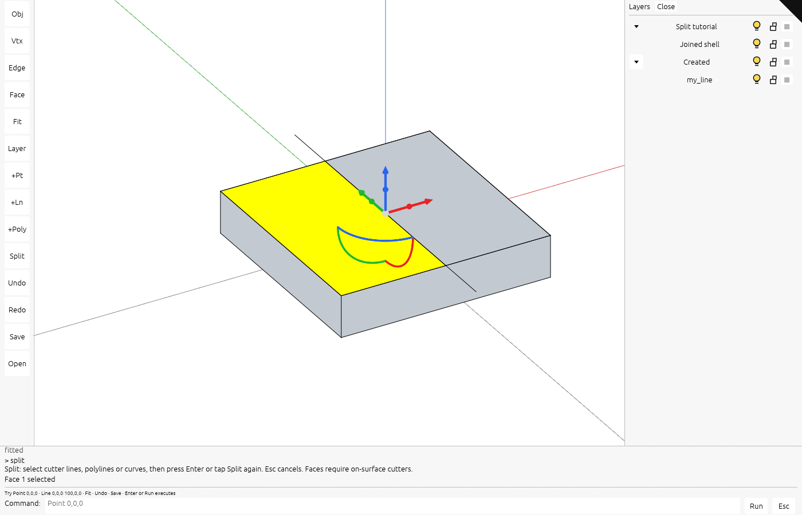

# current-10 · Split curves and faces while keeping the shell joined

Splitting a curve keeps its cutter, and splitting a face keeps both regions in the joined shell.

## Step 1 · src/app/command.rs
Add Split, its input checks and contextual syntax.

`lessons/current-10/src/app/command.rs` · edit · type this

Added after the line `Scale(f64),` in `lessons/current-9/src/app/command.rs`

```rust
--8<-- "lessons/current-10/src/app/command.rs:step-1a"
```

Added after the line `"line" => "Line start end · Example: Line 0,0,0 100,0,0",` in `lessons/current-9/src/app/command.rs`

```rust
--8<-- "lessons/current-10/src/app/command.rs:step-1b"
```

Added after the line `"explode" => "Select a polyline · Explode creates its ind…` in `lessons/current-9/src/app/command.rs`

```rust
--8<-- "lessons/current-10/src/app/command.rs:step-1c"
```

Replaces the 2 lines from `"save" | "open" | "delete" | "del" | "undo" | "redo" | "h…` in `lessons/current-9/src/app/command.rs`

```rust
--8<-- "lessons/current-10/src/app/command.rs:step-1d"
```

Replaces the line `"point" | "line" | "polyline" | "trim" | "extend" | "expl…` in `lessons/current-9/src/app/command.rs`

```rust
--8<-- "lessons/current-10/src/app/command.rs:step-1e"
```

Added after the line `}` in `lessons/current-9/src/app/command.rs`

```rust
--8<-- "lessons/current-10/src/app/command.rs:step-1f"
```

Replaces the line `"point" | "line" | "polyline" => {` in `lessons/current-9/src/app/command.rs`

```rust
--8<-- "lessons/current-10/src/app/command.rs:step-1g"
```

Replaces the line `_ => Err("point needs one coordinate; line two; polyline …` in `lessons/current-9/src/app/command.rs`

```rust
--8<-- "lessons/current-10/src/app/command.rs:step-1h"
```

## Step 2 · src/app/input.rs
Route Enter and Escape to the pending split before ordinary scene shortcuts.

`lessons/current-10/src/app/input.rs` · edit · type this

Added after the line `Key::Named(NamedKey::Escape) => state.escape_selection(),` in `lessons/current-9/src/app/input.rs`

```rust
--8<-- "lessons/current-10/src/app/input.rs:step-2"
```

## Step 3 · src/app/inspection.rs
Expose the new selection and resource state to the browser inspection data.

`lessons/current-10/src/app/inspection.rs` · edit · type this

Added after the line `snapshot["color_count"] = serde_json::json!(state.scene.c…` in `lessons/current-9/src/app/inspection.rs`

```rust
--8<-- "lessons/current-10/src/app/inspection.rs:step-3"
```

## Step 4 · src/app/mod.rs
Declare the new application modules so their files join the crate.

`lessons/current-10/src/app/mod.rs` · edit · type this

Added after the line `pub mod surface_preview;` in `lessons/current-9/src/app/mod.rs`

```rust
--8<-- "lessons/current-10/src/app/mod.rs:step-4"
```

## Step 5 · src/app/modeling.rs
Connect curve creation and replacement to the split workflow.

`lessons/current-10/src/app/modeling.rs` · edit · type this

Added after the line `Polyline(Vec<[f64; 3]>),` in `lessons/current-9/src/app/modeling.rs`

```rust
--8<-- "lessons/current-10/src/app/modeling.rs:step-5a"
```

Added after the line `self.create_geometry(Geometry::Polyline(Rc::new(Polyline:…` in `lessons/current-9/src/app/modeling.rs`

```rust
--8<-- "lessons/current-10/src/app/modeling.rs:step-5b"
```

Added after the line `debug_assert!(added.is_some());` in `lessons/current-9/src/app/modeling.rs`

```rust
--8<-- "lessons/current-10/src/app/modeling.rs:step-5c"
```

## Step 6 · src/app/scene.rs
Expose the owning document identity to split operations.

`lessons/current-10/src/app/scene.rs` · edit · type this

Replaces the line `if is_planar(&self.tables, &from, &place) {` in `lessons/current-9/src/app/scene.rs`

```rust
--8<-- "lessons/current-10/src/app/scene.rs:step-6"
```

## Step 7 · src/app/session_io.rs
Preserve split results and visible curve pens when reopening a session.

`lessons/current-10/src/app/session_io.rs` · edit · type this

Added after the line `struct Metadata {` in `lessons/current-9/src/app/session_io.rs`

```rust
--8<-- "lessons/current-10/src/app/session_io.rs:step-7a"
```

Added after the line `let metadata = Metadata {` in `lessons/current-9/src/app/session_io.rs`

```rust
--8<-- "lessons/current-10/src/app/session_io.rs:step-7b"
```

Added after the line `}` in `lessons/current-9/src/app/session_io.rs`

```rust
--8<-- "lessons/current-10/src/app/session_io.rs:step-7c"
```

Added after the line `#[test]` in `lessons/current-9/src/app/session_io.rs`

```rust
--8<-- "lessons/current-10/src/app/session_io.rs:step-7d"
```

## Step 8 · src/app/splitting.rs
Convert cutters, split source curves or trimmed faces, and replace the result in one transaction.

`lessons/current-10/src/app/splitting.rs` · 363 lines · type this, new file

```rust
--8<-- "lessons/current-10/src/app/splitting.rs"
```

## Step 9 · src/app/ui.rs
Expose Split in the command and tool interface.

`lessons/current-10/src/app/ui.rs` · edit · type this

Added after the line `model.command_open = false;` in `lessons/current-9/src/app/ui.rs`

```rust
--8<-- "lessons/current-10/src/app/ui.rs:step-9a"
```

Added after the line `),` in `lessons/current-9/src/app/ui.rs`

```rust
--8<-- "lessons/current-10/src/app/ui.rs:step-9b"
```

Added after the line `if response.clicked() {` in `lessons/current-9/src/app/ui.rs`

```rust
--8<-- "lessons/current-10/src/app/ui.rs:step-9c"
```

## Step 10 · src/shaders/ribbon.wgsl
Keep split curves visible with the same stroke filtering as the original curve.

`lessons/current-10/src/shaders/ribbon.wgsl` · edit · type this

Replaces the lines from `if (coverage(in) < 0.5 || !ink_visible(in.pos.xy, ink_axi…` in `lessons/current-9/src/shaders/ribbon.wgsl`

```wgsl
--8<-- "lessons/current-10/src/shaders/ribbon.wgsl:step-10a"
```

Replaces the line `if (in.source_edge == 0xffffffffu || coverage(in) < 0.5 |…` in `lessons/current-9/src/shaders/ribbon.wgsl`

```wgsl
--8<-- "lessons/current-10/src/shaders/ribbon.wgsl:step-10b"
```

## Step 11 · src/state.rs
Store pending split state and route object picks to cutter collection.

`lessons/current-10/src/state.rs` · edit · type this

Added after the line `mod sheet_query;` in `lessons/current-9/src/state.rs`

```rust
--8<-- "lessons/current-10/src/state.rs:step-11a"
```

Added after the line `hierarchy: crate::app::hierarchy::Hierarchy,` in `lessons/current-9/src/state.rs`

```rust
--8<-- "lessons/current-10/src/state.rs:step-11b"
```

Added after the line `hierarchy: Default::default(),` in `lessons/current-9/src/state.rs`

```rust
--8<-- "lessons/current-10/src/state.rs:step-11c"
```

Added after the line `pub fn clear(&mut self) {` in `lessons/current-9/src/state.rs`

```rust
--8<-- "lessons/current-10/src/state.rs:step-11d"
```

Added after the line `pub fn select(&mut self, row: Option<u32>) {` in `lessons/current-9/src/state.rs`

```rust
--8<-- "lessons/current-10/src/state.rs:step-11e"
```

Added after the line `fn apply_pick(&mut self, pick: Option<Pick>) {` in `lessons/current-9/src/state.rs`

```rust
--8<-- "lessons/current-10/src/state.rs:step-11f"
```

Replaces the 2 lines from `let face = face || self.selection_tool == crate::app::sel…` in `lessons/current-9/src/state.rs`

```rust
--8<-- "lessons/current-10/src/state.rs:step-11g"
```

## Step 12 · src/state/edit.rs
Dispatch Split and rebuild source selection after history changes.

`lessons/current-10/src/state/edit.rs` · edit · type this

Replaces the line `fn after_history(&mut self) {` in `lessons/current-9/src/state/edit.rs`

```rust
--8<-- "lessons/current-10/src/state/edit.rs:step-12a"
```

Added after the line `let command = crate::app::command::parse(line)?;` in `lessons/current-9/src/state/edit.rs`

```rust
--8<-- "lessons/current-10/src/state/edit.rs:step-12b"
```

Added after the line `match command {` in `lessons/current-9/src/state/edit.rs`

```rust
--8<-- "lessons/current-10/src/state/edit.rs:step-12c"
```

Replaces the line `Modeling::Point(_) | Modeling::Line(..) | Modeling::Polyl…` in `lessons/current-9/src/state/edit.rs`

```rust
--8<-- "lessons/current-10/src/state/edit.rs:step-12d"
```

Added after the line `Modeling::Line(..) => "line",` in `lessons/current-9/src/state/edit.rs`

```rust
--8<-- "lessons/current-10/src/state/edit.rs:step-12e"
```

## Step 13 · src/state/panel.rs
Refresh the hierarchy when a split changes object membership.

`lessons/current-10/src/state/panel.rs` · edit · type this

Added after the line `let rows = self.hierarchy.targets(index);` in `lessons/current-9/src/state/panel.rs`

```rust
--8<-- "lessons/current-10/src/state/panel.rs:step-13"
```

## Step 14 · src/state/splitting.rs
Retain the target, selected face and cutter rows until confirmation.

`lessons/current-10/src/state/splitting.rs` · 131 lines · type this, new file

```rust
--8<-- "lessons/current-10/src/state/splitting.rs"
```

## Check

Run `trunk serve` in `lessons/current-10/` and open <http://127.0.0.1:8770/>.

Expected: confirming the cutters creates curve pieces or joined face regions, and the status reports the split result.



If it fails:

- The wrong face splits: a multi-face shell has no explicit selected face.
- The cutter is rejected: it does not lie on the selected surface within tolerance.

## What changed

```text
lessons/current-10/src/
├── app/
│   ├── inspection/
│   │   └── source_memory.rs
│   ├── walk/
│   │   ├── bounds.rs
│   │   ├── brep.rs
│   │   ├── brep_edges.rs
│   │   ├── brep_orient.rs
│   │   ├── cloud.rs
│   │   ├── curves.rs
│   │   ├── encode.rs
│   │   ├── frames.rs
│   │   ├── mesh.rs
│   │   ├── mesh_ink.rs
│   │   ├── mesh_topology.rs
│   │   ├── mod.rs
│   │   ├── points.rs
│   │   └── sheet.rs
│   ├── cloud_query.rs
│   ├── command.rs  ~
│   ├── coords.rs
│   ├── cplane.rs
│   ├── decode.rs
│   ├── deform.rs
│   ├── edit.rs
│   ├── feedback.rs
│   ├── fetch.rs
│   ├── gizmo.rs
│   ├── hierarchy.rs
│   ├── input.rs  ~
│   ├── inspection.rs  ~
│   ├── knobs.rs
│   ├── layers.rs
│   ├── live.rs
│   ├── loader.rs
│   ├── manifest.rs
│   ├── mod.rs  ~
│   ├── modeling.rs  ~
│   ├── route.rs
│   ├── scene.rs  ~
│   ├── scene_text.rs
│   ├── selection.rs
│   ├── session_io.rs  ~
│   ├── sheet_query.rs
│   ├── snap.rs
│   ├── splitting.rs  +
│   ├── stream.rs
│   ├── surface_preview.rs
│   ├── touch.rs
│   ├── ui.rs  ~
│   └── validate.rs
├── engine/
│   ├── gpu/
│   │   ├── arena.rs
│   │   ├── backdrop.rs
│   │   ├── buffers.rs
│   │   ├── cloud.rs
│   │   ├── device.rs
│   │   ├── faces.rs
│   │   ├── frame.rs
│   │   ├── glyphs.rs
│   │   ├── instance.rs
│   │   ├── lod.rs
│   │   ├── mod.rs
│   │   ├── objects.rs
│   │   ├── patch.rs
│   │   ├── pick.rs
│   │   ├── present.rs
│   │   ├── render.rs
│   │   ├── segments.rs
│   │   ├── splat.rs
│   │   ├── surface_outline.rs
│   │   ├── targets.rs
│   │   ├── text.rs
│   │   ├── text_outline.rs
│   │   ├── text_plane.rs
│   │   ├── text_plate.rs
│   │   ├── triangle_tiles.rs
│   │   ├── ui.rs
│   │   ├── upload.rs
│   │   ├── view.rs
│   │   ├── widget.rs
│   │   └── widget_mesh.rs
│   ├── pipelines/
│   │   ├── layouts.rs
│   │   └── mod.rs
│   ├── mod.rs
│   ├── performance.rs
│   └── text.rs
├── shaders/
│   ├── background.wgsl
│   ├── glyph.wgsl
│   ├── grid.wgsl
│   ├── ink_visibility.wgsl
│   ├── normals.wgsl
│   ├── physical.wgsl
│   ├── project_triangles.wgsl
│   ├── projected_triangle.wgsl
│   ├── ribbon.wgsl  ~
│   ├── scan_triangle_tiles.wgsl
│   ├── scene.wgsl
│   ├── sphere.wgsl
│   ├── splat.wgsl
│   ├── splat_resolve.wgsl
│   ├── surface_outline.wgsl
│   ├── text_outline.wgsl
│   ├── text_plane.wgsl
│   ├── text_plate.wgsl
│   ├── triangle.wgsl
│   ├── triangle_tiles.wgsl
│   └── widget.wgsl
├── state/
│   ├── cloud_query.rs
│   ├── edit.rs  ~
│   ├── panel.rs  ~
│   ├── sheet_query.rs
│   ├── splitting.rs  +
│   └── text.rs
├── camera.rs
├── lib.rs
└── state.rs  ~
```

`+` new in this lesson · `~` changed in this lesson

Data flow: target and cutters → trimmed-region split → source transaction → refreshed selection.
Every file at this point: `lessons/current-10/`.

## Next

[Continue with current-11](current-11.md).

## Expected viewer result

The shell has been divided into two face regions by an on-surface line. The cutter remains and the selected half is highlighted. The shell stays joined, and the editable session stores the updated source geometry. Use Undo to restore the original or Save to keep this result. See the [phone layout](screenshots/extensions-split-phone.png).

[](screenshots/extensions-split-face.png)
