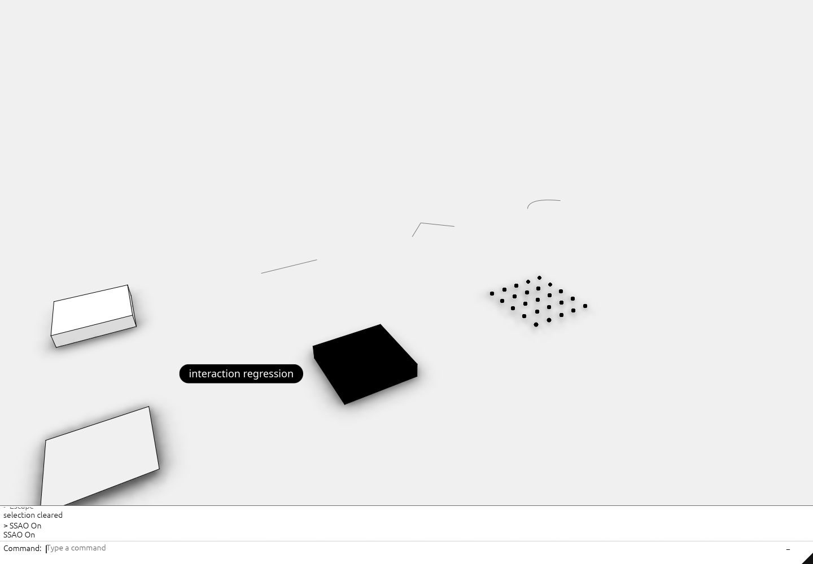

# current-11 · Finish the command workspace and soft ambient lighting
<!-- locator: off -->
A command field below the model controls grouped selection, responsive surface editing, independent colors and soft ambient shadows.

<!-- step-status: start -->

**Does it compile yet?** `cargo check` passes after steps 1, 2 and 41–43; steps 3–40 fail and build again at step 41.

<!-- step-status: end -->

## Step 1 · index.html
Download this file from its link to the path shown.
<!-- file: current-11 session_viewer/index.html copy -->
## Step 2 · src/app/deform.rs
Expose mesh vertex keys and retain shared-vertex behavior for component moves. A face edit must move its source vertices only once.
<!-- file: current-11 session_viewer/src/app/deform.rs type -->
## Step 3 · src/app/feedback.rs
Carry status and layer information from the scene into the interface. Keep these updates outside the UI borrow to avoid a runtime borrowing error.
<!-- file: current-11 session_viewer/src/app/feedback.rs type -->
## Step 4 · src/app/inspection.rs
Expose the new selection and resource state to the browser inspection data. Report retained resources as well as visible objects so hidden allocations are counted.
<!-- file: current-11 session_viewer/src/app/inspection.rs type -->
## Step 5 · src/app/mesh_preview.rs
Cache source-to-render vertex mappings and update the affected neighborhood during a drag. Measure every preview from the original gesture to avoid accumulated displacement.
<!-- file: current-11 session_viewer/src/app/mesh_preview.rs type -->
## Step 6 · src/app/mod.rs
Declare the new application modules so their files join the crate. A source file is not compiled until a module declaration names it.
<!-- file: current-11 session_viewer/src/app/mod.rs type -->
## Step 7 · src/app/scene.rs
Retain mesh preview caches and separate face and edge overrides by source identity. Rebuild the cache when source topology changes.
<!-- file: current-11 session_viewer/src/app/scene.rs type -->
## Step 8 · src/app/session_io.rs
Save and restore the two independent display color channels. Resetting one channel must not erase the other override.
<!-- file: current-11 session_viewer/src/app/session_io.rs type -->
## Step 9 · src/app/splitting.rs
Carry face and edge overrides onto split results. Preserve the original source colors beneath those display overrides.
<!-- file: current-11 session_viewer/src/app/splitting.rs type -->
## Step 10 · src/app/ui.rs
Place the command input below its output window with full-width dividers and inline options. Process text events once so popup sizing cannot duplicate a letter. Keep long input inside the field and reserve the bottom-right corner for the documentation link.
<!-- file: current-11 session_viewer/src/app/ui.rs type -->
## Step 11 · src/engine/gpu/glyphs.rs
Update an individual control marker during a mesh preview. Address the retained marker range rather than allocating a new marker each frame.
<!-- file: current-11 session_viewer/src/engine/gpu/glyphs.rs type -->
## Step 12 · src/engine/gpu/instance.rs
Store the separate edge color and its override flag in the GPU instance data. Keep the Rust and shader layouts identical.
<!-- file: current-11 session_viewer/src/engine/gpu/instance.rs type -->
## Step 13 · src/engine/gpu/mod.rs
Own optional ambient resources and report their buffer and texture sizes. Release the occlusion texture when the effect is disabled.
<!-- file: current-11 session_viewer/src/engine/gpu/mod.rs type -->
## Step 14 · src/engine/gpu/objects.rs
Update either color channel and advance the geometry revision after a preview change. That revision also invalidates cached cloud rendering.
<!-- file: current-11 session_viewer/src/engine/gpu/objects.rs type -->
## Step 15 · src/engine/gpu/splat.rs
Invalidate cached point-cloud pixels when object geometry or placement changes. Camera changes alone do not detect an object moving under a stationary view.
<!-- file: current-11 session_viewer/src/engine/gpu/splat.rs type -->
## Step 16 · src/shaders/glyph.wgsl
Use the correct authored or overridden marker color. Component highlighting must remain visible after a color reset.
<!-- file: current-11 session_viewer/src/shaders/glyph.wgsl type -->
## Step 17 · src/shaders/ribbon.wgsl
Resolve independent edge colors and keep 3D stroke widths constant on screen. Short adjacent segments must not fade into a broken ring.
<!-- file: current-11 session_viewer/src/shaders/ribbon.wgsl type -->
## Step 18 · src/shaders/scene.wgsl
Resolve face and edge colors independently from their override flags. Falling back to the authored color must preserve its alpha.
<!-- file: current-11 session_viewer/src/shaders/scene.wgsl type -->
## Step 19 · src/shaders/sphere.wgsl
Keep marker colors consistent with the new channel flags. Preserve coverage separately from the chosen RGB.
<!-- file: current-11 session_viewer/src/shaders/sphere.wgsl type -->
## Step 20 · src/state/edit.rs
Preview all selected placements together and commit once on release. Surface control edits reuse their display grid instead of detecting edges again.
<!-- file: current-11 session_viewer/src/state/edit.rs type -->
## Step 21 · src/state/panel.rs
Apply selection and locking recursively through the layer hierarchy. A locked descendant cannot remain in the active selection.
<!-- file: current-11 session_viewer/src/state/panel.rs type -->
## Step 22 · session_rust/src/color.rs
Use very light grey for default geometry colors throughout the kernel. The explicitly named white color remains pure white.
<!-- file: current-11 session_rust/src/color.rs type -->
## Step 23 · src/app/command.rs
Accept a partial command with Enter, then accept its default or arrow-selected option. Rank matching commands first without hiding the rest; geometry prompts accept typed coordinates or canvas clicks.
<!-- file: current-11 session_viewer/src/app/command.rs type -->
## Step 24 · src/app/edit.rs
Collect selected descendants and transform the selection as one set. Skip descendants already included by a selected ancestor to avoid moving them twice.
<!-- file: current-11 session_viewer/src/app/edit.rs type -->
## Step 25 · src/app/gizmo.rs
Measure the distance from the pointer ray to each handle. Rays need not intersect an axis exactly to grab its visible shaft.
<!-- file: current-11 session_viewer/src/app/gizmo.rs type -->
## Step 26 · src/app/input.rs
Route pending drawing clicks before selection; use Shift to add objects and G to toggle Arctic lighting. Text input must consume these keys while a command is being typed.
<!-- file: current-11 session_viewer/src/app/input.rs type -->
## Step 27 · src/app/surface_preview.rs
Reuse the sampled surface grid and update its positions during a gesture. Retain exact boundary sample indices because coincident points can have different parameters.
<!-- file: current-11 session_viewer/src/app/surface_preview.rs type -->
## Step 28 · src/app/walk/brep.rs
Sample a bounded grid for standalone NURBS surfaces and build their natural boundary curves once. Internal mesh edges must never become visible surface edges.
<!-- file: current-11 session_viewer/src/app/walk/brep.rs type -->
## Step 29 · src/app/walk/curves.rs
Remove consecutive duplicate polyline points before constructing strokes. Zero-length segments leave gaps at joins.
<!-- file: current-11 session_viewer/src/app/walk/curves.rs type -->
## Step 30 · src/app/walk/encode.rs
Encode ordinary 3D pen widths as screen pixels. Physical sheet strokes retain their drawing scale.
<!-- file: current-11 session_viewer/src/app/walk/encode.rs type -->
## Step 31 · src/engine/gpu/frame.rs
Select the soft hemisphere shader when ambient lighting is enabled. Keep the uniform layout shared by Rust and WGSL unchanged.
<!-- file: current-11 session_viewer/src/engine/gpu/frame.rs type -->
## Step 32 · src/engine/gpu/render.rs
Shade faces, then apply ambient contact shadows before drawing ink. Invalidate cached occlusion when the camera or geometry changes.
<!-- file: current-11 session_viewer/src/engine/gpu/render.rs type -->
## Step 33 · src/engine/gpu/ssao.rs
Cache hemisphere occlusion in two R8 textures at half resolution, capped at 960 pixels on its longest side. Destroy replaced textures immediately so browser garbage collection cannot retain them during resizing.
<!-- file: current-11 session_viewer/src/engine/gpu/ssao.rs type -->
## Step 34 · src/engine/gpu/view.rs
Start with ambient lighting disabled. The viewport G shortcut and SSAO command change the same setting.
<!-- file: current-11 session_viewer/src/engine/gpu/view.rs type -->
## Step 35 · src/shaders/background.wgsl
Use a white background normally and very light grey with Arctic enabled. Read the lighting setting from the shared uniform.
<!-- file: current-11 session_viewer/src/shaders/background.wgsl type -->
## Step 36 · src/shaders/ssao.wgsl
Reconstruct positions from depth and sample surface occlusion with slightly stronger shading. Concentrate ground shadows near object bases using short horizon samples with height falloff; filter sample noise before enlargement.
<!-- file: current-11 session_viewer/src/shaders/ssao.wgsl type -->
## Step 37 · src/shaders/triangle.wgsl
Apply the archive viewer’s soft sky and ground shading while preserving authored colors. Printed sheets remain unshaded.
<!-- file: current-11 session_viewer/src/shaders/triangle.wgsl type -->
## Step 38 · src/state.rs
Retain the selected object set and place one gumball around its combined bounds. Selection changes must refresh both the scene and layer rows.
<!-- file: current-11 session_viewer/src/state.rs type -->
## Step 39 · src/engine/gpu/backdrop.rs
Bind the shared lighting uniform before drawing the background. Both sample-count pipelines need the same bindings.
<!-- file: current-11 session_viewer/src/engine/gpu/backdrop.rs type -->
## Step 40 · src/state/drawing.rs
Collect clicked or typed points, preview the next span and snap to existing geometry. Commit the finished draft once so Escape leaves no partial object and Undo removes the whole drawing.
<!-- file: current-11 session_viewer/src/state/drawing.rs type -->
## Step 41 · src/engine/gpu/arena.rs
Retain exact source indices for boundary endpoints until the preview cache captures them. Clear these temporary tables with the other upload data.
<!-- file: current-11 session_viewer/src/engine/gpu/arena.rs type -->
## Step 42 · src/shaders/ink_visibility.wgsl
Test a NURBS boundary against triangles at its actual projected position. A neighboring pixel's extrapolated plane must not reveal fragments of a hidden curve.
<!-- file: current-11 session_viewer/src/shaders/ink_visibility.wgsl type -->
## Step 43 · supplied files
Download each file from its link to the path shown.
<!-- supplied: current-11 -->
## Check
<!-- checkpoint: current-11 -->
Expected: the output window sits above Command, options stay inline, and Arctic On adds concentrated ground shadows with **SSAO On** in the history.

If it fails:

- Typed letters duplicate: a sizing pass processes the same input events twice.
- Suggestions disappear below the window: the popup opens downward instead of above the command field.
- Surface edits show mesh diagonals: the display derives boundaries from tessellation.
- Shadows remain after G turns them off: the optional texture or lighting uniform stays enabled.
## What changed
<!-- tree: current-11 session_viewer/src -->
Data flow: command or layer selection → shared selection → cached previews; scene depth → small occlusion texture → smooth contact shadows.
Every file at this point: [source at checkpoint current-11](../lessons/current-11/index.md).
## Next
[Use the command line](command-line-walkthrough.md).
## Expected viewer result
The command field sits below the viewport with a visible caret, inline completion, a scrollable command list and clickable options. Layers start hidden; Layers On reveals selection highlights and recursive layer controls. Point, Line, Polyline and Curve accept clicks or coordinates with Snap On by default. Shift selects multiple objects, one gumball moves them together, and G toggles Arctic shading and ground shadows. The background is white when Arctic is off. NURBS surfaces display only their true boundaries while editing. Face and edge colors remain independent.

