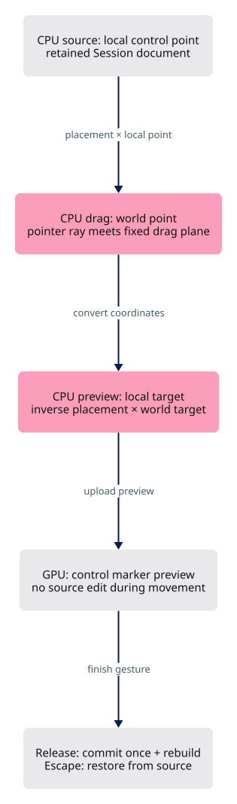

# 3 · Make control dragging respect object placement

[Previous](current-2.md) · [Sequence](extend-integrated-tutorial.md) · [Next](current-4.md)

Continue in the same checkpoint workspace. Complete the edits below before compiling.



Drag polyline and NURBS controls on placed objects without a release jump. Keep source coordinates local, pointer rays in world coordinates, and previews outside kernel history. Apply this step after the preceding integrated step; these edits include its shared wiring.

### `src/app/edit.rs`

**TYPE THIS**

**CURRENT**

```rust
    pub fn set_control_point(&mut self, row: u32, index: usize, to: &Point) -> bool {
```

**ADD BELOW**

```rust
        if !self.streamed.is_empty() || !self.sheets.is_empty() {
            return false;
        }
        let Some(back) = self
            .placement_of(row)
            .and_then(|m| Xform::from_matrix(m).inverse())
        else {
            return false;
        };
        let local = to.transformed(&back);
        let to = &local;
```

**TYPE THIS**

**CURRENT**

```rust
        );
    }
}
```

**REPLACE WITH**

```rust
        );
    }
    #[test]
    fn control_edit_converts_world_to_local_under_file_placement() {
        let mut source = Session::new("placed");
        assert!(
            source
                .add_polyline(
                    session_rust::Polyline::new(vec![
                        Point::new(0.0, 0.0, 0.0),
                        Point::new(1.0, 0.0, 0.0)
                    ]),
                    None
                )
                .is_some()
        );
        let shared = Rc::new(source);
        let mut placed = file("placed", Rc::clone(&shared));
        placed.place = &Xform::translation(100.0, 0.0, 0.0) * &Xform::scale_xyz(10.0, 10.0, 10.0);
        let mut scene = Scene::new();
        scene.add_file(placed);
        scene.add_file(file("unmodified", shared));
        assert!(scene.set_control_point(0, 1, &Point::new(120.0, 30.0, 0.0)));
        let Geometry::Polyline(line) = scene.geometry(0).unwrap() else {
            panic!()
        };
        assert_eq!(line.get_point(1).unwrap()[0], 2.0);
        assert_eq!(line.get_point(1).unwrap()[1], 3.0);
        let Geometry::Polyline(other) = scene.geometry(1).unwrap() else {
            panic!()
        };
        assert_eq!(other.get_point(1).unwrap()[0], 1.0);
        assert!(scene.undo());
        let Geometry::Polyline(line) = scene.geometry(0).unwrap() else {
            panic!()
        };
        assert_eq!(line.get_point(1).unwrap()[0], 1.0);
    }

}
```

### `src/state.rs`

**TYPE THIS**

**CURRENT**

```rust
    pub fn clear(&mut self) {
```

**ADD BELOW**

```rust
        self.cancel_gesture();
```

**TYPE THIS**

**CURRENT**

```rust
    pub fn select(&mut self, row: Option<u32>) {
```

**ADD BELOW**

```rust
        self.cancel_gesture();
```

### `src/state/edit.rs`

**TYPE THIS**

**CURRENT**

```rust
        let Some(active) = self.dragging.take() else {
            return false;
        };
```

**ADD BELOW**

```rust
        self.gpu
            .objects
            .set_placement(&self.gpu.ctx, active.row, &active.base_place);
        self.gpu.grew_bounds(active.row);
        self.touch();
```

**TYPE THIS**

**CURRENT**

```rust
        }
        if self.control_drag.take().is_some() {
            // The control preview is a dot in a temporary lane; re-uploading from the source
            // puts it back.
            self.upload_controls();
```

**REPLACE WITH**

```rust
        }
        if let Some(active) = self.control_drag.take() {
            if let Some(geometry) = self.scene.geometry(active.parent) {
                self.controls = crate::app::selection::Controls::from_geometry(geometry);
            }
            self.upload_controls();
```

**TYPE THIS**

**CURRENT**

```rust
    plane: CPlane,
```

**ADD BELOW**

```rust
    origin: Point,
```

**TYPE THIS**

**CURRENT**

```rust
        let at = self.controls.points[index].position;
        let Some((sx, sy)) = self.project(at) else {
            return false;
```

**REPLACE WITH**

```rust
        let at = self.controls.points[index].position;
        let Some(place) = self.scene.placement_of(parent) else {
            return false;
        };
        let origin = Point::new(at[0], at[1], at[2]).transformed(&Xform::from_matrix(place));
        let Some((sx, sy)) = self.project([origin[0], origin[1], origin[2]]) else {
            return false;
```

**TYPE THIS**

**CURRENT**

```rust
            plane: CPlane::facing(&forward),
```

**ADD BELOW**

```rust
            origin,
```

**TYPE THIS**

**CURRENT**

```rust
        let index = active.index;
```

**ADD ABOVE**

```rust
        let Some(back) = self
            .scene
            .placement_of(active.parent)
            .and_then(|m| Xform::from_matrix(m).inverse())
        else {
            return false;
        };
        let point = point.transformed(&back);
```

**TYPE THIS**

**CURRENT**

```rust
        let Some(point) = self.control_target(&active, x, y) else {
```

**ADD ABOVE**

```rust
        if let Some(geometry) = self.scene.geometry(active.parent) {
            self.controls = crate::app::selection::Controls::from_geometry(geometry);
        }
        self.upload_controls();
        self.touch();
```

**TYPE THIS**

**CURRENT**

```rust
        let (from, dir) = self.camera.ray((x, y), self.viewport())?;
        let origin = {
            let at = self.controls.points[active.index].position;
            Point::new(at[0], at[1], at[2])
        };
        let free = active.plane.hit(&origin, &from, &dir)?;
        let mut candidates = Vec::new();
```

**REPLACE WITH**

```rust
        let (from, dir) = self.camera.ray((x, y), self.viewport())?;
        let free = active.plane.hit(&active.origin, &from, &dir)?;
        let place = Xform::from_matrix(self.scene.placement_of(active.parent)?);
        let mut candidates = Vec::new();
```

**TYPE THIS**

**CURRENT**

```rust
                    control.position[2],
                ),
                kind: SnapKind::Vertex,
                owner: active.parent,
            });
        }
        // The ranking is in SCREEN space, so the aperture means pixels wherever the camera is.
        let project = |p: &Point| self.project([p[0], p[1], p[2]]);
        match snap::best(&candidates, (x, y), SNAP_APERTURE_PX * self.pixel_scale(), project) {
            Some(hit) => Some(hit.point),
```

**REPLACE WITH**

```rust
                    control.position[2],
                )
                .transformed(&place),
                kind: SnapKind::Vertex,
                owner: active.parent,
            });
        }
        // The ranking is in SCREEN space, so the aperture means pixels wherever the camera is.
        let project = |p: &Point| self.project([p[0], p[1], p[2]]);
        match snap::best(
            &candidates,
            (x, y),
            SNAP_APERTURE_PX * self.pixel_scale(),
            project,
        ) {
            Some(hit) => Some(hit.point),
```

### Check step 3

**Verified:** the complete step compiles for WebAssembly.

```bash
cargo check -j4 --lib
```


## Answers and next action

**Why convert coordinates?** A source control is local to its object. The pointer ray and drag plane are world-space. Multiply by placement to draw a control; multiply the world target by inverse placement to store it.

**What changes during a drag?** Only preview GPU rows. Release commits one source edit. Escape restores the source-derived preview without recording an edit. An uninvertible placement refuses the edit.

**Run now**, in the same learning workspace:

```bash
cargo check -j4 --lib
trunk serve --port 8780
```

Expected compiler result: `Finished` with no errors. Open <http://localhost:8780/?data=off&inspect=1>. Run `polyline 0,0,0 100,0,0 100,100,0`, press **F**, select it and press **F10**. Select a control, drag and release: it stays at the release point. **Ctrl+Z** restores it. Drag again and press **Escape** before release: the control returns without a new undo step.

Stop the server with **Ctrl+C** before editing the next checkpoint. Then open [Draw a solid, readable gumball](current-4.md) and apply its blocks in order.

[Previous](current-2.md) · [Sequence](extend-integrated-tutorial.md) · [Next](current-4.md)
