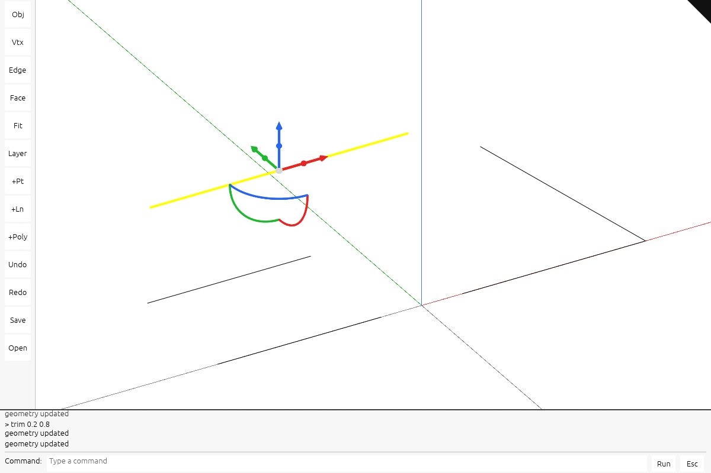

# current-4 · Draw a solid, readable gumball

The selected object shows solid colored gumball arrows, scale handles and rotation rings.

## Step 1 · src/app/gizmo.rs
Expose the shared handle dimensions for the solid gumball.

`lessons/current-4/src/app/gizmo.rs` · edit · type this

Replaces the line `pub const ARM: f64 = 72.0;` in `lessons/current-3/src/app/gizmo.rs`

```rust
--8<-- "lessons/current-4/src/app/gizmo.rs:step-1"
```

## Step 2 · src/app/input.rs
Update handle hover and bypass gumball grabs while Ctrl selects a component.

`lessons/current-4/src/app/input.rs` · edit · type this

Replaces the line `dragging` in `lessons/current-3/src/app/input.rs`

```rust
--8<-- "lessons/current-4/src/app/input.rs:step-2a"
```

Replaces the line `if state.begin_control_drag(self.last_cursor.0, self.last…` in `lessons/current-3/src/app/input.rs`

```rust
--8<-- "lessons/current-4/src/app/input.rs:step-2b"
```

## Step 3 · src/engine/gpu/mod.rs
Add the new GPU resources, initialize them and include their allocations in the counters.

`lessons/current-4/src/engine/gpu/mod.rs` · edit · type this

Added after the line `pub mod view;` in `lessons/current-3/src/engine/gpu/mod.rs`

```rust
--8<-- "lessons/current-4/src/engine/gpu/mod.rs:step-3a"
```

Replaces the 2 lines from `pub gizmo_arms: SegmentLane,` in `lessons/current-3/src/engine/gpu/mod.rs`

```rust
--8<-- "lessons/current-4/src/engine/gpu/mod.rs:step-3b"
```

Replaces the 2 lines from `+ self.gizmo_arms.allocated_bytes()` in `lessons/current-3/src/engine/gpu/mod.rs`

```rust
--8<-- "lessons/current-4/src/engine/gpu/mod.rs:step-3c"
```

Added after the line `frame_textures` in `lessons/current-3/src/engine/gpu/mod.rs`

```rust
--8<-- "lessons/current-4/src/engine/gpu/mod.rs:step-3d"
```

Replaces the 2 lines from `let gizmo_arms = SegmentLane::new(&ctx, &layouts, target);` in `lessons/current-3/src/engine/gpu/mod.rs`

```rust
--8<-- "lessons/current-4/src/engine/gpu/mod.rs:step-3e"
```

Replaces the 2 lines from `gizmo_arms,` in `lessons/current-3/src/engine/gpu/mod.rs`

```rust
--8<-- "lessons/current-4/src/engine/gpu/mod.rs:step-3f"
```

Delete the 6 lines from `pub fn set_widget_rows(&mut self, segments: &segments::Se…` in `lessons/current-3/src/engine/gpu/mod.rs`.

Delete the 7 lines from `}` in `lessons/current-3/src/engine/gpu/mod.rs`.

Replaces the 2 lines from `self.gizmo_arms.retarget(&self.ctx, &self.layouts, target);` in `lessons/current-3/src/engine/gpu/mod.rs`

```rust
--8<-- "lessons/current-4/src/engine/gpu/mod.rs:step-3i"
```

Replaces the 2 lines from `self.gizmo_arms.reset();` in `lessons/current-3/src/engine/gpu/mod.rs`

```rust
--8<-- "lessons/current-4/src/engine/gpu/mod.rs:step-3j"
```

Replaces the 2 lines from `self.gizmo_arms.release(&self.ctx, &self.layouts);` in `lessons/current-3/src/engine/gpu/mod.rs`

```rust
--8<-- "lessons/current-4/src/engine/gpu/mod.rs:step-3k"
```

## Step 4 · src/engine/gpu/present.rs
Submit the widget overlay with the scene frame.

`lessons/current-4/src/engine/gpu/present.rs` · edit · type this

Added after the line `self.frame.write(&self.ctx, input, &cx);` in `lessons/current-3/src/engine/gpu/present.rs`

```rust
--8<-- "lessons/current-4/src/engine/gpu/present.rs:step-4"
```

## Step 5 · src/engine/gpu/render.rs
Place the new drawing work into the frame sequence.

`lessons/current-4/src/engine/gpu/render.rs` · edit · type this

Added after the line `}` in `lessons/current-3/src/engine/gpu/render.rs`

```rust
--8<-- "lessons/current-4/src/engine/gpu/render.rs:step-5a"
```

## Step 6 · src/engine/gpu/widget.rs
Retain the gumball mesh and draw it into a bounded antialiased tile.

`lessons/current-4/src/engine/gpu/widget.rs` · 390 lines · type this, new file

```rust
--8<-- "lessons/current-4/src/engine/gpu/widget.rs"
```

## Step 7 · src/engine/gpu/widget_mesh.rs
Build reusable triangle meshes for the gumball arrows, scale handles and rotation rings.

`lessons/current-4/src/engine/gpu/widget_mesh.rs` · 124 lines · type this, new file

```rust
--8<-- "lessons/current-4/src/engine/gpu/widget_mesh.rs"
```

## Step 8 · src/shaders/widget.wgsl
Draw each handle with its own unlit color, then composite the tile over the scene.

`lessons/current-4/src/shaders/widget.wgsl` · 54 lines · type this, new file

```wgsl
--8<-- "lessons/current-4/src/shaders/widget.wgsl"
```

## Step 9 · src/state.rs
Clear widget hover along with selection state.

`lessons/current-4/src/state.rs` · edit · type this

Added after the line `pub fn render(&mut self) {` in `lessons/current-3/src/state.rs`

```rust
--8<-- "lessons/current-4/src/state.rs:step-9"
```

## Step 10 · src/state/edit.rs
Replace the old line widget upload with the solid widget and update its hover state.

`lessons/current-4/src/state/edit.rs` · edit · type this

Replaces the line `use crate::app::gizmo::{ARM, Axis, BALL_AT, Drag, Gizmo, …` in `lessons/current-3/src/state/edit.rs`

```rust
--8<-- "lessons/current-4/src/state/edit.rs:step-10a"
```

Delete the four `use` lines from `use crate::app::walk::encode::FACING_UNKNOWN;` in `lessons/current-3/src/state/edit.rs`.

Added after the line `fn world_per_px(&self) -> f64 {` in `lessons/current-3/src/state/edit.rs`

```rust
--8<-- "lessons/current-4/src/state/edit.rs:step-10b"
```

Replaces the lines from `self.gpu` in `lessons/current-3/src/state/edit.rs`

```rust
--8<-- "lessons/current-4/src/state/edit.rs:step-10c"
```

Delete the `const ARC_STEPS` block and the `fn widget_rows` block from `lessons/current-3/src/state/edit.rs`.

Delete the `fn the_widget_draws_three_arms_three_arcs_and_four_balls` test and its `#[test]` line from `lessons/current-3/src/state/edit.rs`.

Replaces the 3 lines from `let widget = gpu.widget_row();` in `lessons/current-3/src/state/edit.rs`

```rust
--8<-- "lessons/current-4/src/state/edit.rs:step-10e"
```

Delete the `fn the_arcs_are_where_the_hit_test_expects_them` test and its `#[test]` line from `lessons/current-3/src/state/edit.rs`.

## Check

Run `trunk serve` in `lessons/current-4/` and open <http://127.0.0.1:8770/>.

Expected: the selected object has solid colored handles and the status area shows no error.



If it fails:

- A handle blocks component picking: Ctrl does not bypass the gumball grab.
- Gumball edges look rough: its tile sample count or composite coverage is wrong.

## What changed

```text
lessons/current-4/src/
├── app/
│   ├── inspection/
│   │   └── source_memory.rs
│   ├── walk/
│   │   ├── bounds.rs
│   │   ├── brep.rs
│   │   ├── brep_edges.rs
│   │   ├── brep_orient.rs
│   │   ├── cloud.rs
│   │   ├── curves.rs
│   │   ├── encode.rs
│   │   ├── frames.rs
│   │   ├── mesh.rs
│   │   ├── mesh_ink.rs
│   │   ├── mesh_topology.rs
│   │   ├── mod.rs
│   │   ├── points.rs
│   │   └── sheet.rs
│   ├── cloud_query.rs
│   ├── command.rs
│   ├── coords.rs
│   ├── cplane.rs
│   ├── decode.rs
│   ├── edit.rs
│   ├── feedback.rs
│   ├── fetch.rs
│   ├── gizmo.rs  ~
│   ├── input.rs  ~
│   ├── inspection.rs
│   ├── knobs.rs
│   ├── layers.rs
│   ├── live.rs
│   ├── loader.rs
│   ├── manifest.rs
│   ├── mod.rs
│   ├── modeling.rs
│   ├── route.rs
│   ├── scene.rs
│   ├── scene_text.rs
│   ├── selection.rs
│   ├── sheet_query.rs
│   ├── snap.rs
│   ├── stream.rs
│   ├── touch.rs
│   └── validate.rs
├── engine/
│   ├── gpu/
│   │   ├── arena.rs
│   │   ├── backdrop.rs
│   │   ├── buffers.rs
│   │   ├── cloud.rs
│   │   ├── device.rs
│   │   ├── faces.rs
│   │   ├── frame.rs
│   │   ├── glyphs.rs
│   │   ├── instance.rs
│   │   ├── lod.rs
│   │   ├── mod.rs  ~
│   │   ├── objects.rs
│   │   ├── pick.rs
│   │   ├── present.rs  ~
│   │   ├── render.rs  ~
│   │   ├── segments.rs
│   │   ├── splat.rs
│   │   ├── surface_outline.rs
│   │   ├── targets.rs
│   │   ├── text.rs
│   │   ├── text_outline.rs
│   │   ├── text_plane.rs
│   │   ├── text_plate.rs
│   │   ├── triangle_tiles.rs
│   │   ├── upload.rs
│   │   ├── view.rs
│   │   ├── widget.rs  +
│   │   └── widget_mesh.rs  +
│   ├── pipelines/
│   │   ├── layouts.rs
│   │   └── mod.rs
│   ├── mod.rs
│   ├── performance.rs
│   └── text.rs
├── shaders/
│   ├── background.wgsl
│   ├── glyph.wgsl
│   ├── grid.wgsl
│   ├── ink_visibility.wgsl
│   ├── normals.wgsl
│   ├── physical.wgsl
│   ├── project_triangles.wgsl
│   ├── projected_triangle.wgsl
│   ├── ribbon.wgsl
│   ├── scan_triangle_tiles.wgsl
│   ├── scene.wgsl
│   ├── sphere.wgsl
│   ├── splat.wgsl
│   ├── splat_resolve.wgsl
│   ├── surface_outline.wgsl
│   ├── text_outline.wgsl
│   ├── text_plane.wgsl
│   ├── text_plate.wgsl
│   ├── triangle.wgsl
│   ├── triangle_tiles.wgsl
│   └── widget.wgsl  +
├── state/
│   ├── cloud_query.rs
│   ├── edit.rs  ~
│   ├── sheet_query.rs
│   └── text.rs
├── camera.rs
├── lib.rs
└── state.rs  ~
```

`+` new in this lesson · `~` changed in this lesson

Data flow: selected row → retained handle mesh → antialiased tile → scene overlay.
Every file at this point: `lessons/current-4/`.

## Next

[Continue with current-5](current-5.md).

## Expected viewer result

Select a line and press **7** for an isometric view. The whole viewer shows the selected line with solid cylindrical shafts, cone tips, rotation rings and scale spheres, while the surrounding scene stays visible. The capture uses the maintained viewer and the [nested fixture](extensions/nested.pb). The bottom dock, right Layers panel and left toolbar visible in this maintained-viewer reference are added in [checkpoint 8](current-8.md).

[](screenshots/extensions-gumball-overview.png)
