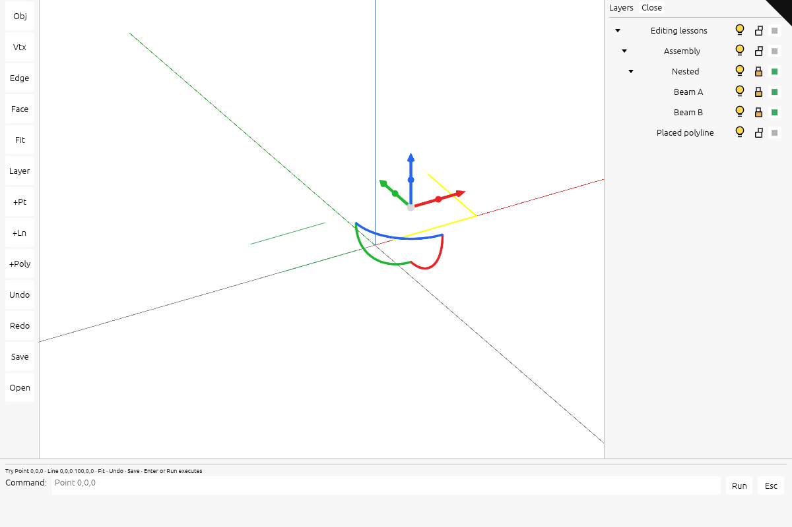

# 9 · Keep source dragging live and build one layer tree

[Previous](current-8.md) · [Sequence](extend-integrated-tutorial.md) · [Next](command-line-walkthrough.md)

Continue in the same checkpoint workspace. Complete the edits below before compiling.


Cache each BRep tessellation’s surface parameters and update only the edited object’s existing GPU ranges. Add visible point creation, command examples and a single expandable layer tree with visibility bulbs, selection locks and colors. Save those settings with the retained geometry.

### `src/app/command.rs`

**TYPE THIS**

**CURRENT**

```rust
/// Parse one line. `Err` carries what to show the person who typed it.
```

**ADD ABOVE**

```rust
/// Contextual syntax shown while typing, including immediately usable examples.
pub fn hint(line: &str) -> &'static str {
    match line
        .split_whitespace()
        .next()
        .unwrap_or("")
        .to_ascii_lowercase()
        .as_str()
    {
        "point" => "Point x,y,z · Example: Point 0,0,0 · Enter creates the point",
        "line" => "Line start end · Example: Line 0,0,0 100,0,0",
        "polyline" => "Polyline points… · Example: Polyline 0,0,0 100,0,0 100,100,0",
        "move" | "m" => "Select an object, then Move dx,dy,dz · Example: Move 10,0,0",
        "rotate" | "rot" => "Select an object, then Rotate axis degrees · Example: Rotate z 45",
        "scale" | "s" => "Select an object, then Scale factor · Example: Scale 2",
        "trim" => "Select a line or curve · Trim 0.2 0.8 keeps that part of its length/domain",
        "extend" => "Select a line or curve · Extend -0.2 1.2 extends its domain at both ends",
        "explode" => "Select a polyline · Explode creates its individual line segments",
        "save" => "Save downloads the complete editable scene as a .session file",
        "open" => "Open restores a saved .session file",
        "fit" => "Fit zooms to the selection, or the whole scene when nothing is selected",
        _ => "Try Point 0,0,0 · Line 0,0,0 100,0,0 · Fit · Undo · Save · Enter or Run executes",
    }
}
```

### `src/app/deform.rs`

**TYPE THIS**

**CURRENT**

```rust
            }
            for curve in &mut next.m_curves_3d {
                for i in 0..curve.cv_count() {
                    if let Some(p) = curve.get_cv(i)
                        && matches(&p)
                    {
                        curve.set_cv_point(i, &p.transformed(delta));
                    }
                }
            }
            for surface in &mut next.m_surfaces {
                for u in 0..surface.m_cv_count[0] {
                    for v in 0..surface.m_cv_count[1] {
                        if let Some(p) = surface.get_cv(u, v)
                            && matches(&p)
                        {
                            surface.set_cv(u, v, &p.transformed(delta));
                        }
                    }
                }
                surface.m_mesh = None;
            }
            validate_boundaries(&next)?;
            Geometry::BRep(Rc::new(next))
```

**REPLACE WITH**

```rust
            }
            let mut changed_curves = HashSet::new();
            let mut changed_surfaces = HashSet::new();
            for (curve_index, curve) in next.m_curves_3d.iter_mut().enumerate() {
                for i in 0..curve.cv_count() {
                    if let Some(p) = curve.get_cv(i)
                        && matches(&p)
                    {
                        curve.set_cv_point(i, &p.transformed(delta));
                        changed_curves.insert(curve_index);
                    }
                }
            }
            for (surface_index, surface) in next.m_surfaces.iter_mut().enumerate() {
                for u in 0..surface.m_cv_count[0] {
                    for v in 0..surface.m_cv_count[1] {
                        if let Some(p) = surface.get_cv(u, v)
                            && matches(&p)
                        {
                            surface.set_cv(u, v, &p.transformed(delta));
                            changed_surfaces.insert(surface_index);
                        }
                    }
                }
                if changed_surfaces.contains(&surface_index) {
                    surface.m_mesh = None;
                }
            }
            validate_boundaries(&next, &changed_curves, &changed_surfaces)?;
            Geometry::BRep(Rc::new(next))
```

**TYPE THIS**

**CURRENT**

```rust
/// atomically instead of leaving a solid whose render mesh disagrees with its source geometry.
fn validate_boundaries(brep: &session_rust::BRep) -> Result<(), String> {
    if !brep.is_valid() {
        return Err("Edit would invalidate BRep topology".into());
    }
    for edge in &brep.m_edges {
        if edge.degenerated {
            continue;
```

**REPLACE WITH**

```rust
/// atomically instead of leaving a solid whose render mesh disagrees with its source geometry.
fn validate_boundaries(
    brep: &session_rust::BRep,
    changed_curves: &HashSet<usize>,
    changed_surfaces: &HashSet<usize>,
) -> Result<(), String> {
    if !brep.is_valid() {
        return Err("Edit would invalidate BRep topology".into());
    }
    for edge in &brep.m_edges {
        if edge.degenerated
            || (!changed_curves.contains(&(edge.curve_3d_index as usize))
                && !edge
                    .pcurves
                    .iter()
                    .any(|pc| changed_surfaces.contains(&(pc.surface_index as usize))))
        {
            continue;
```

**TYPE THIS**

**CURRENT**

```rust
        assert!(next.is_closed(0));
        validate_boundaries(&next).unwrap();
    }
}
```

**REPLACE WITH**

```rust
        assert!(next.is_closed(0));
        validate_boundaries(
            &next,
            &(0..next.m_curves_3d.len()).collect(),
            &(0..next.m_surfaces.len()).collect(),
        )
        .unwrap();
    }
}
```

### `src/app/edit.rs`

**TYPE THIS**

**CURRENT**

```rust
        let original = Rc::make_mut(&mut self.docs[doc].session)
```

**ADD ABOVE**

```rust
        if self.patch_preview(row, &geometry, gpu) {
            return Ok(());
        }
```

### `src/app/feedback.rs`

**TYPE THIS**

**CURRENT**

```rust
/// One row of the layers panel, as the panel needs it.
#[derive(Clone)]
pub struct LayerRow {
    pub key: String,
    pub label: String,
    pub count: usize,
    pub hidden: bool,
}
```

**REPLACE WITH**

```rust
/// One row of the layers panel, as the panel needs it.
#[derive(Clone, Default)]
pub struct LayerRow {
    pub key: String,
    pub label: String,
    pub count: usize,
    pub hidden: bool,
    pub locked: bool,
    pub color: Option<[u8; 3]>,
    pub depth: usize,
    pub expanded: Option<bool>,
}
```

### `src/app/hierarchy.rs`

**TYPE THIS**

**CURRENT**

```rust
use crate::app::scene::Scene;
use session_rust::Session;
use std::collections::BTreeMap;
```

**REPLACE WITH**

```rust
use crate::app::scene::Scene;
#[cfg(test)]
use session_rust::Session;
#[cfg(test)]
use std::collections::BTreeMap;
```

**TYPE THIS**

**CURRENT**

```rust
        }
        for (doc, file) in scene.docs.iter().enumerate() {
            let start = self.nodes.len();
            let rows = self.rows.len();
            if !self.tree(scene, doc, &lookup)
                || !self.graph(&file.session, doc, &file.name, &lookup)
            {
                self.nodes.truncate(start);
```

**REPLACE WITH**

```rust
        }
        for doc in 0..scene.docs.len() {
            let start = self.nodes.len();
            let rows = self.rows.len();
            if !self.tree(scene, doc, &lookup) {
                self.nodes.truncate(start);
```

**TYPE THIS**

**CURRENT**

```rust
        let mut seen = HashSet::new();
        let mut stack = Vec::new();
        if let Some(root) = file.session.tree.root() {
            stack.push((root, 1, None));
        }
```

**REPLACE WITH**

```rust
        let mut seen = HashSet::new();
        let mut seen_rows = HashSet::new();
        let mut stack = Vec::new();
        if let Some(root) = file.session.tree.root() {
            if root.borrow().name == file.name {
                // The document row already represents this root and its descendants.
                for child in root.borrow().children().into_iter().rev() {
                    stack.push((child, 1, None));
                }
            } else {
                stack.push((root, 1, None));
            }
        }
```

**TYPE THIS**

**CURRENT**

```rust
            }
            if let Some(row) = row {
                self.rows.push(row);
```

**REPLACE WITH**

```rust
            }
            if let Some(row) = row
                && seen_rows.insert(row)
            {
                self.rows.push(row);
```

**TYPE THIS**

**CURRENT**

```rust
        }
        if self.rows.len() == self.nodes[start].rows.start {
            for row in 0..scene.object_count() as u32 {
                if scene
                    .identity_of(row)
                    .is_some_and(|(owner, _)| owner == doc)
                {
                    self.rows.push(row);
                }
            }
        }
        self.finish(start);
        self.rows.len() <= MAX_ROWS
    }

    fn graph(&mut self, session: &Session, doc: usize, name: &str, lookup: &Lookup) -> bool {
```

**REPLACE WITH**

```rust
        }
        for row in 0..scene.object_count() as u32 {
            if scene
                .identity_of(row)
                .is_some_and(|(owner, _)| owner == doc)
                && seen_rows.insert(row)
            {
                let index = self.nodes.len();
                if !self.push(scene.object_name(row), 1) {
                    return false;
                }
                self.rows.push(row);
                self.finish(index);
            }
        }
        self.finish(start);
        self.rows.len() <= MAX_ROWS
    }

    #[cfg(test)]
    fn graph(&mut self, session: &Session, doc: usize, name: &str, lookup: &Lookup) -> bool {
```

**TYPE THIS**

**CURRENT**

```rust
    use session_rust::Point;
```

**ADD BELOW**

```rust
    #[cfg(test)]
```

**TYPE THIS**

**CURRENT**

```rust
        assert_eq!(index.targets(child), vec![0]);
```

**ADD BELOW**

```rust
        let tree_count = index.rows.len();
        let mut lookup = Lookup::new();
        for row in 0..scene.object_count() as u32 {
            let (doc, id) = scene.identity_of(row).unwrap();
            lookup.entry(doc).or_default().insert(id, row);
        }
        assert!(index.graph(&shared, 0, "first", &lookup));
```

**TYPE THIS**

**CURRENT**

```rust
        assert!(!index.visible().contains(&child));
        let count = index.rows.len();
        index.rebuild(&scene);
        assert_eq!(index.rows.len(), count);
        scene = Scene::new();
```

**REPLACE WITH**

```rust
        assert!(!index.visible().contains(&child));
        index.rebuild(&scene);
        assert_eq!(index.rows.len(), tree_count);
        scene = Scene::new();
```

### `src/app/inspection.rs`

**TYPE THIS**

**CURRENT**

```rust
    let identity = selected_identity(state);
    let snapshot = serde_json::json!({
        "submitted_at_ms": crate::engine::performance::now_ms(),
```

**REPLACE WITH**

```rust
    let identity = selected_identity(state);
    let mut snapshot = serde_json::json!({
        "submitted_at_ms": crate::engine::performance::now_ms(),
```

**TYPE THIS**

**CURRENT**

```rust
    });
```

**ADD BELOW**

```rust
    snapshot["locked_count"] = serde_json::json!(state.scene.locked.len());
    snapshot["color_count"] = serde_json::json!(state.scene.colors.len());
    snapshot["scene_revision"] = serde_json::json!(state.scene.row_revision);
    snapshot["preview_cache_bytes"] = serde_json::json!(state.scene.preview_cache_bytes());
```

### `src/app/mod.rs`

**TYPE THIS**

**CURRENT**

```rust
pub mod ui;
```

**ADD BELOW**

```rust

pub mod surface_preview;
```

### `src/app/scene.rs`

**TYPE THIS**

**CURRENT**

```rust
    pub hidden: HashSet<(usize, Rc<str>)>,
```

**ADD BELOW**

```rust
    pub locked: HashSet<(usize, Rc<str>)>,
    pub colors: HashMap<(usize, Rc<str>), [u8; 3]>,
```

**TYPE THIS**

**CURRENT**

```rust
    bases: Bases,
```

**ADD BELOW**

```rust
    uploaded: crate::engine::gpu::patch::Counts,
    surface_previews: Vec<Option<crate::app::surface_preview::SurfacePreview>>,
    pub(super) preview_spans: Vec<Option<crate::engine::gpu::patch::Span>>,
```

**TYPE THIS**

**CURRENT**

```rust
impl Scene {
```

**ADD BELOW**

```rust
    /// Selection locks follow source identity across uploads and undo.
    pub fn selectable(&self, row: u32) -> bool {
        self.identity_of(row)
            .is_some_and(|id| !self.locked.contains(&id))
    }
```

**TYPE THIS**

**CURRENT**

```rust
            hidden: HashSet::new(),
```

**ADD BELOW**

```rust
            locked: HashSet::new(),
            colors: HashMap::new(),
```

**TYPE THIS**

**CURRENT**

```rust
            bases: Bases::default(),
```

**ADD BELOW**

```rust
            uploaded: Default::default(),
            preview_spans: Vec::new(),
            surface_previews: Vec::new(),
```

**TYPE THIS**

**CURRENT**

```rust
        self.hidden.clear();
```

**ADD BELOW**

```rust
        self.locked.clear();
        self.colors.clear();
```

**TYPE THIS**

**CURRENT**

```rust
        self.bases = Bases::default();
```

**ADD BELOW**

```rust
        self.uploaded = Default::default();
        self.preview_spans.clear();
        self.surface_previews.clear();
```

**TYPE THIS**

**CURRENT**

```rust
        self.bases.ribbon += self.tables.seg.ribbons.len() as u32;
```

**ADD BELOW**

```rust
        self.uploaded = self
            .uploaded
            .plus(crate::engine::gpu::patch::Counts::of(&self.tables));
```

**TYPE THIS**

**CURRENT**

```rust
        self.tables.obj.rows.push(ObjectRow::new(place, flags));
        let guid: Rc<str> = Rc::from(guid);
        self.guid_to_row.insert((owner, Rc::clone(&guid)), row);
        self.order.push(guid);
        self.owners.push(owner);
        self.ribbon_ranges.push(None);
        row
```

**REPLACE WITH**

```rust
        self.tables.obj.rows.push(ObjectRow::new(place, flags));
        if let Some(color) = self.colors.get(&(owner, Rc::from(guid))) {
            let object = self.tables.obj.rows.last_mut().expect("row just appended");
            object.color = [
                color[0] as f32 / 255.,
                color[1] as f32 / 255.,
                color[2] as f32 / 255.,
                1.,
            ];
            object.flags |= Instance::FLAG_COLOR;
        }

        let guid: Rc<str> = Rc::from(guid);
        self.guid_to_row.insert((owner, Rc::clone(&guid)), row);
        self.order.push(guid);
        self.owners.push(owner);
        self.ribbon_ranges.push(None);
        self.preview_spans.push(None);
        self.surface_previews.push(None);
        row
```

**TYPE THIS**

**CURRENT**

```rust
            };
            let r = walk_geometry(&mut Walk::of(&mut self.tables), &cx, geom);
            let o = self.tables.obj.rows.last_mut().unwrap();
```

**REPLACE WITH**

```rust
            };
            let start = self
                .uploaded
                .plus(crate::engine::gpu::patch::Counts::of(&self.tables));
            let r = walk_geometry(&mut Walk::of(&mut self.tables), &cx, geom);
            let end = self
                .uploaded
                .plus(crate::engine::gpu::patch::Counts::of(&self.tables));
            let span = crate::engine::gpu::patch::Span {
                start,
                count: end.minus(start),
            };
            self.preview_spans[row as usize] = Some(span);
            self.surface_previews[row as usize] =
                crate::app::surface_preview::SurfacePreview::capture(
                    &self.tables,
                    span,
                    start.minus(self.uploaded),
                    geom,
                );
            let o = self.tables.obj.rows.last_mut().unwrap();
```

**TYPE THIS**

**CURRENT**

```rust
        assert!(!scene.tables.arena.idx.is_empty());
    }
}
```

**ADD BELOW**

```rust

impl Scene {
    /// Rewalk only the edited object and overwrite its existing GPU ranges when they fit.
    /// Topology/count changes use the normal rebuild path without partially writing buffers.
    pub(crate) fn patch_preview(&mut self, row: u32, geometry: &Geometry, gpu: &mut Gpu) -> bool {
        use crate::engine::gpu::patch::Counts;
        if matches!(geometry, Geometry::PointCloud(_)) {
            return false;
        }
        let Some(span) = self.preview_spans.get(row as usize).copied().flatten() else {
            return false;
        };
        let Some(place) = self.placement_of(row) else {
            return false;
        };
        if let Some(preview) = self
            .surface_previews
            .get(row as usize)
            .and_then(Option::as_ref)
            && let Some((vertices, pipes, bounds)) = preview.evaluate(geometry)
        {
            gpu.arena
                .patch_vertices(&gpu.ctx, span.start.verts, &vertices);
            gpu.segments.patch_pipes(&gpu.ctx, span.start.pipes, &pipes);
            gpu.objects
                .set_geometry_bounds(&gpu.ctx, row, bounds, 0.0, &place);
            gpu.grew_bounds(row);
            return true;
        }
        let mut up = Upload::default();
        let cx = WalkCx {
            vert_base: span.start.verts,
            cloud_px: 0.0,
            row,
        };
        let result = walk_geometry(&mut Walk::of(&mut up), &cx, geometry);
        if Counts::of(&up) != span.count {
            return false;
        }
        gpu.arena.patch(&gpu.ctx, span.start, &up.arena);
        gpu.segments.patch(&gpu.ctx, span.start, &up.seg);
        gpu.glyphs.patch(&gpu.ctx, span.start, &up.glyph);
        gpu.objects
            .set_geometry_bounds(&gpu.ctx, row, result.bounds, result.spacing, &place);
        for (i, pipe) in up.seg.pipes.iter().enumerate() {
            self.edge_sources[span.start.pipes as usize + i] = (
                pipe.instance_id,
                up.seg.pipe_ids.get(i).copied().unwrap_or(u32::MAX),
            );
        }
        gpu.grew_bounds(row);
        true
    }
}

impl Scene {
    pub fn preview_cache_bytes(&self) -> usize {
        self.surface_previews
            .iter()
            .flatten()
            .map(|p| p.allocated_bytes())
            .sum::<usize>()
            + self.preview_spans.capacity()
                * std::mem::size_of::<Option<crate::engine::gpu::patch::Span>>()
    }
}
```

### `src/app/session_io.rs`

**TYPE THIS**

**CURRENT**

```rust
    hidden: Vec<(usize, String)>,
```

**ADD BELOW**

```rust
    #[serde(default)]
    locked: Vec<(usize, String)>,
    #[serde(default)]
    colors: Vec<(usize, String, [u8; 3])>,
```

**TYPE THIS**

**CURRENT**

```rust
    hidden.sort();
```

**ADD BELOW**

```rust
    let mut locked: Vec<_> = scene
        .locked
        .iter()
        .map(|(doc, id)| (*doc, id.to_string()))
        .collect();
    locked.sort();
    let mut colors: Vec<_> = scene
        .colors
        .iter()
        .map(|((doc, id), color)| (*doc, id.to_string(), *color))
        .collect();
    colors.sort();
```

**TYPE THIS**

**CURRENT**

```rust
        hidden,
```

**ADD BELOW**

```rust
        locked,
        colors,
```

**TYPE THIS**

**CURRENT**

```rust
        .map(|(doc, id)| (doc, Rc::from(id)))
```

**ADD BELOW**

```rust
        .collect();
    scene.locked = metadata
        .locked
        .into_iter()
        .map(|(doc, id)| (doc, Rc::from(id)))
        .collect();
    scene.colors = metadata
        .colors
        .into_iter()
        .map(|(doc, id, color)| ((doc, Rc::from(id)), color))
```

**TYPE THIS**

**CURRENT**

```rust
        scene.hidden.insert(scene.identity_of(1).unwrap());
        let bytes = save(&scene).unwrap();
        assert!(scene.undo(), "saving leaves live undo available");
        let restored = open(&bytes).unwrap();
        assert_eq!(restored.docs.len(), 2);
        assert_eq!(restored.hidden.len(), 1);
        assert_eq!(restored.docs[0].place.m[12], 100.);
```

**REPLACE WITH**

```rust
        scene.hidden.insert(scene.identity_of(1).unwrap());
        scene.locked.insert(scene.identity_of(0).unwrap());
        scene
            .colors
            .insert(scene.identity_of(1).unwrap(), [240, 80, 30]);
        let bytes = save(&scene).unwrap();
        assert!(scene.undo(), "saving leaves live undo available");
        let restored = open(&bytes).unwrap();
        assert_eq!(restored.docs.len(), 2);
        assert_eq!(restored.hidden.len(), 1);
        assert_eq!(restored.locked, scene.locked);
        assert_eq!(restored.colors, scene.colors);
        assert!(!restored.selectable(0));
        assert!(restored.selectable(1));
        assert_eq!(restored.docs[0].place.m[12], 100.);
```

### `src/app/surface_preview.rs`

**NEW FILE · TYPE THIS**

```rust
//! Reevaluate the existing display samples while dragging; trims and triangles keep their topology.
use crate::engine::gpu::patch::Span;
use crate::engine::gpu::segments::SegRows;
use crate::engine::gpu::{CylinderSegment, Upload};
use crate::math::Aabb;
use session_rust::{Geometry, NurbsSurface, RenderVertex};
use std::collections::HashMap;

#[derive(Clone, Copy)]
pub struct Sample {
    pub index: u32,
    pub surface: u32,
    pub uv: [f64; 2],
    pub sign: f32,
}

pub struct SurfacePreview {
    samples: Vec<Sample>,
    vertices: Vec<RenderVertex>,
    controls: Vec<Vec<f64>>,
    pipes: Vec<CylinderSegment>,
    pipe_vertices: Vec<[usize; 2]>,
    pipe_normals: Vec<[usize; 2]>,
    chains: Vec<std::ops::Range<u32>>,
}
impl SurfacePreview {
    pub(crate) fn capture(
        up: &Upload,
        span: Span,
        local: crate::engine::gpu::patch::Counts,
        geometry: &Geometry,
    ) -> Option<Self> {
        if span.count.verts == 0
            || span.count.ribbons != 0
            || span.count.spheres != 0
            || span.count.dots != 0
        {
            return None;
        }
        let first = local.verts as usize;
        let end = first + span.count.verts as usize;
        let samples: Vec<_> = up
            .arena
            .surface_samples
            .iter()
            .filter(|sample| (first..end).contains(&(sample.index as usize)))
            .copied()
            .collect();
        if samples.len() != span.count.verts as usize {
            return None;
        }
        let mut positions = HashMap::<[u32; 3], Vec<usize>>::new();
        for (i, vertex) in up.arena.verts[first..end].iter().enumerate() {
            positions
                .entry(vertex.position.map(f32::to_bits))
                .or_default()
                .push(i);
        }
        let start_pipe = local.pipes as usize;
        let end_pipe = start_pipe + span.count.pipes as usize;
        let pipes = up.seg.pipes[start_pipe..end_pipe].to_vec();
        let pipe_vertices = pipes
            .iter()
            .map(|p| {
                Some([
                    *positions.get(&p.p0.map(f32::to_bits))?.first()?,
                    *positions.get(&p.p1.map(f32::to_bits))?.first()?,
                ])
            })
            .collect::<Option<Vec<_>>>()?;
        let pipe_normals = pipes
            .iter()
            .map(|p| {
                let candidates = positions.get(&p.p0.map(f32::to_bits))?;
                let first = *candidates.first()?;
                let other = candidates
                    .iter()
                    .copied()
                    .find(|&i| samples[i].surface != samples[first].surface)
                    .unwrap_or(first);
                Some([first, other])
            })
            .collect::<Option<Vec<_>>>()?;
        let chains = up
            .seg
            .pipe_chains
            .iter()
            .filter(|r| r.start >= local.pipes && r.end <= local.pipes + span.count.pipes)
            .map(|r| r.start - local.pipes..r.end - local.pipes)
            .collect();
        Some(Self {
            samples,
            vertices: up.arena.verts[first..end].to_vec(),
            controls: surfaces(geometry)?.iter().map(|s| s.m_cv.clone()).collect(),
            pipes,
            pipe_vertices,
            pipe_normals,
            chains,
        })
    }
    pub fn evaluate(&self, geometry: &Geometry) -> Option<(Vec<RenderVertex>, SegRows, Aabb)> {
        let surfaces = surfaces(geometry)?;
        let changed: Vec<_> = surfaces
            .iter()
            .enumerate()
            .map(|(i, s)| self.controls.get(i) != Some(&s.m_cv))
            .collect();
        let mut bounds = Aabb::empty();
        let mut vertices = Vec::with_capacity(self.samples.len());
        for (sample, baseline) in self.samples.iter().zip(&self.vertices) {
            let surface = surfaces.get(sample.surface as usize)?;
            if !changed[sample.surface as usize] {
                bounds.grow(baseline.position);
                vertices.push(*baseline);
                continue;
            }
            let point = surface.point_at(sample.uv[0], sample.uv[1])?;
            let normal = surface.normal_at(sample.uv[0], sample.uv[1]);
            let position = point.to_f32();
            if position.iter().any(|p| !p.is_finite()) {
                return None;
            }
            bounds.grow(position);
            vertices.push(RenderVertex {
                position,
                normal: [
                    normal[0] as f32 * sample.sign,
                    normal[1] as f32 * sample.sign,
                    normal[2] as f32 * sample.sign,
                ],
                color: baseline.color,
            });
        }
        let mut segments = SegRows {
            pipe_chains: self.chains.clone(),
            ..Default::default()
        };
        for ((pipe, ends), normals) in self
            .pipes
            .iter()
            .zip(&self.pipe_vertices)
            .zip(&self.pipe_normals)
        {
            let mut pipe = *pipe;
            pipe.p0 = vertices[ends[0]].position;
            pipe.p1 = vertices[ends[1]].position;
            let a = vertices[normals[0]].normal.map(f64::from);
            let b = vertices[normals[1]].normal.map(f64::from);
            pipe.facing = super::walk::encode::pack_facing(Some(&a), Some(&b));
            segments.pipes.push(pipe);
        }
        Some((vertices, segments, bounds))
    }
    pub fn allocated_bytes(&self) -> usize {
        self.samples.capacity() * std::mem::size_of::<Sample>()
            + self.vertices.capacity() * std::mem::size_of::<RenderVertex>()
            + self.controls.capacity() * std::mem::size_of::<Vec<f64>>()
            + self
                .controls
                .iter()
                .map(|v| v.capacity() * 8)
                .sum::<usize>()
            + self.pipes.capacity() * std::mem::size_of::<CylinderSegment>()
            + (self.pipe_vertices.capacity() + self.pipe_normals.capacity())
                * std::mem::size_of::<[usize; 2]>()
            + self.chains.capacity() * std::mem::size_of::<std::ops::Range<u32>>()
    }
}

#[cfg(test)]
mod tests {
    use super::*;
    use crate::app::deform::{self, Target};
    use crate::app::walk::{Walk, WalkCx, walk_geometry};
    use crate::engine::gpu::patch::Counts;
    use session_rust::{BRep, Xform};
    use std::rc::Rc;

    #[test]
    fn joined_shell_preview_moves_source_samples_and_cancel_restores_them() {
        let source = Geometry::BRep(Rc::new(BRep::create_box(10.0, 10.0, 10.0)));
        let mut upload = Upload::default();
        let cx = WalkCx {
            vert_base: 0,
            cloud_px: 0.0,
            row: 3,
        };
        walk_geometry(&mut Walk::of(&mut upload), &cx, &source);
        let span = Span {
            start: Counts::default(),
            count: Counts::of(&upload),
        };
        let preview = SurfacePreview::capture(&upload, span, Counts::default(), &source)
            .expect("joined box has parameter provenance");
        let (before, _, _) = preview.evaluate(&source).unwrap();
        assert_eq!(before.len(), upload.arena.verts.len());
        for (a, b) in before.iter().zip(&upload.arena.verts) {
            assert_eq!(
                a.position, b.position,
                "initial sample is the drawn source position"
            );
        }
        let changed =
            deform::transform(&source, Target::Face(0), &Xform::translation(0.0, 0.0, 2.0))
                .unwrap();
        let Geometry::BRep(brep) = &changed else {
            unreachable!()
        };
        assert!(brep.is_solid(), "source shell remains joined");
        let (after, pipes, _) = preview.evaluate(&changed).unwrap();
        assert!(
            before
                .iter()
                .zip(&after)
                .any(|(a, b)| a.position != b.position)
        );
        assert!(
            before
                .iter()
                .zip(&after)
                .any(|(a, b)| a.position == b.position)
        );
        for pipe in pipes.pipes {
            assert!(after.iter().any(|v| v.position == pipe.p0));
            assert!(after.iter().any(|v| v.position == pipe.p1));
        }
        let (cancelled, _, _) = preview.evaluate(&source).unwrap();
        for (a, b) in before.iter().zip(&cancelled) {
            assert_eq!(a.position, b.position);
        }
    }
}

fn surfaces(geometry: &Geometry) -> Option<&[NurbsSurface]> {
    match geometry {
        Geometry::BRep(b) => Some(&b.m_surfaces),
        Geometry::NurbsSurface(s) => Some(std::slice::from_ref(s)),
        Geometry::Element(e) => match e.geometry() {
            session_rust::element::ElementGeometry::BRep(b) => Some(&b.m_surfaces),
            _ => None,
        },
        _ => None,
    }
}
```

### `src/app/ui.rs`

**TYPE THIS**

**CURRENT**

```rust
        {
            let snapshot = MODEL.with_borrow(|model| serde_json::json!({"framework": "egui 0.34.3", "controls": self.controls, "command_open": model.command_open, "layers_open": model.layers_open, "command": model.command, "history": model.history}));
            let _ = canvas.set_attribute("data-viewer-ui", &snapshot.to_string());
```

**REPLACE WITH**

```rust
        {
            let snapshot = MODEL.with_borrow(|model| serde_json::json!({"framework": "egui 0.34.3", "controls": self.controls, "command_open": model.command_open, "layers_open": model.layers_open, "command": model.command, "history": model.history, "hint": crate::app::command::hint(&model.command)}));
            let _ = canvas.set_attribute("data-viewer-ui", &snapshot.to_string());
```

**TYPE THIS**

**CURRENT**

```rust
                .show(ui, |ui| {
                    let mut at = 0;
                    while at < model.rows.len() {
                        let start = at;
                        let id = model.rows[at].key.split_once('/').map(|(_, id)| id);
                        at += 1;
                        if id.is_some() {
                            while at < model.rows.len()
                                && model.rows[at].key.split_once('/').map(|(_, id)| id) == id
                            {
                                at += 1;
                            }
                        }
                        ui.horizontal(|ui| {
                            let first = &model.rows[start];
                            let indent = first.label.len() - first.label.trim_start().len();
                            ui.add_space(indent as f32 * 4.0);
                            for row in &model.rows[start..at] {
                                let response = layer_button(ui, row);
                                record(controls, &row.key, &row.label, &response);
```

**REPLACE WITH**

```rust
                .show(ui, |ui| {
                    for row in &model.rows {
                        ui.horizontal(|ui| {
                            if let Some((_, index)) = row.key.split_once('/')
                                && row.key.starts_with("select/")
                            {
                                ui.spacing_mut().item_spacing.x = 2.;
                                ui.add_space(row.depth.min(8) as f32 * 10.);
                                let response = layer_icon(ui, "open", row);
                                record(controls, &format!("open/{index}"), &row.label, &response);
                                if response.clicked() && row.expanded.is_some() {
                                    *action = Some(format!("open/{index}"));
                                }
                                let width = (ui.available_width() - 86.).max(24.);
                                let response = ui
                                    .add_sized(
                                        [width, 28.],
                                        egui::Button::new(&row.label).frame(false).truncate(),
                                    )
                                    .on_hover_text(format!(
                                        "{} · {} objects",
                                        row.label, row.count
                                    ));
                                record(
                                    controls,
                                    &row.key,
                                    &format!("Select {}", row.label),
                                    &response,
                                );
                                if response.clicked() {
                                    *action = Some(row.key.clone());
                                }
                                for kind in ["hide", "lock"] {
                                    let response = layer_icon(ui, kind, row);
                                    record(
                                        controls,
                                        &format!("{kind}/{index}"),
                                        &format!(
                                            "{} {}",
                                            if kind == "hide" {
                                                if row.hidden { "Show" } else { "Hide" }
                                            } else if row.locked {
                                                "Unlock"
                                            } else {
                                                "Lock"
                                            },
                                            row.label
                                        ),
                                        &response,
                                    );
                                    if response.clicked() {
                                        *action = Some(format!("{kind}/{index}"));
                                    }
                                }
                                layer_color(ui, row, index, controls, action);
                            } else {
                                let response = ui.button(&row.label);
                                record(controls, &row.key, &row.label, &response);
```

**TYPE THIS**

**CURRENT**

```rust

fn layer_button(ui: &mut egui::Ui, row: &LayerRow) -> egui::Response {
    let label = row.label.trim_start();
    if row.key.starts_with("open/") {
        let (rect, response) = ui.allocate_exact_size(egui::vec2(20.0, 28.0), egui::Sense::click());
        let c = rect.center();
        let points = if label.starts_with('▾') {
            vec![
                c + egui::vec2(-4.0, -2.0),
                c + egui::vec2(4.0, -2.0),
                c + egui::vec2(0.0, 3.0),
            ]
        } else {
            vec![
                c + egui::vec2(-2.0, -4.0),
                c + egui::vec2(-2.0, 4.0),
                c + egui::vec2(3.0, 0.0),
            ]
        };
        ui.painter().add(egui::Shape::convex_polygon(
            points,
            egui::Color32::BLACK,
            egui::Stroke::NONE,
        ));
        return response;
    }
    let label: String = label.chars().take(160).collect();
    let text = if row.key.starts_with("hide/") {
        if row.hidden {
            "Show".to_string()
        } else {
            "Hide".to_string()
        }
    } else {
        format!("{} ({})", label.trim_start_matches("Select "), row.count)
    };
    let width = if row.key.starts_with("hide/") {
        44.0
    } else {
        (ui.available_width()
            - if row.key.starts_with("select/") {
                52.0
            } else {
                0.0
            })
        .max(40.0)
    };
    ui.add_sized([width, 28.0], egui::Button::new(text).truncate())
        .on_hover_text(label)
}
```

**REPLACE WITH**

```rust

fn layer_icon(ui: &mut egui::Ui, kind: &str, row: &LayerRow) -> egui::Response {
    let (rect, response) = ui.allocate_exact_size(egui::vec2(26., 28.), egui::Sense::click());
    let c = rect.center();
    let ink = ui.visuals().text_color();
    let stroke = egui::Stroke::new(1.4_f32, ink);
    if response.hovered() {
        ui.painter()
            .rect_filled(rect.shrink(1.), 3., ui.visuals().widgets.hovered.bg_fill);
    }
    match kind {
        "open" => {
            if let Some(open) = row.expanded {
                let points = if open {
                    vec![
                        c + egui::vec2(-4., -2.),
                        c + egui::vec2(4., -2.),
                        c + egui::vec2(0., 3.),
                    ]
                } else {
                    vec![
                        c + egui::vec2(-2., -4.),
                        c + egui::vec2(-2., 4.),
                        c + egui::vec2(3., 0.),
                    ]
                };
                ui.painter()
                    .add(egui::Shape::convex_polygon(points, ink, egui::Stroke::NONE));
            }
            response.on_hover_text("Expand or collapse")
        }
        "hide" => {
            let fill = if row.hidden {
                egui::Color32::TRANSPARENT
            } else {
                egui::Color32::from_rgb(255, 216, 80)
            };
            ui.painter()
                .circle(c + egui::vec2(0., -3.), 5., fill, stroke);
            for y in [3., 6.] {
                ui.painter()
                    .line_segment([c + egui::vec2(-3., y), c + egui::vec2(3., y)], stroke);
            }
            if row.hidden {
                ui.painter()
                    .line_segment([c + egui::vec2(-7., 8.), c + egui::vec2(7., -9.)], stroke);
            }
            response.on_hover_text(if row.hidden {
                "Show object and children"
            } else {
                "Hide object and children"
            })
        }
        _ => {
            ui.painter().rect(
                egui::Rect::from_center_size(c + egui::vec2(0., 3.), egui::vec2(11., 9.)),
                1.,
                if row.locked {
                    egui::Color32::from_rgb(225, 180, 90)
                } else {
                    egui::Color32::TRANSPARENT
                },
                stroke,
                egui::StrokeKind::Inside,
            );
            let x = if row.locked { 0. } else { 3. };
            ui.painter().add(egui::Shape::line(
                vec![
                    c + egui::vec2(-3. + x, -1.),
                    c + egui::vec2(-3. + x, -6.),
                    c + egui::vec2(3. + x, -6.),
                    c + egui::vec2(3. + x, -1.),
                ],
                stroke,
            ));
            response.on_hover_text(if row.locked {
                "Unlock object and children"
            } else {
                "Lock selection of object and children"
            })
        }
    }
}

fn layer_color(
    ui: &mut egui::Ui,
    row: &LayerRow,
    index: &str,
    controls: &mut Option<Vec<Control>>,
    action: &mut Option<String>,
) {
    let mut color = row.color.unwrap_or([180, 180, 180]);
    let response = ui
        .menu_button(
            egui::RichText::new("■").color(egui::Color32::from_rgb(color[0], color[1], color[2])),
            |ui| {
                ui.label("Object and child colors");
                for colors in [
                    [
                        ("Red", [230, 65, 55]),
                        ("Orange", [240, 145, 45]),
                        ("Yellow", [240, 210, 60]),
                    ],
                    [
                        ("Green", [60, 170, 100]),
                        ("Blue", [65, 130, 225]),
                        ("Violet", [160, 85, 210]),
                    ],
                    [
                        ("White", [245, 245, 245]),
                        ("Gray", [150, 150, 150]),
                        ("Black", [35, 35, 35]),
                    ],
                ] {
                    ui.horizontal(|ui| {
                        for (name, rgb) in colors {
                            let response = ui
                                .add_sized(
                                    [48., 28.],
                                    egui::Button::new(
                                        egui::RichText::new("■")
                                            .color(egui::Color32::from_rgb(rgb[0], rgb[1], rgb[2])),
                                    ),
                                )
                                .on_hover_text(name);
                            let key =
                                format!("color/{index}/{:02x}{:02x}{:02x}", rgb[0], rgb[1], rgb[2]);
                            record(controls, &key, name, &response);
                            if response.clicked() {
                                *action = Some(key);
                                ui.close();
                            }
                        }
                    });
                }
                ui.separator();
                let mut changed = false;
                for (channel, value) in ["R", "G", "B"].into_iter().zip(color.iter_mut()) {
                    changed |= ui
                        .add(egui::Slider::new(value, 0..=255).text(channel))
                        .changed();
                }
                if changed {
                    *action = Some(format!(
                        "color/{index}/{:02x}{:02x}{:02x}",
                        color[0], color[1], color[2]
                    ));
                }
            },
        )
        .response
        .on_hover_text("Change object and child colors");
    record(
        controls,
        &format!("color/{index}"),
        &format!("Color {}", row.label),
        &response,
    );
}
```

**TYPE THIS**

**CURRENT**

```rust
) {
    let height = if model.command_open { 160.0 } else { 76.0 };
    egui::Panel::bottom("command-line")
        .default_size(height)
        .size_range(76.0..=260.0)
        .resizable(true)
        .show_inside(root, |ui| {
            egui::ScrollArea::vertical()
                .id_salt("command-history")
                .stick_to_bottom(true)
                .max_height((ui.available_height() - 40.0).max(20.0))
                .show(ui, |ui| {
```

**REPLACE WITH**

```rust
) {
    let height = if model.command_open { 160.0 } else { 104.0 };
    egui::Panel::bottom("command-line")
        .default_size(height)
        .size_range(104.0..=260.0)
        .resizable(true)
        .show_inside(root, |ui| {
            egui::ScrollArea::vertical()
                .id_salt("command-history")
                .stick_to_bottom(true)
                .max_height((ui.available_height() - 68.0).max(20.0))
                .show(ui, |ui| {
```

**TYPE THIS**

**CURRENT**

```rust
            ui.separator();
            ui.horizontal(|ui| {
```

**REPLACE WITH**

```rust
            ui.separator();
            ui.small(crate::app::command::hint(&model.command));
            ui.horizontal(|ui| {
```

**TYPE THIS**

**CURRENT**

```rust
                        .char_limit(2048)
                        .hint_text("Type a command"),
                );
```

**REPLACE WITH**

```rust
                        .char_limit(2048)
                        .hint_text("Point 0,0,0"),
                );
```

### `src/app/walk/brep.rs`

**TYPE THIS**

**CURRENT**

```rust
        push_face(arena, &rm, cx, &mut solid, fi);
```

**ADD ABOVE**

```rust
        let surface_index = b.m_faces[fi].surface_index as usize;
        cache_samples(arena, fm, &rm, &b.m_surfaces[surface_index], surface_index);
```

**TYPE THIS**

**CURRENT**

```rust
                );
            }
        }
    }
}
```

**ADD BELOW**

```rust

/// Store only parameter provenance for live edits, without retaining mesh topology maps.
fn cache_samples(
    arena: &mut ArenaRows,
    mesh: &Mesh,
    render: &RenderMesh,
    surface: &NurbsSurface,
    index: usize,
) {
    let mut rows: Vec<_> = mesh.vertex.iter().collect();
    rows.sort_unstable_by_key(|&(key, _)| *key);
    if rows.len() != render.vertices.len() {
        return;
    }
    for (offset, ((_, vertex), rendered)) in rows.into_iter().zip(&render.vertices).enumerate() {
        let (Some(&u), Some(&v)) = (vertex.attributes.get("u"), vertex.attributes.get("v")) else {
            continue;
        };
        let normal = surface.normal_at(u, v);
        let dot = (0..3)
            .map(|d| normal[d] * rendered.normal[d] as f64)
            .sum::<f64>();
        arena
            .surface_samples
            .push(crate::app::surface_preview::Sample {
                index: arena.verts.len() as u32 + offset as u32,
                surface: index as u32,
                uv: [u, v],
                sign: if dot < 0.0 { -1.0 } else { 1.0 },
            });
    }
}
```

### `src/app/walk/points.rs`

**TYPE THIS**

**CURRENT**

```rust
    let center = p.to_f32();
    glyph.dots.push(GlyphPoint {
        center,
        radius: encode_width(p.width),
        color: p.pointcolor.to_f32(),
```

**REPLACE WITH**

```rust
    let center = p.to_f32();
    let radius = encode_width(p.width);
    glyph.dots.push(GlyphPoint {
        center,
        // A standalone point needs a visible marker, independent of the line pen.
        radius: if radius == 0.0 { -3.0 } else { radius },
        color: p.pointcolor.to_f32(),
```

### `src/engine/gpu/arena.rs`

**TYPE THIS**

**CURRENT**

```rust
    pub face_sources: Vec<super::faces::FaceSource>,
```

**ADD BELOW**

```rust
    pub surface_samples: Vec<crate::app::surface_preview::Sample>,
```

**TYPE THIS**

**CURRENT**

```rust
        drop_rows(&mut self.face_sources);
```

**ADD BELOW**

```rust
        drop_rows(&mut self.surface_samples);
```

**TYPE THIS**

**CURRENT**

```rust
            .append(ctx, up, [&self.verts.buf, &self.vids.buf, &self.faces.buf]);
```

**ADD BELOW**

```rust
    }

    pub(crate) fn patch_vertices(&mut self, ctx: &GpuCtx, first: u32, vertices: &[RenderVertex]) {
        self.tiles.invalidate();
        self.verts.write_at(ctx, first, vertices);
    }

    /// Replace an existing object's fixed-size ranges; unrelated buffers remain untouched.
    pub(crate) fn patch(&mut self, ctx: &GpuCtx, at: super::patch::Counts, up: &ArenaRows) {
        self.tiles.invalidate();
        self.verts.write_at(ctx, at.verts, &up.verts);
        self.vids.write_at(ctx, at.verts, &up.vids);
        self.faces.write_at(ctx, at.faces, &up.idx);
        self.print.write_at(ctx, at.print, &up.idx_print);
        self.text.write_at(ctx, at.text, &up.idx_text);
        self.source_faces.patch(ctx, at, up);
```

### `src/engine/gpu/buffers.rs`

**TYPE THIS**

**CURRENT**

```rust
    pub fn write_at<T: Pod>(&self, ctx: &GpuCtx, at: u32, data: &[T]) {
```

**ADD BELOW**

```rust
        if data.is_empty() {
            return;
        }
```

### `src/engine/gpu/faces.rs`

**TYPE THIS**

**CURRENT**

```rust
    /// Resolve a GPU face address back to its original parent and source key.
```

**ADD ABOVE**

```rust
    pub(crate) fn patch(
        &mut self,
        ctx: &GpuCtx,
        at: super::patch::Counts,
        up: &super::arena::ArenaRows,
    ) {
        let first = at.sources as usize;
        self.sources[first..first + up.face_sources.len()].copy_from_slice(&up.face_sources);
        let ids: Vec<u32> = (0..up.idx.len() / 3)
            .map(|i| match up.face_ids.get(i) {
                Some(&id) if id != u32::MAX => at.sources + id,
                _ => u32::MAX,
            })
            .collect();
        self.ids.write_at(ctx, at.faces / 3, &ids);
        self.revision = self.revision.wrapping_add(1);
    }
```

### `src/engine/gpu/glyphs.rs`

**TYPE THIS**

**CURRENT**

```rust
impl GlyphLane {
```

**ADD BELOW**

```rust
    pub(crate) fn patch(&mut self, ctx: &GpuCtx, at: super::patch::Counts, up: &GlyphRows) {
        self.spheres.buf.write_at(ctx, at.spheres, &up.spheres);
        self.dots.buf.write_at(ctx, at.dots, &up.dots);
    }
```

### `src/engine/gpu/instance.rs`

**TYPE THIS**

**CURRENT**

```rust
    pub const FLAG_SINGLE: u32 = 1 << 7;
```

**ADD BELOW**

```rust
    /// Replace authored colors with the layer color.
    pub const FLAG_COLOR: u32 = 1 << 8;
```

### `src/engine/gpu/mod.rs`

**TYPE THIS**

**CURRENT**

```rust
pub mod objects;
```

**ADD BELOW**

```rust
pub(crate) mod patch;
```

**TYPE THIS**

**CURRENT**

```rust
    /// Hide or show `row`. Every lane's vertex stage parks a hidden row outside the clip
```

**ADD ABOVE**

```rust
    pub fn set_object_color(&mut self, row: u32, color: [u8; 3]) {
        self.objects.set_color(&self.ctx, row, color);
        self.splat.invalidate();
    }
```

### `src/engine/gpu/objects.rs`

**TYPE THIS**

**CURRENT**

```rust
    /// Set or clear one flag bit on one row and write that row back.
```

**ADD ABOVE**

```rust
    /// Refresh the local box after source geometry changed, keeping its placement and identity.
    pub(crate) fn set_geometry_bounds(
        &mut self,
        ctx: &GpuCtx,
        row: u32,
        bounds: Aabb,
        spacing: f32,
        place: &Mat4,
    ) {
        self.local_bounds[row as usize] = bounds;
        self.rows[row as usize].spacing = spacing;
        self.set_placement(ctx, row, place);
    }

    /// Change display color without rebuilding geometry or placement.
    pub fn set_color(&mut self, ctx: &GpuCtx, row: u32, color: [u8; 3]) {
        if let Some(r) = self.rows.get_mut(row as usize) {
            r.color = [
                color[0] as f32 / 255.,
                color[1] as f32 / 255.,
                color[2] as f32 / 255.,
                1.,
            ];
            r.flags |= Instance::FLAG_COLOR;
            self.buffer.write_at(ctx, row, std::slice::from_ref(r));
        }
    }
```

### `src/engine/gpu/patch.rs`

**NEW FILE · TYPE THIS**

```rust
//! Sizes and offsets for replacing one object without rewalking unrelated documents.
use super::Upload;
#[derive(Clone, Copy, Default, Debug, PartialEq, Eq)]
pub(crate) struct Counts {
    pub verts: u32,
    pub faces: u32,
    pub print: u32,
    pub text: u32,
    pub sources: u32,
    pub pipes: u32,
    pub ribbons: u32,
    pub spheres: u32,
    pub dots: u32,
}
impl Counts {
    pub fn of(up: &Upload) -> Self {
        Self {
            verts: up.arena.verts.len() as u32,
            faces: up.arena.idx.len() as u32,
            print: up.arena.idx_print.len() as u32,
            text: up.arena.idx_text.len() as u32,
            sources: up.arena.face_sources.len() as u32,
            pipes: up.seg.pipes.len() as u32,
            ribbons: up.seg.ribbons.len() as u32,
            spheres: up.glyph.spheres.len() as u32,
            dots: up.glyph.dots.len() as u32,
        }
    }
    pub fn plus(self, other: Self) -> Self {
        Self {
            verts: self.verts + other.verts,
            faces: self.faces + other.faces,
            print: self.print + other.print,
            text: self.text + other.text,
            sources: self.sources + other.sources,
            pipes: self.pipes + other.pipes,
            ribbons: self.ribbons + other.ribbons,
            spheres: self.spheres + other.spheres,
            dots: self.dots + other.dots,
        }
    }
    pub fn minus(self, other: Self) -> Self {
        Self {
            verts: self.verts - other.verts,
            faces: self.faces - other.faces,
            print: self.print - other.print,
            text: self.text - other.text,
            sources: self.sources - other.sources,
            pipes: self.pipes - other.pipes,
            ribbons: self.ribbons - other.ribbons,
            spheres: self.spheres - other.spheres,
            dots: self.dots - other.dots,
        }
    }
}
#[derive(Clone, Copy)]
pub(crate) struct Span {
    pub start: Counts,
    pub count: Counts,
}
```

### `src/engine/gpu/segments.rs`

**TYPE THIS**

**CURRENT**

```rust
            push_chunk(&mut self.sheets, d.instance, chunk, ids);
        }
```

**ADD BELOW**

```rust
    }

    pub(crate) fn patch_pipes(&mut self, ctx: &GpuCtx, first: u32, up: &SegRows) {
        let pipes = joined_rows(&up.pipes, &up.pipe_chains, first);
        self.pipes.buf.write_at(ctx, first, &pipes);
    }

    pub(crate) fn patch(&mut self, ctx: &GpuCtx, at: super::patch::Counts, up: &SegRows) {
        let pipes = joined_rows(&up.pipes, &up.pipe_chains, at.pipes);
        self.pipes.buf.write_at(ctx, at.pipes, &pipes);
        let mut ids = up.pipe_ids.clone();
        ids.resize(up.pipes.len(), u32::MAX);
        self.pipes.ids.write_at(ctx, at.pipes, &ids);
        let ribbons = joined_rows(&up.ribbons, &up.ribbon_chains, at.ribbons);
        self.ribbons.buf.write_at(ctx, at.ribbons, &ribbons);
        let mut ids = up.ribbon_ids.clone();
        ids.resize(up.ribbons.len(), u32::MAX);
        self.ribbons.ids.write_at(ctx, at.ribbons, &ids);
```

### `src/shaders/glyph.wgsl`

**TYPE THIS**

**CURRENT**

```wgsl
    o.pos = vec4<f32>(clip.xy + off, clip.z, clip.w);
    var color = g.color * inst.color;
    if ((inst.flags & FLAG_SELECTED) != 0u) {
```

**REPLACE WITH**

```wgsl
    o.pos = vec4<f32>(clip.xy + off, clip.z, clip.w);
    var color = object_color(g.color, inst);
    if ((inst.flags & FLAG_SELECTED) != 0u) {
```

### `src/shaders/ribbon.wgsl`

**TYPE THIS**

**CURRENT**

```wgsl
    o.pos = vec4<f32>(ndc * clip.w, clip.z, clip.w);
    var color = unpack4x8unorm(seg.color) * inst.color;
    if (selected) {
```

**REPLACE WITH**

```wgsl
    o.pos = vec4<f32>(ndc * clip.w, clip.z, clip.w);
    var color = object_color(unpack4x8unorm(seg.color), inst);
    if (selected) {
```

### `src/shaders/scene.wgsl`

**TYPE THIS**

**CURRENT**

```wgsl
const FLAG_SINGLE: u32 = 128u;
```

**ADD BELOW**

```wgsl
const FLAG_COLOR: u32 = 256u;

fn object_color(authored: vec4<f32>, inst: Instance) -> vec4<f32> {
    return select(authored * inst.color, vec4<f32>(inst.color.rgb, authored.a), (inst.flags & FLAG_COLOR) != 0u);
}
```

### `src/shaders/sphere.wgsl`

**TYPE THIS**

**CURRENT**

```wgsl
    o.pos = vec4<f32>(clip.xy + off, clip.z, clip.w);
    var color = g.color * inst.color;
    if ((inst.flags & FLAG_SELECTED) != 0u) {
```

**REPLACE WITH**

```wgsl
    o.pos = vec4<f32>(clip.xy + off, clip.z, clip.w);
    var color = object_color(g.color, inst);
    if ((inst.flags & FLAG_SELECTED) != 0u) {
```

### `src/shaders/splat.wgsl`

**TYPE THIS**

**CURRENT**

```wgsl
    var rgba = unpack4x8unorm(colors[i]) * tint;
```

**ADD BELOW**

```wgsl
    if ((table[base + 38u] & 256u) != 0u) { rgba = vec4<f32>(tint.rgb, rgba.a); }
```

### `src/shaders/triangle.wgsl`

**TYPE THIS**

**CURRENT**

```wgsl
    o.pos = clip;
    var color = in.color.rgb * inst.color.rgb;
    if ((inst.flags & FLAG_SELECTED) != 0u) {
```

**REPLACE WITH**

```wgsl
    o.pos = clip;
    var color = object_color(vec4<f32>(in.color.rgb, 1.0), inst).rgb;
    if ((inst.flags & FLAG_SELECTED) != 0u) {
```

### `src/state.rs`

**TYPE THIS**

**CURRENT**

```rust
    pub fn select(&mut self, row: Option<u32>) {
```

**ADD BELOW**

```rust
        let row = row.filter(|row| self.scene.selectable(*row));
```

**TYPE THIS**

**CURRENT**

```rust
    fn apply_pick(&mut self, pick: Option<Pick>) {
```

**ADD BELOW**

```rust
        let pick = pick.filter(|pick| self.scene.selectable(pick.row));
```

### `src/state/edit.rs`

**TYPE THIS**

**CURRENT**

```rust
        };
        if active.target.is_some() {
            self.scene.rebuild(&mut self.gpu);
            self.restore_edit_selection(active.row);
        }
        self.gpu
```

**REPLACE WITH**

```rust
        };
        self.gpu
```

**TYPE THIS**

**CURRENT**

```rust
            );
            self.scene.rebuild(&mut self.gpu);
            self.restore_edit_selection(active.row);
```

**REPLACE WITH**

```rust
            );
            self.restore_source_render(active.row);
            self.restore_edit_selection(active.row);
```

**TYPE THIS**

**CURRENT**

```rust
            if active.target.is_some() {
                self.scene.rebuild(&mut self.gpu);
                self.restore_edit_selection(active.row);
```

**REPLACE WITH**

```rust
            if active.target.is_some() {
                self.restore_source_render(active.row);
                self.restore_edit_selection(active.row);
```

**TYPE THIS**

**CURRENT**

```rust
            Command::Model(command) => {
                self.scene.model(&command)?;
                self.after_history();
                Ok("geometry updated".into())
            }
```

**REPLACE WITH**

```rust
            Command::Model(command) => {
                use crate::app::modeling::Modeling;
                let created = matches!(
                    command,
                    Modeling::Point(_) | Modeling::Line(..) | Modeling::Polyline(_)
                );
                self.scene.model(&command)?;
                self.after_history();
                if created {
                    if let Some(doc) = self.scene.created_doc {
                        let row = (0..self.gpu.objects.len())
                            .rev()
                            .find(|&row| self.scene.identity_of(row).is_some_and(|id| id.0 == doc));
                        self.select(row);
                    }
                    let name = match command {
                        Modeling::Point(_) => "point",
                        Modeling::Line(..) => "line",
                        _ => "polyline",
                    };
                    Ok(format!(
                        "Created and selected {name}. Type Fit to locate it; Undo to remove it."
                    ))
                } else {
                    Ok("geometry updated".into())
                }
            }
```

**TYPE THIS**

**CURRENT**

```rust
        self.hierarchy.refresh(&self.scene);
        let mut rows: Vec<crate::app::feedback::LayerRow> = layers::rows(&self.scene)
            .into_iter()
            .map(|row| crate::app::feedback::LayerRow {
                key: row.layer.key(),
                label: row.label,
                count: row.count,
                hidden: row.hidden,
            })
            .collect();
        self.hierarchy_labels(&mut rows);
```

**REPLACE WITH**

```rust
        self.hierarchy.refresh(&self.scene);
        let mut rows = Vec::new();
        self.hierarchy_labels(&mut rows);
```

**TYPE THIS**

**CURRENT**

```rust
        self.refresh_layers();
        self.touch();
    }
}
```

**ADD BELOW**

```rust

impl State {
    fn restore_source_render(&mut self, row: u32) {
        let geometry = self.scene.geometry(row).cloned();
        if !geometry.is_some_and(|geometry| self.scene.patch_preview(row, &geometry, &mut self.gpu))
        {
            self.scene.rebuild(&mut self.gpu);
        }
    }
}
```

### `src/state/panel.rs`

**TYPE THIS**

**CURRENT**

```rust
            self.toggle_layer(layer);
```

**ADD BELOW**

```rust
            return;
        }
        if let Some(value) = key.strip_prefix("color/") {
            if let Some((index, hex)) = value.split_once('/')
                && let (Ok(index), Ok(rgb)) = (index.parse::<usize>(), u32::from_str_radix(hex, 16))
                && index < self.hierarchy.nodes.len()
            {
                let color = [(rgb >> 16) as u8, (rgb >> 8) as u8, rgb as u8];
                for row in self.hierarchy.targets(index) {
                    if let Some(id) = self.scene.identity_of(row) {
                        self.scene.colors.insert(id, color);
                        self.gpu.set_object_color(row, color);
                    }
                }
                self.refresh_layers();
                self.touch();
            }
```

**TYPE THIS**

**CURRENT**

```rust
                    for row in rows {
                        if self
                            .scene
                            .identity_of(row)
                            .is_some_and(|id| !self.scene.hidden.contains(&id))
                        {
                            self.gpu.set_selected(row, true);
```

**REPLACE WITH**

```rust
                    for row in rows {
                        if self.scene.identity_of(row).is_some_and(|id| {
                            !self.scene.hidden.contains(&id) && !self.scene.locked.contains(&id)
                        }) {
                            self.gpu.set_selected(row, true);
```

**TYPE THIS**

**CURRENT**

```rust
                        self.select(Some(row));
```

**ADD BELOW**

```rust
                    }
                }
                "lock" => {
                    let rows = self.hierarchy.targets(index);
                    let lock = rows.iter().any(|row| self.scene.selectable(*row));
                    if lock
                        && (self
                            .scene
                            .selected
                            .is_some_and(|row| rows.binary_search(&row).is_ok())
                            || self
                                .hierarchy
                                .selected
                                .iter()
                                .any(|row| rows.binary_search(row).is_ok()))
                    {
                        self.select(None);
                    }
                    for row in rows {
                        if let Some(id) = self.scene.identity_of(row) {
                            if lock {
                                self.scene.locked.insert(id);
                            } else {
                                self.scene.locked.remove(&id);
                            }
                        }
```

**TYPE THIS**

**CURRENT**

```rust
            });
            let indent = "  ".repeat(node.depth.min(16));
            if node.end > index + 1 {
                let mark = if self.hierarchy.open.contains(&index) {
                    "▾"
                } else {
                    "▸"
                };
                rows.push(LayerRow {
                    key: format!("open/{index}"),
                    label: format!("{indent}{mark} {}", node.label),
                    count,
                    hidden,
                });
            }
            rows.push(LayerRow {
                key: format!("select/{index}"),
                label: format!("{indent}Select {}", node.label),
                count,
                hidden,
            });
            rows.push(LayerRow {
                key: format!("hide/{index}"),
                label: format!(
                    "{indent}{} {}",
                    if hidden { "Show" } else { "Hide" },
                    node.label
                ),
                count,
                hidden,
            });
```

**REPLACE WITH**

```rust
            });
            let targets = &self.hierarchy.rows[node.rows.clone()];
            let locked = targets.iter().all(|row| !self.scene.selectable(*row));
            let first_color = targets
                .first()
                .and_then(|row| self.scene.identity_of(*row))
                .and_then(|id| self.scene.colors.get(&id).copied());
            let color = first_color.filter(|first| {
                targets.iter().all(|row| {
                    self.scene
                        .identity_of(*row)
                        .is_some_and(|id| self.scene.colors.get(&id) == Some(first))
                })
            });
            rows.push(LayerRow {
                key: format!("select/{index}"),
                label: node.label.clone(),
                count,
                hidden,
                locked,
                color,
                depth: node.depth,
                expanded: (node.end > index + 1).then(|| self.hierarchy.open.contains(&index)),
            });
```

**TYPE THIS**

**CURRENT**

```rust
                    hidden: false,
```

**ADD BELOW**

```rust
                    ..Default::default()
```

**TYPE THIS**

**CURRENT**

```rust
                hidden: false,
            });
```

**REPLACE WITH**

```rust
                hidden: false,
                ..Default::default()
            });
```

### Check step 9

**Verified:** the complete step compiles for WebAssembly.

```bash
cargo check -j4 --lib
```

## Check

```bash
cargo xtest -j4 --lib
trunk serve --port 8780
```

Open <http://localhost:8780/?data=off&inspect=1>. Stop the server with **Ctrl+C**.

### Reproduce the screenshots

The screenshots use the small [nested fixture](extensions/nested.pb) and [manifest](extensions/nested.yaml), not private project files. Save both into your workspace:

```bash
cp "$COURSE_REPO/docs/extensions/nested.pb" assets/extension-nested.pb
cp "$COURSE_REPO/docs/extensions/nested.yaml" assets/extension-nested.yaml
```

Open <http://localhost:8780/?scene=extension-nested.yaml&data=off&inspect=1>.

## What changed

The docked workspace supports source mesh, curve, surface and compatible BRep subobject edits. Unsupported BRep trim reconstructions and incomplete streamed-source exports fail without discarding the retained scene.

## Try

Use the command walkthrough, tree selection and gumball controls. Every feature is present.

## Questions and answers

**What goes to the GPU?** Modeling rebuilds existing geometry lanes; panels change object flags; controls upload a small preview. The solid gumball owns a fixed mesh, an unlit shader and a bounded antialiasing tile.

**Why clear row selection after rebuilding?** Row numbers are upload addresses, not permanent identities. A rebuild can assign the same number to a different object.

**Where is the exact patch?** [step 1](extensions/integrated-1.patch), [step 2](extensions/integrated-2.patch), [step 3](extensions/integrated-3.patch), [step 4](extensions/integrated-4.patch), [step 5](extensions/integrated-5.patch), [step 6](extensions/integrated-6.patch), [step 7](extensions/integrated-7.patch), [step 8](extensions/integrated-8.patch), [step 9](extensions/integrated-9.patch). The patch and these visible instructions are generated from the same changes.

## Answers and next action

**Why does a shell drag stay live?** The initial mesh supplies UV samples. A drag reevaluates changed surfaces at those samples and updates their existing GPU ranges. Unrelated meshes and point clouds are untouched. Release commits the original source geometry as one undoable edit.

**What does a parent layer control?** Its bulb, lock and color affect its descendant objects. Locked objects remain visible and cannot be selected. The color replaces authored display colors. Save/Open preserves these settings.

**How do I create a point?** Type `Point 0,0,0` and press Enter. The point gets a visible screen-size marker and becomes selected. Type `Fit` to locate it. Examples remain visible above the command input.

**Run now**, in the same learning workspace:

```bash
cargo check -j4 --lib
trunk serve --port 8780
```

Expected compiler result: `Finished` with no errors. Open <http://localhost:8780/?data=off&inspect=1>. Create a point and use Fit. Expand Layers: each object appears once, with a bulb, a selection lock and a color swatch. Hide, lock and recolor a group, save and reopen the session, then unlock it. On a shell, Ctrl+Shift-select a face and drag the gumball: the shell updates throughout the drag and release records one undo step.

Stop the server with **Ctrl+C** before editing the next checkpoint. Then follow [Use the command line](command-line-walkthrough.md) to exercise the finished interface.

[Previous](current-8.md) · [Sequence](extend-integrated-tutorial.md) · [Next](command-line-walkthrough.md)

## Expected viewer result

The completed viewer has one right-hand layer tree. Bulbs control visibility, locks prevent selection, and swatches change object and child colors. The command dock spans the bottom and displays syntax hints. Source-shell dragging updates the existing preview throughout the gesture; Save/Open retains geometry, visibility, locks and colors.

[](screenshots/extensions-layers-desktop.png)
