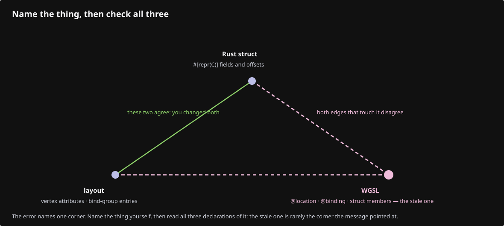

# Reading failures

Most of the time you lose goes to an error that already told you the answer. Three habits solve almost every wgpu failure; then the ten this course actually produces.

## Habit 1 · Three declarations must agree

Almost every validation error in wgpu is the same bug wearing different clothes: **one thing is declared in three places and you changed only two.**


When something is wrong, name the thing (a vertex attribute, a binding, a uniform field, a texture format) and check all three. The error names one of them; the bug is usually in another.



## Habit 2 · Read the error, all of it

wgpu's validation messages are long and they bury the useful line in the middle. Read to the end.

- In the **browser**, errors arrive asynchronously and print to the devtools console. The viewer also installs `on_uncaptured_error`, so a GPU error reaches the error panel instead of vanishing (`src/engine/gpu/device.rs`).
- A **Rust panic** in wasm prints a proper stack trace only because `console_error_panic_hook::set_once()` runs first in `lib.rs`. Without it you get `unreachable executed` and nothing else.
- **Natively** (`cargo xtest`, the selftest binary) the same errors print to stderr, and naga validates every shader in a unit test — which is the cheapest place to catch WGSL mistakes.

## Habit 3 · Bisect the frame

When the canvas is wrong but nothing errors, cut the frame down until the picture changes:

- clear to an ugly colour — if you do not see it, the frame is not reaching the screen at all, and nothing after that matters;
- draw one object, not the scene;
- disable the depth test (`DepthMode::Always`), then the ink pass, then MSAA;
- move the camera to a known view (keys 1–7, `C`, Space; natively `VIEWER_VIEW=top`, `VIEWER_ORTHO`, `VIEWER_DISTANCE_SCALE=5`).

The first change that alters the picture is next to the bug.

---

## The ten failures

### 1 · The canvas is black

Black is the *background clear* colour before anything draws, so black means "nothing drew" — many causes, one method. In order:

- Did the first frame even run? The status line is HTML, not WebGPU — if it is stuck on the loading message, the failure is in the setup chain, not in drawing.
- Is the canvas sized? A canvas with zero width configures a zero-sized surface and every draw is clipped away.
- Is the geometry in front of the camera? See failure 6.
- Is depth clearing right? With reverse-Z the clear value is `0.0` and the compare is `Greater`; clear to `1.0` by habit and every fragment fails the test, silently.

Patience first: the first frame in a fresh browser profile compiles every pipeline — on a slow integrated GPU, seconds of black before anything appears.

### 2 · Shader compilation failure

```text
error: the type of `broken` is expected to be `u32`, but got `bool`
```

naga tells you the line. The traps that are not typos:

- **`select(f, t, cond)` takes the false value first.** `select(a, b, c)` is `c ? b : a`, the opposite of every ternary you have written.
- A `var` without an initializer is zero, not undefined — but a `let` used before assignment will not compile.
- An entry point must return everything its `@location` declarations promise; a missing field is a compile error, a *wrongly typed* one is a confusing cast.

Catch these without a browser: `cargo xtest` parses every lane shader with naga.

### 3 · Wrong vertex layout

The symptom is not an error. It is **geometry that looks shredded**: triangles stretched to the horizon, or a mesh that flickers as the camera moves.

- The `array_stride` disagrees with `size_of::<Vertex>()`, so every vertex after the first reads from the middle of its neighbour.
- An attribute `offset` is wrong, so position reads the normal's bytes.
- `#[repr(C)]` is missing, and Rust reordered the fields behind your back.

The rule: write the layout from `offset_of!`, never from a count of bytes in your head.

### 4 · Bind-group-layout mismatch

```text
Binding 0 has a different type (Buffer { ty: Uniform, .. }) than the one in the layout (buffer storage)
```

This is Habit 1 in its purest form. The pipeline was compiled against a *layout*; the draw supplied a *group*; the shader declared `@group`/`@binding`. All three. In this viewer the scene contract (`src/shaders/scene.wgsl`) exists precisely so that groups 0 to 2 are declared once instead of in every lane shader.

### 5 · Invalid buffer usage

```text
Usage flags BufferUsages(VERTEX) of Buffer with 'arena' label do not contain required usage flags BufferUsages(COPY_DST)
```

Usage flags are fixed at creation and wgpu forgives none. If the CPU will ever write into a buffer again, it needs `COPY_DST` *at creation*, not at the write. It teaches the habit of asking, for every buffer: who writes this, and when?

### 6 · The object is behind the camera

Nothing errors; the screen is empty. Test it in this order:

- print the clip-space position of one known vertex: if `w` is negative, it is behind the eye;
- if `x/w` or `y/w` is outside −1..1, it is off screen;
- if `z/w` is outside the depth range, the near or far plane ate it.

In this viewer a *deliberately* invisible vertex is parked at `(3, 3, 0.5, 1)` by `dead_vertex`, which is exactly this failure used on purpose.

### 7 · Wrong matrix order

Matrix multiplication does not commute, and the wrong order produces a picture that is wrong in a *plausible* way: the object moves when it should spin, or spins around the wrong point.

- The chain is `projection * view * model * position`, applied right to left.
- WGSL's `m * v` is column-vector convention; a matrix built for row vectors comes out transposed.
- If the object orbits when the camera should, you have inverted the view matrix (or failed to).

Change one factor at a time and watch what moves.

### 8 · Surface resize problems

- The picture is stretched or half the canvas is stale: the surface was not reconfigured after the resize, so its texture is still the old size.
- The picture is crisp on one machine and blurry on another: you sized in CSS pixels where physical pixels were needed. `devicePixelRatio` is the only difference. This viewer reads it in two deliberate places: `device_pixel_ratio` (capped by `?dpr=`, used to size the canvas) and `surface_per_physical` (uncapped, used to convert pointer positions onto the surface actually drawn).
- Everything breaks when the window is dragged small: a zero-sized surface is invalid; clamp to at least 1.

The depth texture is sized too. A resize that forgets it fails with a mismatch on the next pass.

### 9 · Stale GPU data

The scene shows what it showed a moment ago, or half of each.

- A buffer was written but the frame was not requested: on the web nothing redraws by itself, so every state change must call `touch`/`request_redraw`.
- A buffer grew and the bind group still points at the old one: a new buffer needs a new bind group.
- An asynchronous read (a pick, a ranged fetch) landed after the thing it described was replaced. This viewer stamps such answers with a `generation` counter and drops the ones that come back late — a pattern worth stealing.

### 10 · Picking coordinate mismatch

The click selects an object slightly up and to the left, or nothing at all. The pointer travels through four coordinate systems, and picking works only when all four agree:


- An offset by a constant means the event was page-relative, not canvas-relative.
- An offset that grows toward one corner means a missing (or doubled) `devicePixelRatio`.
- Correct on one machine, wrong on a HiDPI laptop: the same bug, revealed.
- Nothing is ever hit: the id pass may be rendering with a different camera than the visible pass — they must share the frame's matrices.

---

## When it is not your code

A few failures are environmental, and recognising them saves hours:

- **`navigator.gpu is undefined`** — WebGPU is off or the page is not on a secure origin. `http://127.0.0.1` counts as secure; a plain LAN IP does not.
- **Device lost** — the browser took the GPU away (a driver reset, a laptop lid). The viewer keeps the reason and reports it; recovery means rebuilding the device, not retrying the draw.
- **It works natively, not in the browser** — different adapter, different limits. Check `downlevel` limits before blaming the code.

## Getting back to solid ground

You can always rebuild any checkpoint exactly:

```bash
python3 docs/reconstruction/replay.py --output /tmp/at-07 --through 07
```

Diff your tree against it. The first file that differs is where your lesson went sideways — and diffing your own mistake against a correct file is one of the fastest ways to learn.
