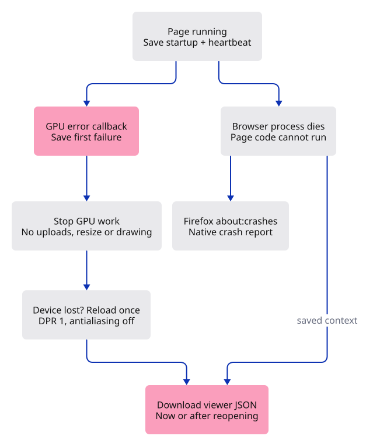
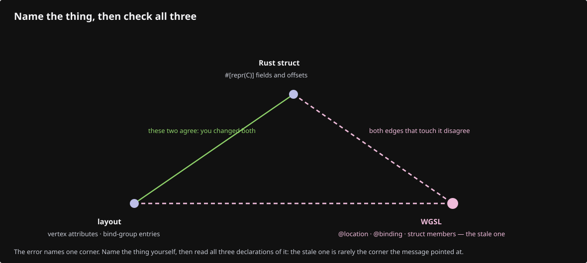
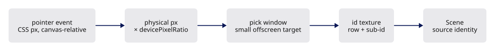

# Reading failures

**Allow 20–30 minutes for the browser checks below.** You do not need to rebuild your project to investigate a browser failure. First find out which part stopped: the page, the GPU device, or the browser itself.

## Open the viewer in Chrome on Linux

Start the viewer from `session/session_viewer` with `trunk serve`. In another terminal, run:

```sh
./docs/open-chrome.sh http://127.0.0.1:8770/
```

The launcher opens a separate Chrome profile with the Vulkan settings used for the local viewer check. Your ordinary Chrome window keeps its own profile. Close this viewer profile before changing its launch settings; an already running Chrome process can keep its old flags.

Open `chrome://gpu` in that window. Check the WebGPU status and the adapter name. Then return to the viewer, select an object, orbit, and resize the window. A browser exposing `navigator.gpu` has passed only the first check; it must also obtain a device and draw a real frame. Chrome's [GPU testing guide](https://developer.chrome.com/blog/supercharge-web-ai-testing) explains these separate checks and Vulkan launch options. The launcher's `--enable-unsafe-webgpu` option bypasses Chrome's adapter blocklist for this dedicated development profile.

Use HTTPS or localhost. A plain `http://192.168…` address is a different security context and may hide WebGPU. The viewer cannot enable a browser feature from inside the page. It has no WebGL fallback.

## Keep the evidence when something fails

The page saves a small diagnostic record before WebAssembly starts. It records the browser, adapter, viewport, first reported error, and recent diagnostic events. A heartbeat updates every 15 seconds. It retains at most four runs in this browser profile on this origin; private browsing or storage restrictions can prevent persistence.

When the page catches a fatal error, it attempts to download `session-viewer-….json`. If Chrome blocks that automatic download, press **Download diagnostic report** in the banner. Reloading after a failed or interrupted run also offers its saved report. Read the file before sharing it: error messages can contain scene names or paths. Geometry and keystrokes are not collected.



There are two different failures to recognise:

- **The page is still alive.** A Rust panic, JavaScript error, or WebGPU error can reach our handler. The viewer saves its reason and stops GPU work. A device loss can trigger one reload with DPR 1 and antialiasing off. A second loss shows the error instead of reloading again.
- **The browser process died.** The page cannot execute JavaScript or write a file after that happens. Its saved heartbeat is useful context, but it is not a native crash dump. An interrupted run can also mean a killed tab or a power failure.

The reported Firefox 156.0.1 crash on Intel Mesa/iris 25.2.8 used the message `Cannot get non-existent resource QueueId(0,2)`. That report identifies a browser-side queue-resource failure; it does not establish the underlying cause. The viewer now checks device failure before processing loader messages, UI, resizing and rendering. This closes a path that could keep using a lost device, but it does not prove the Firefox crash is fixed.

For another Firefox crash, reopen Firefox and enter `about:crashes`. Keep its report alongside the viewer JSON and the actions you performed just before failure. Mozilla documents how to [view native Firefox crash reports](https://support.mozilla.org/en-US/kb/mozillacrashreporter). The viewer does not submit either report automatically.

## Understand which element owns a joint

The graph answers “which two elements are connected?” The element's feature list answers “which element owns this visible geometry?” These are separate jobs.

```cpp
wood_session.add_interaction(beam, column, joint); // Beam owns the beam-joint feature.
wood_session.add_interaction(column, beam, joint); // Column now owns that feature.
```

For contacts and beam joints, the first argument chooses the host, even if the graph edge already exists in the opposite order. Reusing the same beam joint moves its feature; it does not add a second copy. Contact face indices are relative to the chosen host. Plate joints contain two explicitly named sides, so each plate keeps its own side.

The viewer reads those feature lists from the saved document. Turn on `Element Interactions On`, select the host, then hide it: the attached feature should disappear with it. After changing ownership in Wood, save the document again and reload that scene. Reopening an old file cannot show a change that was never saved.

The rest of this page helps you locate mistakes inside your own rendering code.

## Habit 1 · Three declarations must agree

Almost every validation error in wgpu is the same bug wearing different clothes: **one thing is declared in three places and you changed only two.**


When something is wrong, name the thing (a vertex attribute, a binding, a uniform field, a texture format) and check all three. The error names one of them; the bug is usually in another.



## Habit 2 · Read the error, all of it

wgpu's validation messages are long and they bury the useful line in the middle. Read to the end.

- In the **browser**, errors arrive asynchronously and print to the devtools console. The viewer also installs `on_uncaptured_error`, so a GPU error reaches the error panel instead of vanishing (`src/engine/gpu/device.rs`).
- A **Rust panic** in wasm reaches the hook installed in `lib.rs`. It saves the diagnostic first, then asks `console_error_panic_hook` to print the stack trace. Without a hook you may only see `unreachable executed`.
- **Natively** (`cargo xtest`, the selftest binary) the same errors print to stderr, and naga validates every shader in a unit test — the cheapest place to catch WGSL mistakes.

## Habit 3 · Bisect the frame

When the canvas is wrong but nothing errors, cut the frame down until the picture changes:

- clear to an ugly colour — if you do not see it, the frame is not reaching the screen at all, and nothing after that matters;
- draw one object, not the scene;
- disable the depth test (`DepthMode::Always`), then the ink pass, then MSAA;
- move the camera to a known view (keys 1–7, `C`, Space; natively `VIEWER_VIEW=top`, `VIEWER_ORTHO`, `VIEWER_DISTANCE_SCALE=5`).

The first change that alters the picture is next to the bug.

---

## The ten failures

### 1 · The canvas is black

Black is the *background clear* colour before anything draws, so black means "nothing drew" — many causes, one method. In order:

- Did the first frame even run? The status line is HTML, not WebGPU — if it is stuck on the loading message, the failure is in the setup chain, not in drawing.
- Is the canvas sized? A canvas with zero width configures a zero-sized surface and every draw is clipped away.
- Is the geometry in front of the camera? See failure 6.
- Is depth clearing right? With reverse-Z the clear value is `0.0` and the compare is `Greater`; clear to `1.0` by habit and every fragment fails the test, silently.

Patience first: the first frame in a fresh browser profile compiles every pipeline — on a slow integrated GPU, seconds of black before anything appears.

### 2 · Shader compilation failure

```text
error: the type of `broken` is expected to be `u32`, but got `bool`
```

naga tells you the line. The traps that are not typos:

- **`select(f, t, cond)` takes the false value first.** `select(a, b, c)` is `c ? b : a`, the opposite of every ternary you have written.
- A `var` without an initializer is zero, not undefined — but a `let` used before assignment will not compile.
- An entry point must return everything its `@location` declarations promise; a missing field is a compile error, a *wrongly typed* one is a confusing cast.

Catch these without a browser: `cargo xtest` parses every lane shader with naga.

### 3 · Wrong vertex layout

The symptom is not an error. It is **geometry that looks shredded**: triangles stretched to the horizon, or a mesh that flickers as the camera moves.

- The `array_stride` disagrees with `size_of::<Vertex>()`, so every vertex after the first reads from the middle of its neighbour.
- An attribute `offset` is wrong, so position reads the normal's bytes.
- `#[repr(C)]` is missing, and Rust reordered the fields behind your back.

The rule: write the layout from `offset_of!`, never from a count of bytes in your head.

### 4 · Bind-group-layout mismatch

```text
Binding 0 has a different type (Buffer { ty: Uniform, .. }) than the one in the layout (buffer storage)
```

This is Habit 1 in its purest form. The pipeline was compiled against a *layout*; the draw supplied a *group*; the shader declared `@group`/`@binding`. All three. In this viewer the scene contract (`src/shaders/scene.wgsl`) declares groups 0 to 2 once instead of in every lane shader.

### 5 · Invalid buffer usage

```text
Usage flags BufferUsages(VERTEX) of Buffer with 'arena' label do not contain required usage flags BufferUsages(COPY_DST)
```

Usage flags are fixed at creation and wgpu forgives none. If the CPU will ever write into a buffer again, it needs `COPY_DST` *at creation*, not at the write. Ask of every buffer: who writes this, and when?

### 6 · The object is behind the camera

Nothing errors; the screen is empty. Test it in this order:

- print the clip-space position of one known vertex: if `w` is negative, it is behind the eye;
- if `x/w` or `y/w` is outside −1..1, it is off screen;
- if `z/w` is outside the depth range, the near or far plane ate it.

In this viewer `dead_vertex` parks a *deliberately* invisible vertex at `(3, 3, 0.5, 1)` — this failure used on purpose.

### 7 · Wrong matrix order

Matrix multiplication does not commute, and the wrong order is wrong *plausibly*: the object moves when it should spin, or spins around the wrong point.

- The chain is `projection * view * model * position`, applied right to left.
- WGSL's `m * v` is column-vector convention; a matrix built for row vectors comes out transposed.
- If the object orbits when the camera should, you have inverted the view matrix (or failed to).

Change one factor at a time and watch what moves.

### 8 · Surface resize problems

- The picture is stretched or half the canvas is stale: the surface was not reconfigured after the resize, so its texture is still the old size.
- The picture is crisp on one machine and blurry on another: you sized in CSS pixels where physical pixels were needed. `devicePixelRatio` is the only difference. This viewer reads it in two deliberate places: `device_pixel_ratio` (capped by `?dpr=`, used to size the canvas) and `surface_per_physical` (uncapped, used to convert pointer positions onto the surface actually drawn).
- Everything breaks when the window is dragged small: a zero-sized surface is invalid; clamp to at least 1.

The depth texture is sized too. A resize that forgets it fails with a mismatch on the next pass.

### 9 · Stale GPU data

The scene shows what it showed a moment ago, or half of each.

- A buffer was written but the frame was not requested: on the web nothing redraws by itself, so every state change must call `touch`/`request_redraw`.
- A buffer grew and the bind group still points at the old one: a new buffer needs a new bind group.
- An asynchronous read (a pick, a ranged fetch) landed after the thing it described was replaced. This viewer stamps such answers with a `generation` counter and drops the ones that come back late — a pattern worth stealing.

### 10 · Picking coordinate mismatch

The click selects an object slightly up and to the left, or nothing at all. The pointer travels through four coordinate systems, and picking works only when all four agree:



- An offset by a constant means the event was page-relative, not canvas-relative.
- An offset that grows toward one corner means a missing (or doubled) `devicePixelRatio`.
- Correct on one machine, wrong on a HiDPI laptop: the same bug, revealed.
- Nothing is ever hit: the id pass may be rendering with a different camera than the visible pass — they must share the frame's matrices.

---

## When it is not your code

A few failures are environmental, and recognising them saves hours:

- **`navigator.gpu is undefined`** — WebGPU is off or the page is not on a secure origin. `http://127.0.0.1` counts as secure; a plain LAN IP does not.
- **Device lost** — the browser took the GPU away (a driver reset, a laptop lid). The viewer keeps the reason and reports it; recovery means rebuilding the device, not retrying the draw.
- **It works natively, not in the browser** — different adapter, different limits. Check `downlevel` limits before blaming the code.

## Getting back to solid ground

Every checkpoint is a complete crate under `docs/lessons/<id>/`:

```bash
diff -r docs/lessons/07/src src
```

Diff your tree against it. The first file that differs is where your lesson went sideways.
